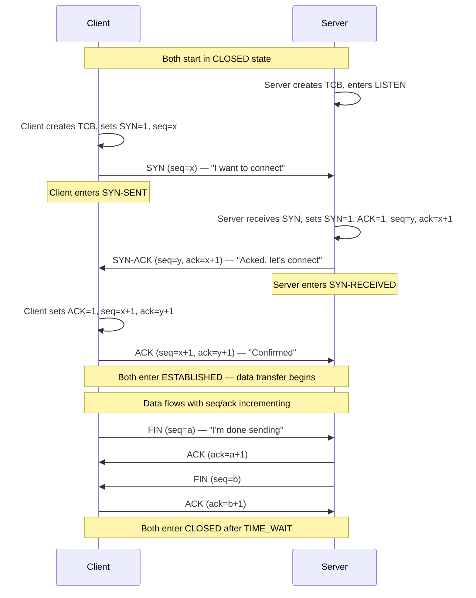
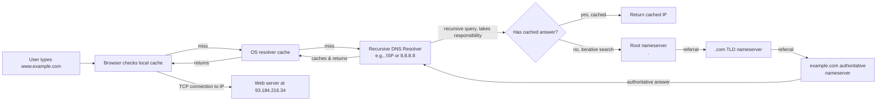
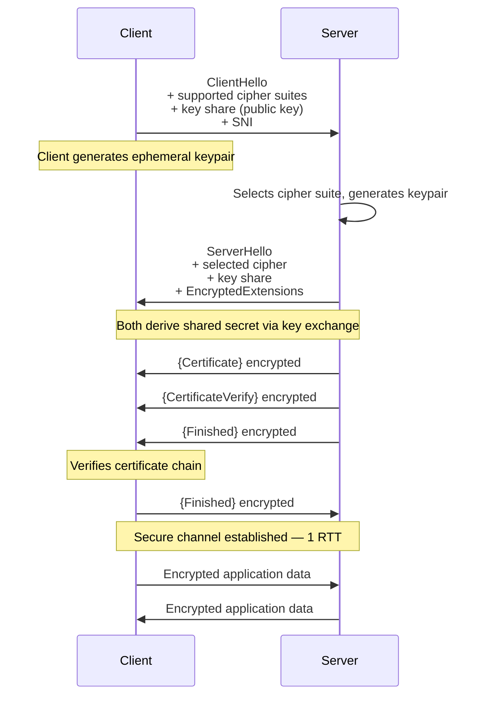
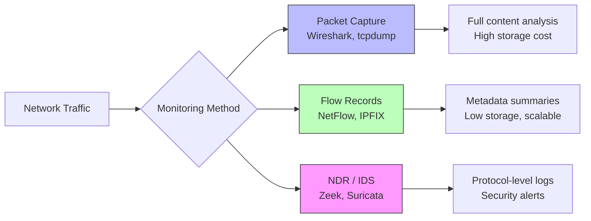

# Fundamentals of Network Traffic Flow

## TCM Exam Objectives

- Trace the end-to-end packet journey: encapsulation at source, hop-by-hop traversal, decapsulation at destination
- Describe the TCP three-way handshake (SYN → SYN-ACK → ACK) and connection teardown
- Explain switching (MAC address table) vs. routing (IP routing table / longest prefix match)
- Describe DNS resolution flow: recursive → root → TLD → authoritative
- Compare TLS 1.3 handshake (1-RTT) with TLS 1.2 (2-RTT) and identify key security improvements
- Identify network fingerprints of common attacks: port scanning, SYN flood, C2 beaconing, data exfiltration

**Network traffic flow is the end-to-end journey of data across the OSI/TCP-IP stack — encapsulated at the source, switched and routed hop-by-hop across networks, and decapsulated at the destination — with each layer adding its own header (ports, IP addresses, MAC addresses, bits) and each device (switch, router, firewall, NAT) reading only the layers it needs to forward the packet toward its goal.**【turn0search0】【turn0search3】 Understanding this flow end-to-end is the foundation that everything else in networking, security monitoring, and SOC analysis builds on — because you cannot detect what you cannot see, and you cannot see what you do not understand at the packet level.

## The Packet Lifecycle at a Glance

Every byte you send — a web request, an email, a DNS query — follows the same structural journey. Data is wrapped in headers as it descends the stack (encapsulation), traverses the network as a series of frames/packets/segments, and is unwrapped as it ascends the stack at the destination (decapsulation).【turn0search0】【turn0search3】

```mermaid
flowchart LR
    A[Application Data<br/>HTTP request] -->|encapsulation| T[Transport<br/>+ TCP header: ports, seq]
    T --> N[Network<br/>+ IP header: src/dst IP]
    N --> D[Data Link<br/>+ Ethernet header: src/dst MAC + trailer]
    D --> P[Physical<br/>bits on the wire]
    P -->|transmission| NET[Network Path<br/>switch → router → firewall → NAT → router → switch]
    NET --> P2[Physical<br/>bits received]
    P2 -->|decapsulation| D2[Data Link<br/>reads MAC, strips header]
    D2 --> N2[Network<br/>reads IP, strips header]
    N2 --> T2[Transport<br/>reads port, reassembles]
    T2 --> A2[Application<br/>HTTP response delivered]
```

The same data structure is read differently at each hop — a switch reads only the Layer 2 MAC header, a router reads the Layer 3 IP header, a firewall may inspect up to Layer 7, and only the final destination decapsulates all the way back to the application payload.【turn1search12】【turn1search14】

## Master Comparison: The OSI Layers and Traffic Flow

The OSI model describes seven layers that computer systems use to communicate over a network, each handling a specific abstraction of the communication task.【turn0search2】

| Layer | Name | PDU (Protocol Data Unit) | Addressing | Key Protocols | Device Examples | What Happens to Traffic |
|---|---|---|---|---|---|---|
| 7 | Application | Data | URLs, hostnames | HTTP, HTTPS, DNS, SMTP, SSH | — | User-facing data generated; protocols define semantics |
| 6 | Presentation | Data | — | TLS, SSL, JPEG, MIME | — | Encryption, compression, encoding applied |
| 5 | Session | Data | — | NetBIOS, RPC, SOCKS | — | Sessions established/maintained/terminated |
| 4 | Transport | Segment (TCP) / Datagram (UDP) | **Port numbers** | TCP, UDP, QUIC | Firewall (L4), Load balancer | End-to-end delivery, reliability, flow control, multiplexing via ports |
| 3 | Network | Packet | **IP addresses** | IPv4, IPv6, ICMP | Router, L3 switch, firewall (L3) | Logical addressing, routing across subnets/networks |
| 2 | Data Link | Frame | **MAC addresses** | Ethernet, Wi-Fi (802.11), ARP | Switch, bridge, NIC | Frame delivery within local segment, physical addressing |
| 1 | Physical | Bits | — | Ethernet PHY, fiber, radio | Cable, hub, transceiver | Raw bit transmission over the medium |

Sources: 【turn0search2】【turn0search3】【turn1search12】

**Encapsulation** wraps data with protocol-specific information as it moves down the stack on the sender's side — each layer attaches a header (and sometimes a trailer) containing metadata the corresponding layer on the receiving device needs.【turn0search3】 **Decapsulation** is the reverse: each layer on the receiving side reads and strips its header, passing the payload up to the next layer until the original application data is reassembled.【turn0search0】【turn0search4】

---

## Module 1 — TCP vs UDP: The Transport Layer Decision

The transport layer (Layer 4) is where the fundamental choice of *reliability vs. speed* is made. TCP and UDP take radically different approaches to delivering data between applications, identified by port numbers.【turn0search10】【turn0search12】

| Dimension | TCP (Transmission Control Protocol) | UDP (User Datagram Protocol) |
|---|---|---|
| **Connection model** | Connection-oriented — requires handshake before data | Connectionless — sends datagrams with no setup |
| **Reliability** | Reliable — guarantees delivery, order, retransmission | Unreliable — no delivery, order, or duplication guarantees |
| **Overhead** | High (20-byte header + state, ACKs, retransmissions) | Low (8-byte header, minimal state) |
| **Speed** | Slower due to reliability mechanisms | Faster — fire-and-forget |
| **Communication model** | Unicast (one-to-one) | Unicast, multicast, broadcast |
| **Header contents** | Seq/ack numbers, flags (SYN/ACK/FIN/RST), window size, checksum | Source/dest port, length, checksum |
| **Use cases** | Web (HTTP), email (SMTP), file transfer (FTP/SSH), databases | DNS, video/audio streaming, gaming, VoIP, QUIC |
| **Common port examples** | 80 (HTTP), 443 (HTTPS), 22 (SSH), 25 (SMTP) | 53 (DNS), 123 (NTP), 161 (SNMP), 443 (QUIC/HTTP3) |

Sources: 【turn0search10】【turn0search11】【turn0search12】【turn0search13】

**TCP** creates a secure communication line and verifies receipt of every segment — if data is lost or corrupted, TCP retransmits until the receiver confirms delivery. This reliability comes at the cost of latency and overhead.【turn0search11】【turn0search12】

**UDP** sends datagrams without establishing a connection or confirming receipt. It's the right choice when speed matters more than perfect delivery — real-time video can tolerate a lost frame but not the delay of a retransmission.【turn0search11】【turn0search13】

---

## Module 2 — The TCP Three-Way Handshake

TCP is connection-oriented, meaning a session must be established before data flows. The **three-way handshake** (SYN → SYN-ACK → ACK) is the process by which TCP synchronizes sequence numbers and establishes state on both sides before data transfer.【turn0search6】【turn0search7】【turn0search9】

**Key TCP flags** control connection state:【turn0search8】
- **SYN** — synchronize sequence numbers (initiate connection)
- **ACK** — acknowledge receipt of packets
- **FIN** — finish (graceful close, one side done sending)
- **RST** — reset (abortive close, error condition)
- **PSH** — push data immediately to application
- **URG** — urgent pointer field is valid

The SYN packet consumes a sequence number even though it carries no data, and every subsequent data byte increments the sequence number — this is how TCP tracks ordering and detects loss.【turn0search9】 Connection teardown uses a four-way FIN/ACK exchange (each side closes independently), with the initiating side entering TIME_WAIT to catch any delayed packets before fully closing.【turn0search9】

📌 **Exam Tip:** Memorize the TCP flags: SYN (initiate), ACK (acknowledge), FIN (graceful close), RST (abort/error), PSH (push immediately), URG (urgent). SYN scan (half-open) sends SYN, receives SYN-ACK, sends RST instead of ACK — never completes the handshake. This avoids logging on some systems.

The handshake matters for security analysts because it's the fingerprint of connection establishment — half-open SYN floods (DDoS), SYN scans (Nmap stealth scanning), and abnormal session patterns all deviate from the expected SYN→SYN-ACK→ACK sequence.【turn0search6】

---

## Module 3 — Ports, Sockets, and Connections

At the transport layer, **ports** multiplex multiple conversations onto a single IP address. A **socket** is the combination of an IP address and a port number — the endpoint address for a TCP or UDP conversation — and a TCP connection is uniquely identified by the 4-tuple: (source IP, source port, destination IP, destination port).【turn0search5】

**How a typical client-server connection works:**
1. The server binds to a **well-known port** (e.g., 80 for HTTP, 443 for HTTPS, 22 for SSH) and listens for incoming connections
2. The client allocates an **ephemeral port** (typically 49152–65535 on modern systems) for its side of the conversation
3. The 4-tuple (client IP, client ephemeral port, server IP, server well-known port) uniquely identifies the session
4. Multiple clients can connect to the same server port simultaneously because each has a distinct 4-tuple【turn0search5】

This is why a single web server on port 443 can serve thousands of concurrent clients — the OS tracks each connection by its unique 4-tuple, not by port alone.

---

## Module 4 — Switching and Routing: How Packets Actually Move

Traffic crosses two distinct kinds of devices on its journey: **switches** that move frames within a local network segment (Layer 2), and **routers** that move packets between different networks (Layer 3).【turn1search10】【turn1search12】

📌 **Exam Tip:** Key distinction: switches forward based on MAC address (L2), routers forward based on IP address (L3). Switches operate within a single broadcast domain (subnet/VLAN). Routers connect different broadcast domains. If the destination IP is on a different subnet, the frame goes to the default gateway (router).

### Switching (Layer 2 — MAC addresses)

A switch builds and maintains a **MAC address table** (also called CAM table or forwarding table) that maps each learned MAC address to the switch port where it was seen. When a frame arrives:【turn1search10】【turn1search13】

1. The switch reads the **destination MAC address** from the frame header
2. It looks up that MAC in its MAC table
3. If found, it forwards the frame **only out that specific port** (unicast)
4. If not found (or if it's a broadcast/MAC ff:ff:ff:ff:ff:ff), it **floods** the frame out all ports except the incoming port
5. The switch learns source MAC addresses from incoming frames and adds them to the table — this is how the table populates automatically

Switches operate entirely within a single broadcast domain (a single subnet/VLAN). They don't look at IP addresses — that's the router's job.【turn1search14】

### Routing (Layer 3 — IP addresses)

When the destination IP is on a **different subnet**, the host sends the frame to its **default gateway** (a router). The router:【turn1search12】【turn1search14】

1. Receives the frame (destined to the router's MAC address)
2. Strips the Layer 2 header and reads the **destination IP address**
3. Looks up the destination IP in its **routing table** to find the best match (longest prefix match)
4. Determines the next-hop interface and the next-hop MAC address
5. Re-encapsulates the packet in a new Layer 2 frame with the new source/destination MAC addresses
6. Forwards the frame out the appropriate interface

The routing table contains entries mapping destination network prefixes to next-hop addresses and interfaces — this is how packets traverse multiple hops from source to destination across the internet.【turn1search10】【turn1search12】

### NAT (Network Address Translation)

NAT enables multiple devices on a private network to share a single public IP address when accessing the internet. The NAT device (typically a router or firewall) maintains a **translation table** that maps internal (private IP, private port) tuples to external (public IP, public port) tuples, rewriting the source IP and port on outgoing packets and the destination on incoming packets.【turn0search16】【turn0search19】

NAT serves three purposes: it conserves the scarce IPv4 address space (allowing thousands of private devices to share one public IP), it hides internal network topology from external networks (providing a layer of security-by-obscurity), and it uses Port Address Translation (PAT) to manage multiple simultaneous connections through port multiplexing.【turn0search19】

---

## Module 5 — DNS Resolution: How Names Become Addresses

Before a browser can open a TCP connection to a web server, it must resolve the human-readable hostname (e.g., `www.example.com`) to an IP address. DNS resolution uses two query types working together: **recursive** queries (where the resolver takes responsibility for finding the answer) and **iterative** queries (where the resolver follows referrals from one server to the next).【turn1search0】【turn1search2】【turn1search4】

The recursive resolver takes responsibility for finding the answer — it doesn't just refer the client onward. It follows the chain from root → TLD → authoritative, caching each referral along the way to speed up future queries.【turn1search3】【turn1search4】 The entire DNS system is essentially a distributed, hierarchical database optimized for lookups, with caching at every level to reduce load on the authoritative servers.

DNS traditionally runs on **UDP port 53** (fast, single-query-single-response), falling back to TCP for large responses exceeding 512 bytes (zone transfers, DNSSEC). Modern encrypted DNS variants — DNS over HTTPS (DoH), DNS over TLS (DoT), and DNS over QUIC (DoQ) — encrypt the query and response to prevent tampering and surveillance.【turn0search20】【turn0search22】

---

## Module 6 — TLS and the Secure Channel

Once the TCP connection is established (or the QUIC session — see below), most modern application traffic is encrypted using **TLS (Transport Layer Security)**. TLS sits between the transport layer and the application layer, providing confidentiality, integrity, and authentication.【turn1search9】

### TLS 1.3 Handshake (the modern standard)

TLS 1.3 radically simplified the handshake compared to TLS 1.2 — reducing it to a single round trip (1-RTT) and encrypting everything after the ServerHello, including the certificate exchange.【turn1search5】【turn1search8】

The key innovation in TLS 1.3 is that the **key exchange begins in the ClientHello** — the client sends its public key share immediately, so by the time the server responds with its key share, both sides can derive the shared secret and encrypt everything that follows. This is faster than TLS 1.2 (which required a separate key exchange round trip) and more private (the certificate is encrypted, so passive observers can't see which server the client is connecting to).【turn1search6】【turn1search8】【turn1search9】

For security analysts, TLS matters because **it encrypts the application payload** — the SOC can see the connection (src/dst IP, ports, SNI, certificate) but cannot inspect the content without TLS interception (man-in-the-middle proxy). This is the fundamental tension that drove the rise of encrypted traffic analysis and the shift toward endpoint-based detection (EDR) for visibility into decrypted content.

---

## Module 7 — QUIC and HTTP/3: The Modern Transport

QUIC (Quick UDP Internet Connections) is a modern transport protocol originally developed by Google and standardized by the IETF, designed to overcome TCP's inherent limitations. HTTP/3 runs on top of QUIC and was adopted as an IETF standard in 2022.【turn0search21】【turn0search23】

**Why QUIC exists — TCP's limitations:**
- TCP requires a handshake (SYN/SYN-ACK/ACK) *before* the TLS handshake can begin — two sequential round trips before encrypted data flows
- HTTP/2 multiplexes multiple streams over a single TCP connection, but if any TCP packet is lost, **all streams are blocked** (head-of-line blocking) until the loss is recovered
- TCP's congestion control lives in kernel space, making it slow to evolve

**How QUIC solves this:**
- Built on **UDP** — no TCP handshake overhead
- **Integrates TLS 1.3** directly into the transport layer (not as an additional layer) — the combined handshake reaches an encrypted session in a single round trip (1-RTT), or even 0-RTT for returning connections【turn0search24】
- **Independent streams** — multiple streams within a connection are isolated, so packet loss on one stream doesn't block others【turn0search21】
- **Connection migration** — sessions survive network changes (e.g., Wi-Fi to cellular) because QUIC uses connection IDs rather than the 4-tuple to identify sessions【turn0search20】
- **User-space congestion control** — algorithms can iterate faster than kernel TCP stacks【turn0search21】

QUIC's adoption is accelerating — DNS over QUIC delivers ~10% faster page loads than DoH, and major platforms (Google, Cloudflare, Facebook) serve traffic over HTTP/3 by default.【turn0search20】【turn0search22】 For security analysts, QUIC presents a new visibility challenge: all traffic is encrypted UDP on port 443, and traditional TCP-based analysis techniques (handshake inspection, sequence number tracking) don't apply.

---

## Module 8 — End-to-End Packet Walkthrough

Let's trace a complete request — a user typing `https://example.com` in their browser — through every layer and device:

**Phase 1 — Application & Resolution (Layers 5-7)**
1. Browser parses the URL, extracts hostname `example.com`
2. Browser/OS checks local DNS cache — miss
3. OS sends recursive DNS query to configured resolver (e.g., 8.8.8.8 over UDP/53 or DoH)
4. Resolver resolves via root → .com TLD → example.com authoritative, returns `93.184.216.34`
5. Browser initiates TLS-secured HTTP request to that IP

**Phase 2 — Transport & Session (Layer 4)**
6. OS allocates ephemeral source port (e.g., 54321), destination port 443
7. TCP three-way handshake: SYN (seq=x) → SYN-ACK (seq=y, ack=x+1) → ACK (seq=x+1, ack=y+1)
8. Connection state ESTABLISHED on both sides

**Phase 3 — TLS Negotiation (Layer 6)**
9. ClientHello + key share sent
10. ServerHello + key share + encrypted certificate + Finished
11. Client verifies certificate, sends Finished
12. Secure channel established — 1 RTT

**Phase 4 — Network Encapsulation (Layer 3)**
13. HTTP GET request encrypted as TLS records
14. TCP segments the data, adds headers (src port 54321, dst port 443, seq numbers)
15. IP layer adds header: src 192.168.1.50 (private), dst 93.184.216.34 (public)

**Phase 5 — Data Link & Physical (Layers 1-2)**
16. Host checks if destination IP is on local subnet — it's not (different network)
17. Host ARPs for default gateway's MAC address (e.g., 192.168.1.1 → MAC aa:bb:cc:dd:ee:ff)
18. Ethernet frame created: src MAC = host NIC, dst MAC = gateway, type = IPv4
19. Frame converted to bits, transmitted over the wire/Wi-Fi

**Phase 6 — Network Traversal (switches, routers, NAT)**
20. **Switch** reads dst MAC (gateway), looks up in MAC table, forwards out the uplink port
21. **Default gateway/router** receives frame, strips L2 header, reads dst IP (93.184.216.34)
22. Router looks up destination in routing table → forwards out WAN interface to ISP next-hop
23. **NAT** rewrites src IP from 192.168.1.50 (private) to public IP, records translation in NAT table
24. New frame created with router's WAN MAC as source, ISP next-hop MAC as destination
25. Process repeats across multiple ISP routers — each reads dst IP, looks up next hop, re-encapsulates with new L2 headers (L3 IP header stays the same end-to-end)

**Phase 7 — Arrival & Decapsulation**
26. Final router delivers frame to example.com's network
27. Destination switch reads dst MAC (server NIC), forwards to server port
28. Server NIC receives bits → frame → strips L2 header → reads IP header → strips → reads TCP header → reassembles segments → reads TLS records → decrypts → delivers HTTP GET to web server application

The entire round trip — DNS + TCP handshake + TLS handshake + HTTP request + HTTP response — typically completes in 50-200ms for a nearby server, invisible to the user but representing thousands of individual operations across the stack.

---

## The Security Analyst's View: Why Traffic Flow Fundamentals Matter

For SOC analysts, network traffic fundamentals are not academic — they're the literal language of detection. Every attack leaves network fingerprints, and reading them requires fluency in the protocols and patterns described above.【turn0search25】【turn0search27】

### Packet Capture and Flow Analysis

Network traffic analysis uses two complementary data sources:【turn0search25】【turn0search27】

- **Packet capture (PCAP)** — full packet content (headers + payload) captured at a network tap or SPAN port; maximum fidelity but high storage and processing cost. Tools: **Wireshark** (interactive analysis), **tshark** (command-line), **tcpdump** (capture).
- **Flow records** — metadata summaries of conversations (src/dst IP, ports, bytes, packets, timestamps) exported by routers/switches via NetFlow, IPFIX, or sFlow; lower fidelity but far more scalable for monitoring high-bandwidth links.

📌 **Exam Tip:** Know the three analysis tool categories: Packet Capture (PCAP) = full content (Wireshark, tcpdump), Flow Records = metadata summaries (NetFlow, IPFIX, sFlow), Security Monitoring = protocol-level logs (Zeek, Suricata). Zeek generates connection logs (conn.log), DNS logs (dns.log), HTTP logs (http.log), and SSL logs (ssl.log).

### Core Analysis Tools

- **Wireshark** — the industry-standard packet analyzer; captures from network interfaces in promiscuous mode and displays every packet with full protocol dissection. Used across enterprise SOCs for protocol debugging, incident investigation, and malware traffic analysis.【turn1search18】
- **Zeek** (formerly Bro) — the leading open-source network security monitoring platform; passively observes traffic and generates rich log files (conn.log, dns.log, http.log, ssl.log, files.log) that capture application-layer semantics — not just packets, but *what the packets mean*.【turn1search15】
- **Suricata** — open-source IDS/IPS that inspects traffic against signature and anomaly rules, capable of extracting files from streams and detecting protocol anomalies.【turn1search17】

### What Traffic Fundamentals Let Analysts See

Understanding the handshake, port, and protocol patterns lets analysts spot deviations that indicate attacks:

- **Port scanning** — a burst of SYN packets to many ports on one host (Nmap stealth scan = SYN without completing ACK; full connect scan = completed handshakes)
- **DDoS** — SYN floods (half-open connections overwhelming server state), UDP amplification (spoofed source, large responses)
- **C2 beaconing** — regular periodic outbound connections to suspicious IPs on non-standard ports
- **Data exfiltration** — large outbound transfers on unusual ports/protocols, DNS tunneling (encoded data in DNS queries)
- **Lateral movement** — internal SMB/RDP traffic between workstations that shouldn't be talking to each other
- **TLS anomalies** — suspicious SNI values, self-signed certificates, expired certs, JA3/JA4 fingerprint mismatches

The analyst who understands *what normal traffic looks like at each layer* can spot the abnormal — and that's the entire premise of network detection and response (NDR).【turn0search26】【turn0search27】

---

## Recap

Network traffic flow is the structured journey of data through the OSI layers — **encapsulated** with port numbers (L4), IP addresses (L3), and MAC addresses (L2) at the source, **switched** within local segments by MAC table lookup, **routed** between networks by IP routing table lookup, **NAT-translated** at the network edge, and **decapsulated** back to application data at the destination. TCP establishes reliable sessions via the three-way handshake (SYN/SYN-ACK/ACK) and guarantees ordered delivery; UDP fires datagrams with no guarantees for speed-critical applications. DNS resolves hostnames to IPs via recursive-then-iterative queries through the root/TLD/authoritative chain. TLS 1.3 encrypts the session in a single round trip, and QUIC consolidates transport + TLS into a single UDP-based protocol that solves TCP's head-of-line blocking and connection migration problems. For the SOC analyst, every layer of this stack is a detection surface — packet captures reveal protocol anomalies, flow records reveal communication patterns, and Zeek/Suricata/Wireshark turn raw traffic into the investigations that catch attacks hiding in the bytes.【turn0search0】【turn0search3】【turn0search7】【turn1search15】【turn1search18】