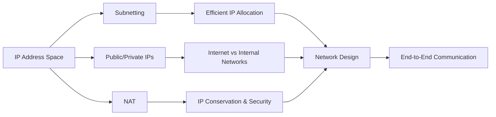
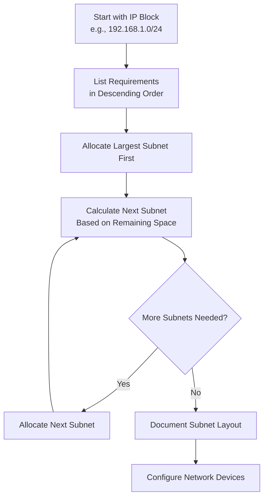
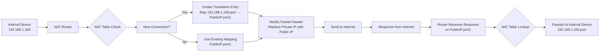
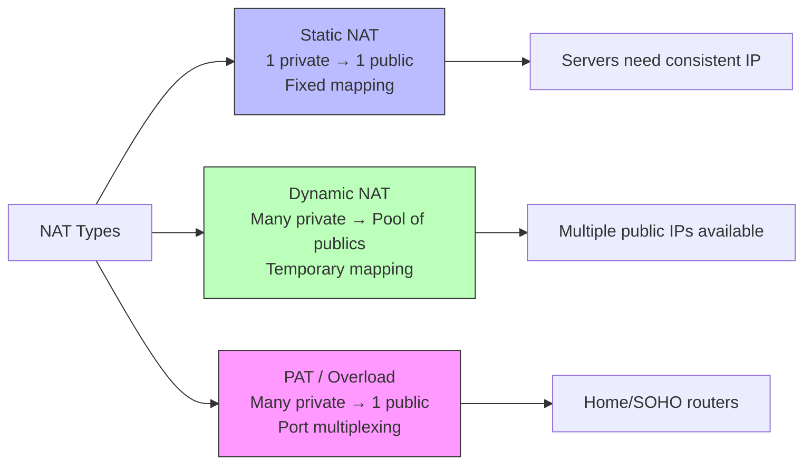
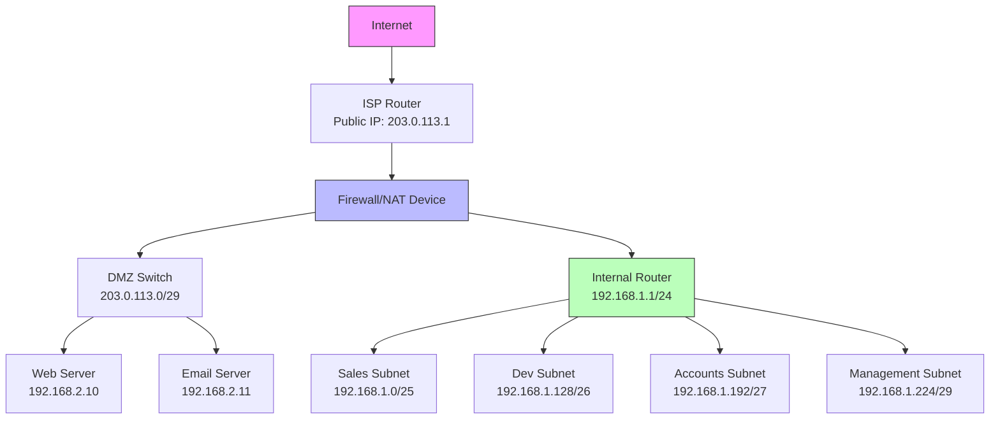
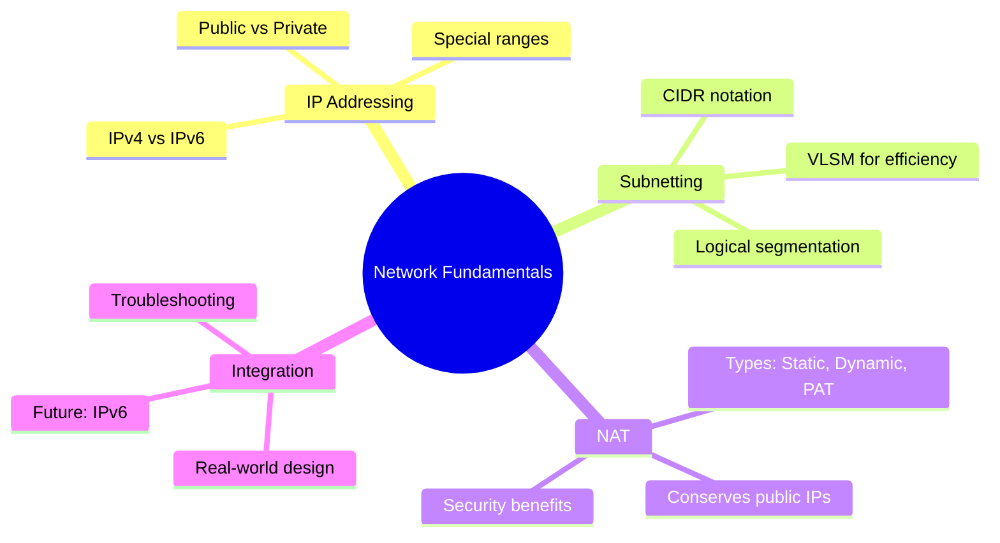

---
tags: [soc]
---
# 🌐 Full-Stack Networking Lesson: Subnets, Public vs. Private IPs, and NAT

## TCM Exam Objectives

- Calculate subnet boundaries, network IDs, and broadcast addresses using CIDR notation
- Perform VLSM subnetting to minimize IP address waste across departments
- Recite the three RFC 1918 private IP ranges (10.0.0.0/8, 172.16.0.0/12, 192.168.0.0/16)
- Distinguish static NAT, dynamic NAT, and Port Address Translation (PAT/overload)
- Configure NAT on router and firewall platforms (Cisco IOS, Linux iptables)
- Troubleshoot common subnetting, IP addressing, and NAT connectivity issues

# 🌐 Full-Stack Networking Lesson: Subnets, Public vs. Private IPs, and NAT

## 📚 1. Introduction: The Foundation of Network Communication

Understanding subnets, public/private IP addressing, and Network Address Translation (NAT) is fundamental to grasping how data traverses networks. These concepts form the backbone of modern network design, enabling efficient communication, security, and scalability.



## 🔍 2. IP Addressing Fundamentals

### 2.1 What is an IP Address?
An IP address is a unique identifier assigned to each device on a network. It serves two principal functions:
- **Host Identification**: Identifies a specific device on a network
- **Location Addressing**: Provides the device's location in the network topology

IPv4 addresses are 32-bit numbers typically expressed in dotted-decimal notation (e.g., `192.168.1.1`), while IPv6 addresses are 128-bit numbers represented in hexadecimal 【turn0search10】.

### 2.2 IP Address Classes and Structure
Historically, IP addresses were divided into classes:

| Class | Leading Bits | First Octet Range | Default Subnet Mask | Purpose |
|-------|--------------|-------------------|---------------------|---------|
| **A** | 0 | 1-126 | 255.0.0.0 (/8) | Large networks |
| **B** | 10 | 128-191 | 255.255.0.0 (/16) | Medium networks |
| **C** | 110 | 192-223 | 255.255.255.0 (/24) | Small networks |
| **D** | 1110 | 224-239 | N/A | Multicast |
| **E** | 1111 | 240-255 | N/A | Experimental |

> 💡 **Note**: Classful addressing is largely historical. Modern networking uses **Classless Inter-Domain Routing (CIDR)**, which allows flexible subnet masks regardless of class 【turn0search1】【turn0search3】.

## 🧩 3. Subnetting: Dividing the Network

### 3.1 What is Subnetting?
Subnetting is the practice of dividing a single large network into smaller, more manageable subnetworks (subnets). This improves network performance, enhances security, and optimizes IP address allocation 【turn0search3】【turn0search15】.

### 3.2 Why Subnet?
- **Reduced Broadcast Domains**: Limits broadcast traffic to smaller areas
- **Enhanced Security**: Contains network issues and limits attack surfaces
- **Improved Performance**: Reduces network congestion and improves routing efficiency
- **Organizational Structure**: Aligns network topology with organizational departments
- **Simplified Management**: Makes network troubleshooting and maintenance easier

📌 **Exam Tip:** Memorize the "magic number" method for subnetting: /24 = 256, /25 = 128, /26 = 64, /27 = 32, /28 = 16, /29 = 8, /30 = 4. Available hosts = (magic number) - 2 (subtract network and broadcast addresses). For example, /27 = 32 - 2 = 30 hosts.

### 3.3 Subnet Masks and CIDR Notation
A subnet mask distinguishes the network portion from the host portion of an IP address. CIDR notation combines the IP address with the subnet mask using a slash (e.g., `192.168.1.0/24`) 【turn0search1】【turn0search3】.

**Key Subnet Mask Values:**
| CIDR | Subnet Mask | Available Hosts | Use Case |
|------|-------------|-----------------|----------|
| /24 | 255.255.255.0 | 254 | Small office network |
| /25 | 255.255.255.128 | 126 | Departmental segmentation |
| /26 | 255.255.255.192 | 62 | Small branch office |
| /27 | 255.255.255.224 | 30 | Point-to-point links |
| /30 | 255.255.255.252 | 2 | WAN connections |

### 3.4 Variable Length Subnet Mask (VLSM)

VLSM allows network administrators to create subnets of different sizes within the same network, dramatically reducing IP address waste 【turn0search1】【turn0search2】.

📌 **Exam Tip:** VLSM = Variable Length Subnet Mask. The rule: allocate the LARGEST subnet first, then work down. Each subnet must start on a boundary that is a multiple of its block size. For example, a /26 (64 IPs) must start at 0, 64, 128, or 192. This is frequently tested.

#### VLSM Subnetting Process:



#### VLSM Example Scenario:

A company has the `192.168.1.0/24` network and needs subnets for:
- Sales Department: 120 hosts
- Development Team: 50 hosts
- Accounts: 26 hosts
- Management: 5 hosts

**Step-by-Step VLSM Allocation:**

1. **Sales (120 hosts)**: Needs block size ≥ 122 (120 + 2 for network/broadcast)
   - Nearest power of 2: 128 (/25)
   - Subnet: `192.168.1.0/25` (Range: 1-126)
   - Mask: `255.255.255.128`

2. **Development (50 hosts)**: Needs block size ≥ 52
   - Nearest power of 2: 64 (/26)
   - Subnet: `192.168.1.128/26` (Range: 129-190)
   - Mask: `255.255.255.192`

3. **Accounts (26 hosts)**: Needs block size ≥ 28
   - Nearest power of 2: 32 (/27)
   - Subnet: `192.168.1.192/27` (Range: 193-222)
   - Mask: `255.255.255.224`

4. **Management (5 hosts)**: Needs block size ≥ 7
   - Nearest power of 2: 8 (/29)
   - Subnet: `192.168.1.224/29` (Range: 225-230)
   - Mask: `255.255.255.248`

<details>
<summary>🔧 Technical Implementation Details</summary>

**Common VLSM Mistakes to Avoid:**
1. **Subnet Alignment Error**: Attempting to create `172.16.1.0/23` - invalid because /23 subnets must start at even boundaries (e.g., 172.16.0.0/23, 172.16.2.0/23) 【turn0search1】
2. **Insufficient Host Bits**: Not allocating enough bits for required hosts
3. **Overlapping Subnets**: Subnets sharing IP addresses
4. **Ignoring Growth**: Not leaving room for future expansion

**VLSM Calculation Tools:**
- Online calculators: subnettingpractice.com 【turn0search1】
- Binary conversion method for complex scenarios
- Spreadsheet templates for large networks
</details>

### 3.5 Subnetting Best Practices

1. **Document Everything**: Maintain detailed records of subnet allocations, purposes, and growth plans
2. **Plan for Growth**: Allocate 20-30% more IP space than currently needed
3. **Hierarchical Design**: Create a logical addressing hierarchy that mirrors organizational structure
4. **Use Descriptive Names**: Name subnets functionally (e.g., `192.168.1.0/25` = "Sales-Subnet")
5. **Implement Route Summarization**: Design subnets for efficient summarization at routers
6. **Consider Broadcast Impact**: Keep subnets reasonably sized to limit broadcast traffic

## 🌍 4. Public vs. Private IP Addresses

### 4.1 Private IP Address Ranges
Private IP addresses are reserved for internal networks and not routable on the public internet. They are defined in RFC 1918 【turn0search5】【turn0search8】:

| Class | Private Range | CIDR | Default Subnet Mask | Number of Networks |
|-------|---------------|------|---------------------|-------------------|
| **A** | 10.0.0.0 - 10.255.255.255 | 10.0.0.0/8 | 255.0.0.0 | 1 large network |
| **B** | 172.16.0.0 - 172.31.255.255 | 172.16.0.0/12 | 255.240.0.0 | 16 medium networks |
| **C** | 192.168.0.0 - 192.168.255.255 | 192.168.0.0/16 | 255.255.0.0 | 256 small networks |

### 4.2 Public IP Addresses
Public IP addresses are globally unique and routable on the internet. They are assigned by Internet Service Providers (ISPs) and regional internet registries 【turn0search5】【turn0search6】.

### 4.3 Key Differences: Public vs. Private IPs

| Aspect | Private IP Addresses | Public IP Addresses |
|--------|---------------------|-------------------|
| **Reachability** | Not directly accessible from internet 【turn0search8】 | Globally accessible from internet |
| **Cost** | Free to use | Require purchase/lease from ISP |
| **Uniqueness** | Only unique within local network | Globally unique |
| **Security** | Hidden from external networks 【turn0search8】 | Exposed to internet threats |
| **Conservation** | Conserves public IP space | Directly contributes to IPv4 exhaustion |
| **NAT Requirement** | Require NAT for internet access | No NAT required for direct access |
| **Typical Use** | Internal networks, home networks, corporate networks | Web servers, email servers, public-facing services |

### 4.4 Special IP Address Ranges

| Range | Purpose | Notes |
|-------|---------|-------|
| 0.0.0.0/8 | "This" network | Used for default routes |
| 127.0.0.0/8 | Loopback | Localhost testing (127.0.0.1) |
| 169.254.0.0/16 | Link-local | Auto-configuration when no DHCP |
| 224.0.0.0/4 | Multicast | One-to-many communication |
| 240.0.0.0/4 | Reserved | Future use |

## 🔄 5. Network Address Translation (NAT)

### 5.1 What is NAT?
NAT is a method of mapping IP address spaces by modifying network address information in IP packet headers while in transit across a routing device 【turn0search10】. It enables multiple devices on a private network to access the internet using a single public IP address.

### 5.2 Why NAT?
- **IPv4 Conservation**: Mitigates IPv4 address exhaustion by allowing thousands of devices to share one public IP 【turn0search11】
- **Security**: Hides internal network structure from external networks 【turn0search11】
- **Flexibility**: Allows network renumbering without external changes
- **Cost Savings**: Reduces the number of public IP addresses needed

### 5.3 How NAT Works



📌 **Exam Tip:** Know the three NAT types: Static NAT = one-to-one fixed mapping (for servers), Dynamic NAT = many-to-many from a pool, PAT (NAT Overload) = many-to-one using port numbers. PAT is what your home router uses. The exam tests which NAT type is most common (PAT) and which gives consistent external IPs (Static NAT).



### 5.4 Types of NAT

#### 1. Static NAT (SNAT)
- **One-to-one mapping** between private and public IPs
- Permanent mapping in NAT table
- Used for servers needing consistent external access
- **Example**: Web server at 192.168.1.10 always mapped to 203.0.113.10 【turn0search14】

#### 2. Dynamic NAT
- Maps private IPs to public IPs from a **predefined pool**
- Temporary mappings, released when session ends
- Used when you have multiple public IPs but not enough for all devices
- **Example**: Pool of 5 public IPs for 50 internal devices

#### 3. Port Address Translation (PAT) / NAT Overload
- **Many-to-one mapping** using port numbers
- Multiple private IPs share one public IP
- Most common NAT type in home routers
- **Example**: 192.168.1.100:50123 and 192.168.1.101:50124 both mapped to 203.0.113.1:50001 and 203.0.113.1:50002 【turn0search11】

### 5.5 NAT Terminology

| Term | Definition | Example |
|------|------------|---------|
| **Inside Local** | Private IP address on internal network | 192.168.1.100 |
| **Inside Global** | Public IP address as seen externally | 203.0.113.1 |
| **Outside Local** | How external IP appears internally | Usually unchanged |
| **Outside Global** | True public IP of external destination | 198.51.100.5 |

### 5.6 NAT Implementation Examples

<details>
<summary>⚙️ Cisco Router NAT Configuration</summary>

```cisco
! Define inside and outside interfaces
interface GigabitEthernet0/0
 description Connection to Internal Network
 ip address 192.168.1.1 255.255.255.0
 ip nat inside
 
interface GigabitEthernet0/1
 description Connection to Internet
 ip address 203.0.113.1 255.255.255.252
 ip nat outside

! Configure PAT (NAT Overload)
access-list 1 permit 192.168.1.0 0.0.0.255
ip nat inside source list 1 interface GigabitEthernet0/1 overload

! Static NAT for Web Server
ip nat inside source static 192.168.1.10 203.0.113.10

! Dynamic NAT with pool
ip nat pool MYPOOL 203.0.113.20 203.0.113.25 netmask 255.255.255.248
ip nat inside source list 1 pool MYPOOL
```
</details>

<details>
<summary>🔧 Linux iptables NAT Configuration</summary>

```bash
# Enable IP forwarding
echo 1 > /proc/sys/net/ipv4/ip_forward

# Set up PAT (MASQUERADE) for internal network
iptables -t nat -A POSTROUTING -s 192.168.1.0/24 -o eth0 -j MASQUERADE

# Port forwarding for web server (80)
iptables -t nat -A PREROUTING -p tcp --dport 80 -j DNAT --to-destination 192.168.1.10:80
iptables -A FORWARD -p tcp -d 192.168.1.10 --dport 80 -j ACCEPT

# Static NAT for specific IP
iptables -t nat -A PREROUTING -d 203.0.113.10 -j DNAT --to-destination 192.168.1.10
iptables -t nat -A POSTROUTING -s 192.168.1.10 -j SNAT --to-source 203.0.113.10
```
</details>

### 5.7 NAT Challenges and Considerations

| Issue | Impact | Mitigation |
|-------|--------|------------|
| **Broken End-to-End Connectivity** | Affects peer-to-peer applications, VoIP | Use UPnP, STUN, TURN protocols |
| **Performance Overhead** | Router CPU/memory usage | Hardware acceleration, sufficient resources |
| **Application Compatibility** | Some apps don't work through NAT | Application-layer gateways (ALGs) |
| **Logging/Tracking** | Harder to track internal users | Detailed NAT logging, session tracking |
| **IPv6 Transition** | NAT is IPv4-specific; IPv6 has no need for NAT | Dual-stack implementation, IPv6 education |

## 🏗️ 6. Real-World Network Architecture

### 6.1 Integrated Network Design Example



### 6.2 Network Design Principles

1. **Hierarchical Addressing**: Summarize routes at core layers
2. **Functional Segmentation**: Group devices by function (DMZ, internal, management)
3. **Scalability**: Plan for 2-3 years of growth
4. **Security Zones**: Isolate critical systems (databases, HR, finance)
5. **Simplified Troubleshooting**: Logical, documented addressing scheme

## 🛠️ 7. Troubleshooting Common Issues

### 7.1 Subnetting Problems

| Symptom | Likely Cause | Solution |
|---------|--------------|----------|
| **Can't reach certain subnets** | Incorrect subnet mask | Verify all devices in subnet have same mask |
| **Intermittent connectivity** | Overlapping subnets | Check for IP address conflicts |
| **Slow network performance** | Oversized subnets | Consider further subnetting or VLANs |
| **Can't access internet** | Gateway misconfiguration | Verify default gateway setting |

### 7.2 NAT Issues

| Symptom | Likely Cause | Solution |
|---------|--------------|----------|
| **No internet access** | NAT rule misconfiguration | Verify NAT rules and interface assignments |
| **Some sites work, others don't** | MTU issues | Adjust MSS clamping on router |
| **VoIP/Gaming issues** | NAT type problems | Configure port forwarding or DMZ |
| **Random disconnections** | NAT table timeout too short | Increase timeout values |
| **Can't host servers** | Missing static NAT/port forwarding | Configure appropriate port forwarding |

### 7.3 Diagnostic Commands

<details>
<summary>🔍 Network Diagnostic Toolkit</summary>

**Windows:**
```cmd
# View IP configuration
ipconfig /all

# Check connectivity to gateway
ping 192.168.1.1

# Trace route to external host
tracert 8.8.8.8

# View NAT translations (if supported)
netsh interface ipv4 show excludedportrange protocol=tcp
```

**Linux:**
```bash
# View IP addresses and interfaces
ip addr show

# Check routing table
ip route show

# View NAT connections
conntrack -L  # Requires conntrack-tools
iptables -t nat -L -n -v

# Test external connectivity
curl -v http://example.com
```

**Cisco Devices:**
```cisco
# Show interface status
show ip interface brief

# View NAT translations
show ip nat translations

# Show NAT statistics
show ip nat statistics

# Debug NAT (caution: can be verbose)
debug ip nat detailed
```
</details>

## 📈 8. Advanced Topics and Future Considerations

### 8.1 IPv6 and the Future of NAT

IPv6 was developed to address IPv4 exhaustion, providing 340 undecillion addresses. Unlike IPv4, IPv6 doesn't require NAT for address conservation, but NAT66 is still used for specific scenarios 【turn0search10】.

**IPv6 Addressing:**
- 128-bit addresses (e.g., `2001:0db8:85a3:0000:0000:8a2e:0370:7334`)
- No private address ranges (link-local `fe80::/10` exists)
- Uses /64 subnets for most networks
- Supports stateless autoconfiguration (SLAAC)

### 8.2 Cloud NAT Solutions

Modern cloud platforms provide managed NAT services:

| Service | Provider | Key Features |
|---------|----------|--------------|
| **NAT Gateway** | AWS | Highly available, scalable, managed service 【turn0search22】 |
| **Azure NAT Gateway** | Microsoft Azure | Outbound connectivity for private subnets 【turn0search23】 |
| **Cloud NAT** | Google Cloud | Regional, managed NAT service |

### 8.3 Security Implications

**NAT as a Security Feature:**
- Obscures internal network structure 【turn0search11】
- Provides implicit firewalling (unsolicited inbound blocked)
- But not a replacement for proper firewalls

**Security Concerns:**
- NAT logging can reveal user activity
- Complicated security audits
- Potential for NAT traversal vulnerabilities

## 🎯 9. Summary and Key Takeaways

### 9.1 Core Concepts Recap



### 9.2 Best Practices Checklist

- [ ] **Document Everything**: Maintain detailed network documentation
- [ ] **Plan for Growth**: Leave room for expansion in all designs
- [ ] **Use VLSM**: Implement variable length subnet masks for efficiency
- [ ] **Implement Security**: Use private IPs internally, NAT for external access
- [ ] **Test Thoroughly**: Validate designs in lab before production
- [ ] **Monitor and Log**: Keep track of subnet usage and NAT translations
- [ ] **Stay Current**: Understand IPv6 implications for future planning

### 9.3 Learning Resources

- **Practice Tools**: VLSM calculators 【turn0search1】, subnetting practice sites
- **Certification Paths**: CCNA, Network+, AWS/Azure networking certifications
- **Books**: "TCP/IP Illustrated" by W. Richard Stevens, "Network Warrior" by Gary A. Donahue
- **Online Labs**: Cisco Packet Tracer, GNS3, cloud sandbox environments

## 📚 10. Frequently Asked Questions

<details>
<summary>❓ Common Questions Answered</summary>

**Q: Can I have a subnet with 0 hosts?**  
A: Technically yes (/31 for point-to-point links), but unusual for general networks.

**Q: Why do I need NAT if I have a firewall?**  
A: NAT provides IP conservation and basic security, while firewalls provide granular access control. They're complementary.

**Q: How do I calculate subnets quickly?**  
A: Learn the "magic number" chart: /24=256, /25=128, /26=64, etc., and practice binary conversion.

**Q: Is NAT still needed with IPv6?**  
A: Not for address conservation, but may be used for specific scenarios like IPv6-to-IPv4 translation.

**Q: What's the difference between gateway and router?**  
A: A gateway connects different networks (often with NAT), while a router connects similar networks. In practice, devices often perform both functions.

**Q: How many subnets can I create in a /24 network?**  
A: It depends on the subnet sizes. For example: two /25s, four /26s, eight /27s, etc.
</details>

---

> 💡 **Final Tip**: Networking concepts are best learned through practice. Set up a lab environment using tools like Packet Tracer, GNS3, or cloud platforms, and experiment with different subnet and NAT configurations. The hands-on experience will solidify these concepts far better than theory alone.

This comprehensive lesson covers the essential networking concepts of subnets, public/private IP addressing, and NAT. By understanding how these technologies work together, you'll be equipped to design, implement, and troubleshoot modern networks effectively. Whether you're working in enterprise environments, cloud platforms, or home labs, these fundamentals remain crucial building blocks of network engineering.