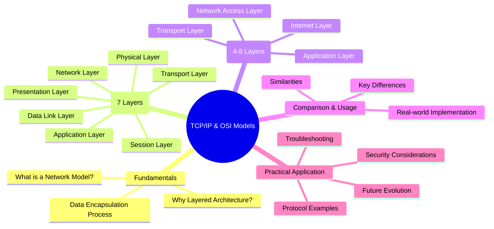
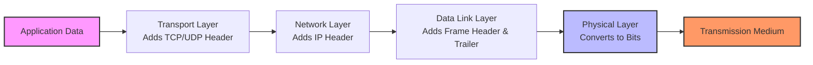
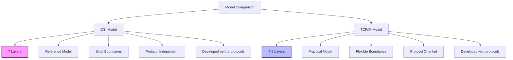
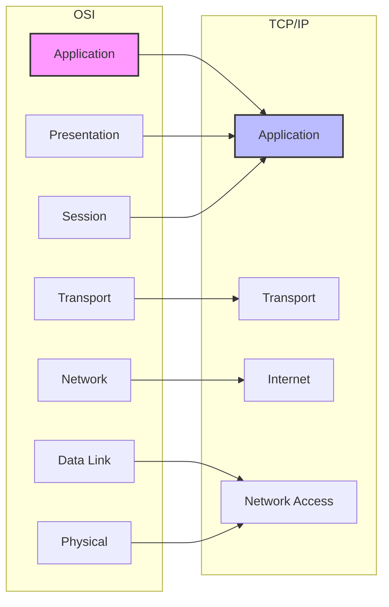
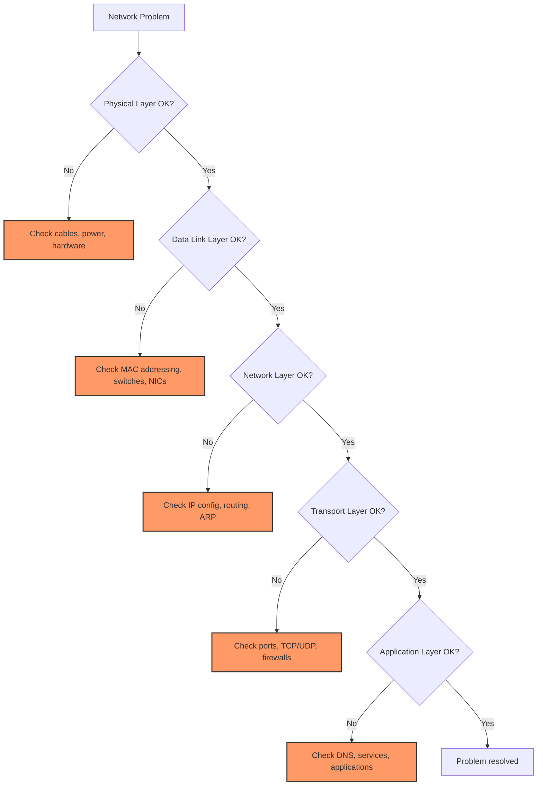

---
tags: [soc]
---
# 📡 Full-Stack Lesson: Understanding TCP/IP and OSI Models

## TCM Exam Objectives

- Identify the seven OSI layers and describe the function of each
- Map TCP/IP model layers to OSI layers (Network Access = L1+L2, Internet = L3, Transport = L4, Application = L5+L6+L7)
- Describe the data encapsulation/decapsulation process as data moves through the stack
- Compare TCP (reliable, connection-oriented) and UDP (unreliable, connectionless) characteristics
- Explain the role of each device type: hub (L1), switch (L2), router (L3), firewall (L4-L7)
- Apply layer-by-layer troubleshooting methodology using appropriate diagnostic tools

# 📡 Full-Stack Lesson: Understanding TCP/IP and OSI Models

## 🎯 Lesson Overview
This comprehensive lesson explores the two fundamental frameworks for understanding network communication: the **OSI (Open Systems Interconnection) Model** and the **TCP/IP (Transmission Control Protocol/Internet Protocol) Model**. You'll learn their architectures, layer functions, practical implementations, and how they compare in real-world networking.

## 1. 📚 Fundamentals of Network Models

### 1.1 What is a Network Model?
A network model is a **conceptual framework** that standardizes the functions of a communication system by dividing it into abstract layers. Each layer performs specific functions and provides services to the layer above it while relying on services from the layer below.

> 💡 **Key Insight**: The primary purpose of layered models is to **divide complex network communication into manageable, specialized components** that can be developed, maintained, and troubleshooted independently 【turn0search10】.

### 1.2 Why Layered Architecture?
- **Modularity**: Changes in one layer don't necessarily affect others
- **Specialization**: Each layer focuses on specific functions
- **Standardization**: Provides common interfaces between layers
- **Troubleshooting**: Isolates problems to specific layers
- **Interoperability**: Enables different systems to communicate

### 1.3 Data Encapsulation: The Core Concept
**Data encapsulation** is the process of adding headers and trailers to data as it moves down the layers at the sender's side, and removing them at the receiver's side. Think of it like sending a letter through the postal system - you need an envelope with addresses, stamps, and sorting information to ensure proper delivery 【turn0search14】.

📌 **Exam Tip:** Memorize the OSI layer order with a mnemonic: **P**lease **D**o **N**ot **T**hrow **S**ausage **P**izza **A**way (Physical, Data Link, Network, Transport, Session, Presentation, Application). Also know the PDU at each layer: Bits (L1), Frames (L2), Packets (L3), Segments/Datagrams (L4), Data (L5-L7).

**Encapsulation Process:**
1. **Application Layer** creates user data
2. **Transport Layer** adds port numbers (segments)
3. **Network Layer** adds IP addresses (packets)
4. **Data Link Layer** adds MAC addresses (frames)
5. **Physical Layer** converts to bits for transmission

## 2. 🏛️ The OSI Model: 7-Layer Reference Framework

The OSI model was developed by the **International Organization for Standardization (ISO)** in 1984 as a reference model for network communication. It defines seven layers, each with specific functions and protocols 【turn0search10】.

### Layer 1: Physical Layer
**Function**: Transmits raw bits over physical media.

🔧 Technical Details

- **Data Unit**: Bits
- **Devices**: Hubs, repeaters, NICs, cables, connectors
- **Protocols**: Ethernet (physical spec), USB, Bluetooth, IEEE 802.11 (Wi-Fi)
- **Key Functions**:
  - Converts digital data to electrical/optical signals
  - Defines physical topology (star, bus, ring)
  - Specifies voltage levels, data rates, maximum distances
  - Handles bit synchronization and transmission
- **Real-world Example**: An Ethernet cable connecting your computer to a router

### Layer 2: Data Link Layer
**Function**: Provides reliable node-to-node data transfer.

⚙️ Technical Implementation

- **Data Unit**: Frames
- **Devices**: Switches, bridges, network interface cards
- **Protocols**: Ethernet, Wi-Fi, PPP, HDLC, Frame Relay
- **Addressing**: MAC addresses (Media Access Control)
- **Key Functions**:
  - **Framing**: Divides data into frames
  - **Physical addressing**: Adds source/destination MAC addresses
  - **Error detection**: Uses Frame Check Sequence (FCS)
  - **Flow control**: Prevents overwhelming receivers
  - **Media access control**: CSMA/CD for Ethernet, CSMA/CA for Wi-Fi
- **Sublayers**:
  - **LLC (Logical Link Control)**: Interface to network layer
  - **MAC (Media Access Control)**: Access to physical medium

### Layer 3: Network Layer
**Function**: Handles logical addressing and routing of packets.

🌐 Routing & Addressing Details

- **Data Unit**: Packets
- **Devices**: Routers, Layer 3 switches
- **Protocols**: IP (IPv4/IPv6), ICMP, ARP, RARP, OSPF, BGP
- **Addressing**: IP addresses (logical addresses)
- **Key Functions**:
  - **Logical addressing**: IP addresses for network identification
  - **Routing**: Determines best path to destination
  - **Packet forwarding**: Moves packets between networks
  - **Fragmentation**: Breaks packets if too large for MTU
  - **Congestion control**: Manages network traffic
- **Real-world Example**: Your home router assigning IP addresses to devices

📌 **Exam Tip:** Know which devices operate at each OSI layer: Hub/Repeater = L1, Switch/Bridge = L2, Router/L3 Switch = L3, Firewall (stateful) = L4, Application Firewall/Proxy = L7. The exam often asks "what device would you use to connect two different networks?" = Router (L3).

### Layer 4: Transport Layer
**Function**: Ensures reliable or fast delivery of data.

🚚 Transport Protocols Deep Dive

- **Data Unit**: Segments (TCP) / Datagrams (UDP)
- **Protocols**: TCP, UDP, SCTP
- **Key Functions**:
  - **Segmentation**: Divides data into smaller units
  - **Connection management**: Establishes, maintains, terminates connections
  - **Flow control**: Sliding window mechanism
  - **Error control**: Retransmission of lost segments
  - **Multiplexing**: Multiple applications use same network connection

**TCP (Transmission Control Protocol)**:
- **Reliable**: Guarantees delivery
- **Connection-oriented**: Establishes connection before data transfer
- **Ordered**: Delivers data in sequence
- **Use cases**: Web browsing (HTTP), email (SMTP), file transfer (FTP)

**UDP (User Datagram Protocol)**:
- **Unreliable**: No guarantee of delivery
- **Connectionless**: No connection establishment
- **Faster**: Lower overhead
- **Use cases**: DNS, video streaming, online gaming, VoIP

### Layer 5: Session Layer
**Function**: Establishes, manages, and terminates sessions.

🔄 Session Management Details

- **Data Unit**: Data
- **Protocols**: NetBIOS, RPC, SQL, PAP, CHAP
- **Key Functions**:
  - **Session establishment**: Sets up communication parameters
  - **Session management**: Controls dialog between devices
  - **Synchronization**: Checkpointing for recovery
  - **Dialog control**: Half-duplex vs. full-duplex
  - **Session closure**: Proper termination of sessions
- **Real-world Example**: A database connection maintaining state between queries

### Layer 6: Presentation Layer
**Function**: Translates, encrypts, and formats data.

🔐 Data Translation & Encryption

- **Data Unit**: Data
- **Protocols**: SSL/TLS, JPEG, MPEG, GIF, ASCII, EBCDIC
- **Key Functions**:
  - **Translation**: Converts between data formats (ASCII/EBCDIC)
  - **Encryption**: Secures data for transmission
  - **Compression**: Reduces data size for efficiency
  - **Encoding**: Converts data to transmittable format
- **Real-world Example**: Your browser decrypting HTTPS traffic using TLS

### Layer 7: Application Layer
**Function**: Provides services to end-user applications.

🖥️ Application Services & Protocols

- **Data Unit**: Data
- **Protocols**: HTTP, HTTPS, FTP, SMTP, POP3, IMAP, DNS, DHCP, SNMP, Telnet, SSH
- **Key Functions**:
  - **Network services**: Provides services to applications
  - **Resource sharing**: Access to network resources
  - **Remote file access**: FTP, NFS
  - **Directory services**: DNS, LDAP
  - **Virtual terminals**: Telnet, SSH
- **Real-world Example**: Your web browser using HTTP to access websites

## 3. 🌐 The TCP/IP Model: Practical Implementation

The TCP/IP model was developed by the **Department of Defense (DoD)** for the ARPANET project, which eventually became the Internet. It's a **practical, protocol-oriented model** that's actually used in real-world networking 【turn0search0】【turn0search6】.

### Layer 1: Network Access Layer (Link Layer)
**Function**: Combines OSI Physical and Data Link layers.

🔗 Network Access Details

- **Data Unit**: Frames
- **Protocols**: Ethernet, Wi-Fi, Token Ring, Frame Relay, ATM
- **Key Functions**:
  - **Hardware addressing**: MAC addresses
  - **Media access**: CSMA/CD, CSMA/CA
  - **Frame construction**: Adds headers/trailers
  - **Error detection**: FCS
  - **Physical transmission**: Converts to signals
- **Real-world Example**: Your computer's Ethernet connection to a switch

### Layer 2: Internet Layer
**Function**: Handles logical addressing and routing (similar to OSI Network Layer).

🌍 Internet Layer Implementation

- **Data Unit**: Packets
- **Protocols**: IP (IPv4/IPv6), ICMP, ARP, RARP, IGMP
- **Key Functions**:
  - **IP addressing**: Logical addressing scheme
  - **Routing**: Path determination through networks
  - **Packet forwarding**: Moves packets between networks
  - **Fragmentation**: Handles different MTU sizes
  - **Error reporting**: ICMP for network issues
- **IPv4 vs. IPv6**:
  - **IPv4**: 32-bit addresses (4.3 billion addresses)
  - **IPv6**: 128-bit addresses (340 undecillion addresses)
  - **IPv6 features**: Built-in security, autoconfiguration, no broadcast

### Layer 3: Transport Layer
**Function**: Provides end-to-end communication (similar to OSI Transport Layer).

🚢 Transport Layer Implementation

- **Data Unit**: Segments (TCP) / Datagrams (UDP)
- **Protocols**: TCP, UDP, DCCP, SCTP
- **Key Functions**:
  - **Process-to-process delivery**: Uses port numbers
  - **Multiplexing/demultiplexing**: Multiple applications
  - **Connection management**: TCP 3-way handshake
  - **Flow control**: TCP sliding window
  - **Error control**: TCP checksum, retransmission
- **Port Numbers**:
  - **Well-known ports**: 0-1023 (HTTP:80, HTTPS:443)
  - **Registered ports**: 1024-49151
  - **Dynamic ports**: 49152-65535

### Layer 4: Application Layer
**Function**: Combines OSI Session, Presentation, and Application layers.

📱 Application Layer Implementation

- **Data Unit**: Data
- **Protocols**: HTTP, HTTPS, FTP, SMTP, POP3, IMAP, DNS, DHCP, SSH, Telnet, SNMP
- **Key Functions**:
  - **Network services**: Direct user interaction
  - **Resource access**: File transfer, email, web
  - **Session management**: Connection handling
  - **Data formatting**: Encoding, compression
  - **Security**: Authentication, encryption
- **Real-world Example**: Using a web browser to access Gmail

## 4. ⚖️ Comparative Analysis: OSI vs. TCP/IP

### 4.1 Key Similarities
Both models share fundamental concepts despite structural differences 【turn0search18】:

| Aspect | Similarity |
|--------|------------|
| **Layered Architecture** | Both use layered approach to divide functions |
| **Transport Layer** | Both have transport layer with TCP/UDP equivalents |
| **Network/Internet Layer** | Both handle routing and logical addressing |
| **Packet Switching** | Both assume packet-switched networks |
| **Application Layer** | Both provide interface to user applications |

📌 **Exam Tip:** The TCP/IP model collapses OSI layers: Network Access = L1+L2 (Physical + Data Link), Internet = L3 (Network), Transport = L4 (Transport), Application = L5+L6+L7 (Session + Presentation + Application). The exam tests which OSI layers map to which TCP/IP layers.

| Characteristic | OSI Model | TCP/IP Model |
|----------------|-----------|--------------|
| **Layers** | 7 distinct layers | 4-5 layers (Network Access combines OSI L1-L2) |
| **Development** | Developed before protocols | Developed after protocols existed |
| **Approach** | Theoretical reference model | Practical implementation model |
| **Session/Presentation** | Separate layers | Combined into Application layer |
| **Network Access** | Separate Physical & Data Link | Combined Network Access layer |
| **Usage** | Teaching, troubleshooting | Actual Internet implementation |
| **Standardization** | ISO standard | De facto standard |
| **Flexibility** | Strict layer boundaries | More flexible layer boundaries |

### 4.3 When to Use Which Model?
- **Use OSI for**:
  - Learning and understanding networking concepts
  - Troubleshooting (isolate problems to specific layers)
  - Designing new protocols or standards
  - Academic environments

- **Use TCP/IP for**:
  - Real-world network implementation
  - Internet communication
  - Practical troubleshooting
  - Industry certifications (Cisco, CompTIA)

## 5. 🔧 Practical Implementation & Protocols

### 5.1 Protocol Stack Mapping

### 5.2 Common Protocol Examples

| OSI Layer | TCP/IP Layer | Protocol Examples | Function |
|-----------|--------------|-------------------|----------|
| 7. Application | 4. Application | HTTP, HTTPS, FTP, SMTP, DNS | User network services |
| 6. Presentation | 4. Application | SSL/TLS, JPEG, MPEG | Data formatting, encryption |
| 5. Session | 4. Application | NetBIOS, RPC | Session management |
| 4. Transport | 3. Transport | TCP, UDP | Process-to-process delivery |
| 3. Network | 2. Internet | IP, ICMP, ARP | Packet routing |
| 2. Data Link | 1. Network Access | Ethernet, Wi-Fi, PPP | Frame transmission |
| 1. Physical | 1. Network Access | Ethernet (physical), USB | Bit transmission |

### 5.3 Real-World Example: Web Browsing
Let's trace what happens when you visit `https://www.example.com`:

🌐 Complete Web Browsing Process

1. **Application Layer (DNS)**:
   - Browser checks DNS cache for `www.example.com`
   - If not found, sends DNS query to configured DNS server
   - DNS server responds with IP address (e.g., 93.184.216.34)

2. **Transport Layer (TCP)**:
   - Browser initiates TCP connection to server's IP at port 443 (HTTPS)
   - TCP 3-way handshake: SYN → SYN-ACK → ACK
   - Connection established

3. **Internet Layer (IP)**:
   - IP packet created with source IP (your computer) and destination IP (server)
   - Routing tables determine path through internet

4. **Network Access Layer (Ethernet)**:
   - IP packet encapsulated in Ethernet frame
   - Source MAC: your NIC, Destination MAC: default gateway
   - Frame converted to electrical signals on cable

5. **Reverse Process at Server**:
   - Server receives frames, extracts IP packets
   - IP layer delivers to TCP layer
   - TCP delivers to application layer (web server)
   - Server processes HTTP request and sends response

6. **TLS Handshake** (within Application layer):
   - Client and server negotiate encryption parameters
   - Exchange digital certificates
   - Establish secure session keys

7. **HTTP Request/Response**:
   - Browser sends HTTP GET request
   - Server responds with HTML content
   - Browser renders the page

## 6. 🛠️ Troubleshooting with Models

### 6.1 Layer-by-Layer Troubleshooting Approach

### 6.2 Common Issues by Layer

| Layer | Common Issues | Diagnostic Tools |
|-------|---------------|------------------|
| **Physical** | Cables, power, hardware failures | Cable testers, LED indicators |
| **Data Link** | MAC conflicts, switch failures, ARP issues | `arp -a`, switch logs, MAC scanners |
| **Network** | IP conflicts, routing problems, DNS issues | `ping`, `traceroute`, `ipconfig` |
| **Transport** | Port blocking, firewall issues, TCP problems | `telnet`, `netstat`, port scanners |
| **Application** | Service failures, configuration errors | Application logs, service status |

## 7. 📈 Best Practices & Implementation

### 7.1 Design Principles
1. **Proper Subnetting**: Efficient IP address allocation and reduced broadcast domains 【turn0search6】
2. **Address Planning**: Comprehensive documentation prevents conflicts and supports growth
3. **Security Configuration**: Implement TLS, SSH, IPsec for secure communication
4. **Monitoring**: Use packet flow analysis to detect anomalies and security issues
5. **Redundancy**: Design for high availability at critical layers

### 7.2 Security Considerations by Layer

| Layer | Security Considerations | Protective Measures |
|-------|------------------------|---------------------|
| **Physical** | Physical access, cable tapping | Locked cabinets, tamper-evident seals |
| **Data Link** | ARP spoofing, MAC flooding | Port security, DHCP snooping, ARP inspection |
| **Network** | IP spoofing, routing attacks | Firewalls, ACLs, ingress/egress filtering |
| **Transport** | Port scanning, SYN floods | Stateful firewalls, rate limiting, SYN cookies |
| **Application** | SQL injection, XSS, malware | WAF, input validation, security patches |

## 8. 🔮 Future Evolution & Modern Trends

### 8.1 IPv6 Adoption
- **Address exhaustion**: IPv4's 4.3 billion addresses are exhausted
- **IPv6 benefits**: 340 undecillion addresses, built-in security (IPsec)
- **Transition mechanisms**: Dual-stack, tunneling, translation

### 8.2 Software-Defined Networking (SDN)
- **Control plane separation**: Centralized network management
- **Programmable networks**: API-driven configuration
- **Dynamic traffic management**: Application-aware routing

### 8.3 Cloud Networking Impact
- **Overlay networks**: VXLAN, NVGRE for multi-tenant isolation
- **Virtual switches**: Software-based switching in hypervisors
- **Hybrid connectivity**: Secure VPN connections to cloud

## 9. 📊 Summary & Key Takeaways

### 9.1 Model Comparison Summary

| Aspect | OSI Model | TCP/IP Model |
|--------|-----------|--------------|
| **Purpose** | Reference framework | Practical implementation |
| **Layers** | 7 layers | 4-5 layers |
| **Development** | Before protocols | With protocols |
| **Usage** | Teaching, troubleshooting | Real-world networking |
| **Flexibility** | Strict boundaries | Flexible boundaries |
| **Current Status** | Conceptual model | Internet standard |

### 9.2 Key Learning Points

1. **Both models serve different purposes**: OSI for understanding, TCP/IP for implementation
2. **Layered approach simplifies** complex network communication
3. **Encapsulation/Decapsulation** is the fundamental data transmission process
4. **Real-world networking uses TCP/IP**, but OSI concepts aid troubleshooting
5. **Each layer has specific protocols** and functions that build on lower layers
6. **Security must be considered** at all layers of the model
7. **IPv6 and SDN** represent the future evolution of networking

## 10. 🎯 Practical Exercises & Resources

### 10.1 Exercises
1. **Layer Identification**: Given a network scenario, identify which layers are involved
2. **Protocol Mapping**: Map protocols to their appropriate layers in both models
3. **Troubleshooting Simulation**: Diagnose problems at different layers using tools
4. **Encapsulation Demonstration**: Use Wireshark to observe encapsulation headers
5. **Network Design**: Design a network using TCP/IP model principles

### 10.2 Recommended Resources
- **Books**: "Computer Networking: A Top-Down Approach" by Kurose & Ross
- **Online Courses**: Cisco Networking Academy, CompTIA Network+
- **Tools**: Wireshark (packet analysis), GNS3 (network simulation)
- **Certifications**: CCNA, Network+, Security+

> 📚 **Final Thought**: While the OSI model provides an excellent framework for understanding network communication, the TCP/IP model is what actually powers the Internet. Mastering both models gives you a complete perspective on how networks operate, from theoretical concepts to practical implementation.