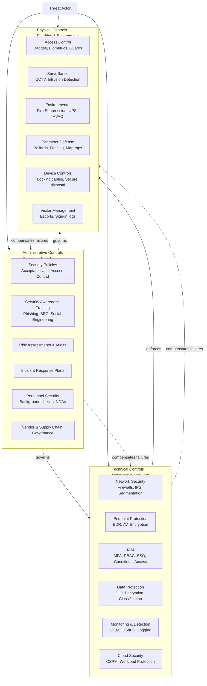
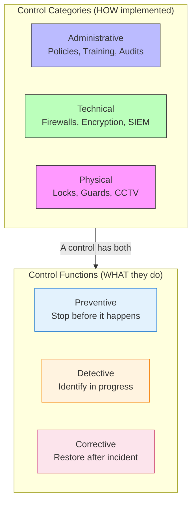

# Administrative, Technical, and Physical Controls

## TCM Exam Objectives

- Distinguish administrative, technical, and physical control categories by what they govern and how they enforce
- Map control types to NIST SP 800-53 control families (AT/PL for admin, AC/IA/SC for technical, PE/MP for physical)
- Describe defense-in-depth: how each control category compensates for failures of the others
- Apply the three-control-category framework to a real-world scenario (e.g., protecting a PII database)
- Map controls to compliance frameworks: NIST CSF, ISO 27001, SOC 2, PCI DSS, HIPAA
- Distinguish control functions (preventive, detective, corrective, compensating) from control categories

**Administrative controls govern human behavior through policies and procedures, technical controls enforce security through hardware and software, and physical controls protect facilities and tangible assets through barriers and environmental safeguards** — together forming the three complementary pillars of defense-in-depth, where each layer compensates for the failures of the others.【turn0search0】【turn0search5】【turn4fetch0】

## The Three Pillars of Defense in Depth

Defense in depth is rooted in military strategy and adapted to cybersecurity with a simple principle: if one layer is breached, others stand ready to defend. No single control can stop all threats, so redundancy across administrative, technical, and physical dimensions is what creates resilience.【turn4fetch0】

The dotted feedback lines show the core defense-in-depth logic: each control type compensates for the failure modes of the others. A locked server room (physical) means little if the admin policy (administrative) lets anyone access it; the world's best firewall (technical) is useless if an attacker can walk up to the console (physical).【turn4fetch0】

📌 **Exam Tip:** The exam tests whether you can identify which control CATEGORY a given control belongs to. Rule of thumb: policies/training/audits = Administrative, firewalls/encryption/SIEM = Technical, locks/guards/CCTV = Physical. Also testable: which NIST 800-53 families map to which category (PE = Physical, AT = Administrative, AC = Technical).

## Master Comparison Table

| Dimension | Administrative Controls | Technical Controls | Physical Controls |
|---|---|---|---|
| **Definition** | Policies, procedures, and practices that govern how security is managed and enforced by people【turn4fetch0】 | Hardware and software that protect systems and data through technology【turn0search16】 | Measures that prevent physical access to IT systems, facilities, and assets【turn0search8】 |
| **What they govern** | Human behavior and organizational processes | Digital systems and data flows | Tangible assets and physical spaces |
| **Enforcement mechanism** | Policy, training, audits, HR discipline — relies on people making safe choices【turn0search12】 | Automated by technology — firewalls, encryption, access control logic【turn0search16】 | Physical barriers and personnel — locks, guards, cameras【turn0search8】 |
| **Key examples** | Acceptable use policy, security awareness training, IR plans, risk assessments, background checks, vendor due diligence【turn4fetch0】 | Firewalls, IPS, EDR, MFA, encryption, DLP, SIEM, CSPM, antivirus【turn0search16】【turn4fetch0】 | Badge readers, biometrics, security guards, CCTV, fire suppression, UPS, mantraps, bollards【turn0search19】【turn0search20】 |
| **Failure mode** | Human error, social engineering, policy drift, lack of enforcement, "check-the-box" compliance culture | Misconfiguration, unpatched vulnerabilities, zero-days, integration gaps, alert fatigue | Tailgating, insider collusion, environmental disaster, supply chain compromise of hardware |
| **Speed of adaptation** | Slow — policy revision, retraining, audit cycles | Fast — patches, rule updates, detection tuning | Slow — capital expenditure, physical retrofitting |
| **NIST 800-53 families** | AT, PL, PM, PS, RA, CA, IR, MA | AC, AU, IA, SC, SI, CM, CP | PE (Physical and Environmental Protection), MP (Media Protection)【turn1search9】 |
| **Primary owner** | CISO, Security GRC, HR, Legal | Security Engineering, IT Operations | Facilities/Physical Security team |

Sources: 【turn0search0】【turn0search2】【turn0search5】【turn0search16】【turn4fetch0】【turn1search9】

---

## Module 1 — Administrative Controls

Administrative controls define the policies, procedures, and practices that govern how security is implemented, managed, and enforced across an organization. They ensure that people and processes align with strategic security objectives — and they sit at the top of the control hierarchy because they dictate how the other two pillars are deployed.【turn4fetch0】 Unlike engineering controls, administrative controls rely on people making safe choices daily.【turn0search12】

### Core Components

**Security Policies and Standards** — Formal documentation of acceptable use, access control, incident response, and data handling procedures, setting clear expectations for all personnel. These are the constitutional documents of the security program — everything else operationalizes them.【turn4fetch0】

**Security Awareness Training** — Regular, role-based training programs to educate employees about emerging threats such as phishing, business email compromise, and social engineering attacks. The human layer is consistently the weakest link — most breaches involve some form of human error or manipulation — so training is the administrative control with the highest direct impact on attack success rates.【turn4fetch0】

**Governance Frameworks** — Oversight mechanisms including risk assessments, internal audits, and management reviews that ensure security controls are functioning effectively and in compliance with internal and external requirements. This is where "we have a policy" becomes "we can prove the policy is working."【turn4fetch0】

**Incident Response Planning** — Clearly defined and rehearsed procedures for identifying, containing, and recovering from security incidents. An IR plan that has never been tabletop-exercised is shelfware; the administrative control is the plan *plus* the rehearsal discipline.【turn4fetch0】

**Personnel Security** — Background checks, position sensitivity designation, termination and transfer procedures, access agreements (NDAs), and user access reviews. NIST 800-53's PS family covers this — protecting the organization from insider threats at the hiring and offboarding lifecycle.【turn1search9】

**Vendor and Supply Chain Governance** — Evaluation and monitoring of suppliers, partners, and service providers to ensure they adhere to appropriate security standards and do not introduce unacceptable risk. This administrative control has grown dramatically in importance as supply chain attacks (SolarWinds, Kaseya, MOVEit) have become a primary threat vector.【turn4fetch0】

📌 **Exam Tip:** Know the three control FUNCTIONS (preventive, detective, corrective) and how they differ from control CATEGORIES (administrative, technical, physical). A control has BOTH a category AND a function. For example: a firewall is a Technical control with a Preventive function. An IDS is a Technical control with a Detective function.

### Why Administrative Controls Matter Most

Without administrative controls, even the most advanced technologies can be undermined by human error, poor decision-making, or lack of accountability.【turn4fetch0】 A perfectly configured firewall is irrelevant if the policy allows an admin to disable it for "convenience" without review. The administrative layer is what gives the technical and physical layers their authority and their enforcement teeth.
---

## Module 2 — Technical Controls

Technical controls use technology to protect information systems and networks from cyber threats — firewalls, encryption, antivirus, intrusion detection systems, and access controls. They automate the process of monitoring and responding to threats, managing the vast volume of data and potential vulnerabilities that human teams cannot handle manually.【turn0search16】 Technical controls are often the first line of defense in identifying and mitigating threats, and they adapt to new threats through regular updates and patches.【turn0search16】

### Core Components

**Network Security** — Firewalls, Intrusion Prevention Systems (IPS), and network segmentation to control and monitor traffic flow and reduce the attack surface. These are the perimeter and internal controls that determine which traffic can reach which assets.【turn4fetch0】

**Endpoint Protection** — Antivirus, Endpoint Detection and Response (EDR), and device encryption solutions that detect and mitigate threats at the user device level. EDR has largely replaced signature-based AV as the primary endpoint control, providing behavioral detection and forensic telemetry.【turn4fetch0】

**Identity and Access Management (IAM)** — Enforcement of least privilege, multi-factor authentication, single sign-on, and risk-based conditional access to reduce the risk of identity compromise. As identity becomes the new perimeter, IAM is the technical control that gates nearly every other control.【turn4fetch0】

**Data Protection Tools** — Encryption, Data Loss Prevention (DLP), and information classification systems to secure sensitive data in use, in motion, and at rest. These controls protect the asset directly rather than the perimeter around it.【turn4fetch0】

**Monitoring and Detection** — SIEM platforms, IDS/IPS, log aggregation, and security analytics that detect threats in real time and enable investigation. This is where technical controls feed the SOC's detection capability — without logging and monitoring, breaches go unnoticed.【turn0search17】

**Cloud and Application Security** — Cloud Security Posture Management (CSPM), workload protection, API security, and SaaS governance to secure modern cloud-native environments where the traditional network perimeter no longer exists.【turn4fetch0】

### The Integration Requirement

Effective technical security relies on integration and visibility — tools must not operate in isolation but feed data into centralized platforms like SIEM systems, enabling coordinated responses to threats.【turn4fetch0】 A firewall that doesn't log to the SIEM, an EDR that doesn't enrich alerts with context, an IAM system that doesn't feed identity telemetry — these are technical controls operating in silos, which dramatically reduces their effectiveness. The mature technical control stack is one where every tool contributes to a unified detection and response capability.

### Technical Control Baseline (Justice Department Example)

The baseline technical security environment recommended by government guidance includes: enforced access control via MFA and need-to-know principle, dual authorization for sensitive system changes, host-based protection (host firewalls and host-based intrusion detection), restricted and encrypted remote access with the ability to rapidly disconnect users, and comprehensive logging.【turn0search17】

---

## Module 3 — Physical Controls

Physical controls protect the organization's infrastructure — servers, networking equipment, end-user devices, and backup media — from unauthorized access or tampering. While often overlooked in digital security discussions, physical security forms the first line of defense, because an attacker with physical access to a server can bypass virtually every technical control.【turn4fetch0】

### Core Components

**Access Control** — Badge readers, biometric authentication, and security guards to restrict access to sensitive areas such as data centers and server rooms. Microsoft's data centers, for example, use two-factor authentication with biometrics throughout — once authenticated, access is granted only to the authorized portion of the data center and only for the time approved. Highly sensitive areas require additional two-factor authentication.【turn0search19】

**Surveillance Systems** — CCTV cameras and intrusion detection systems provide visibility and real-time alerting for physical breaches. Modern systems increasingly incorporate AI analytics for proactive threat detection.【turn4fetch0】【turn0search20】

**Environmental Controls** — Fire suppression systems, temperature monitoring, and uninterruptible power supplies (UPS) ensure that physical infrastructure remains resilient and operational during emergencies. These protect against non-malicious threats (fire, flood, power outage) that can be just as damaging as a cyberattack.【turn4fetch0】

**Perimeter Defense** — Bollards, fencing, mantraps, and security guard patrols protect the data center exterior and enforce sequential authentication zones. Camera-monitored entrance gates ensure entry and exit are restricted to designated areas.【turn0search19】

**Device Control Policies** — Protocols governing the secure storage, transport, and disposal of equipment such as laptops, mobile devices, and removable media. This includes cable locks, encrypted USB policies, and secure media destruction (NIST 800-53 MP family).【turn4fetch0】

**Visitor Management** — Sign-in logs, escort requirements, and badge differentiation for non-employees to ensure visitors cannot move freely through sensitive areas.

### Why Physical Controls Are Non-Negotiable

Physical security is essential for protecting systems that, if compromised, could bypass even the most sophisticated cyber controls. An attacker with physical access to a server can boot from a USB, image the disk, install a hardware keylogger, or simply walk out with the device — defeating every firewall, encryption scheme, and access control in place. In regulated environments such as finance or healthcare, physical controls may even be required for compliance.【turn4fetch0】

---

## Control Function Overlay: The Other Axis

Control categories (administrative/technical/physical) describe *how* a control is implemented. Control functions describe *what* the control does. Every control sits at the intersection of one category and one or more functions — and a mature security program deploys all four functions across all three categories.【turn1search1】【turn1search2】

| Function | Purpose | Administrative Example | Technical Example | Physical Example |
|---|---|---|---|---|
| **Preventive** | Stop the incident before it occurs | Acceptable use policy, security training | Firewall rules, MFA, encryption | Locked server room door, badge reader |
| **Detective** | Identify that an incident has occurred or is occurring | Internal audit, access review | SIEM alerts, IDS, log monitoring | CCTV, intrusion alarm, motion sensor |
| **Corrective** | Fix the problem after detection and restore normal operations | Incident response plan execution | EDR host isolation, account disablement, patch deployment | Fire suppression activation, power failover to UPS |
| **Compensating** | Alternative measure when a primary control cannot be implemented | Manual review process when automated tool unavailable | Network segmentation compensating for shared infrastructure | Security guard patrols compensating for camera blind spots |

Sources: 【turn1search0】【turn1search1】【turn1search2】【turn1search3】

The key insight: a single security objective (say, "protect the data center") is typically addressed by deploying preventive, detective, and corrective controls across all three categories. The locked door (physical preventive) is backed by the CCTV (physical detective), the badge access log (technical detective), the visitor escort policy (administrative preventive), the IR plan for physical breach (administrative corrective), and the fire suppression system (physical corrective). That's defense in depth in practice.

---

## Defense in Depth: A Worked Example

Consider protecting a database containing customer PII. Here's how the three control categories layer together:

**Administrative layer**
- Data classification policy designating the database as "Confidential PII"
- Access control policy specifying least-privilege role assignments and quarterly access reviews
- Acceptable use policy prohibiting data export without approval
- IR plan with a specific playbook for data breach scenarios
- Vendor due diligence on any third party with database access
- Security awareness training covering data handling for all DBAs

**Technical layer**
- Database encryption at rest (AES-256) and in transit (TLS 1.3)
- RBAC enforcement at the database layer, with MFA on the admin console
- Database activity monitoring (DAM) logging every query to the SIEM
- Network segmentation isolating the database subnet from general user networks
- DLP agents detecting and blocking PII exfiltration attempts
- EDR on the database server detecting suspicious process behavior
- Backup automation with immutable, offsite copies for recovery

**Physical layer**
- Server room locked with badge + biometric two-factor access
- CCTV covering all server room entrances and aisles
- UPS and generator backup for the database server rack
- Fire suppression system (clean agent, not water) in the server room
- Secure media disposal for any retired database storage media

If an attacker tries to steal the PII, they face a layered gauntlet: the data classification policy triggers the technical encryption and DLP controls; the network segmentation limits lateral movement; the database activity monitoring detects anomalous queries; the physical controls prevent direct console access; and if all else fails, the IR plan (administrative) triggers containment using EDR (technical) while the backups (technical + physical storage) enable recovery.

---

📌 **Exam Tip:** Know that HIPAA's Security Rule explicitly uses these three categories: Administrative Safeguards (§164.308), Physical Safeguards (§164.310), and Technical Safeguards (§164.312). This is a direct codification of the three-pillar model and is frequently tested on compliance-related questions.

## Mapping to Compliance Frameworks

The administrative/technical/physical taxonomy is not unique to NIST — it's the common structural language across virtually every major compliance framework, which is why a well-designed control set can satisfy multiple frameworks simultaneously (70-80% overlap between SOC 2, ISO 27001, HIPAA, and PCI DSS).【turn1search7】【turn1search5】

| Framework | How It Uses the Three Control Categories |
|---|---|
| **NIST SP 800-53** | 20 control families spanning all three categories — AT/PL/PM/PS/RA/CA/IR/MA (administrative), AC/AU/IA/SC/SI/CM/CP (technical), PE/MP (physical). Over 1,000 individual controls.【turn1search11】【turn1search9】 |
| **NIST CSF 2.0** | Govern/Identify/Protect/Detect/Respond/Recover functions map to controls across all three categories |
| **ISO 27001** | Annex A controls organized into organizational (administrative), people, physical, and technological categories — explicit alignment with the three-pillar model |
| **SOC 2** | Trust Service Criteria (Security, Availability, Processing Integrity, Confidentiality, Privacy) implemented through controls across all three categories — defense-in-depth is the explicit architectural principle【turn1search2】 |
| **PCI DSS** | 12 requirements spanning administrative (security policy, training), technical (firewalls, encryption, access control, logging), and physical (physical access to cardholder data) controls |
| **HIPAA Security Rule** | Three required safeguard categories: Administrative Safeguards (§164.308), Physical Safeguards (§164.310), and Technical Safeguards (§164.312) — a direct codification of the three-pillar model |
| **CMMC / FedRAMP** | Built on NIST 800-53 control families, inheriting the same administrative/technical/physical structure |

The practical implication: a single well-designed control (say, "MFA enforced on all privileged accounts, with access reviews quarterly") simultaneously satisfies NIST 800-53 IA-2, ISO 27001 A.9, SOC 2 CC6.1, PCI DSS 8.3, and HIPAA §164.312(d). This is why mature compliance programs build a unified control library mapped to multiple frameworks rather than treating each framework as a standalone project.【turn1search4】【turn1search8】

---

## Recap

Security controls divide into three complementary categories: **administrative** controls govern human behavior through policies, procedures, training, and governance; **technical** controls enforce security through hardware and software like firewalls, encryption, IAM, EDR, and SIEM; **physical** controls protect facilities and tangible assets through locks, guards, biometrics, CCTV, and environmental safeguards.【turn0search0】【turn0search16】【turn4fetch0】 Each control also carries a function — preventive, detective, corrective, or compensating — and a mature defense-in-depth strategy deploys all four functions across all three categories, so that the failure of any single control is caught by another layer.【turn1search1】【turn1search2】 This three-pillar model is the structural common ground across NIST 800-53, ISO 27001, SOC 2, PCI DSS, and HIPAA, which is why unified control libraries mapped to multiple frameworks can satisfy 70-80% of overlapping requirements without redundant effort.【turn1search7】【turn1search5】 The throughline: no single control is sufficient, no single category is sufficient, and the resilience of the security program comes from the *layering* — administrative governance directing technical enforcement protecting physical assets, with each pillar compensating for the inevitable failures of the others.