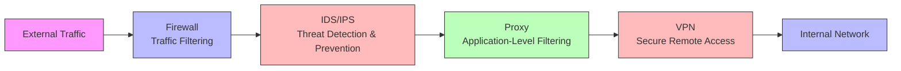
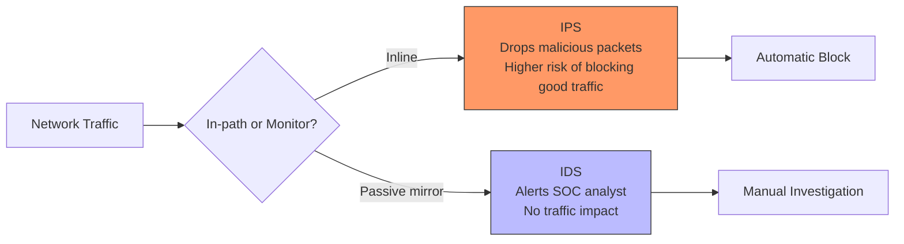
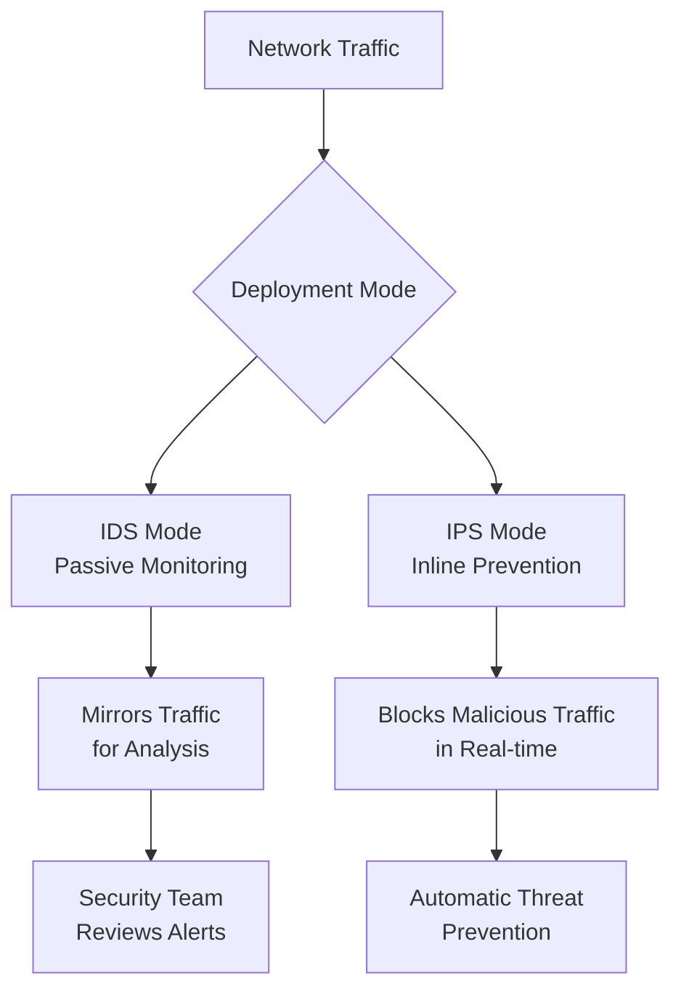
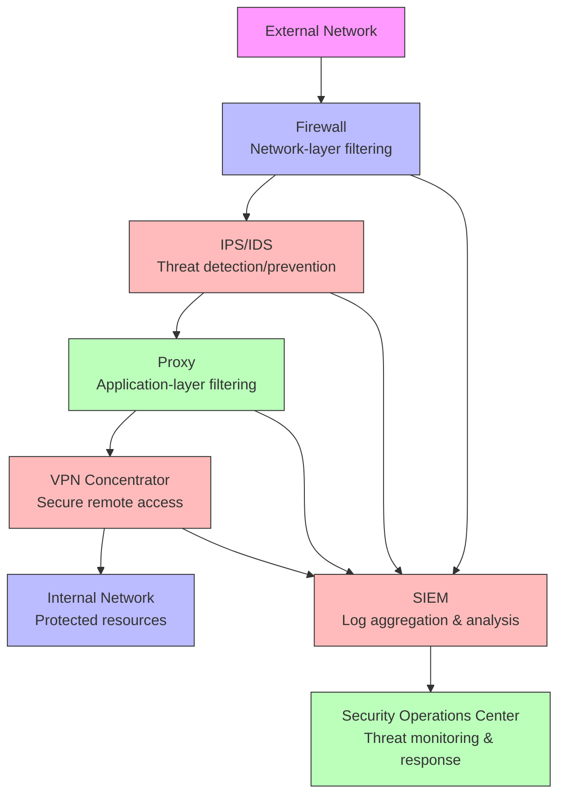
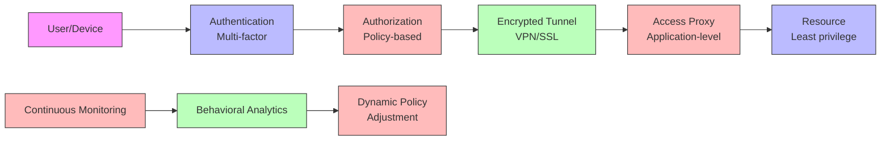
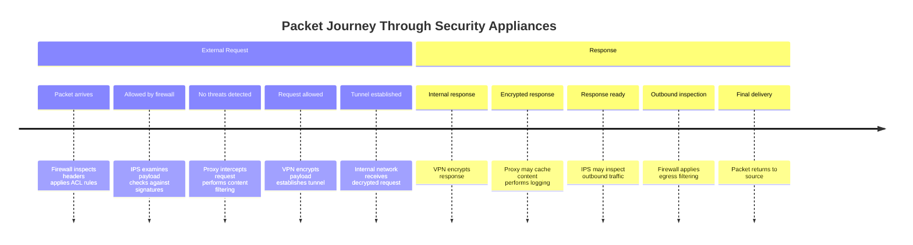
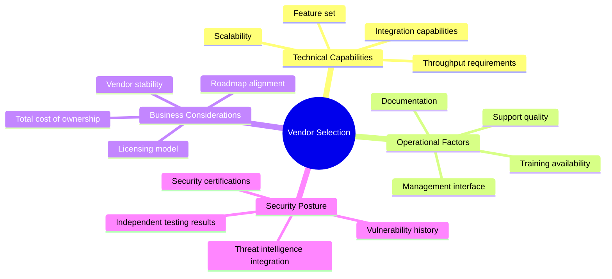
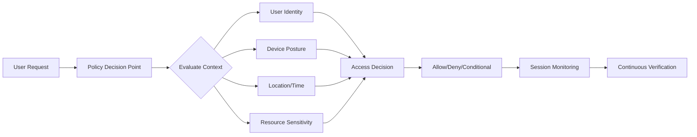
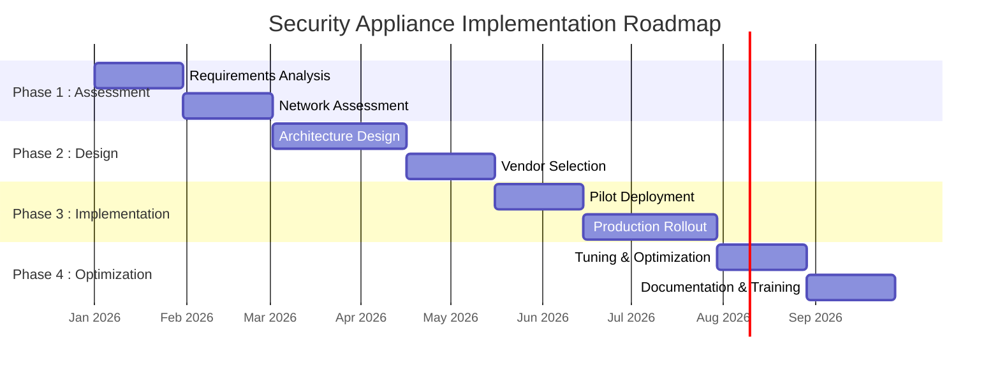

---
tags: [soc]
---
# 🛡️ Full-Stack Lesson: Common Security Appliances

## TCM Exam Objectives

- Distinguish firewall types: packet filtering (L3), stateful (L4), proxy (L7), and NGFW (all layers)
- Compare IDS (passive monitoring, alerts only) vs. IPS (inline, automatic blocking)
- Differentiate forward proxy, reverse proxy, and transparent proxy by traffic direction and use case
- Describe VPN types: remote access, site-to-site, SSL/TLS VPN, and IPsec VPN
- Design a defense-in-depth architecture with layered security appliances and SIEM integration
- Explain Zero Trust Network Access (ZTNA) principles: never trust, always verify, least privilege

# 🛡️ Full-Stack Lesson: Common Security Appliances

## 📚 1. Introduction to Network Security Appliances

Network security appliances are specialized hardware or software devices designed to protect networks from unauthorized access, misuse, and attacks. They form the backbone of modern cybersecurity infrastructure, working together to create layered defense mechanisms.



## 🔍 2. Understanding Core Security Appliances

### 2.1 Firewalls: The First Line of Defense

**What is a Firewall?**
A firewall is a network security system that monitors and controls incoming and outgoing network traffic based on predetermined security rules. It establishes a barrier between a trusted internal network and an untrusted external network, such as the Internet 【turn0search5】.

**Key Functions:**
- **Packet Filtering**: Examines packets against rulesets
- **Stateful Inspection**: Tracks active connections and makes decisions based on context
- **Application-Level Filtering**: Some advanced firewalls can inspect application-layer protocols
- **Network Address Translation (NAT)**: Hides internal IP addresses from external networks

📌 **Exam Tip:** Memorize the progression: Packet Filtering (L3, static rules) → Stateful (L4, tracks connection states) → Proxy (L7, acts as intermediary) → NGFW (all layers, integrated IPS, DPI). The exam tests which firewall type is appropriate for a given scenario. Stateful firewalls are the enterprise standard.

**Types of Firewalls:**

| Type | Layer | Functionality | Best For |
|------|-------|---------------|----------|
| **Packet Filtering** | Network (L3) | Basic header inspection | Simple networks |
| **Stateful Inspection** | Transport (L4) | Tracks connection states | Most enterprise environments |
| **Proxy Firewall** | Application (L7) | Acts as intermediary | High-security web environments |
| **Next-Generation Firewall (NGFW)** | All layers | Integrated IPS, deep packet inspection | Modern enterprises needing comprehensive protection |

**Firewall Configuration Example (Cisco ASA):**
```cisco
! Define inside and outside interfaces
interface GigabitEthernet0/0
 nameif outside
 security-level 0
 ip address 203.0.113.1 255.255.255.0

interface GigabitEthernet0/1
 nameif inside
 security-level 100
 ip address 192.168.1.1 255.255.255.0

! Access control list allowing HTTP/HTTPS
access-list OUTSIDE_IN extended permit tcp any any eq www
access-list OUTSIDE_IN extended permit tcp any any eq https
access-list OUTSIDE_IN extended deny ip any any log

! Apply ACL to outside interface
access-group OUTSIDE_IN in interface outside
```

### 2.2 IDS/IPS: Detection and Prevention Systems

**Intrusion Detection System (IDS):**
An IDS monitors network traffic for suspicious activity and issues alerts when threats are detected but does not take automatic action to block them 【turn0search5】【turn0search11】.

**Intrusion Prevention System (IPS):**
An IPS is similar to an IDS but can automatically take actions to block detected threats, such as dropping malicious packets or resetting connections 【turn0search5】【turn0search11】.

📌 **Exam Tip:** IDS vs. IPS is a classic exam question. IDS = passive, monitors via SPAN port/mirror, alerts only, no traffic impact. IPS = inline, sits in the traffic path, can block in real-time, adds latency risk. False positives are more dangerous for IPS (blocks legitimate traffic).



**Key Differences:**

| Aspect | IDS | IPS |
|--------|-----|-----|
| **Response** | Alerts only | Automatic blocking |
| **Deployment** | Passive (monitoring) | Inline (active) |
| **Impact on Traffic** | Minimal | Potential latency |
| **False Positive Risk** | Lower impact | Higher impact (legitimate traffic blocked) |
| **Primary Role** | Detection & analysis | Prevention & enforcement |

**IDS/IPS Deployment Modes:**



**Common Detection Methods:**
1. **Signature-Based**: Matches traffic against known attack patterns
2. **Anomaly-Based**: Establishes baselines and flags deviations
3. **Protocol Analysis**: Examines protocol behavior for violations

### 2.3 Proxy Servers: Application-Level Gateways

**What is a Proxy Server?**
A proxy server acts as an intermediary for requests from clients seeking resources from other servers. It provides various functions including filtering, caching, and anonymity 【turn0search17】.

**Types of Proxies:**

| Type | Function | Use Case |
|------|----------|----------|
| **Forward Proxy** | Retrieves data from external servers on behalf of clients | Internal network protection, content filtering |
| **Reverse Proxy** | Retrieves data from internal servers on behalf of external clients | Load balancing, SSL termination, protection |
| **Transparent Proxy** | Intercepts traffic without requiring client configuration | ISP caching, corporate filtering |
| **Anonymous Proxy** | Hides client IP address from destination servers | Privacy, bypassing geographic restrictions |

**Proxy Benefits:**
- **Enhanced Security**: Hides internal network structure
- **Content Filtering**: Controls access to websites and content
- **Caching**: Reduces bandwidth usage and improves performance
- **Logging**: Provides detailed records of web access
- **SSL Inspection**: Can decrypt and inspect HTTPS traffic (with proper configuration)

**Proxy Configuration Example (Squid):**
```bash
# Squid proxy configuration
http_port 3128
acl localnet src 192.168.1.0/24
acl SSL_ports port 443
acl Safe_ports port 80
acl Safe_ports port 21
acl Safe_ports port 443
acl Safe_ports port 70
acl Safe_ports port 210
acl Safe_ports port 1025-65535
acl Safe_ports port 280
acl Safe_ports port 488
acl Safe_ports port 591
acl Safe_ports port 777
acl CONNECT method CONNECT

http_access allow localnet
http_access allow Safe_ports
http_access deny !Safe_ports
http_access allow CONNECT SSL_ports
http_access deny all

# Caching settings
cache_mem 256 MB
maximum_object_size 50 MB
cache_dir ufs /var/spool/squid 1000 16 256

# Logging
access_log /var/log/squid/access.log squid
cache_log /var/log/squid/cache.log
```

### 2.4 VPN: Secure Remote Access

**What is a VPN?**
A Virtual Private Network (VPN) extends a private network across a public network, enabling users to send and receive data as if their computing devices were directly connected to the private network 【turn0search7】.

**VPN Types:**

| Type | Use Case | Protocols | Security Level |
|------|----------|-----------|----------------|
| **Remote Access** | Individual users connecting to corporate network | IPSec, SSL/TLS, L2TP | High |
| **Site-to-Site** | Connecting entire networks (e.g., branch offices) | IPSec, GRE | High |
| **Client-to-Site** | Similar to remote access but with dedicated client | SSL/TLS, IPSec | Medium-High |
| **Cloud VPN** | Connecting to cloud environments | Various cloud-native | Varies |

**VPN Core Functions:**
1. **Encryption**: Secures data in transit
2. **Authentication**: Verifies user/device identity
3. **Tunneling**: Encapsulates packets within other packets
4. **Access Control**: Limits access based on policies

**VPN Configuration Example (OpenVPN):**
```bash
# OpenVPN server configuration
port 1194
proto udp
dev tun
ca ca.crt
cert server.crt
key server.key
dh dh.pem
server 10.8.0.0 255.255.255.0
ifconfig-pool-persist ipp.txt
keepalive 10 120
cipher AES-256-CBC
auth SHA256
comp-lzo
user nobody
group nogroup
persist-key
persist-tun
status openvpn-status.log
verb 3
```

## 🏗️ 3. Integrated Security Architecture

### 3.1 Defense in Depth Strategy

Modern networks employ multiple security appliances in a layered approach to provide comprehensive protection. This strategy ensures that if one security measure fails, others are in place to protect the network.



📌 **Exam Tip:** VPN types: Remote Access (individual user to corporate network via IPsec/SSL), Site-to-Site (branch office to HQ via IPsec), Client-to-Site (dedicated VPN client). Also know the difference between SSL VPN (works through firewalls, no client needed) and IPsec VPN (requires client software, more secure).

### 3.2 Deployment Topologies

#### 3.2.1 Perimeter Security Model

Traditional approach with security appliances deployed at network boundaries:

```
Internet → Firewall → DMZ (with proxies, public servers) → Internal Firewall → Internal Network
```

**Characteristics:**
- Clear separation of trust zones
- Centralized security management
- Suitable for smaller organizations

#### 3.2.2 Zero Trust Architecture

Modern approach that verifies every request as though it originates from an open network:



#### 3.2.3 Segmented Network Architecture

Network segmentation with security appliances controlling traffic between segments:

| Segment | Security Controls | Purpose |
|---------|-------------------|---------|
| **DMZ** | Firewalls, reverse proxies, IPS | Public-facing services |
| **Internal Network** | Firewalls, proxies, VPN | Corporate resources |
| **Critical Assets** | Strict firewalls, air gaps | Highly sensitive systems |
| **IoT/OT Networks** | Specialized firewalls, monitoring | Operational technology |

### 3.3 Traffic Flow Through Security Stack



## ⚙️ 4. Practical Implementation Considerations

### 4.1 Performance Optimization

**Critical Factors:**
1. **Throughput Requirements**: Calculate aggregate bandwidth needs
2. **Latency Sensitivity**: Minimize latency for real-time applications
3. **Concurrent Connections**: Size appliances for peak connection counts
4. **Inspection Depth**: Balance security thoroughness with performance

**Performance Tuning Checklist:**
- [ ] Enable hardware acceleration where available
- [ ] Implement connection rate limiting
- [ ] Optimize rule order (most specific rules first)
- [ ] Use efficient logging (sampled logging for high traffic)
- [ ] Consider dedicated interfaces for management traffic
- [ ] Implement quality of service (QoS) for critical applications

### 4.2 High Availability Design

**Redundancy Patterns:**

| Pattern | Implementation | Best For |
|---------|----------------|----------|
| **Active-Standby** | One appliance active, other waits | Simple failover needs |
| **Active-Active** | Both appliances handle traffic | Maximum throughput |
| **Clustering** | Multiple appliances as single logical unit | Scalability |
| **Geographic Redundancy** | Appliances in different locations | Disaster recovery |

**Sample HA Configuration (Cisco ASA):**
```cisco
! Failover configuration
failover
failover lan unit primary
failover lan interface failover GigabitEthernet0/3
failover link failover GigabitEthernet0/3
failover interface ip failover 192.168.255.1 255.255.255.252 standby 192.168.255.2

! Stateful failover
failover link state GigabitEthernet0/2
failover interface ip state 192.168.254.1 255.255.255.252 standby 192.168.254.2
```

### 4.3 Management and Monitoring

**Centralized Management Approaches:**
1. **SIEM Integration**: Forward logs to Security Information and Event Management systems
2. **Centralized Policy Management**: Manage multiple appliances from single console
3. **Automated Response**: Implement SOAR for automated threat response
4. **Continuous Monitoring**: Real-time visibility into security posture

**Key Metrics to Monitor:**
- Blocked vs. allowed traffic ratios
- Top attacked ports/services
- VPN session statistics
- Proxy cache hit rates
- IPS signature match frequency
- Appliance resource utilization (CPU, memory, connections)

## 🚨 5. Common Challenges and Solutions

### 5.1 Operational Challenges

| Challenge | Impact | Solution |
|-----------|--------|----------|
| **False Positives** | Legitimate traffic blocked | Tuning rules, whitelist legitimate traffic |
| **Performance Bottlenecks** | Network latency | Hardware upgrades, rule optimization |
| **Configuration Drift** | Security gaps | Regular audits, version control |
| **Log Overload** | Missed critical alerts | Log filtering, priority-based alerting |
| **Complexity** | Management difficulty | Automation, standardized templates |

### 5.2 Integration Issues

<details>
<summary>🔧 Common Integration Problems and Solutions</summary>

**Problem 1: IPS blocking legitimate VPN traffic**
- **Solution**: Create bypass rules for known VPN traffic, use IPS exceptions

**Problem 2: Proxy interfering with VPN protocols**
- **Solution**: Configure proxy bypass for VPN protocols, use split tunneling

**Problem 3: Firewall rules conflicting with IPS policies**
- **Solution**: Establish change management process, coordinate rule changes

**Problem 4: Inconsistent logging across appliances**
- **Solution**: Implement standard logging format, use log normalization

**Problem 5: Authentication mismatches between systems**
- **Solution**: Centralize authentication, use SAML/OAuth where possible
</details>

## 📊 6. Comparative Analysis

### 6.1 Security Appliance Comparison Matrix

| Feature | Firewall | IDS/IPS | Proxy | VPN |
|---------|----------|---------|-------|-----|
| **Primary Layer** | L3-L4 | L3-L7 | L7 | L3-L4 |
| **Inspection Depth** | Packet headers | Full payload | Application content | Encrypted tunnels |
| **Action Mode** | Block/Allow | Alert/Block | Intercept/Cache | Encrypt/Tunnel |
| **Performance Impact** | Low-Medium | Medium-High | Medium | Low-Medium |
| **Management Complexity** | Medium | High | Medium-High | Medium |
| **Cost** | Medium-High | High | Medium | Medium |
| **Deployment Model** | Inline | Inline or Passive | Inline | Inline or Client-based |

### 6.2 Vendor Selection Criteria



## 🔮 7. Emerging Trends and Future Directions

### 7.1 Cloud-Native Security Appliances

**Characteristics:**
- Deployed as virtual instances in cloud environments
- API-driven configuration and management
- Elastic scaling based on demand
- Integration with cloud-native services (AWS GuardDuty, Azure Sentinel)

**Implementation Example:**
```yaml
# CloudFormation snippet for AWS Network Firewall
Resources:
  NetworkFirewall:
    Type: AWS::NetworkFirewall::Firewall
    Properties:
      FirewallName: "CorporateNetworkFirewall"
      FirewallPolicyArn: !Ref FirewallPolicy
      VpcId: !Ref VPC
      SubnetMappings:
        - SubnetId: !Ref PublicSubnet1
        - SubnetId: !Ref PublicSubnet2
      Tags:
        - Key: "Environment"
          Value: "Production"
```

### 7.2 AI and Machine Learning Integration

**Applications:**
- **Anomaly Detection**: ML models for behavioral analysis
- **Automated Response**: AI-driven threat response
- **Predictive Analytics**: Threat forecasting based on patterns
- **Natural Language Processing**: Query security data using natural language

### 7.3 Zero Trust Network Access (ZTNA)

**Principles:**
1. Never trust, always verify
2. Least privilege access
3. Assume breach
4. Verify explicitly

**Implementation Architecture:**


## 📋 8. Implementation Checklist

<details>
<summary>📝 Pre-Deployment Checklist</summary>

- [ ] **Requirements Analysis**
  - [ ] Document throughput requirements
  - [ ] Identify critical applications and services
  - [ ] Define compliance requirements
  - [ ] Assess current network architecture

- [ ] **Design Phase**
  - [ ] Create network topology diagrams
  - [ ] Define security zones and segmentation
  - [ ] Plan IP addressing scheme
  - [ ] Design high availability architecture
  - [ ] Plan management network

- [ ] **Vendor Selection**
  - [ ] Evaluate technical capabilities
  - [ ] Request and evaluate POC units
  - [ ] Check references and case studies
  - [ ] Evaluate total cost of ownership
  - [ ] Assess vendor support capabilities

- [ ] **Implementation Planning**
  - [ ] Create detailed implementation schedule
  - [ ] Plan maintenance windows
  - [ ] Prepare rollback procedures
  - [ ] Document configuration standards
  - [ ] Plan training for operations team

- [ ] **Testing**
  - [ ] Develop test plans for each appliance
  - [ ] Test failover scenarios
  - [ ] Validate performance under load
  - [ ] Test security policies in isolated environment
  - [ ] Verify logging and monitoring
</details>

## 🎓 9. Learning Resources and Certification Paths

### 9.1 Recommended Certifications

| Certification | Focus | Vendor/ Organization |
|---------------|-------|---------------------|
| **CCNA Security** | Network security fundamentals | Cisco |
| **CCNP Security** | Advanced security solutions | Cisco |
| **CISSP** | Security management expertise | ISC² |
| **CEH** | Ethical hacking techniques | EC-Council |
| **GCFE** | Forensic analysis | GIAC |
| **CCSP** | Cloud security | ISC² |

### 9.2 Practical Lab Setup

**Minimum Lab Requirements:**
- 2x physical or virtual machines for firewall HA
- 1x IPS/IDS appliance (virtual or physical)
- 1x proxy server (Squid or similar)
- 1x VPN concentrator (OpenVPN or commercial)
- 2x internal networks for segmentation
- Traffic generator for testing

**Lab Scenarios:**
1. Basic firewall rules and NAT configuration
2. IPS signature tuning and false positive reduction
3. Proxy content filtering and caching
4. VPN remote access configuration
5. Integrated attack scenario testing

## 💎 10. Conclusion and Best Practices

### 10.1 Key Takeaways

1. **Layered Defense**: No single appliance provides complete protection
2. **Proper Configuration**: Security effectiveness depends on correct configuration
3. **Continuous Monitoring**: Security appliances require ongoing monitoring and tuning
4. **Performance Balance**: Balance security thoroughness with network performance
5. **Regular Updates**: Keep signatures and software current
6. **Documentation**: Maintain comprehensive documentation of configurations and policies
7. **Testing**: Regularly test failover and security policies
8. **Training**: Ensure operations staff is properly trained

### 10.2 Implementation Roadmap



### 10.3 Final Recommendations

> 💡 **Pro Tip**: Start with a clear security policy that defines what you're protecting and why. Technology should implement policy, not define it.

> ⚠️ **Common Mistake**: Avoid "set and forget" mentality. Security appliances require ongoing maintenance and tuning to remain effective.

> 📈 **Success Metric**: Measure security effectiveness not just by blocked attacks, but by reduced dwell time and faster incident response.

The effective deployment of firewalls, IDS/IPS, proxies, and VPNs requires understanding both the technical capabilities of each appliance and how they work together to create comprehensive security. By following the principles outlined in this lesson and continuously adapting to emerging threats, organizations can build robust security architectures that protect their critical assets while enabling business operations.