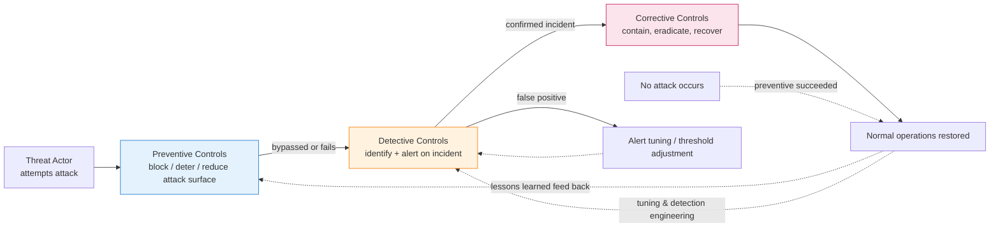
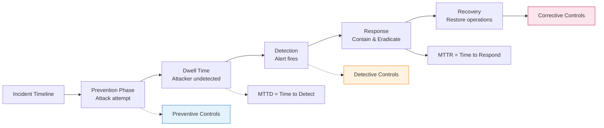

# Preventative, Detective, and Corrective Controls

## TCM Exam Objectives

- Distinguish preventive, detective, and corrective control functions by goal, timing, and NIST CSF mapping
- Map control functions to NIST CSF core functions: Protect (preventive), Detect (detective), Respond/Recover (corrective)
- Describe compensating controls and when they are used (alternative measure when primary control cannot be deployed)
- Measure control effectiveness using MTTD (Mean Time to Detect), MTTR (Mean Time to Respond/Recover), and relevant KPIs
- Apply all three control types to a ransomware attack scenario in chronological sequence
- Identify common pitfalls: over-reliance on prevention, alert fatigue, untested corrective controls

**Preventive controls stop threats before they occur, detective controls identify incidents in progress or after the fact, and corrective controls limit damage and restore systems to normal operations** — together forming the temporal backbone of defense-in-depth, where each control type maps to a phase of the incident lifecycle and a function of the NIST Cybersecurity Framework.【turn0search3】【turn1fetch0】 Understanding these three control functions is what transforms a pile of security tools into a coherent security program: prevention buys down the probability of compromise, detection compresses the dwell time when prevention fails, and correction limits the blast radius when detection is late.【turn0search4】

## The Control Lifecycle at a Glance

The three control types are not parallel categories — they are *sequential phases* of risk mitigation, each activated at a different point in the incident timeline. A well-architected security program deploys all three in layers, because every preventive control will eventually fail, every detective control has a detection gap, and every corrective control assumes damage has already occurred.【turn0search14】【turn1fetch0】

The dotted feedback lines are what turn this from a linear pipeline into a *learning loop* — every incident investigated by detective controls and remediated by corrective controls should feed back into stronger preventive controls and tighter detection logic. Without that feedback, the same threats recur with the same gaps.【turn1fetch0】

## Master Comparison Table

| Dimension | Preventive Controls | Detective Controls | Corrective Controls |
|---|---|---|---|
| **Goal** | Stop an incident from occurring | Identify that an incident is happening or has happened | Minimize damage, restore operations, prevent recurrence |
| **Timing** | Before the attack succeeds | During or after the attack | After detection |
| **NIST CSF function** | Protect (and Identify informs it) | Detect | Respond and Recover |
| **NIST 800-53 family examples** | AC (Access Control), IA (Identification & Auth), SC (System & Communications Protection), CM (Configuration Management) | AU (Audit & Accountability), SI-4 (System Monitoring), IR-4 (Incident Monitoring) | IR (Incident Response), CP (Contingency Planning), SI-3 (Malicious code protection — quarantine), MA (Maintenance) |
| **What it answers** | "Can we stop this from happening?" | "Did something happen, and what?" | "How do we fix it and recover?" |
| **Key examples** | Firewalls, MFA, encryption, ACLs, security awareness training, secure coding, network segmentation, patching | IDS/IPS, SIEM, log monitoring, CCTV, file integrity monitoring, UEBA, XDR, NDR | Incident response plans, backups & disaster recovery, EDR host isolation, antivirus quarantine, patch deployment, SOAR playbooks |
| **Failure mode** | Bypassed by novel attack, misconfiguration, zero-day, social engineering | Detection gap, alert fatigue, false positives, blind spots | Untested IR plan, corrupted backups, slow containment, inadequate recovery procedures |
| **Primary KPI** | Blocked intrusion attempts, phishing test pass rate, patch compliance % | MTTD (Mean Time to Detect), false positive rate, alert-to-incident ratio | MTTR (Mean Time to Respond/Recover), downtime, recovery point objective met |
| **Owner** | Security Engineering, IT Ops, GRC (policy) | SOC, Detection Engineering, Monitoring teams | IR team, IT Operations, Business Continuity |

Sources: 【turn0search3】【turn0search2】【turn1fetch0】【turn2fetch0】

---

📌 **Exam Tip:** Know the three control functions by their NIST CSF mapping: Preventive = Protect (PR), Detective = Detect (DE), Corrective = Respond (RS) + Recover (RC). The exam gives scenarios and asks "which control function does this represent?" A firewall blocking traffic = Preventive. An IDS alert = Detective. Backups = Corrective/Recovery.

## Module 1 — Preventive Controls: Stopping Threats Before They Happen

A preventive control is a control put in place and intended to avoid an incident from occurring — to stop trouble before it starts. A preventive control attempts to block any unauthorized attempt to change or access a system before it happens, and in theory, prevention means the attack will fail.【turn2fetch0】 Preventive controls reduce the attack surface and raise the cost of attack, making successful compromise less likely.

### What Makes a Control "Preventive"

Preventive controls typically involve mechanisms that users cannot override — implemented in a correct, unalterable way that prevents a bad actor from defeating the mechanism by changing it. They are often process-oriented and may increase the time required for certain system activities, occasionally interfering with system use to the point that they hinder normal operation. This is the perpetual tension of preventive security: every lock makes legitimate access slightly harder.【turn2fetch0】

### Preventive Controls Across Implementation Categories

Preventive controls span all three implementation types (administrative, technical, physical) — the *function* (preventive) is orthogonal to the *category* (how it's implemented).【turn2fetch0】【turn3fetch0】

**Preventive Administrative Controls** (sometimes called "soft controls" because they are management- and documentation-oriented):
- Security policies and procedures
- Onboarding/offboarding processes with timely access provisioning and revocation
- Reference and background checks
- Security awareness training programs
- Data classification and labeling policies

**Preventive Technical (Logical) Controls:**
- Passwords, biometrics, multi-factor authentication
- Encryption (at rest and in transit)
- Access control lists, least-privilege enforcement, constrained user interfaces
- Firewalls and network segmentation
- Antimalware software with real-time blocking
- Static code analysis and secure code review in the SDLC

**Preventive Physical Controls:**
- Badges, biometrics, keycards
- Fences, locks, mantraps
- Security guards and guard dogs

### Advanced Preventive Controls (Modern Stack)

**Zero Trust Architecture (ZTA)** — operates on "never trust, always verify," eliminating implicit trust and continuously validating every digital interaction. This shifts prevention from a perimeter-based to a data-centric model, dramatically reducing the attack surface.【turn1fetch0】

**AI-Powered Threat Prevention** — next-generation antivirus and endpoint protection platforms use machine learning to predict and block unknown malware strains before they can execute, moving prevention beyond signature-based approaches.【turn1fetch0】

**Cloud IAM Policies & CSPM** — in cloud environments, preventive controls increasingly mean well-configured IAM policies (least privilege, conditional access) and continuous posture management to prevent misconfigurations before they're exploited.【turn2fetch1】

### The Preventive Mindset

When considering the security posture for a control environment, it is most productive to use a primarily preventive model, then use detective, corrective, recovery, and compensating controls to supplement and support it.【turn2fetch0】 The logic is simple: an incident that never occurs costs nothing to detect, contain, or recover from. But the dangerous corollary is *over-reliance on prevention* — believing preventive controls are foolproof. The mature stance is "prevention first, assume breach, layer detection and correction behind it."【turn2fetch1】

---

## Module 2 — Detective Controls: Spotting Trouble When It Occurs

Detective controls are designed to find intruders and anomalies that have bypassed preventive measures. Their purpose is to identify and alert when a security incident is happening or has already happened.【turn1fetch0】 Detection is the critical bridge between prevention and correction — without it, an attacker who bypasses prevention operates undisturbed, and corrective controls never activate.

### What Makes a Control "Detective"

A detective control operates *after* an event has occurred or is in progress. Where a firewall (preventive) blocks a malicious connection before it completes, a log entry or IDS alert (detective) records that the connection attempt happened and flags it for investigation. The example from Linford & Co. is instructive: auditing logs is done after an event took place, so it is a detective control; a firewall tries to prevent something bad from taking place, so it is preventive.【turn2fetch0】

### Detective Controls Across Implementation Categories

**Detective Administrative Controls:**
- Internal audits and compliance reviews
- Access reviews (detecting excessive or orphaned permissions)
- Vendor risk assessments and continuous monitoring
- Periodic risk assessments
- Management reviews and oversight reporting

**Detective Technical Controls:**
- Intrusion Detection Systems (IDS) and Intrusion Prevention Systems in detect mode
- Security Information and Event Management (SIEM) platforms
- Log monitoring and centralized log aggregation
- File Integrity Monitoring (FIM)
- Endpoint Detection and Response (EDR) behavioral analytics
- Database Activity Monitoring (DAM)

**Detective Physical Controls:**
- CCTV surveillance cameras
- Motion sensors and intrusion alarms
- Visitor logs and badge swipe records
- Guard patrols and physical security audits

### Advanced Detective Controls (Modern Stack)

**User and Entity Behavior Analytics (UEBA)** — these systems baseline normal user behavior and use machine learning to detect anomalous activity that could indicate a compromised account or insider threat, catching what rule-based detection structurally misses.【turn1fetch0】

**Extended Detection and Response (XDR)** — XDR platforms provide a more holistic view than traditional EDR by collecting and correlating data from endpoints, networks, cloud workloads, and email, breaking down the silos that let attackers hide in the gaps between tools.【turn1fetch0】

**Network Detection and Response (NDR)** — analyzes network traffic patterns to detect lateral movement, data exfiltration, and attacks on unmanaged devices that endpoint agents miss.

📌 **Exam Tip:** Know the key metrics: MTTD (Mean Time to Detect) measures detective control effectiveness — lower is better. MTTR (Mean Time to Respond/Recover) measures corrective control effectiveness — lower is better. The goal is to minimize both. Dwell time = time from compromise to detection = MTTD.

### The Detection Challenge: Alert Fatigue

The dominant failure mode of detective controls is **alert fatigue** — detective controls can generate a massive volume of alerts, and without proper tuning and prioritization (often with SIEMs and SOAR), security teams can become overwhelmed and miss critical incidents.【turn2fetch1】 This is why detection engineering — tuning rules, suppressing false positives, enriching alerts with context — is now a dedicated discipline within mature SOCs. A detective control that generates 10,000 alerts a day with 95% false positives is operationally worse than one that generates 100 high-fidelity alerts, because the noise masks the signal.
---

## Module 3 — Corrective Controls: Fixing What's Broken and Recovering

Corrective controls respond to and recover from an incident — minimizing damage, restoring operations, and preventing the incident from recurring.【turn1fetch0】 Where preventive controls reduce the probability of compromise and detective controls reduce the dwell time, corrective controls reduce the *impact* — the blast radius once an attacker is in.

### What Makes a Control "Corrective"

A corrective control activates *after* an incident has been detected. The Linford example: a backup image is created so that if software gets corrupted, it can be reloaded — that's a corrective control. A data backup system developed so data can be recovered is technically a *recovery* control (a closely related function focused on restoring normal operations), while corrective controls more broadly encompass containment, eradication, and restoration.【turn2fetch0】

### Corrective Controls Across Implementation Categories

**Corrective Administrative Controls:**
- Incident response plans and playbooks
- Business continuity and disaster recovery plans
- Post-incident review and lessons-learned processes
- Disciplinary procedures for policy violations
- Insurance and cyber insurance arrangements

**Corrective Technical Controls:**
- EDR host isolation and process termination
- Antivirus quarantine of malicious files
- Patch deployment to close exploited vulnerabilities
- Account disablement and credential rotation
- Backup restoration and system rebuilds
- SOAR-automated containment playbooks

**Corrective Physical Controls:**
- Fire suppression system activation
- Power failover to UPS/generator
- Physical security incident response (guard response to alarm)
- Evacuation and emergency procedures

### Advanced Corrective Controls (Modern Stack)

**Security Orchestration, Automation and Response (SOAR)** — SOAR platforms help security teams manage and respond to alerts more efficiently, automating repetitive tasks in the incident response process so analysts can focus on critical investigation and remediation. SOAR is the connective tissue that turns corrective controls from manual procedures into machine-speed response.【turn1fetch0】

**Cyber Threat Intelligence Platforms** — provide context on threats, helping organizations prioritize alerts and tailor corrective actions based on the specific adversary and their tactics, ensuring the corrective response matches the actual threat rather than a generic playbook.【turn1fetch0】

**SOAR + EDR Integration** — when detection fires, SOAR can automatically trigger EDR host isolation, disable the compromised account, block the malicious IP at the firewall, and create a case in the IR platform — compressing MTTR from hours to minutes.

### The Corrective Control Testing Gap

The most common failure of corrective controls is **inadequate testing** — many organizations create an incident response plan but never test it. When a real incident occurs, the plan proves to be outdated or ineffective.【turn2fetch1】 Backups that have never been restored, IR plans that have never been tabletop-exercised, and SOAR playbooks that have never been run against a realistic scenario are all shelfware. The corrective control is the plan *plus* the validated ability to execute it under pressure.

---

## Module 4 — Related Control Functions: Compensating and Recovery

While preventive, detective, and corrective are the three primary functions, two additional functions complete the picture and are worth distinguishing clearly.【turn2fetch0】

**Compensating controls** provide alternative measures of control when a primary control cannot be implemented or has failed. They are typically deployed in conjunction with other controls to aid in enforcement and support, making up for the lack of other effective controls. Example: if an organization cannot implement MFA on a legacy system (primary preventive control), a compensating control might be enhanced logging and alerting on that system's access (detective) combined with network segmentation isolating it from the rest of the network (preventive).【turn0search6】

**Recovery controls** are designed to recover a system or process and return it to normal operations following an incident. While corrective controls encompass the full response cycle (containment, eradication, restoration), recovery controls specifically focus on the restoration phase — backups, disaster recovery, system rebuilds. The distinction matters in frameworks like NIST 800-53 where CP (Contingency Planning) is its own control family distinct from IR (Incident Response).【turn0search6】

---

## Mapping to Compliance Frameworks

These three control functions are the structural common ground across every major compliance framework, which is why auditors specifically look for evidence of all three types to ensure a comprehensive security program.【turn1fetch0】

| Framework | Preventive | Detective | Corrective |
|---|---|---|---|
| **NIST CSF 2.0** | Protect (PR) — access control, awareness training, data security, protective technology | Detect (DE) — anomalies and events, continuous monitoring, detection processes | Respond (RS) + Recover (RC) — response planning, communications, analysis, mitigation, improvements, recovery planning, improvements |
| **NIST SP 800-53** | AC, IA, SC, CM, AT, PL | AU, SI-4, IR-4, CA (assessment) | IR, CP, SI-3, MA |
| **ISO 27001 Annex A** | A.5 (Organizational), A.8 (Asset management), A.8.3 (Information access restriction) | A.8.15 (Logging), A.8.16 (Monitoring) | A.5.24-5.30 (Incident management), A.8.13 (Information backup), A.8.14 (Redundancy) |
| **SOC 2 Trust Services Criteria** | CC6 (Logical and physical access), CC7.1 (system operations) | CC7.2 (monitoring), CC7.3 (system failures detected) | CC7.3 (system failures corrected), CC7.4 (incident response) |
| **PCI DSS v4.0** | Req 1 (firewalls), Req 2 (config), Req 8 (auth), Req 3 (encryption), Req 6 (secure coding), Req 12 (security policy) | Req 10 (logging & monitoring), Req 11 (security testing) | Req 12.10 (incident response), Req 10.7 (log retention for investigation) |
| **HIPAA Security Rule** | §164.308(a)(4) Access Control, §164.312(a) Access Control, §164.312(b) Audit Controls (preventive aspect) | §164.312(b) Audit Controls (detective aspect), §164.308(a)(1)(ii)(C) Information System Activity Review | §164.308(a)(6) Security Incident Procedures, §164.308(a)(7) Contingency Plan |

Sources: 【turn1fetch0】【turn2fetch0】【turn0search9】

The practical implication: a single well-designed control (say, "MFA enforced on all privileged accounts with SIEM alerting on failed authentications and automated account lockout on 5 failures") simultaneously satisfies the preventive requirement of NIST CSF PR.AC, the detective requirement of NIST CSF DE.CM, and the corrective requirement of NIST CSF RS.MI — which is why unified control libraries mapped to multiple frameworks can satisfy 70-80% of overlapping requirements without redundant effort.

---

## End-to-End Worked Example: Ransomware Scenario

Consider a ransomware attack against an enterprise. Here's how preventive, detective, and corrective controls activate in sequence:

**Preventive controls (attempt to stop the attack before it succeeds):**
- Email security gateway blocks the phishing email carrying the ransomware loader (preventive technical)
- Security awareness training means the user reports the suspicious email instead of clicking (preventive administrative)
- EDR signature/behavioral detection blocks the initial payload execution (preventive technical)
- Network segmentation limits the attacker's lateral movement paths (preventive technical)
- Patch management has already closed the SMB vulnerability the ransomware tries to exploit for spreading (preventive technical)
- MFA on admin accounts prevents the attacker from using stolen credentials (preventive technical)

**Detective controls (identify the attack when prevention fails):**
- If the phishing email bypasses the gateway, EDR behavioral detection flags the malicious process execution and alerts the SOC (detective technical)
- SIEM correlates the EDR alert with anomalous SMB scanning patterns across multiple hosts (detective technical)
- UEBA flags the compromised service account making unusual authentication attempts (detective technical)
- File Integrity Monitoring detects mass file modification characteristic of encryption (detective technical)
- A user reports their files are suddenly inaccessible (detective administrative — human sensor)

**Corrective controls (contain, eradicate, recover):**
- SOAR playbook automatically isolates the initially infected host via EDR (corrective technical — containment)
- IR team activates the ransomware playbook, engaging legal, comms, and executive stakeholders (corrective administrative)
- Compromised credentials are rotated across the environment (corrective technical — eradication)
- The exploited vulnerability is patched network-wide if it wasn't already (corrective technical — eradication)
- Systems are rebuilt from clean images and data restored from immutable offline backups (corrective technical — recovery)
- Post-incident review identifies the detection gap that let the phishing email through and the preventive failure in the email gateway, feeding back into stronger preventive and detective controls for the next cycle (corrective administrative — improvement)

The entire sequence — prevention attempting to block, detection catching what got through, correction containing and recovering — is defense in depth operating as designed. If any single layer were missing, the attack would succeed at that layer's failure point: no prevention means constant incident volume overwhelming detection; no detection means unlimited attacker dwell time; no correction means the attack succeeds fully when it eventually lands.

---

## Metrics and Measurement: Are Your Controls Working?

Implementing controls is not enough — you must measure their effectiveness across all three functions.【turn1fetch0】

| Control Type | Key KPIs | Testing Method |
|---|---|---|
| **Preventive** | Blocked intrusion attempts, phishing simulation pass rate, patch compliance %, MFA enrollment %, vulnerability scan findings remediated | Penetration testing, red team exercises, phishing simulations, code review |
| **Detective** | MTTD (Mean Time to Detect), false positive rate, alert-to-incident ratio, % of alerts investigated, detection coverage against MITRE ATT&CK | Purple team exercises, tabletop scenarios, detection tuning, false positive audits |
| **Corrective** | MTTR (Mean Time to Respond/Recover), downtime per incident, recovery point objective met, % of incidents closed within SLA, lessons-learned implementation rate | Disaster recovery drills, IR tabletop exercises, backup restoration tests, SOAR playbook dry runs |

Sources: 【turn1fetch0】【turn2fetch1】

---

📌 **Exam Tip:** The ransomware scenario in this module is a perfect exam blueprint — understand the chronological sequence: Preventive (email gateway → training → EDR → segmentation → patching → MFA) → Detective (EDR → SIEM → UEBA → FIM → user report) → Corrective (SOAR isolation → IR plan → credential rotation → patching → backups → post-incident review). Know what happens at each stage.

## Common Pitfalls

**Over-reliance on prevention** — believing preventive controls are foolproof is a dangerous mindset. Assume you will be breached and invest in detection and response proportionally.【turn2fetch1】 The mature ratio is not "all prevention" but a balanced portfolio where prevention reduces volume, detection catches the bypasses, and correction limits the damage.

**Alert fatigue** — detective controls generating massive alert volumes without tuning leads to SOC burnout and missed critical incidents. The fix is relentless detection engineering: tune, suppress, enrich, and prioritize.【turn2fetch1】

**Untested corrective controls** — an IR plan that has never been exercised, backups that have never been restored, and SOAR playbooks that have never been run are shelfware. The corrective control is the plan *plus* the validated ability to execute under pressure.【turn2search1】

**Balancing security and usability** — overly restrictive preventive controls hinder productivity and drive employees toward insecure workarounds (shadow IT, personal cloud storage, shared credentials). The right balance is a constant challenge that requires ongoing calibration.【turn2fetch1】

**Treating the three as silos** — the most common architectural failure is implementing preventive, detective, and corrective controls independently, without the feedback loops that turn incidents into improvements. A mature program treats them as a closed loop: prevention informs what to detect, detection informs what to correct, and correction informs what to prevent next time.

---

## Recap

Preventive controls stop threats before they occur through firewalls, MFA, encryption, training, and segmentation; detective controls identify incidents in progress or after the fact through IDS, SIEM, logging, UEBA, and XDR; and corrective controls minimize damage and restore operations through IR plans, backups, EDR isolation, patching, and SOAR automation.【turn0search3】【turn1fetch0】 These three functions map directly to the NIST CSF Protect/Detect/Respond-Recover functions and form the temporal backbone of every major compliance framework from ISO 27001 to PCI DSS to HIPAA.【turn1fetch0】 The strategic principle is layered defense-in-depth: prevention reduces the probability of compromise, detection compresses dwell time when prevention fails, and correction limits the blast radius when detection is late — with post-incident lessons feeding back into stronger prevention and tighter detection for the next cycle. No single control type is sufficient, and the resilience of the security program comes from the *integration* of all three, tested continuously and refined through every incident handled.