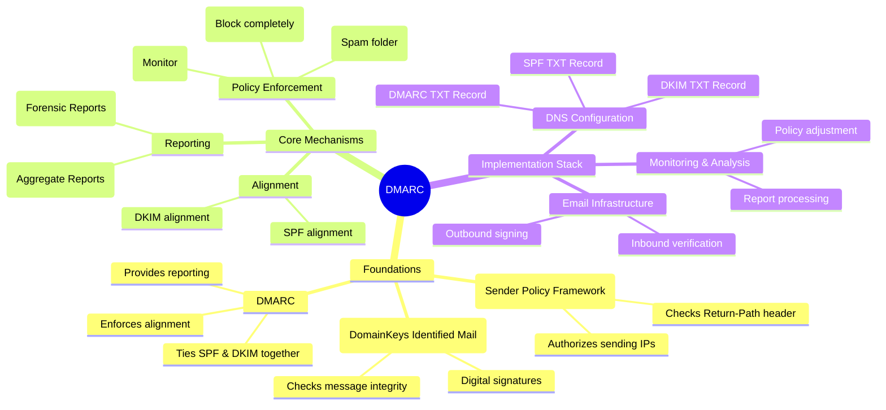
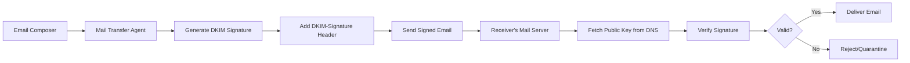
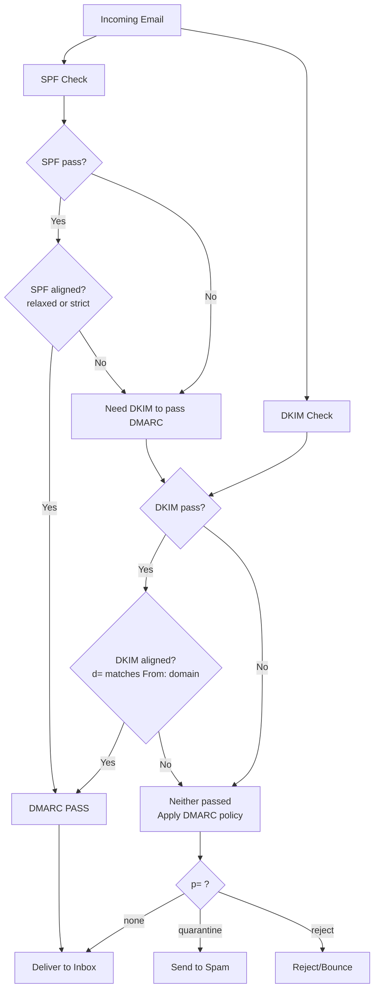
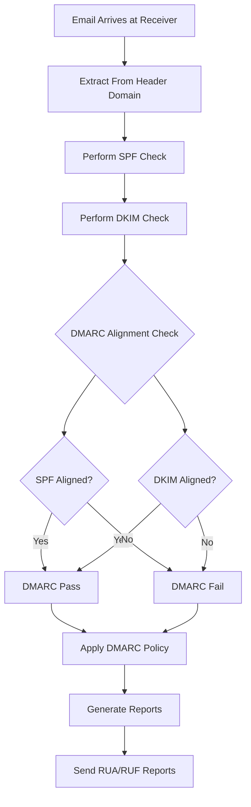
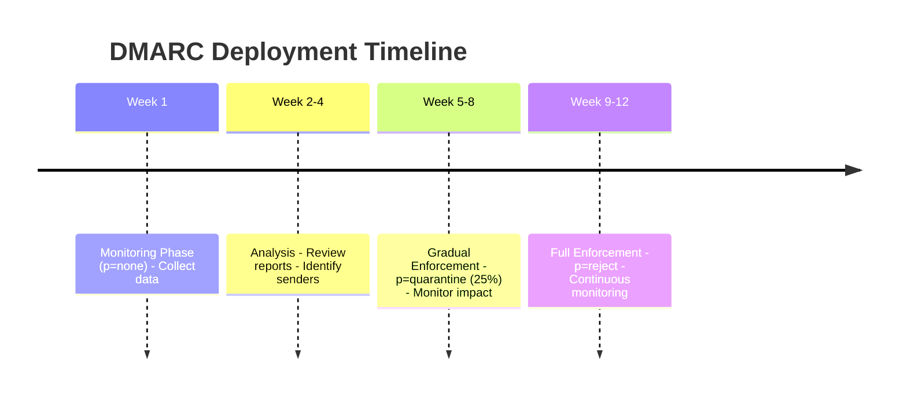
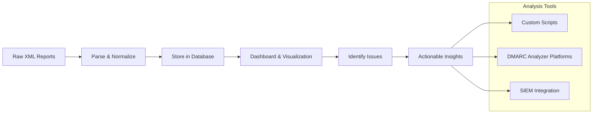
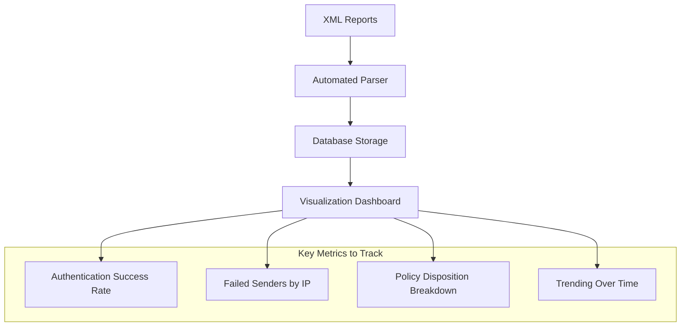
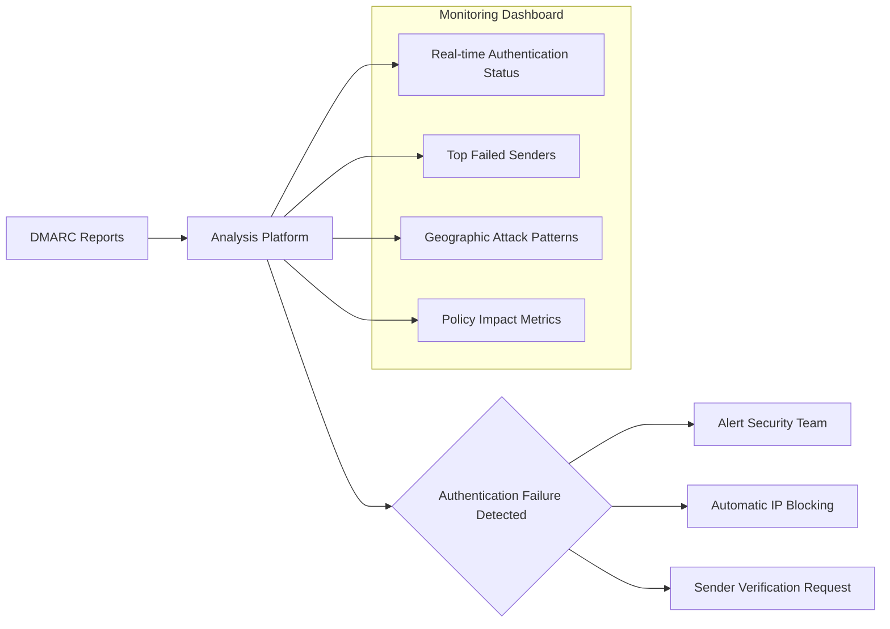
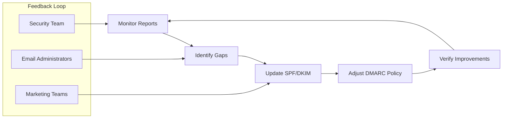

---
tags: [email-security]
---
# 📧 Full-Stack Lesson: Domain-based Message Authentication, Reporting, and Conformance (DMARC)

## TCM Exam Objectives
- Define DMARC's purpose: aligning SPF or DKIM with the visible `From:` header to prevent domain spoofing
- Interpret a DMARC DNS record: `v=DMARC1`, `p`, `sp`, `rua`, `ruf`, `adkim`, `aspf`, `pct`, `fo`
- Explain the three DMARC policies (`p=none`, `p=quarantine`, `p=reject`) and the recommended gradual enforcement timeline
- Distinguish SPF alignment (relaxed vs. strict) and DKIM alignment (relaxed vs. strict) and when each passes
- Analyze RUA aggregate XML reports to identify unauthorized senders and authentication failure patterns
- Describe RUF forensic reports and the difference from RUA: per-message vs. aggregate, `fo` tag options
- Explain why DMARC alone cannot stop lookalike domain attacks or DKIM replay — require supplementary controls
- Identify common DMARC pitfalls: forwarding breaks SPF alignment, third-party senders without DKIM, multiple From: headers




## 🔍 1. Foundations: The Email Authentication Trinity

### 1.1 SPF (Sender Policy Framework)
SPF is a DNS TXT record that lists authorized IP addresses allowed to send email for a domain 【turn0search1】【turn0search3】. It works by checking the **Return-Path** header (envelope sender) against the domain's SPF record.

**SPF Record Structure:**
```
v=spf1 include:_spf.google.com include:mailgun.org ~all
```

**Key Mechanisms:**
- `+` Pass (default)
- `-` Fail (hard fail)
- `~` Soft Fail (accept but mark)
- `?` Neutral (no policy)

**Limitations:**
- Only checks Return-Path header, not the visible "From" header
- Maximum 10 DNS lookups to prevent DoS attacks 【turn0search3】
- Recommendations are not always enforced by receivers

### 1.2 DKIM (DomainKeys Identified Mail)
DKIM adds a digital signature to outgoing emails using a private key, with the public key stored in DNS 【turn0search1】【turn0search3】. This allows receivers to verify message integrity and authenticity.

**DKIM Signing Process:**


**DKIM Record Structure (DNS TXT):**
```
k=rsa; p=MIGfMA0GCSqGSIb3DQEBAQUAA4GNADCBiQKBgQDLMMExLiGRqzJkNdNIjUnLX7JL0wjbwwENDoXgJIBisIsrofLPetZM401dioNU8k//Yw5/iyzhyrWsIyINyyHs77EoDFDDEEFFEKJKLJHLKifLN51IIvwIDAQAB
```

**DKIM-Signature Header Components:**
- `v=1` - Version
- `a=rsa-sha256` - Signing algorithm
- `d=example.com` - Signing domain
- `s=selector` - Key selector
- `h=From:Subject:Date` - Signed headers
- `bh=...` - Body hash
- `b=...` - Digital signature

### 1.3 DMARC: The Coordinator
DMARC builds upon SPF and DKIM by requiring **alignment** between the authenticated domains and the visible "From" header 【turn0search0】【turn0search3】. It also introduces policy enforcement and reporting mechanisms.

**DMARC Record Structure:**
```
_dmarc.example.com. IN TXT "v=DMARC1; p=none; rua=mailto:dmarc@example.com; ruf=mailto:forensic@example.com; pct=100; adkim=s; aspf=s"
```

📌 **Exam Tip:** The most testable DMARC concept is alignment. DMARC passes if *either* SPF is aligned (Return-Path domain matches From: domain) OR DKIM is aligned (d= domain matches From: domain). The message only needs ONE aligned authentication to pass DMARC. Under relaxed alignment, `mail.example.com` aligns with `example.com`; under strict, they must match exactly. Practice with: `From: user@example.com`, `Return-Path: bounce@mail.example.com` — SPF relaxed = pass, SPF strict = fail.



## ⚙️ 2. How DMARC Works: The Full-Stack Process

### 2.1 Authentication Flow


### 2.2 Alignment Requirements
DMARC requires that the domain authenticated by SPF or DKIM matches the domain in the visible "From" header 【turn0search3】.

**Alignment Modes:**
- **Strict (`s`):** Requires exact domain match
- **Relaxed (`r`):** Allows organizational domain match

**Example Alignment:**
```
From: sender@example.com
Return-Path: bounce@mail.example.com
```
- **SPF Alignment (relaxed):** ✅ (example.com is organizational domain)
- **SPF Alignment (strict):** ❌ (mail.example.com ≠ example.com)

## 🛠️ 3. Implementation Stack: Step-by-Step Guide

### 3.1 Phase 1: Preparation & Assessment
```bash
# Check current email infrastructure
dig TXT example.com | grep spf
dig TXT _dmarc.example.com

# Inventory all email senders
# Include: Marketing platforms, CRM, transactional email, etc.
```

### 3.2 Phase 2: SPF Configuration
**Step-by-step SPF Setup:**

1. **Identify all legitimate senders:**
   - Corporate email services (Google Workspace, Microsoft 365)
   - Marketing platforms (Mailchimp, SendGrid)
   - Transactional email services (Amazon SES, Postmark)
   - Internal applications

2. **Create SPF record:**
```
v=spf1 include:_spf.google.com include:sendgrid.net include:amazonses.com ~all
```

3. **Test SPF configuration:**
```bash
# Using dig command
dig TXT example.com | grep spf

# Using online tools
# https://mxtoolbox.com/spf.aspx
```

### 3.3 Phase 3: DKIM Configuration
**DKIM Setup Process:**

1. **Generate key pair:**
```bash
# Using openssl
openssl genrsa -out private.key 1024
openssl rsa -in private.key -pubout -out public.key
```

2. **Configure email server:**
```bash
# Postfix example
# /etc/postfix/main.cf
milter_default_action = accept
milter_protocol = 6
smtpd_milters = inet:localhost:8891
non_smtpd_milters = inet:localhost:8891
```

3. **Publish DKIM record:**
```
selector._domainkey.example.com. IN TXT "k=rsa; p=MIGfMA0GCSqGSIb3DQEBAQUAA4GNADCBiQKBgQ..."
```

### 3.4 Phase 4: DMARC Implementation
**DMARC Deployment Roadmap:**



**DMARC Record Examples by Phase:**

**Phase 1: Monitoring (Week 1-2)**
```
v=DMARC1; p=none; rua=mailto:dmarc-reports@example.com; ruf=mailto:forensic@example.com; pct=100; adkim=r; aspf=r
```

**Phase 2: Gradual Enforcement (Week 3-8)**
```
v=DMARC1; p=quarantine; pct=25; rua=mailto:dmarc-reports@example.com; ruf=mailto:forensic@example.com; adkim=r; aspf=r
```

**Phase 3: Full Enforcement (Week 9+)**
```
v=DMARC1; p=reject; pct=100; rua=mailto:dmarc-reports@example.com; ruf=mailto:forensic@example.com; adkim=s; aspf=s
```

## 📊 4. Reporting System: RUA & RUF

### 4.1 RUA (Aggregate Reports)
RUA reports provide **daily summaries** of email authentication results 【turn0search5】【turn0search7】. They include:

- Total email volume from your domain
- IP addresses and hostnames sending on your behalf
- SPF and DKIM authentication results
- DMARC alignment status
- Disposition actions taken

**Sample RUA Report Structure (XML):**
```xml
<feedback>
  <version>1.0</version>
  <report_metadata>
    <org_name>google.com</org_name>
    <email>noreply-dmarc-support@google.com</email>
    <date_range>
      <begin>1716336000</begin>
      <end>1716422400</end>
    </date_range>
  </report_metadata>
  <policy_published>
    <domain>example.com</domain>
    <adkim>r</adkim>
    <aspf>r</aspf>
    <p>none</p>
    <pct>100</pct>
  </policy_published>
  <record>
    <row>
      <source_ip>192.0.2.1</source_ip>
      <count>250</count>
      <policy_evaluated>
        <disposition>none</disposition>
        <dkim>pass</dkim>
        <spf>pass</spf>
      </policy_evaluated>
    </row>
    <identifiers>
      <header_from>example.com</header_from>
    </identifiers>
    <auth_results>
      <dkim>
        <domain>example.com</domain>
        <result>pass</result>
      </dkim>
      <spf>
        <domain>example.com</domain>
        <result>pass</result>
      </spf>
    </auth_results>
  </record>
</feedback>
```

### 4.2 RUF (Forensic Reports)
RUF reports are **per-message failure notifications** generated when individual emails fail DMARC authentication 【turn0search15】【turn0search17】. They include:

- Original email headers
- Authentication failure details
- Receiving server information
- Part of the original message

<details>
<summary>🔧 RUF Report Example (Simplified)</summary>

```
From: sender@spoofed-domain.com
To: victim@example.com
Subject: Urgent: Account Verification Required

Authentication-Results:
  dmarc=fail (p=reject dis=reject) header.from=example.com
  dkim=fail (no key for signature)
  spf=fail (domain not authorized)

Received: from unknown (192.0.2.1)
  by receiver.example.com with ESMTP
  for victim@example.com;

Original-Message-Id: <12345@spoofed-domain.com>
```

</details>

📌 **Exam Tip:** Know the RUA vs. RUF distinction cold. RUA = aggregate XML reports (daily summaries, no personal data, used for trend analysis). RUF = forensic reports (per-message failure details, includes original headers and subject line — may contain PII). The `fo` tag in the DMARC record controls when RUF is sent: `fo=0` (all failures), `fo=1` (any authentication failure), `fo=d` (DKIM failure), `fo=s` (SPF failure). The exam may ask which tag produces forensic reports for DKIM failures.

### 4.3 Report Analysis Stack


## 🎯 5. Policy Enforcement: From Monitoring to Rejection

### 5.1 Policy Options Comparison

| Policy | Action | Use Case | Risk Level |
|--------|--------|----------|------------|
| `p=none` | Monitor only | Initial deployment, learning phase | Low - No impact on deliverability |
| `p=quarantine` | Send to spam folder | Gradual enforcement, identifying issues | Medium - Some legitimate email affected |
| `p=reject` | Complete rejection | Full enforcement, maximum protection | High - Requires complete sender inventory |

### 5.2 Gradual Enforcement Strategy
```python
# Pseudo-code for gradual DMARC enforcement
def implement_dmarc(domain):
    # Phase 1: Monitor for 2 weeks
    set_dmarc_policy(domain, p="none", pct=100)
    wait(14 days)
    
    # Phase 2: Quarantine 25% for 4 weeks
    set_dmarc_policy(domain, p="quarantine", pct=25)
    wait(28 days)
    
    # Phase 3: Quarantine 50% for 4 weeks
    set_dmarc_policy(domain, p="quarantine", pct=50)
    wait(28 days)
    
    # Phase 4: Full quarantine for 4 weeks
    set_dmarc_policy(domain, p="quarantine", pct=100)
    wait(28 days)
    
    # Phase 5: Reject 25% for 4 weeks
    set_dmarc_policy(domain, p="reject", pct=25)
    wait(28 days)
    
    # Phase 6: Full reject
    set_dmarc_policy(domain, p="reject", pct=100)
```

### 5.3 Policy Decision Matrix
| Scenario | Recommended Policy | Justification |
|----------|-------------------|---------------|
| New implementation | `p=none` | Establish baseline without impact |
| Identified all senders | `p=quarantine` | Test enforcement with minimal risk |
| 95%+ authentication success | `p=reject` | Full enforcement, maximum protection |
| High-value target domain | `p=reject` with strict alignment | Maximum security for sensitive domains |

## 🚨 6. Troubleshooting & Common Issues

### 6.1 Alignment Failures
**Problem:** DMARC fails despite SPF/DKIM passing individually.

**Common Causes:**
1. **SPF Alignment Failure:** Return-Path domain doesn't match From domain
2. **DKIM Alignment Failure:** Signing domain doesn't match From domain
3. **Multiple From Headers:** Malformed email structure

**Diagnostic Commands:**
```bash
# Check alignment for specific email
dig TXT example.com | grep spf
dig TXT selector._domainkey.example.com

# Analyze email headers
python3 email_analyzer.py message.eml
```

### 6.2 Report Analysis Challenges
**Problem:** Overwhelming report volume, difficult to parse.

**Solution Stack:**


### 6.3 Legitimate Email Failing Authentication
**Problem:** Authorized senders failing DMARC checks.

**Root Causes & Solutions:**

| Root Cause | Solution | Prevention |
|------------|----------|------------|
| Forwarding services break SPF | Use SRS (Sender Rewriting Scheme) | Test forwarding chains |
| Third-party senders not configured | Add to SPF record, enable DKIM signing | Inventory all senders |
| Email client modifications | DKIM sign more headers | Use relaxed alignment initially |
| DNS propagation delays | Wait 48-72 hours after changes | Schedule changes during low traffic |

## 🏗️ 7. Advanced Configuration & Best Practices

### 7.1 Subdomain Protection
**DMARC Record for Subdomains:**
```
_dmarc.marketing.example.com. IN TXT "v=DMARC1; p=reject; rua=mailto:dmarc@example.com"
```

**Automatic Subdomain Policy:**
```
_dmarc.example.com. IN TXT "v=DMARC1; p=reject; sp=reject; rua=mailto:dmarc@example.com"
```

### 7.2 Reporting Optimization
**Dedicated Reporting Address:**
- Create: `dmarc-reports@example.com`
- Configure forwarding to analysis platform
- Set up automated parsing and alerting

**Multiple RUA Addresses:**
```
rua=mailto:dmarc@example.com,mailto:security@example.com,mailto:vendor@dmarcanalyzer.com
```

### 7.3 Monitoring & Alerting Stack


## 📈 8. Measuring Success & KPIs

### 8.1 Key Performance Indicators

| Metric | Target | Measurement Method |
|--------|--------|-------------------|
| DMARC Pass Rate | >95% | RUA report analysis |
| Authentication Coverage | 100% of senders | Sender inventory audit |
| Unauthorized Senders | <1% | RUF report analysis |
| False Positive Rate | <0.1% | User feedback monitoring |
| Time to Detection | <24 hours | Report frequency |

### 8.2 Continuous Improvement Cycle


## 🔮 9. Future Trends & Evolution

### 9.1 BIMI (Brand Indicators for Message Identification)
BIMI builds upon DMARC to display brand logos in email clients, requiring `p=quarantine` or `p=reject` DMARC policy.

### 9.2 MTA-STS (Mail Transfer Agent Strict Transport Security)
MTA-STS enforces TLS encryption for email transport, working alongside DMARC for comprehensive security.

### 9.3 AI-Powered DMARC Analysis
Machine learning models for:
- Anomaly detection in sending patterns
- Predictive authentication failure prevention
- Automated policy optimization

## 📚 10. Implementation Checklist

<details>
<summary>📝 DMARC Implementation Checklist</summary>

### Phase 1: Preparation
- [ ] Inventory all email senders (internal and external)
- [ ] Document email flows and forwarding chains
- [ ] Identify critical business applications sending email
- [ ] Backup current DNS configurations

### Phase 2: SPF Implementation
- [ ] Create comprehensive SPF record including all senders
- [ ] Test SPF record with online tools
- [ ] Verify SPF alignment with From headers
- [ ] Monitor for 48 hours before proceeding

### Phase 3: DKIM Implementation
- [ ] Generate DKIM key pairs for all sending domains
- [ ] Configure email servers to sign outgoing messages
- [ ] Publish DKIM records in DNS
- [ ] Verify DKIM signatures with test emails

### Phase 4: DMARC Monitoring
- [ ] Create DMARC record with `p=none`
- [ ] Set up RUA report collection and analysis
- [ ] Configure RUF reporting (optional)
- [ ] Monitor for 2 weeks, collect baseline data

### Phase 5: Policy Enforcement
- [ ] Analyze monitoring reports for authentication failures
- [ ] Identify and fix legitimate sender issues
- [ ] Gradually increase policy strictness
- [ ] Implement `p=quarantine` at 25%, 50%, 100%
- [ ] Monitor impact at each stage
- [ ] Implement `p=reject` when ready

### Phase 6: Maintenance
- [ ] Regular review of sending inventory
- [ ] Update SPF/DKIM as senders change
- [ ] Continuous report monitoring
- [ ] Quarterly policy review

</details>

## 💎 Conclusion

DMARC represents the gold standard in email authentication, providing the framework to protect domains from spoofing while maintaining email deliverability. The full-stack implementation requires coordination across DNS configuration, email infrastructure, and monitoring systems.

The key to success lies in **gradual enforcement**—starting with monitoring (`p=none`), analyzing reports, fixing authentication issues, then progressively moving to quarantine and reject policies. This approach minimizes disruption to legitimate email while maximizing protection against domain abuse.

Organizations that successfully implement DMARC not only protect their brand reputation but also contribute to a healthier email ecosystem by making phishing and spoofing attacks more difficult to execute.

> 💡 **Pro Tip**: Always maintain a dedicated DMARC reporting address and regularly analyze RUA reports. The data contained in these reports is invaluable for identifying unauthorized senders and troubleshooting authentication issues before they impact deliverability.

Remember: DMARC is not a "set it and forget it" solution. Continuous monitoring, regular policy reviews, and proactive management are essential for maintaining effective email authentication in an ever-evolving threat landscape.