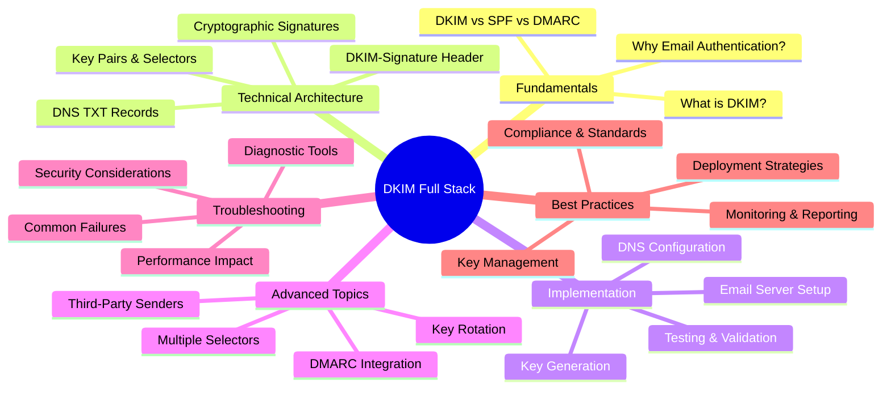
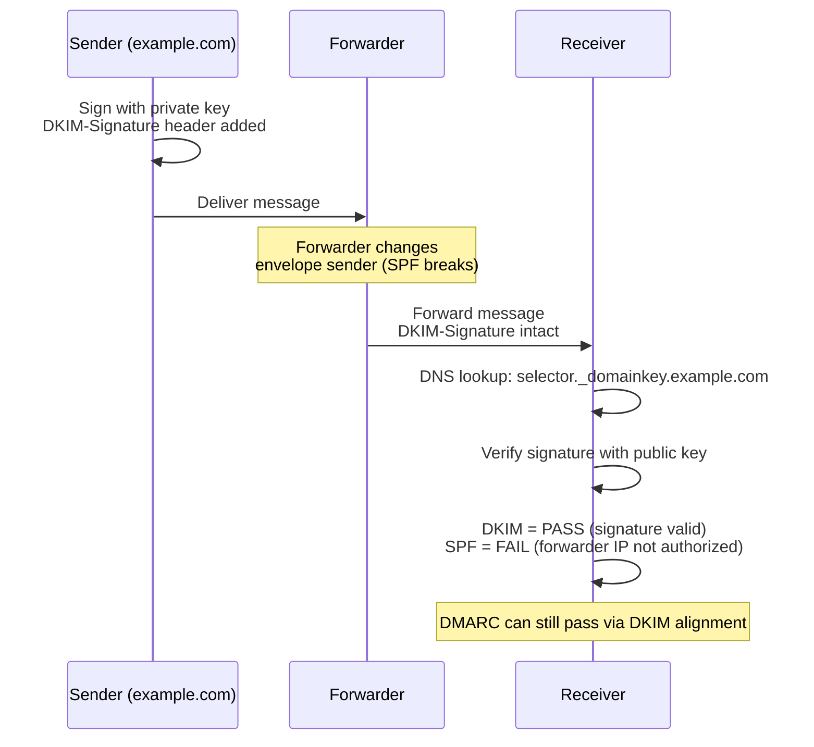
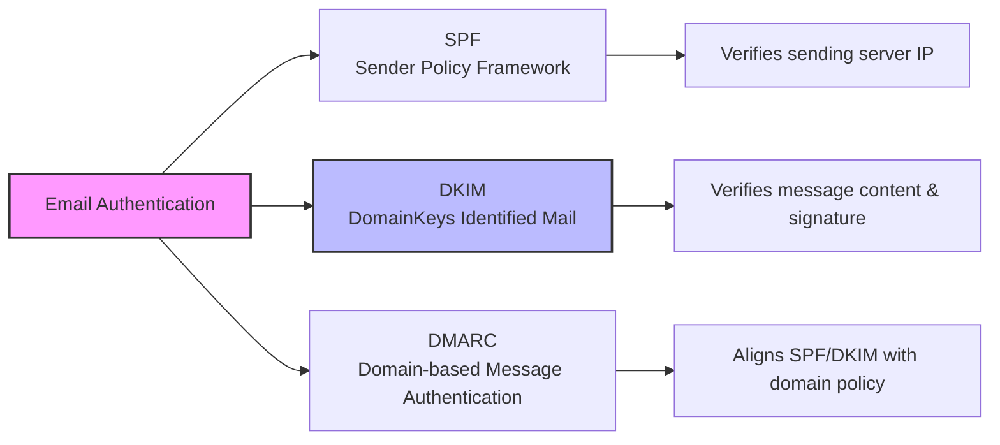
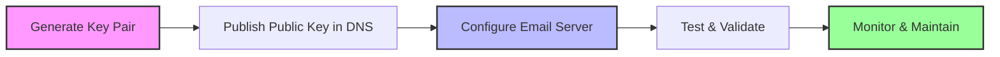
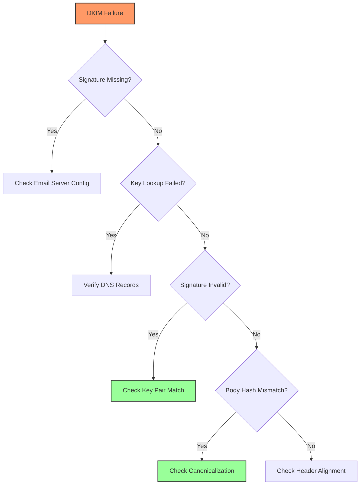
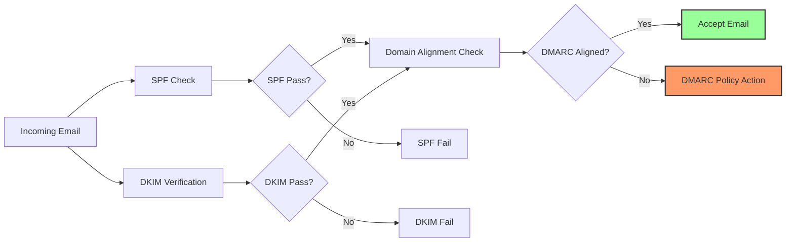

---
tags: [email-security]
---
# 📧 Full-Stack Lesson: DomainKeys Identified Mail (DKIM)

## TCM Exam Objectives
- Explain DKIM's role: cryptographic signature (asymmetric key pair) verifying message integrity and domain association
- Parse a DKIM-Signature header and identify all required fields: `v`, `a`, `d`, `s`, `c`, `h`, `bh`, `b`
- Understand selector-based DNS key discovery: `selector._domainkey.domain.com` TXT record format
- Compare canonicalization algorithms: `simple` vs. `relaxed` and their impact on signature validation
- Describe the DKIM key rotation process using multiple selectors for zero-downtime transitions
- Identify common DKIM failures: key mismatch, body hash mismatch, DNS propagation, header modification
- Explain why DKIM survives email forwarding whereas SPF breaks — a critical exam distinction
- Analyze DMARC aggregate reports to isolate DKIM-specific authentication failures by selector




📌 **Exam Tip:** The PSAA exam frequently asks why DKIM survives email forwarding while SPF breaks. The answer: DKIM signs the message body and selected headers — the signature travels with the content. SPF checks the connecting IP against the envelope domain, and forwarding changes the connecting IP. DKIM relies on DNS-issued public keys, not the sending path. This is why DMARC requires "SPF *or* DKIM" alignment — DKIM is the safety net for forwarded mail.



## 1. 📚 Fundamentals of Email Authentication

### 1.1 What is DKIM?
**DomainKeys Identified Mail (DKIM)** is an email authentication method that uses **public-key cryptography** to let the receiver of an email know that the message was sent by the owner of the domain and hasn't been tampered with in transit 【turn0search0】【turn0search1】. It adds a **digital signature** to outgoing emails, allowing recipients to verify the email's authenticity and integrity 【turn0search3】【turn0search4】.

> 💡 **Key Insight**: Unlike SPF which only verifies the sending server, DKIM verifies the **content integrity** of the message itself, making it more resilient to forwarding and mailing list modifications 【turn0search20】.

### 1.2 The Email Authentication Landscape



| Protocol | Primary Function | Verification Method | Vulnerability |
|----------|------------------|---------------------|---------------|
| **SPF** | Verifies sending server is authorized | IP address comparison | Breaks with email forwarding 【turn0search20】 |
| **DKIM** | Verifies message content integrity | Cryptographic signature | Key compromise if not rotated |
| **DMARC** | Aligns authentication with domain policy | SPF + DKIM alignment | Requires proper SPF/DKIM setup |

### 1.3 Why DKIM Matters
- **Prevents Email Spoofing**: Stops attackers from impersonating your domain 【turn0search1】
- **Ensures Message Integrity**: Detects tampering during transit 【turn0search6】
- **Improves Deliverability**: Authenticated emails are less likely to be marked as spam
- **Enables DMARC**: Works with SPF to enable DMARC policies 【turn0search18】
- **Builds Trust**: Recipients can verify emails genuinely come from claimed domains

## 2. 🔐 Technical Architecture Deep Dive

### 2.1 Cryptographic Foundation
DKIM uses **asymmetric cryptography** with two keys:
- **Private Key**: Used by the sending mail server to sign outgoing emails (kept secret)
- **Public Key**: Published in DNS records, used by recipients to verify signatures

<details>
<summary>🔧 Technical Implementation Details</summary>

#### Key Generation Process
```bash
# Example using OpenSSL to generate DKIM keys
openssl genrsa -out private.key 2048
openssl rsa -in private.key -pubout -out public.key

# Extract the public key for DNS record
grep -v "PUBLIC KEY" public.key | tr -d '\n'
```

#### Signature Algorithm
- **RSA-SHA256**: Most common (recommended 2048-bit keys) 【turn0search14】
- **Ed25519**: Emerging standard with better performance
- **Key Sizes**: 1024-bit (legacy), 2048-bit (standard), 4096-bit (high security)

#### Canonicalization Algorithms
- **Simple**: No modification of headers/body (strict)
- **Relaxed**: Allows minor whitespace changes (practical)
- **Body Length**: Limits signature to specific portions
</details>

### 2.2 DKIM-Signature Header Anatomy
The `DKIM-Signature:` header contains all information needed for verification:

```
DKIM-Signature: v=1; a=rsa-sha256; d=example.com; s=selector1;
    c=relaxed/relaxed; q=dns/txt; t=1617224522; x=1617310922;
    h=from:to:subject:date:message-id;
    bh=2gW0e+1Q5a0e+1Q5a0e+1Q5a0e+1Q5a0e+1Q5a0e=;
    b=...
```

| Field | Description | Example |
|-------|-------------|---------|
| `v` | Version | `1` |
| `a` | Signing algorithm | `rsa-sha256` |
| `d` | Domain | `example.com` |
| `s` | Selector | `selector1` |
| `c` | Canonicalization | `relaxed/relaxed` |
| `q` | Query method | `dns/txt` |
| `t` | Timestamp | `1617224522` |
| `x` | Expiration | `1617310922` |
| `h` | Headers signed | `from:to:subject:date` |
| `bh` | Body hash | `2gW0e+1Q5a0e...` |
| `b` | Digital signature | `...` |

📌 **Exam Tip:** Memorize the DKIM selector format: `selector._domainkey.example.com`. The `s=` tag in the DKIM-Signature header tells you which selector to query. If DKIM fails with "key not found," suspect a missing or incorrect DNS TXT record at `s._domainkey.d=`. On the exam, you may be asked to identify which DNS record needs to be created to fix a DKIM failure.

### 2.3 DNS TXT Record Structure
DKIM public keys are stored in DNS as **TXT records** with a specific naming convention:

```
selector._domainkey.example.com. IN TXT "v=DKIM1; k=rsa; p=MIGfMA0GCSqGSIb3DQEBAQUAA4GNADCBiQKBgQ..."
```

<details>
<summary>📖 Record Field Breakdown</summary>

- **Name Format**: `selector._domainkey.domain.com`
  - `selector`: Identifier for the key pair (e.g., `default`, `selector1`)
  - `_domainkey`: Fixed subdomain indicating DKIM
  - `domain.com`: Your domain name

- **Record Content**:
  - `v=DKIM1`: Version identifier
  - `k=rsa`: Key type (alternatively `ed25519`)
  - `p=...`: Public key content (base64 encoded)
  - `t=s`: Flags (optional, `s` means strict selector matching)

- **TTL**: 3600-86400 seconds (1-24 hours)
- **Multiple Records**: One per selector/key pair
</details>

## 3. 🚀 Implementation Step-by-Step

### 3.1 DKIM Setup Process Overview



### 3.2 Detailed Setup Guide

#### Step 1: Generate DKIM Key Pair
Choose your key generation method based on your email platform:

<details>
<summary>⚙️ Platform-Specific Instructions</summary>

**Google Workspace:**
1. Navigate to Admin Console → Apps → Google Workspace → Gmail
2. Scroll to "Authenticate email" section
3. Click "Generate new record"
4. Select your domain and key length (2048-bit recommended)
5. Copy the generated TXT record value

**Microsoft 365:**
1. Connect to Exchange Online PowerShell
2. Run: `New-DkimSigningConfig -DomainName example.com -Enabled $true`
3. Retrieve the selector and public key:
   ```powershell
   Get-DkimSigningConfig -Identity example.com | Format-List Selector, PublicKey
   ```

**Postfix/Linux:**
```bash
# Install OpenDKIM
sudo apt-get install opendkim opendkim-tools

# Generate keys
opendkim-genkey -t -s mail -d example.com

# This creates:
# - mail.private (private key)
# - mail.txt (DNS record content)
```
</details>

#### Step 2: Publish Public Key in DNS
Add the TXT record to your domain's DNS configuration:

| DNS Provider | Record Type | Name/Host | Value/Content |
|--------------|-------------|-----------|---------------|
| **Cloudflare** | TXT | `selector._domainkey` | `v=DKIM1; k=rsa; p=MIGfMA0GCS...` |
| **GoDaddy** | TXT | `selector._domainkey` | `v=DKIM1; k=rsa; p=MIGfMA0GCS...` |
| **AWS Route53** | TXT | `selector._domainkey.example.com` | `v=DKIM1; k=rsa; p=MIGfMA0GCS...` |

> ⚠️ **Important**: DNS changes may take **15 minutes to 48 hours** to propagate globally. Use tools like [DNS Checker](https://dnschecker.org/) to verify propagation.

#### Step 3: Configure Email Server
Configure your mail server to sign outgoing emails:

<details>
<summary>🔧 Server Configuration Examples</summary>

**Postfix with OpenDKIM:**
```bash
# /etc/postfix/main.cf
milter_protocol = 6
milter_default_action = accept
smtpd_milters = inet:localhost:8891
non_smtpd_milters = inet:localhost:8891

# /etc/opendkim.conf
Domain example.com
Selector mail
Socket inet:8891@localhost
KeyFile /etc/opendkim/mail.private
```

**Exchange Server:**
```powershell
# Enable DKIM signing for domain
Set-DkimSigningConfig -Identity example.com -Enabled $true

# Verify configuration
Get-DkimSigningConfig -Identity example.com | Format-List
```

**SendGrid/Email Service Providers:**
1. Navigate to Settings → Sender Authentication
2. Select "DKIM" and choose your domain
3. Follow platform-specific instructions
4. Ensure DNS records are properly configured
</details>

#### Step 4: Test & Validate
Verify your DKIM implementation:

| Tool | Purpose | URL |
|------|---------|-----|
| **MXToolbox** | Comprehensive DKIM check | [mxtoolbox.com/dkim.aspx](https://mxtoolbox.com/dkim.aspx) |
| **MailTester** | Send test email for authentication check | [mail-tester.com](https://www.mail-tester.com/) |
| **Google Admin Toolbox** | Check message headers | [toolbox.googleapps.com](https://toolbox.googleapps.com/) |
| **DMARC Analyzer** | Full authentication report | [dmarcanalyzer.com](https://dmarcanalyzer.com/) |

<details>
<summary>🔍 Sample Test Email Header Analysis</summary>

```
Received: from mail.example.com (mail.example.com [203.0.113.1])
    by mx.google.com with ESMTPS id abc123.45.2024.01.01.00.00.00
    for <recipient@gmail.com>
    (version=TLS1_3 cipher=TLS_AES_256_GCM_SHA384 bits=256/256);
    Mon, 01 Jan 2024 00:00:00 -0800 (PST)
DKIM-Signature: v=1; a=rsa-sha256; c=relaxed/relaxed;
    d=example.com; s=mail; t=1617224522;
    bh=2gW0e+1Q5a0e...;
    h=From:To:Subject:Date:Message-ID;
    b=...
Authentication-Results: mx.google.com;
    dkim=pass header.i=@example.com header.s=mail header.b=...;
    spf=pass (google.com: domain of user@example.com designates 203.0.113.1 as permitted sender) smtp.mailfrom=user@example.com;
    dmarc=pass (p=REJECT sp=REJECT dis=NONE) header.from=example.com
```

**Key Verification Points:**
- `dkim=pass`: Signature verified successfully
- `header.i=@example.com`: Signing domain matches From header
- `header.s=mail`: Selector used for signing
- `dmarc=pass`: DKIM aligned with DMARC policy
</details>

## 4. 🔄 Advanced Topics & Best Practices

### 4.1 DKIM Key Rotation Strategy
Regular key rotation is critical for security. Industry best practices recommend:

| Rotation Frequency | Key Size | Use Case | Source |
|-------------------|----------|----------|--------|
| **Every 3-6 months** | 2048-bit | High-volume senders | 【turn0search13】【turn0search16】 |
| **Every 6-12 months** | 2048-bit | Standard organizations | 【turn0search14】【turn0search15】 |
| **Quarterly** | 2048-bit | Financial/Healthcare | M3AAWG guidelines |

<details>
<summary>📅 Key Rotation Process</summary>

1. **Generate New Key Pair**:
   ```bash
   # Generate new key with different selector
   opendkim-genkey -t -s mail2024q1 -d example.com
   ```

2. **Publish New DNS Record**:
   - Add new TXT record for `mail2024q1._domainkey.example.com`
   - Keep old record (`mail._domainkey`) active during transition

3. **Update Email Server Configuration**:
   - Configure server to sign with both selectors during transition
   - Monitor for verification failures

4. **Gradual Transition** (7-14 days):
   - Start signing with new selector
   - Monitor DMARC reports for verification issues
   - Keep old selector active for verification of in-transit messages

5. **Decommission Old Key**:
   - Remove old DNS record after 2 weeks
   - Archive private key securely for forensic purposes

**Rotation Best Practices**:
- Use multiple selectors simultaneously (e.g., `mail2024q1`, `mail2024q2`) 【turn0search17】
- Maintain a rotation log with key metadata
- Test new keys before full deployment
- Coordinate with third-party senders during rotation
</details>

### 4.2 Multiple Selectors Strategy
Implement multiple selectors for different purposes:

| Selector | Purpose | Key Rotation | Example |
|----------|---------|--------------|---------|
| `mail` | Primary mail server | Quarterly | `mail._domainkey.example.com` |
| `marketing` | Marketing emails | Biannually | `marketing._domainkey.example.com` |
| `transactional` | Transactional emails | Annually | `transactional._domainkey.example.com` |
| `thirdparty` | Third-party services | Per provider | `thirdparty._domainkey.example.com` |

### 4.3 Third-Party Sender Management
When allowing third parties to send on your behalf:

1. **Generate Dedicated Key Pair**: Create a unique key for each third party
2. **Use Subdomain Consideration**: Consider using subdomains for third-party senders
3. **Implement DMARC Policy**: Ensure DMARC policy accommodates third-party alignment
4. **Monitor Authentication**: Regularly check DMARC reports for third-party authentication failures

<details>
<summary>📊 Third-Party Configuration Matrix</summary>

| Third Party | Selector | DNS Record | Key Access | Monitoring |
|-------------|----------|------------|------------|------------|
| **Mailchimp** | `mc` | `mc._domainkey.example.com` | Mailchimp generated | Weekly DMARC reports |
| **SendGrid** | `sg` | `sg._domainkey.example.com` | SendGrid generated | Daily authentication checks |
| **Customer.io** | `cio` | `cio._domainkey.example.com` | Shared securely | Monthly compliance review |
| **Internal Tools** | `tools` | `tools._domainkey.example.com` | IT maintained | Quarterly security audit |
</details>

## 5. 🛠️ Troubleshooting Common Issues

### 5.1 DKIM Verification Failures



### 5.2 Common Issues & Solutions

| Issue | Symptoms | Solution | Prevention |
|-------|----------|----------|------------|
| **DNS Propagation Delay** | New key not verifying | Wait 24-48 hours for global propagation | Use low TTL during setup |
| **Key Mismatch** | Signature invalid error | Ensure private key matches DNS public key | Verify key fingerprints |
| **Header Modification** | Body hash mismatch | Use relaxed canonicalization | Avoid mail list modifications |
| **Forwarding Issues** | DKIM fails after forward | Use ARC (Authenticated Received Chain) | Implement ARC for forwarders |
| **Selector Confusion** | Multiple selectors failing | Document selector usage clearly | Maintain selector inventory |

<details>
<summary>🔧 Diagnostic Command Examples</summary>

```bash
# Check DKIM record in DNS
dig TXT selector._domainkey.example.com +short

# Verify email authentication (view headers)
grep -i "authentication-results" /var/log/mail.log

# Test DKIM signature validity
opendkim-testkey -d example.com -s selector -k /path/to/private.key

# Debug OpenDKIM issues
opendkim -l -v -d example.com -k /etc/opendkim/mail.private -s mail

# Check email headers for DKIM signature
formail -x DKIM-Signature: < /var/mail/user
```

**Common Error Messages:**
- `dkim=neutral`: No DKIM signature present
- `dkim=fail`: Signature verification failed
- `dkim=permfail`: Permanent failure (invalid key, format)
- `dkim=tempfail`: Temporary failure (DNS timeout, network issue)
</details>

## 6. 📊 Monitoring & Maintenance

### 6.1 Key Metrics to Monitor

| Metric | Target | Alert Threshold | Tools |
|--------|--------|-----------------|-------|
| **DKIM Pass Rate** | >98% | <95% | DMARC reports, ESP analytics |
| **Verification Failures** | <2% | >5% | Mail logs, authentication reports |
| **DNS Lookup Failures** | 0% | >1% | DNS monitoring tools |
| **Key Age** | <180 days | >180 days | Key management log |
| **Signature Size** | 2048-bit | <1024-bit | Key audit |

### 6.2 DMARC Report Analysis
DMARC reports provide valuable insights into DKIM performance:

<details>
<summary>📈 Sample DMARC Report Analysis</summary>

```xml
<record>
  <row>
    <source_ip>203.0.113.1</source_ip>
    <count>145</count>
    <policy_evaluated>
      <disposition>none</disposition>
      <dkim>fail</dkim>
      <spf>pass</spf>
    </policy_evaluated>
  </row>
  <identifiers>
    <header_from>example.com</header_from>
  </identifiers>
  <auth_results>
    <dkim>
      <domain>example.com</domain>
      <selector>mail</selector>
      <result>fail</result>
    </dkim>
    <spf>
      <domain>example.com</domain>
      <result>pass</result>
    </spf>
  </auth_results>
</record>
```

**Analysis Steps:**
1. **Identify Failure Patterns**: Look for IPs with consistent DKIM failures
2. **Check Selector Alignment**: Ensure `d=` domain matches From header
3. **Verify Key Status**: Check if selector DNS records are accessible
4. **Review Canonicalization**: Ensure compatible canonicalization algorithms
5. **Monitor Third-Party Senders**: Verify third-party authentication rates
</details>

## 7. 🔒 Security Considerations

### 7.1 Key Protection Strategies
- **Private Key Security**: Store private keys with restricted permissions (600)
- **Key Isolation**: Use separate keys for different environments (prod/staging)
- **Access Control**: Limit access to private keys to essential personnel only
- **Key Escrow**: Maintain secure backup of keys for forensic purposes
- **Hardware Security Modules**: Consider HSM for high-security environments

### 7.2 Attack Vectors & Mitigations

| Attack | Description | Mitigation |
|--------|-------------|------------|
| **Key Compromise** | Private key theft | Regular rotation, HSM storage |
| **Replay Attacks** | Reusing valid signatures | Include timestamp in signature |
| **DNS Spoofing** | Fake DNS responses | DNSSEC, short TTLs |
| **Algorithm Downgrade** | Forcing weak algorithms | Disable deprecated algorithms |
| **Selector Exhaustion** | Denial of service on selectors | Rate limiting, multiple selectors |

## 8. 🌐 Integration with DMARC & SPF

### 8.1 Authentication Alignment
DKIM works with SPF and DMARC to provide comprehensive email authentication:



### 8.2 DMARC Policy Configuration
Configure DMARC to leverage DKIM effectively:

```
_dmarc.example.com. IN TXT "v=DMARC1; p=reject; sp=reject; 
    adkim=s; aspf=s; 
    rua=mailto:dmarc-reports@example.com; 
    ruf=mailto:forensics@example.com; 
    fo=1; ri=86400"
```

| DMARC Parameter | Description | Recommended Value |
|-----------------|-------------|-------------------|
| `p` | Policy for organizational domain | `reject` or `quarantine` |
| `sp` | Policy for subdomains | `reject` or `quarantine` |
| `adkim` | DKIM alignment mode | `s` (strict) or `r` (relaxed) |
| `aspf` | SPF alignment mode | `s` (strict) or `r` (relaxed) |
| `rua` | Aggregate reports | `mailto:dmarc@example.com` |
| `fo` | Forensic reports | `1` (enabled) |

## 9. 📋 Compliance & Standards

### 9.1 Industry Standards
- **RFC 6376**: DKIM Signatures (current standard) 【turn0search7】
- **M3AAWG Guidelines**: Key rotation best practices 【turn0search16】
- **DMARC Specification**: RFC 7489
- **NIST Guidelines**: Email authentication recommendations

### 9.2 Compliance Requirements
| Regulation | DKIM Requirement | Documentation |
|------------|------------------|---------------|
| **GDPR** | Authentication for data breach prevention | Email authentication policies |
| **HIPAA** | Email integrity for PHI | Security risk assessment |
| **PCI DSS** | Email security for cardholder data | Authentication standards |
| **SOX** | Email retention & authentication | IT general controls |

## 10. 🚀 Future Directions & Emerging Trends

### 10.1 Technological Advancements
- **Ed25519 Signatures**: Faster, more secure alternative to RSA
- **DNSSEC Integration**: Enhanced DNS security for key distribution
- **ARC (Authenticated Received Chain)**: Solves forwarding issues
- **BIMI (Brand Indicators for Message Identification)**: Visual indicators based on authentication

### 10.2 Machine Learning Integration
- **Anomaly Detection**: AI-powered DKIM failure analysis
- **Predictive Key Rotation**: ML-based rotation scheduling
- **Automated Remediation**: Self-healing authentication systems

## 📚 Additional Resources & Tools

### Learning Resources
- [RFC 6376 - DKIM Signatures](https://datatracker.ietf.org/doc/html/rfc6376) 【turn0search7】
- [M3AAWG DKIM Key Rotation Best Practices](https://www.m3aawg.org/DKIMKeyRotation) 【turn0search16】
- [Cloudflare DKIM Learning](https://www.cloudflare.com/learning/dns/dns-records/dns-dkim-record) 【turn0search1】

### Diagnostic Tools
- [MXToolbox DKIM Check](https://mxtoolbox.com/dkim.aspx)
- [Mail-Tester Authentication Check](https://www.mail-tester.com/)
- [DMARC Analyzer](https://dmarcanalyzer.com/)
- [Google Admin Toolbox](https://toolbox.googleapps.com/)

### Implementation Guides
- [Google Workspace DKIM Setup](https://knowledge.workspace.google.com/admin/security/set-up-dkim) 【turn0search11】
- [Microsoft 365 DKIM Configuration](https://learn.microsoft.com/en-us/defender-office-365/email-authentication-dkim-configure) 【turn0search9】
- [Valimail DKIM Setup Guide](https://www.valimail.com/blog/dkim-setup-guide) 【turn0search10】

---

> 💡 **Final Insight**: DKIM is not a "set it and forget it" technology. Regular monitoring, key rotation, and adaptation to new threats are essential for maintaining email authentication effectiveness. By implementing the full-stack approach outlined in this lesson, you'll establish robust email authentication that protects your domain reputation and ensures your legitimate emails reach their intended recipients.