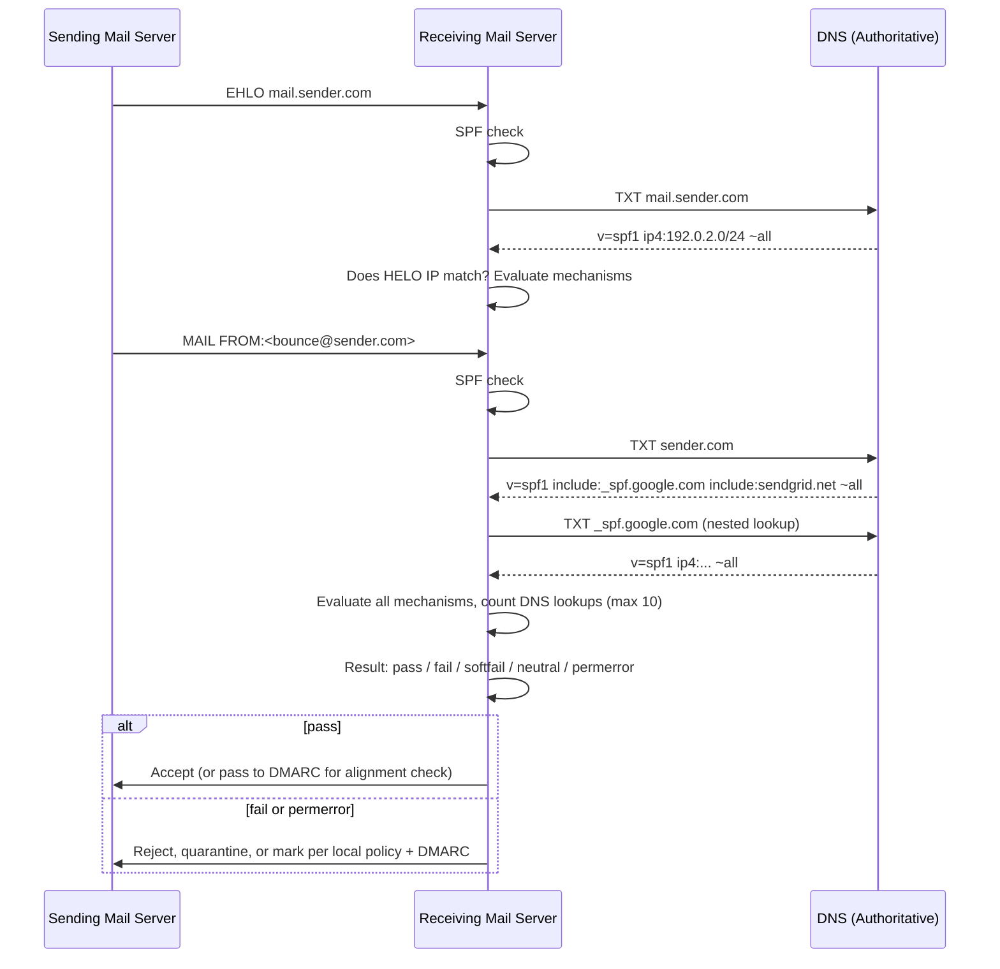
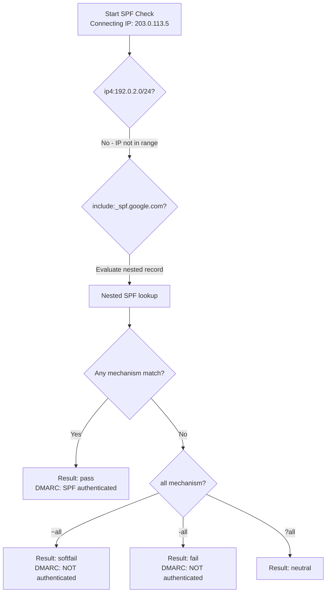
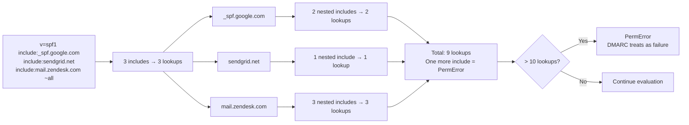
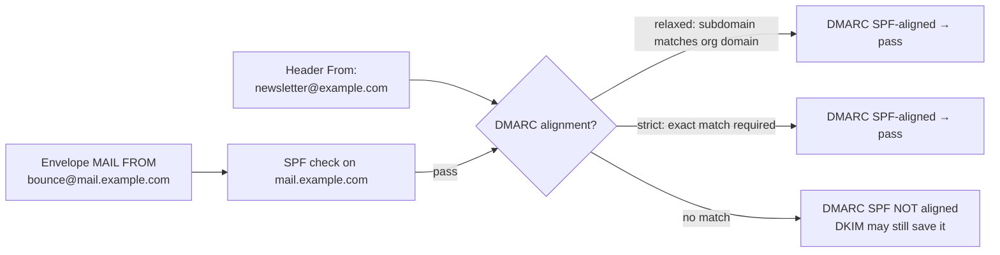
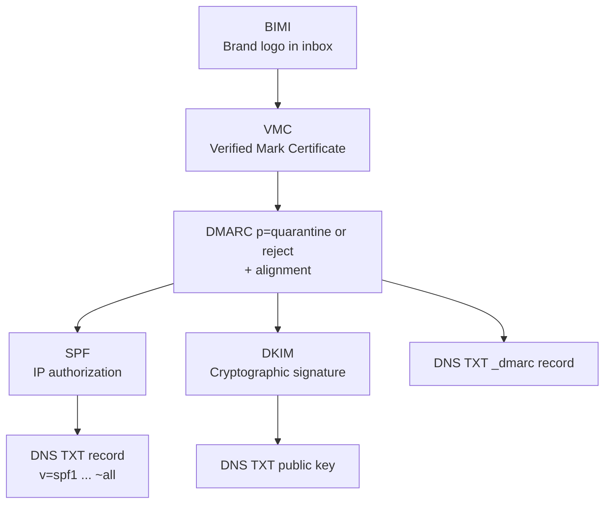

# Sender Policy Framework (SPF)

## TCM Exam Objectives
- Understand that SPF is a path-based email authentication protocol (RFC 7208) using DNS TXT records to authorize sending IPs
- Identify the seven SPF results (none, neutral, pass, softfail, fail, temperror, permerror) and how DMARC treats each
- Explain SPF mechanisms (`ip4`, `ip6`, `a`, `mx`, `include`, `exists`, `all`) and qualifiers (`+`, `-`, `~`, `?`)
- Calculate and troubleshoot the 10 DNS lookup limit — a common exam scenario for permerror diagnosis
- Distinguish SPF alignment (relaxed vs. strict) under DMARC and why SPF alone cannot prevent From: header spoofing
- Analyze SPF records for syntax errors and recommend `~all` vs. `-all` based on use case
- Recognize common pitfalls: multiple SPF records, confuse `include` vs. `redirect`, non-sending subdomains lacking `-all`
- Describe how BIMI, DMARC, DKIM, and SPF form the modern email authentication stack
SPF (Sender Policy Framework) is a path-based email authentication protocol defined in RFC 7208 that lets a domain owner publish a DNS TXT record listing the IP addresses and hosts authorized to send mail on behalf of that domain, so receiving mail servers can verify—during the SMTP transaction—that the connecting server's IP is legitimately associated with the envelope-sender domain.【turn1search0】【turn0search16】【turn0search17】 SPF validates the *sending path* (the IP that opened the SMTP connection) against the *Return-Path domain* (the `MAIL FROM` address), not the visible `From:` header the recipient sees—and that distinction is the root of both its power and its limitations.【turn0search16】

## The SPF Authentication Flow

When a message arrives, the receiving mail server performs an SPF check by querying DNS for the sending domain's TXT record and evaluating the connecting IP against the mechanisms in order. The check runs against two identities: the `HELO`/`EHLO` hostname and the `MAIL FROM` (envelope sender) address.【turn0search15】【turn0search19】



The HELO check is *recommended* but optional; the MAIL FROM check is the primary authorization. Because SPF evaluates during the SMTP transaction (before message body transmission), it can reject unauthorized mail early, saving bandwidth and processing.【turn0search15】【turn0search16】

## SPF Record Structure: The DNS TXT Record

An SPF record is a single DNS TXT record published at the domain root (or subdomain) that **must begin with `v=spf1`** and is followed by a space-separated list of terms (mechanisms and modifiers).【turn1search1】【turn1search2】 The historical dedicated SPF DNS record type (type 99) is deprecated—only TXT records are evaluated in practice.【turn1search1】

A representative record:

```
example.com.  IN  TXT  "v=spf1 a mx ip4:69.64.153.131 include:_spf.google.com ~all"
```

Mechanisms are evaluated **left to right**; the first mechanism that matches the connecting IP determines the result. The `all` mechanism is a catch-all placed last to define the default outcome for unmatched IPs.【turn1search5】【turn1search6】

## Mechanisms

📌 **Exam Tip:** On the PSAA exam, be ready to trace SPF evaluation logic. Given a connecting IP and an SPF record like `v=spf1 ip4:192.0.2.0/24 include:_spf.google.com ~all`, you must determine which mechanism matches first and what result (pass/softfail/fail) is returned. Remember: mechanisms are evaluated left-to-right and the first match wins!



Mechanisms describe the set of authorized hosts. Each can be prefixed with a qualifier; if no qualifier is given, `+` (pass) is the default.【turn1search5】

| Mechanism | What it matches | Counts toward 10-lookup limit? | Example |
|---|---|---|---|
| `ip4` / `ip6` | A specific IPv4/IPv6 address or CIDR range | No (literal, no DNS query) | `ip4:192.0.2.0/24` |
| `a` | A record(s) of the current domain (or specified domain) | Yes (1 lookup) | `a` or `a:example.com` |
| `mx` | MX record IPs of the current (or specified) domain | Yes (1+ lookups) | `mx` or `mx:example.com` |
| `include` | Recursively evaluates another domain's SPF record; on match, returns that record's result | Yes (1 lookup, plus nested) | `include:_spf.google.com` |
| `ptr` | Reverse DNS (deprecated, unreliable, not recommended) | Yes | `ptr:example.com` |
| `exists` | Performs a DNS A query; if any record exists, it's a match (used for complex logic) | Yes | `exists:%{ir}.spf.example.com` |
| `all` | Always matches; used as the terminal catch-all | No | `~all` |

Sources: 【turn1search5】【turn1search6】【turn1search1】

The `include` mechanism is the workhorse for third-party senders (Google Workspace, Microsoft 365, SendGrid, Mailchimp), but it's also the primary cause of the lookup-limit problem because each `include` can itself contain further `include`s.【turn0search10】

## Qualifiers

Qualifiers prefix a mechanism and define what happens when that mechanism matches.【turn1search5】

| Qualifier | Symbol | Result on match | Meaning |
|---|---|---|---|
| Pass | `+` (default) | **pass** | Explicitly authorized |
| Fail | `-` | **fail** (hard fail) | Explicitly NOT authorized |
| SoftFail | `~` | **softfail** | Probably not authorized (transitional) |
| Neutral | `?` | **neutral** | No assertion (treated like none by most receivers) |

The choice between `~all` and `-all` is one of the most debated decisions in SPF configuration. RFC 7208 defines `fail` (`-all`) as an explicit statement that the host is not authorized, while `softfail` (`~all`) is a weaker statement that the host is *probably* not authorized.【turn0search7】 In the modern DMARC era, **`~all` is the recommended default** because: (1) it avoids delivery failures for legitimate senders missing from the record, and (2) when combined with DMARC enforcement, it produces the same security outcome as `-all` since DMARC treats both as an SPF failure for alignment purposes.【turn0search6】【turn0search9】 The exception: domains that are **not supposed to send any email** (parked domains, non-sending subdomains) should use `-all` to hard-block any unauthorized use.【turn0search6】

📌 **Exam Tip:** The `~all` vs. `-all` distinction is frequently tested. Memorize: `~all` (softfail) means "probably not authorized" — DMARC treats it as NOT authenticated. `-all` (fail) means "explicitly NOT authorized." In the DMARC era, `~all` is recommended for sending domains because DMARC produces the same security outcome. Use `-all` only for non-sending domains (parked domains, subdomains that never send mail).

## Modifiers

Modifiers are name=value pairs that change evaluation behavior rather than matching IPs. Each modifier can appear only once in a record.【turn1search5】【turn1search6】

**`redirect=<domain>`** — replaces the current record entirely with the referenced domain's SPF record. It's used to consolidate policy across many domains that share the same mail infrastructure (e.g., pointing all brand domains to a master SPF record). The RFC authors later acknowledged the naming was unfortunate: `redirect` should arguably have been called `include`, and `include` should have been called something like `on-match`.【turn1search4】 Key caveat: `redirect` and `all` in the same record is contradictory—if `all` appears, `redirect` is ignored.【turn1search4】

**`exp=<domain>`** — specifies a DNS TXT record whose content is returned as a human-readable explanation when SPF fails. Rarely used in practice but useful for debugging.【turn1search6】

## The Seven SPF Results

RFC 7208 defines seven possible outcomes of the `check_host()` evaluation:【turn1search2】【turn0search5】

| Result | Meaning | Typical receiver action | DMARC treatment |
|---|---|---|---|
| **None** | No SPF record published, or domain not checked | Accept; no SPF signal | SPF did not authenticate |
| **Neutral** | Domain explicitly asserts no position (`?all`) | Accept | SPF did not authenticate |
| **Pass** | IP is authorized | Accept | SPF authenticated (subject to alignment) |
| **SoftFail** | IP probably not authorized (`~all`) | Usually accept, may mark/spam | SPF did not authenticate |
| **Fail** | IP explicitly not authorized (`-all`) | May reject or quarantine | SPF did not authenticate |
| **TempError** | Transient DNS failure (e.g., timeout) | Usually accept, retry later | SPF did not authenticate |
| **PermError** | Permanent error (syntax error, **too many lookups**, malformed record) | Often treated as failure | SPF did not authenticate |

The `PermError` result is the silent killer—it occurs when a record is syntactically valid but exceeds the 10-lookup limit, and DMARC treats it as an authentication failure, which can quarantine or reject legitimate mail under a `p=quarantine` or `p=reject` policy.【turn0search13】【turn0search14】

## The 10 DNS Lookup Limit

RFC 7208 caps SPF evaluation at **10 DNS-querying mechanisms** (includes, a, mx, ptr, exists) per check.【turn0search10】【turn0search13】 This limit was defined in 2006 when a typical organization used one or two email-sending services; the modern SaaS landscape means a single mid-market company may include Google Workspace, Microsoft 365, SendGrid, Mailchimp, Zendesk, Salesforce, and more—each of which nests further includes.【turn0search11】



The danger is invisibility: records are syntactically perfect, mail flows normally for a while, then a third-party sender adds an IP to their nested record and silently pushes the total over 10—breaking authentication for every message without any obvious trigger. The symptom surfaces in DMARC aggregate reports as `permerror`.【turn0search14】

### SPF Flattening

**SPF flattening** replaces nested `include` mechanisms with a flat list of direct `ip4`/`ip6` entries, eliminating the DNS lookups those includes would trigger.【turn1search15】【turn1search16】 It's a common workaround but has well-documented limitations: third-party senders constantly add and rotate IPs, so a flattened snapshot goes stale silently, and the moment Google or SendGrid rotates to an unlisted IP, legitimate mail fails SPF.【turn1search15】【turn1search18】 Managed flattening services (EasyDMARC, Valimail, AutoSPF) dynamically re-resolve includes and republish flattened IP lists, but even these can lag behind provider changes.【turn1search16】 The more durable fix is reducing the number of sending services or moving authentication reliance onto DKIM (which doesn't have a lookup limit) for the senders that support it.

## SPF ↔ DMARC Alignment

SPF alone cannot prevent spoofing of the visible `From:` header, because SPF authenticates the *envelope* sender (Return-Path), which can differ from the header `From:` that the recipient sees. **DMARC alignment** closes this gap by requiring that the domain authenticated by SPF (or DKIM) matches the domain in the `From:` header.【turn0search21】【turn0search22】



Under **relaxed alignment** (the DMARC default), `mail.example.com` aligns with `example.com` (organizational domain match). Under **strict alignment**, the domains must match exactly.【turn0search22】【turn0search23】 This is why a message can pass SPF yet fail DMARC: the Return-Path domain (e.g., `sendgrid.net`) authenticated fine, but it doesn't align with the visible `From: marketing@yourbrand.com`—an attacker could exploit this by passing SPF with their own domain while spoofing yours in the header.【turn0search22】 This alignment requirement is what makes SPF meaningful for brand protection rather than just IP authorization.

## SPF in the Modern Email Authentication Stack

SPF is the foundational layer of a stack that, as of 2024–2026, is no longer optional for bulk senders. Gmail and Yahoo's new sender requirements mandate SPF, DKIM, and DMARC for any sender exceeding 5,000 messages/day.【turn1search10】【turn1search14】



**BIMI (Brand Indicators for Message Identification)** displays a brand's logo in the recipient's inbox, but it requires DMARC enforcement (`p=quarantine` or `p=reject`) and a VMC (Verified Mark Certificate) proving trademark ownership. Because DMARC requires either SPF or DKIM alignment to pass, **a broken SPF record breaks the entire chain**—no DMARC pass, no BIMI logo, even if everything else is configured correctly.【turn1search13】【turn1search12】 This is why SPF record health has direct brand-equity consequences in 2026, not just deliverability consequences.

## Validation Tools and Workflow

After any SPF change, validation is mandatory—silent breakage is the norm, not the exception.【turn0search28】

| Tool | What it checks | Strength |
|---|---|---|
| **MXToolbox SPF Lookup** (mxtoolbox.com/spf.aspx) | Syntax, lookup count, mechanism validity | Comprehensive, also checks DKIM/DMARC |
| **Kitterman SPF Validator** (kitterman.com/spf/validate.html) | RFC 7208-compliant evaluation, dynamic lookup-count testing | Uses actual pyspf library; catches limit errors others miss |
| **dmarcian SPF Surveyor** | Visual lookup tree, identifies problematic branches | Best for diagnosing nested-include explosions |
| **dig** (command line) | Raw TXT record retrieval | `dig TXT example.com`—foundation for manual inspection |
| **EasyDMARC / PowerDMARC** | Lookup count, syntax, flattening recommendations | Managed platforms with ongoing monitoring |

Sources: 【turn0search25】【turn0search26】【turn0search27】【turn0search28】

A manual `dig TXT yourdomain.com` returns the raw record; from there, trace each `include` with `dig TXT included-domain.com` to manually count lookups and spot nesting depth. For a real-world IP test, Kitterman's tool lets you specify a sender IP and `MAIL FROM` to see exactly what result a given receiving server would compute.【turn0search26】

## Common Pitfalls

**Exceeding the 10-lookup limit** is the #1 cause of SPF failures in production. The record looks valid, mail flows, then a third party updates their nested record and authentication silently breaks. Monitor lookup count continuously, not just at deployment.【turn0search10】【turn0search13】

**Using `-all` with DMARC enforcement** risks rejecting legitimate mail when a sender is missing from the record; `~all` produces the same DMARC outcome with less blast radius for misconfigurations.【turn0search6】【turn0search9】

**Multiple SPF records** for the same domain cause SPF to return `PermError`—DNS allows multiple TXT records, but SPF requires exactly one. If you need to add a sender, edit the existing record rather than creating a second one.【turn1search1】

**Confusing `include` with `redirect`**—`include` adds another domain's authorized IPs to your record (additive, on-match returns that record's result); `redirect` replaces your record entirely with another's (substitution). Misusing them produces unexpected authorization behavior.【turn1search4】

**Forgetting non-sending subdomains**—every subdomain that doesn't send email should have `v=spf1 -all` to prevent subdomain spoofing. Attackers target neglected subdomains precisely because they often lack SPF.【turn0search6】

**Relying on SPF alone**—SPF breaks under email forwarding (the forwarder's IP isn't in your record) and mailing lists. This is why DMARC's "SPF *or* DKIM" design exists—DKIM survives forwarding because the signature travels with the message body.【turn1search7】

**Ignoring the HELO check**—the `HELO`/`EHLO` hostname is a separate identity that should also have SPF coverage. Many senders publish SPF only on the MAIL FROM domain and leave the HELO hostname unprotected, creating a spoofing vector for connection-level attacks.【turn0search15】【turn0search18】

## Recap

SPF is a DNS-published, path-based authorization list that lets receivers verify the connecting IP against the envelope-sender domain during SMTP, returning one of seven results (none, neutral, pass, softfail, fail, temperror, permerror).【turn1search0】【turn1search2】 Its mechanics revolve around mechanisms (`ip4`, `ip6`, `a`, `mx`, `include`, `exists`, `all`) qualified by `+`/`-`/`~`/`?` and modified by `redirect`/`exp`, with a hard cap of 10 DNS lookups that silently breaks authentication when exceeded.【turn1search5】【turn0search10】 SPF's real protective power emerges only under DMARC alignment, which ties the envelope-sender authentication to the visible `From:` header—without alignment, SPF alone cannot prevent header spoofing.【turn0search22】【turn0search23】 In the 2026 email stack, SPF is the non-optional foundation beneath DKIM, DMARC, and BIMI: Gmail and Yahoo require it for bulk senders, and a broken SPF record cascades upward to break DMARC enforcement and suppress brand logo display.【turn1search10】【turn1search13】 The operational discipline is straightforward but unforgiving: use `~all` rather than `-all`, keep lookup count under 10 (validate with MXToolbox/Kitterman after every change), cover non-sending subdomains with `-all`, and remember that SPF is one leg of a three-legged stool—forwarding breaks it, DKIM compensates, and DMARC ties them together under a single enforceable policy.