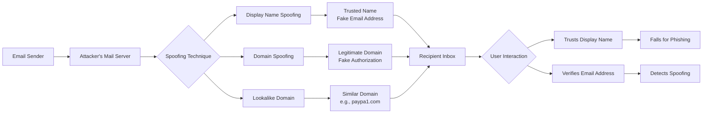
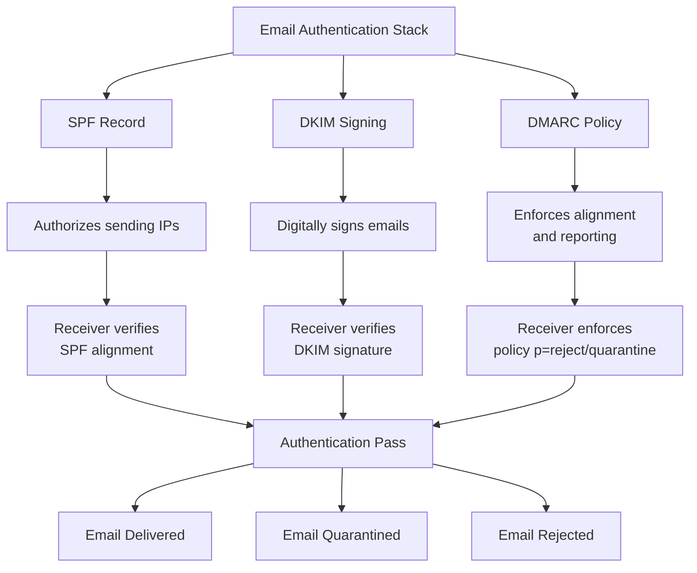

---
tags: [email-security]
---
# 🕵️ Full-Stack Lesson: Deceptive Sender Names & Display Spoofing

## TCM Exam Objectives
- Explain display name spoofing: attackers set a trusted display name with a different email address to bypass visual inspection
- Distinguish four spoofing types: display name, domain spoofing, lookalike domain, and compromised account
- Describe how SPF, DKIM, and DMARC work together to detect and block domain spoofing at the protocol level
- Analyze email headers for spoofing indicators: `From` vs. `Reply-To` vs. `Return-Path` mismatches, `Authentication-Results`
- Identify lookalike domain techniques: homoglyphs (Cyrillic characters), different TLDs, double letters, subdomain tricks
- Recognize BEC attack patterns: CEO impersonation, vendor impersonation, urgent wire transfer requests, invoice fraud
- Implement prevention: DMARC p=reject, external email warning banners, display full sender addresses in email clients
- Train users on behavioral detection: verify via out-of-band channels, hover to reveal URLs, check actual email address not just display name
Email spoofing is the creation of email messages with a forged sender address, commonly used in phishing attacks 【turn0search1】. Deceptive sender names and display spoofing are sophisticated techniques where attackers manipulate the visible "From" name and address to impersonate trusted sources, while the underlying email infrastructure may reveal a different story.



## 🔍 2. Understanding Display Name Spoofing

### 2.1 What is Display Name Spoofing?
Display name spoofing occurs when a threat actor changes the display name visible in the sender line of an email to that of a known source, which causes the recipient to trust the email 【turn0search6】. In this technique, hackers make fraudulent emails look legitimate by using different email addresses but the same display names 【turn0search3】.

### 2.2 How Display Name Spoofing Works
The attack exploits how email clients display sender information. Most email clients prioritize the display name over the actual email address in the inbox view. Attackers leverage this by:

1. **Configuring the visible "From" name** to impersonate a trusted entity 【turn0search7】
2. **Using a different email address** that may be controlled by the attacker
3. **Relying on user behavior** where recipients validate names before headers 【turn0search5】

### 2.3 Technical Implementation
Display name spoofing can be implemented through:

```python
# Example of how attackers configure email headers
from email.mime.text import MIMEText
from email.utils import formataddr

msg = MIMEText("This is a phishing attempt")
msg['From'] = formataddr(('CEO Name', 'attacker@malicious-domain.com'))
msg['To'] = 'victim@company.com'
msg['Subject'] = 'Urgent: Wire Transfer Request'
```

## 🛠️ 3. Technical Mechanics of Email Spoofing

### 3.1 Email Header Manipulation
Email spoofing involves manipulating the email header fields, particularly:

- **From:** field - Display name and email address
- **Reply-To:** field - Where responses will be sent
- **Return-Path:** field - Where bounce messages will be sent
- **Received:** fields - Routing information

### 3.2 Protocol-Level Vulnerabilities
The Simple Mail Transfer Protocol (SMTP) doesn't inherently verify the sender's identity, allowing attackers to:

1. **Forge the "Mail From" address** (envelope sender)
2. **Manipulate the "From" header** (displayed to recipient)
3. **Exploit complex routing** and misconfigurations 【turn0search4】

### 3.3 Types of Spoofing Attacks

| Spoofing Type | Technique | Detection Difficulty | Example |
|--------------|-----------|----------------------|---------|
| **Display Name Spoofing** | Legitimate name, fake email address | Medium - Requires header inspection | "CEO Name" <attacker@external.com> |
| **Domain Spoofing** | Legitimate domain, fake authorization | Hard - Requires DNS verification | "CEO" <ceo@company.com> (not authorized) |
| **Lookalike Domain** | Similar domain name | Easy - Visual inspection | "CEO" <ceo@companny.com> |
| **Compromised Account** | Legitimate account, malicious content | Hard - Behavioral analysis | "CEO" <ceo@company.com> (account compromised) |

📌 **Exam Tip:** Display name spoofing exploits how email clients render the From: field. Most clients show the *display name* prominently and relegate the actual email address to a smaller font or hidden column. The fix: configure email clients to show the full email address by default. DMARC cannot stop display name spoofing because the email passes authentication — the *domain* is legitimate, just the *display name* is deceptive.

```mermaid
flowchart TD
    SPOOF[Email with<br/>From: "CEO Name"<br/>attacker@evil.com] --> CLIENT[Email Client Rendering]
    CLIENT --> INBOX[Inbox shows:<br/>"CEO Name"<br/>subject prefixed]
    INBOX --> USER{User clicks?}
    USER -->|Looks only at display name| TRUST[Trusts the email]
    USER -->|Looks at email address| SUSPICIOUS[Suspicious -<br/>@evil.com not @company.com]
    TRUST --> CLICK[Clicks malicious link]
    SUSPICIOUS --> REPORT[Reports to security]
    CLICK --> COMPROMISE[Credentials harvested]
    
    subgraph HEADER[Email Header Analysis]
        H_FROM[From: "CEO Name" <attacker@evil.com>]
        H_RETURN[Return-Path: bounce@evil.com]
        H_REPLY[Reply-To: attacker@evil.com]
        H_AUTH[Authentication-Results:<br/>spf=pass (evil.com)<br/>dkim=pass (evil.com)<br/>dmarc=pass (evil.com)]
    end
```

## 📊 4. Detection Techniques

### 4.1 Technical Detection Methods

#### SPF/DKIM/DMARC Verification
These authentication protocols help verify if the sending server is authorized to send email on behalf of the domain 【turn0search2】:

- **SPF (Sender Policy Framework):** Checks if the sending IP is authorized
- **DKIM (DomainKeys Identified Mail):** Verifies digital signature on email
- **DMARC (Domain-based Message Authentication, Reporting, and Conformance):** Ties SPF and DKIM together with alignment requirements

#### Header Analysis
Security teams should examine:
- **Authentication-Results** header for SPF/DKIM/DMARC status
- **Received** headers for routing anomalies
- **Reply-To** vs **From** address mismatches
- **Return-Path** consistency

### 4.2 Behavioral Detection
Modern email security systems use behavioral analysis to detect:

- **Anomalous sending patterns** from known accounts
- **Geographic irregularities** in login locations
- **Time-based anomalies** (emails sent at unusual hours)
- **Content analysis** for urgency cues typical of phishing

### 4.3 Visual Inspection Techniques
Users should be trained to:

1. **Hover over links** before clicking to reveal actual URLs
2. **Check the actual email address**, not just the display name
3. **Look for slight variations** in domain names
4. **Verify requests** through out-of-band communication

## 🛡️ 5. Prevention & Mitigation Strategies

📌 **Exam Tip:** BEC (Business Email Compromise) is one of the most financially damaging attack types tested on the PSAA exam. Key points: BEC attackers impersonate executives to defraud the organization (usually via wire transfer). DMARC p=reject blocks domain spoofing but does NOT stop compromised accounts or lookalike domains. The most effective control is **out-of-band verification** — calling the executive at a known number to confirm the request.

### 5.1 Technical Defenses

#### Email Authentication Implementation
 

Implement the email authentication stack:



<details>
<summary>🔧 Implementation Example: DMARC Record</summary>

```dns
_dmarc.yourdomain.com. IN TXT "v=DMARC1; p=reject; rua=mailto:dmarc@yourdomain.com; ruf=mailto:forensic@yourdomain.com; pct=100; adkim=s; aspf=s"
```

**Record breakdown:**
- `v=DMARC1`: Protocol version
- `p=reject`: Policy for failed authentication (reject/quarantine/none)
- `rua=mailto:...`: Aggregate reporting address
- `ruf=mailto:...`: Forensic reporting address
- `pct=100`: Percentage of emails to apply policy to
- `adkim=s`: DKIM alignment (strict/relaxed)
- `aspf=s`: SPF alignment (strict/relaxed)

</details>

#### Email Gateway Configuration
Configure email security gateways to:

1. **Flag external emails** with internal display names
2. **Quarantine emails** failing authentication checks
3. **Alert on lookalike domains** (e.g., companny.com for company.com)
4. **Implement sender reputation** scoring

### 5.2 Organizational Defenses

#### Security Awareness Training
 

Train employees to:

- **Verify requests** through known, trusted channels
- **Be suspicious** of urgency cues or unexpected requests
- **Check email headers** when in doubt
- **Report suspicious emails** to security teams

#### Email Client Configuration
Configure email clients to:

1. **Display full email addresses** by default
2. **Warn on external emails** with internal display names
3. **Disable automatic image loading** (tracking pixels)
4. **Implement safe links** for URL rewriting

### 5.3 Advanced Detection Systems

#### Machine Learning-Based Detection
Modern systems analyze:

- **Email metadata patterns** (timing, frequency, routing)
- **Content analysis** for phishing indicators
- **User behavior baselines** for anomaly detection
- **Threat intelligence feeds** for known malicious infrastructure

#### Impersonation Protection
Specialized solutions detect:

- **Executive impersonation** attempts
- **Vendor impersonation** for financial fraud
- **Customer impersonation** for social engineering
- **Partner impersonation** for supply chain attacks

## 🚨 6. Attack Scenarios & Case Studies

### 6.1 Business Email Compromise (BEC)
Attackers spoof the CEO's display name to request wire transfers:

```
From: "CEO Name" <attacker@lookalike-domain.com>
To: "CFO Name" <cfo@company.com>
Subject: Urgent: Confidential Acquisition

Please process the attached wire transfer immediately. This is time-sensitive.
```

### 6.2 Vendor Impersonation
Attackers spoof a known vendor's display name to redirect payments:

```
From: "Acme Corp Billing" <attacker@different-domain.com>
To: "AP Department" <ap@company.com>
Subject: Updated Banking Information

Please update our payment details for future invoices.
```

### 6.3 Internal Communication Spoofing
Attackers spoof IT department display names to harvest credentials:

```
From: "IT Helpdesk" <attacker@external-domain.com>
To: "Employee" <employee@company.com>
Subject: Password Reset Required

Click here to reset your password immediately.
```

## 📈 7. Effectiveness & Impact Analysis

### 7.1 Why Display Name Spoofing is Effective

1. **Cognitive Bias**: Users trust familiar names 【turn0search5】
2. **Email Client Design**: Display names are prominent
3. **Limited Technical Verification**: Most users don't inspect headers
4. **Urgency Exploitation**: Creates false sense of emergency

### 7.2 Business Impact

| Impact Category | Description | Financial Impact |
|----------------|-------------|------------------|
| **Direct Financial Loss** | Wire transfer fraud, invoice redirection | $50,000 - $5M per incident |
| **Data Breach Costs** | Credential theft leading to data access | $1M - $10M+ per breach |
| **Reputational Damage** | Loss of customer trust, brand harm | Immeasurable |
| **Operational Disruption** | Business downtime, investigation costs | $100K - $1M per incident |
| **Regulatory Penalties** | Fines for data protection violations | $100K - $10M+ |

## 🔮 8. Future Trends & Emerging Threats

### 8.1 AI-Powered Spoofing
Attackers now use AI to:

- **Generate convincing email content** that mimics writing style
- **Optimize sending times** for maximum effectiveness
- **Craft personalized lures** based on social media intelligence
- **Evade detection systems** through adaptive techniques

### 8.2 Evasion Techniques
Sophisticated attackers employ:

1. **Compromised legitimate accounts** (hardest to detect)
2. **Domain aging** (registering lookalike domains well in advance)
3. **IP reputation management** (using clean IPs for initial sends)
4. **Content randomization** to avoid signature detection

### 8.3 Defensive Evolution
Future defenses will include:

- **Enhanced DMARC reporting** with real-time feedback
- **AI-powered behavioral analysis** for anomaly detection
- **Zero trust email models** that verify every sender
- **Blockchain-based sender verification** for high-value communications

## 🛠️ 9. Implementation Checklist

<details>
<summary>📋 Email Spoofing Prevention Implementation Checklist</summary>

### Phase 1: Foundation (Weeks 1-2)
- [ ] Conduct email security assessment
- [ ] Inventory all legitimate sending sources
- [ ] Implement SPF records for all domains
- [ ] Enable DKIM signing for all outgoing mail
- [ ] Publish DMARC record with p=none (monitoring mode)

### Phase 2: Enforcement (Weeks 3-6)
- [ ] Analyze DMARC reports for authentication failures
- [ ] Identify and fix legitimate sender issues
- [ ] Gradually increase DMARC policy (quarantine 25%, 50%, 100%)
- [ ] Implement email gateway rules for display name spoofing
- [ ] Deploy user awareness training program

### Phase 3: Advanced Protection (Weeks 7-12)
- [ ] Implement DMARC p=reject policy
- [ ] Deploy machine-based impersonation protection
- [ ] Establish out-of-band verification procedures
- [ ] Implement email client security configurations
- [ ] Create incident response playbook for spoofing attacks

### Phase 4: Continuous Improvement (Ongoing)
- [ ] Monthly review of DMARC reports
- [ ] Quarterly security awareness training
- [ ] Annual email security assessment
- [ ] Continuous monitoring for new spoofing techniques
- [ ] Regular testing of security controls

</details>

## 💎 10. Conclusion & Best Practices

### 10.1 Key Takeaways

1. **Display name spoofing is highly effective** because it exploits human psychology rather than technical vulnerabilities 【turn0search5】
2. **Email authentication (SPF/DKIM/DMARC) is foundational** but not sufficient alone
3. **Layered defense is essential** - combine technical controls with user education
4. **Regular monitoring and adjustment** of controls is critical as threats evolve
5. **Quick reporting mechanisms** help minimize impact of successful attacks

### 10.2 Recommended Best Practices

 

1. **Implement full email authentication stack** (SPF, DKIM, DMARC)
2. **Configure email clients to show full addresses** by default
3. **Train users to verify requests** through out-of-band channels
4. **Deploy specialized email security solutions** with impersonation protection
5. **Establish clear procedures** for reporting suspicious emails
6. **Conduct regular phishing simulations** to reinforce training
7. **Monitor DMARC reports** continuously for authentication failures
8. **Maintain updated threat intelligence** on new spoofing techniques

### 10.3 Final Thoughts

Deceptive sender names and display spoofing remain prevalent because they exploit the fundamental trust model of email communication. While technical solutions like DMARC are crucial, they must be combined with user education and behavioral detection systems. Organizations must adopt a **zero-trust approach to email** where every message is verified through multiple layers of authentication and analysis.

> ⚠️ **Remember**: Email security is not a one-time implementation but an ongoing process. As attackers evolve their techniques, defensive measures must also adapt. Regular assessment, user training, and technology updates are essential to maintaining effective protection against deceptive sender names and display spoofing attacks.

By implementing the comprehensive approach outlined in this lesson, organizations can significantly reduce their risk from these sophisticated social engineering attacks while maintaining the usability and trust that email communication requires.