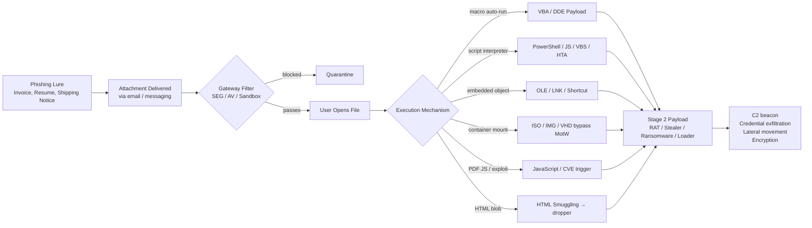
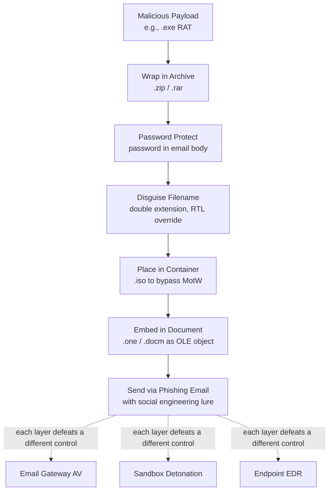
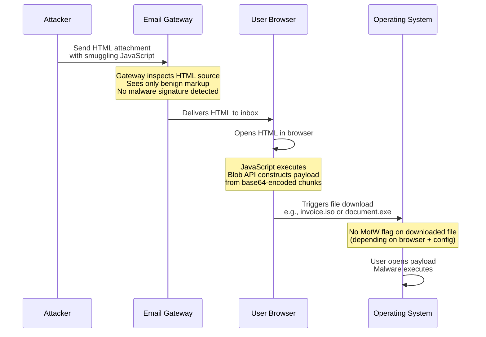

# Malicious Attachments and File Types

## TCM Exam Objectives
- Categorize the seven dangerous file type families: executables, scripts, macro-enabled Office, archives, containers (ISO/VHD), PDFs, and HTML smuggling
- Explain LNK files as a primary 2024-2025 initial-access vector — disguised as documents, PowerShell downloaders via Living-off-the-Land
- Describe HTML smuggling: using HTML5 Blob/File APIs to construct malicious payloads client-side, bypassing gateway inspection
- Analyze Mark-of-the-MotW (MotW) propagation and how container files (ISO/IMG/VHD) bypassed it before Microsoft's patch
- Compare static analysis (magic bytes, signature, olevba/oledump) vs. dynamic analysis (sandbox detonation, behavioral indicators)
- Identify file obfuscation techniques: double extensions, Unicode RTL override, password-protected ZIPs, nested archives
- Recognize sandbox evasion techniques: VM detection, user-interaction requirements, delayed execution, environment fingerprinting
- Implement defense-in-depth: SEG file type blocking, sandbox detonation, EDR behavioral detection, application whitelisting (AppLocker/WDAC)
Malicious attachments are weaponized files delivered via email (or other messaging channels) that exploit the trusted practice of opening business documents to execute payloads — and the most dangerous file types span seven categories: native executables, scripts, macro-enabled Office documents, archives, container images, PDFs, and HTML, each with distinct execution mechanisms that determine how they bypass controls and what damage they inflict.【turn0search0】【turn0search1】【turn0search6】

📌 **Exam Tip:** LNK files have surged as a primary initial-access vector (2024-2025). Key points: they appear as document icons but execute PowerShell commands; they use Living-off-the-Land techniques; they bypassed many gateways that didn't inspect LNK internals. Ransomware and RAT groups (Remcos, Qakbot) heavily use LNK. Also know that `.iso`/`.img` files bypassed Mark-of-the-MotW before Microsoft's patch — the mounted container appeared as a local volume, so files inside didn't trigger SmartScreen.

## The Attachment Threat Pipeline

Every malicious attachment campaign follows the same structural flow: a social-engineering lure delivers a file type chosen for its ability to bypass gateway filters, the file uses an execution mechanism (auto-run macro, script interpreter, embedded object, container mount) to launch a payload, and the payload achieves the attacker's objective — typically credential theft, persistence, or lateral movement.【turn0search0】【turn0search15】

The dotted reality: most modern phishing now uses *links* rather than attachments because attachments are easier to sandbox-detonate — but attachments remain the preferred vector for high-impact, targeted attacks where the attacker needs guaranteed execution on a specific endpoint.【turn0search3】

## Master Comparison: Dangerous File Types

| File Type | Execution Mechanism | Typical Payload | Bypass Technique | Risk Level |
|---|---|---|---|---|
| **.exe / .com / .scr** | Native Windows executable | RAT, ransomware, stealer | Rarely — easily detected; usually wrapped | High (if it reaches endpoint) |
| **.bat / .cmd / .ps1** | Script interpreter (cmd, PowerShell) | Downloader, loader | Living-off-the-Land, obfuscation | High |
| **.js / .jse / .vbs / .wsh** | Windows Script Host | Loader, dropper | Legitimate interpreter, fileless | High |
| **.hta** | mshta.exe (HTML Application) | PowerShell loader | Trusted application, bypasses filters | High |
| **.lnk** | Shell shortcut → command execution | PowerShell downloader | Disguised as document, LotL | Very High (2024-2025 surge) |
| **.docm / .xlsm** (macro-enabled) | VBA auto-run on Open | Loader, credential stealer | Social engineering "Enable Content" | Very High |
| **.doc / .xls** (legacy) | Embedded OLE, DDE, exploits | Loader, RAT | Macroless techniques, CVEs | High |
| **.one** (OneNote) | Embedded file execution | AsyncRAT, Qakbot, RedLine | Bypassed macro blocks in 2023 | High |
| **.iso / .img / .vhd** | Container mount | Bypasses Mark-of-the-Web | MotW not propagated to contents | Very High |
| **.zip / .rar / .7z** | Archive (wrapper) | Wraps any payload above | Password protection, nested archives | High |
| **.pdf** | JavaScript, embedded objects, CVE exploits | Stealer, loader | Trusted format, 75% of malicious attachments | High |
| **.html / .htm** | Browser rendering | HTML smuggling → dropper | Blob API builds file client-side | High |

Sources: 【turn1search0】【turn1search1】【turn1search4】【turn1search14】【turn1search19】【turn0search4】【turn0search15】

---

## Module 1 — Executables and Native Binaries

**Files:** `.exe`, `.com`, `.scr` (screen saver), `.dll`, `.sys`

Native executables are the most direct payload — double-click and the code runs with the user's privileges. Because they're so easily flagged by signatures, attackers rarely send raw `.exe` files directly; instead they're wrapped inside archives, containers, or droppers that extract and execute them at runtime.【turn1search0】【turn0search5】

**Why they matter:** They're the ultimate payload that every other file type is trying to deliver. A `.docm` macro doesn't steal credentials directly — it downloads and runs an `.exe` that does. Screen savers (`.scr`) are a classic disguise because Windows treats them as executables but users perceive them as benign "theme" files.【turn0search5】

---

## Module 2 — Scripts and Interpreted Files

**Files:** `.bat`, `.cmd`, `.ps1`, `.js`, `.jse`, `.vbs`, `.wsh`, `.hta`

Script files abuse legitimate Windows interpreters (PowerShell, Windows Script Host, mshta.exe) to execute code without dropping a binary — this is the foundation of **fileless malware** and Living-off-the-Land (LotL) techniques.【turn1search1】

**PowerShell (`.ps1`)** — the most abused interpreter because it's installed everywhere, has full .NET access, and supports in-memory execution that leaves no disk artifact. Attackers encode payloads in Base64 to evade keyword detection.

**JavaScript / VBScript (`.js`, `.vbs`)** — Windows Script Host executes these natively. A single `.js` file can use ActiveX to download and run executables. Microsoft has progressively restricted these, but legacy systems remain vulnerable.【turn1search1】

**HTA (`.hta`)** — HTML Applications run with full privileges via `mshta.exe`, a trusted Windows binary. An HTA file contains HTML + VBScript/JavaScript that executes outside the browser sandbox, making it a favorite loader that bypasses browser-based security.【turn1search1】

---

## Module 3 — Windows Shortcut Files (`.lnk`)

LNK files deserve their own module because of the **2024-2025 surge** in their use as a primary initial-access vector.【turn1search4】 A `.lnk` file appears to users as a document icon but actually contains a command that executes on double-click — typically a PowerShell downloader that retrieves a Base64-encoded payload.【turn1search8】

**Why LNK is so effective:**
- Disguised as documents (PDF icon, Word icon) so users perceive them as benign
- Uses legitimate Windows shell functionality — no exploit needed
- Executes PowerShell directly, enabling Living-off-the-Land
- Bypassed many gateway filters that didn't inspect LNK internals until recently【turn1search4】【turn1search7】

The 2025 Trend Micro disclosure of **ZDI-CAN-25373** (a Windows .lnk zero-day enabling hidden command execution) illustrates that LNK remains an active attack surface even as Microsoft patches it.【turn1search5】 Ransomware groups like Global Group and RAT distributors delivering Remcos have adopted LNK as a preferred delivery mechanism.【turn1search7】【turn1search8】

---

## Module 4 — Office Documents and Macro Malware

**Files:** `.doc`, `.docm`, `.xls`, `.xlsm`, `.ppt`, `.pptm`, `.one` (OneNote)

Office documents are the historical workhorse of attachment-based attacks because they combine trusted format + business context + execution capability (VBA macros, DDE, OLE embedding, CVE exploits).【turn0search7】【turn0search11】

### VBA Macros

A malicious macro is VBA code embedded in a Word/Excel/PowerPoint document that executes automatically when the document is opened (if macros are enabled). The attack chain typically:【turn0search7】【turn0search12】
1. Document arrives with lure ("Invoice #31415", "Resume")
2. User opens it; Office shows the "Enable Content" yellow bar
3. Social engineering or default settings convince user to enable macros
4. VBA macro runs, typically executing an encoded PowerShell command
5. PowerShell downloads and runs the stage-2 payload (RAT, stealer, ransomware)

Microsoft's **default macro blocking** for files marked with Mark-of-the-Web (introduced 2022) significantly reduced macro-based attacks — but attackers pivoted rather than gave up.【turn1search14】

### Macroless Techniques

When macros are blocked, attackers use:
- **DDE (Dynamic Data Exchange)** — a legacy protocol for inter-application data exchange that can execute arbitrary commands without macros【turn0search10】
- **Embedded OLE objects** — malicious objects embedded in documents that execute on click
- **CVE exploits** — vulnerabilities in Office's parsing engine (e.g., Equation Editor CVE-2017-11882) that allow code execution on document open

### OneNote (`.one`)

When Microsoft blocked macros by default in 2022, attackers pivoted to OneNote, which allows embedding arbitrary files (`.exe`, `.wsf`, `.vbs`) inside notebook pages with a "click to open" prompt. Proofpoint observed **over 50 OneNote campaigns in January 2023 alone**, delivering AsyncRAT, RedLine, AgentTesla, and Qakbot.【turn1search14】【turn1search17】 Microsoft responded in April 2023 by blocking 120 extension types in OneNote, but the cat-and-mouse continues.【turn1search15】

---

## Module 5 — Archives and Containers

### ZIP / RAR / 7z Archives

Archives are wrappers — they don't execute themselves but they package any of the file types above while evading gateway inspection. **ZIP files have become one of the most abused malware delivery mechanisms** because they blend into everyday business workflows (invoices, HR documents, contracts, scans).【turn0search15】

**Obfuscation techniques within archives:**
- **Password-protected ZIPs** — the password is typically provided in the email body, defeating gateway AV that can't decrypt the archive (though Microsoft 365 now scans inside password-protected ZIPs)【turn0search18】【turn0search19】
- **Nested archives** — a ZIP containing a ZIP containing a ZIP, each layer stripping context
- **Double extensions** — `invoice.pdf.exe` (Windows hides the real extension by default)
- **Unicode tricks** — using RTL override characters to reverse displayed filename

### ISO / IMG / VHD Container Images

The most significant container-based bypass of 2021-2023: disk image files (`.iso`, `.img`, `.vhd`) **bypassed Mark-of-the-Web (MotW) propagation**. When a user downloaded an ISO from an email and mounted it, the files inside did *not* inherit the MotW flag that would have triggered SmartScreen and macro-blocking — because Windows treated the mount as a local volume.【turn1search13】【turn1search11】

This technique was heavily used by **Qakbot** and later by ransomware affiliates. Microsoft eventually patched MotW propagation to container files, but the technique demonstrated how attackers exploit format-specific edge cases in Windows trust controls.【turn1search13】【turn1search10】

---

## Module 6 — PDF and HTML

### PDF (`.pdf`)

PDFs represent approximately **75% of all malicious attachments** in some studies, because the format is universally trusted and opened without hesitation.【turn0search4】 Attack vectors within PDFs:
- **Embedded JavaScript** — PDF supports JS execution for form validation; attackers abuse it to launch exploits
- **CVE exploits** — vulnerabilities in Adobe Reader / Foxit / Chrome PDFium parsers
- **Embedded files** — PDFs can contain attached executables that users extract and run
- **Phishing links** — PDFs with clickable links to credential-harvesting sites

### HTML (`.html`, `.htm`)

HTML attachments abuse the browser's rendering engine and legitimate APIs to deliver payloads — the most sophisticated technique being **HTML smuggling**.【turn1search19】【turn1search21】

**HTML smuggling** uses the HTML5 Blob and File APIs to construct a malicious file *client-side* in the browser, bypassing email gateways that only inspect the HTML source (which contains no recognizable malware signature). The HTML file looks benign to the gateway; when the user opens it, JavaScript assembles the payload blob and triggers a download — often an ISO or signed executable that then runs locally.【turn1search21】【turn1search20】

NOBELIUM (the Russian state-sponsored group behind SolarWinds) used HTML smuggling via the **EnvyScout** dropper to deliver malicious ISO files to government and diplomatic targets — demonstrating the technique's adoption by the most sophisticated threat actors.【turn1search20】

---

## Module 7 — File Type Obfuscation Techniques

Attackers layer obfuscation to defeat each stage of the detection stack.

Key obfuscation tactics:【turn0search15】【turn1search9】【turn1search11】
- **Double extensions** — `report.pdf.exe` (Windows hides known extensions by default)
- **Unicode RTL override** — `\u202E` reverses displayed text so `txt.exe` displays as `exe.txt`
- **Container stacking** — ZIP inside ISO inside password-protected RAR
- **MotW stripping** — placing payloads in containers that don't propagate the MotW flag
- **Living-off-the-Land** — using signed, trusted binaries (PowerShell, mshta, wscript) to execute obfuscated code
- **Fileless techniques** — executing entirely in memory via PowerShell or WMI, leaving no disk artifact

---

📌 **Exam Tip:** HTML smuggling is a critical exam concept. The HTML file contains JavaScript that builds the malicious payload *client-side* using the Blob and File APIs. The gateway sees only benign HTML source code — the malware is constructed entirely in the browser. NOBELIUM (SolarWinds attackers) used HTML smuggling via the EnvyScout dropper to deliver ISO files. This technique bypasses email gateways that don't execute JavaScript.

## Module 8 — Detection Layer: Static and Dynamic Analysis

Mature defense combines static inspection (what the file *is*) with dynamic analysis (what the file *does*).

### Static Analysis

Static analysis examines the file without executing it — looking at signatures, structure, and metadata.【turn0search23】

**File signature / magic bytes inspection** — every file format has a unique header signature (the "magic number") at the start of the file. A real PDF begins with `%PDF-1.`, a real ZIP with `PK\x03\x04`, a real JPEG with `\xFF\xD8\xFF`.【turn1search24】【turn1search25】【turn1search27】 Comparing the magic bytes against the claimed extension catches **extension spoofing** — a file named `invoice.pdf` that begins with `MZ` (the Windows executable signature) is immediately flagged. This is more reliable than trusting the filename extension, which is user-editable.【turn1search26】

**Signature-based AV** — hash matching against known malware databases. Fast, low false-positive, but fails against polymorphic malware and zero-days.

**Structural analysis** — parsing the file format to extract embedded objects, macros, streams. Tools: `olevba` and `oledump` for Office documents (extract VBA macros), `pdf-parser` for PDF structure, `binwalk` for embedded files.【turn0search13】

### Dynamic Analysis (Sandbox Detonation)

Dynamic analysis executes the suspicious file in an isolated virtual environment (sandbox) and observes its behavior — network connections, file system changes, registry modifications, process spawning.【turn0search21】【turn0search22】 This catches zero-days and fileless malware that static analysis misses because it watches *what the file does*, not *what the file looks like*.【turn0search23】

**What dynamic analysis reveals:**
- **Network activity** — C2 server IP addresses, domains contacted, data exfiltrated
- **File system changes** — files created, modified, or deleted
- **Process spawning** — child processes launched (especially PowerShell, cmd, wscript)
- **Registry modifications** — persistence mechanisms established
- **Memory artifacts** — injected code, hollowed processes

**Proofpoint's TAP** detonates every attachment in a sandbox before delivery — this is the gold standard for attachment defense, though it adds latency.【turn0search29】 Modern sandboxes face an arms race against **sandbox-evasion techniques**: malware that detects VM artifacts (specific registry keys, MAC addresses, timing), requires user interaction (moving the mouse), or delays execution to outwait the sandbox observation window.

---

## Module 9 — Defense-in-Depth Strategy

No single control stops all malicious attachments; the mature strategy layers technical controls with user awareness and process discipline.

### Email Gateway Controls

**Secure Email Gateways (SEGs)** — Proofpoint, Mimecast, Sophos Email, Microsoft Defender for Office 365 — sit in front of the mailbox and apply:
- **File type blocking** by policy (Mimecast blocks executables, scripts, shortcuts, system files by default)【turn1search0】
- **Sandbox detonation** of all attachments before delivery
- **Signature + heuristic + behavioral** AV scanning
- **Sender authentication** (SPF, DKIM, DMARC) to reject spoofed senders【turn0search27】

**Default-block dangerous file types:** `.exe`, `.com`, `.bat`, `.cmd`, `.vbs`, `.js`, `.jse`, `.wsh`, `.hta`, `.lnk`, `.scr`, `.iso`, `.img`, `.vhd`. These have no legitimate business-email use case in most organizations.【turn1search0】【turn0search6】

### Endpoint Controls

**EDR / XDR** — even if a malicious attachment reaches the endpoint, EDR detects the behavioral indicators: PowerShell spawning from Word, unusual network connections to new IPs, credential access patterns. This is the last line of defense before execution succeeds.

**Mark-of-the-Web enforcement** — ensure MotW propagates correctly (patched Windows) so that downloaded files trigger SmartScreen and macro-blocking.

**Application whitelisting / AppLocker / WDAC** — prevent unauthorized executables and scripts from running, even if they reach the endpoint.

### User Awareness Training

Users are the final filter. Training should cover:【turn0search1】
- Verify sender before opening unexpected attachments
- Hover over links and inspect attachment icons before clicking
- Be suspicious of password-protected ZIPs with passwords in the email body
- Never enable macros in documents from external senders
- Report suspicious attachments to security rather than opening them

### Patch Management

Many attachment attacks exploit CVEs in Office, Adobe Reader, or Windows parsing engines. Prompt patching closes the vulnerabilities before attackers can exploit them — the Equation Editor CVE-2017-11882 remained exploitable for years in unpatched environments.

---

## Common Pitfalls

**Trusting file extensions** — Windows hides known extensions by default, enabling `invoice.pdf.exe` to display as `invoice.pdf`. Magic-byte inspection is the reliable indicator, not the extension.【turn1search26】

**Signature-only AV** — relying on hash matching fails against polymorphic malware that changes its signature on every replication. Behavioral detection is essential.【turn0search23】

**Sandbox gaps** — sandbox-evasion techniques (VM detection, user-interaction requirements, delayed execution) can cause malware to remain dormant during analysis and activate only on the real endpoint. Multiple sandbox engines and longer observation windows mitigate but don't eliminate this.【turn0search21】

**Ignoring container files** — until the MotW propagation patch, `.iso` and `.img` files bypassed a critical Windows trust control. Defense must account for format-specific edge cases, not just known-bad extensions.【turn1search13】

**Over-reliance on user judgment** — training helps, but sophisticated lures (spoofed internal senders, contextual business language) will defeat even vigilant users. Technical controls must catch what users miss.

**Blocking attachments too broadly** — blocking all `.zip` files breaks legitimate business workflows. The balance is blocking dangerous file *types* within archives while allowing archive formats themselves, with sandbox inspection of contents.【turn0search15】

**Forgetting legacy formats** — `.doc` and `.xls` (not just `.docm`/`.xlsm`) can carry macroless exploits and embedded objects. Blocking only macro-enabled extensions leaves gaps.

---

## Recap

Malicious attachments span seven file-type categories — native executables, scripts, Office documents (with macro, DDE, and OneNote variants), archives, container images, PDFs, and HTML — each exploiting a different execution mechanism to deliver payloads ranging from credential stealers to ransomware.【turn0search0】【turn0search6】 Attackers obfuscate these files through double extensions, password-protected archives, container stacking (ISO bypassing MotW), and fileless execution via legitimate interpreters, layering techniques to defeat each stage of the detection stack.【turn0search15】【turn1search11】 Defense requires layered controls: email gateways that block dangerous file types and sandbox-detonate all attachments before delivery, static inspection using magic-byte signature verification (not extension trust) and format-specific parsers like `olevba`, dynamic analysis in sandboxes that observe behavioral indicators (network C2, process spawning, persistence), EDR on the endpoint as the last line of defense, and user awareness training as the human filter.【turn0search23】【turn0search21】【turn1search0】 The throughline: no single file type, no single detection method, and no single control is sufficient — the resilience of the defense comes from layering static and dynamic analysis across gateway, endpoint, and human layers, with the understanding that attackers will continuously pivot to whichever file type currently bypasses the weakest link in that stack.