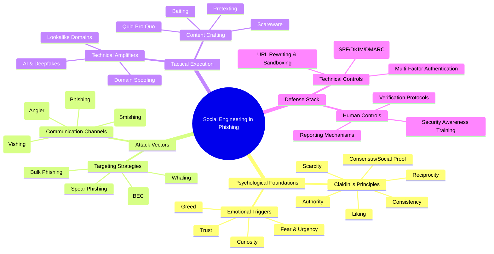
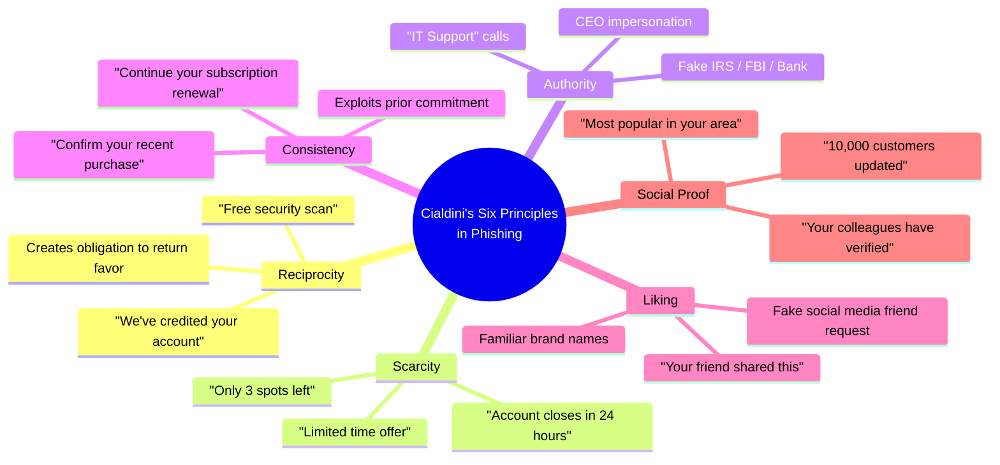
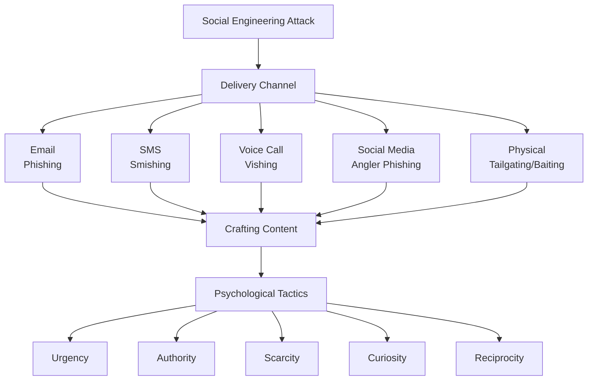
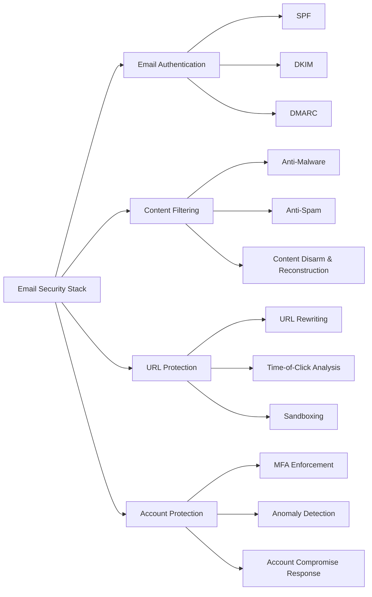
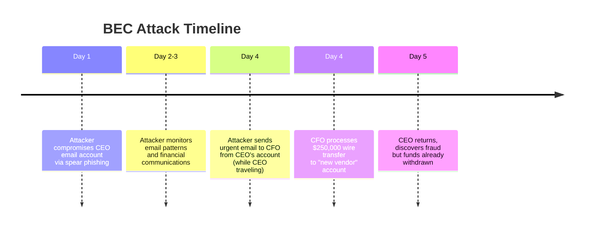

# Social Engineering Tactics in Phishing Content

## TCM Exam Objectives
- Apply Cialdini's Six Principles of Persuasion to phishing: reciprocity, scarcity, authority, consistency, liking, social proof
- Identify emotional trigger mechanisms: fear, urgency, curiosity, greed, trust — and how each bypasses logical reasoning
- Distinguish pretexting (fabricated scenario), baiting (free offer trap), quid pro quo (service for info exchange), and scareware (fake virus warnings)
- Explain how AI/LLMs enhance phishing: hyper-personalization, grammar-perfect content, deepfake audio/video, automated optimization
- Describe the multi-layered defense stack: technical controls (SPF/DKIM/DMARC, URL rewriting, MFA) + human controls (training, verification protocols, reporting)
- Analyze BEC and CEO fraud attack anatomy: reconnaissance → pretext → urgency → wire transfer request
- Implement verification protocols: never use contact info from the suspicious message, verify through independent known channels
- Recognize emerging trends: deepfake vishing, LLM-powered chatbots adapting conversations in real-time, image-based phishing
Social engineering represents the **art of human manipulation** in cybersecurity attacks, where psychological exploitation often trumps technical sophistication 【turn0search0】. Phishing—its most prevalent form—remains the **leading initial attack vector**, identified in 41% of all incidents according to IBM X-Force Threat Intelligence Index 【turn0search0】. This lesson deconstructs the psychological architecture, tactical execution, and defensive countermeasures of social engineering in phishing content.



📌 **Exam Tip:** Memorize all six of Cialdini's Principles and know a phishing example for each. The exam often tests the principle-to-implementation mapping. For instance: "Only 2 hours left" tests SCARCITY; "Your account will be suspended" tests FEAR (authority + scarcity combo); "Join 10,000 users who already updated" tests SOCIAL PROOF. The most dangerous phish exploit MULTIPLE principles simultaneously.



## 🔍 2. Psychological Foundations: How Attackers Hack the Mind

### 2.1 Cialdini's Six Principles of Persuasion

Phishing success hinges on exploiting fundamental human psychology. Dr. Robert Cialdini's six principles of influence provide the theoretical framework for most attacks 【turn0search6】:

| Principle | Phishing Implementation | Example |
|-----------|-------------------------|---------|
| **Reciprocity** | Offering "help" or "gifts" to create obligation | "Free security scan" requiring login credentials |
| **Scarcity** | Creating false urgency or limited availability | "Only 2 hours left to claim your prize" |
| **Authority** | Impersonating trusted figures or institutions | Fake IRS emails demanding immediate tax payment |
| **Consistency** | Exploiting prior commitments or self-image | "Confirm your recent purchase" after data breach |
| **Liking** | Using familiar names, brands, or associations | Email from "colleague" with shared project details |
| **Social Proof** | Suggesting others have already complied | "Join 10,000 users who updated their security" |

### 2.2 Emotional Trigger Mechanisms

Attackers expertly exploit human emotions to bypass logical reasoning 【turn0search7】【turn0search9】:

- **Fear & Urgency**: "Your account will be suspended in 24 hours" triggers stress responses that cloud judgment 【turn0search9】
- **Curiosity**: Subject lines like "See who viewed your profile" exploit natural inquisitiveness 【turn0search9】
- **Greed & Opportunity**: "You've won $500" promises trigger reward centers in the brain 【turn0search9】
- **Trust & Familiarity**: Mimicking branding and language of legitimate organizations creates false safety 【turn0search9】

## ⚔️ 3. Attack Vectors & Delivery Mechanisms

### 3.1 Communication Channel Taxonomy



### 3.2 Phishing Subtypes & Targeting Strategies

| Attack Type | Description | Target | Example |
|-------------|-------------|--------|---------|
| **Bulk Phishing** | Mass emails impersonating large organizations | General public | Fake bank security alerts |
| **Spear Phishing** | Targeted emails using personal information | Specific individuals | Email to CFO referencing recent merger |
| **Whaling** | Spear phishing targeting high-profile executives | CEOs, politicians | Fake legal subpoena to CEO |
| **Business Email Compromise (BEC)** | Compromised authority figures' accounts | Employees, partners | CEO requesting wire transfer |
| **Smishing** | SMS-based phishing | Mobile users | "Delivery failed, update address" |
| **Vishing** | Voice call phishing | Phone recipients | "Tech support" requesting remote access |

## 🛠️ 4. Tactical Execution: Content Crafting Techniques

### 4.1 Pretexting: The Art of Fabricated Scenarios

Pretexting involves creating **elaborate fictional scenarios** that justify information requests 【turn0search0】【turn0search14】. The attacker establishes a plausible context that makes the victim's compliance seem reasonable or necessary.

**Common Pretexts:**
- Security breach notification requiring "verification"
- IT support requesting password resets
- HR needing updated direct deposit information
- Legal or compliance documentation requirements

**Execution Example:**
```
From: "IT Support Desk" <support@company-security.com>
To: employee@company.com
Subject: Urgent: Password Reset Required

Our systems detected unusual activity on your account.
To prevent suspension, please verify your credentials at:
http://company-security-verify.com/login

This is an automated message. Do not reply.
```

📌 **Exam Tip:** AI-powered phishing is the fastest-growing exam topic. Be able to explain how LLMs changed the phishing landscape: (1) perfect grammar eliminates the "obvious" red flags, (2) personalization at scale — AI scrapes LinkedIn/social media to craft hyper-targeted messages, (3) deepfake voice/video for vishing — 1,600% surge in Q1 2025. The key phrase: AI has shifted phishing from "craft" to "industrial-scale production."

### 4.2 Baiting: Temptation as a Weapon

Baiting exploits **human desire for free goods** or valuable items 【turn0search0】. Attackers offer something enticing to lure victims into compromising actions.

**Digital Baiting:**
- Free malware-infected software downloads
- Pirated movies or games with embedded malware
- "Exclusive" content requiring login credentials

**Physical Baiting:**
- Malware-infected USB drives labeled "Salary Information" or "Layoff List"
- Infected devices left in strategic locations (parking lots, restrooms)
- Fake gift cards or prizes requiring activation fees

### 4.3 Quid Pro Quo: Exchange Exploitation

Quid pro quo attacks promise **benefit in exchange for information** or access 【turn0search10】【turn0search11】. Unlike baiting (which offers goods), quid pro quo offers services or assistance.

**Common Scenarios:**
- Fake IT support calling to "fix" issues in exchange for access
- "Free" security assessments requiring login credentials
- Fake contest winnings requiring "processing fees"
- "Verification" services for better account protection

### 4.4 Scareware: Fear as a Service

Scareware uses **fear-inducing pop-ups or messages** to manipulate victims into purchasing useless software or providing information 【turn0search0】.

**Indicators:**
- Fake virus warnings with flashing alerts
- Countdown timers creating artificial urgency
- "Critical" system errors requiring immediate action
- Fake law enforcement notices accusing of crimes

## 🤖 5. Technical Amplifiers: Modern Enhancements

### 5.1 AI-Powered Phishing Evolution

Artificial intelligence has transformed phishing from craft to industrial-scale production 【turn0search1】:

- **LLM-Generated Content**: AI removes grammar errors and mimics writing styles perfectly 【turn0search1】
- **Personalization at Scale**: AI analyzes social media to craft hyper-personalized messages 【turn0search1】
- **Deepfake Integration**: AI-generated audio/video impersonates executives for BEC attacks 【turn0search3】
- **Automated Optimization**: Machine learning tests and refines messages for maximum effectiveness

### 5.2 Domain & Brand Impersonation Techniques

<details>
<summary>🔧 Technical Implementation of Domain Spoofing</summary>

```dns
// Legitimate SPF record
example.com. IN TXT "v=spf1 include:_spf.google.com ~all"

// Spoofed variations
examp1e.com. IN TXT "v=spf1 include:_spf.google.com ~all"  // Lookalike
example.com. IN TXT "v=spf1 include:_spf.attacker.com ~all"  // Compromised
// No SPF record (allows spoofing)
example.com. IN TXT ""  // No protection
```

**Attack Techniques:**
- **Lookalike Domains**: Registering examp1e.com instead of example.com
- **Compromised Domains**: Using legitimate domains with SPF misconfigurations
- **Subdomain Spoofing**: Using unused subdomains (info.example.com)
- **Display Name Spoofing**: "CEO Name" <attacker@external-domain.com>
</details>

## 🛡️ 6. Defense Stack: Multi-Layered Protection

### 6.1 Technical Controls

 



**Email Authentication Protocol Stack:**
1. **SPF (Sender Policy Framework)**: Specifies authorized sending IPs 【turn0search2】
2. **DKIM (DomainKeys Identified Mail)**: Digitally signs emails to verify integrity 【turn0search2】
3. **DMARC (Domain-based Message Authentication, Reporting, and Conformance)**: Ties SPF and DKIM together with alignment requirements 【turn0search2】

### 6.2 Human-Centric Defenses

 

**Security Awareness Training Components:**
- **Phishing Simulations**: Regular mock attacks with varying sophistication
- **Psychology Education**: Teaching employees about manipulation tactics 【turn0search20】
- **Verification Protocols**: Established procedures for confirming requests
- **Reporting Mechanisms**: Easy, blame-free reporting channels 【turn0search22】

**Verification Protocol Example:**
```
When receiving unusual requests:
1. DO NOT use contact information provided in the request
2. Verify through independent channels (known phone numbers, official websites)
3. For financial transactions: Implement two-person verification
4. When in doubt: Contact IT security directly
```

### 6.3 Organizational Resilience Measures

| Measure | Implementation | Effectiveness |
|---------|----------------|---------------|
| **Multi-Factor Authentication** | Enforce on all accounts, especially email | Reduces account compromise by 99.9% |
| **Principle of Least Privilege** | Limit access to sensitive systems | Contains breach impact |
| **Network Segmentation** | Isolate critical systems | Prevents lateral movement |
| **Incident Response Plan** | Regular drills and updates | Reduces breach cost by 40% |
| **Threat Intelligence** | Subscribe to feeds for emerging tactics | Proactive defense updates |

## 🚨 7. Attack Case Studies & Anatomy

### 7.1 The CEO Wire Transfer Fraud (BEC)

**Attack Flow:**


**Psychological Levers Used:**
- **Authority**: Impersonation of CEO
- **Urgency**: "Time-sensitive acquisition"
- **Familiarity**: Referencing recent company events
- **Trust**: Using legitimate email account

### 7.2 The "IT Support" Vishing Attack

**Call Transcript:**
> "Hello, this is Alex from IT Support. We're detecting unusual activity on your account. To secure it, I need you to read me the verification code that will be sent to your phone. This is extremely urgent—your account will be locked in 5 minutes if we don't resolve this."

**Tactics Deployed:**
- **False Authority**: Claiming IT affiliation
- **Artificial Urgency**: 5-minute deadline
- **Technical Jargon**: "Verification code," "account lock"
- **Quid Pro Quo**: Offering account security in exchange for code

## 📊 8. Effectiveness Metrics & Attack Economics

### 8.1 Why Phishing Remains Highly Effective

| Factor | Explanation | Impact |
|--------|-------------|--------|
| **Low Cost** | Minimal investment for potential high return | High ROI for attackers |
| **Scale** | Millions of emails sent simultaneously | Even small success rates yield profit |
| **Human Factor** | Bypasses technical controls entirely | Targets weakest security link |
| **Cognitive Load** | Victims overwhelmed with messages | Reduces scrutiny time |
| **AI Enhancement** | Perfect grammar and personalization | Increases believability |

### 8.2 Attack Economics: Cost-Benefit Analysis for Attackers

```
Phishing Campaign Investment:
- Email list: $100-$1,000 (million emails)
- Malware kit: $50-$500
- Hosting infrastructure: $100-$1,000
- Labor: Minimal (automated)

Potential Returns:
- Bank account access: $2,000-$10,000 per account
- Credit card sales: $5-$50 per card
- Ransomware payments: $500-$50,000 per victim
- Business email compromise: $30,000-$100,000 per success

Break-even point: 1 successful attack per million emails
```

## 🔮 9. Future Trends & Emerging Threats

### 9.1 AI-Enhanced Social Engineering

 

- **Deepfake Vishing**: AI-generated voice impersonations for phone calls 【turn0search3】
- **LLM-Powered Chatbots**: Real-time phishing conversations that adapt to responses
- **Automated Personalization**: Mining social media for hyper-targeted attacks
- **Context-Aware Attacks**: AI that references recent company events or news

### 9.2 Evasion Techniques

- **Zero-Day Text**: Using novel combinations of words to avoid filters
- **Image-Based Phishing**: Embedding text in images to bypass text analysis
- **Compromised Supply Chains**: Attacking trusted vendors to reach targets
- **Multi-Channel Orchestration**: Combining email, SMS, and voice for credibility

## 📝 10. Implementation Checklist

<details>
<summary>🔧 Phishing Defense Implementation Roadmap</summary>

### Phase 1: Foundation (Weeks 1-4)
- [ ] Implement email authentication (SPF, DKIM, DMARC)
- [ ] Deploy email security gateway with anti-phishing
- [ ] Enable multi-factor authentication for all accounts
- [ ] Conduct baseline phishing simulation

### Phase 2: Education & Awareness (Weeks 5-8)
- [ ] Develop security awareness training program
- [ ] Create phishing reporting mechanism
- [ ] Establish verification protocols for financial transactions
- [ ] Begin monthly phishing simulations

### Phase 3: Technical Hardening (Weeks 9-12)
- [ ] Implement URL rewriting and time-of-click analysis
- [ ] Deploy endpoint detection and response (EDR)
- [ ] Configure network segmentation
- [ ] Implement account anomaly detection

### Phase 4: Continuous Improvement (Ongoing)
- [ ] Quarterly threat intelligence briefings
- [ ] Bi-annual security awareness refreshers
- [ ] Annual penetration testing including social engineering
- [ ] Continuous monitoring of attack trends
</details>

## 💎 Conclusion: The Eternal Human Challenge

Social engineering in phishing represents the **perfect fusion of psychology and technology**, exploiting the fundamental human traits that make us social creatures. While technical controls provide essential layers of defense, the **human element remains both the primary vulnerability and the ultimate defense**.

The most effective defense strategy employs a **defense-in-depth approach** that combines:

1. **Technical Controls** that filter and block obvious attacks
2. **Human Education** that builds skepticism and verification habits
3. **Organizational Processes** that slow down transactions requiring verification
4. **Cultural Shift** where security becomes everyone's responsibility

As AI continues to enhance both attack sophistication and defense capabilities, the ** Arms race between attackers and defenders will increasingly focus on the human mind** rather than technical systems. Organizations that recognize this shift and invest in human-centric security measures will be best positioned to withstand the evolving threat landscape.

> ⚠️ **Final Insight**: The most sophisticated technical defense can be undone by a single employee's mistake, while even basic security awareness can thwart the most sophisticated phishing attack. In the realm of social engineering, **human vigilance remains the ultimate firewall**.