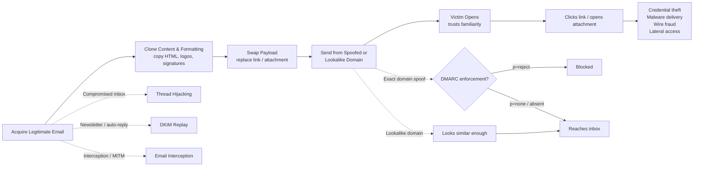
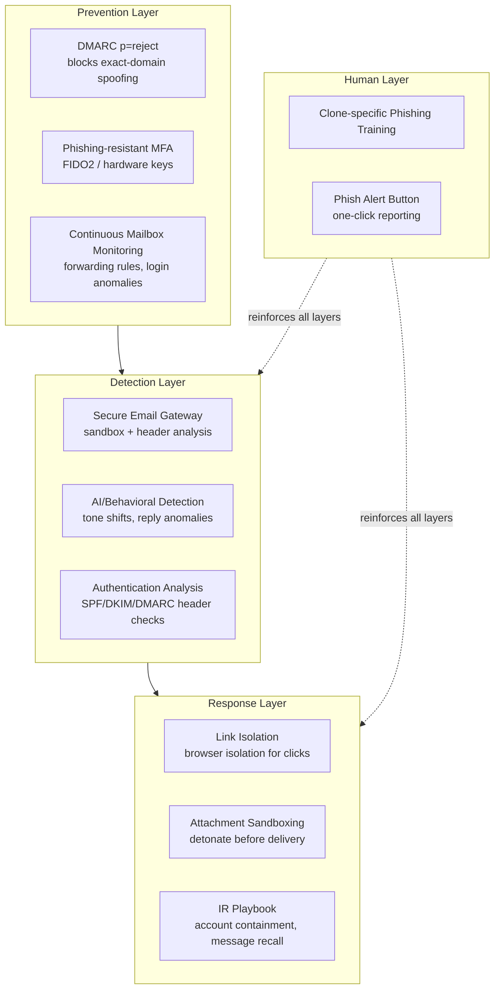

# Clone Phishing

## TCM Exam Objectives
- Define clone phishing as copying a legitimate email, swapping the payload, and sending from spoofed/lookalike/compromised source
- Distinguish clone phishing from spear phishing: clone starts with real email vs. spear builds from scratch using research
- Explain DKIM replay attacks: attacker replays a legitimate DKIM-signed message to new recipients — passes all authentication checks
- Describe thread hijacking: attacker with compromised mailbox inserts malicious reply into an active trusted conversation
- Analyze header-level indicators: Message-ID domain mismatch, Received path anomalies, In-Reply-To/References header irregularities
- Compare the three acquisition paths (compromised inbox, triggered auto-email, interception) and three delivery paths (exact-domain spoof, lookalike, compromised mailbox)
- Implement DMARC p=reject to block exact-domain spoofing; pair with lookalike domain monitoring for homoglyph detection
- Recognize why clone phishing bypasses traditional training: no typos, odd senders, or generic red flags — requires clone-specific simulations
Clone phishing is a targeted social engineering attack in which the attacker obtains a legitimate email the recipient has already seen — or an active thread they're already participating in — creates a near-identical copy, and swaps in a malicious link, attachment, or payload, exploiting pre-existing trust rather than fabricating it from scratch.【turn1fetch0】【turn2fetch1】 What makes clone phishing distinct from spear phishing is the source material: spear phishing builds a convincing message from scratch using research, whereas clone phishing *starts with something real* and makes it dangerous by replacing the payload.【turn3fetch0】 In 2024, businesses received over 400 million unwanted or malicious emails from attackers bypassing MFA and hijacking internal threads — and clone-style attacks are an increasing share of that volume.【turn1fetch0】

📌 **Exam Tip:** Clone phishing's #1 exam distinction: it *starts with a real email* and swaps the payload. Spear phishing *builds from scratch*. A DKIM replay attack can pass ALL authentication checks (SPF, DKIM, DMARC) because the original signature is cryptographically valid. This is why authentication alone cannot detect clone phishing — you need header forensics and behavioral analysis.

## The Clone Phishing Attack Flow

Clone phishing is rarely the first step in an attack — it's typically the second or third move, after the attacker has already gained access to either a compromised mailbox, an intercepted email, or a legitimate automated email they triggered themselves.【turn2fetch0】 The flow follows a predictable pattern from acquisition through weaponization to delivery.

The dotted lines show the three acquisition paths and the two delivery paths. The attack's success hinges on which path the attacker takes: exact-domain spoofing is blocked by DMARC enforcement, but lookalike domains and DKIM replay bypass it entirely.【turn4fetch0】

## Master Comparison: Clone Phishing Across Dimensions

| Dimension | Clone Phishing | Spear Phishing | Standard Phishing |
|---|---|---|---|
| **Source material** | Real email the recipient has seen | Built from scratch using OSINT research | Generic template |
| **Trust mechanism** | Familiarity — exploits existing trust in the original message | Personalization — uses target's name, role, context | Volume — enough people fall for it |
| **Payload insertion** | Link/attachment swapped into copied content | Crafted lure with malicious element | Generic malicious link/attachment |
| **Sender address** | Spoofed or lookalike domain of trusted sender | Spoofed or lookalike, often personalized | Often obviously foreign or mass-mailed |
| **Typical context** | "Updated version," "resend," reply within active thread | New conversation with tailored pretext | Unprompted cold email |
| **Sophistication** | High — requires access to legitimate email | High — requires target research | Low — spray and pray |
| **Detection difficulty** | Very high — standard red flags absent | High | Low to moderate |
| **Common use case** | BEC, credential harvesting, malware delivery | BEC, targeted credential theft | Mass credential harvesting, malware distribution |

Sources: 【turn1fetch0】【turn3fetch0】

---

## How Clone Phishing Differs from Adjacent Attacks

**Clone phishing vs. spear phishing.** The key distinction is the source material. Spear phishing attackers research their target and build a convincing message from scratch. Clone phishing attackers start with something real — a genuine email the target may have already received — and make it dangerous by swapping the payload. Spear phishing *creates* trust through personalization; clone phishing *inherits* trust through replication.【turn3fetch0】

**Clone phishing vs. thread hijacking.** Thread hijacking is the most common clone phishing variant in BEC attacks. An attacker with mailbox access finds an active conversation and inserts themselves into the middle of it — no fake cold email, just a reply inside a real thread that people already trust. The attacker reads old conversations, learns tone, signatures, formatting, and even small habits like shortened names or reply timing, then drops in an "updated" invoice with different banking details or a weaponized attachment.【turn7fetch0】【turn8fetch0】 Clone phishing is the broader technique; thread hijacking is its application within an active conversation.

**Clone phishing vs. DKIM replay.** A DKIM replay attack is a specialized clone phishing variant where the attacker doesn't need to spoof the sender domain at all. They obtain a legitimate, DKIM-signed email from the target organization — by subscribing to a newsletter, opening a support ticket, or triggering any automated email — and replay that message to new recipients. Because the original DKIM signature is cryptographically valid, the replayed email passes DKIM authentication checks at the receiving server. Abnormal Security documented a campaign where threat actors leveraged this technique to deliver Google-branded phishing emails signed by Google's own domains — passing SPF, DKIM, and DMARC checks while delivering malicious content.【turn3fetch0】【turn9search8】【turn9search5】

---

## How Clone Phishing Works — The Attack Mechanics

### Step 1: Acquire the Legitimate Email

Three primary acquisition paths exist:

**Compromised inbox (thread hijacking).** The attacker gains mailbox access via phishing, infostealer malware, OAuth abuse, or session cookie theft. Once inside, they inherit months or years of conversation history and can map relationships, identify payment workflows, and learn communication patterns. Some crews sit quietly and watch threads for days before sending anything because timing matters more than speed.【turn7fetch0】【turn8fetch0】

**Triggered automated email (DKIM replay).** The attacker subscribes to a newsletter, opens a support ticket, or triggers any automated email from the target organization. They receive a legitimate, DKIM-signed message that they can then replay to other targets. Because the signature is valid, the replayed message passes authentication checks.【turn3fetch0】【turn9search8】

**Interception.** Less common but documented: the attacker intercepts email in transit via compromised infrastructure or man-in-the-middle positioning, then clones and forwards the modified version.

### Step 2: Clone the Content

The attacker copies the email's HTML, branding, logos, signatures, and formatting — often a simple copy-paste into a compose window preserves the styling. The goal is a message that is nearly indistinguishable from the original at a glance.【turn3fetch0】

### Step 3: Swap the Payload

The attacker replaces the legitimate link or attachment with a malicious one. Common swaps: a link pointing to a credential-harvesting page, a weaponized attachment, an updated invoice with different banking details, or a QR code leading to a fake login page.【turn3fetch0】【turn9search10】

### Step 4: Send from a Trusted-Looking Source

The attacker sends the cloned email from either:
- **An exact-domain spoof** (support@valimail.com) — blocked by DMARC enforcement at p=reject【turn4fetch0】
- **A lookalike domain** (valinnail.com — replacing 'm' with 'nn') — bypasses DMARC because the domain is legitimately registered by the attacker【turn3fetch0】
- **A compromised legitimate mailbox** — passes all authentication because the sending infrastructure is genuinely the victim's【turn7fetch0】

---

## Header-Level Anomalies and Email Authentication's Role

Clone phishing detection at the technical level relies on email header forensics and authentication analysis. Because the visible email body may be pixel-perfect, defenders must look at the metadata.

### Key Header Fields to Analyze

**Message-ID.** A unique identifier added by the mail server that processes the email, typically formatted as a date/time stamp followed by the sender's domain name (e.g., `CAF4Ths+hsd84G9sedaD@mail.gmail.com`). If the sender domain in the `From:` field does not match the Message-ID domain, you may be dealing with a spoofed message. Duplicate Message-IDs across different emails, or a Message-ID that doesn't match the claimed sender's infrastructure, are strong clone phishing indicators.【turn9search0】

**Received headers.** Trace the email's routing path through mail servers. Clone phishing emails often reveal a routing path inconsistent with the claimed sender's legitimate infrastructure — a spoofed Google email arriving from an unknown IP range, for example.【turn0search16】【turn9search3】

**Authentication-Results header.** The definitive record of SPF, DKIM, and DMARC check outcomes. A clone phishing email that spoofs a DMARC-protected domain will show `fail` in the Authentication-Results header. However, a DKIM replay attack will show `pass` — which is why authentication alone cannot catch all clone phishing.【turn5search7】【turn9search8】

**In-Reply-To and References.** For thread hijacking attacks, these headers should reference legitimate prior Message-IDs in the thread. Anomalies — a reply appearing in a thread without prior internal discussion, or References pointing to non-existent messages — indicate thread injection.【turn2fetch0】

📌 **Exam Tip:** Know the three acquisition paths for clone phishing: (1) **Compromised inbox** — attacker steals mailbox credentials and reads active threads, (2) **DKIM replay** — attacker subscribes to a newsletter or triggers auto-reply, then replays the DKIM-signed message to new targets, (3) **Interception** — MITM on email in transit. The compromised inbox path is the most dangerous because the email comes from a REAL trusted account within a REAL active thread.

```mermaid
flowchart LR
    subgraph ACQ[Acquisition Paths]
        A1[Compromised Inbox<br/>via phishing / infostealer]
        A2[Triggered Auto-Email<br/>subscribe to newsletter]
        A3[Interception<br/>MITM on email transport]
    end
    
    subgraph AUTH[Authentication Impact]
        B1[Compromised: PASSES all auth<br/>Real account, real domain]
        B2[DKIM Replay: PASSES all auth<br/>Original signature valid]
        B3[Interception: FAILS auth<br/>unless attacker re-signs]
    end
    
    subgraph DEL[Delivery Paths]
        C1[Exact-domain spoof<br/>BLOCKED by DMARC p=reject]
        C2[Lookalike domain<br/>PASSES auth - attacker's domain]
        C3[Compromised mailbox<br/>PASSES all - real account]
    end
    
    ACQ --> AUTH
    AUTH --> DEL
    DEL --> INBOX[Lands in victim inbox]
```

### The Authentication Layer's Role

**SPF** verifies the sending IP against the domain's authorized sender list. Clone phishing from a spoofed domain fails SPF; clone phishing from a lookalike domain passes SPF (because the lookalike domain is legitimately the attacker's).【turn0search22】

**DKIM** cryptographically signs message content. A modified clone (where the attacker changed the link) breaks the DKIM signature and fails authentication. An unmodified DKIM replay passes because the original signature remains valid.【turn3fetch0】【turn9search5】

**DMARC** ties SPF and DKIM to the visible `From:` domain through alignment, and provides policy enforcement (p=none/quarantine/reject). At p=reject, exact-domain spoofing is blocked entirely. DMARC does *not* stop lookalike domain attacks or DKIM replay — those require additional controls.【turn4fetch0】

---

## Real-World Attack Patterns

### Pattern 1: BEC Invoice Fraud via Thread Hijacking

The most financially damaging clone phishing pattern. An attacker compromises a vendor or finance mailbox, waits for a procurement or payment thread, then drops in an "updated" invoice with different banking details. Sometimes the only change is a single account number buried in a PDF nobody compares closely. The attacker watches the payment approval process long enough to understand who signs off, who usually replies last, and when finance teams are busiest, then steps in near the end of the thread with an urgent update: "Use this account instead."【turn8fetch0】 BEC attacks resulted in approximately $2.9 billion in reported losses in the US, with an average loss per incident of $137,000.【turn0search10】

### Pattern 2: DKIM Replay Against Major Brands

Documented in 2024: threat actors obtained legitimate, DKIM-signed emails from Google's own infrastructure (by triggering automated notifications) and replayed them to new targets. The emails passed SPF, DKIM, and DMARC because the original signatures were valid. The attackers delivered Google-branded phishing emails that landed in inboxes and appeared completely legitimate. EasyDMARC documented a similar case where a victim received a convincing email claiming a law enforcement subpoena for their Google Account — appearing to come from a legitimate Google no-reply address because the DKIM signature was genuine.【turn9search8】【turn9search6】

### Pattern 3: Clone Phishing with QR Codes (Quishing)

Since late 2024, attackers have been embedding phishing URLs into QR codes within cloned documents — a technique called quishing. The cloned email appears to be a legitimate document (invoice, HR form, internal memo) asking the recipient to scan a QR code to "access" the file. The QR code leads to a fake login page designed to steal credentials. Unit 42 researchers observed attackers using legitimate websites' redirection mechanisms and Cloudflare Turnstile for user verification to evade security crawlers. In 2025, 12% of all phishing attacks contained a QR code, with 68% specifically targeting mobile users.【turn9search10】【turn9search9】【turn9search13】

### Pattern 4: AI-Enhanced Clone Phishing

By Q2 2024, approximately 40% of BEC phishing emails were flagged as AI-generated content. Generative AI has changed the economics: campaigns that previously required days of research per target can now be automated across thousands of targets simultaneously, with personalized content that exploits publicly available information from LinkedIn, social media, and corporate websites. Clone phishing benefits disproportionately because AI can perfectly replicate the tone, formatting, and writing style of the original legitimate sender once it has a sample.【turn0search12】【turn0search10】

---

## Defense-in-Depth Strategy

No single control stops clone phishing because the attack bypasses different controls depending on the variant. The mature strategy layers technical, authentication, and human controls.

### DMARC Enforcement (p=reject)

The single highest-impact control against exact-domain clone phishing. At p=reject, any email that fails authentication is blocked before it reaches the recipient's inbox, eliminating the most common clone phishing vector: exact-domain impersonation. An attacker who clones a legitimate email and sends it from the spoofed domain is blocked entirely. DMARC does not stop lookalike domain attacks, but it closes the exact-domain spoofing gap. Pair DMARC enforcement with domain monitoring to catch lookalike registrations before they're used in an attack.【turn4fetch0】

### Phishing-Resistant MFA

MFA matters, but attackers increasingly steal browser sessions after login instead of brute-forcing passwords. Hardware-backed MFA (FIDO2, hardware security keys) makes session replay and phishing kits harder to use successfully because the authentication is bound to the legitimate origin.【turn8fetch0】

### Continuous Mailbox Monitoring

Attackers sitting inside mailboxes tend to create forwarding rules, monitor finance conversations, and reply from unusual locations or devices. Those changes are often easier to spot than the malicious email itself. SOC teams monitor for impossible travel logins, sudden inbox forwarding rules, abnormal reply volume, changes to payment discussions, dormant accounts becoming active, and unusual OAuth consent activity.【turn8fetch0】

### Link Isolation and Attachment Sandboxing

Even legitimate conversations can become dangerous after a mailbox gets compromised. Link isolation (browser isolation for clicked links) and attachment sandboxing (detonating attachments in an isolated environment before delivery) catch malicious payloads that bypass content inspection. Proofpoint's TAP rewrites every URL in every email and detonates every attachment in a sandbox before delivery.【turn0search29】【turn8fetch0】

### Clone-Specific Phishing Training

Traditional security awareness training fails against clone phishing because it focuses on suspicious subject lines, odd senders, or obvious spelling errors — red flags that clone phishing deliberately avoids. Effective training uses realistic clone phishing simulations that mimic true-to-life attack variants, tailored by department, seniority, and historical behavior. Employees should be trained to verify unexpected "resends" or "updates" through out-of-band channels before acting.【turn2fetch0】

---

## Detection Checklist for SOC Analysts

When triaging a suspected clone phishing email, work through these checks systematically:

**Header-level forensics:**
- Does the Message-ID domain match the `From:` domain?【turn9search0】
- Do the Received headers show a routing path consistent with the claimed sender's infrastructure?
- What does the Authentication-Results header show for SPF, DKIM, and DMARC?【turn5search7】
- For replies: do the In-Reply-To and References headers point to legitimate prior messages in the thread?【turn2fetch0】

**Sender verification:**
- Is the sender domain an exact match, or a lookalike (homoglyph, double letters, different TLD)?【turn3fetch0】
- Does the visible `From:` address align with the Return-Path and HELO domains?【turn0search16】
- Is the sender a known contact, and does the sending pattern match their historical behavior?

**Content analysis:**
- Does the email reference a prior message or thread the recipient actually participated in?
- Are there mismatched hyperlinks — display text pointing to one domain while the actual URL points elsewhere?【turn2fetch1】
- Is there a sense of urgency or pressure to act without verification?【turn2fetch1】
- Does the email contain a QR code asking the recipient to scan for access?【turn9search10】

**Behavioral context:**
- Is this reply appearing in a thread without prior internal discussion?【turn2fetch0】
- Has the sender's mailbox shown anomalous activity — impossible travel logins, new forwarding rules, after-hours access?【turn8fetch0】
- Does the request involve updated banking details, payment rerouting, or urgent invoice replacement within an existing conversation?【turn8fetch0】

---

## Common Pitfalls

**Relying on DMARC alone.** DMARC enforcement blocks exact-domain spoofing but does nothing against lookalike domains or DKIM replay attacks. A p=reject policy is necessary but not sufficient.【turn4fetch0】【turn9search8】

**Trusting authentication pass results.** A DKIM replay email passes SPF, DKIM, and DMARC because the original signature is valid. "Authentication passed" does not equal "safe" — defenders must correlate authentication results with behavioral and content analysis.【turn9search8】【turn9search5】

**Training users on outdated red flags.** Clone phishing deliberately eliminates the typos, odd senders, and obvious spam indicators that traditional training teaches users to spot. Training programs that don't include clone-specific scenarios leave users unprepared for the attacks they're most likely to encounter.【turn2fetch0】

**Ignoring QR codes.** Quishing attacks bypass link scanners because the malicious URL is embedded in an image, not in the email body as a clickable link. Email security tools that inspect URLs but not QR code images miss this vector entirely.【turn9search10】

**Missing compromised mailbox indicators.** Thread hijacking attacks succeed because the sending mailbox is genuinely compromised — the email comes from the real account, passes all authentication, and appears in an active thread. Defenders who focus only on inbound email content miss the account takeover signals (forwarding rules, impossible travel, abnormal reply volume) that precede the malicious reply.【turn8fetch0】

---

## Recap

Clone phishing is a targeted attack that copies a legitimate email the recipient has already seen, swaps in a malicious payload, and resends it from a spoofed, lookalike, or compromised sender — exploiting pre-existing trust rather than fabricating it.【turn1fetch0】【turn2fetch1】 Its three acquisition paths (compromised inbox, DKIM replay, interception) and three delivery paths (exact-domain spoof, lookalike domain, compromised mailbox) determine which defenses it bypasses: DMARC enforcement blocks exact-domain spoofing but not lookalikes or replay; authentication checks pass DKIM replay but not modified clones; behavioral detection catches thread hijacking but not external lookalike attacks.【turn3fetch0】【turn4fetch0】【turn9search8】 Detection requires header forensics (Message-ID domain mismatch, Received path anomalies, Authentication-Results analysis, In-Reply-To validation) combined with behavioral context (impossible travel, forwarding rules, reply volume spikes, payment detail changes) because the visible email body may be pixel-perfect.【turn9search0】【turn8fetch0】 The defense stack layers DMARC p=reject, phishing-resistant MFA, continuous mailbox monitoring, link isolation, attachment sandboxing, and clone-specific user training — with the understanding that no single layer catches every variant, and the most damaging attacks (BEC invoice fraud via thread hijacking, DKIM replay against major brands) are the ones that bypass the most controls simultaneously.【turn4fetch0】【turn8fetch0】【turn9search8】