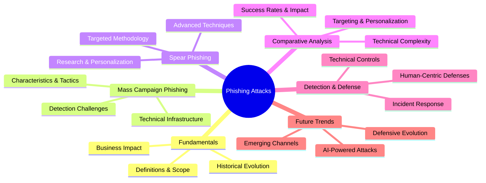
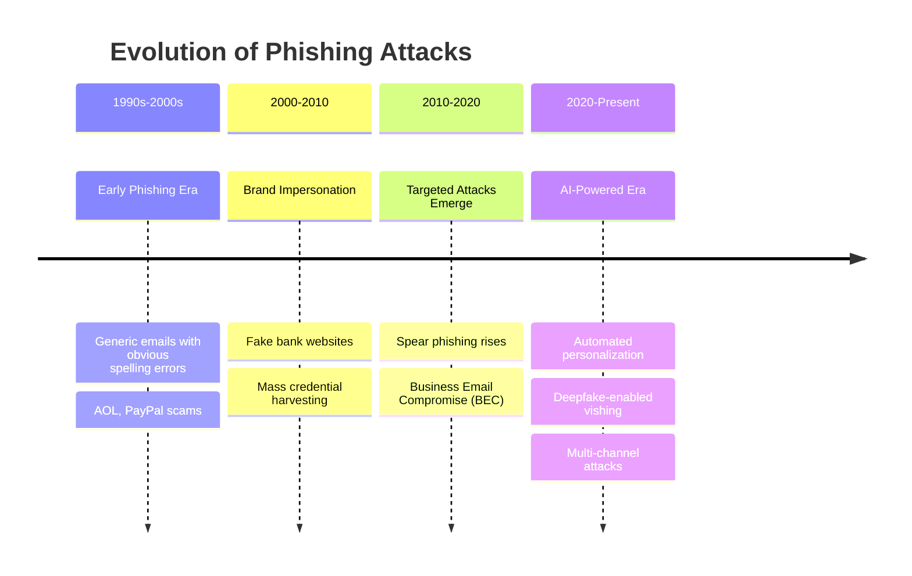
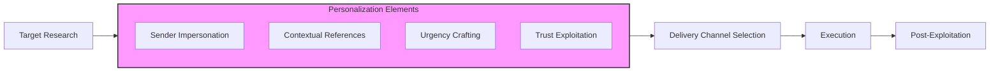
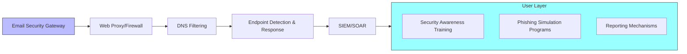
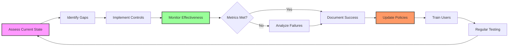

# Mass Campaign Phishing vs. Spear Phishing

## TCM Exam Objectives
- Compare mass campaign phishing (broad, untargeted, low per-incident cost, high volume) vs. spear phishing (targeted, personalized, high per-incident cost, lower volume)
- Explain OSINT reconnaissance techniques for spear phishing: LinkedIn, corporate websites, breach data correlation, conference presentations
- Describe Business Email Compromise (BEC), conversation hijacking, deepfake vishing as advanced spear phishing variants
- Analyze the attack lifecycle differences: mass phishing = generic lure → spray → harvest, spear phishing = research → personalize → deliver → exploit
- Identify threat actor profiles: mass phishing attracts cybercriminals and script kiddies; spear phishing is used by APTs and organized crime
- Implement technical controls for both: email security gateways, SPF/DKIM/DMARC enforcement, URL sandboxing, behavioral analytics
- Apply human-centric defenses: role-based phishing simulations, contextual indicators training, out-of-band verification protocols
- Recognize why spear phishing has higher detection difficulty: uses legitimate context, avoids generic red flags, exploits real relationships



📌 **Exam Tip:** The key exam distinction: mass phishing = volume-based (0.1-1% success rate, low per-incident cost); spear phishing = precision-based (5-15% success rate, high per-incident cost). Know that spear phishing uses OSINT from LinkedIn, corporate websites, and breach data to personalize lures. BEC is a variant of spear phishing targeting finance teams with executive impersonation — $2.9B in reported US losses annually.

```mermaid
flowchart TD
    ATTACKER[Attacker] --> STRATEGY{Which attack type?}
    
    STRATEGY -->|Mass Phishing| MASS[Cast wide net]
    STRATEGY -->|Spear Phishing| SPEAR[Aim at specific target]
    
    MASS --> MASS1[Buy/rent email list]
    MASS --> MASS2[Create generic template<br/>"Your account has been compromised"]
    MASS --> MASS3[Send to 1M+ recipients]
    MASS --> MASS4[0.1-1% success → 1K-10K victims]
    MASS --> PROFIT1[Monetize via credential sales,<br/>malware installs, gift card fraud]
    
    SPEAR --> SP1[OSINT reconnaissance<br/>LinkedIn, corp website, breach data]
    SP1 --> SP2[CEO name: John Smith<br/>Org structure: reports to CFO<br/>Active project: acquisition of ABC Corp]
    SP2 --> SP3[Craft personalized lure<br/>"John asked me to send you<br/>the Q4 M&A documents"]
    SP3 --> SP4[Send to 10-50 targeted individuals]
    SP4 --> SP5[5-15% success → wire transfer,<br/>data exfiltration, APT foothold]
    SP5 --> PROFIT2[$137K average BEC loss<br/>$50M+ for major whaling incidents]
    
    style MASS fill:#9cf,stroke:#333
    style SPEAR fill:#f9f,stroke:#333
    style PROFIT1 fill:#f96,stroke:#333
    style PROFIT2 fill:#f96,stroke:#333
```

## 1. 🧠 Fundamentals: Understanding the Phishing Landscape

### 1.1 Defining the Attack Vectors

**Mass Campaign Phishing** (often simply called "phishing") is a **broad, untargeted approach** where attackers send fraudulent communications to a large audience, hoping to trick a small percentage into clicking malicious links, downloading malware, or revealing sensitive information 【turn0search5】【turn0search14】. These attacks typically use generic lures and rely on volume rather than personalization.

**Spear Phishing** is a **highly targeted form of phishing** where attackers carefully select specific individuals or organizations and craft personalized messages using gathered intelligence 【turn0search1】【turn0search11】. The name derives from the metaphor of a spear fisher targeting a specific fish rather than casting a wide net 【turn0search2】.

> 💡 **Key Insight**: While mass phishing might affect more individuals overall, spear phishing typically results in higher per-incident losses due to its precision and the value of targeted assets 【turn0search1】.

### 1.2 Historical Context & Evolution
Phishing attacks have evolved from obvious "Nigerian prince" scams to sophisticated, AI-powered campaigns 【turn0search5】. The timeline below illustrates this evolution:



### 1.3 Business Impact & Cost Considerations
Both attack types impose significant costs, but their impact profiles differ:

| Aspect | Mass Campaign Phishing | Spear Phishing |
|--------|------------------------|----------------|
| **Frequency** | High volume, low success rate | Lower volume, higher success rate |
| **Per-Incident Cost** | Generally lower | Substantially higher 【turn0search1】 |
| **Typical Impact** | Credential theft, malware distribution | Financial fraud, data exfiltration, APT entry 【turn0search5】【turn0search6】 |
| **Remediation Complexity** | Moderate (often automated) | High (often requires forensic investigation) |
| **Reputational Damage** | Moderate (affects many users minimally) | Severe (affects specific individuals/organizations deeply) |

## 2. 🎯 Mass Campaign Phishing: Deep Dive

### 2.1 Characteristics & Tactics
Mass phishing campaigns share several common characteristics:

<details>
<summary>📊 Technical Infrastructure of Mass Phishing</summary>

#### **Email Infrastructure**
- **Compromised Accounts**: Attackers often use stolen email credentials to send phishing from legitimate accounts
- **Bulletproof Hosting**: Infrastructure hosted in jurisdictions with lenient cybercrime laws
- **Fast Flux Domains**: Rapidly changing IP addresses and domains to avoid blacklisting
- **Botnets**: Distributed sending infrastructure to avoid rate limits and detection

#### **Content Characteristics**
- **Generic Greetings**: "Dear Customer" rather than personalized names
- **Urgency Triggers**: False claims of account suspension, security breaches, or limited-time offers
- **Brand Mimicry**: Logos and styling copied from legitimate companies but often with subtle errors
- **Malicious Payloads**: Links to credential harvesting pages or malware attachments

#### **Delivery Mechanisms**
- **Email**: Primary vector but increasingly combined with SMS (smishing) and voice (vishing)
- **Social Media**: Direct messages and posts on platforms like LinkedIn, Facebook
- **Compromised Websites**: Legitimate sites injected with malicious scripts or redirects
</details>

### 2.2 Common Attack Examples
Mass phishing typically takes these forms:

1. **Account Verification Scams**: Emails claiming to be from banks, social media, or software providers requesting login verification
2. **Package Delivery Notices**: Fake shipping notifications with malicious links
3. **Tax Season Scams**: fraudulent tax refund or audit messages
4. **Tech Support Scams**: Pop-ups or emails claiming computer infection
5. **Charity Scams**: Fake donation requests after natural disasters

### 2.3 Detection Challenges
Mass phishing presents unique detection challenges:

- **Volume Overload**: Security teams face thousands of similar alerts
- **Evasion Techniques**: Attackers constantly rotate infrastructure and tactics
- **False Positives**: Legitimate emails may trigger filters, causing user frustration
- **Zero-Day Domains**: Newly registered domains used for short campaigns

## 3. 🎯 Spear Phishing: Deep Dive

📌 **Exam Tip:** OSINT sources for spear phishing are frequently tested. Know these specific sources: **LinkedIn** (job titles, reporting structure, recent posts), **SEC filings** (M&A activity, financial details), **corporate website** (org chart, news, events), **conference presentations** (speaker bios, tech stack), **breach data** (previously leaked passwords). Attackers combine these to create contextually perfect lures that reference real projects and real people.

### 3.1 Targeted Methodology & Research
Spear phishing success depends on thorough target research 【turn0search6】. Attackers typically gather information from:

<details>
<summary>🔍 OSINT (Open-Source Intelligence) Gathering Techniques</summary>

#### **Social Media Reconnaissance**
- **LinkedIn**: Job titles, responsibilities, connections, recent posts
- **Twitter/X**: Personal interests, location, activities
- **Facebook/Instagram**: Personal details, family information, locations
- **Corporate Websites**: Organizational structure, recent news, partnerships

#### **Technical Footprinting**
- **DNS Records**: Identifying mail servers and infrastructure
- **WHOIS Lookups**: Domain registration information
- **Job Postings**: Revealing technology stack and organizational needs
- **Conference Presentations**: Speaker bios and presentation topics

#### **Breach Data Correlation**
- **Credential Leaks**: Using passwords from previous breaches
- **Personal Information**: Combining data from multiple breaches
- **Dark Web Monitoring**: Purchasing targeted intelligence packages

#### **Physical Surveillance**
- **Parking Lot Observation**: Identifying vehicle types and schedules
- **Dumpster Diving**: Finding discarded documents
- **Social Engineering**: Pretexting calls to gather information
</details>

### 3.2 Personalization Techniques
Armed with target intelligence, spear phishers craft highly personalized messages:



**Common Personalization Elements Include**:
- **Sender Impersonation**: Spoofing display names and creating lookalike domains
- **Contextual References**: Mentioning recent projects, conferences, or company news
- **Urgency Crafting**: Creating time-sensitive scenarios requiring immediate action
- **Trust Exploitation**: Leveraging relationships with colleagues, partners, or vendors

### 3.3 Advanced Spear Phishing Techniques
Beyond basic email, spear phishing utilizes multiple channels and techniques:

| Technique | Description | Example | Detection Difficulty |
|-----------|-------------|---------|---------------------|
| **Business Email Compromise (BEC)** | Impersonating executives for fraudulent transfers | CEO requesting urgent wire transfer | High |
| **Conversation Hijacking** | Infiltrating existing email threads | Replying to an ongoing discussion with malicious link | Very High |
| **Extortion** | Threatening to release sensitive information | "I have your browsing history" emails | Medium |
| **Deepfake Vishing** | AI-generated voice messages | CEO's voice authorizing payment | Extremely High |
| **QR Code Phishing** | Malicious QR codes in physical locations | Fake parking meter QR codes | High |

## 4. ⚖️ Comparative Analysis: Mass vs. Spear Phishing

### 4.1 Key Differences Matrix

| Aspect | Mass Campaign Phishing | Spear Phishing |
|--------|------------------------|----------------|
| **Targeting** | Broad, untargeted 【turn0search14】 | Specific individuals or organizations 【turn0search1】 |
| **Personalization** | Generic content | Highly personalized using gathered intelligence 【turn0search6】 |
| **Research Effort** | Minimal to none | Extensive OSINT and reconnaissance 【turn0search6】 |
| **Success Rate** | Low (0.1-1%) but high volume | Higher (5-15%) but lower volume |
| **Technical Complexity** | Moderate (automated tools) | High (manual crafting) |
| **Infrastructure** | Often compromised or bulletproof hosting | More sophisticated, sometimes using legitimate services |
| **Primary Goal** | Credential harvesting, malware distribution | Financial fraud, data exfiltration, APT entry 【turn0search5】 |
| **Detection Difficulty** | Moderate (signature-based possible) | High (behavioral analysis required) |
| **Remediation** | Often automated blocking | Manual investigation required |

### 4.2 Attack Lifecycle Comparison

```mermaid
flowchart TD
    subgraph Mass Phishing
        A1[Create Generic Lure] --> A2[Send Mass Campaign]
        A2 --> A3[Wait for Bites]
        A3 --> A4[Harvest Credentials]
        A4 --> A5[Monetize Stolen Data]
    end
    
    subgraph Spear Phishing
        B1[Target Research] --> B2[Craft Personalized Lure]
        B2 --> B3[Deliver via Appropriate Channel]
        B3 --> B4[Exploit Trust]
        B4 --> B5[Execute Attack Goal]
        B5 --> B6[Maintain Access<br>if needed]
    end
    
    style A1 fill:#bbf,stroke:#333
    style B1 fill:#f9f,stroke:#333
    style B5 fill:#f96,stroke:#333
```



### 4.3 Threat Actor Profiles
Different threat actors typically specialize in each attack type:

<details>
<summary>👥 Threat Actor Specialization</summary>

#### **Mass Phishing Actors**
- **Cybercriminal Groups**: Organized crime syndicates with automated infrastructure
- **Script Kiddies**: Less sophisticated actors using pre-built phishing kits
- **Hacktivists**: Using phishing for ideological rather than financial reasons
- **State-Sponsored**: Broad intelligence gathering operations

#### **Spear Phishing Actors**
- **Advanced Persistent Threats (APTs)**: Nation-state actors targeting specific sectors
- **Organized Crime**: Specialized groups focusing on high-value targets
- **Disgruntled Insiders**: Current or former employees with inside knowledge
- **Mercenary Hackers**: Hired by competitors or nation-states

**Attribution Challenges**:
- Mass phishing infrastructure is often shared among multiple actors
- Spear phishing may be false-flag operations to mislead attribution
- Both may use similar tools but with different operational security
</details>

## 5. 🛡️ Detection & Defense Strategies

### 5.1 Technical Controls Architecture



<details>
<summary>⚙️ Technical Control Implementation Details</summary>

#### **1. Email Security Gateways**
- **Content Analysis**: Machine learning models for phishing pattern detection
- **Sender Authentication**: SPF, DKIM, DMARC enforcement 【turn0search13】
- **URL Rewriting**: Time-of-click URL analysis with sandboxing
- **Attachment Detonation**: Safe analysis of email attachments
- **Brand Protection**: Detecting logos and styling mimicry

#### **2. Web Proxies & Firewalls**
- **Category-based Filtering**: Block known phishing categories
- **SSL Inspection**: Decrypt and analyze HTTPS traffic
- **Real-time URL Analysis**: Cloud-based reputation checking
- **JavaScript Sanitization**: Remove obfuscated code
- **Form Action Monitoring**: Detect credential exfiltration attempts

#### **3. DNS Filtering Solutions**
- **Sinkholing**: Redirect malicious domains to controlled endpoints
- **Geo-blocking**: Block traffic to high-risk countries
- **DNS Tunneling Detection**: Identify data exfiltration via DNS
- **Response Policy Zones (RPZ)**: Implement DNS firewall rules

#### **4. Endpoint Detection & Response (EDR)**
- **Browser Process Monitoring**: Track URL navigation and form submissions
- **Memory Scraping Detection**: Identify credential theft in memory
- **Script Logging**: Record JavaScript execution for analysis
- **Network Connection Analysis**: Correlate URL access with C2 patterns

#### **5. SIEM/SOAR Integration**
- **Correlation Rules**: Detect phishing patterns across multiple data sources
- **Threat Intelligence Integration**: Real-time IOC feeds
- **Automated Response**: Contain affected accounts and systems
- **Case Management**: Track investigation and remediation
</details>

### 5.2 Human-Centric Defenses

<details>
<summary>🎓 Comprehensive Security Awareness Framework</summary>

#### **1. Phishing Recognition Training**
- **Visual Indicators**: Mismatched URLs, spelling errors, generic greetings
- **Technical Indicators**: Hover links before clicking, check for HTTPS
- **Contextual Indicators**: Unexpected emails, urgent requests, too good to be true
- **Brand Impersonation**: Verify sender domains, check official websites directly

#### **2. Simulation Programs**
- **Regular phishing simulations** with varied complexity
- **Role-based training** (finance, HR, executives)
- **Immediate feedback** for failed simulations
- **Metrics tracking** (click rates, reporting rates)

#### **3. Reporting Mechanisms**
- **Easy-to-use reporting buttons** in email clients
- **Clear escalation procedures** for suspected phishing
- **Feedback loop** to inform users about reported emails
- **Recognition** for accurate reporting

#### **4. Password Security Practices**
- **Unique passwords** for each account (password managers)
- **Multi-factor authentication** everywhere possible
- **Recognize phishing attempts** targeting MFA tokens
- **Secure password reset** procedures
</details>

### 5.3 Incident Response Playbooks

<details>
<summary>🚨 Incident Response Procedures</summary>

#### **Mass Phishing Response**
1. **Identify Scope**: Determine how many users received/clicked
2. **Contain**: Block malicious domains and senders
3. **Eradicate**: Remove malicious emails from mailboxes
4. **Recover**: Reset credentials if compromised
5. **Lessons Learned**: Update filters and training

#### **Spear Phishing Response**
1. **Forensic Investigation**: Determine attack vector and scope
2. **Account Isolation**: Immediately disable compromised accounts
3. **Data Exfiltration Analysis**: Determine what data was accessed
4. **Financial Recovery**: Work with banks if fraud occurred
5. **Legal/Regulatory Notification**: Comply with breach notification laws
6. **Post-Incident Review**: Improve defenses based on findings

#### **Key Metrics for Response**
- **Time to Detect**: How quickly the phishing was identified
- **Time to Respond**: How quickly containment actions were taken
- **Impact Scope**: Number of users/systems affected
- **Recovery Time**: How quickly normal operations resumed
</details>

## 6. 🚀 Future Trends & Emerging Threats

### 6.1 AI-Powered Phishing Evolution
Artificial intelligence is transforming both attack and defense capabilities:

<details>
<summary>🤖 The AI Arms Race in Phishing</summary>

#### **AI-Enhanced Attack Techniques**
1. **Generative Adversarial Networks (GANs)**: Create phishing pages that evade detection models
2. **Natural Language Generation**: Craft highly personalized phishing emails
3. **Reinforcement Learning**: Optimize redirect chains for maximum evasion
4. **Automated Favicon Generation**: Create unique favicons to avoid hash matching
5. **Dynamic Content Generation**: Real-time page generation based on victim profile

#### **AI-Powered Defense Mechanisms**
1. **Deep Learning Models**: Detect subtle patterns in email content and metadata
2. **Anomaly Detection**: Identify deviations from normal communication patterns
3. **Behavioral Biometrics**: Analyze mouse movements and interaction patterns
4. **Threat Intelligence Integration**: Real-time correlation with global threat feeds
5. **Adversarial Training**: Models specifically designed to resist evasion attempts

#### **The Detection Challenge**
- **AI vs AI**: Attackers use AI to evade detection, defenders use AI to detect
- **False Positives**: AI may flag legitimate emails with unusual characteristics
- **Model Drift**: Normal communication patterns change over time
- **Adversarial Examples**: Emails specifically crafted to evade ML models
</details>

### 6.2 Emerging Attack Channels
Phishing is expanding beyond email to new vectors:

| Channel | Attack Method | Detection Difficulty | Growth Rate |
|---------|---------------|---------------------|-------------|
| **SMS/Text (Smishing)** | Fake package delivery, security alerts | Medium | High |
| **Voice (Vishing)** | AI-generated voice impersonation | High | Very High |
| **Social Media DMs** | Targeted messages on LinkedIn, Facebook | Medium | High |
| **Collaboration Apps** | Slack, Teams messages with malicious links | Medium | Moderate |
| **QR Codes** | Physical QR codes in public spaces | High | Emerging |
| **Deepfake Video** | AI-generated video messages | Very High | Emerging |

### 6.3 Defensive Evolution
Defenses must evolve to address emerging threats:

<details>
<summary>🛡️ Next-Generation Defense Strategies</summary>

#### **1. Zero Trust Architecture**
- **Never Trust, Always Verify**: Continuous authentication for all access
- **Micro-segmentation**: Limit lateral movement if compromise occurs
- **Identity-Centric Security**: Focus on verifying user identity rather than network location

#### **2. Behavioral Analytics**
- **Baseline Establishment**: Learn normal user behavior patterns
- **Anomaly Detection**: Identify deviations indicating compromise
- **Continuous Authentication**: Verify identity throughout session, not just at login

#### **3. Threat Intelligence Platforms**
- **Real-time Feeds**: Instant updates on new phishing campaigns
- **IOC Sharing**: Industry collaboration on threat indicators
- **Predictive Analysis**: Anticipate attacker TTPs based on trends

#### **4. Security Orchestration, Automation & Response (SOAR)**
- **Playbook Automation**: Pre-defined responses to common phishing scenarios
- **Case Management**: Track investigation and remediation efforts
- **Integration**: Connect email, endpoint, and network security tools

#### **5. Cloud Email Security**
- **API-based Protection**: Integrate with cloud email providers
- **Advanced Threat Protection**: Machine learning and sandboxing
- **Information Barriers**: Prevent data exfiltration to external domains
</details>

## 7. 📊 Metrics & Continuous Improvement

### 7.1 Key Performance Indicators (KPIs)

<details>
<summary>📈 Comprehensive Metrics Framework</summary>

#### **Detection Metrics**
- **Phishing Email Volume**: Total phishing emails received per period
- **Detection Rate**: Percentage of phishing emails detected automatically
- **False Negative Rate**: Phishing emails that bypassed filters
- **False Positive Rate**: Legitimate emails incorrectly flagged as phishing

#### **Response Metrics**
- **Time to Detect**: How quickly phishing was identified
- **Time to Respond**: How quickly containment actions were taken
- **Time to Recover**: How quickly normal operations resumed
- **Recurrence Rate**: Percentage of similar phishing attempts recurring

#### **User-Centric Metrics**
- **Click Rate**: Percentage of users clicking on simulated phishing links
- **Reporting Rate**: Percentage of users reporting suspicious emails
- **Repeat Click Rate**: Users clicking multiple phishing simulations
- **Training Effectiveness**: Improvement in metrics over time

#### **Business Impact Metrics**
- **Cost per Incident**: Financial impact of each phishing incident
- **Downtime Reduction**: Decrease in system downtime from phishing
- **Data Breach Cost**: Financial impact of data exfiltrated via phishing
- **Reputation Impact**: Customer trust metrics following incidents
</details>

### 7.2 Continuous Improvement Cycle



## 8. 🎯 Conclusion & Strategic Recommendations

### 8.1 The Evolving Threat Landscape
Phishing remains one of the most prevalent and effective attack vectors, with **spear phishing** being particularly dangerous due to its targeted nature and high success rate. The rise of **AI-powered attacks** has made phishing more convincing and harder to detect, while the expansion to new channels like SMS, voice, and collaboration apps has increased the attack surface.

### 8.2 Defense in Depth is Essential
Organizations must implement layered defenses:
- **Technical controls** (email security, web proxies, DNS filtering, EDR)
- **Human-centric defenses** (awareness training, phishing simulations, reporting)
- **Incident response** (playbooks, forensic capabilities, recovery procedures)
- **Threat intelligence** (real-time feeds, industry sharing, predictive analysis)

### 8.3 Strategic Priorities for Organizations
Based on the current threat landscape, organizations should prioritize:

1. **AI-Powered Detection**: Invest in machine learning-based email security that can detect subtle patterns
2. **Multi-Factor Authentication**: Implement MFA everywhere, especially for email and financial systems
3. **Continuous Training**: Move from annual compliance training to continuous, adaptive education
4. **Threat Intelligence Integration**: Incorporate real-time threat feeds into security controls
5. **Incident Response Preparedness**: Regularly test and update incident response playbooks
6. **Zero Trust Architecture**: Adopt identity-centric security models that limit impact of credential compromise

### 8.4 Future Outlook
The phishing landscape will continue to evolve with:
- **More sophisticated AI** attacks that are increasingly difficult to distinguish from legitimate communications
- **Expansion to new channels** including AR/VR environments and IoT devices
- **Increased regulatory scrutiny** with stricter breach notification requirements
- **Greater emphasis on behavioral analytics** as signature-based defenses become less effective

> ⚠️ **Final Note**: The battle against phishing is not a technical problem to be solved, but an ongoing risk to be managed. Organizations must maintain vigilance, continuously improve defenses, and foster a culture of security awareness to protect against this persistent threat.

---

**📚 Additional Resources**:
- [CISA Phishing Guidance](https://www.cisa.gov/phishing)
- [Anti-Phishing Working Group](https://apwg.org/)
- [NIST SP 800-63B Digital Identity Guidelines](https://pages.nist.gov/800-63-3/sp800-63b.html)
- [SANS Security Awareness](https://www.sans.org/security-awareness-training/)
- [Proofpoint Threat Reference](https://www.proofpoint.com/us/threat-reference/spear-phishing)

*This lesson provides a comprehensive foundation for understanding and defending against mass campaign phishing and spear phishing. For specific implementation guidance, consult with cybersecurity professionals and refer to vendor documentation for your particular security stack.*