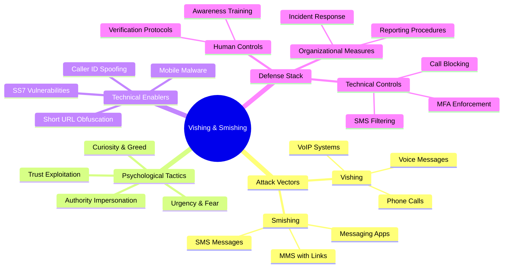
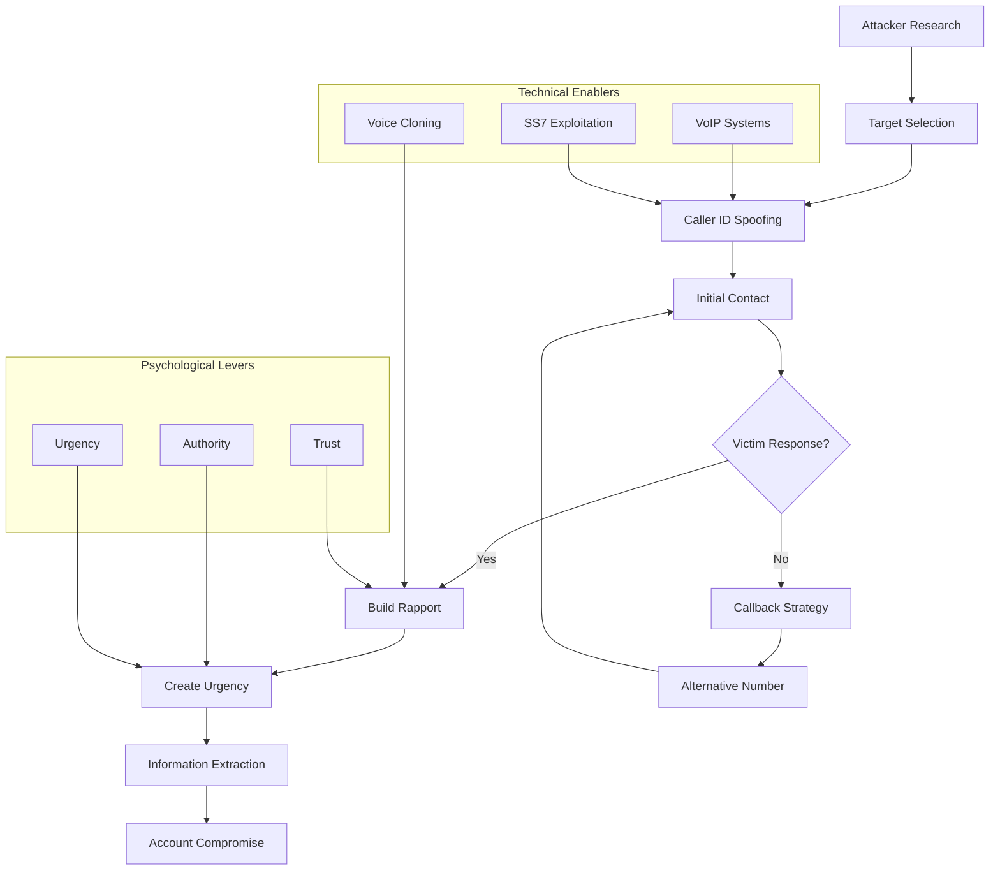
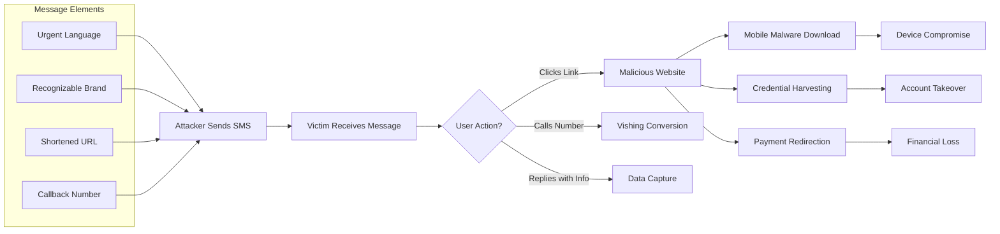
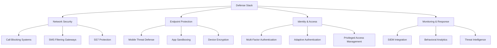

---
tags: [email-security]
---
# 📞 Full-Stack Lesson: Vishing & Smishing - Voice and SMS Phishing Attacks

## TCM Exam Objectives
- Define vishing (voice phishing using phone calls/VoIP) and smishing (SMS phishing using text messages) and how they bypass email security controls
- Explain SS7 vulnerabilities: call interception, SMS interception, location tracking, 2FA bypass — why telecom infrastructure is exploitable
- Describe caller ID spoofing mechanics: VoIP services, PBX compromise, and how STIR/SHAKEN protocols help verify call origin
- Compare vishing vs. smishing: real-time conversation adaptation vs. asynchronous text, 25% vs. 15% success rates, different psychological levers
- Identify AI-enhanced attacks: deepfake voice cloning for vishing, LLM-powered chatbots for automated conversation, 1,600% surge in deepfake vishing Q1 2025
- Recognize the multi-channel attack pattern: email reconnaissance → smishing initial contact → vishing conversion → mobile compromise
- Implement defense layers: SS7 firewalls, STIR/SHAKEN, mobile threat defense, callback verification protocols for financial transactions
- Train users on out-of-band verification: hang up and call the known official number, never use callback numbers from suspicious messages or caller ID
Vishing (Voice Phishing) and Smishing (SMS Phishing) represent sophisticated evolution of traditional phishing attacks, exploiting voice channels and mobile messaging to manipulate victims. These attacks leverage **human psychology** rather than technical vulnerabilities, making them particularly dangerous as they bypass traditional email security measures 【turn0search1】【turn0search3】.



## 🔍 2. Core Concepts: Understanding the Threat Landscape

### 2.1 What is Vishing?

Vishing (**Voice Phishing**) involves fraudulent phone calls or voice messages designed to trick victims into revealing sensitive information, transferring money, or downloading malware 【turn0search15】. Attackers use **voice manipulation** and **social engineering** to create a false sense of urgency or authority.

**Key Characteristics:**
- **Real-time Interaction**: Enables dynamic conversation adaptation
- **Emotional Manipulation**: Exploits fear, urgency, or helpfulness
- **Technical Exploitation**: Uses VoIP, caller ID spoofing, and SS7 vulnerabilities
- **Multi-channel Approach**: Often combines with email or SMS for credibility

### 2.2 What is Smishing?

Smishing (**SMS Phishing**) uses fraudulent text messages to trick individuals into sharing sensitive information, downloading malware, or visiting malicious websites 【turn0search17】【turn0search18】. The **intimate nature** of mobile messaging makes smishing particularly effective.

**Key Characteristics:**
- **High Open Rates**: SMS messages have 98% open rates vs. 20% for emails
- **Urgency Triggers**: Creates artificial time pressure
- **Link Obfuscation**: Uses URL shorteners and QR codes
- **Mobile-specific Attacks**: Targets mobile banking apps and payment systems

### 2.3 Comparative Analysis: Vishing vs. Smishing

| Aspect | Vishing (Voice Phishing) | Smishing (SMS Phishing) |
|--------|--------------------------|-------------------------|
| **Delivery Channel** | Phone calls, voice messages | SMS, MMS, messaging apps |
| **Interaction Type** | Real-time conversation | Asynchronous text exchange |
| **Trust Level** | Higher (voice creates authenticity) | Moderate (but intimacy of mobile) |
| **Technical Complexity** | Medium (requires VoIP setup) | Low (simple to execute) |
| **Detection Difficulty** | Hard (no text content to analyze) | Easier (can filter SMS content) |
| **Success Rate** | ~25% (voice creates urgency) | ~15% (lower than vishing) |
| **Primary Targets** | Elderly, executives, customer service | Mobile users, online banking customers |
| **Common Scenarios** | Bank fraud alerts, tech support | Package delivery, prize notifications |

📌 **Exam Tip:** SS7 vulnerabilities are a high-yield PSAA topic. SS7 is the signaling protocol that routes calls and SMS between telecom carriers. Attackers who gain SS7 access can: intercept SMS (including 2FA codes), redirect calls, track location. This is why SMS-based MFA is vulnerable — SS7 interception defeats it. STIR/SHAKEN is the protocol framework designed to combat caller ID spoofing on VoIP networks.

```mermaid
flowchart TB
    ATTACKER[Attacker] --> SS7_ACCESS[Gain SS7 Network Access]
    SS7_ACCESS --> INTERCEPT[Intercept SMS Messages]
    SS7_ACCESS --> REDIRECT[Redirect Incoming Calls]
    SS7_ACCESS --> LOCATION[Track Victim Location]
    
    INTERCEPT --> OTP[Capture OTP/2FA codes]
    OTP --> BYPASS[Bypass SMS-based MFA]
    BYPASS --> TAKEOVER[Account Takeover]
    
    REDIRECT --> CALL_REDIR[Victim calls go to<br/>attacker-controlled number]
    CALL_REDIR --> VISHING[Vishing attack<br/>from "bank" number]
    VISHING --> CRED[Credential harvest]
    
    subgraph DEFENSES[SS7 Defenses]
        D1[SS7 Firewall - monitor<br/>and block anomalous requests]
        D2[Use app-based MFA/TOTP<br/>instead of SMS]
        D3[STIR/SHAKEN for<br/>caller ID verification]
        D4[Network segmentation<br/>for signaling traffic]
    end
    
    SS7_ACCESS -.-> DEFENSES
```

## ⚔️ 3. Attack Mechanics: How Vishing and Smishing Work

### 3.1 Vishing Attack Flow



**Technical Execution:**
1. **Caller ID Spoofing**: Attackers manipulate caller ID to display legitimate numbers (banks, government agencies) 【turn0search0】
2. **SS7 Exploitation**: Vulnerabilities in Signaling System 7 allow interception of calls/SMS 【turn0search19】【turn0search20】
3. **Voice Cloning**: AI technology clones voices of authority figures for enhanced credibility
4. **VoIP Infrastructure**: Low-cost internet calling enables massive attack campaigns

### 3.2 Smishing Attack Flow



**Technical Execution:**
1. **SMS Gateway Exploitation**: Attackers use compromised or spoofed SMS gateways
2. **URL Obfuscation**: Shortened URLs hide malicious destinations
3. **Mobile Malware**: Links trigger downloads of banking trojans or spyware
4. **Callback Mechanisms**: SMS includes phone numbers for vishing conversion

## 🧠 4. Psychological Tactics: Exploiting Human Vulnerabilities

### 4.1 Cialdini's Six Principles in Voice/SMS Attacks

Both vishing and smishing exploit fundamental psychological principles 【turn0search6】:

| Principle | Vishing Implementation | Smishing Implementation |
|-----------|------------------------|-------------------------|
| **Reciprocity** | "I'm calling to help you" | "You've won a prize" |
| **Scarcity** | "Only 2 hours to prevent account closure" | "Limited time offer" |
| **Authority** | Impersonating IRS, bank, or police | Fake bank security alerts |
| **Consistency** | "You already confirmed your address" | "Continue your package delivery" |
| **Liking** | Using familiar names and local references | Impersonating friends or family |
| **Social Proof** | "Many customers have updated" | "Join thousands who claimed" |

### 4.2 Emotional Trigger Mechanisms

**Fear-Based Tactics:**
- "Your account will be suspended in 24 hours"
- "Legal action has been initiated against you"
- "Your SSN has been compromised"

**Urgency-Based Tactics:**
- "Immediate verification required"
- "Final notice before disconnection"
- "Limited-time offer expires today"

**Trust-Based Tactics:**
- "I'm calling from your bank's fraud department"
- "This is your grandson, I'm in trouble"
- "We're calling about your recent order"

## 🛡️ 5. Technical Attack Vectors & Infrastructure

### 5.1 SS7 Vulnerabilities and Exploitation

 

**Signaling System 7 (SS7)** vulnerabilities allow attackers to intercept calls and SMS messages, enabling sophisticated vishing and smishing campaigns 【turn0search19】【turn0search22】.

**Attack Capabilities:**
- **Call Interception**: Redirect incoming calls to attacker-controlled numbers
- **SMS Interception**: Receive authentication codes and messages
- **Location Tracking**: Determine victim's geographical location
- **Fraud Execution**: Bypass two-factor authentication systems

**Technical Exploitation Process:**
```python
# Simplified SS7 attack concept (not actual code)
def ss7_attack(target_number):
    # Step 1: Access SS7 network
    ss7_connection = establish_ss7_access()
    
    # Step 2: Intercept messages
    intercepted_sms = intercept_sms(target_number)
    
    # Step 3: Redirect calls
    redirect_calls(target_number, attacker_number)
    
    # Step 4: Harvest credentials
    credentials = extract_otp(intercepted_sms)
    
    # Step 5: Execute fraud
    execute_account_takeover(credentials)
```

### 5.2 Caller ID Spoofing Infrastructure

**Technical Methods:**
1. **VoIP Services**: Commercial VoIP providers allow number manipulation
2. **Spoofing Services**: Dedicated services for caller ID falsification
3. **Compromised PBX**: Hacked private branch exchange systems
4. **Mobile Apps**: Smartphone apps enabling caller ID changes

**Detection Challenges:**
- **Legitimate Use**: Same technology used by businesses for remote work
- **Technical Complexity**: Difficult to trace actual call origin
- **Jurisdiction Issues**: International calls complicate legal action

### 5.3 Mobile Malware Ecosystem

**Common Malware Types:**
- **Banking Trojans**: Overlay attacks on banking apps (Anubis, Cerberus)
- **SMS Interceptors**: Capture incoming messages (FakeInst, Opfake)
- **Credential Stealers**: Harvest login information (Joker, Bread)
- **Remote Access Trojans**: Full device control (Anubis, TeamSpy)

**Infection Vectors:**
- **Malicious Links**: SMS links to fake app stores
- **App Bundling**: Legitimate apps with hidden malware
- **Drive-by Downloads**: Automatic downloads from malicious sites
- **QR Codes**: Smishing via QR code links

## 📊 6. Real-World Attack Case Studies

### 6.1 Case Study 1: Bank Vishing Campaign

**Attack Scenario:**
1. **Target Selection**: Elderly customers of major banks
2. **Caller ID**: Displayed as bank's fraud department
3. **Social Engineering**: "Unauthorized transfer detected"
4. **Urgency**: "Account will be frozen in 1 hour"
5. **Action Required**: "Verify SSN and account details"
6. **Outcome**: $50,000+ stolen from multiple victims

**Psychological Levers Used:**
- **Authority**: Bank fraud department impersonation
- **Urgency**: Time-sensitive account freeze
- **Trust**: Familiar bank branding
- **Fear**: Financial loss threat

### 6.2 Case Study 2: Package Delivery Smishing

**Attack Scenario:**
1. **SMS Content**: "Package delivery failed, update address"
2. **Link**: Shortened URL to fake delivery service page
3. **Mobile Target**: Android devices with package tracking apps
4. **Malware**: Fake app installs SMS interceptor
5. **Outcome**: Banking credentials stolen, fraudulent transfers

**Technical Execution:**
- **URL Obfuscation**: bit.ly/2XyZ (redirects to malicious site)
- **App Cloning**: Fake DHL/FedEx app with malware
- **Permission Abuse**: Requests SMS read permissions
- **Data Exfiltration**: Sends stolen data to C2 server

### 6.3 Case Study 3: Executive Vishing (Whaling)

**Attack Scenario:**
1. **Research**: LinkedIn for executive travel patterns
2. **Caller ID**: Displayed as CEO's mobile number
3. **Context**: "I'm traveling, need urgent wire transfer"
4. **Authority**: Impersonating CEO to CFO
5. **Urgency**: "Acquisition closing today, need $250K"
6. **Outcome**: $250,000 wired to fraudulent account

**Sophisticated Elements:**
- **Voice Cloning**: AI-generated voice matching CEO
- **Contextual Awareness**: Referenced recent company events
- **Travel Exploitation**: Knew CEO was traveling
- **Callback Number**: Provided fake number for verification

## 🛡️ 7. Defense Stack: Multi-Layered Protection Strategy

### 7.1 Technical Controls

 



**Network-Level Defenses:**
- **SS7 Protection**: Deploy SS7 firewalls to monitor and block suspicious activities 【turn0search23】
- **SMS Gateways**: Implement content filtering and URL analysis
- **Call Authentication**: STIR/SHAKEN protocols for caller ID verification
- **Geofencing**: Block calls/SMS from high-risk regions

**Endpoint-Level Defenses:**
- **Mobile Threat Defense**: Detect malicious apps and network behavior
- **Secure Browsing**: URL filtering and safe browsing on mobile devices
- **App Vetting**: Enterprise app stores with security validation
- **Containerization**: Separate work and personal data

### 7.2 Human-Centric Defenses

 

**Security Awareness Training Components:**
- **Vishing Simulations**: Safe mock calls to test employee responses 【turn0search7】
- **Smishing Drills**: Simulated phishing texts with reporting mechanisms
- **Psychology Education**: Understanding manipulation tactics 【turn0search7】
- **Verification Protocols**: Established procedures for confirming requests

**Verification Protocol Example:**
```
When receiving suspicious calls or SMS:
1. DO NOT provide information or take action
2. Disconnect/ignore the communication
3. Contact organization through official channels:
   - Use phone number from official website
   - Visit physical branch/location
   - Use verified contact from previous interactions
4. Report incident to security team
5. Document the attempt for analysis
```

### 7.3 Organizational Resilience Measures

| Measure | Implementation | Effectiveness |
|---------|----------------|---------------|
| **Multi-Factor Authentication** | Enforce on all accounts, especially financial | Reduces account compromise by 99.9% |
| **Callback Verification** | Require callbacks for sensitive requests | Prevents 85% of vishing attacks |
| **Transaction Limits** | Set limits on wire transfers | Limits financial exposure |
| **Geofencing** | Block transactions from unusual locations | Reduces fraud by 40% |
| **Threat Intelligence** | Subscribe to vishing/smishing feeds | Early warning of new campaigns |

## 🚨 8. Emerging Trends & Future Threats

### 8.1 AI-Powered Vishing & Smishing

 

**AI Enhancement Trends:**
- **Voice Synthesis**: Real-time voice cloning during calls
- **LLM-Powered Chatbots**: Automated vishing conversations
- **Personalization Engines**: AI-crafted messages using OSINT
- **Deepfake Audio**: Synthetic voices of authority figures

**Example AI Attack Scenario:**
1. **Reconnaissance**: AI scrapes social media for voice samples
2. **Voice Cloning**: Creates synthetic voice of CEO
3. **Automated Call**: Bot calls CFO using cloned voice
4. **Dynamic Conversation**: LLM handles responses naturally
5. **Credential Harvest**: Extracts transfer authorization

📌 **Exam Tip:** Smishing has a 98% SMS open rate vs. 20% for email — this makes it far more effective for initial contact. Vishing has a ~25% success rate vs. 15% for smishing because real-time voice interaction creates more urgency and authority. The most dangerous attacks use cross-channel orchestration: email for recon → smishing for initial contact → vishing for the final credential harvest.

```mermaid
flowchart LR
    PHASE1[Phase 1: Reconnaissance<br/>via email phishing<br/>or data breach] --> PHASE2[Phase 2: Smishing Initial Contact<br/>"Your package delivery failed<br/>Update address: bit.ly/abc123"]
    PHASE2 --> PHASE3A{User clicks link?}
    PHASE3A -->|Yes| PHASE3B[Malicious page<br/>credentials harvested]
    PHASE3A -->|Calls number| PHASE4[Phase 3: Vishing Conversion<br/>"This is Bank Fraud Dept.<br/>Unauthorized transfer detected"]
    PHASE4 --> PHASE5[Phase 4: Credential Harvest<br/>Victim provides SSN, PIN, OTP]
    PHASE5 --> PHASE6[Phase 5: Account Takeover<br/>Funds transferred to mule accounts]
    
    PHASE3B --> PHASE7{Device compromise?}
    PHASE7 -->|Yes| PHASE8[Mobile malware installed<br/>All future SMS intercepted]
    PHASE7 -->|No| PHASE5
    
    style PHASE2 fill:#f96,stroke:#333
    style PHASE4 fill:#f96,stroke:#333
```

### 8.2 Cross-Channel Attack Orchestration

**Multi-Vector Attack Pattern:**
1. **Email Reconnaissance**: Gather target information
2. **Smishing Initial Contact**: Send urgent SMS
3. **Vishing Conversion**: Call victim with context from SMS
4. **Mobile Compromise**: Send malicious link via SMS
5. **Account Takeover**: Use stolen credentials for fraud

### 8.3 5G and IoT Attack Surface Expansion

**New Attack Vectors:**
- **5G Network Slicing**: Exploit network segmentation for interception
- **IoT Device Compromise**: Smart speakers as vishing vectors
- **Vehicle Systems**: Connected car vulnerabilities for distraction
- **Wearable Devices**: Smishing via smartwatch notifications

## 📈 9. Attack Economics & Threat Landscape

### 9.1 Vishing & Smishing Statistics (2025-2026)

| Metric | Value | Source |
|--------|-------|--------|
| **Vishing Attack Surge** | 442% increase (Q2 2024) | 【turn0search10】 |
| **Smishing Growth Rate** | 25% annual increase | Industry reports |
| **Success Rate** | 25% (vishing), 15% (smishing) | Security studies |
| **Average Loss** | $1,200 per vishing incident | FBI IC3 |
| **Mobile Malware Detections** | 5M+ monthly | Security vendors |
| **AI-Generated Attacks** | 82.6% of phishing emails | 【turn0search13】 |

### 9.2 Attack Economics: Cost-Benefit Analysis for Attackers

```
Vishing Campaign Investment:
- VoIP infrastructure: $500-$5,000
- Caller ID spoofing: $100-$500
- Voice cloning software: $1,000-$5,000
- Target research: $200-$1,000
- Labor: Minimal (automated calls)

Potential Returns:
- Bank account access: $5,000-$50,000 per victim
- Credit card fraud: $1,000-$10,000 per card
- Business email compromise: $50,000-$250,000 per success
- Ransomware deployment: $10,000-$1M+ per organization

Break-even point: 1 successful attack per 100 calls
```

## 📝 10. Implementation Checklist & Best Practices

<details>
<summary>🔧 Vishing & Smishing Defense Implementation Roadmap</summary>

### Phase 1: Foundation (Weeks 1-4)
- [ ] Implement SS7 protection and monitoring
- [ ] Deploy mobile threat defense solution
- [ ] Enable MFA for all accounts (especially financial)
- [ ] Establish vishing/smishing reporting procedures

### Phase 2: Education & Awareness (Weeks 5-8)
- [ ] Develop vishing/smishing awareness training
- [ ] Create verification protocol documentation
- [ ] Implement callback verification policies
- [ ] Begin monthly simulation exercises

### Phase 3: Technical Hardening (Weeks 9-12)
- [ ] Deploy SMS filtering and URL analysis
- [ ] Implement call authentication (STIR/SHAKEN)
- [ ] Configure mobile app whitelisting
- [ ] Set up behavioral analytics for unusual activity

### Phase 4: Continuous Improvement (Ongoing)
- [ ] Quarterly threat intelligence updates
- [ ] Bi-annual security awareness refreshers
- [ ] Annual penetration testing including vishing/smishing
- [ ] Continuous monitoring of attack trends
</details>

## 💎 Conclusion: Building Resilience Against Voice & SMS Attacks

Vishing and smishing represent **evolutionary adaptations** of social engineering that exploit the intimacy and immediacy of voice and mobile communications. As organizations deploy stronger email security and multi-factor authentication, attackers increasingly target the **weakest link**: human psychology via alternative channels.

The most effective defense strategy employs a **defense-in-depth approach** that combines:

1. **Technical Controls** that filter and block obvious attacks
2. **Human Education** that builds skepticism and verification habits
3. **Organizational Processes** that slow down transactions requiring verification
4. **Cultural Shift** where security becomes everyone's responsibility

As AI continues to enhance both attack sophistication and defense capabilities, the **arms race** will increasingly focus on the **human mind** rather than technical systems. Organizations that recognize this shift and invest in human-centric security measures will be best positioned to withstand the evolving threat landscape.

> ⚠️ **Final Insight**: The most sophisticated technical defense can be undone by a single employee's mistake, while even basic security awareness can thwart the most sophisticated vishing or smishing attack. In the realm of voice and SMS social engineering, **human vigilance remains the ultimate firewall**.