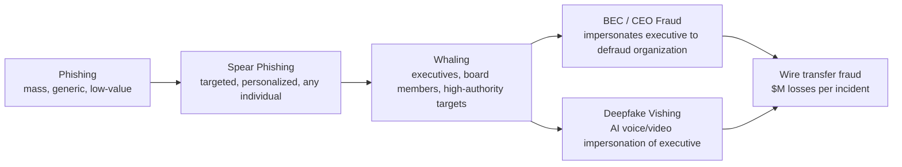
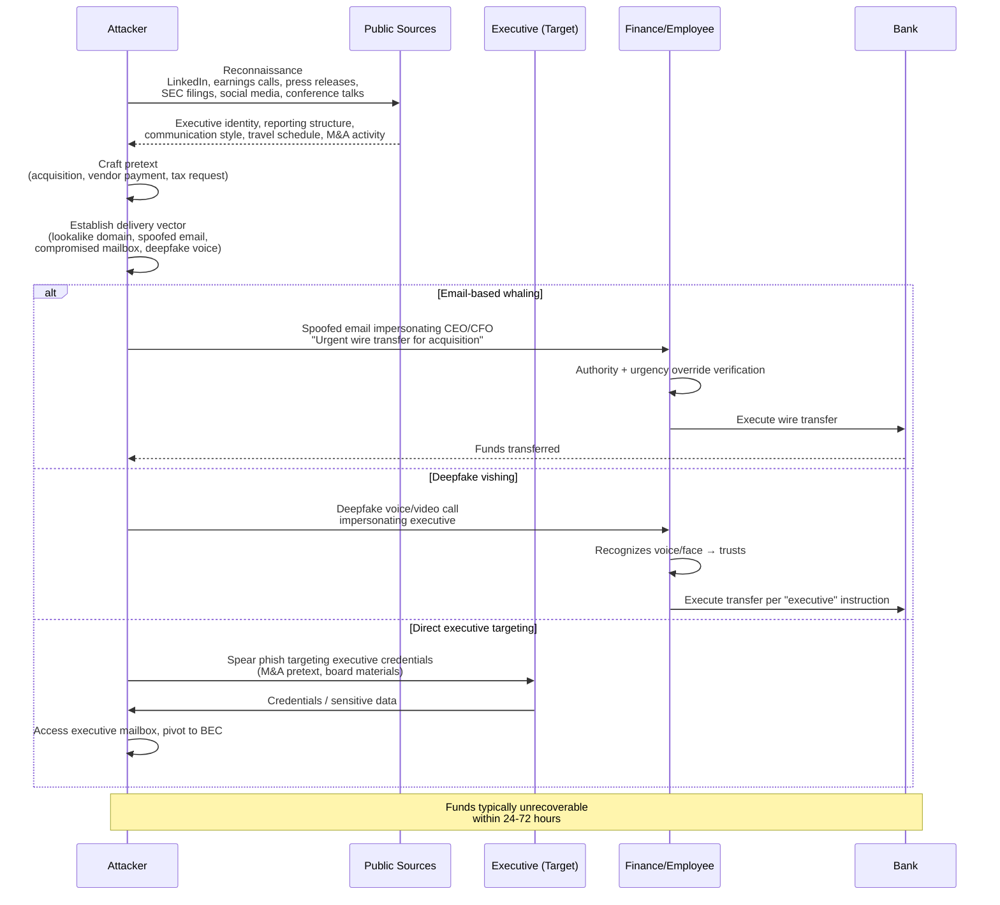
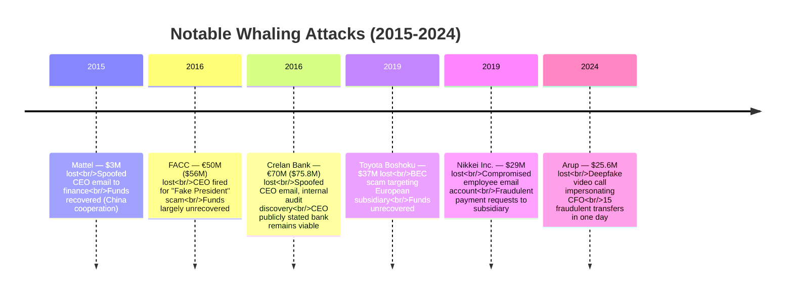
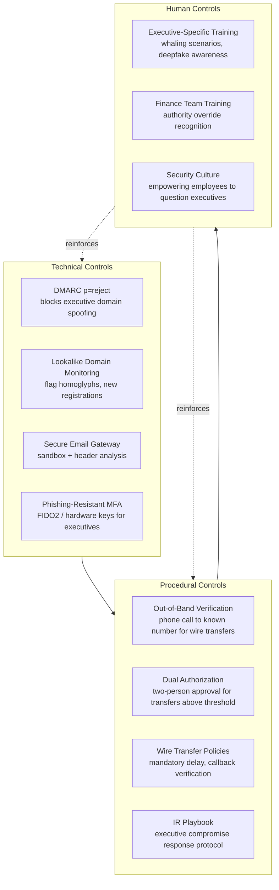

# Whaling (Targeting Executives)

## TCM Exam Objectives
- Define whaling as targeted spear phishing against C-suite executives, board members, and senior leaders
- Distinguish whaling from BEC/CEO fraud: BEC impersonates executives to defraud the org; whaling can also target the executive directly for credential/data theft
- Describe the whaling attack lifecycle: reconnaissance (LinkedIn, earnings calls, SEC filings) → pretext crafting → delivery (spoofed email, lookalike domain, deepfake) → execution
- Explain lookalike domain attacks bypassing authentication: attacker registers homoglyph domain that passes SPF/DKIM/DMARC because the domain is legitimately theirs
- Analyze the deepfake vishing threat: AI voice cloning from public audio samples, 1,600% surge in Q1 2025, $200M+ losses in North America
- Identify key case studies: Mattel ($3M), FACC (€50M, CEO fired), Crelan (€70M), Arup ($25.6M deepfake video call)
- Implement the single highest-impact control: mandatory out-of-band verification for all wire transfers via pre-established known channels
- Apply governance lessons from FACC precedent: executives can be held personally accountable for whaling losses resulting from inadequate verification procedures
Whaling is a highly targeted form of spear phishing aimed at C-suite executives, board members, and senior leaders — attackers impersonate authority figures (CEO, CFO) or target them directly, exploiting their decision-making power over wire transfers, strategic data, and access, with cumulative BEC losses reported to the FBI exceeding $55.5 billion over the past decade and accelerating as attackers adopt AI deepfakes.【turn0search15】【turn3search1】 The term "whaling" reflects both the high status of the targets and the high-value payoff: a single successful attack can extract tens of millions of dollars, far exceeding what mass phishing could ever yield.【turn0search0】【turn0search4】

📌 **Exam Tip:** The critical distinction: **BEC impersonates executives** to defraud the organization, **whaling targets the executives themselves** for credential theft or direct manipulation. Both use similar techniques, but the *target* is different. The most expensive attacks involve compromised executive mailboxes — the email comes from the real account and passes all authentication. Cumulative BEC losses exceed $55.5 billion (FBI IC3).

## Positioning Whaling in the Phishing Taxonomy

Whaling sits at the apex of the phishing hierarchy — it is to spear phishing what spear phishing is to mass phishing. The distinguishing factor is not the technique but the *target*: whaling focuses on "whales," the highest-profile, highest-value individuals whose authority or access can be leveraged for maximum impact.【turn0search6】【turn0search4】



The critical distinction from BEC: **BEC attackers masquerade as high-level executives, while whaling attacks target them.** The attacks are otherwise identical in mechanics — but whaling adds a second vector where the executive themselves is the victim of credential theft, data exfiltration, or direct manipulation.【turn0search7】【turn0search13】

## Master Comparison: Whaling vs. Adjacent Attacks

| Dimension | Whaling | Spear Phishing | BEC / CEO Fraud | Standard Phishing |
|---|---|---|---|---|
| **Target** | C-suite, board members, senior leaders | Specific individuals (any level) | Finance teams, employees who execute transactions | Mass audience, non-specific |
| **Impersonation direction** | Targets the executive OR impersonates the executive | Impersonates trusted contacts | Impersonates executives to employees | Impersonates brands, banks, platforms |
| **Research depth** | Extensive — public persona, earnings calls, social media, org charts | Moderate — name, role, context | Moderate — executive identity, reporting structure | Minimal — generic templates |
| **Typical ask** | Wire transfer authorization, W-2 data, credentials, M&A info | Credentials, data, minor transfers | Wire transfers, payment redirects, invoice fraud | Credentials, gift cards, minor financial info |
| **Financial impact per incident** | $3M – $75M+ | Thousands to millions | $137K average (US, 2024) | Low individual, high aggregate |
| **Delivery channel** | Email, deepfake voice/video, video calls | Email, SMS | Email (spoofed/compromised) | Email, SMS, websites |
| **Detection difficulty** | Very high — exploits authority, urgency, trust | High | Very high — bypasses gateway filters | Moderate |

Sources: 【turn0search0】【turn0search4】【turn0search6】【turn0search7】【turn0search13】【turn0search15】

---

## The Whaling Attack Lifecycle

Whaling attacks are not opportunistic — they are multi-stage campaigns that unfold over weeks or months, beginning with reconnaissance and culminating in a carefully timed financial or data extraction.【turn0search11】【turn0search22】 The attack follows a predictable sequence from target selection through execution.



The dotted reality across all three variants: the attack succeeds not because of technical sophistication but because of **authority exploitation** — subordinates are conditioned to execute executive requests quickly, especially when urgency is invoked.【turn0search0】【turn0search22】

---

## Module 1 — Target Profile: Who Gets Whaled

Whaling targets share specific characteristics that make them uniquely valuable: authority over financial transactions, access to sensitive strategic data, public visibility that enables reconnaissance, and decision-making power that subordinates are reluctant to question.【turn0search0】【turn0search10】

**Typical targets:**
- **CEO / President** — authority to authorize large transfers, strategic decisions
- **CFO / Finance Director** — direct control over wire transfers, banking access
- **CIO / CISO** — access to systems, credentials, architectural decisions
- **Board members** — access to M&A info, strategic plans, fiduciary authority
- **General Counsel** — access to legal, regulatory, and M&A confidential data
- **Non-corporate high-value targets** — celebrities, politicians (per IBM's definition)【turn0search6】

**Why executives are uniquely vulnerable:**
- Public personas enable reconnaissance — earnings calls, press releases, LinkedIn, conference talks, SEC filings all provide communication style, reporting structure, and operational context【turn0search15】【turn0search22】
- Authority creates compliance pressure — subordinates execute requests without question
- Time pressure and travel create windows where out-of-band verification is skipped
- Access to the highest-value assets — wire transfer authority, M&A data, strategic IP【turn0search7】

**High-risk industries:** Financial services, manufacturing, healthcare, legal, and any organization with large wire transfer volume or active M&A activity. Attackers target predictable business processes — invoice payment cycles, acquisition announcements, tax season (W-2 requests).【turn0search10】

---

## Module 2 — Attack Tactics Deep-Dive

### Lookalike Domains (Homoglyph Attacks)

Attackers register domains that are visually indistinguishable from the legitimate executive's domain — replacing letters with similar characters, using different TLDs, or adding subtle characters. `ce0.company.com` (zero replacing 'o'), `company-cfo.com`, `companyexec.com` all pass glance inspection. Because the domain is legitimately registered by the attacker, it passes SPF, DKIM, and DMARC — the authentication infrastructure sees it as a valid sending domain, just not the one the victim thinks it is.【turn0search13】【turn0search20】

### Email Spoofing and Compromised Mailboxes

Two distinct delivery paths exist for executive impersonation:

**Spoofed emails** — the attacker forges the `From:` header to display the executive's address. This is blocked by DMARC enforcement at p=reject, but organizations without DMARC or at p=none provide no barrier.【turn0search20】

**Compromised executive mailboxes** — the attacker gains access to the actual executive's email account via credential theft, session hijacking, or OAuth abuse. Emails sent from the compromised account pass all authentication checks because they *are* from the legitimate account. This is the most dangerous variant — FACC, Mattel, and Crelan Bank all involved compromised or spoofed executive mailboxes.【turn1search7】【turn1search16】

📌 **Exam Tip:** The Arup case ($25.6M, 2024) is a landmark whaling attack: a finance employee received a phishing email, then joined a video call where the "CFO" and other "executives" (all deepfakes) instructed them to execute 15 fraudulent wire transfers. Key lesson: deepfake technology defeats all technical email controls. Only out-of-band verification (calling a known number) can stop this. The attack exploited no software vulnerability — only human trust.

```mermaid
flowchart TD
    ATTACKER[Attacker collects public audio/video<br/>of executives from earnings calls,<br/>conference talks, YouTube] --> CLONE[AI voice cloning model trained]
    CLONE --> PREP[Attacker researches:<br/>- Active company projects<br/>- Reporting structure<br/>- Finance team contacts]
    PREP --> VISHING[Deepfake voice call or<br/>synthetic video call<br/>to finance employee]
    
    VISHING --> EXEC[Fake "CFO" voice/video:<br/>"We're closing the ABC acquisition.<br/>Wire $25.6M immediately.<br/>This is strictly confidential."]
    
    EXEC --> VERIFY{Employee verifies?}
    VERIFY -->|No - trusts voice/video| TRANSFER[Wire transfer executed]
    VERIFY -->|Calls known number| PREVENT[Attack prevented<br/>- real CFO unaware]
    
    TRANSFER --> LOSS[Funds unrecoverable<br/>$25.6M loss - Arup case]
    
    subgraph DEFENSES[Deepfake Defenses]
        D1[Out-of-band verification<br/>via known phone number]
        D2["Secret code" word for<br/>sensitive requests]
        D3[Deepfake detection tools<br/>- audio/video forensics]
        D4[Zero-trust financial policy<br/>no exceptions for urgency]
    end
```

### Deepfake Audio and Video (AI-Enhanced Whaling)

The most significant tactical evolution of 2024-2025. Attackers use publicly available audio recordings of executives — from earnings calls, conference talks, podcast interviews, YouTube videos — to train AI voice cloning models that produce hyper-realistic voice impersonations. Deepfake video takes this further by generating synthetic video of the executive for fake video calls.【turn2search0】【turn2search3】【turn0search16】

Deepfake-enabled vishing surged over **1,600% in Q1 2025** compared to the end of 2024, with deepfake fraud losses exceeding **$200 million in North America in Q1 2025 alone**.【turn0search16】【turn0search17】 Attackers feed public correspondence, earnings call transcripts, and published articles into large language models to generate fraudulent emails that match the executive's distinctive writing style — making email-based whaling even harder to detect through content analysis alone.【turn0search16】

### Pretexting Scenarios

Whaling pretexts exploit executive authority and business context:
- **Acquisition/confidential transaction** — "We're acquiring [target], wire $X to escrow account immediately. This is strictly confidential."
- **Vendor payment urgency** — "I'm traveling, need this vendor payment processed today."
- **Tax/W-2 request** — Impersonating CEO to HR requesting employee W-2 data for "IRS verification"
- **Invoice fraud** — Modified invoice with attacker's banking details, sent within an active thread【turn0search10】【turn1search7】

### Thread Hijacking

When an executive mailbox is compromised, attackers read active threads and insert replies into existing conversations — creating "updated" invoices, payment redirects, or new banking instructions mid-thread. The email comes from the real account, within a real conversation the victim already trusts, making detection exceptionally difficult.【turn0search13】

---

## Module 3 — High-Impact Case Studies

These cases illustrate the financial devastation whaling causes and the patterns that repeat across attacks.



### Mattel ($3 Million, 2015)

In April 2015, a Mattel executive in China received an email appearing to come from newly-appointed CEO Christopher Sinclair, requesting a $3 million wire transfer to a new vendor. The timing was impeccable — the new CEO had taken over only the previous month, so employees were anxious to be responsive to a new boss. The employee executed the transfer without out-of-band verification. The funds went to a Chinese bank account controlled by attackers. Mattel recovered the funds because they contacted Chinese authorities quickly and the transfer was reversed before it was withdrawn — a rare outcome in whaling cases.【turn1search0】【turn1search1】【turn1search3】

### FACC (€50 Million / $56 Million, 2016)

Austrian aerospace manufacturer FACC (supplier to Airbus, Boeing, Rolls-Royce) lost approximately €50 million — nearly 10% of annual revenue — when an employee in the finance department wired funds after receiving emailed instructions from someone posing as CEO Walter Stephan. The attackers had previously broken into the company's email server and studied the CEO's writing style. FACC fired Stephan for "severely violating his duties" in relation to the "Fake President Incident." The supervisory board concluded he had failed to implement adequate verification procedures. This case established the precedent that executives can be personally accountable for whaling losses resulting from inadequate controls.【turn1search4】【turn1search6】【turn1search7】【turn1search8】

### Crelan Bank (€70 Million / $75.8 Million, 2016)

Belgian bank Crelan lost over €70 million when attackers spoofed the CEO's email account and instructed employees to transfer funds to attacker-controlled accounts. The fraud was discovered during an internal audit — not through any security control. CEO Luc Versele publicly stated the bank could absorb the loss without impacting customers, but the scale demonstrated that even financial institutions with robust controls could be victimized. The attackers' identity remains unknown.【turn1search14】【turn1search15】【turn1search16】

### Toyota Boshoku ($37 Million, 2019)

A European subsidiary of Toyota Boshoku Corporation was targeted by a BEC scam that resulted in a $37 million loss. Attackers impersonated an executive and convinced the finance team to execute fraudulent wire transfers. The funds were not recovered.【turn1search9】【turn1search11】【turn1search12】

📌 **Exam Tip:** The FACC case is the most significant governance precedent for whaling. Key facts: €50M loss, the CEO was FIRED for failing to implement adequate verification procedures. This established that whaling is not just an IT problem — it's a **board-level governance issue**. Executives can be held personally accountable. When the exam asks about executive accountability for phishing, reference the FACC precedent.

### Arup ($25.6 Million, 2024 — Deepfake)

UK engineering firm Arup lost HK$200 million ($25.6 million) when a finance employee in their Hong Kong office was tricked by a deepfake video call impersonating senior management, including the CFO. The employee had received a phishing email initially, then joined a video call where the "CFO" and other "executives" (all deepfakes) instructed them to execute 15 fraudulent wire transfers totaling $25.6 million in a single day. The attackers used publicly available audio and video of Arup executives to create the deepfakes. This case marked a turning point — the attack did not exploit any software vulnerability or even email spoofing, but purely AI-generated impersonation combined with social engineering.【turn2search0】【turn2search1】【turn2search3】

---

## Module 4 — Financial and Business Impact

The financial scale of whaling is staggering and accelerating. FBI IC3 reports cumulative BEC losses of **$55.5 billion over the past decade**, with 2025 total cybercrime losses surpassing $20 billion — 85% of which came from social engineering-driven fraud.【turn0search15】【turn3search1】【turn3search3】

| Impact Category | Statistic | Source |
|---|---|---|
| **Cumulative BEC losses (decade)** | $55.5 billion | FBI IC3 via Vectra AI |
| **2025 total cybercrime losses** | $20.8 billion | FBI IC3 2025 Report |
| **Social engineering share of losses** | 85% | FBI IC3 2025 |
| **Average BEC loss per incident (US)** | $137,000 | Hoxhunt BEC Statistics |
| **Deepfake vishing surge Q1 2025** | 1,600% increase vs. late 2024 | Vectra AI |
| **Deepfake fraud losses (NA, Q1 2025)** | $200 million+ | Vectra AI / LinkedIn data |
| **AI-generated BEC emails (Q2 2024)** | 40% of BEC emails flagged AI-generated | VIPRE 2024 |
| **Average financial sector deepfake loss** | $600,000 per incident | LinkedIn industry data |
| **Projected global deepfake losses (2027)** | $40 billion | Industry projections |

Sources: 【turn0search15】【turn3search1】【turn3search3】【turn0search16】【turn0search17】【turn0search10】

Beyond direct financial loss, whaling causes reputational damage, regulatory scrutiny (especially for public companies), executive terminations (FACC's CEO was fired), shareholder lawsuits, and erosion of internal trust. The FACC case established that executives can be held personally accountable for whaling losses resulting from inadequate verification procedures — a governance precedent that elevated whaling from an IT problem to a board-level risk.【turn1search6】【turn1search8】

---

## Module 5 — Detection: Technical and Behavioral Signals

Whaling detection requires combining email authentication analysis, header forensics, and behavioral context — because the most dangerous attacks (compromised mailboxes, deepfake calls) bypass content inspection entirely.

### Email Authentication Analysis

**SPF / DKIM / DMARC checks** — For spoofed executive emails, the Authentication-Results header reveals whether the sending IP is authorized (SPF), the message content is signed and unmodified (DKIM), and the domain aligns with the visible From: address (DMARC). A whaling email spoofing the CEO's address will fail DMARC if enforcement is at p=reject; at p=none, it passes through undetected.【turn0search20】【turn2search7】

**Lookalike domain detection** — Because lookalike domains pass authentication (they're legitimately registered by the attacker), detection requires domain monitoring that flags newly registered domains similar to the organization's, homoglyph variations, and unusual TLD usage. Organizations should monitor domain registrations continuously, not just at deployment.【turn0search13】【turn0search20】

### Header Forensics

**Message-ID domain mismatch** — If the From: field shows the CEO's domain but the Message-ID contains a different domain, the email is spoofed. The Message-ID is added by the sending mail server and is difficult to forge.【turn1search19】

**Received header routing analysis** — Trace the email's path through mail servers. A whaling email claiming to be from the CEO's office but routing through an unfamiliar IP range or geographic origin is a strong indicator.【turn1search19】

**Reply-To and Return-Path discrepancies** — Whaling emails often set the Reply-To to an attacker-controlled address while displaying the executive's address in From:. Comparing these fields catches the redirect.【turn1search19】

### Behavioral Signals (for compromised mailboxes)

When the attack comes from a compromised executive account, content inspection fails — the email is genuinely from the executive's mailbox. Detection shifts to behavioral anomalies:

- **Impossible travel logins** — Executive authenticates from New York, then appears in Eastern Europe 20 minutes later
- **After-hours mailbox access** — Logins at unusual times, especially paired with forwarding rule creation
- **Sudden inbox forwarding rules** — New rules forwarding finance or executive emails to external addresses
- **Abnormal reply patterns** — Executive mailbox suddenly replying to finance threads it wasn't previously involved in
- **Unusual wire transfer or payment discussions** — Changes to banking details, urgent invoice replacements, payment rerouting within existing threads【turn2search5】

### Deepfake Detection Signals

For AI voice/video attacks, detection shifts to verification protocol failures rather than technical signals:
- Requests originating from a voice/video call bypassing established verification procedures
- Urgency or pressure to act without out-of-band confirmation
- Transactions initiated outside normal approval workflows
- Requests to secrecy ("don't discuss this with anyone")【turn2search0】【turn2search3】

---

## Module 6 — Prevention: Defense-in-Depth for Executives

No single control stops whaling — the attack bypasses different controls depending on the variant. The mature strategy layers technical, procedural, and human controls.



### Out-of-Band Verification (The Highest-Impact Control)

The single most effective whaling prevention measure. Any wire transfer, payment redirect, or sensitive data request originating from an executive — regardless of how authentic the communication appears — must be verified through a separate, pre-established channel (a phone call to a known number, an in-person confirmation).【turn2search5】【turn2search6】 This control would have prevented Mattel, FACC, Crelan, and Toyota Boshoku losses. The Arup deepfake case specifically demonstrated that email-based verification is insufficient when the attacker can generate convincing voice/video — only out-of-band verification through a *known, pre-established channel* defeats deepfakes.【turn2search0】【turn2search3】

### Dual Authorization and Wire Transfer Policies

Require two-person approval for transfers above a defined threshold (e.g., $50,000). Mandatory delay periods for large transfers give finance teams time to verify. Callback verification to the executive's known number (not the number in the email) for any banking detail changes.【turn2search6】

### DMARC Enforcement (p=reject)

Blocks exact-domain executive spoofing entirely. At p=reject, any email claiming to be from the CEO's domain that fails authentication is blocked before reaching the inbox. This does not stop lookalike domains or compromised mailboxes, but it closes the easiest spoofing vector.【turn0search20】

### Phishing-Resistant MFA for Executives

Executives should use FIDO2 hardware security keys rather than SMS or push-notification MFA, which are vulnerable to SIM swapping and MFA fatigue. Hardware-backed MFA makes session replay and phishing kits significantly harder to execute.【turn2search5】

### Executive-Specific Training

Traditional security awareness training fails against whaling because it focuses on generic phishing red flags. Executive training must cover:
- Deepfake voice/video awareness — never act on financial instructions from voice/video calls without out-of-band verification【turn0search16】
- Authority override recognition — finance teams must be empowered to question executive requests without career risk【turn2search5】
- Whaling-specific scenarios — acquisition pretexts, vendor payment urgency, W-2 requests
- The FACC precedent — executives can be fired for inadequate verification procedures【turn1search6】

### Lookalike Domain Monitoring

Continuously monitor domain registrations for homoglyphs, similar TLDs, and executive name combinations. Register defensive domains proactively. Use DMARC reporting (RUA) to identify unauthorized sending attempts from the executive's domain.【turn0search13】【turn0search20】

---

## Module 7 — Response: When Whaling Succeeds

Despite prevention, whaling attacks will occasionally succeed. The response window is critical — funds are typically unrecoverable within 24-72 hours as attackers move them through multiple accounts and cryptocurrency conversions.

**Immediate actions (0-24 hours):**
- Contact the financial institution to recall the wire transfer (SWIFT recall request)
- Notify law enforcement (FBI IC3 for US, local equivalents internationally)
- Freeze affected accounts and banking relationships
- Engage legal counsel and cyber insurance provider【turn1search0】

**Containment (24-72 hours):**
- If executive mailbox compromised: force password reset, revoke active sessions, audit forwarding rules, review sent items for attacker activity
- Preserve email evidence (headers, full message source) for forensic investigation
- Identify all recipients of fraudulent communications from the compromised account【turn2search5】

**Investigation and recovery:**
- Forensic analysis of mailbox access logs, login geography, OAuth grants
- Coordinate with financial institutions and law enforcement across jurisdictions
- Mattel's recovery was possible because they contacted Chinese authorities quickly — speed is the determining factor in fund recovery【turn1search0】【turn1search2】

**Post-incident:**
- Implement additional verification controls (out-of-band, dual authorization)
- Executive and finance team retraining
- DMARC policy escalation to p=reject if not already enforced
- Board-level review of governance and accountability (FACC precedent)【turn1search6】

---

## Common Pitfalls

**Relying on email authentication alone.** DMARC blocks spoofed executive domains but does nothing against lookalike domains, compromised mailboxes, or deepfake voice calls. Authentication is necessary but not sufficient — procedural controls (out-of-band verification) are the actual last line of defense.【turn0search20】【turn2search3】

**Training executives on generic phishing.** Whaling exploits authority, urgency, and business context — not the typos and suspicious links that generic training addresses. Executive training must use whaling-specific scenarios and deepfake awareness.【turn0search16】【turn2search5】

**Empowering finance teams to question authority.** The cultural barrier is real — subordinates are reluctant to question executives, especially CEOs. Without explicit organizational empowerment (and executive endorsement of verification procedures), finance teams will execute urgent requests without verification. FACC's CEO was fired for failing to establish this culture.【turn1search6】【turn2search5】

**Ignoring deepfake voice/video threats.** The Arup case proved that attackers no longer need email or software exploits — AI-generated voice and video calls can bypass all technical controls. Organizations without deepfake awareness training and mandatory out-of-band verification for financial instructions are vulnerable to the fastest-growing whaling variant.【turn2search0】【turn2search3】【turn0search16】

**Treating whaling as an IT problem.** Whaling is a governance and financial controls problem that happens to use email as a delivery vector. The FACC case — where the CEO was fired — established that executive accountability for verification procedures is a board-level governance issue, not a technical security issue.【turn1search6】【turn1search8】

**Skipping out-of-band verification for "urgent" requests.** Urgency is the attacker's primary weapon. Every successful whaling case involved the victim bypassing verification because the request was "urgent" or "confidential." The rule must be: the more urgent and confidential the request, the more rigorous the verification required.【turn2search5】【turn2search6】

---

## Recap

Whaling is a targeted attack on C-suite executives, board members, and senior leaders that exploits their authority, public visibility, and access to high-value assets — delivered via email spoofing, lookalike domains, compromised mailboxes, and increasingly AI-generated deepfake voice and video calls.【turn0search0】【turn0search15】【turn0search16】 The attack lifecycle follows reconnaissance → pretext crafting → delivery → execution, with the most damaging variants (FACC €50M, Crelan €70M, Arup $25.6M deepfake) succeeding because authority and urgency override verification procedures.【turn1search6】【turn1search14】【turn2search0】 Cumulative BEC losses reported to the FBI exceed $55.5 billion, with deepfake-enabled vishing surging 1,600% in Q1 2025 and AI-generated content now present in 40% of BEC emails — making traditional content-based detection increasingly insufficient.【turn0search15】【turn0search16】【turn0search17】 The defense stack layers DMARC p=reject enforcement, lookalike domain monitoring, phishing-resistant MFA for executives, out-of-band verification for all wire transfers, dual authorization for high-value transactions, and executive-specific training that covers deepfake awareness and authority override recognition — with the understanding that the single highest-impact control is out-of-band verification through a pre-established known channel, because it is the only measure that defeats both email spoofing and AI-generated voice/video impersonation.【turn2search5】【turn2search6】【turn2search0】 The throughline: whaling succeeds not because of technical sophistication but because of human authority dynamics — the mature defense combines technical controls to block the easy attacks, procedural controls to catch what technology misses, and cultural empowerment that lets finance teams verify executive requests without career risk, backed by governance accountability (the FACC precedent) that makes executive leaders responsible for the verification culture they establish.