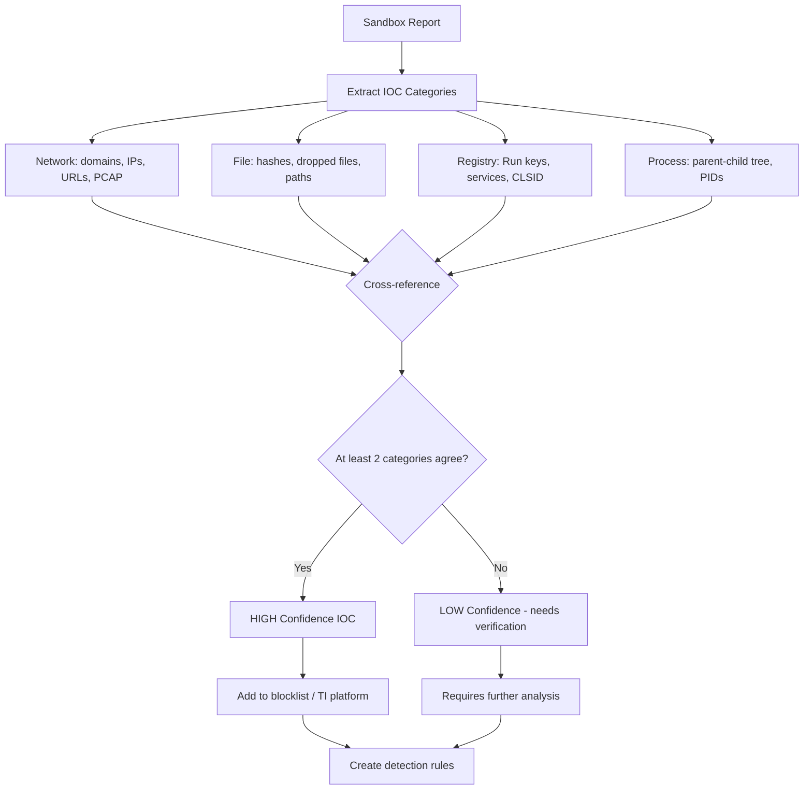
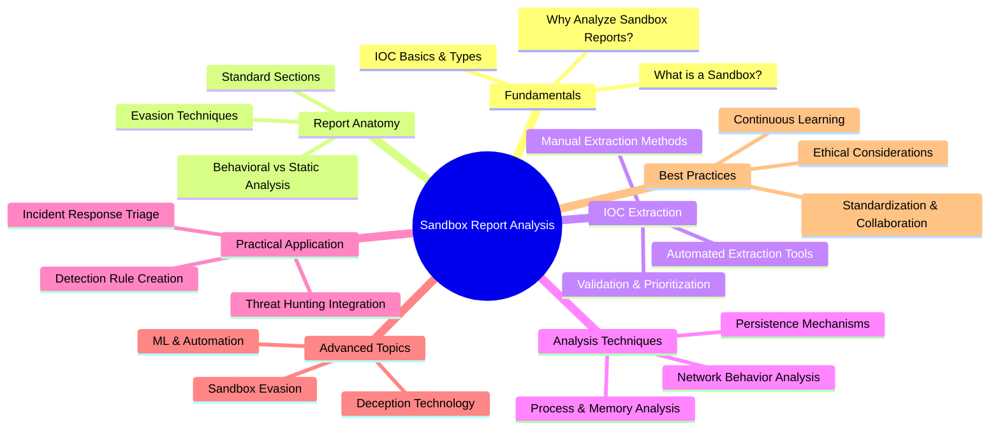
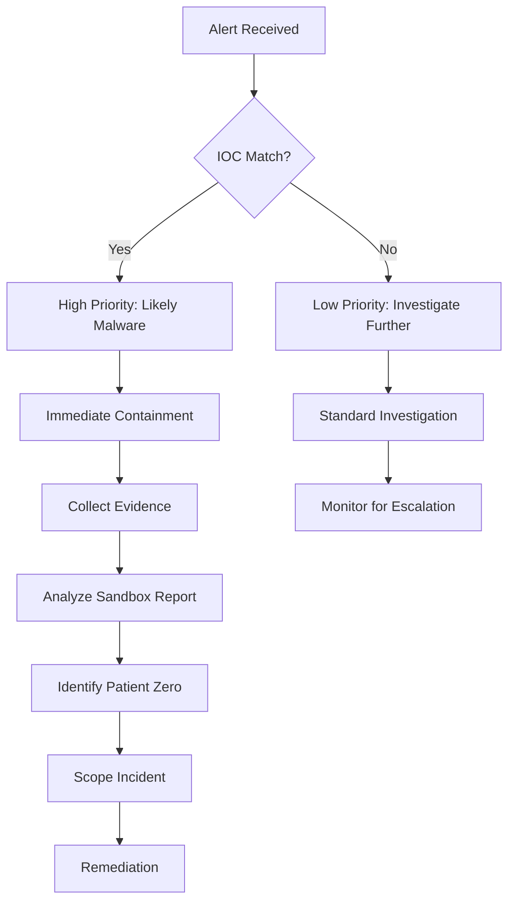
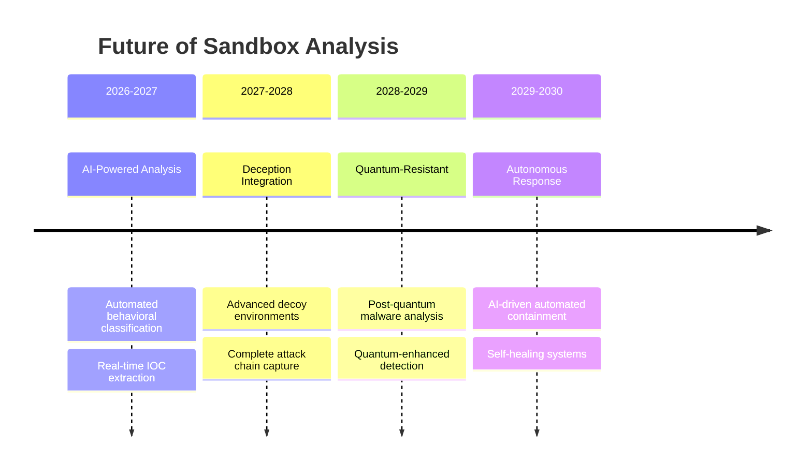

---
tags: [email-security]
---
# 🧪 Analyzing Sandbox Reports for IOCs: A Full-Stack Lesson


## TCM Exam Objectives
- Navigate and interpret the standard sections of a sandbox analysis report
- Extract network-based IOCs: C2 domains, IPs, URLs, PCAP artifacts
- Extract host-based IOCs: dropped files, registry modifications, process creations
- Distinguish between actionable IOCs and noise artifacts from the sandbox environment
- Apply MITRE ATT&CK framework mapping for threat actor behavior profiling
- Validate severity by correlating across multiple IOC categories (network + host + file)
- Create YARA and Sigma detection rules from sandbox behavioral observations
- Prioritize IOCs by confidence level: confirmed vs. suspicious vs. benign
- Integrate validated IOCs into MISP, ThreatConnect, or other TI platforms
- Automate sandbox report analysis for high-volume SOC triage pipelines

# 🧪 Analyzing Sandbox Reports for IOCs: A Full-Stack Lesson

📌 **Exam Tip:** IOC triage priority for the exam: (1) **Network IOCs** (C2 domains, IPs) have the highest actionability — block at perimeter, (2) **File IOCs** (hashes, dropped binaries) are high confidence — blocklist and hunt, (3) **Registry IOCs** (Run keys, services) indicate persistence — scan all hosts, (4) **Process IOCs** (parent-child relationships) are critical for forensic timeline reconstruction. Always validate by confirming at least two IOC categories agree.



## 🎯 Lesson Overview
This lesson provides a comprehensive, full-stack approach to **analyzing sandbox reports for Indicators of Compromise (IOCs)**. You'll learn the complete workflow from sandbox fundamentals to advanced IOC extraction, validation, and integration into security operations. This skill is crucial for threat hunters, SOC analysts, and malware researchers.



## 1. 📚 Fundamentals: Sandboxes & IOCs

### 1.1 What is a Malware Sandbox?
A **malware sandbox** is an isolated, controlled environment used to safely execute and analyze potentially malicious code 【turn0search5】【turn0search17】. It observes the behavior of malware without risking infection of the production system. Key characteristics include:

- **Isolation**: Completely separated from production networks and systems
- **Instrumentation**: Heavy monitoring of file system, registry, network, and process activity
- **Controlled Environment**: Mimics real systems but with extensive logging
- **Safe Detonation**: Allows malware to run its full course in containment

> 💡 **Key Insight**: Modern sandboxes have evolved from simple execution environments to sophisticated systems that can detect evasion attempts and provide detailed behavioral analysis 【turn0search3】【turn0search19】.

### 1.2 Why Analyze Sandbox Reports?
Sandbox reports provide **behavioral evidence** of malware activity that static analysis alone cannot reveal. Key benefits include:

- **Zero-Day Detection**: Identify previously unknown malware through behavior
- **Complete Attack Chain**: Understand full infection process from entry to impact
- **IOC Generation**: Create actionable indicators for detection and response
- **Threat Intelligence**: Understand attacker TTPs (Tactics, Techniques, Procedures)
- **Severity Triage**: Quickly assess potential impact of malware 【turn0search8】

### 1.3 IOC Basics & Types
**Indicators of Compromise (IOCs)** are forensic artifacts that indicate a system may have been infiltrated 【turn0search7】【turn0search9】. Common IOC types include:

| IOC Type | Description | Example | Source in Sandbox Report |
|----------|-------------|---------|--------------------------|
| **File Hashes** | Unique identifiers for malware samples | `d41d8cd98f00b204e9800998ecf8427e` | File analysis section |
| **Network IOCs** | Domains, IPs, URLs contacted by malware | `malicious-domain.com`, `192.168.1.100` | Network behavior section |
| **Registry Keys** | Persistence mechanisms or configuration | `HKLM\Software\MaliciousKey` | Registry activity section |
| **Mutexes** | Synchronization objects preventing multiple instances | `Global\MalwareMutex` | Process activity section |
| **Scheduled Tasks** | Persistence mechanisms | `schtasks /create /tn "Update" /tr malware.exe` | Scheduled task section |
| **Dropped Files** | Secondary payloads downloaded | `temp.dll`, `payload.exe` | File system activity section |
| **API Calls** | Suspicious system function calls | `VirtualAllocEx`, `WriteProcessMemory` | API call logging section |

## 2. 🔍 Sandbox Report Anatomy

### 2.1 Standard Report Sections
While formats vary by sandbox (Joe Sandbox, Cuckoo, ANY.RUN, etc.), most reports contain these key sections:

<details>
<summary>📖 Detailed Section Breakdown</summary>

#### **1. Executive Summary**
- **Classification**: Malware family/type (if identified)
- **Threat Level**: Risk assessment (high/medium/low)
- **Key Behaviors**: Main malicious activities observed
- **IOCs Summary**: Quick reference to most important indicators

#### **2. Static Analysis**
- **File Metadata**: Size, type, compilation timestamp
- **Hash Values**: MD5, SHA1, SHA256 of sample
- **PE Information**: Imports, exports, sections (for Windows executables)
- **Strings Extraction**: URLs, IPs, suspicious strings in file
- **YARA Matches**: Any signature matches from static rules

#### **3. Behavioral Analysis**
- **Process Tree**: Parent-child process relationships
- **API Calls**: System function calls with parameters
- **File Operations**: Create, modify, delete file activities
- **Registry Modifications**: Changes to system registry
- **Network Activity**: DNS requests, HTTP traffic, connections

#### **4. Network Activity**
- **DNS Queries**: Domains resolved by malware
- **HTTP Requests**: URLs accessed, POST data, headers
- **IP Communications**: IP addresses contacted, ports used
- **Protocol Analysis**: Unusual or custom protocol usage

#### **5. Memory Analysis**
- **Injected Code**: Code injected into other processes
- **Memory Strings**: Strings found in memory dumps
- **Loaded Modules**: DLLs loaded by malware
- **Memory Hashes**: Hashes of memory regions

#### **6. Persistence Mechanisms**
- **Registry Run Keys**: Autorun entries
- **Scheduled Tasks**: Task scheduler entries
- **Startup Folders**: Files in startup directories
- **Services**: Installed malicious services
</details>

### 2.2 Behavioral vs Static Analysis
Understanding the difference helps prioritize IOC extraction:

| Aspect | Static Analysis | Behavioral Analysis |
|--------|----------------|---------------------|
| **What it examines** | File properties without execution | Actions during execution |
| **IOCs found** | Embedded strings, imports, hashes | Network activity, file operations, registry changes |
| **Evasion resistance** | Easier to evade (packers, obfuscation) | Harder to evade (requires actual behavior) |
| **Speed** | Fast | Slower (requires execution time) |
| **Completeness** | Limited to what's in the file | Shows actual impact and chain |

### 2.3 Sandbox Evasion Techniques
Malware authors actively try to detect and evade sandboxes. Common techniques include:

<details>
<summary>⚙️ Technical Evasion Methods</summary>

#### **1. Environment Detection**
- **VM Artifacts**: Checking for VMware, VirtualBox files/drivers
- **Sandbox Processes**: Looking for sandbox-specific processes
- **User Interaction**: Checking for mouse movement, recent documents
- **Hardware Checks**: CPU count, memory size, disk size

#### **2. Timing Evasion**
- **Sleep Calls**: Extended sleep calls (e.g., `Sleep(0x8000000)`)
- **Sleep Skipping**: Sandboxes may shorten sleep durations 【turn0search3】
- **Loops**: Infinite loops with conditional breaks based on environment

#### **3. Logic Bombs**
- **Date/Time Checks**: Activating only on specific dates
- **Geolocation Checks**: Behaving differently based on system locale
- **Domain Checks**: Checking if joined to specific domain

#### **4. Anti-Analysis**
- **Debugger Detection**: Checking for debuggers
- **Analysis Tool Detection**: Looking for Process Monitor, Wireshark
- **Sandbox Specific Checks**: Identifying known sandbox IP ranges
</details>

## 3. 🔧 IOC Extraction Techniques

### 3.1 Manual Extraction Process
Manual extraction is thorough but time-consuming. Follow this systematic approach:

```mermaid
flowchart LR
    A[Access Full Report] --> B[Review Executive Summary]
    B --> C[Extract File Hashes]
    C --> D[Analyze Network Activity]
    D --> E[Identify Persistence Mechanisms]
    E --> F[Check Dropped Files]
    F --> G[Review API Calls]
    G --> H[Validate & Prioritize IOCs]
    H --> I[Document & Format]
    
    style A fill:#f9f,stroke:#333,stroke-width:2px
    style H fill:#bbf,stroke:#333,stroke-width:2px
```



<details>
<summary>📝 Step-by-Step Manual Extraction Guide</summary>

#### **Step 1: Access Complete Report**
- Ensure you have the full report, not just summary
- Check for any password-protected sections
- Verify report integrity (if applicable)

#### **Step 2: Review Executive Summary First**
- Note initial classification and threat level
- Identify key behaviors mentioned
- Create preliminary IOC list

#### **Step 3: Extract File Hashes**
- Record sample hash (MD5, SHA1, SHA256)
- Look for hashes of dropped files
- Check memory region hashes if available

#### **Step 4: Analyze Network Activity**
- **DNS Queries**: Extract all domains contacted
  - Look for DGA (Domain Generation Algorithm) patterns
  - Note any subdomains or URL paths
- **IP Addresses**: List all IPs contacted
  - Include both source and destination
  - Note ports and protocols
- **HTTP Requests**: Extract full URLs
  - Include POST data and headers
  - Look for encoded/encrypted data

#### **Step 5: Identify Persistence Mechanisms**
- Check registry keys created/modified
  - Focus on Run keys, services, scheduled tasks
- Look for files in startup directories
- Check for new services installed
- Note scheduled task creations

#### **Step 6: Check Dropped Files**
- List all files created by malware
- Record paths, names, and hashes
- Note file types and purposes if identifiable

#### **Step 7: Review API Calls**
- Look for suspicious API patterns
  - Process injection (`VirtualAllocEx`, `WriteProcessMemory`)
  - Privilege escalation (`AdjustTokenPrivileges`)
  - Anti-analysis (`IsDebuggerPresent`)
- Note parameters for suspicious calls

#### **Step 8: Validate & Prioritize**
- Cross-reference IOCs with threat intelligence
- Prioritize based on:
  - Confidence level (explicit malicious behavior vs suspicious)
  - Impact potential (network vs local only)
  - Uniqueness (common vs rare indicators)

#### **Step 9: Document & Format**
- Standardize IOC format (STIX, CybOX, CSV)
- Include context for each IOC
  - What behavior it represents
  - How it was observed
  - Confidence level
</details>

### 3.2 Automated Extraction Tools
Several tools can automate IOC extraction from sandbox reports:

<details>
<summary>🛠️ Tool Comparison & Implementation</summary>

#### **1. IOC Extractor Tools**
- **Cyware IOC Extractor**: Extracts IOCs from text reports 【turn0search12】
- **Inventive HQ IOC Extractor**: Free tool for multiple IOC types 【turn0search12】
- **Claude Code Malware IOC Extraction**: AI-powered extraction skill 【turn0search13】

#### **2. Sandbox-Specific Extraction**
```python
# Example Python code for automated IOC extraction from Joe Sandbox reports
import json
from typing import Dict, List

def extract_iocs_from_joe_sandbox(report_path: str) -> Dict:
    """Extract IOCs from Joe Sandbox JSON report."""
    with open(report_path, 'r') as f:
        report = json.load(f)
    
    iocs = {
        'file_hashes': [],
        'network': {'domains': [], 'ips': [], 'urls': []},
        'registry': [],
        'dropped_files': [],
        'mutexes': []
    }
    
    # Extract file hash
    if 'md5' in report:
        iocs['file_hashes'].append(report['md5'])
    
    # Extract network IOCs
    network_info = report.get('network', {})
    iocs['network']['domains'] = extract_domains(network_info.get('dns', []))
    iocs['network']['ips'] = extract_ips(network_info.get('connections', []))
    iocs['network']['urls'] = extract_urls(network_info.get('http', []))
    
    # Extract registry modifications
    registry_info = report.get('registry', {})
    iocs['registry'] = extract_registry_keys(registry_info.get('keys', []))
    
    return iocs

def extract_domains(dns_entries: List) -> List[str]:
    """Extract unique domains from DNS entries."""
    domains = set()
    for entry in dns_entries:
        if 'hostname' in entry:
            domains.add(entry['hostname'])
    return list(domains)

# Similar functions for IPs, URLs, registry keys, etc.
```

#### **3. LLM-Based Extraction**
Recent advances use Large Language Models (LLMs) for IOC extraction 【turn0search10】:
- **Natural Language Processing**: Understand report context
- **Pattern Recognition**: Identify complex IOC patterns
- **Contextual Validation**: Reduce false positives
</details>

### 3.3 Validation & Prioritization
Not all IOCs are equal. Apply these validation techniques:

| Validation Method | Description | Tool Examples |
|-------------------|-------------|---------------|
| **Threat Intelligence Lookup** | Check IOCs against known threats | VirusTotal, AlienVault OTX, IBM X-Force |
| **Cross-Reference Multiple Reports** | Confirm IOCs appear in multiple analyses | Internal sandbox, public sandboxes |
| **Behavioral Confidence Scoring** | Score based on malicious behavior confidence | Custom scoring system |
| **Age/Reputation Check** | New domains/IPs more suspicious | WHOIS, IP reputation services |
| **Contextual Analysis** | Consider IOCs in attack context | MITRE ATT&CK mapping |

## 4. 🎯 Advanced Analysis Techniques

### 4.1 Network Behavior Deep Dive
Network behavior reveals malware's communication and payload delivery:

<details>
<summary>🌐 Network Analysis Framework</summary>

#### **1. DNS Analysis**
- **DGA Detection**: Look for random-looking domains
  - Use DGA detection algorithms (e.g., word frequency analysis)
  - Check DNS response patterns (NXDOMAIN spikes)
- **Domain Age**: Newly registered domains (< 30 days) more suspicious
- **DNS Tunneling**: Unusual DNS query lengths or types

#### **2. HTTP/HTTPS Analysis**
- **URL Structure**: Look for patterns in paths/parameters
  - Encoded data in URLs
  - Suspicious file extensions (.php, .asp with no referrer)
- **POST Data**: Examine data exfiltration
  - Look for encoded/encrypted content
  - Check for credentials, system info
- **Headers**: User-Agent anomalies
  - Non-standard or outdated UAs
  - Custom User-Agents

#### **3. Protocol Analysis**
- **Non-Standard Ports**: Protocols on unusual ports
- **Custom Protocols**: Binary data on standard ports
- **Beaconing**: Regular, periodic connections
  - Measure interval regularity
  - Check for jitter patterns

#### **4. C2 Infrastructure Analysis**
- **IP Reputation**: Check connection IPs
- **Domain Reputation**: Verify domain legitimacy
- **Infrastructure Overlap**: Same IPs/domains across samples
- **Certificate Analysis**: Self-signed or invalid certificates
</details>

### 4.2 Process & Memory Analysis
Understanding process behavior reveals attack techniques:

<details>
<summary>⚙️ Process Analysis Techniques</summary>

#### **1. Process Tree Analysis**
- **Anomalous Parent-Child**: Unusual process relationships
  - Word → cmd.exe → powershell.exe
  - Explorer → suspicious_binary.exe
- **Process Injection**: Look for:
  - `VirtualAllocEx`/`WriteProcessMemory` patterns
  - `CreateRemoteThread` calls
  - Hollow process creation

#### **2. Memory Analysis**
- **Injected Code**: Look for memory regions with:
  - EXECUTE_READWRITE permissions
  - Mismatched memory protection
- **Strings in Memory**: Extract strings from memory dumps
  - Look for URLs, IPs, commands
- **PE Headers in Memory**: Check for injected DLLs
  - Compare loaded modules vs memory regions

#### **3. API Call Analysis**
- **Suspicious Patterns**:
  - `CreateProcess` with suspicious parameters
  - `RegSetValueEx` to persistence locations
  - `InternetOpenUrl` with suspicious URLs
- **Parameter Analysis**: Examine API call parameters
  - Look for encoded commands
  - Check for suspicious file paths
</details>

### 4.3 Persistence Mechanism Analysis
Identifying how malware maintains access is crucial:

| Persistence Method | Registry Location | Detection Technique | MITRE ATT&CK Technique |
|-------------------|-------------------|---------------------|------------------------|
| **Run Key** | `HKLM\Software\Microsoft\Windows\CurrentVersion\Run` | Registry diff analysis | T1547.001 |
| **Scheduled Task** | Task Scheduler store | Analyze task XML | T1053.005 |
| **Service** | `HKLM\SYSTEM\CurrentControlSet\Services` | Service config diff | T1543.003 |
| **Startup Folder** | `Startup` folder | File system diff | T1547.001 |
| **WMI Event Subscription** | WMI repository | WMI namespace analysis | T1546.003 |

## 5. 🚀 Practical Application & Integration

### 5.1 Threat Hunting Integration
IOCs from sandbox reports enhance threat hunting:

<details>
<summary>🛡️ Threat Hunting Workflow</summary>

#### **1. Hypothesis Development**
- Use sandbox IOCs to form hunting hypotheses
  - "We might see C2 traffic to [domain] if malware is present"
  - "Look for registry key [key] as persistence mechanism"

#### **2. Search Strategy**
- **Network Hunting**: Search SIEM for:
  - DNS queries to extracted domains
  - Connections to extracted IPs
  - HTTP requests with suspicious patterns
- **Endpoint Hunting**: Search EDR for:
  - Registry modifications to extracted keys
  - Process creations matching extracted patterns
  - File creations with extracted hashes

#### **3. Detection Rule Creation**
- **SIEM Rules**: Create alerts for network IOCs
  - Domain/IP blocklist updates
  - Suspicious User-Agent detection
- **EDR Rules**: Create detection for behaviors
  - Process injection patterns
  - Persistence mechanism creation

#### **4. Continuous Feedback**
- Validate hunt findings against sandbox IOCs
- Update hunting hypotheses based on results
- Refine detection rules based on effectiveness
</details>

### 5.2 Detection Rule Creation
Transform IOCs into actionable detections:

<details>
<summary>⚙️ Rule Creation Examples</summary>

#### **1. SIEM Rule (Splunk/SPL)**
```spl
index=network (sourcetype=dns OR sourcetype=firewall)
[
    search index=threat_intel sandbox_iocs
    | table domain ip
    | format
]
| stats count by src, dest, domain, ip
| where count > 0
```

#### **2. EDR Rule (CrowdStrike/Sigma)**
```yaml
title: Malware Persistence via Registry Run Key
status: experimental
description: Detects persistence mechanism from sandbox analysis
author: Threat Hunter
logsource:
    product: windows
    category: registry_event
detection:
    selection:
        TargetObject:
            - '*\Software\Microsoft\Windows\CurrentVersion\Run\\*'
            - '*\Software\Microsoft\Windows\CurrentVersion\RunOnce\\*'
        Details:
            - '*suspicious.exe*'
            - '*malware_path*'
    condition: selection
level: high
```

#### **3. YARA Rule**
```yara
rule Malware_Family_X {
    meta:
        description = "Detection for malware family X based on sandbox IOCs"
        author = "Threat Intel Team"
        date = "2026-06-29"
    strings:
        $mutex = "Global\\\\MalwareMutex" wide ascii
        $url = "http://malicious-domain.com/payload" wide ascii
        $registry = "Software\\\\Microsoft\\\\Windows\\\\CurrentVersion\\\\Run\\\\Update" wide ascii
    condition:
        $mutex or $url or $registry
}
```
</details>

### 5.3 Incident Response Triage
Sandbox IOCs enable rapid incident triage:



## 6. 🧠 Advanced Topics & Future Trends

### 6.1 Sandbox Evasion Countermeasures
Modern sandboxes employ techniques to detect evasion:

<details>
<summary>🛡️ Advanced Evasion Detection</summary>

#### **1. Extended Analysis Time**
- Run malware for extended periods (24+ hours)
- Detect sleep skipping by comparing expected vs actual sleep times
- Use hardware-based timers for accurate sleep measurement

#### **2. Human Interaction Simulation**
- Simulate mouse movements and clicks
- Generate realistic user activity patterns
- Maintain system activity during analysis

#### **3. Deception Technology Integration**
- Deploy decoy documents and credentials
- Create fake network services and shares
- Monitor for access to deception assets 【turn0search19】

#### **4. Hardware-Based Analysis**
- Use bare metal sandboxes for certain malware
- Avoid VM-specific artifacts
- Provide more realistic environment

#### **5. Multi-Stage Analysis**
- Initial quick analysis (5-10 minutes)
- Extended analysis if suspicious (24+ hours)
- Human-in-the-loop for ambiguous cases
</details>

### 6.2 Machine Learning & Automation
AI is transforming sandbox analysis:

<details>
<summary>🤖 ML Applications in Sandbox Analysis</summary>

#### **1. Automated Malware Classification**
- **Behavioral Clustering**: Group similar behaviors
- **Family Attribution**: Identify malware families
- **Novelty Detection**: Flag new/unknown malware

#### **2. IOC Extraction Enhancement**
- **Natural Language Processing**: Extract IOCs from reports
- **Pattern Recognition**: Identify complex IOC patterns
- **Confidence Scoring**: Prioritize IOCs based on reliability

#### **3. Predictive Analysis**
- **Attack Prediction**: Predict next stages of attack
- **Impact Assessment**: Estimate potential damage
- **Risk Scoring**: Prioritize incidents based on risk

#### **4. Automated Triage**
- **Severity Scoring**: Automatically score incident severity
- **Response Recommendation**: Suggest response actions
- **Resource Allocation**: Optimize analyst workload

#### **5. Evasion Detection**
- **Anomaly Detection**: Identify unusual behavior
- **Evasion Technique Identification**: Classify evasion attempts
- **Environment Fingerprinting**: Detect environment checks
</details>

### 6.3 Deception Technology Integration
Deception enhances sandbox effectiveness:

<details>
<summary>🎭 Deception Technology in Sandboxes</summary>

#### **1. Decoy Assets**
- **Fake Documents**: Credential files, financial data
- **Decoy Network Services**: Fake databases, web servers
- **Honeyfiles**: Files that trigger alerts when accessed

#### **2. Deception Network**
- **Fake Subnets**: Realistic IP space for malware exploration
- **Decoy Domains**: Fake domains for C2 communication
- **Honeytokens**: Fake credentials, API keys

#### **3. Engagement Servers**
- **Fake C2 Servers**: Capture malware communication
- **Decoy Exfiltration Points**: Capture stolen data
- **Honeyaccounts**: Fake user accounts with monitoring

#### **4. Benefits**
- **Early Detection**: Catch malware during reconnaissance
- **Complete Attack Chain**: Observe full attack lifecycle
- **Reduced False Positives**: Only malicious activity triggers alerts
- **Threat Intelligence**: Capture attacker tools and techniques
</details>

## 7. 📊 Best Practices & Standards

### 7.1 Standardization & Collaboration
Effective IOC sharing requires standardization:

| Standard | Purpose | Benefits |
|----------|---------|----------|
| **STIX/TAXII** | Structured threat information exchange | Machine-readable, automated sharing |
| **CybOX** | Cyber observable expression | Standardized IOC format |
| **MAEC** | Malware attribute enumeration | Malware behavior characterization |
| **OpenIOC** | Open indicator of compromise format | Mandiant's IOC format, widely supported |

### 7.2 Continuous Learning
Stay current with evolving threats:

<details>
<summary>📚 Learning Resources & Communities</summary>

#### **1. Professional Development**
- **SANS FOR610**: Reverse-Engineering Malware
- **GIAC GCFA**: Certified Forensic Analyst
- **Malware Analysis Training**: Vendor-specific courses

#### **2. Community Resources**
- **Malware Traffic Analysis**: Real-world samples and reports
- **VirusTotal Intelligence**: Community analysis and comments
- **Hybrid Analysis**: Public sandbox reports
- **Joe Sandbox Cloud**: Community sandbox reports

#### **3. Threat Intelligence Feeds**
- **AlienVault OTX**: Open threat exchange
- **IBM X-Force Exchange**: Threat intelligence sharing
- **Palo AutoFocus**: Threat intelligence cloud
- **CrowdStrike Falcon X**: Threat intelligence integration

#### **4. Research Publications**
- **Virus Bulletin**: Malware research papers
- **IEEE Security & Privacy**: Academic research
- **USENIX Security**: Advanced security topics
</details>

### 7.3 Ethical Considerations
Responsible IOC handling is crucial:

<details>
<summary>⚖️ Ethical Guidelines</summary>

#### **1. Privacy Protection**
- **Redact PII**: Remove personal information from IOCs
- **Anonymize Sources**: Protect intelligence sources
- **Data Minimization**: Share only necessary IOCs

#### **2. Responsible Disclosure**
- **Coordinate with Vendors**: Share zero-day IOCs responsibly
- **Embargo Periods**: Respect publication embargoes
- ** Attribution Caution**: Avoid premature attribution

#### **3. IOC Sharing Ethics**
- **Context Provision**: Share IOCs with context
- **Confidence Levels**: Indicate confidence in IOCs
- **Update Mechanisms**: Provide updates when IOCs change

#### **4. Research Ethics**
- **Sample Handling**: Secure storage of malware samples
- **Sandbox Isolation**: Ensure sandbox containment
- **Data Retention**: Establish appropriate retention policies
</details>

📌 **Exam Tip:** On the PSAA exam, remember the IOC confidence matrix: **Confirmed** (observed in multiple categories + threat intel match), **High** (multiple categories agree), **Suspicious** (single category, no false positive indicators), **Low** (observable but could be benign). Always aim for Confirmed or High confidence before blocking or hunting. Never take a sandbox verdict at face value — validate against environmental context.

## 8. 🎓 Conclusion & Future Directions

### 8.1 Key Takeaways
1. **Sandbox reports are rich sources of IOCs** but require systematic analysis
2. **Behavioral IOCs** are more valuable than static indicators alone
3. **Validation and prioritization** are crucial for effective IOC use
4. **Integration with security tools** maximizes IOC value
5. **Continuous learning** is essential in the evolving threat landscape

### 8.2 Future Trends
The future of sandbox analysis includes:



### 8.3 Final Recommendations
1. **Develop Standardized Workflows**: Create consistent analysis processes
2. **Invest in Automation**: Leverage tools for repetitive tasks
3. **Foster Collaboration**: Share IOCs with trusted communities
4. **Maintain Skills**: Regularly practice analysis on diverse samples
5. **Stay Adaptive**: Continuously update techniques against new evasions

> 💡 **Pro Tip**: The most valuable sandbox analysts combine technical skills with curiosity and persistence. Always ask "Why?" when analyzing malware behavior—the answer often reveals the most valuable IOCs and insights.

---

**📚 Additional Resources**:
- [Malware Sandbox Comparison](https://www.any.run/) - Interactive sandbox analysis
- [IOC Extraction Tools](https://inventivehq.com/tools/security/ioc-extractor) - Free IOC extraction
- [MITRE ATT&CK Framework](https://attack.mitre.org/) - TTP mapping
- [STIX/TAXII Standard](https://oasis-open.github.io/cti-documentation/) - Threat intelligence sharing

*This lesson provides a comprehensive foundation for analyzing sandbox reports for IOCs. Mastery comes with practice—analyze as many samples as possible, document your findings, and continuously refine your techniques.*