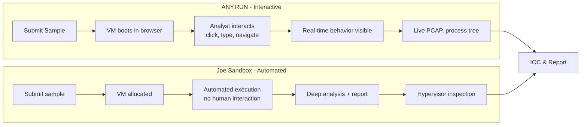
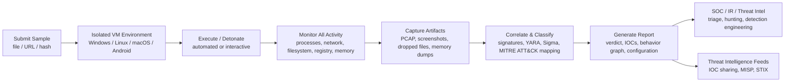
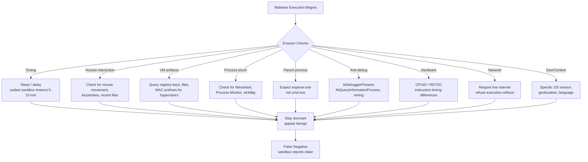
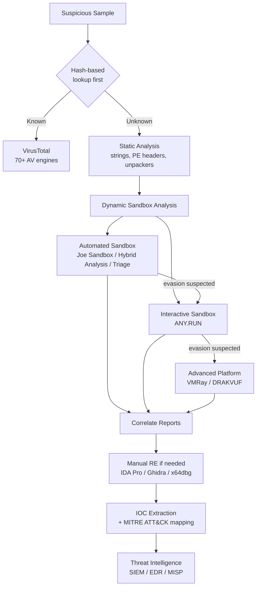

# Using Online Sandboxes (Any.Run, Joe Sandbox)
## TCM Exam Objectives
- Deploy ANY.RUN for interactive malware analysis with real-time keyboard/mouse interaction
- Use Joe Sandbox for deep automated analysis with hypervisor-based inspection
- Submit files and URLs to sandbox platforms safely, understanding OPSEC implications
- Distinguish between automated and interactive sandbox analysis approaches
- Interpret sandbox reports: behavioral signatures, MITRE ATT&CK mappings, IOCs
- Analyze network traffic captures (PCAP) from sandbox runs for C2 indicators
- Detect sandbox evasion techniques: VM artifacts, timing delays, system checks
- Apply API integration for programmatic sandbox submissions and report retrieval
- Extract and validate IOCs from sandbox outputs for threat intelligence pipelines
- Choose the appropriate sandbox platform based on malware type, analysis depth, and budget

Online sandboxes are isolated, controlled execution environments that detonate suspicious files, URLs, and scripts in a monitored virtual machine to observe their behavior — capturing network traffic, process trees, file system changes, registry modifications, and memory artifacts without risking production infrastructure.【turn0search13】【turn4search8】 They are the bridge between static analysis (what the file *is*) and full manual reverse engineering (how the code works line-by-line), providing behavioral intelligence that signature-based AV and static inspection cannot — which is why they've become an indispensable tool in SOC triage, incident response, threat intelligence, and malware research workflows.【turn0search13】【turn1search22】 For common threats (ransomware, stealers, downloaders), sandboxes effectively catch 80–95% of malicious behavior, though advanced evasive malware and APTs require a layered approach.【turn5fetch1】

📌 **Exam Tip:** For the PSAA exam, know the key differences: ANY.RUN is **interactive** (you can click, type, and interact with the sample in real-time via browser), while Joe Sandbox is **automated** (submission-to-report, no interaction). ANY.RUN excels at evasive malware requiring user interaction; Joe Sandbox excels at depth, breadth of OS support, and hypervisor-level anti-evasion. NEVER submit sensitive/classified data to public sandboxes — they are visible to adversaries.

## The Sandbox Analysis Pipeline

Every sandbox platform follows the same fundamental workflow: the analyst submits a sample, the platform executes it in an isolated VM while monitoring all activity, and the resulting behavioral data is correlated into a report with IOCs, MITRE ATT&CK mappings, and a verdict.【turn2fetch0】【turn4search6】

The critical distinction between platforms is *how* they execute and monitor — fully automated (Joe Sandbox, Hybrid Analysis, Triage) vs. interactive (Any.Run, where the analyst can click, type, and interact with the running sample in real time).【turn2fetch0】【turn0search2】 That distinction determines which evasion techniques the sandbox can defeat.

## Master Comparison of Sandbox Platforms

| Platform | Model | Key Differentiator | OS Support | Best For | Pricing |
|---|---|---|---|---|---|
| **ANY.RUN** | Cloud SaaS, interactive | Real-time browser-based interaction with running sample | Windows 7–11, Linux, Android | Evasive malware requiring user interaction; SOC triage | Free community; Hunter ~$25/mo; Enterprise quote |
| **Joe Sandbox** | Cloud + on-prem | Deep automated analysis, hypervisor-based inspection, multi-OS | Windows, macOS, Linux, Android, iOS | Enterprise threat intel, government, MSSPs | Free cloud basic; commercial quote |
📌 **Exam Tip:** When reading a sandbox report for the exam, focus on these sections in order: (1) **Verdict** — Malicious/Suspicious/Clean, (2) **MITRE ATT&CK** — maps behavior to adversary techniques, (3) **Network** — C2 domains/IPs/URLs, (4) **Process tree** — parent-child relationships showing infection chain, (5) **Dropped files** — payloads extracted, (6) **Registry** — persistence mechanisms. Cross-reference network + file + host IOCs for confidence.

| **Hybrid Analysis** | Cloud SaaS (CrowdStrike/Falcon) | Hybrid static + dynamic + network analysis; large public report repository | Windows, Linux, Android | High-volume triage, free public lookups | Free public; enterprise via CrowdStrike |
| **Triage (Hatching)** | Cloud + on-prem | Sub-60-second analysis; 400+ malware family config extraction | Windows, Linux, Android | Fast triage, config extraction, scaling to 500K analyses/day | Free community; paid tiers |
| **VirusTotal** | Cloud SaaS | 70+ AV engines + behavioral sandbox + graph analysis | Multi-OS | Hash reputation, initial triage, crowdsourced intel | Free; Enterprise quote |
| **VMRay** | Cloud + on-prem | Hypervisor-based, agentless monitoring; strongest anti-evasion | Windows, Office | Advanced evasive malware, APT analysis | Commercial quote |
| **CAPEv2** | Self-hosted (open source) | Cuckoo fork with payload extraction & config unpacking | Windows, Linux | Enterprise SOCs, CERTs needing full on-prem control | Free (self-hosted) |
| **DRAKVUF** | Self-hosted (open source) | Agentless via Xen VMI; no injected DLLs/hooks | Windows | Agent-aware malware that detects analysis tools | Free (self-hosted) |
| **CISA Malware Next-Gen** | Cloud (US government) | No-cost secure analysis for US agencies & critical infrastructure | Multi-OS | Government, critical infrastructure partners | Free (eligible orgs) |

Sources: 【turn2fetch0】【turn3fetch0】【turn0search10】【turn1search17】【turn1search18】

---

## Module 1 — ANY.RUN: Interactive Analysis

ANY.RUN's defining feature is **interactivity** — the analyst gets a browser-based remote desktop into the VM where the sample runs, and can click, type, open tabs, and interact with the malware exactly as a real user would on a normal computer.【turn0search2】【turn7fetch0】 This is the critical advantage over fully automated sandboxes: many evasion techniques specifically check for human interaction (mouse movement, keystrokes, recent files), and malware that stays dormant in automated environments often activates when a real user interacts with it.【turn2fetch0】【turn5fetch1】 ANY.RUN reports a 36% detection rate boost from live interactions that ensure full detonation of attacks missed by automated solutions, with 88% of threats revealed within 60 seconds.【turn4search0】

### Submitting a Sample

1. Click **New analysis** in the left sidebar
2. Choose **User Mode** (quick, limited VM settings — just OS version) or **Pro Mode** (full VM customization)
3. Configure the VM: OS version (Windows 7–11 32/64-bit, Ubuntu/Debian, Android 14), network settings, environment options
4. Upload the file or paste the URL
5. Press **Run a private/public analysis**【turn6fetch0】

The private/public distinction matters for OPSEC: public analyses are visible to the community and contribute to ANY.RUN's shared threat intelligence database of 6+ million samples; private analyses stay visible only to your account.【turn7fetch0】

### Interpreting the Report

Once the analysis completes, ANY.RUN presents findings across several sections:【turn6fetch0】【turn7fetch0】

**Processes** — A hierarchical process tree showing parent-child relationships, with indicators (IOCs) attached to each process. Clicking a process opens a details window with modified files, registry changes, HTTP requests, connections, network threats, loaded modules, and debug output. Process dumps are downloadable for further offline analysis.

**Network** — Monitors and records all network activity in real time:
- *HTTP Requests* — connection details including URL, response, and content
- *Connections* — non-HTTP protocols (TCP/UDP streams)
- *DNS Requests* — domain-to-IP correlations
- *Threats* — Suricata IDS rule detections
- *Network Stream* — packet-by-packet examination for C2 addresses, exfiltrated data, proxies, and downloaded files【turn6fetch0】

**Files Modification** — Lists all files touched during analysis, with static analysis (PDF, LNK, ZIP, RAR, Office documents) available for each.

**IOCs (Indicators of Compromise)** — File hashes (MD5, SHA-1, SHA-256), network IOCs (IPs, domains, URLs), and system IOCs (registry keys, processes) — all exportable for SIEM, EDR, or threat intelligence platform ingestion.【turn2fetch1】

**Malware Configuration** — For dozens of malware families, ANY.RUN automatically extracts the C2 server IP/port, family name, version, encryption keys, and anti-analysis/evasion methods — critical for attribution and detection engineering.【turn7fetch0】

**MITRE ATT&CK Matrix** — Maps observed behaviors to ATT&CK tactics and techniques, showing exactly which adversary techniques the malware employed.【turn7fetch0】

**AI Assistant** — A private AI feature that provides explanations of processes, rules, and connections when the analyst clicks the AI button next to any element.【turn7fetch0】

The full report is exportable in JSON and HTML formats for integration with ticketing systems, MISP, or internal knowledge bases.【turn7fetch0】

---

## Module 2 — Joe Sandbox: Deep Automated Analysis

Joe Sandbox is positioned at the intersection of automated behavioral analysis and forensic-grade reporting, making it a preferred choice for enterprise threat intelligence teams, MSSPs, and government agencies — used by 68 Fortune 500 companies, 98 banking/finance institutions, and 81 government organizations.【turn0search6】【turn3fetch0】 Its breadth of OS support (Windows, macOS, Linux, Android, iOS) and deep analysis capabilities distinguish it from lighter-weight platforms.【turn3fetch0】

### Submitting a Sample

Joe Sandbox Cloud Basic accepts files, emails (MSG/EML), PDFs, and URLs. The analyst selects the analysis architecture (Windows, macOS, Linux, Android, or Advanced), defines the sample source, configures settings, and accepts terms before execution.【turn0search5】

### Interpreting the Report

Joe Sandbox reports use a **score from 0–100** with a confidence percentage, classifying the sample as Malicious, Suspicious, Clean, or Unknown.【turn1search8】【turn8search0】 Key report sections include:

**Signatures** — Behavior signatures that match observed activity against known malicious patterns. Joe Security maintains signatures covering Windows, Android, macOS, and Linux, applied across operating system, memory, network, files, and screens for deep visibility.【turn9search0】

**Behavior Graph** — Execution graphs that condense control flow into a synthetic view of detected code, showing the path through the execution graph and highlighting detection-triggering stages.【turn0search9】

**Process Tree** — Hierarchical view of spawned processes and their relationships.

**AI Reasoning** — Joe Sandbox now includes AI-powered analysis reasoning alongside traditional signatures.【turn9search1】

**Malware Configuration** — Extracted C2 configurations for known families.

**Internet Activity** — Network connections, DNS queries, HTTP requests, and traffic analysis.

**Screenshots** — Visual capture of what the user would see during execution.

**Antivirus and ML** — Multi-engine AV detection plus Joe Sandbox ML (machine learning-based PE file detection that doesn't rely on signatures).【turn8search3】

### Advanced Capabilities

**Joe Sandbox Hypervisor** — A custom hypervisor implementation providing deep, stealthy introspection that's harder for malware to detect than agent-based monitoring. This addresses the evasion gap where malware detects injected DLLs or API hooks.【turn9search3】

**Internet Simulation** — Controlled network environment that provides realistic responses without actual internet connectivity, defeating evasion techniques that refuse to execute without live internet.【turn3fetch0】

**Bookmarks** — Analysts can bookmark specific behaviors or artifacts for collaboration and reporting.

---

## Module 3 — Other Major Platforms

### Hybrid Analysis (CrowdStrike Falcon Sandbox)

CrowdStrike's public-facing malware analysis portal, powered by the Falcon Sandbox engine. It represents one of the largest publicly accessible repositories of malware analysis reports, with millions of samples analyzed and freely searchable.【turn2fetch0】【turn1search10】 The "hybrid" name reflects its approach: combining static analysis, full dynamic sandbox detonation, and network-level analysis in a unified workflow.【turn2fetch0】 Hybrid Analysis combines runtime data with memory dump analysis to extract all possible execution pathways — even for highly evasive malware — making it valuable for threat intelligence teams and investigators.【turn1search14】

### Triage (Hatching)

A high-speed automated sandbox, now part of Recorded Future's ecosystem, distinguished by exceptional analysis speed (full behavioral analysis in under 60 seconds for most samples) and sophisticated malware configuration extraction covering 400+ families.【turn3fetch0】【turn1search16】 Triage can scale to 500,000 analyses per day — an unprecedented number for a sandboxing service — making it suitable for high-volume SOC and MSSP environments.【turn1search18】 It provides YARA/Sigma matches, screenshots, and PCAP files, with a free community tier that makes it a popular starting point for researchers.【turn5fetch1】

### VMRay

VMRay is the strongest anti-evasion platform, using hypervisor-based, agentless monitoring that requires no software installed inside the analyzed VM — making it inherently more resilient against agent-aware malware that detects injected DLLs or hooks.【turn2fetch0】【turn0search16】 For advanced evasive malware and APT analysis where other sandboxes produce false negatives, VMRay is the platform of choice.

### CAPEv2 (Open Source)

The most actively maintained fork of the original Cuckoo Sandbox, extensively redesigned to add payload extraction and malware configuration unpacking as first-class capabilities.【turn3fetch0】 The name stands for Configuration And Payload Extraction — its primary innovation over vanilla Cuckoo is the ability to automatically extract embedded payloads from packed or obfuscated malware and recover readable C2 configurations. Widely deployed in enterprise SOCs, national CERTs, and malware research institutions requiring full on-premise control.【turn3fetch0】

### DRAKVUF Sandbox (Open Source)

Built on the DRAKVUF binary analysis system, leveraging the Xen hypervisor's Virtual Machine Introspection (VMI) interface to perform agentless behavioral monitoring. Unlike agent-based sandboxes (Cuckoo, CAPEv2), DRAKVUF requires no software inside the analyzed VM — making it inherently more resilient against agent-aware malware.【turn3fetch0】

---

## Module 4 — Sandbox Evasion Techniques

Modern malware actively fights back against sandbox analysis using techniques cataloged under MITRE ATT&CK T1497 (Virtualization/Sandbox Evasion).【turn0search14】【turn0search15】 Understanding these is essential for evaluating sandbox robustness and interpreting false negatives.

**Timing attacks** — The most common evasion tactic. Malware sleeps for extended periods (hours or days) to outlast sandbox timeouts, which typically run 5–10 minutes. The sandbox reports no malicious behavior because the malware hasn't activated yet.【turn4search9】【turn2fetch0】

**Human-interaction checks** — Malware waits for mouse movement, keyboard input, or recent files in the user profile. Automated sandboxes lack realistic user simulation, so the malware stays dormant. This is exactly the gap ANY.RUN's interactive model addresses — the analyst provides real human interaction that triggers the malicious behavior.【turn5fetch1】【turn0search2】

**VM artifact detection** — Querying registry keys, files, or MAC address prefixes specific to hypervisors (VMware, VirtualBox, Hyper-V). If artifacts are found, the malware aborts or behaves benignly.【turn2fetch0】【turn0search16】

**Process enumeration** — Checking for analysis tools (Wireshark, Process Monitor, x64dbg, ollydbg). If detected, the malware exits.【turn2fetch0】

**Parent process validation** — Expecting `explorer.exe` as the parent process rather than `cmd.exe` or a sandbox agent. Sandboxes that launch samples via command line fail this check.【turn2fetch0】

**Anti-debugging** — Using `IsDebuggerPresent`, `NtQueryInformationProcess`, or timing discrepancies to detect debuggers and analysis hooks.【turn2fetch0】

**CPUID & RDTSC-based VM detection** — Leveraging instruction timing differences between physical and virtualized hardware to identify hypervisor presence.【turn2fetch0】

**Network connectivity checks** — Refusing to execute without live internet access, or checking for specific network configurations that indicate a sandbox.【turn2fetch0】

**Context-aware behavior** — Only activating on specific OS versions, geolocations, or after certain triggers (specific date, domain-joined machine, etc.).【turn5fetch1】

The consequence: sophisticated malware (APTs, zero-days, custom campaigns) may appear benign in a sandbox, producing false negatives that mislead analysts into classifying malicious files as clean.【turn5fetch1】

---

## Module 5 — Limitations and OPSEC Considerations

### Analytical Limitations

**False negatives from evasion** — As described above, evasive malware can produce clean reports. A single sandbox result of "clean" is never definitive proof of safety for sophisticated threats.【turn5fetch1】

**Time-boxed execution** — Most sandboxes run for 5–10 minutes. Malware with delayed execution (sleep loops, scheduled tasks, multi-stage loaders with time gaps) may not fully detonate within the observation window.【turn4search9】

**Environment fingerprinting gaps** — Even advanced sandboxes have artifacts that malware can detect. No sandbox is completely invisible to a sufficiently sophisticated attacker.【turn0search16】

**Public sample visibility** — Public sandbox submissions are visible to the community and, critically, to the attackers themselves. Adversaries monitor public sandboxes (VirusTotal, Hybrid Analysis, ANY.RUN public) to detect when their malware has been discovered — using API monitoring or wrappers around the web GUI. If a sample appears in a public sandbox before the adversary expected detection, they may rotate infrastructure or accelerate the attack.【turn4search13】【turn4search12】

### OPSEC Best Practices

**Hash-based lookups first** — The non-negotiable foundation of investigative privacy. Query global threat databases using file hashes (SHA-256) rather than uploading the actual file. This "read-only" method provides access to collective intelligence while keeping the sample within the local protected environment.【turn4search12】【turn4search13】

**Private submissions for sensitive samples** — When analyzing samples from an active incident or targeted attack, use private analysis mode (ANY.RUN private, Joe Sandbox on-prem, CAPEv2 self-hosted) rather than public submission. This prevents adversary monitoring from detecting your investigation.【turn4search13】

**Simulated internet vs. live internet** — Internet connectivity on a sandbox can be a risk. If malware beacons to a C2 server during analysis, the attacker may see the sandbox's IP and recognize they're being analyzed. Use simulated internet (Joe Sandbox's Internet Simulation) when possible, or controlled network environments that don't expose the sandbox's real IP to attacker infrastructure.【turn4search13】

**Data leakage awareness** — Sandboxes with live internet may exfiltrate sensitive data embedded in the sample (document contents, internal URLs, credentials) to attacker C2 servers. For samples containing potentially sensitive organizational data, use isolated or on-premise sandboxes without internet connectivity.【turn4search13】

---

## Module 6 — Best Practices: A Layered Approach

No single sandbox is a silver bullet. The mature analysis strategy layers multiple platforms and techniques to maximize coverage and minimize false negatives.【turn5fetch1】

**Use multiple sandboxes** — Different platforms catch different behaviors. A sample that appears clean in one sandbox may detonate fully in another due to differences in VM configuration, monitoring approach, and evasion resistance. The recommended combination: Triage or Hybrid Analysis for fast automated triage + ANY.RUN for interactive analysis of evasive samples + VMRay or DRAKVUF for advanced evasive malware.【turn5fetch1】

**Combine static and dynamic analysis** — Static analysis (strings, PE headers, import tables, unpackers) provides early insights and can flag packed or obfuscated code that dynamic analysis needs to unpack. Use both for complete coverage — static flags potential threats for deeper inspection, dynamic confirms and expands on the findings.【turn1search23】【turn1search21】

**Use interactive modes for evasion** — When automated sandboxes produce clean reports but the sample is suspected malicious (based on source, context, or static indicators), switch to an interactive sandbox like ANY.RUN where human interaction can trigger dormant behavior.【turn5fetch1】

**Verify IOCs manually** — Sandbox-extracted IOCs should be verified before being pushed to production blocklists, as sandboxes can produce false positives or capture benign network connections that look suspicious in isolation.【turn5fetch1】

**Escalate to manual reverse engineering when needed** — For sophisticated threats that defeat automated analysis, escalate to manual RE with IDA Pro, Ghidra, or x64dbg. Sandboxes provide the behavioral roadmap; manual RE provides the code-level understanding.【turn5fetch1】

---

## Recap

Online sandboxes are isolated execution environments that detonate suspicious samples in monitored VMs to capture behavioral intelligence — spanning fully automated platforms (Joe Sandbox, Hybrid Analysis, Triage) and interactive platforms (ANY.RUN) where analysts can trigger evasive behavior through real user interaction.【turn0search13】【turn0search2】 The core capabilities shared across all mature sandboxes include dynamic analysis, static analysis, network traffic capture, process tree reconstruction, registry/filesystem monitoring, memory analysis, YARA/Sigma rule matching, and MITRE ATT&CK mapping.【turn2fetch0】 ANY.RUN's interactive model provides a 36% detection rate boost by defeating human-interaction evasion checks, with report sections covering processes, network (HTTP/connections/DNS/threats), file modifications, IOCs, malware configuration, and ATT&CK matrix.【turn4search0】【turn7fetch0】 Joe Sandbox offers deep automated analysis with a 0–100 score, behavior signatures, hypervisor-based inspection, and multi-OS support, making it the enterprise choice for government and financial sector threat intelligence.【turn0search6】【turn9search3】 All sandboxes face evasion techniques (timing attacks, VM artifact detection, human-interaction checks, anti-debugging, context-aware behavior cataloged under MITRE T1497) that can produce false negatives — meaning no single sandbox result of "clean" is definitive for sophisticated threats.【turn0search14】【turn5fetch1】 The mature analysis strategy layers multiple sandboxes (Triage for speed + ANY.RUN for interaction + VMRay for anti-evasion), combines static and dynamic analysis, uses hash-based lookups first for OPSEC, submits sensitive samples privately to avoid adversary monitoring, and escalates to manual reverse engineering when automated analysis is insufficient — with the understanding that sandboxes are the essential first step in malware analysis but not the final word for advanced threats.【turn5fetch1】【turn4search13】