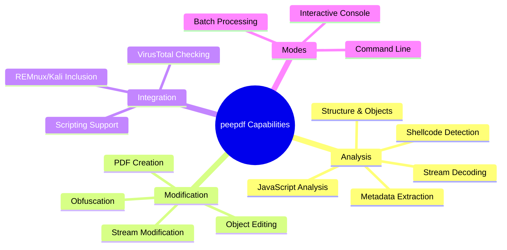
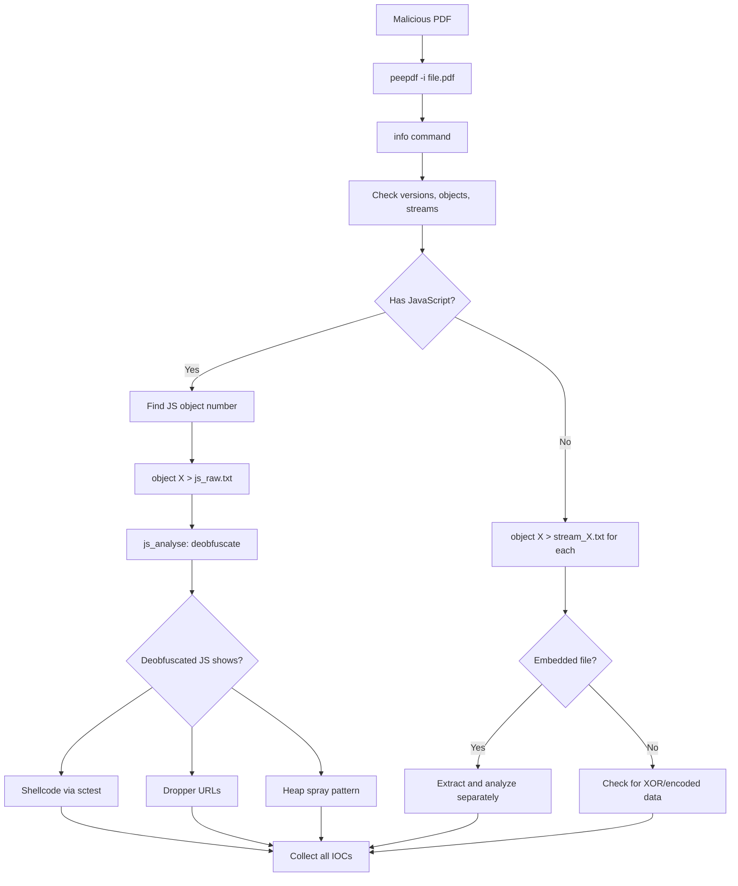
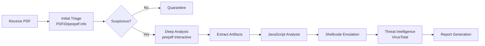

---
tags: [tool]
---
# 🔍 Full-Stack Lesson: Analyzing PDFs with peepdf


## TCM Exam Objectives
- Install peepdf and configure for static PDF malware analysis
- Navigate the interactive peepdf console using essential commands (info, tree, object, stream)
- Extract and decode PDF streams and objects to reveal embedded content
- Analyze embedded JavaScript using js_analyse, js_eval, and js_unescape
- Detect and extract shellcode from PDF objects using sctest emulation
- Identify suspicious PDF characteristics: multiple versions, obfuscated objects, high entropy
- Apply PDFiD for initial triage before deep analysis with peepdf
- Use peepdf's VirusTotal integration for hash reputation checking
- Understand PDF structure: header, body, cross-reference table, trailer
- Combine peepdf with pdf-parser and other tools for comprehensive PDF forensics

# 🔍 Full-Stack Lesson: Analyzing PDFs with peepdf

## 📚 1. Introduction to peepdf

**peepdf** is a powerful Python-based tool designed for **static analysis of PDF files**, particularly useful for security researchers, malware analysts, and forensic investigators. It helps identify potentially malicious content within PDF documents by examining their structure, objects, streams, and embedded JavaScript 【turn0search1】【turn0search3】.



📌 **Exam Tip:** The peepdf analysis workflow for the exam: (1) `peepdf -i file.pdf` to start interactive mode, (2) `info` for metadata and structure, (3) `tree` for object hierarchy, (4) `object X > decoded_stream.txt` to extract stream content, (5) `js_analyse` for JavaScript deobfuscation. The key command flags are `-i` (interactive), `-f` (force parse), and `-l` (log file).



## 🛠️ 2. Installation & Setup

### Prerequisites
- Python 2.7 or Python 3.x (peepdf-3 for Python 3) 【turn0search4】
- Required Python packages: `jsbeautifier`, `colorama`, `pythonaes`, `lxml` 【turn0search11】
- Optional but recommended: `PyV8` (for JavaScript analysis), `Pylibemu` (for shellcode analysis) 【turn0search3】

### Installation Methods

<details>
<summary>🔧 Detailed Installation Steps</summary>

#### Method 1: Using pip (Recommended for Python 3)
```bash
# Install peepdf-3 for Python 3
pip install peepdf-3

# Verify installation
peepdf --version
```

#### Method 2: Manual Installation from Source
```bash
# Clone the repository
git clone https://github.com/jesparza/peepdf.git
cd peepdf

# Install dependencies
sudo apt-get install python-pyrex  # On Debian/Ubuntu
sudo pip install jsbeautifier colorama pythonaes lxml

# Optional: Install PyV8 for JavaScript analysis
svn checkout http://python-spidermonkey.googlecode.com/svn/trunk/ python-spidermonkey
cd python-spidermonkey
python setup.py build
sudo python setup.py install
sudo ldconfig

# Install peepdf
sudo python setup.py install
```

#### Method 3: Using Security Distributions
peepdf is pre-installed on:
- **REMnux** (malware analysis distribution) 【turn0search2】【turn0search7】
- **Kali Linux** (penetration testing distribution) 【turn0search7】【turn0search11】
- **BackTrack 5** 【turn0search7】
</details>

## 🎯 3. Core Analysis Workflow

### Basic Command Structure
```bash
# Basic analysis
peepdf suspicious_file.pdf

# Interactive mode (recommended for detailed analysis)
peepdf -i suspicious_file.pdf

# Force mode (ignore parsing errors)
peepdf -f suspicious_file.pdf

# Check VirusTotal hash
peepdf -c suspicious_file.pdf
```

### Understanding the Output
When you run peepdf on a PDF file, it provides:
- **File metadata** (MD5, SHA1, size, version)
- **Encryption status**
- **Object count and stream information**
- **Suspicious elements** (highlighted in red)
- **JavaScript objects**
- **Errors and warnings**

## 📊 4. Key Commands & Features

### 4.1 Essential Interactive Commands

| Command | Description | Example |
|---------|-------------|---------|
| `info` | Shows file information and suspicious elements | `PPDF> info` |
| `tree` | Displays logical structure of PDF | `PPDF> tree` |
| `offsets` | Shows physical structure with byte offsets | `PPDF> offsets` |
| `object <id>` | Shows decoded object content | `PPDF> object 1` |
| `rawobject <id>` | Shows raw (undecoded) object | `PPDF> rawobject 1` |
| `stream <id>` | Shows decoded stream content | `PPDF> stream 13` |
| `rawstream <id>` | Shows raw stream content | `PPDF> rawstream 13` |
| `metadata` | Shows PDF metadata | `PPDF> metadata` |
| `references` | Shows object references | `PPDF> references to 12` |
| `changelog` | Shows document modifications | `PPDF> changelog` |

### 4.2 JavaScript Analysis Commands
 

```bash
# Analyze JavaScript in object 13
PPDF> js_analyse object 13

# Evaluate JavaScript expression
PPDF> js_eval "unescape('%u4343')"

# Join JavaScript strings
PPDF> js_join variable aux

# Unescape JavaScript strings
PPDF> js_unescape variable aux

# Show JavaScript variables
PPDF> js_vars
```

### 4.3 Shellcode Analysis
 

```bash
# Emulate shellcode execution (requires pylibemu)
PPDF> sctest

# Search for XOR patterns
PPDF> xor_search

# Search for bytes
PPDF> bytes
```

## 🚀 5. Practical Analysis Examples

### Example 1: Analyzing a Suspicious PDF
```bash
# Start interactive analysis
peepdf -i suspicious.pdf

# 1. Get file information
PPDF> info

# 2. View logical structure
PPDF> tree

# 3. Examine suspicious objects (usually objects with JavaScript)
PPDF> object 5

# 4. Decode and view stream content
PPDF> stream 13

# 5. Analyze JavaScript code
PPDF> js_analyse object 13

# 6. Extract shellcode for further analysis
PPDF> stream 13 > shellcode.bin
```

### Example 2: Extracting Embedded Objects
```bash
# List all objects
PPDF> offsets

# Extract specific object to file
PPDF> object 11 > extracted_object.txt

# Extract stream to file
PPDF> stream 13 > javascript_code.js

# Extract all streams (batch mode)
for i in $(seq 1 20); do peepdf -s "stream $i > stream_$i.bin" suspicious.pdf; done
```

### Example 3: VirusTotal Integration
```bash
# Check file hash on VirusTotal
peepdf -c suspicious.pdf

# Output will include:
# - Detection ratio
# - AV engines detecting the file
# - First seen date
# - File classification
```

## 🔍 6. Advanced Analysis Techniques

### 6.1 Analyzing Obfuscated JavaScript
```bash
# 1. Identify objects with JavaScript
PPDF> info

# 2. Extract JavaScript for analysis
PPDF> stream 5 > obfuscated.js

# 3. Use js_analyse to deobfuscate
PPDF> js_analyse object 5

# 4. Manual deobfuscation with js commands
PPDF> js_eval "var x = 'obfuscated_code'; x.replace(/pattern/g, 'replacement');"

# 5. Extract final payload
PPDF> js_vars
PPDF> js_vars payload
```

### 6.2 Multi-Version Analysis
```bash
# Check if PDF has multiple versions
PPDF> changelog

# Extract specific version
PPDF> save_version 0 original_version.pdf

# Compare versions
diff <(peepdf -s 'object 1' version0.pdf) <(peepdf -s 'object 1' version1.pdf)
```

### 6.3 Batch Processing Multiple Files
```bash
# Create analysis script (analyze.scr)
echo "info
tree
object 5
stream 13
quit" > analyze.scr

# Run on multiple files
for pdf in *.pdf; do
    echo "=== Analyzing $pdf ===" >> analysis_report.txt
    peepdf -s analyze.scr "$pdf" >> analysis_report.txt
done
```

## 📈 7. peepdf vs. Other PDF Analysis Tools

| Feature | peepdf | PDFiD | pdf-parser | PDF Stream Dumper |
|---------|--------|-------|------------|-------------------|
| **Interactive Mode** | ✅ | ❌ | ❌ | ✅ |
| **JavaScript Analysis** | ✅ | Basic | Basic | ✅ |
| **Shellcode Emulation** | ✅ | ❌ | ❌ | ❌ |
| **Object Modification** | ✅ | ❌ | Limited | ❌ |
| **VirusTotal Integration** | ✅ | ❌ | ❌ | ❌ |
| **Learning Curve** | Moderate | Easy | Moderate | Easy |
| **Best For** | Deep analysis | Quick triage | Parsing | Stream extraction |

📌 **Exam Tip:** Key PDF indicators of compromise for the exam: (1) `/JavaScript` or `/JS` in the tree (embedded script), (2) `/OpenAction` referencing a JS object (auto-execute on open), (3) Multiple versions in the PDF (indicates incremental malicious injection), (4) High entropy streams (packed shellcode), (5) `/AA` or `/Annots` with embedded actions (auto-execute triggers).

> 💡 **Pro Tip**: Use **PDFiD** for initial triage, then **peepdf** for deep-dive analysis, and **pdf-parser** for specific object extraction. This multi-tool approach provides comprehensive coverage 【turn0search9】【turn0search10】.

## 🛡️ 8. Security Considerations & Best Practices

### Safe Analysis Environment
 

1. **Isolated Environment**: Always analyze malicious PDFs in an isolated VM
2. **Network Disabling**: Disable network access during analysis
3. **Snapshot Creation**: Create VM snapshots before analysis
4. **Limited Permissions**: Run peepdf with limited user permissions

### Analysis Workflow


## 📝 9. Troubleshooting Common Issues

<details>
<summary>❓ Frequently Asked Questions</summary>

**Q: peepdf fails to parse a PDF with errors. What should I do?**
A: Use the force mode (`-f`) to ignore parsing errors. For severe issues, try loose mode (`-l`) to catch malformed objects.

**Q: JavaScript analysis isn't working. What's wrong?**
A: Ensure PyV8 is properly installed. On some systems, you may need to install `python-spidermonkey` separately.

**Q: How do I extract all streams from a PDF?**
A: Use batch mode with a script:
```bash
echo "stream 1 > stream1.bin
stream 2 > stream2.bin
quit" > extract.scr
peepdf -s extract.scr suspicious.pdf
```

**Q: The output is too verbose. Can I filter it?**
A: Use grep or awk to filter output. For structured data, use XML output (`-x`):
```bash
peepdf -x suspicious.pdf | grep -A 5 "Suspicious"
```

**Q: How do I analyze encrypted PDFs?**
A: peepdf can handle some encrypted PDFs. If password-protected, you'll need the password or use tools like `pdfcrack` first.
</details>

## 🎓 10. Learning Resources & Next Steps

### Official Documentation
- **GitHub Wiki**: [Commands documentation](https://github.com/jesparza/peepdf/wiki/Commands) 【turn0search5】
- **Project Page**: [eternal-todo.com](https://eternal-todo.com/tools/peepdf) 【turn0search3】
- **Black Hat Presentations**: [PDF Analysis materials](https://blackhat.com/docs/eu-15/materials/eu-15-Esparza-peepdf.pdf) 【turn0search0】

### Practice Materials
- **Malware Samples**: [Contagio Malware Dump](https://contagiodump.blogspot.com/) 【turn0search2】
- **Challenges**: [Black Hat Arsenal peepdf challenge](https://eternal-todo.com/blog/black-hat-arsenal-peepdf-challenge) 【turn0search3】
- **Test PDFs**: Create your own with JavaScript and streams for practice

### Advanced Topics to Explore
1. **PDF Exploit Development**: Understanding common vulnerabilities (CVE-2013-2729, etc.)
2. **Shellcode Analysis**: Using libemu and other emulators
3. **PDF Forensics**: Document authentication and tampering detection
4. **Automation**: Integrating peepdf into analysis pipelines

## 💎 Conclusion

peepdf is an **indispensable tool** for PDF forensic analysis, offering a comprehensive suite of features for examining suspicious documents. Its **interactive console**, **JavaScript analysis capabilities**, and **VirusTotal integration** make it particularly valuable for malware analysts and security researchers 【turn0search2】【turn0search3】【turn0search7】.

By mastering peepdf, you'll be equipped to:
- ✅ Identify malicious PDFs through static analysis
- ✅ Extract and analyze embedded JavaScript and shellcode
- ✅ Understand PDF structure and object relationships
- ✅ Integrate with other tools for comprehensive analysis
- ✅ Contribute to threat intelligence through VirusTotal integration

Remember that **no single tool is perfect**. Combine peepdf with other tools like PDFiD, pdf-parser, and dynamic analysis sandboxes for comprehensive PDF analysis 【turn0search9】【turn0search10】. Always practice safe analysis procedures in isolated environments when handling potentially malicious files.

> ⚠️ **Final Tip**: The PDF specification is complex, and attackers continually find new ways to exploit it. Stay updated with the latest peepdf releases and PDF security research to keep pace with evolving threats.