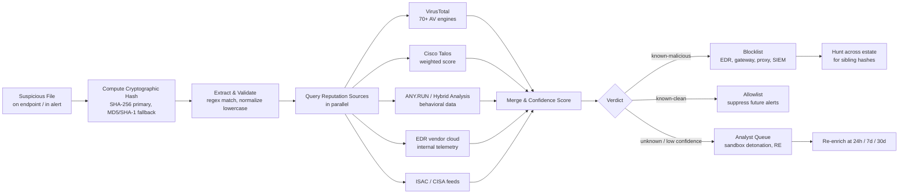
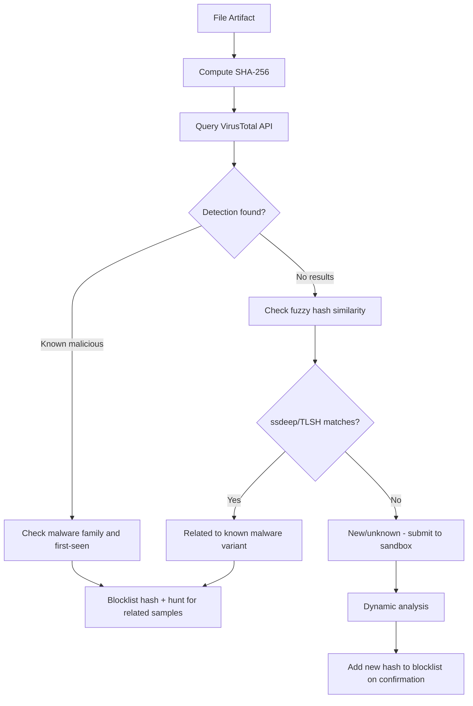
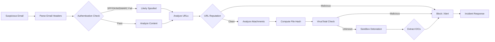

# File Hashing and Reputation Checks
## TCM Exam Objectives
- Compute and compare cryptographic hashes (MD5, SHA-1, SHA-256) for file identification
- Understand why SHA-256 is the current standard and MD5/SHA-1 are broken for security purposes
- Query file reputation via VirusTotal, Cisco Talos, and ANY.RUN for instant threat context
- Apply fuzzy hashing (ssdeep, TLSH, imphash) for similarity detection of polymorphic malware
- Build automated hash enrichment pipelines with caching, confidence scoring, and re-enrichment
- Integrate hash reputation with SOAR playbooks for alert enrichment and triage
- Create YARA rules to complement hash-based detection with pattern matching
- Understand the limitations of hash-based detection against polymorphic and metamorphic malware
- Apply hash reputation for allowlisting, blocklisting, and threat hunting operations
- Maintain OPSEC when submitting hashes to third-party reputation services

File hashing produces a fixed-length cryptographic fingerprint of a file that serves as a unique identifier for integrity verification and malware classification, and reputation checks query that fingerprint against threat intelligence databases to instantly determine whether a file is known-malicious, known-clean, or unknown — a single API call that can convert a noisy endpoint alert into a fully contextualized incident with malware family, detection ratio, first-seen date, and associated infrastructure.【turn0search11】【turn2fetch0】 Hashing is the foundation of signature-based detection and IOC-driven defense; reputation lookup is how that foundation gets operationalized at SOC speed.

## The Hash-to-Verdict Pipeline

The workflow from a suspicious file on an endpoint to an actionable verdict follows a predictable pipeline: extract the hash, query reputation sources, merge results with confidence scoring, and route the verdict to prevention controls or analyst queues.【turn2fetch0】【turn3fetch0】

The dotted feedback lines show the lifecycle nature: unknown hashes get re-queried over time because a sample that is unknown today may light up tomorrow as vendors catch up, and confirmed-malicious hashes feed back into blocklists and hunt queries across the environment.【turn3fetch0】

## Master Comparison: Hashing Algorithms

Cryptographic hash functions are one-directional mathematical operations that are quick to calculate yet hard to reverse — they produce a fixed-length digest for any input, where even a single-byte change in the input produces a completely different output (the avalanche effect).【turn0search10】【turn4search0】【turn4search1】

📌 **Exam Tip:** For the PSAA exam, memorize these hash facts: MD5 = 128 bits (32 hex chars, BROKEN), SHA-1 = 160 bits (40 hex chars, DEPRECATED), SHA-256 = 256 bits (64 hex chars, CURRENT STANDARD). SHA-256 is always the correct answer for integrity verification and malware identification. Fuzzy hashes (ssdeep, TLSH) are used for similarity clustering of polymorphic variants.

📌 **Exam Tip:** For the PSAA exam, remember: SHA-256 is always the correct answer for file integrity/identification. MD5 and SHA-1 are deprecated due to collision attacks. Fuzzy hashing (ssdeep, TLSH, imphash) is used when exact hash matching fails — it finds "close" matches for polymorphic malware variants. The most common sandbox evasion against hash detection is code polymorphism (changing the hash with each infection).

| Algorithm | Output Length | Security Status | Collision Resistance | Speed | Primary Use Case in 2026 |
|---|---|---|---|---|---|
| **MD5** | 128 bits (32 hex chars) | **Broken** — collisions found | Vulnerable to collision attacks | Very fast | Legacy malware database lookup key, quick checksums — NOT for security purposes【turn0search0】【turn0search3】 |
| **SHA-1** | 160 bits (40 hex chars) | **Deprecated** — SHAttered collision demonstrated 2017 | Broken (practical collision by Google) | Fast | Legacy systems, older threat intel reports — being phased out【turn0search3】 |
| **SHA-256** | 256 bits (64 hex chars) | **Secure** — current standard | Strong collision resistance | Moderate | Primary hash for malware identification, file integrity, digital signatures【turn0search1】【turn4search3】 |
| **SHA-3** | Variable (224–512 bits) | **Secure** — latest standard | Strong (different construction from SHA-2) | Moderate | Enhanced resistance, future-proofing against SHA-2 cryptanalysis【turn0search1】 |
| **SSDeep** | Variable | Contextual (similarity) | N/A — fuzzy hash | Fast | Malware variant clustering, similarity detection【turn1search5】【turn1search7】 |
| **TLSH** | Variable | Contextual (similarity) | N/A — fuzzy hash | Fast | Malware clustering, distance-based similarity【turn1search5】 |
| **imphash** | 128 bits (MD5 of imports) | Contextual (behavioral) | N/A — structural hash | Fast | Malware family classification by import table【turn1search5】 |

Sources: 【turn0search0】【turn0search1】【turn0search3】【turn1search5】【turn4search3】

**Why MD5 and SHA-1 are still everywhere despite being broken.** MD5 and SHA-1 remain widely used in threat intelligence platforms and malware databases as *lookup keys* — not for security assertions. VirusTotal, ANY.RUN, and most EDR platforms accept MD5, SHA-1, and SHA-256 for queries because legacy reports and older samples use them. The security risk arises when MD5 or SHA-1 are used for *integrity verification or digital signatures* — contexts where an attacker can craft a collision to bypass checks. For new malware identification and integrity verification, SHA-256 is the standard.【turn0search3】【turn0search2】

### Cryptographic Properties That Make Hashing Work

A secure cryptographic hash function exhibits four properties that make it suitable for malware identification:【turn0search10】【turn4search0】【turn4search4】

- **Deterministic** — the same input always produces the same output, so the same file hashed anywhere yields the same fingerprint
- **Fixed output size** — regardless of input size (1 KB or 10 GB), the digest is always the same length (64 hex characters for SHA-256)
- **One-way (preimage resistance)** — computationally infeasible to reverse the hash to recover the original input
- **Avalanche effect** — a single-bit change in the input produces a drastically different output, making tampering immediately detectable

These properties are why a SHA-256 hash serves as a reliable file fingerprint: two files with the same SHA-256 hash are, for practical purposes, the same file.

---

## Module 1 — Fuzzy Hashing and Similarity Detection

Traditional cryptographic hashes detect *exact matches* — change a single bit and the hash is completely different. This makes them brittle against polymorphic and metamorphic malware, which deliberately mutates its code on each replication to evade signature-based detection.【turn1search5】【turn0search15】 Fuzzy hashing was introduced to address this brittleness by producing similarity digests that can identify *related* malware variants even when the code has been modified.

**SSDeep** — the most widely used fuzzy hash, produces a similarity digest that allows comparison between files. Two files with similar code produce similar ssdeep hashes, enabling analysts to cluster malware variants and identify novel threats with low overhead.【turn1search5】【turn1search7】

**TLSH** — another similarity hashing algorithm that produces distance-based comparisons, often used alongside ssdeep for clustering analysis. Research evaluating ssdeep, TLSH, and imphash as features for unsupervised K-Means clustering found all three effective for malware variant grouping.【turn1search5】

**imphash (import hash)** — an MD5 hash computed over the import table of a Portable Executable file. Two binaries with the same import table produce the same imphash, making it valuable for malware family classification — malware authors tend to reuse import patterns across variants of the same family.【turn1search5】

**Dexofuzzy** — a fuzzy hash for Android malware based on opcode sequences in Dalvik executable files, used for similarity clustering of Android malware variants.【turn1search8】

Fuzzy hashes are the bridge between exact-match signature detection (which polymorphic malware defeats) and behavioral analysis (which requires detonation). They enable threat hunters to take a known-bad sample, compute its fuzzy hash, and search the environment for *similar* files that may be mutated variants of the same family.【turn1search9】

---

## Module 2 — Reputation Check Services

A file hash reputation lookup takes a cryptographic fingerprint and returns everything the queried service knows about it. Strong reputation records typically include:【turn2fetch0】

- **Detection statistics** — how many antivirus engines flag the file, and as what families
- **First seen / last seen** — when the file was first observed in the wild and its most recent sighting
- **File metadata** — file type, size, compiled language, digital signature state
- **Behavioral data** — sandbox-derived process trees, network indicators, persistence mechanisms, dropped children
- **Associated infrastructure** — domains, IPs, and URLs the sample communicates with
- **Campaign and actor attribution** — links to known operations or threat groups when available
- **Community comments and votes** — analyst-contributed notes on platforms that support them

### VirusTotal (Google Threat Intelligence)

The "Kleenex" of file reputation — VirusTotal aggregates results from 70+ antivirus engines, web scanners, and file/URL analysis tools, claiming ~50 billion files and ~1.8 million daily submissions.【turn2fetch1】【turn1search2】 A file object's ID is its SHA-256 hash, and the platform provides search filters for querying by hash, filename, file type, digital signature, and many other attributes.【turn0search8】【turn1search1】 VirusTotal acts as an aggregator — it doesn't promote any single engine but provides objective, unbiased results from many detection engines covering heuristic engines, known-bad signatures, metadata extraction, and behavioral analysis.【turn1search2】 The API v3 enables programmatic integration with Splunk SOAR, XSOAR, CrowdStrike, Chronicle SOAR, and other security platforms for automated enrichment.【turn1search0】

### Cisco Talos File Reputation

Talos provides a file reputation lookup that returns the reputation, file name, weighted reputation score, and detection information for a given SHA-256 hash — a single-score approach that simplifies verdict decisions compared to VirusTotal's multi-engine display.【turn0search9】

### ANY.RUN Threat Intelligence Lookup

ANY.RUN's TI Lookup centralizes IOCs extracted from interactive malware analysis sessions — a database of 50+ million threats contributed by 15,000 SOCs and 600,000 analysts. It provides rich contextual data including events, TTPs, and IOCs with relationships, accessible through a web interface or API for integration with security solutions.【turn0search5】【turn0search6】

### Hybrid Analysis (CrowdStrike Falcon Sandbox)

A public-facing malware analysis portal that combines static analysis, dynamic sandbox detonation, and network-level analysis. It represents one of the largest publicly accessible repositories of malware analysis reports, freely searchable by hash.【turn2fetch1】

### Other Reputation Sources

- **MetaDefender (OPSWAT)** — multi-engine AV scanning with a community edition【turn2fetch1】
- **Stairwell** — file analysis and IOC lookup platform focused on retrospective analysis【turn1search16】
- **Spectra Intelligence (ReversingLabs)** — commercial file reputation with large malware database【turn2fetch1】
- **EDR vendor clouds** — CrowdStrike, SentinelOne, Microsoft Defender — vendor-specific telemetry, often the highest-confidence source for your environment because it reflects what your endpoints actually see【turn2fetch0】
- **Internal telemetry** — your own EDR, mail gateway, and sandbox history【turn2fetch0】

A mature enrichment pipeline does not rely on a single source. Each source has latency, coverage, and quality trade-offs that should be weighted in enrichment logic so high-confidence sources take precedence.【turn2fetch0】

---

## Module 3 — Building an Automated Hash Enrichment Pipeline

A reliable pipeline handles the full lifecycle of hash enrichment across six stages:【turn2fetch0】【turn3fetch0】

**1. Hash extraction** — Alerts, tickets, emails, and reports arrive in many formats. The pipeline must extract hashes cleanly using regex for each algorithm (`^[a-fA-F0-9]{32}$` for MD5, `{40}` for SHA-1, `{64}` for SHA-256), then validate against expected content to avoid false positives — random 64-character hex strings are not always hashes. Normalize aggressively: lowercase hex, strip whitespace, deduplicate, because inconsistent casing is a surprisingly frequent cause of missed matches in enterprise environments.

**2. Query routing** — Different sources accept different hash types. Maintain a routing layer that sends the right hash to each source, cross-mapping when a source prefers one algorithm over another. Where a source returns additional hashes (SHA-256 when you queried with MD5), store them for future use.

**3. Caching with short TTLs** — Hash reputation changes over time; a sample that is unknown today may light up tomorrow. Cache reduces API load and cost but should respect freshness tolerance:
- Known-malicious verdicts: long TTL (days or weeks) — stable
- Known-clean or unknown verdicts: short TTL (hours) — likely to change
- Behavioral data: medium TTL — re-query when new sandbox analysis is suspected

**4. Confidence scoring and merging** — When multiple sources disagree, merge intelligently with weighted confidence:
- Confirmed-malicious with multiple vendors: high confidence
- Reputation marker but no consensus: medium confidence, flag for analyst review
- Unknown in all sources: low confidence, rely on behavioral signals

**5. Attachment to alerts and tickets** — Write the enrichment result back onto the source alert in a consistent format. Analysts should see, at a glance: hash, file family, detection ratio, first-seen date, associated infrastructure, and confidence level.

**6. Re-enrichment over time** — Low-confidence or unknown hashes deserve follow-up. Automate re-queries at 24 hours, 7 days, and 30 days. A sample that was unknown on day zero often becomes a confirmed-malicious IOC by day seven as vendors catch up.

---

## Module 4 — SOC Workflow Integration

### Alert Enrichment and Triage

During active incident response, hash reputation lookups accelerate every major step. When the first sign of compromise is an unfamiliar executable on one endpoint, a hash lookup tells you whether it is known malicious, the likely family, and what other indicators typically accompany it — informing immediate hunt queries across the environment for sibling files. Confirmed-malicious hashes feed directly into prevention controls: EDR blocklists, email gateway quarantine, web proxy denials, and SIEM rules. The faster this happens after confirmation, the narrower the incident window.【turn3fetch0】

### Allowlisting and Blocklisting

Application allowlisting (per NIST SP 800-167) is a list of applications and application components authorized to be present or active on a host according to a well-defined baseline — any program not specifically allowlisted is automatically blocklisted.【turn4search6】 EDR platforms maintain both allowlists (preventing tickets from triggering for known-safe processes, stopping telemetry collection) and blocklists (actively blocking execution of unsafe or non-trusted processes).【turn4search5】 Hash reputation feeds both: known-clean hashes go to the allowlist to suppress noise; known-malicious hashes go to the blocklist for active prevention.【turn4search8】

### SOAR Playbook Integration

SOAR platforms orchestrate hash reputation workflows. A typical alert-enrichment playbook:【turn3fetch0】
1. Receive alert
2. Extract and validate hashes
3. Query each configured reputation source in parallel
4. Merge results with confidence weighting
5. Query infrastructure reputation for any associated domains or IPs
6. Attach merged enrichment to the ticket
7. Auto-route based on outcome: known-malicious → high priority, unknown → analyst queue, benign → close with annotation

Well-designed playbooks cut analyst time per alert dramatically and free them to focus on genuinely ambiguous cases.

### Threat Hunting

Proactive threat hunting uses hash reputation as both starting point and pivot:【turn3fetch0】
- **Rare-hash hunting** — enumerate hashes present on only one or two endpoints; query reputation for each; escalate any with suspicion signals
- **Unsigned-binary hunting** — focus on executables without valid digital signatures; prioritize those with unknown or suspicious reputation
- **Campaign pivot** — take a single known-bad hash, retrieve campaign tags, enumerate all associated hashes, and hunt each across the estate
- **Infrastructure pivot** — start from a confirmed-malicious IP or domain, enumerate samples that communicate with it, and track those hashes down to endpoints

### Automated IOC Sweeps

File hash search agents automate IOC sweeps across endpoints — taking a feed of known-malicious hashes (from a threat report, a CISA advisory, or an ISAC bulletin) and querying every endpoint for matches, accelerating threat response and improving visibility across teams.【turn1search18】

---

## Module 5 — YARA Rules: Pattern Matching Beyond Hashes

YARA rules are pattern-matching definitions used by malware analysts and detection engineers to identify files belonging to a specific malware family or exhibiting specific suspicious traits, based on text strings, byte sequences, or boolean conditions.【turn1search11】 Each rule contains a name, an optional metadata block, a strings section defining the patterns to match, and a condition section specifying which combination constitutes a hit — making YARA the de facto standard for static file classification in malware research, threat intelligence, and incident response.【turn1search11】

YARA complements hash-based detection because it matches *patterns* rather than exact fingerprints — a single YARA rule can detect an entire malware family across many variants, where hash-based detection requires a separate entry for every single sample. YARA rules can incorporate hash matches (including imphash) as one condition among many, combining exact-match and pattern-based detection in a single rule.【turn1search10】【turn1search14】

YARA integrates with File Integrity Monitoring (FIM) tools like Wazuh for threat hunting on endpoints — scanning monitored directories for files matching known-bad patterns and triggering automated responses when matches are found.【turn1search13】

---

## Module 6 — Limitations and Evasion

### Polymorphic and Metamorphic Malware

Polymorphic malware changes its code by encrypting the payload and modifying the decryption routine while keeping the main functionality intact — each infection produces a different file with a different hash, defeating signature-based detection that relies on static patterns.【turn0search16】【turn0search18】 Metamorphic malware goes further, completely rewriting its code structure during replication to create entirely new variants without relying on encryption.【turn0search16】 Approximately 18% of new malware uses adaptive techniques that challenge traditional defenses, contributing to an estimated $350 million in preventable losses.【turn0search17】

The consequence for hash-based reputation: a polymorphic sample's hash is unique to that specific variant, so a reputation lookup returns "unknown" even if the malware family is well-known. This is why fuzzy hashing (ssdeep, TLSH) and behavioral analysis (sandbox detonation) are essential complements to exact-match hashing.

### Hash Collision Attacks

The Flame malware (2012) demonstrated the real-world danger of hash collisions. The malware authors identified a Microsoft Terminal Server Licensing Service certificate that inadvertently was enabled for code signing and still used the weak MD5 hashing algorithm, then produced a counterfeit copy of the certificate that they used to sign components of the malware to make them appear to have originated from Microsoft.【turn4search11】【turn4search10】 This was a frighting display of sophistication — the collision attack was estimated to cost as much as $200,000 to execute, indicating a nation-state actor with considerable technical resources.【turn4search12】 Flame remained undetected for years on Windows computers because the forged certificate made it appear to be a legitimate Microsoft update.【turn4search13】

The lesson: MD5 must not be used for integrity verification or digital signatures. US-CERT discontinued MD5 and now requires the SHA-2 family for certificate signing.【turn4search14】 Compliance standards like PCI DSS, HIPAA, and SOC 2 explicitly prohibit MD5 and SHA-1 for cryptographic purposes — using them in regulated environments creates audit failures and legal liability.【turn0search2】

### Common Pipeline Pitfalls

Recurring mistakes that blunt the value of hash enrichment:【turn3fetch0】
- **Single-source dependence** — one provider's outage breaks enrichment for the entire SOC; always have fallbacks
- **Ignoring rate limits** — bulk lookups without batching or caching exhaust quotas fast
- **Over-trusting stale verdicts** — cache TTLs that are too long mask evolving threats
- **Silent failures** — pipelines that drop enrichment when a source errors are worse than no enrichment at all, because analysts assume the data is complete
- **Alert noise from benign hashes** — widely deployed legitimate software can still trigger detection; combine hash verdict with behavioral context before auto-blocking
- **Weak logging** — without logs of every enrichment request and response, auditing and debugging become impossible

### Privacy and OPSEC Considerations

Submitting file hashes to third-party services is generally privacy-safe because hashes are one-way — the original file content cannot be recovered from the hash. However, nuances remain:【turn3fetch0】
- **Submitting files themselves** (rather than just hashes) may expose sensitive internal content; configure submission policies explicitly
- **Some services log queries and correlate queried hashes with querier identity** — your search patterns may reveal information about your incidents. Use designated accounts and sometimes proxy queries
- **Rate limits and contracts** — commercial services enforce fair-use policies; automate within them

The hash-based lookup is the non-negotiable foundation of investigative privacy — it allows querying global threat databases without transmitting the actual file or its contents, keeping the sample within the local protected environment while accessing collective intelligence.

---

## Recap

File hashing produces a fixed-length cryptographic fingerprint (MD5, SHA-1, SHA-256) that serves as a unique identifier for files, with SHA-256 as the current standard because MD5 and SHA-1 are broken by demonstrated collision attacks — though legacy algorithms persist as lookup keys in threat intelligence databases where collision risk is irrelevant.【turn0search1】【turn0search3】【turn4search3】 Reputation checks query that fingerprint against aggregated threat intelligence (VirusTotal's 70+ AV engines, Cisco Talos's weighted score, ANY.RUN's 50M+ IOC database, EDR vendor clouds, and internal telemetry) to instantly return detection statistics, first-seen dates, behavioral data, associated infrastructure, and campaign attribution — converting a naked hash into a fully contextualized incident in a single API call.【turn2fetch0】【turn1search2】【turn0search9】 The mature SOC operationalizes this through an automated enrichment pipeline with hash extraction, parallel query routing, confidence-scored merging, alert attachment, and time-based re-enrichment, integrated into SOAR playbooks that auto-route known-malicious hashes to blocklists and unknown hashes to analyst queues.【turn3fetch0】 Fuzzy hashing (ssdeep, TLSH, imphash) extends exact-match detection to similarity-based clustering, defeating polymorphic malware that mutates its hash on each replication — the 18% of new malware using adaptive techniques that challenge traditional defenses.【turn1search5】【turn0search17】 YARA rules complement hashes with pattern-based family detection, and the combination of hash reputation + infrastructure reputation + behavioral analysis forms the layered detection strategy that catches what any single method misses — with the understanding that hash-based detection is the fastest and most scalable first filter, but never the final word for sophisticated or novel threats.【turn1search11】【turn3fetch0】