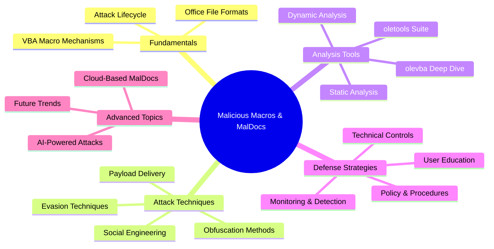
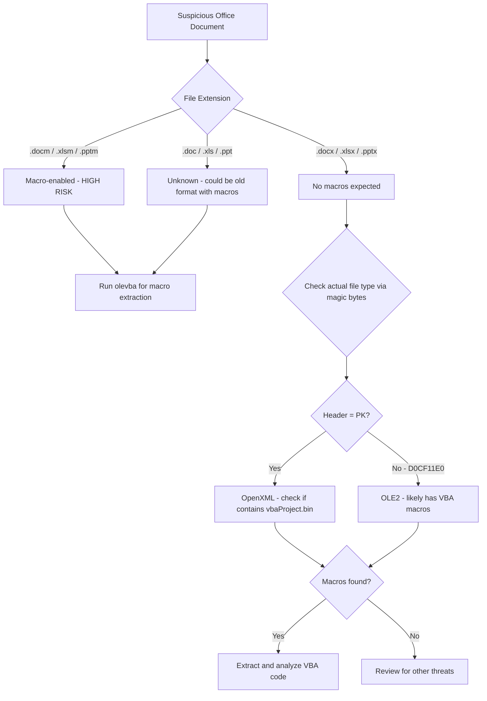
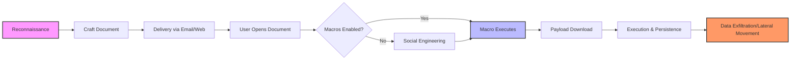
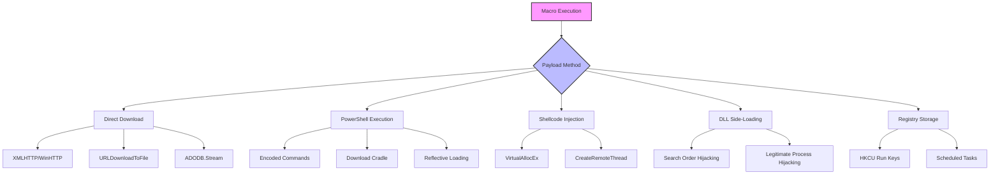
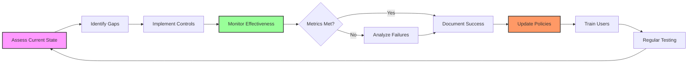

---
tags: [email-security]
---
# 🦠 Full-Stack Lesson: Malicious Macros & Office Documents (MalDocs)


## TCM Exam Objectives
- Identify malicious macro indicators in Office documents (.docm, .xlsm, .pptm)
- Understand VBA macro execution lifecycle from delivery to payload execution
- Detect common obfuscation techniques: hex encoding, Base64, string reversal, Dridex
- Use oletools suite (oleid, olevba, mraptor) for static analysis of malicious documents
- Extract and deobfuscate VBA macro code to identify IOCs and malicious behavior
- Recognize sandbox evasion techniques including delay execution and VM detection
- Identify auto-execution triggers: Auto_Open, Document_Open, Workbook_Open
- Understand macro stomping as an advanced evasion technique
- Apply defense strategies: disabling macros by default, content disarm, and EDR monitoring
- Analyze payload delivery mechanisms: direct download, PowerShell, shellcode injection

# 🦠 Full-Stack Lesson: Malicious Macros & Office Documents (MalDocs)

## 🎯 Lesson Overview
This lesson provides a comprehensive, full-stack exploration of **malicious macros in Microsoft Office documents (MalDocs)**—from fundamental concepts and attack techniques to advanced analysis methods and defense strategies. You'll learn how attackers craft malicious documents, how to analyze them safely, and how to defend against this persistent threat.



## 1. 📚 Fundamentals: Understanding Office Documents & Macros

### 1.1 Microsoft Office File Formats

Microsoft Office documents use several file formats, each with different macro capabilities:

| Format | Extension | Macro Support | Structure |
|--------|-----------|----------------|-----------|
| **Word 97-2003** | `.doc`, `.dot` | Yes (VBA) | OLE Compound File |
| **Word 2007+** | `.docm`, `.dotm` | Yes (VBA) | ZIP/OpenXML |
| **Word 2007+ (No Macros)** | `.docx`, `.dotx` | No | ZIP/OpenXML |
| **Excel 97-2003** | `.xls` | Yes (VBA, XLM) | OLE Compound File |
| **Excel 2007+** | `.xlsm`, `.xlsb` | Yes (VBA, XLM) | ZIP/OpenXML |
| **PowerPoint 97-2003** | `.ppt` | Yes (VBA) | OLE Compound File |
| **PowerPoint 2007+** | `.pptm`, `.ppsm` | Yes (VBA) | ZIP/OpenXML |
| **Other** | `.xml`, `.mht`, `.slk` | Yes (VBA) | XML/Text |

📌 **Exam Tip:** On the PSAA exam, remember that `.docm`, `.xlsm`, and `.pptm` are macro-enabled formats. Attackers rename these to `.doc`, `.xls`, or `.pdf` to evade detection. The actual file type is revealed by checking the file header bytes (magic bytes), not the extension. OLE2 files start with `D0CF11E0`, OpenXML files start with `PK` (ZIP header).



> 💡 **Key Insight**: The `.docm`, `.xlsm`, and `.pptm` extensions explicitly indicate macro-enabled documents. However, attackers often rename files to `.doc`, `.xls`, or even `.pdf` to evade detection 【turn0search1】【turn0search3】.

### 1.2 VBA Macro Fundamentals

**Visual Basic for Applications (VBA)** macros are embedded code in Office documents that can execute automatically. Key concepts include:

<details>
<summary>🔧 Technical Implementation Details</summary>

#### **Macro Storage**
- **VBA Project**: A container for macros within a document
- **Modules**: Code modules containing functions and subroutines
- **Class Modules**: Object-oriented modules for forms and custom objects
- **Forms**: Custom dialog boxes and user interfaces

#### **Auto-Execution Triggers**
- `Auto_Open()`: Executes when document opens
- `Auto_Close()`: Executes when document closes
- `Document_Open()`: Alternative auto-open trigger
- `Workbook_Open()`: Excel-specific auto-open
- `Auto_New()`: Executes when new document created from template

#### **Macro Security Levels**
1. **Disable all macros without notification** (highest security)
2. **Disable all macros with notification** (default)
3. **Disable all macros except digitally signed**
4. **Enable all macros** (not recommended)

#### **How Macros Execute**
1. Document opens in Office application
2. Application checks macro security settings
3. If macros enabled, VBA runtime loads
4. Auto-execution macros run automatically
5. User-triggered macros execute on action
</details>

### 1.3 The MalDoc Attack Lifecycle



**Stages Explained**:
1. **Reconnaissance**: Attackers research target organization, users, and workflows
2. **Crafting**: Create malicious document with embedded macro
3. **Delivery**: Distribute via phishing emails, malicious websites, or file shares
4. **Execution**: User opens document, often prompted to enable macros
5. **Payload**: Macro downloads and executes additional malware
6. **Impact**: Establishes persistence, steals data, or moves laterally

## 2. ⚔️ Attack Techniques & Evasion Methods

### 2.1 Social Engineering Tactics

Attackers use psychological manipulation to convince users to enable macros:

<details>
<summary>🎭 Common Social Engineering Themes</summary>

#### **1. Urgency & Fear**
- "Your account will be suspended"
- "Security update required immediately"
- "Tax refund processing - action required"

#### **2. Authority Impersonation**
- Fake IT department requests
- Executive directives
- Government agency notices

#### **3. Financial Lures**
- Invoice attachments
- Payment confirmations
- Refund notifications

#### **4. Curiosity & Enticement**
- "Confidential documents"
- "Shared files for your review"
- "Photos from recent event"

#### **5. Technical Deception**
- "Enable macros to view content"
- "Document created in newer version"
- "Protected document - enable editing"
</details>

### 2.2 Obfuscation Techniques

Attackers use various methods to hide malicious code from analysis:

| Technique | Description | Example | Detection Difficulty |
|-----------|-------------|---------|---------------------|
| **Hex Encoding** | Convert strings to hexadecimal | `Chr(104) & Chr(116)` → `"ht"` | Medium |
| **Base64 Encoding** | Encode strings in Base64 | `VGhpcyBpcyBtYWx3YXJl` → `"This is malware"` | Medium |
| **String Reversal** | Reverse string order | `StrReverse("moc.elgoog")` → `"google.com"` | Easy |
| **Dridex Obfuscation** | Custom encoding scheme | Complex multi-step encoding | Hard |
| **VBA Expression Obfuscation** | Combine functions to build strings | `Chr(104) & Chr(116) & Chr(116) & Chr(112)` → `"http"` | Medium |
| **Code Obfuscation** | Rename variables/functions | `Dim x As Object` → `Dim objHTTP As Object` | Easy |
| **Junk Code Insertion** | Add meaningless code | `If 1 = 1 Then 'do nothing` | Easy |

### 2.3 Advanced Evasion Techniques

<details>
<summary>🛡️ Sophisticated Evasion Methods</summary>

#### **1. Sandbox Detection**
Macros check for analysis environments:
```vba
If Environ("COMPUTERNAME") = "SANDBOX" Then
    ' Do nothing or clean behavior
Else
    ' Execute payload
End If
```

#### **2. Delay Execution**
Avoid immediate execution to bypass dynamic analysis:
```vba
Application.Wait Now + TimeValue("00:05:00") ' Wait 5 minutes
```

#### **3. Process Injection**
Inject code into legitimate processes to evade detection:
- Use `CreateRemoteThread` to inject into explorer.exe
- Process hollowing to replace legitimate process memory

#### **4. Fileless Techniques**
Operate entirely in memory without writing files:
- Use PowerShell directly from VBA
- Execute shellcode in memory via `CreateThread`

#### **5. Document Corruption**
Intentionally corrupt document structure to break analysis tools:
- Modify ZIP headers in OpenXML documents
- Add junk data to OLE streams
- Use invalid filenames in OLE storage

#### **6. Macro Stomping**
Modify p-code (compiled macro) while leaving source code intact:
- Tools like `EvilClippy` can perform this
- Static analysis shows clean code, runtime executes malicious p-code
</details>

### 2.4 Payload Delivery Mechanisms

Malicious macros use various methods to deliver payloads:



## 3. 🔍 Analysis Tools & Techniques

### 3.1 The oletools Suite

**oletools** is a comprehensive Python package for analyzing Microsoft OLE2 files, including Office documents 【turn0search5】【turn0search6】. Key tools include:

| Tool | Purpose | Key Features |
|------|---------|--------------|
| **oleid** | Detect malicious characteristics | Identifies VBA macros, encryption, suspicious indicators |
| **olevba** | Extract & analyze VBA macros | Source code extraction, deobfuscation, IOC detection |
| **MacroRaptor** | Detect malicious VBA macros | Static analysis of macro code for malicious patterns |
| **oleobj** | Extract embedded objects | OLE objects, ActiveX controls, embedded files |
| **rtfobj** | Analyze RTF files | Extract embedded objects from RTF documents |
| **olemeta** | Extract document metadata | Author, creation date, modification timestamps |
| **oledir** | Display OLE directory structure | Show all streams and storages in OLE file |
| **olemap** | Display OLE sector map | Visual representation of OLE file structure |

### 3.2 olevba: Deep Dive

**olevba** is the most powerful tool for analyzing VBA macros in Office documents 【turn0search1】【turn0search8】.

<details>
<summary>⚙️ olevba Technical Capabilities</summary>

#### **Supported Formats**
- Word 97-2003 (.doc, .dot), Word 2007+ (.docm, .dotm)
- Excel 97-2003 (.xls), Excel 2007+ (.xlsm, .xlsb)
- PowerPoint 97-2003 (.ppt), PowerPoint 2007+ (.pptm, .ppsm)
- Word/PowerPoint 2007+ XML (Flat OPC)
- Word 2003 XML (.xml)
- Word/Excel Single File Web Page / MHTML (.mht)
- Publisher (.pub)
- SYLK/SLK files (.slk)
- Text files containing VBA/VBScript
- Password-protected ZIP archives

#### **Key Features**
1. **Macro Extraction**: Extracts VBA source code from all supported formats
2. **Deobfuscation**: Automatically decodes hex, Base64, StrReverse, Dridex, and VBA expressions
3. **IOC Detection**: Identifies URLs, IP addresses, email addresses, executable filenames
4. **Suspicious Keyword Detection**: Flags API calls, auto-execution, and malicious patterns
5. **Anti-Analysis Detection**: Identifies sandbox detection and anti-virtualization techniques
6. **Batch Processing**: Analyzes multiple files with recursive directory scanning
7. **Python API**: Integration with custom scripts and automation pipelines

#### **How olevba Works**
1. **File Type Detection**: Identifies if file is OLE, OpenXML, or other format
2. **OLE Parsing**: For OpenXML files, extracts vbaProject.bin and other OLE files
3. **VBA Project Identification**: Locates VBA projects in OLE structure
4. **Stream Extraction**: Finds and extracts macro code from OLE streams
5. **Decompression**: Decompresses RLE-compressed macro code
6. **Obfuscation Decoding**: Decodes hex, Base64, and other obfuscation
7. **Pattern Matching**: Scans for suspicious keywords, IOCs, and malicious patterns
8. **Report Generation**: Produces detailed analysis report
</details>

### 3.3 Analysis Workflow

<details>
<summary>📋 Step-by-Step Analysis Process</summary>

#### **Step 1: Initial Triage with oleid**
```bash
oleid suspicious_document.docm
```
Provides quick risk assessment:
- File format identification
- Encryption status
- VBA/XLM macro presence
- External relationships
- Risk level for each indicator

#### **Step 2: Comprehensive Analysis with olevba**
```bash
olevba -a suspicious_document.docm
```
Shows analysis results without full macro code:
- Auto-executable macros
- Suspicious keywords
- IOCs (URLs, IPs, file names)
- Deobfuscated strings

#### **Step 3: Full Macro Extraction**
```bash
olevba suspicious_document.docm > macro_analysis.txt
```
Extracts complete VBA source code with analysis.

#### **Step 4: Deobfuscation**
```bash
olevba --decode suspicious_document.docm
```
Displays all obfuscated strings with decoded content.

#### **Step 5: IOC Extraction**
```bash
olevba --ioc suspicious_document.docm
```
Extracts only IOCs for threat intelligence sharing.

#### **Step 6: Batch Processing**
```bash
olevba -r /path/to/directory/*.docm
```
Recursively analyzes all Office files in directory.

#### **Step 7: Integration with Other Tools**
- **mraptor**: For malicious VBA detection
- **oleobj**: For embedded object extraction
- **YARA**: For pattern matching across multiple files
- **VirusTotal**: For hash checking and reputation lookup
</details>

### 3.4 Advanced Analysis Techniques

<details>
<summary>🔬 Expert Analysis Methods</summary>

#### **1. Static Analysis**
- **Code Review**: Manual examination of VBA code
- **Pattern Matching**: Using YARA rules to identify malware families
- **Hash Comparison**: Compare IOCs against known malicious indicators
- **Metadata Analysis**: Extract author, timestamps, and document properties

#### **2. Dynamic Analysis**
- **Sandbox Execution**: Run in isolated environment (Cuckoo, Joe Sandbox)
- **Network Monitoring**: Capture network traffic during execution
- **Process Monitoring**: Track process creation and API calls
- **Memory Analysis**: Analyze memory for injected code

#### **3. Deobfuscation Techniques**
```python
# Python script for advanced deobfuscation
import re
from oletools.olevba import VBA_Parser

def advanced_deobfuscation(file_path):
    vba_parser = VBA_Parser(file_path)
    
    if vba_parser.detect_vba_macros():
        for (filename, stream_path, vba_filename, vba_code) in vba_parser.extract_macros():
            # Manual deobfuscation steps
            # 1. Hex decoding
            hex_strings = re.findall(r'Chr\(&H([0-9A-Fa-f]+)\)', vba_code)
            for hex_str in hex_strings:
                decoded_char = chr(int(hex_str, 16))
                vba_code = vba_code.replace(f'Chr(&H{hex_str})', f'"{decoded_char}"')
            
            # 2. String reversal
            reversed_strings = re.findall(r'StrReverse\("([^"]+)"\)', vba_code)
            for rev_str in reversed_strings:
                original = rev_str[::-1]
                vba_code = vba_code.replace(f'StrReverse("{rev_str}")', f'"{original}"')
            
            # 3. Base64 decoding
            b64_strings = re.findall(r'"([A-Za-z0-9+/=]+)"', vba_code)
            for b64_str in b64_strings:
                try:
                    import base64
                    decoded = base64.b64decode(b64_str).decode('utf-8', errors='ignore')
                    if decoded.isprintable():
                        vba_code = vba_code.replace(f'"{b64_str}"', f'"{decoded}"')
                except:
                    pass
            
            print(f"Deobfuscated code in {vba_filename}:")
            print(vba_code)
    
    vba_parser.close()
```

#### **4. Correlation Analysis**
- **Threat Intelligence**: Check IOCs against threat intel platforms
- **Campaign Attribution**: Link to known APT groups or malware families
- **Infrastructure Overlap**: Identify shared C2 servers or domains
- **Tool Matching**: Compare with known malware toolsets

#### **5. Memory Forensics**
- **Process Memory Dump**: Capture memory of Office processes
- **Macro Memory Extraction**: Extract VBA from memory
- **Injected Code Detection**: Find shellcode or DLLs in memory
- **API Call Monitoring**: Track system calls during execution
</details>

## 4. 🛡️ Defense Strategies & Best Practices

### 4.1 Technical Controls

<details>
<summary>⚙️ Implementation Details</summary>

#### **1. Application Hardening**
- **Disable Macros by Default**: Block macros from internet, allow only trusted locations
- **Macro Security Settings**: Set to "Disable all macros with notification"
- **Trusted Locations**: Only allow macros from approved network shares
- **Add-in Restrictions**: Disable unnecessary Office add-ins

#### **2. Email Security**
- **Attachment Filtering**: Block Office files with macros from external sources
- **Content Disarm & Reconstruction**: Remove macros from documents automatically
- **URL Rewriting**: Time-of-click URL analysis for links in emails
- **Sender Authentication**: SPF, DKIM, DMARC for email validation

#### **3. Endpoint Detection & Response (EDR)**
- **Process Monitoring**: Track Office application child processes
- **Script Logging**: Enable PowerShell script block logging
- **Memory Protection**: Detect process injection attempts
- **Behavioral Analytics**: Identify anomalous Office application behavior

#### **4. Network Security**
- **DNS Filtering**: Block known malicious domains
- **Proxy Monitoring**: Inspect HTTP/HTTPS traffic from Office applications
- **Traffic Analysis**: Detect C2 beacon patterns
- **Segmentation**: Isolate critical systems from user workstations

#### **5. SIEM Integration**
```spl
index=security (sourcetype=office:file OR sourcetype=process)
[
    search index=threat_intel malicious_macros
    | table file_hash ioc_domain
    | format
]
| stats count by host, user, file_name, action
| where count > 0
```
</details>

### 4.2 User Education & Awareness

<details>
<summary>🎓 Security Awareness Program Components</summary>

#### **1. Phishing Recognition Training**
- **Visual Indicators**: Mismatched sender addresses, generic greetings, urgent language
- **Technical Indicators**: Unexpected attachments, requests to enable macros
- **Verification Procedures**: How to verify legitimacy through separate channels
- **Reporting Mechanisms**: Clear procedures for reporting suspicious emails

#### **2. Macro Awareness**
- **Risk Education**: Explain dangers of enabling macros from unknown sources
- **Legitimate Uses**: When macros are appropriate and expected
- **Verification Process**: How to confirm if macros are legitimately needed
- **Alternative Solutions**: Using non-macro solutions when possible

#### **3. Simulation Program**
- **Regular Phishing Simulations**: Test user susceptibility to malicious documents
- **Role-Based Training**: Tailored scenarios for different departments
- **Immediate Feedback**: Training when users fail simulations
- **Metrics Tracking**: Measure improvement over time

#### **4. Security Culture**
- **Leadership Support**: Executive endorsement of security practices
- **Peer Reporting**: Encourage team members to help each other
- **Recognition**: Reward good security behaviors
- **Continuous Learning**: Regular security updates and newsletters
</details>

### 4.3 Policy & Procedures

<details>
<summary>📋 Organizational Policies</summary>

#### **1. Macro Usage Policy**
- **Approval Process**: Required approvals for new macro-enabled documents
- **Trusted Publishers**: Only allow macros from approved, signed sources
- **Testing Requirements**: All macros must be tested in isolated environment
- **Documentation**: Maintain inventory of approved macros

#### **2. Email Attachment Policy**
- **External Attachments**: Block macro-enabled files from external senders
- **Password Protection**: Require passwords for macro-enabled files
- **Scanning Requirements**: All attachments must be scanned before delivery
- **Alternative Sharing**: Use secure file sharing instead of email when possible

#### **3. Incident Response Plan**
- **Identification**: How to identify potential malicious documents
- **Containment**: Immediate isolation of affected systems
- **Eradication**: Removal of malicious documents and payloads
- **Recovery**: Restoration of systems from known-good backups
- **Lessons Learned**: Post-incident review and process improvement

#### **4. Compliance Requirements**
- **PCI DSS**: Requirement 5 for protecting systems from malicious software
- **HIPAA**: Security Rule for protecting electronic protected health information
- **GDPR**: Article 32 for security of processing systems
- **ISO 27001**: A.12.6.1 for technical vulnerability management
</details>

## 5. 🚀 Advanced Topics & Future Trends

### 5.1 AI-Powered MalDocs

<details>
<summary>🤖 Artificial Intelligence in Malicious Documents</summary>

#### **1. AI-Generated Macros**
- **Automated Obfuscation**: Use AI to generate unique obfuscation for each campaign
- **Polymorphic Code**: Create macros that change structure with each infection
- **Evasion Optimization**: AI learns which techniques bypass specific security products
- **Personalized Lures**: Generate social engineering content based on target research

#### **2. AI-Powered Analysis**
- **Pattern Recognition**: Machine learning to identify new malware families
- **Anomaly Detection**: Identify unusual macro behavior patterns
- **Predictive Analysis**: Predict attack trends based on historical data
- **Automated Response**: AI-driven containment and remediation

#### **3. LLM-Based Attacks**
- **Natural Language Generation**: Create convincing phishing emails at scale
- **Code Generation**: Automatically generate VBA code for specific objectives
- **Evasion Advice**: Use AI to analyze and improve evasion techniques
- **Threat Simulation**: AI-generated realistic attack scenarios for training
</details>

### 5.2 Cloud-Based MalDocs

<details>
<summary>☁️ Cloud Office Document Threats</summary>

#### **1. Cloud Storage Abuse**
- **Shared Documents**: Malicious documents shared via OneDrive, Google Drive
- **Collaboration Platforms**: MalDocs in Teams, Slack, SharePoint
- **Version History**: Malicious documents hidden in version history
- **External Sharing**: Documents shared with external collaborators

#### **2. Cloud-Specific Evasion**
- **Cloud Service Reputation**: Abusing trusted cloud services to bypass security
- **API Integration**: Using cloud APIs to deliver payloads
- **Synchronization**: Leveraging file sync to propagate malware
- **Identity-Based Attacks**: Using cloud identities for credential theft

#### **3. Detection Challenges**
- **Encryption**: Cloud-stored documents may be encrypted at rest
- **Access Controls**: Difficulty inspecting documents with proper permissions
- **Geographic Distribution**: Data spread across multiple jurisdictions
- **API Limitations**: Limited visibility into cloud document interactions
</details>

### 5.3 Future Trends & Emerging Threats

| Trend | Description | Potential Impact | Defense Strategy |
|-------|-------------|------------------|------------------|
| **Quantum-Safe Obfuscation** | Post-quantum cryptographic techniques | Future-proofing of current attacks | Quantum-resistant security controls |
| **AR/VR MalDocs** | Malicious documents in immersive environments | New attack surface with less awareness | AR/VR security awareness training |
| **IoT Integration** | MalDocs targeting IoT device management | Lateral movement to IoT networks | IoT network segmentation |
| **Blockchain Documents** | Unstoppable malicious documents | Documents that cannot be taken down | Blockchain monitoring tools |
| **Deepfake Integration** | AI-generated audio/video in MalDocs | Highly convincing impersonations | Multi-factor verification |

## 6. 📊 Metrics & Continuous Improvement

### 6.1 Key Performance Indicators (KPIs)

<details>
<summary>📈 Comprehensive Metrics Framework</summary>

#### **Detection Metrics**
- **MalDoc Detection Rate**: Percentage of malicious documents detected
- **False Positive Rate**: Legitimate documents flagged as malicious
- **Mean Time to Detect**: Time from document arrival to detection
- **Coverage Rate**: Percentage of attack vectors covered by detection

#### **Response Metrics**
- **Mean Time to Respond**: Time from detection to containment
- **Containment Rate**: Percentage of incidents contained before impact
- **Recovery Time**: Time to restore affected systems
- **Recurrence Rate**: Percentage of similar incidents recurring

#### **User-Centric Metrics**
- **Click Rate**: Percentage of users opening suspicious documents
- **Enable Rate**: Percentage of users enabling macros when prompted
- **Reporting Rate**: Percentage of users reporting suspicious documents
- **Training Effectiveness**: Improvement in metrics over time

#### **Business Impact Metrics**
- **Cost per Incident**: Financial impact of each MalDoc incident
- **Downtime Reduction**: Decrease in system downtime from MalDocs
- **Data Breach Cost**: Financial impact of data exfiltrated via MalDocs
- **Reputation Impact**: Customer trust metrics following incidents
</details>

### 6.2 Continuous Improvement Cycle



## 7. 🎯 Conclusion & Strategic Recommendations

### 7.1 The Evolving Threat Landscape
Malicious macros in Office documents remain one of the most prevalent and effective attack vectors, with over 90% of cyber attacks beginning with phishing 【turn0search1】. The industrialization of phishing through kits and services has lowered the technical barrier for attackers while increasing campaign scale and sophistication.

### 7.2 Defense in Depth is Essential
Organizations must implement layered defenses:
- **Technical controls** (email security, EDR, network monitoring)
- **User education** (awareness training, phishing simulations)
- **Incident response** (rapid containment, forensic capabilities)
- **Threat intelligence** (real-time IOC feeds, industry sharing)

### 7.3 Strategic Priorities for Organizations
Based on the current threat landscape, organizations should prioritize:

1. **Macro Security Defaults**: Block macros from internet, enforce signed macros only
2. **Email Security**: Implement content disarm and reconstruction for Office attachments
3. **User Education**: Continuous training on macro risks and phishing recognition
4. **Detection Capabilities**: Deploy EDR with behavioral analysis for Office applications
5. **Threat Intelligence**: Integrate real-time IOC feeds for proactive detection
6. **Incident Response**: Develop and test specific playbooks for MalDoc incidents

### 7.4 Future Preparation
Organizations must prepare for emerging threats by:
- **Investing in AI-powered detection** systems
- **Implementing zero-trust architectures** for document access
- **Developing cloud-specific security** strategies
- **Participating in threat intelligence sharing** communities

📌 **Exam Tip:** For the exam, remember the two most critical defenses against MalDocs: (1) Disable macros from internet sources by default in Group Policy, and (2) Use Content Disarm and Reconstruction (CDR) to remove macros from Office documents while preserving document usability.

> ⚠️ **Final Note**: The battle against malicious macros is not a technical problem to be solved, but an ongoing risk to be managed. Organizations must maintain vigilance, continuously improve defenses, and foster a culture of security awareness to protect against this persistent threat.

---

**📚 Additional Resources**:
- [oletools Documentation](https://github.com/decalage2/oletools)
- [Microsoft Macro Security Guidance](https://learn.microsoft.com/en-us/microsoft-365-apps/security/internet-macros-blocked)
- [CISA MalDoc Analysis Guide](https://www.cisa.gov/news-events/news/analyzing-malicious-documents)
- [MITRE ATT&CK Macro Techniques](https://attack.mitre.org/techniques/T1204/002/)

*This lesson provides a comprehensive foundation for understanding and defending against malicious macros in Office documents. For specific implementation guidance, consult with cybersecurity professionals and refer to vendor documentation for your particular security stack.*