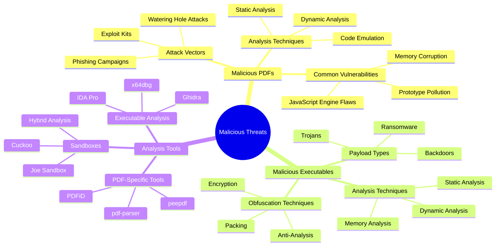
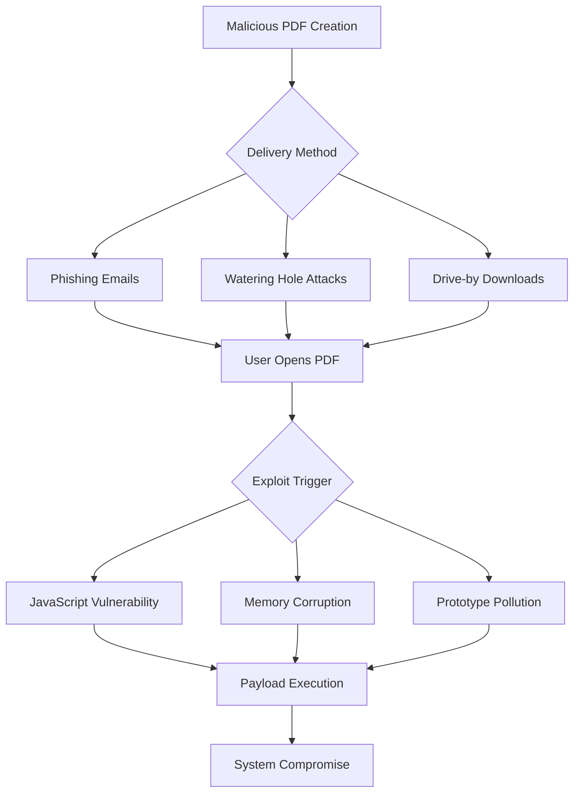
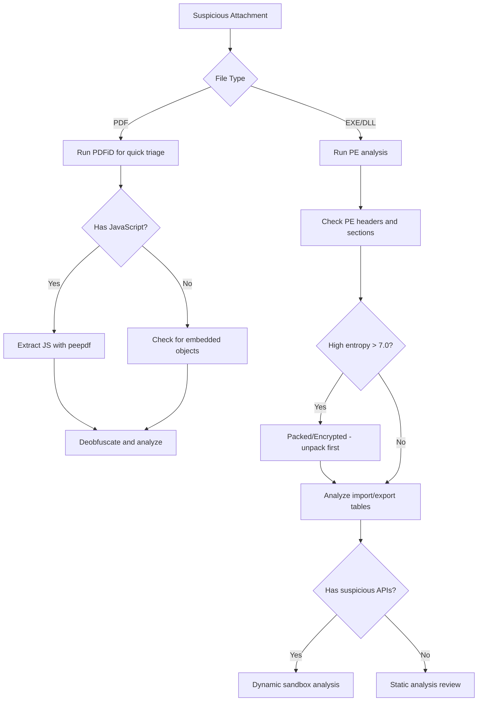
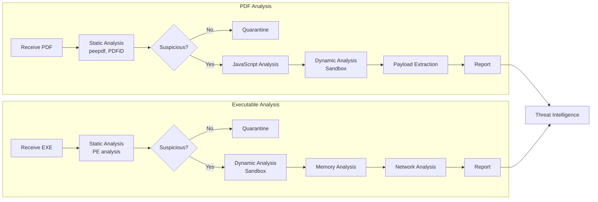

---
tags: [email-security]
---
# 🛡️ Full-Stack Lesson: Analyzing Malicious PDFs and Executables


## TCM Exam Objectives
- Identify common PDF attack vectors: embedded JavaScript, prototype pollution, memory corruption
- Perform static PDF analysis using peepdf, PDFiD, and pdf-parser
- Extract and deobfuscate embedded JavaScript from PDF objects and streams
- Analyze PE executable headers using pefile and detect suspicious import patterns
- Identify packing and encryption through section entropy analysis
- Apply dynamic analysis in sandbox environments for behavioral observation
- Detect process injection techniques: VirtualAllocEx, WriteProcessMemory, CreateRemoteThread
- Create YARA rules for PDF and executable threat detection
- Understand major CVEs affecting PDF readers and their exploitation methods
- Apply multi-layered defense combining patch management, email security, and EDR

# 🛡️ Full-Stack Lesson: Analyzing Malicious PDFs and Executables

## 🧠 Overview: The Threat Landscape

Malicious PDFs and executables represent **two of the most prevalent attack vectors** in cybersecurity. PDFs exploit document format complexities and user trust, while executables deliver payloads through system compromises. This lesson provides a comprehensive analysis framework for both threat types.



## 📊 1. Understanding Malicious PDFs

### 1.1 Why PDFs Are Effective Attack Vectors

PDFs are ubiquitous in business and personal communication, making them **ideal carriers for malware**. Their complex structure supports embedded JavaScript, multimedia content, and interactive forms—all of which can be exploited for attacks 【turn0search3】.

**Key characteristics that make PDFs dangerous:**
- **Complex file structure** with multiple objects and streams
- **Embedded JavaScript** execution capabilities
- **Support for encryption** and password protection
- **Cross-platform compatibility** ensuring widespread impact
- **User trust** in document authenticity

### 1.2 Common PDF Attack Vectors



### 1.3 Major PDF Vulnerabilities and CVEs

| CVE | Vulnerability | Impact | Affected Versions |
|-----|---------------|---------|-------------------|
| **CVE-2026-34621** | Prototype pollution in Adobe Acrobat | Local file access, data exfiltration, potential RCE | Acrobat DC ≤ 26.001.21367, Reader DC ≤ 26.001.21367 【turn0search9】 |
| **CVE-2026-24737** | XSS in jsPDF library | Cross-site scripting attacks | jsPDF library 【turn0search7】 |
| **CVE-2026-25755** | jsPDF sandbox bypass | Object injection leading to code execution | jsPDF library 【turn0search6】 |
| **CVE-2013-2729** | Memory corruption in Adobe Reader | Remote code execution | Adobe Reader ≤ 11.0.3 |

📌 **Exam Tip:** PDF analysis on the exam focuses on three key areas: (1) Embedded JavaScript extraction and deobfuscation using peepdf, (2) Shellcode detection via entropy analysis and emulation, and (3) Stream analysis for hidden objects. Executable analysis focuses on PE header inspection, import table analysis for suspicious APIs (VirtualAllocEx, WriteProcessMemory, CreateRemoteThread), and section entropy for packer detection.



📌 **Exam Tip:** For PE executable analysis on the exam, focus on the import table: suspicious APIs like `VirtualAllocEx` + `WriteProcessMemory` + `CreateRemoteThread` = process injection, `URLDownloadToFileA` + `WinExec` = downloader, `CreateProcess` with `cmd.exe` or `powershell` = execution. Also check section names — normal PE sections are `.text`, `.data`, `.rdata`, `.rsrc`. Custom names like `.upack`, `.nsp0`, `.themida` indicate packers.

> ⚠️ **Critical Note**: CVE-2026-34621 represents a particularly severe vulnerability that has been **actively exploited in the wild** since at least November 2025, operating as a zero-day for approximately four months before patch availability 【turn0search9】.

## 🔍 2. PDF Malware Analysis Methodology

### 2.1 Static Analysis Techniques

Static analysis involves examining the PDF without executing it, providing insights into its structure and potential malicious components 【turn0search3】【turn0search24】.

<details>
<summary>🔧 Detailed Static Analysis Steps</summary>

#### Step 1: File Structure Examination
- Use **hex editors** to examine raw file structure
- Look for anomalies in PDF header (`%PDF-1.x`)
- Check for multiple PDF versions or hidden objects
- Examine cross-reference table integrity

#### Step 2: Metadata Inspection
```bash
# Using pdfinfo to extract metadata
pdfinfo suspicious.pdf

# Key metadata to examine:
- Creation/Modification dates
- Producer/Creator applications
- Author information
- Trapped status
```

#### Step 3: Object Analysis with peepdf
```bash
# Interactive analysis with peepdf
peepdf -i suspicious.pdf

# Key commands:
PPDF> info          # Show file information
PPDF> tree          # Logical structure
PPDF> offsets       # Physical structure
PPDF> object <id>   # Examine specific object
PPDF> stream <id>   # Decode stream content
```

#### Step 4: JavaScript Extraction and Analysis
```bash
# Extract JavaScript for analysis
PPDF> js_analyse object 5

# Common obfuscation techniques:
- String concatenation
- Variable name randomization
- eval() function usage
- External URL references
```
</details>

### 2.2 Dynamic Analysis Techniques

Dynamic analysis involves executing the PDF in a controlled environment to observe its behavior 【turn0search3】.

<details>
<summary>⚙️ Dynamic Analysis Setup</summary>

#### Sandbox Configuration
```bash
# Using Cuckoo Sandbox for PDF analysis
cuckoo --pdf analyze suspicious.pdf

# Monitor for:
- Network connections to suspicious domains
- File system modifications
- Registry changes (Windows)
- Process creation
- JavaScript execution logs
```

#### Behavioral Monitoring
- **Process Monitor**: Track file system and registry access
- **Wireshark**: Capture network traffic
- **Sysmon**: Log system activity and process creation
- **API Monitor**: Track API calls and parameter values

#### Key Indicators of Compromise (IOCs)
- Outbound connections to known malicious IPs
- Creation of suspicious files in temp directories
- Registry modifications for persistence
- Encrypted or encoded data exfiltration
</details>

### 2.3 Code Analysis Techniques

 

Code analysis involves deep examination of embedded JavaScript and exploit code 【turn0search3】.

<details>
<summary>🔬 JavaScript Code Analysis</summary>

#### Deobfuscation Techniques
```javascript
// Common obfuscation pattern
var x = "%u4343" + "%u4343";  // Hex encoding
var y = "\x43\x43";            // Escape sequences
eval(unescape(x + y));         // Combined evaluation

// Deobfuscation approach:
1. Replace eval() with print() to see code
2. Decode hex/escape sequences
3. Analyze control flow
4. Identify payload behavior
```

#### Shellcode Analysis
```bash
# Extract shellcode from PDF
peepdf -s "stream 13 > shellcode.bin" suspicious.pdf

# Analyze with libemu
sctest -s shellcode.bin

# Common shellcode behaviors:
- Download additional payloads
- Create reverse shells
- Inject into legitimate processes
- Establish persistence
```
</details>

## 🛠️ 3. Analysis Tools and Frameworks

### 3.1 PDF-Specific Analysis Tools

| Tool | Purpose | Key Features | Difficulty |
|------|---------|--------------|------------|
| **peepdf**  | Comprehensive PDF analysis | Interactive console, JavaScript analysis, stream decoding | Intermediate |
| **PDFiD**  | Quick triage and identification | Fast scanning, suspicious object detection | Beginner |
| **pdf-parser**  | Object extraction and parsing | Detailed object analysis, stream extraction | Intermediate |
| **Didier Stevens' Tools**  | PDF forensics and analysis | Multiple specialized tools, metadata extraction | Advanced |

### 3.2 General Malware Analysis Tools

<details>
<summary>📚 Comprehensive Tool Collection</summary>

#### Static Analysis Tools
- **IDA Pro** : Disassembler and debugger for executable analysis
- **Ghidra** : NSA's reverse engineering tool suite
- **PE-bear**: Portable Executable file analyzer
- **PEframe**: Static analysis for PE malware
- **YARA**: Pattern matching tool for malware identification

#### Dynamic Analysis Tools
- **Cuckoo Sandbox** : Automated malware analysis system
- **Joe Sandbox**: Deep malware analysis with comprehensive reporting
- **Hybrid Analysis**: Online malware analysis tool
- **Process Monitor**: Real-time file system and registry monitoring
- **API Monitor**: Track API calls and parameters

#### Memory Analysis Tools
- **Volatility**: Memory forensics framework
- **Rekall**: Memory analysis framework
- **MemProcFS**: Memory process file system

#### Online Analysis Services
- **VirusTotal**: Multi-engine virus scanner
- **Malwr**: Free online malware analysis
- **Any.run**: Interactive online sandbox
- **IRMA**: Asynchronous analysis platform
</details>

### 3.3 Automated Analysis Frameworks

```python
# Example: Automated PDF analysis pipeline
import subprocess
import json
from pathlib import Path

class PDFAnalyzer:
    def __init__(self, pdf_path):
        self.pdf_path = pdf_path
        self.results = {}
    
    def run_static_analysis(self):
        """Run static analysis tools on PDF"""
        # peepdf analysis
        result = subprocess.run(['peepdf', self.pdf_path], 
                              capture_output=True, text=True)
        self.results['peepdf'] = result.stdout
        
        # PDFiD analysis
        result = subprocess.run(['pdfid', self.pdf_path],
                              capture_output=True, text=True)
        self.results['pdfid'] = result.stdout
        
        return self.results
    
    def extract_artifacts(self):
        """Extract suspicious artifacts from PDF"""
        # Extract JavaScript
        js_code = self._extract_javascript()
        self.results['javascript'] = js_code
        
        # Extract streams
        streams = self._extract_streams()
        self.results['streams'] = streams
        
        return self.results
    
    def analyze(self):
        """Run complete analysis pipeline"""
        self.run_static_analysis()
        self.extract_artifacts()
        return self.results

# Usage
analyzer = PDFAnalyzer('suspicious.pdf')
results = analyzer.analyze()
```

## 🦠 4. Malicious Executables Analysis

### 4.1 Executable Malware Categories

| Category | Description | Common Examples | Analysis Difficulty |
|----------|-------------|-----------------|---------------------|
| **Trojans** | Disguised as legitimate software | Emotet, TrickBot | Intermediate |
| **Ransomware** | Encrypts files and demands payment | Conti, LockBit | Advanced |
| **Backdoors** | Provides remote access | Cobalt Strike, Metasploit | Advanced |
| **Rootkits** | Maintains privileged access | ZeroAccess, TDL4 | Expert |
| **Worms** | Self-propagating malware | Conficker, Stuxnet | Advanced |

### 4.2 Static Analysis of Executables

<details>
<summary>🔧 Executable Static Analysis Steps</summary>

#### Step 1: File Identification
```bash
# Identify file type
file malware.exe

# Check file hashes
md5sum malware.exe
sha256sum malware.exe

# Check with VirusTotal
vt-cli scan malware.exe
```

#### Step 2: PE Header Analysis
```python
# Using pefile library for PE analysis
import pefile

pe = pefile.PE('malware.exe')

# Extract key information
print(f"Entry point: {hex(pe.OPTIONAL_HEADER.AddressOfEntryPoint)}")
print(f"Image base: {hex(pe.OPTIONAL_HEADER.ImageBase)}")
print(f"Number of sections: {pe.FILE_HEADER.NumberOfSections}")

# Check for suspicious characteristics
if pe.OPTIONAL_HEADER.DllCharacteristics & 0x0040:
    print("Dynamic base (ASLR)")
if pe.OPTIONAL_HEADER.DllCharacteristics & 0x0100:
    print("NX (DEP)")
```

#### Step 3: Import/Export Analysis
```bash
# List imported functions
objdump -p malware.exe | grep "DLL Name"

# Look for suspicious imports:
- LoadLibrary/GetProcAddress (dynamic loading)
- CreateRemoteThread (process injection)
- VirtualAllocEx (memory allocation)
- WriteProcessMemory (code injection)
- RegCreateKeyEx (registry modification)
```

#### Step 4: Section Analysis
```python
# Analyze PE sections
for section in pe.sections:
    print(f"Section: {section.Name.decode().strip()}")
    print(f"  Virtual size: {hex(section.Misc_VirtualSize)}")
    print(f"  Raw size: {hex(section.SizeOfRawData)}")
    print(f"  Entropy: {section.get_entropy():.2f}")
    
    # High entropy indicates packing/encryption
    if section.get_entropy() > 7.0:
        print("  ⚠️ High entropy - possible packed/encrypted content")
```
</details>

### 4.3 Dynamic Analysis of Executables

 

<details>
<summary>⚙️ Dynamic Analysis Setup</summary>

#### Sandbox Configuration
```bash
# Using Cuckoo Sandbox for executable analysis
cuckoo submit malware.exe

# Analysis configuration:
1. Isolated Windows VM with monitoring tools
2. Network capture enabled
3. File system monitoring
4. Registry monitoring
5. API call logging
```

#### Behavioral Analysis
```bash
# Process Monitor filters
Process Name: is malware.exe
Operation: is RegCreateKey
Result: is SUCCESS

# Network capture filters
tcp.port == 443 or tcp.port == 80
ip.dst != 192.168.0.0/16

# Key behaviors to monitor:
- File creation in suspicious locations
- Registry modifications for persistence
- Network connections to C2 servers
- Process injection attempts
- Service creation
```

#### Memory Analysis
```bash
# Volatility memory analysis
volatility -f memory.dmp pslist
volatility -f memory.dmp pstree
volatility -f memory.dump malfind

# Look for:
- Injected code in legitimate processes
- Hidden processes
- Hooked APIs
- Rootkit activity
```
</details>

## 🔄 5. Analysis Workflow Comparison

### 5.1 PDF vs. Executable Analysis



### 5.2 Combined Analysis Approach

<details>
<summary>📊 Integrated Analysis Framework</summary>

#### Phase 1: Triage and Initial Assessment
- **File type identification** and hash calculation
- **Quick scan** with multiple antivirus engines
- **Initial static analysis** with appropriate tools
- **Risk assessment** based on findings

#### Phase 2: Deep Static Analysis
- **PDF**: Object analysis, JavaScript extraction, stream decoding
- **Executable**: PE analysis, import/export tables, section analysis
- **Shared**: String extraction, resource analysis, metadata examination

#### Phase 3: Dynamic Analysis
- **Controlled execution** in sandbox environment
- **Behavioral monitoring** of file system, registry, network
- **Memory analysis** for runtime artifacts
- **API call logging** for detailed behavior analysis

#### Phase 4: Advanced Analysis
- **Code deobfuscation** and decoding
- **Payload extraction** and identification
- **Vulnerability analysis** for exploit identification
- **Attribution** through code similarities and IOCs

#### Phase 5: Reporting and Intelligence
- **Comprehensive report** with findings and IOCs
- **Threat intelligence** integration and sharing
- **Detection rule** creation (YARA, Snort, etc.)
- **Mitigation recommendations**
</details>

## 🛡️ 6. Defense and Mitigation Strategies

### 6.1 Preventive Measures

| Measure | Implementation | Effectiveness |
|---------|----------------|---------------|
| **Patch Management** | Regular updates for PDF readers and OS | Critical for known vulnerabilities |
| **Email Security** | Advanced threat protection, sandboxing | Blocks malicious attachments |
| **Endpoint Protection** | EDR solutions with behavioral analysis | Detects unknown threats |
| **Network Security** | IDS/IPS with threat intelligence | Blocks C2 communications |
| **User Awareness** | Security training and simulated attacks | Reduces successful phishing |

### 6.2 Detection and Response

<details>
<summary>🚨 Detection Strategies</summary>

#### PDF-Specific Detection
```yara
rule Malicious_PDF_Indicators {
    strings:
        $js1 = /eval\(unescape\(/i
        $js2 = /this\.collabStore/i
        $js3 = /util\.readFileIntoStream/i
        $shellcode = /\\x[0-9a-f]{2}\\x[0-9a-f]{2}/
        
    condition:
        any of ($js*) or $shellcode
}
```

#### Executable-Specific Detection
```yara
rule Suspicious_PE_Characteristics {
    strings:
        $api1 = "LoadLibraryA" wide ascii
        $api2 = "GetProcAddress" wide ascii
        $api3 = "VirtualAllocEx" wide ascii
        $api4 = "WriteProcessMemory" wide ascii
        
    condition:
        uint16(0) == 0x5A4D and  // PE signature
        any of ($api*)
}
```

#### Behavioral Detection
- **Process injection** attempts
- **Unusual network connections** to known bad IPs
- **File creation** in suspicious locations
- **Registry modifications** for persistence
- **Anomalous API call** patterns
</details>

## 📈 7. Real-World Case Studies

### 7.1 Case Study: CVE-2026-34621 Exploitation

<details>
<summary>🔍 Detailed Analysis</summary>

#### Attack Chain
1. **Initial Access**: Spear-phishing email with malicious PDF attachment
2. **Exploitation**: PDF exploits prototype pollution vulnerability in Adobe Acrobat
3. **Execution**: JavaScript runs `util.readFileIntoStream()` to access local files
4. **Persistence**: Uses `RSS.addFeed()` for C2 communications
5. **Lateral Movement**: Exfiltrates sensitive data and additional payloads

#### Key Findings
- **Zero-day exploitation** for approximately 4 months
- **Targeted attacks** against specific organizations
- **Data exfiltration** of sensitive documents
- **Multi-stage payload** delivery

#### IOCs
- **PDF characteristics**: Suspicious JavaScript objects, `util.readFileIntoStream` calls
- **Network indicators**: Connections to specific domains for data exfiltration
- **File system**: Creation of temporary files for data staging
- **Registry**: Modifications for persistence mechanisms

#### Lessons Learned
- **Timely patching** is critical for known vulnerabilities
- **Behavioral detection** can identify zero-day exploits
- **Network monitoring** essential for detecting C2 communications
- **User awareness** remains important for initial access prevention
</details>

### 7.2 Case Study: Malicious Executable Analysis

<details>
<summary>🔍 TrickBot Trojan Analysis</summary>

#### Static Analysis Findings
- **Packing**: UPX packed executable with modified header
- **Imports**: Suspicious API imports for process injection and network communication
- **Strings**: Encrypted strings with C2 server addresses
- **Resources**: Embedded DLL with banking trojan functionality

#### Dynamic Analysis Results
- **Process injection**: Injected into legitimate Windows processes
- **Network behavior**: Connected to multiple C2 servers on ports 443, 8080
- **File system**: Created temporary files for data staging
- **Registry**: Added persistence mechanisms in Run keys

#### Key Takeaways
- **Modular architecture** allows for flexible functionality
- **Obfuscation techniques** hinder static analysis
- **Process injection** evades detection
- **Network communication** uses encryption and domain fluxing
</details>

## 🚀 8. Advanced Topics and Future Trends

### 8.1 Emerging Threats

| Threat | Description | Impact | Mitigation |
|--------|-------------|---------|------------|
| **AI-Powered Malware** | Machine learning for evasion and targeting | Adapts to defenses, targeted attacks | Behavioral analysis, anomaly detection |
| **Fileless Malware** | Lives in memory, minimal disk footprint | Evades traditional AV, persistence challenges | Memory analysis, behavioral monitoring |
| **Supply Chain Attacks** | Compromises update mechanisms | Widespread impact, trusted sources | Code signing, vendor verification |
| **Cloud Malware** | Targets cloud infrastructure and services | Data breaches, service disruption | Cloud security posture management |

### 8.2 Analysis Evolution

<details>
<summary>🔬 Future Analysis Techniques</summary>

#### Automated Analysis
- **Machine learning** for malware classification
- **AI-powered** deobfuscation and code analysis
- **Behavioral biometrics** for anomaly detection
- **Threat intelligence** integration for context

#### Advanced Memory Analysis
- **Real-time memory** scanning for artifacts
- **Hypervisor-based** introspection for stealth analysis
- **Memory forensics** for investigation and attribution
- **Live system analysis** without disk artifacts

#### Cloud-Native Analysis
- **Containerized** analysis environments
- **Scalable processing** for large-scale analysis
- **Distributed analysis** across multiple environments
- **Cloud sandbox** services with enhanced capabilities
</details>

## 📚 9. Learning Resources and Tools

### 9.1 Practice Environments

| Resource | Type | Focus | Access |
|----------|------|-------|--------|
| **MalwareBazaar** | Repository | Malware samples | Free registration |
| **VirusTotal** | Analysis | Multi-engine scanning | Free with limits |
| **Any.run** | Sandbox | Interactive analysis | Free with limits |
| **Malwr** | Sandbox | Cuckoo-based analysis | Free |
| **Hybrid Analysis** | Sandbox | Online analysis | Free with limits |

### 9.2 Training and Certification

<details>
<summary>🎓 Educational Resources</summary>

#### Books
- **"Practical Malware Analysis"** by Michael Sikorski and Andrew Honig
- **"The IDA Pro Book"** by Chris Eagle
- **"Malware: A Security Perspective"** by Suncica Milivojevic
- **"The Art of Memory Forensics"** by Michael Hale Ligh

#### Online Courses
- **SANS SEC503**: Intrusion Detection In-Depth
- **SANS SEC601**: Reverse-Engineering Malware
- **Offensive Security** Malware Analysis
- **Cybrary** Malware Analysis Courses

#### Certifications
- **GIAC Reverse Engineering Malware (GREM)**
- **GIAC Certified Intrusion Analyst (GCIA)**
- **Offensive Security Certified Professional (OSCP)**
- **Certified Malware Investigator (CMI)**
</details>

## 💎 Conclusion

Malicious PDFs and executables continue to evolve as primary attack vectors, requiring **multi-layered analysis approaches** and **continuous adaptation** to emerging threats. The key takeaways from this comprehensive lesson include:

1. **Holistic Analysis**: Combine static, dynamic, and code analysis techniques for thorough examination
2. **Tool Proficiency**: Master both specialized and general-purpose analysis tools
3. **Behavioral Focus**: Emphasize behavioral indicators over static signatures
4. **Environment Isolation**: Always analyze in isolated, controlled environments
5. **Continuous Learning**: Stay updated with emerging threats and analysis techniques

The threat landscape will continue to evolve with AI-powered malware, fileless attacks, and sophisticated evasion techniques. **Investing in robust analysis capabilities** and **maintaining vigilance** are essential for effective defense against these persistent threats.

> ⚠️ **Final Reminder**: Always practice safe analysis procedures in isolated environments. Malware analysis is inherently risky—never analyze suspicious files on production systems or networks without proper isolation and safety measures.