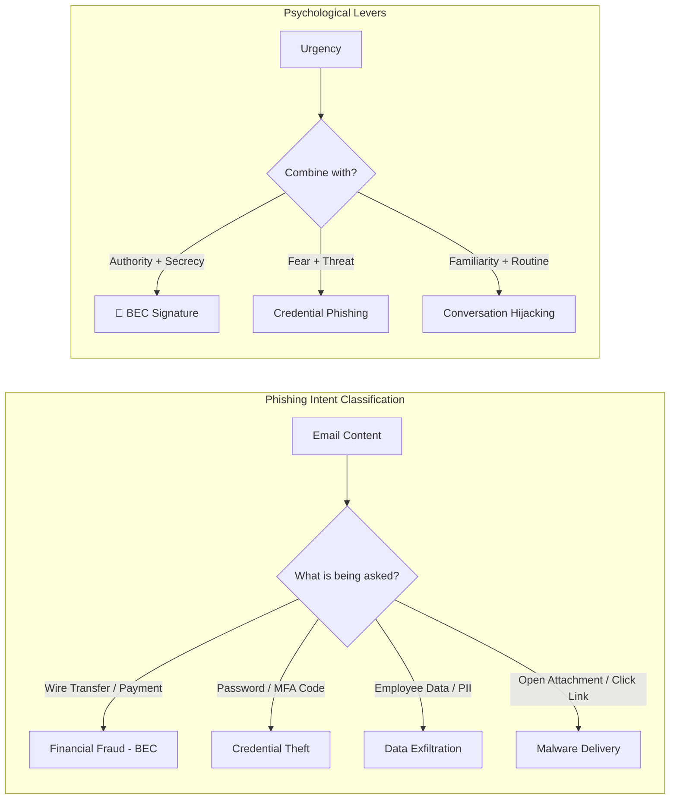
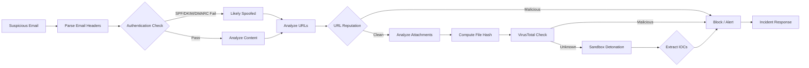

# Analyzing Sender Intent and Tone
## TCM Exam Objectives
- Identify and classify psychological levers (urgency, authority, pressure, pretext) in phishing emails
- Recognize Cialdini's six principles of influence in social engineering attacks
- Distinguish between BEC/wire fraud, credential theft, data exfiltration, and malware delivery intent
- Detect deviation from sender baseline as the highest-fidelity signal for compromised accounts
- Apply the 7-step SOC workflow for sender intent analysis
- Correlate linguistic indicators with technical authentication evidence for unified risk scoring
- Identify conversation hijacking through thread analysis and unusual request patterns
- Recognize payroll diversion and gift card scam linguistic signatures
- Understand the limitations of AI-generated phishing detection vs traditional content analysis
- Apply out-of-band verification as the definitive control for ambiguous intent cases

Sender intent and tone analysis is the practice of reading a suspicious email the way a social engineer wrote it — decoding the psychological levers (urgency, authority, pressure, pretext) embedded in the language to determine whether the sender's true goal is financial fraud, credential theft, data exfiltration, or malware delivery, regardless of how legitimate the surface text appears.【turn0search1】【turn0search18】 In the modern threat landscape where AI-generated phishing mimics normal business language well enough to evade content-only scanners, and BEC attacks are low-volume (often just one or two emails with no spike to trigger traffic alerts), behavioral and linguistic analysis has become the primary detection layer that header authentication alone cannot provide.【turn4search3】【turn3fetch0】

## The Sender Intent Analysis Pipeline

Every phishing email is a social-engineering construct with a payload hidden behind a pretext. Analyzing sender intent means working backward from what the email *asks for* through the psychological pressure it applies, to the true objective — and then cross-validating that linguistic read against technical authentication evidence.【turn0search1】【turn2search1】

```mermaid
flowchart LR
    EMAIL[Suspicious Email] --> SURFACE[Surface Read<br/>what is being asked?]
    SURFACE --> PSYCH[Psychological Layer<br/>which persuasion levers?]
    PSYCH --> PRETEXT[Pretext Layer<br/>what fabricated scenario?]
    PRETEXT --> TONE[Tone Layer<br/>deviation from baseline?]
    TONE --> INTENT{True Intent Classification}
    INTENT -->|financial| FIN[Wire fraud / invoice redirect / payroll diversion]
    INTENT -->|credential| CRED[Phishing login / MFA fatigue / account takeover]
    INTENT -->|data| DATA[W-2 / PII / IP exfiltration]
    INTENT -->|access| ACC[Initial access / malware delivery / persistence]
    FIN --> XVAL[Cross-Validate with Technical Layer]
    CRED --> XVAL
    DATA --> XVAL
    ACC --> XVAL
    XVAL --> AUTH[SPF / DKIM / DMARC<br/>header analysis]
    XVAL --> BASE[Sender baseline<br/>writing style, cadence]
    XVAL --> CTX[Business context<br/>does this request make sense?]
    AUTH --> VERDICT{Verdict}
    BASE --> VERDICT
    CTX --> VERDICT
    VERDICT -->|malicious| CONTAIN[Contain: blocklist, isolate, verify out-of-band]
    VERDICT -->|benign| CLOSE[Close with annotation]
    VERDICT|-- ambiguous| ESCALATE[Escalate: sandbox, RE, manual review]
```

The critical insight: content analysis alone cannot reliably distinguish a real CFO email from a convincing fake because AI-generated phishing now mimics normal business language and avoids obvious malicious keywords.【turn3fetch0】 The reliable signal is *deviation from baseline* — whether the email's intent, tone, and request pattern match what this specific sender normally communicates to this specific recipient.

## Master Comparison: Intent Categories and Tone Signatures

| Intent Category | What Attacker Wants | Typical Pretext | Linguistic Tone Signals | Common Recipients | Example Phrase |
|---|---|---|---|---|---|
| **Financial fraud (BEC/wire)** | Unauthorized wire transfer, invoice redirect, payment rerouting | CEO/CFO urgency, vendor banking change, acquisition confidentiality | Authority + urgency + secrecy; bypasses normal approval workflow | Finance, accounts payable, procurement | "Need this processed today before the board call. Strictly confidential."【turn1search7】【turn2search8】 |
| **Payroll diversion** | Redirect employee direct deposit to attacker account | Employee impersonation to HR/payroll | Routine-seeming HR request; lower urgency than wire fraud | HR, payroll teams | "Please update my direct deposit details for the next pay cycle."【turn2search6】 |
| **Gift card scam** | Purchase of gift cards (untraceable currency) | CEO/executive impersonation with secrecy pretext | Authority + urgency + secrecy; request outside normal channels | Any employee, often junior | "I'm in a meeting, need you to get $500 in gift cards ASAP. Don't discuss." |
| **Credential theft** | Username/password, MFA codes, session tokens | Account compromise warning, password expiry, shared document | Fear + urgency; impersonates IT/security/Microsoft | Any employee | "Your account will be suspended in 24 hours. Verify here."【turn4search1】 |
| **Data exfiltration (W-2/PII)** | Employee tax data, customer PII, strategic information | IRS/tax authority impersonation, legal request, executive directive | Authority + compliance framing; references to regulations or audits | HR, finance, legal | "Sending per the CEO's request for Q4 employee data review." |
| **Initial access / malware** | Execution of payload, foothold on endpoint | Invoice attachment, resume, shipping notification, software update | Routine business framing; minimal urgency to avoid suspicion | Any employee | "Invoice #31415 attached for your review." |
| **Conversation hijacking** | Continuation of fraud within trusted thread | Reply within active thread, "updated" invoice or banking details | Familiarity + continuity; exploits existing trust | Anyone in an active business thread | "Updated banking details attached — please use for the pending transfer."【turn1search13】 |

Sources: 【turn1search5】【turn1search7】【turn2search6】【turn2search8】【turn4search1】【turn4search3】

---

## Module 1 — Psychological Principles: Cialdini's Six Levers

Social engineering relies heavily on Robert Cialdini's six Principles of Influence, established in *Influence: The Psychology of Persuasion* — reciprocity, commitment/consistency, social proof, authority, liking, and scarcity — each of which maps to specific email language patterns.【turn1search0】【turn1search2】 Research confirms phishing emails frequently employ these persuasion techniques to gain trust and obtain sensitive information, with spear phishing being especially effective because attackers tailor messages to specific vulnerabilities of targets.【turn1search1】【turn1search4】

📌 **Exam Tip:** On the PSAA exam, the combination of **Authority + Urgency + Secrecy** is the classic BEC/whaling signature. If a question describes an email from a "CEO" requesting a "confidential, urgent wire transfer," the answer is almost certainly Business Email Compromise (BEC). Memorize Cialdini's six principles as they directly map to social engineering indicators.



**Authority** — the most exploited lever in BEC. Attackers impersonate CEOs, CFOs, or vendors, leveraging perceived authority to override verification procedures. Semantic research shows phishing messages use institutional references (executive titles, department names, regulatory bodies) to frame authority and trigger compliance.【turn4search1】 Tone signal: requests that invoke rank rather than rationale ("Because I'm asking" rather than "Because this is the right process").

**Urgency / Scarcity** — manufactured time pressure that prevents rational verification. Corpus analysis of phishing emails found time-sensitive cues ("immediately," "within 24 hours," "urgent") are the most common semantic framing for behavioral manipulation.【turn4search1】【turn0search7】 Tone signal: deadlines that don't align with the actual business process timeline; "ASAP" without context; threats of consequence ("account suspended," "late fees").

**Reciprocity** — creating perceived obligation. A fake vendor "following up" on a prior conversation, or an attacker offering something (a "bonus," "refund") to trigger a response. Tone signal: unsolicited offers or references to prior favors the recipient doesn't remember.

**Social Proof** — "Everyone else has already complied," "Your colleagues have verified." Tone signal: collective pressure implying the recipient is the outlier for not acting.

**Liking / Familiarity** — cloning the writing style, signature, and formatting of a trusted sender. This is where AI-generated phishing excels — LLMs can ingest public correspondence, earnings call transcripts, and published articles to replicate an executive's distinctive style with remarkable accuracy.【turn1search8】【turn0search16】 Tone signal: the email *looks* familiar but the request is outside the normal pattern.

**Commitment & Consistency** — escalating requests that build on prior compliance. An attacker establishes a conversation ("Can you confirm you handle vendor payments?") before making the fraudulent ask, exploiting the recipient's desire to be consistent with their prior engagement.【turn1search3】

---

## Module 2 — Pretext Scenarios: The Fabricated Story

Pretexting is the creation of a believable scenario to gain trust and manipulate victims into revealing information or taking action — the attacker impersonates authority figures, IT support staff, vendors, or other trusted individuals.【turn1search19】【turn1search17】 Each pretext maps to a specific intent and a recognizable tone signature.

### CEO Fraud / Executive Impersonation

The attacker poses as a company executive (CEO, CFO) to request urgent wire transfers or sensitive data. The tone combines authority with urgency and secrecy — the request is framed as confidential, time-sensitive, and requiring bypass of normal procedures because of the executive's position.【turn1search5】【turn2search8】 Pretext elements: references to acquisitions ("We're finalizing the [Target] deal"), travel ("I'm in meetings all day"), or board pressure ("Need this before the board call").

### Invoice / Vendor Manipulation

Forged or altered invoices that appear to come from trusted vendors, redirecting payments to attacker-controlled accounts. The tone is routine and administrative — this is what makes it dangerous. The email looks like every other vendor invoice the recipient processes weekly, with the only change being banking details buried in an attachment or a "note" about updated payment information.【turn1search5】【turn1search13】 Pretext elements: realistic invoice numbers, references to prior transactions, familiar vendor branding.

### Payroll Diversion

Attackers impersonate employees (typically not VIPs) requesting HR or payroll update their direct deposit information. The tone is casual and routine — a normal HR request that doesn't trigger urgency alarms. This is why payroll diversion often succeeds: it exploits the mundane nature of the request rather than manufacturing pressure.【turn2search6】

### Conversation / Thread Hijacking

Attackers compromise a mailbox, read active threads, and insert replies into existing conversations — creating "updated" invoices, payment redirects, or new banking instructions mid-thread. The tone inherits the trust of the existing conversation; the email comes from the real account, within a real thread the victim already trusts.【turn1search13】【turn4search3】 Pretext elements: continuation of a real discussion, reference to prior messages, only the payload (banking details, link, attachment) is swapped.

### IT / Security Impersonation

Attackers pose as IT support, Microsoft, or internal security teams requesting password resets, MFA verification, or account confirmation. The tone combines authority (IT has the right to ask) with urgency (account will be suspended) and fear (security incident).【turn1search19】 Pretext elements: references to "anomalous activity," "security policy updates," or "mandatory verification."

---




## Module 3 — Tone Anomaly Detection: The Baseline Deviation

The most reliable linguistic signal is not any single phrase but *deviation from the sender's established baseline*. Rather than asking "does this email look like phishing?", behavioral engines ask "is this email normal for this sender, this recipient, and this communication pattern?" — analyzing language patterns, relationship signals, communication cadence, and contextual factors against historical baselines.【turn3fetch0】【turn2search3】

### What Baseline Analysis Catches

**Writing style deviation** — a CFO who normally writes terse, informal emails suddenly sends a formally structured, grammatically perfect message. AI-generated phishing often produces *too perfect* prose — attackers using LLMs inadvertently standardize what should be idiosyncratic communication. Conversely, some attackers deliberately introduce "human" errors, but research notes that perfect writing can look suspicious in certain environments where the legitimate sender routinely makes mistakes.【turn3fetch0】

**Cadence anomaly** — a sender who communicates weekly suddenly sends three urgent emails in one day, or a dormant account becomes active. Communication frequency deviations are behavioral signals that content analysis cannot detect.【turn2search3】

**Relationship anomaly** — a sender who has never communicated with this recipient suddenly sends a financial request. Graph-based relationship mapping identifies first-time or infrequent communication patterns and flags them for review, distinguishing legitimate outreach from impersonation.【turn3fetch0】

**Request pattern anomaly** — a vendor who normally sends invoices through a procurement system suddenly emails the CFO directly requesting a wire transfer. The request bypasses established business workflow, which is itself the strongest indicator of social engineering.【turn0search10】

### AI-Generated Phishing and the Tone Problem

By October 2025, AI-generated phishing had become the top enterprise email threat, with a 1,265% surge in phishing attacks linked to generative AI tools.【turn1search8】 AI-generated phishing emails exhibit higher success rates because they bypass conventional spam filters and mimic human communication styles — they avoid the typos, generic greetings, and obvious red flags that traditional training teaches users to spot.【turn1search10】【turn1search11】 This means tone analysis can no longer rely on "poor grammar = phishing" heuristics; the reliable signal is *contextual deviation from baseline*, not absolute language quality.

---

## Module 4 — Technical Cross-Validation

Linguistic analysis alone is insufficient — modern AI phishing detection combines NLP with header authentication, behavioral baselines, and business context to produce a unified risk score.【turn3fetch0】【turn2search3】

### Header Authentication (The Technical Floor)

Email header analysis examines metadata — Received, From, Reply-To, Return-Path, Authentication-Results — to validate the email's origin and authenticity.【turn1search15】【turn1search16】 SPF verifies the sending IP, DKIM verifies the message content signature, and DMARC ties authentication to the visible From: domain with enforcement policy.【turn1search13】 A phishing email spoofing the CEO's domain will fail DMARC at p=reject; a lookalike domain (valinnail.com instead of valimail.com) will pass authentication but reveal the deception in the From: field.

### The Linguistic-Technical Correlation

The strongest verdicts come from correlating linguistic and technical signals:【turn2search3】【turn3fetch0】
- A high-urgency financial request (linguistic) from a first-time sender (behavioral) with a lookalike domain (technical) = high-confidence malicious
- A routine vendor invoice (linguistic) from a known sender (behavioral) with passing authentication (technical) = likely benign, verify attachment
- An urgent wire request (linguistic) from the real CEO's mailbox (technical pass) but with tone deviation from baseline (behavioral) = compromised mailbox, thread hijacking

This last case is the most dangerous — the email passes all technical controls because it genuinely comes from the executive's account, but the tone deviation reveals the compromise. This is why behavioral baselining is essential for catching account takeover that defeats authentication.

---

## Module 5 — SOC Workflow: Step-by-Step Intent Analysis

When a suspicious email reaches the SOC, the analyst works through intent analysis in a structured sequence that moves from surface read to verdict.【turn2search1】【turn2search4】

**Step 1: Surface Read — What is being asked?**
Identify the explicit request: wire transfer, credential entry, attachment opening, data disclosure, account update. The request type immediately narrows the intent classification.【turn0search4】

**Step 2: Psychological Layer — Which levers are applied?**
Scan for urgency cues ("immediately," "ASAP," "within 24 hours"), authority framing (executive title, institutional reference), secrecy pressure ("confidential," "don't discuss"), and reciprocity/social proof patterns.【turn4search1】【turn0search6】

**Step 3: Pretext Validation — Does the scenario make sense?**
Does the email's narrative fit the sender's role, the business context, and the recipient's function? A CEO emailing a junior employee about gift cards makes no business sense; a vendor emailing accounts payable about an invoice does.【turn2search8】

**Step 4: Tone Baseline Comparison — Is this how the sender writes?**
Compare against the sender's historical communication: writing style, formality, signature, typical request patterns, usual recipients. Deviation from baseline is the highest-fidelity signal for compromised accounts and impersonation.【turn2search3】【turn0search3】

**Step 5: Technical Cross-Check — Does authentication corroborate?**
Run header analysis: SPF, DKIM, DMARC results; Received path; From/Reply-To/Return-Path consistency; Message-ID domain match. A spoofed email fails here; a lookalike domain reveals itself here; a compromised account passes here (which is why tone analysis matters).【turn1search15】【turn1search16】

**Step 6: Business Context Validation — Is the request procedurally valid?**
Does the request follow established business workflow? Wire transfers have approval procedures; vendor banking changes have verification protocols; payroll changes have HR systems. A request that bypasses procedure is social engineering regardless of how legitimate the email looks.【turn0search10】【turn2search12】

**Step 7: Verdict and Action**
- Malicious → blocklist the sender, quarantine the email, hunt for other recipients, initiate incident response if any action was taken
- Benign → close with annotation documenting the analysis
- Ambiguous → escalate to sandbox detonation (attachments/links), out-of-band verification with the claimed sender, or manual reverse engineering【turn2search1】

---

## Red Flag Reference Table

| Red Flag Category | Specific Indicators | What It Suggests |
|---|---|---|
| **Urgency** | "Immediately," "within 24 hours," "ASAP," deadline threats, account suspension warnings | Manufactured pressure to prevent verification【turn4search1】【turn0search8】 |
| **Authority** | Executive title invocation, references to "the CEO wants," regulatory body impersonation | Authority override of normal procedure【turn4search1】 |
| **Secrecy** | "Don't discuss with anyone," "confidential," "between us" | Isolation from verification channels【turn1search7】 |
| **Request anomaly** | Wire transfer to new account, banking detail change, gift card purchase, W-2 data request | Financial fraud or data exfiltration intent【turn1search7】【turn2search6】 |
| **Workflow bypass** | Request outside normal system (email instead of procurement portal), direct to CFO instead of AP | Social engineering circumventing controls【turn0search10】 |
| **Tone deviation** | Writing style change, formality shift, cadence anomaly vs. sender baseline | Compromised mailbox or impersonation【turn2search3】 |
| **Relationship anomaly** | First-time sender, unexpected contact from known party, cross-departmental request outside norm | Impersonation or account takeover【turn3fetch0】 |
| **Secrecy + urgency + authority** | The combination — all three together | Classic BEC/whaling signature【turn1search7】 |
| **Generic greeting** | "Dear customer," "Hi user," no name | Mass phishing, not targeted【turn0search6】 |
| **Display name mismatch** | From: shows "CEO Name" but email domain is lookalike | Domain spoofing【turn2search3】 |

---

## Module 6 — AI and NLP in Intent Detection

Modern AI phishing detection implements multiple coordinated layers: NLP evaluates email content and intent at machine speed, behavioral analysis maps communication patterns against baselines, graph analysis maps relationship networks, and computer vision extracts text from image-based phishing (QR codes, screenshots).【turn3fetch0】【turn2search3】

**NLP and semantic analysis** — frontier LLMs analyze writing style, urgency cues, and linguistic anomalies at the word, sentence, and full-message level, evaluating the actual intent behind content rather than scanning for known phishing phrases. However, LLM-based detection remains susceptible to adversarial refinement attacks, prompt injection, and cross-lingual evasion — NLP alone is not sufficient for production deployment.【turn3fetch0】

**Behavioral AI** — platforms like Abnormal Security build dynamic baselines from sender identity, writing patterns, recipients, and geographic routing, then apply NLP to evaluate financial requests, urgency signals, and display name mismatches, combining these with device and location telemetry to assign a unified risk score.【turn2search3】 This intent-driven detection catches what content analysis misses.

**The detection-investigation gap** — the real gap is not detection but what happens after the alert fires. A phishing attack that lands doesn't stay in the inbox — it moves to credentials, then identity, then cloud, then data. Correlating signals across email, identity, endpoint, and cloud layers is what determines whether a phishing alert becomes a resolved incident or a significant breach.【turn3fetch0】

---

## Common Pitfalls

**Over-reliance on content red flags.** Traditional training teaches users to spot typos, generic greetings, and obvious spam language — but AI-generated phishing eliminates these indicators. Modern phishing mimics normal business language well enough to pass content-only scanners; the reliable signal is behavioral deviation, not absolute language quality.【turn3fetch0】【turn1search10】

**Treating authentication as proof of legitimacy.** A compromised executive mailbox passes SPF, DKIM, and DMARC because the email genuinely comes from the real account. Authentication proves the *source* is legitimate, not that the *intent* is legitimate — a compromised account sending fraudulent requests is authenticated and malicious simultaneously.【turn2search8】

**Ignoring business context.** An email can pass all technical checks and match the sender's writing style perfectly, yet still be malicious if the request bypasses established business workflow. The procedural validity of the request is a signal that neither content analysis nor authentication can provide — it requires understanding how the business actually operates.【turn0search10】【turn2search12】

**Single-signal analysis.** Evaluating urgency, authority, or tone in isolation produces false positives (legitimate urgent emails flagged as phishing) and false negatives (sophisticated BEC with no obvious urgency cues missed). The mature approach correlates linguistic, behavioral, technical, and contextual signals into a unified risk assessment.【turn3fetch0】【turn2search3】

📌 **Exam Tip:** The single most effective defense against BEC/social engineering attacks on the PSAA exam is **out-of-band verification** — contacting the claimed sender through a pre-established, separate channel (phone call from official directory, in-person, or known messaging platform). This is always the recommended action for ambiguous or high-risk requests.

**Skipping out-of-band verification.** The single most effective defense against intent-based attacks is out-of-band verification — contacting the claimed sender through a separate, pre-established channel to confirm the request. When analysis is ambiguous, verification closes the gap; when it's skipped, even detected attacks sometimes proceed because "it seemed too urgent to wait."【turn2search12】

**Underestimating low-volume attacks.** BEC attacks are often just one or two emails — there's no traffic spike to trigger security alerts, no pattern to detect across multiple recipients. Each BEC email must be evaluated on its own merits, which is why per-message intent analysis matters more than volume-based detection for this threat class.【turn4search3】

---

## Recap

Analyzing sender intent and tone means decoding the psychological levers embedded in email language — urgency, authority, secrecy, reciprocity — to classify the sender's true objective (financial fraud, credential theft, data exfiltration, initial access) and cross-validating that linguistic read against header authentication, sender behavioral baselines, and business workflow context.【turn0search1】【turn0search18】【turn3fetch0】 Cialdini's six principles of influence (authority, scarcity, reciprocity, social proof, liking, commitment) map directly to the language patterns phishing emails employ, with authority and urgency being the most frequently semantically framed levers in corpus analysis of real phishing messages.【turn1search0】【turn4search1】 Pretext scenarios — CEO fraud, invoice manipulation, payroll diversion, thread hijacking, IT impersonation — each carry recognizable tone signatures that, when matched against the sender's historical baseline, reveal impersonation even when technical authentication passes.【turn1search5】【turn2search6】【turn1search13】 The SOC workflow moves through surface read → psychological layer → pretext validation → tone baseline comparison → technical cross-check → business context validation → verdict, with out-of-band verification as the definitive control for ambiguous cases.【turn2search1】【turn2search12】 AI-generated phishing has eliminated the traditional red flags (typos, generic greetings, obvious spam language) by mimicking normal business language, making behavioral baseline deviation — not absolute content quality — the highest-fidelity detection signal for modern attacks.【turn1search8】【turn1search10】【turn3fetch0】 The throughline: no single signal is sufficient — the mature analysis correlates linguistic, behavioral, technical, and contextual indicators into a unified risk score, with the understanding that intent analysis is the layer where human judgment and contextual understanding still outperform pure automation, because social engineering ultimately exploits business relationships and procedural knowledge that no scanner can fully model.