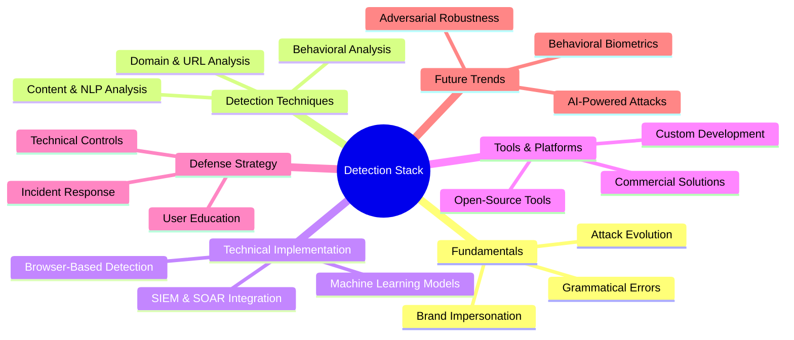
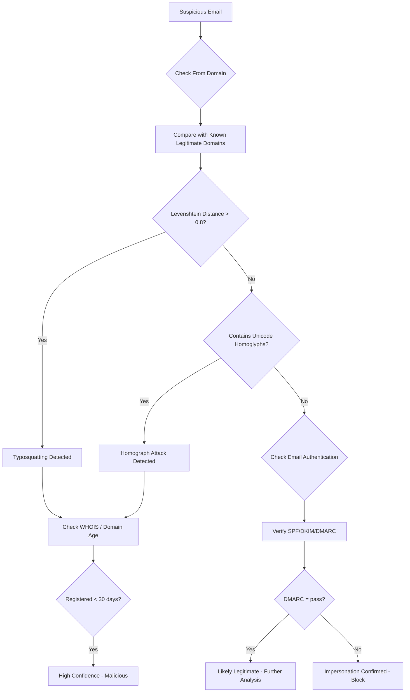
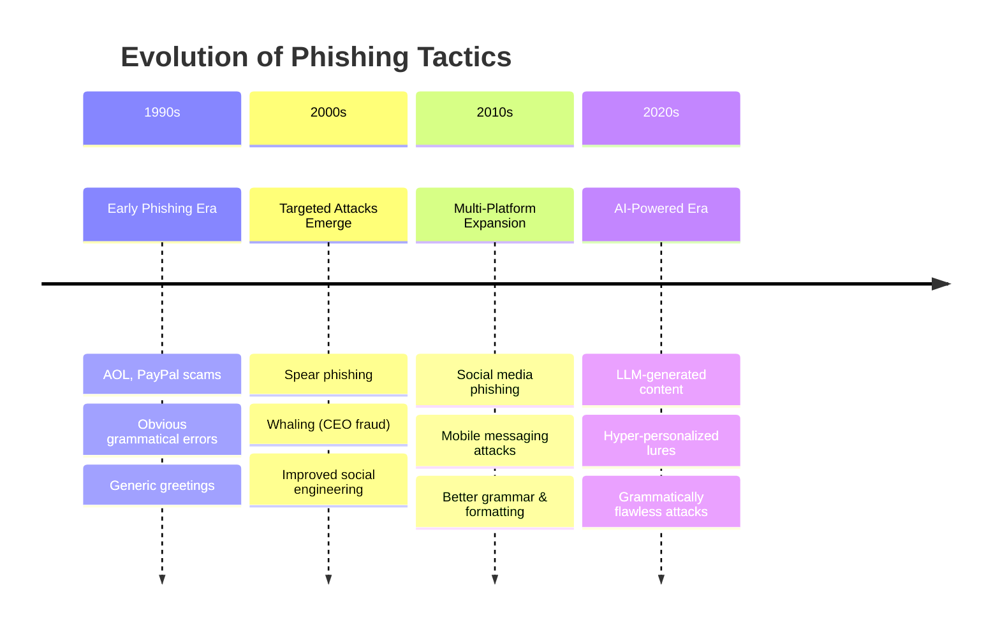
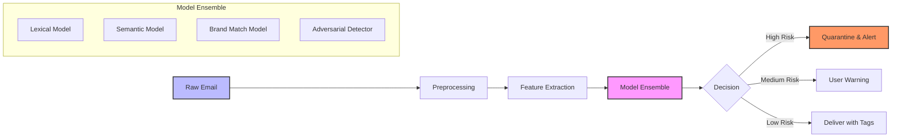
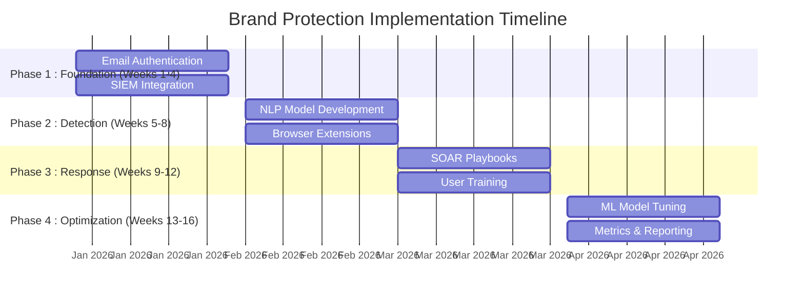

---
tags: [email-security]
---
# 🔍 Full-Stack Lesson: Detecting Brand Impersonation & Grammatical Errors


## TCM Exam Objectives
- Detect brand impersonation through domain typosquatting, homograph attacks, and display-name spoofing
- Analyze URL structure for subdomain manipulation and TLD exploitation
- Apply Levenshtein distance algorithms for domain similarity detection
- Understand how LLMs have transformed grammatical error detection from a primary signal to an unreliable indicator
- Implement NLP-based phishing detection pipelines with lexical, syntactic, and semantic analysis
- Deploy email authentication protocols (SPF, DKIM, DMARC) as foundational brand protection
- Use perceptual hashing for logo similarity detection in brand impersonation
- Configure SIEM rules for brand protection and domain monitoring
- Recognize the limitations of ML-based detection against LLM-generated phishing content
- Develop adversarial robustness techniques for AI-powered brand impersonation defense

# 🔍 Full-Stack Lesson: Detecting Brand Impersonation & Grammatical Errors

## 📋 Lesson Overview
This lesson provides a comprehensive, full-stack approach to detecting **brand impersonation** and **grammatical errors**—two critical indicators of phishing and social engineering attacks. You'll learn detection methodologies, technical implementation, and how to build layered defenses that combine automated analysis with human awareness.



## 1. 🎯 Fundamentals: Understanding the Threat Landscape

### 1.1 Brand Impersonation: Definition & Impact
**Brand impersonation** is a cyberattack technique where attackers masquerade as a legitimate brand to deceive victims into sharing sensitive information or taking malicious actions 【turn0search2】【turn0search10】. This typically occurs through:
- **Email spoofing**: Forging sender addresses to appear from legitimate domains
- **Domain typosquatting**: Registering lookalike domains (e.g., `paypa1.com` instead of `paypal.com`)
- **Website cloning**: Creating replica websites of trusted brands
- **Social media impersonation**: Creating fake accounts of legitimate companies

📌 **Exam Tip:** Brand impersonation detection on the PSAA exam focuses on three key techniques: (1) Levenshtein distance for domain similarity (paypa1.com vs paypal.com), (2) homograph attack detection using mixed Unicode scripts (Cyrillic characters in Latin domains), and (3) email authentication verification (SPF/DKIM/DMARC). DMARC `p=reject` blocks 100% of direct domain spoofing.



> 💡 **Key Insight**: According to the Anti-Phishing Working Group (APWG), phishing attacks targeting the financial sector accounted for 23.5% of all phishing attacks in Q2 2023, making brand impersonation a critical threat vector 【turn0search17】.

### 1.2 Grammatical Errors: Traditional vs. Modern Phishing
Historically, phishing emails contained obvious grammatical errors and spelling mistakes due to:
- **Language barriers**: Many attackers are non-native English speakers
- **Rapid campaign deployment**: Mass-distributed emails with minimal proofreading
- **Technical focus**: Prioritizing malicious payload over linguistic quality

However, the advent of **Large Language Models (LLMs)** like ChatGPT has transformed this landscape. Modern phishing emails generated by AI are often grammatically correct, contextually relevant, and linguistically natural, making them harder to detect 【turn0search7】.

### 1.3 Evolution of Phishing Attacks


## 2. 🔍 Detection Techniques: Brand Impersonation

### 2.1 Domain & URL Analysis
<details>
<summary>🔧 Technical Implementation Details</summary>

#### **1. Domain Monitoring**
```python
# Pseudo-code for domain similarity detection
import Levenshtein  # For string comparison

def check_domain_similarity(legitimate_domain, suspicious_domain):
    # Calculate Levenshtein distance (edit distance)
    distance = Levenshtein.distance(legitimate_domain, suspicious_domain)
    max_length = max(len(legitimate_domain), len(suspicious_domain))
    similarity = 1 - (distance / max_length)
    
    if similarity > 0.8:  # Threshold for suspicious similarity
        return {
            'status': 'suspicious',
            'similarity_score': similarity,
            'recommendation': 'investigate further'
        }
    return {'status': 'safe'}

# Example usage
check_domain_similarity("paypal.com", "paypa1.com")  # Common typosquat
check_domain_similarity("microsoft.com", "micros0ft.com")  # Homograph attack
```

#### **2. URL Structure Analysis**
- **Homograph attacks**: Using similar-looking characters from different scripts (e.g., Cyrillic 'а' instead of Latin 'a')
- **Subdomain manipulation**: `login.bank.com.evil.com` vs `login.bank.com`
- **URL shortening services**: Abuse of legitimate shorteners to hide destinations
- **TLD exploitation**: `.com` vs `.co` vs `.cm` (typosquatting)

#### **3. Certificate Analysis**
- **Certificate Authorities (CAs)**: Legitimate brands use trusted CAs (DigiCert, Let's Encrypt)
- **Certificate transparency logs**: Monitor for unauthorized certificates for your domains
- **SAN (Subject Alternative Name) mismatches**: Certificates covering unrelated domains
</details>

### 2.2 Email Authentication Protocols
| Protocol | Function | Implementation | Effectiveness |
|----------|----------|----------------|---------------|
| **SPF** | Sender Policy Framework | DNS TXT records specifying authorized sending servers | Prevents direct domain spoofing |
| **DKIM** | DomainKeys Identified Mail | Cryptographic signing of emails | Ensures email content integrity |
| **DMARC** | Domain-based Message Authentication | Aligns SPF/DKIM with domain policy | Provides reporting and enforcement |

📌 **Exam Tip:** DMARC rollout must follow a phased approach: start with `p=none` (monitoring), review reports, move to `p=quarantine`, and finally enforce `p=reject`. Skipping directly to `p=reject` without monitoring can cause legitimate email to be rejected.

> ⚠️ **Implementation Note**: DMARC with `p=reject` policy can block 100% of direct domain spoofing, but requires careful rollout to avoid false positives 【turn0search12】.

### 2.3 Logo & Brand Asset Detection
<details>
<summary>🖼️ Image Analysis Techniques</summary>

#### **1. Logo Similarity Detection**
```python
# Conceptual approach using perceptual hashing
from PIL import Image
import imagehash

def detect_logo_impersonation(legitimate_logo_path, suspicious_logo_path):
    # Load images
    legit_img = Image.open(legitimate_logo_path)
    suspicious_img = Image.open(suspicious_logo_path)
    
    # Calculate perceptual hash (pHash)
    legit_hash = imagehash.phash(legit_img)
    suspicious_hash = imagehash.phash(suspicious_img)
    
    # Calculate Hamming distance (number of differing bits)
    distance = legit_hash - suspicious_hash
    
    # Threshold: <5 bits difference indicates likely match
    if distance < 5:
        return {
            'status': 'impersonation_detected',
            'confidence': 'high',
            'distance': distance
        }
    elif distance < 10:
        return {
            'status': 'suspicious',
            'confidence': 'medium',
            'distance': distance
        }
    return {'status': 'different'}
```

#### **2. Color Palette Analysis**
- Extract dominant colors from brand assets
- Compare with suspicious assets using color distance algorithms
- Flag significant deviations from brand guidelines

#### **3. Font & Typography Detection**
- Identify fonts used in communications
- Compare with official brand guidelines
- Detect unusual font combinations or mismatches
</details>

## 3. 📝 Detection Techniques: Grammatical Errors

### 3.1 NLP-Based Analysis Approaches
<details>
<summary>🧠 Technical Deep Dive: NLP Pipeline</summary>

#### **1. Text Preprocessing Pipeline**
```python
# Advanced text preprocessing for phishing detection
import re
import nltk
from nltk.corpus import stopwords
from nltk.tokenize import word_tokenize
from spellchecker import SpellChecker

class PhishingTextPreprocessor:
    def __init__(self):
        self.spellchecker = SpellChecker()
        self.stop_words = set(stopwords.words('english'))
    
    def preprocess(self, text):
        # 1. Lowercase normalization
        text = text.lower()
        
        # 2. Remove URLs and email addresses
        text = re.sub(r'http\S+|www\S+|https\S+', '', text, flags=re.MULTILINE)
        text = re.sub(r'\S+@\S+', '', text)
        
        # 3. Tokenization
        tokens = word_tokenize(text)
        
        # 4. Spell correction
        corrected_tokens = []
        for token in tokens:
            if token.isalpha() and token not in self.stop_words:
                # Correct spelling
                corrected = self.spellchecker.correction(token)
                if corrected != token:
                    # Log spelling correction
                    print(f"Spelling correction: {token} → {corrected}")
                corrected_tokens.append(corrected or token)
        
        # 5. Word splitting for combined words (e.g., "login" → "log in")
        split_tokens = []
        for token in corrected_tokens:
            # Check if token can be split into valid words
            splits = self.find_word_splits(token)
            if splits:
                split_tokens.extend(splits)
            else:
                split_tokens.append(token)
        
        return ' '.join(split_tokens)
    
    def find_word_splits(self, token):
        # Dictionary-based word splitting
        dictionary = set(nltk.corpus.words.words())
        possible_splits = []
        
        for i in range(1, len(token)):
            part1, part2 = token[:i], token[i:]
            if part1 in dictionary and part2 in dictionary:
                possible_splits.append([part1, part2])
        
        return possible_splits[0] if possible_splits else None
```

#### **2. Feature Extraction**
- **Lexical features**: Word count, sentence length, punctuation patterns
- **Syntactic features**: Part-of-speech tag sequences, parse tree depth
- **Semantic features**: Named entity consistency, sentiment analysis
- **Stylistic features**: Writing style consistency with brand voice

#### **3. Machine Learning Models**
```python
# Example model architecture
from sklearn.ensemble import RandomForestClassifier
from sklearn.feature_extraction.text import TfidfVectorizer
from sklearn.pipeline import Pipeline

# Create pipeline
phishing_detection_pipeline = Pipeline([
    ('vectorizer', TfidfVectorizer(
        max_features=5000,
        ngram_range=(1, 3),  # Unigrams to trigrams
        stop_words='english'
    )),
    ('classifier', RandomForestClassifier(
        n_estimators=100,
        class_weight='balanced',  # Handle imbalanced datasets
        random_state=42
    ))
])

# Training data preparation
# X_train: list of email texts
# y_train: labels (0=legitimate, 1=phishing)
phishing_detection_pipeline.fit(X_train, y_train)
```
</details>

### 3.2 Adversarial Robustness for LLM-Generated Content
With LLMs generating grammatically correct phishing emails, detection systems must evolve:

<details>
<summary>🛡️ Advanced Robustness Techniques</summary>

#### **1. Adversarial Training**
- Train models on adversarial samples generated by TextAttack framework
- Include LLM-generated phishing content in training data
- Implement perturbation techniques (synonym substitution, sentence restructuring)

#### **2. Linguistic Pattern Analysis**
```python
# Detect LLM-generated content through stylometric analysis
def detect_llm_patterns(text):
    features = {
        'perplexity_score': calculate_perplexity(text),  # Lower for LLM-generated
        'burstiness': calculate_burstiness(text),  # Sentence length variation
        'vocabulary_richness': calculate_ttr(text),  # Type-token ratio
        'repetition_patterns': detect_repetition(text),
        'coherence_score': calculate_coherence(text)
    }
    
    # LLM-generated text often has:
    # - Lower perplexity (more predictable word choices)
    # - Lower burstiness (more uniform sentence structures)
    # - Specific coherence patterns
    
    return features
```

#### **3. Multi-Model Ensemble Approach**
- Combine traditional ML models with LLM-based detectors
- Use ensemble voting to improve robustness
- Implement model diversity (different algorithms, training data)
</details>

## 4. 🛠️ Technical Implementation Framework

### 4.1 SIEM Integration for Brand Protection
<details>
<summary>📊 SIEM Rule Examples</summary>

#### **Splunk Detection Rule**
```spl
index=email (sourcetype=mail:logs)
[
    search index=threat_intel brand_impersonation_domains
    | table domain
    | format
]
| stats count by sender, recipient, subject, domain
| where count > 0
| eval risk_score=case(
    like(domain, "%.co"), 8,  # Typosquatting TLD
    like(domain, "%.cm"), 9,  # Common typo
    like(sender, "*%@*.%"), 7,  # Generic webmail
    1=1, 5
)
| where risk_score >= 7
| sort - risk_score
```

#### **Microsoft Sentinel Detection**
```kql
// Brand impersonation detection query
let legitimate_domains = externaldata(brand: string)["https://contoso.com/domains.csv"];
EmailEvents
| where SenderMailFromDomain !in (legitimate_domains)
| extend similarity = similarity_score(SenderMailFromDomain, tostring(legitimate_domains))
| where similarity > 0.8
| project TimeGenerated, SenderMailFromDomain, RecipientEmailAddress, Subject, similarity
| sort by similarity desc
```
</details>

### 4.2 Machine Learning Pipeline Architecture


### 4.3 Browser-Based Detection
<details>
<summary>🌐 Client-Side Protection</summary>

#### **1. Browser Extension Architecture**
```javascript
// Conceptual browser extension for brand impersonation detection
class BrandProtectionExtension {
    constructor() {
        this.legitimateBrands = this.loadBrandDatabase();
        this.threshold = 0.85;
    }
    
    analyzePage() {
        const url = window.location.href;
        const domain = this.extractDomain(url);
        
        // Check domain similarity
        const similarity = this.calculateSimilarity(domain, this.legitimateBrands);
        
        if (similarity > this.threshold) {
            this.showWarning();
            this.reportToBackend(url, domain, similarity);
        }
        
        // Analyze page content for logo impersonation
        this.analyzeLogos();
        
        // Check SSL certificate
        this.verifyCertificate();
    }
    
    calculateSimilarity(suspiciousDomain, legitimateDomains) {
        // Implement Levenshtein distance algorithm
        let maxSimilarity = 0;
        for (const legitDomain of legitimateDomains) {
            const distance = this.levenshteinDistance(suspiciousDomain, legitDomain);
            const similarity = 1 - (distance / Math.max(suspiciousDomain.length, legitDomain.length));
            maxSimilarity = Math.max(maxSimilarity, similarity);
        }
        return maxSimilarity;
    }
    
    showWarning() {
        // Display warning overlay to user
        const warning = document.createElement('div');
        warning.innerHTML = `
            <div style="position:fixed;top:0;left:0;right:0;background:red;color:white;padding:10px;z-index:9999;">
                ⚠️ Potential Brand Impersonation Detected!
                Domain: ${window.location.hostname}
            </div>
        `;
        document.body.appendChild(warning);
    }
}
```

#### **2. Content Security Policy (CSP)**
- Implement strict CSP rules to prevent unauthorized content loading
- Block mixed content (HTTP resources on HTTPS pages)
- Restrict external script execution
</details>

## 5. 📊 Tools & Platforms

### 5.1 Commercial Solutions Comparison

| Tool | Key Features | Best For | Pricing Model |
|------|--------------|----------|---------------|
| **Proofpoint Email Fraud Defense** | DMARC implementation, domain spoofing protection, executive impersonation protection | Enterprise email security | Per user/month |
| **Recorded Future Brand Intelligence** | Dark web monitoring, typosquat detection, logo misuse tracking | Threat intelligence teams | Subscription |
| **Barracuda Impersonation Protection** | Domain spoofing, display name spoofing, conversation hijacking | SMBs and mid-market | Per mailbox |
| **Check Point Harmony Email & Collaboration** | AI-powered phishing detection, brand protection, BEC defense | Unified security platform | Per user/year |

### 5.2 Open-Source Tools
<details>
<summary>🛠️ Open-Source Implementations</summary>

#### **1. PhishCatch**
```bash
# Install PhishCatch for brand impersonation detection
git clone https://github.com/curtashby/phishcatch.git
cd phishcatch
pip install -r requirements.txt

# Configure brand monitoring
python phishcatch.py --brand "Your Company" --domains "yourcompany.com,your-company.com"
```

#### **2. URL Analysis with urlscan.io**
```python
# Python script for URL analysis
import requests

def analyze_url(url, api_key):
    response = requests.post(
        'https://urlscan.io/api/v1/scan/',
        headers={'API-Key': api_key},
        json={'url': url, 'visibility': 'public'}
    )
    
    if response.status_code == 200:
        result = response.json()
        return {
            'url': result['url'],
            'domain': result['task']['domain'],
            'ip': result['task']['ip'],
            'server': result['task']['server'],
            'screenshot': result['task']['screenshotURL'],
            'score': result['verdicts']['overall']['score']
        }
    return None
```

#### **3. Custom NLP Pipeline with spaCy**
```python
# Advanced NLP pipeline for grammatical analysis
import spacy
from spacy.language import Language
from spacy_pipeline import PhishingDetector

nlp = spacy.load('en_core_web_sm')

# Add custom component for phishing detection
@Language.component("phishing_detector")
def phishing_detector(doc):
    detector = PhishingDetector()
    doc._.phishing_score = detector.analyze(doc)
    doc._.grammatical_errors = detector.find_errors(doc)
    return doc

# Add to pipeline
nlp.add_pipe("phishing_detector", last=True)

# Analyze email text
doc = nlp(email_text)
print(f"Phishing score: {doc._.phishing_score}")
print(f"Grammatical errors: {doc._.grammatical_errors}")
```
</details>

## 6. 🚀 Implementation Strategy

### 6.1 Phased Deployment Approach



### 6.2 Metrics & KPIs

| Category | Metric | Target | Measurement Method |
|----------|--------|--------|-------------------|
| **Detection Effectiveness** | Brand impersonation detection rate | >95% | False positive/negative analysis |
| **Response Time** | Time to detect (TTD) | <30 seconds | SIEM alert timestamps |
| **User Impact** | False positive rate | <5% | User feedback & manual review |
| **Coverage** | Protected brands | 100% of top brands | Asset inventory coverage |
| **Adversarial Robustness** | LLM-generated detection rate | >90% | Adversarial testing framework |

## 7. 🔮 Future Trends & Emerging Threats

### 7.1 AI-Powered Attack Evolution
<details>
<summary>🤖 Adversarial AI Threats</summary>

#### **1. Automated Phishing Generation**
```python
# Conceptual LLM-powered phishing generator
class LLMPhishingGenerator:
    def __init__(self, model_name="gpt-4"):
        self.model = self.load_model(model_name)
    
    def generate_phishing_email(self, target_info, brand_info):
        prompt = f"""
        Create a phishing email impersonating {brand_info['name']} targeting {target_info['name']}.
        Include:
        - Urgency: {target_info['urgency_level']}
        - Personal details: {target_info['personal_info']}
        - Brand voice: {brand_info['tone']}
        - Avoid grammatical errors
        - Include malicious URL: {brand_info['fake_url']}
        """
        
        email_content = self.model.generate(prompt)
        return email_content
    
    def evade_detection(self, email_content, detection_systems):
        # Implement adversarial perturbations
        perturbations = [
            self.synonym_substitution,
            self.sentence_restructuring,
            self.encoding_tricks
        ]
        
        for perturbation in perturbations:
            email_content = perturbation(email_content)
        
        return email_content
```

#### **2. Deepfake Brand Impersonation**
- Voice cloning for vishing attacks
- Video impersonation for executive fraud
- Real-time chatbot impersonation
</details>

### 7.2 Defensive Evolution
- **Behavioral biometrics**: Analyzing typing patterns and mouse movements
- **Continuous authentication**: Beyond initial login verification
- **Zero-trust architecture**: Never trust, always verify
- **Quantum-resistant cryptography**: Future-proofing authentication

## 8. 📚 Best Practices & Recommendations

### 8.1 Technical Controls
1. **Implement DMARC with reject policy** for all sending domains
2. **Deploy email authentication** (SPF, DKIM, DMARC) for all mail servers
3. **Use brand-protected links** in email communications
4. **Implement certificate transparency monitoring** for your domains
5. **Deploy browser-based protection** for critical users

### 8.2 User Education
- **Recognize urgency cues**: Phishing creates artificial urgency
- **Verify through separate channels**: Don't use contact info from suspicious messages
- **Check URLs carefully**: Hover before clicking, verify domain spelling
- **Report suspicious communications**: Establish clear reporting procedures

### 8.3 Incident Response
1. **Quarantine** affected accounts and systems
2. **Analyze** attack patterns and IOCs
3. **Communicate** with stakeholders transparently
4. **Remediate** vulnerabilities and improve defenses
5. **Document** lessons learned and update playbooks

## 9. 🎓 Conclusion & Strategic Recommendations

### 9.1 The Evolving Threat Landscape
Brand impersonation and grammatical error detection must evolve beyond traditional rule-based approaches. With LLMs generating flawless phishing content, detection systems must leverage **behavioral analysis**, **adversarial robustness**, and **multi-layered defenses**.

### 9.2 Strategic Priorities
1. **Invest in AI-powered detection** systems that can identify LLM-generated content
2. **Implement comprehensive email authentication** (SPF, DKIM, DMARC)
3. **Deploy browser-based protection** for high-risk users
4. **Establish continuous monitoring** for brand asset misuse
5. **Develop adversarial testing** capabilities to assess detection robustness

### 9.3 Future Preparation
Organizations must prepare for:
- **Quantum computing impacts** on current cryptographic methods
- **Deepfake-enabled attacks** requiring new verification methods
- **AI-versus-AI warfare** where attackers and defenders use similar technologies
- **Behavioral authentication** as a complement to traditional methods

> 💡 **Final Insight**: The most effective defense combines **technical controls**, **user education**, and **continuous adaptation** to emerging threats. No single solution provides complete protection—only a layered, full-stack approach can effectively mitigate the risks of brand impersonation and grammatical deception in modern phishing attacks.

---

**📚 Additional Resources**:
- [CISA Phishing Guidance](https://www.cisa.gov/phishing)
- [M3AAWG Best Practices](https://www.m3aawg.org/)
- [Anti-Phishing Working Group](https://apwg.org/)
- [NIST SP 800-177 Trustworthy Email](https://csrc.nist.gov/publications/detail/sp/800-177/final)

*This lesson provides a comprehensive foundation for detecting brand impersonation and grammatical errors in cybersecurity. For specific implementation guidance, consult with cybersecurity professionals and refer to vendor documentation for your particular security stack.*