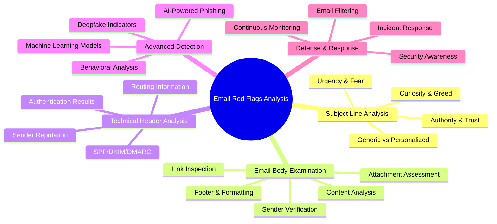
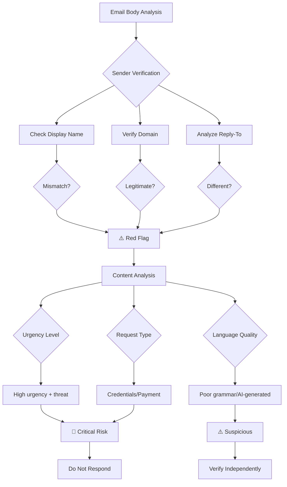
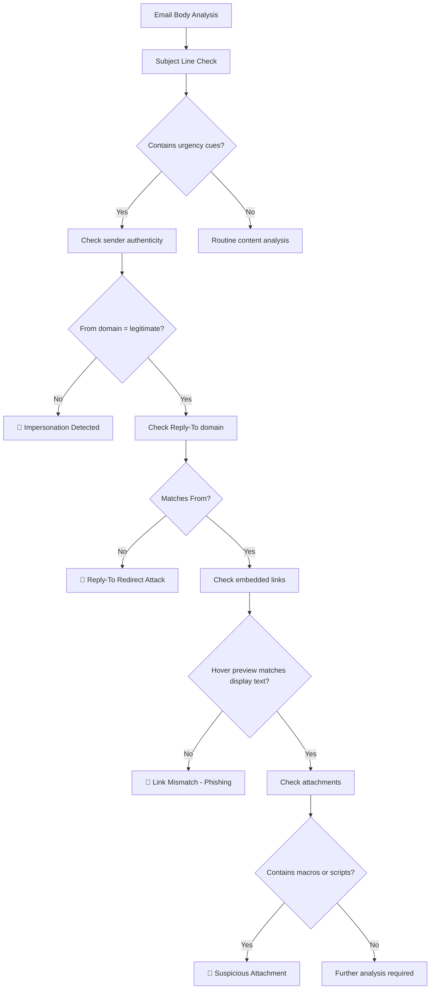
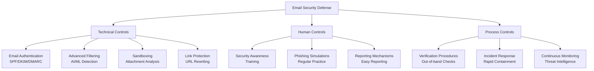

---
tags: [email-security]
---
# 🚨 Identifying Red Flags in Email Body and Subject Lines: A Full-Stack Lesson


## TCM Exam Objectives
- Identify subject line psychological triggers: urgency, curiosity, greed, authority, and social proof
- Analyze email body for sender verification indicators including display name vs actual address mismatches
- Detect domain typosquatting and subdomain manipulation in email body links
- Recognize salutation anomalies: generic greetings, no salutation, or overly formal language
- Evaluate urgency and pressure tactics including artificial deadlines and consequence escalation
- Identify dangerous file types (.docm, .xlsm, .js, .vbs) in attachment assessment
- Apply the three pillars of email authentication (SPF/DKIM/DMARC) for header analysis
- Understand how AI-generated phishing eliminates traditional grammatical red flags
- Build multi-layered defense strategies combining technical, human, and process controls
- Differentiate between bulk phishing, spear phishing, and whaling based on content indicators

# 🚨 Identifying Red Flags in Email Body and Subject Lines: A Full-Stack Lesson

## 🧠 Overview: The Email Threat Landscape

Email remains the **primary attack vector** for cybercriminals, with phishing attacks reaching an all-time high of over **1 million recorded attacks in Q1 2022 alone** 【turn0search2】. This full-stack lesson equips you with comprehensive skills to analyze email bodies and subject lines, identify malicious patterns, and implement effective defense mechanisms.



## 📊 1. Subject Line Red Flags: Psychological Triggers

### 1.1 Common Phishing Subject Patterns

| Pattern Type | Example | Psychological Trigger | Risk Level |
|-------------|---------|----------------------|------------|
📌 **Exam Tip:** On the PSAA exam, subject line analysis is tested through psychological trigger identification. Memorize the five pattern types: Urgency (fear), Curiosity (natural interest), Greed (rewards), Authority (institutional respect), and Social Proof (herd mentality). Authority-triggering subjects are classified as "Critical" risk level.

| **Urgency/Alarm** | "Action Required: Your Account Has Been Compromised" | Fear of data loss | High |
| **Curiosity** | "You have 1 new voicemail" or "See who viewed your profile" | Natural curiosity | Medium |
| **Greed/Reward** | "Congratulations! You've won $500" or "Limited time offer" | Desire for gain | High |
| **Authority** | "Final notice: IRS tax payment required" | Respect for authority | Critical |
| **Social Proof** | "Your colleagues have already updated" | Herd mentality | Medium |

### 1.2 Detailed Analysis of Subject Line Tactics

<details>
<summary>🔍 Deep Dive: Subject Line Manipulation Techniques</summary>

#### 1. **Urgency and Fear-Based Tactics**
- **Account suspension warnings**: "Your account will be suspended in 24 hours"
- **Unauthorized access alerts**: "Unusual sign-in activity detected"
- **Legal consequences**: "Final notice before legal action"
- **Package delivery failures**: "Your package could not be delivered"

These create **artificial time pressure** that forces recipients to act before critical thinking engages 【turn0search3】.

#### 2. **Curiosity and Social Engineering**
- **Voicemail notifications**: "You have a new voicemail from [Unknown]"
- **Document shares**: "John Doe has shared a document with you"
- **Profile views**: "See who viewed your LinkedIn profile"
- **Tagged photos**: "You've been tagged in a photo"

These exploit **natural human curiosity** and social validation needs.

#### 3. **Authority and Trust Exploitation**
- **Executive impersonation**: "Urgent: CEO request"
- **Government agency warnings**: "IRS: Final tax notice"
- **Bank alerts**: "Security alert from Bank of America"
- **IT department notices**: "Password expiration required"

These leverage **respect for authority** and institutional trust.

#### 4. **Generic vs. Personalized Approaches**
- **Bulk phishing**: Uses generic greetings ("Dear User", "Dear Customer")
- **Spear phishing**: Personalized with accurate names and titles 【turn0search15】【turn0search17】
- **Whaling**: Targets high-profile executives with customized lures
</details>

## 📧 2. Email Body Red Flags: Comprehensive Analysis

### 2.1 Sender Verification Indicators

 

**Key Verification Points:**
- **Display name vs. actual email address**: "IT Support" <attacker@gmail.com>
- **Domain typosquatting**: rnicrosoft.com (rn instead of m), paypa1.com (1 instead of l) 【turn0search3】
- **Subdomain manipulation**: support@amazon-secure.com (not legitimate Amazon domain)
- **Reply-to address mismatch**: From: ceo@company.com, Reply-To: attacker@malicious.com

### 2.2 Content Analysis Framework



### 2.3 Detailed Body Content Red Flags

<details>
<summary>🔧 Technical Analysis of Email Body Elements</summary>

#### 1. **Salutation Analysis**
- **Generic greetings**: "Dear User," "Dear Customer," "Dear [Email Address]" 【turn0search3】
- **No salutation**: Many phishing emails skip greetings entirely
- **Overly formal**: "Dear Valued Customer" when legitimate emails use first name
- **Spear phishing exception**: May include accurate name but with other red flags

#### 2. **Urgency and Pressure Tactics**
- **Artificial deadlines**: "Respond within 24 hours" or "Immediate action required"
- **Consequence escalation**: "Account suspension," "Legal action," "Service termination"
- **Bypass procedures**: "Don't tell anyone," "Keep this confidential"
- **Authority pressure**: "CEO needs this immediately," "IT department requires"

#### 3. **Request Analysis**
- **Credential harvesting**: "Verify your password," "Update login details"
- **Financial requests**: "Wire transfer," "Payment verification," "Invoice payment"
- **Information gathering**: "Confirm your SSN," "Update billing information"
- **Action requests**: "Click here to update," "Download this attachment"

#### 4. **Language and Tone Indicators**
- **Grammar and spelling errors**: Historically common but less frequent with AI 【turn0search3】
- **Unusual phrasing**: "We detect unusual activity" vs. "We've detected unusual activity"
- **Inconsistent tone**: Formal language with informal requests
- **AI-generated perfection**: Too perfect grammar with slightly off context
</details>

### 2.4 Link and Attachment Assessment

 

📌 **Exam Tip:** For link analysis on the exam, remember that the "legitimate domain left of TLD" is the only trustworthy part of a URL. In `login.bank.com.evil.com`, the domain is `evil.com`, not `bank.com`. URL shorteners and redirectors using legitimate platforms (Google, SharePoint) are common obfuscation techniques in phishing.



**Link Analysis Checklist:**
- **Hover preview**: Check actual URL vs. displayed text 【turn0search3】
- **Domain verification**: Legitimate domain left of TLD is only trustworthy part
- **URL shorteners**: bit.ly, tinyurl.com often used to obscure destinations
- **Redirectors**: Legitimate platforms (Google, SharePoint) used as intermediaries
- **Anchor text mismatch**: "Click here" leading to unexpected domain

**Attachment Risk Assessment:**
- **Dangerous file types**: .docm, .xlsm (macro-enabled Office files) 【turn0search3】
- **PDF with embedded links**: Malicious PDFs with JavaScript exploits
- **Archive files**: .zip, .iso containing malware
- **HTML files**: Credential harvesting forms rendered in browser
- **Unexpected attachments**: Unsolicited files require verification

## 🔍 3. Technical Header Analysis: Beyond the Visible

### 3.1 Email Authentication Framework

 

**Three Pillars of Email Authentication:**

| Protocol | Function | Failure Indication | Action |
|----------|----------|-------------------|--------|
| **SPF** | Specifies authorized sending servers | "Fail" or "SoftFail" | Quarantine or reject |
| **DKIM** | Cryptographic signature verification | "fail" or "invalid" | Treat as unauthenticated |
| **DMARC** | Policy for authentication failures | "quarantine" or "reject" | Follow policy instructions |

### 3.2 Header Analysis Process

<details>
<summary>⚙️ Step-by-Step Header Investigation</summary>

#### Step 1: **Extract Full Headers**
- Email client → View Original or Show Original
- Save as .eml file for analysis
- Use header analysis tools: MXToolbox, Google Admin Toolbox 【turn0search10】

#### Step 2: **Authentication Results Check**
```
Authentication-Results: mx.google.com;
   spf=pass (google.com: domain of sender@example.com designates 192.0.2.1 as permitted sender) smtp.mailfrom=sender@example.com;
   dkim=pass header.i=@example.com;
   dmarc=pass (p=REJECT sp=REJECT dis=NONE) header.from=example.com
```

**Red Flags:**
- `spf=fail` or `spf=softfail`
- `dkim=fail` or `dkim=invalid`
- `dmarc=fail` or `dmarc=quarantine`

#### Step 3: **Routing Analysis**
- **Received headers**: Trace email path from sender to recipient
- **IP reputation**: Check sending IP against blacklists
- **Geographic anomalies**: Email from unexpected countries
- **Server authentication**: Legitimate services use authenticated SMTP

#### Step 4: **Sender Verification**
- **Return-Path**: Should match From address domain
- **Reply-To**: Different from From address is suspicious
- **Message-ID**: Format should match legitimate domain
- **X-Originating-IP**: Check against known good ranges
</details>

## 🤖 4. Advanced Detection Techniques

### 4.1 Machine Learning Approaches

 

**ML-Based Detection Features:**
1. **Text features**: Subject and body content analysis 【turn0search20】【turn0search21】
2. **Structural features**: Email header patterns and metadata
3. **URL features**: Link analysis and destination reputation
4. **Attachment features**: File type and behavior analysis
5. **Behavioral features**: Sending patterns and frequency

**Detection Accuracy:**
- **Traditional ML**: 95-98% accuracy 【turn0search21】
- **Deep Learning**: 98-99.5% accuracy 【turn0search23】
- **Ensemble methods**: 99.5%+ accuracy with reduced false positives

### 4.2 AI-Powered Phishing Evolution

<details>
<summary>🤖 The AI Arms Race in Phishing</summary>

#### **Attacker AI Capabilities:**
- **Automated personalization**: OSINT gathering at scale 【turn0search19】
- **Grammar perfection**: Eliminating traditional detection signals
- **Contextual adaptation**: Adjusting to target's industry and role
- **Deepfake integration**: Voice and video impersonation

#### **Defender AI Countermeasures:**
- **Behavioral analysis**: Beyond static content inspection
- **Anomaly detection**: Identifying unusual sending patterns
- **Threat intelligence**: Real-time reputation checking
- **Adaptive training**: Continuous learning from new threats

#### **The Detection Challenge:**
Traditional rule-based systems struggle against AI-generated phishing because:
- No grammatical errors to flag
- Perfect formatting and branding
- Contextually accurate content
- Personalized details from breach data

**Solution**: Behavioral AI that analyzes sending patterns, request unusualness, and contextual deviations rather than just content 【turn0search17】.
</details>

## 🛡️ 5. Defense and Mitigation Framework

### 5.1 Multi-Layered Defense Strategy



### 5.2 Practical Defense Implementation

<details>
<summary>🛠️ Building Your Email Defense Stack</summary>

#### **Layer 1: Email Authentication**
```
# SPF Record Example
example.com. IN TXT "v=spf1 include:_spf.google.com include:mailgun.org ~all"

# DKIM Record Example
default._domainkey.example.com. IN TXT "v=DKIM1; k=rsa; p=MIGfMA0GCSqGSIb3DQEBAQUAA4GNADCBiQKBgQDLMMExLiGRqzJkNdNIjUnLX7JL0wjbwwENDoXgJIBisIsrofLPetZM401dioNU8k//Yw5/iyzhyrWsIyINyyHs77EoDFDDEEFFEKJKLJHLKifLN51IIvwIDAQAB"

# DMARC Record Example
_dmarc.example.com. IN TXT "v=DMARC1; p=reject; rua=mailto:dmarc@example.com; ruf=mailto:forensic@example.com; pct=100; adkim=s; aspf=s"
```

#### **Layer 2: Advanced Filtering**
- **AI/ML detection**: Use platforms with behavioral analysis
- **Sandboxing**: Analyze attachments in isolated environment
- **Link protection**: Rewrite URLs for safe preview
- **Sender reputation**: Real-time blackhole list checking

#### **Layer 3: Human Firewall**
- **Security awareness training**: Regular, not annual
- **Phishing simulations**: Monthly with varied scenarios
- **Easy reporting**: One-click reporting buttons
- **Executive buy-in**: Leadership sets security culture

#### **Layer 4: Process Integration**
- **Verification procedures**: Out-of-band confirmation for financial requests
- **Incident response**: 24/7 monitoring and rapid containment
- **Threat intelligence**: Integration with industry feeds
- **Continuous assessment**: Regular red team exercises
</details>

## 📈 6. Detection Tools and Platforms

### 6.1 Tool Comparison Matrix

| Tool Category | Examples | Key Features | Best For |
|--------------|----------|--------------|----------|
| **Email Security Gateways** | Proofpoint, Mimecast, Cisco ESA | Advanced threat protection, DLP, encryption | Enterprise organizations |
| **AI-Powered Solutions** | Abnormal Security, IRONSCALES, Cofense | Behavioral AI, autonomous response | Modern cloud environments |
| **Analysis Tools** | MXToolbox, Google Admin Toolbox, MailSpoof | Header analysis, authentication checking | Security analysts |
| **Simulation Platforms** | KnowBe4, Cofense PhishMe, Adaptive Security | Phishing simulations, awareness training | Human risk management |
| **Open Source Tools** | Apache SpamAssassin, Rspamd, MailScanner | Customizable filtering, community rules | Budget-conscious organizations |

### 6.2 Building an Analysis Toolkit

<details>
<summary>🧰 Essential Tools for Email Analysts</summary>

#### **For Quick Triage:**
1. **MXToolbox Email Header Analyzer**: Quick authentication and routing check 【turn0search10】
2. **VirusTotal**: Scan attachments and URLs against 70+ engines
3. **URLVoid**: Check URL reputation across multiple services
4. **EmailRep.io**: Check sender reputation and breach history

#### **For Deep Analysis:**
1. **Peepdf**: PDF malware analysis with JavaScript extraction 【turn0search23】
2. **Olevba**: Office macro analysis and extraction
3. **CyberChef**: Data decoding and transformation
4. **Wireshark**: Network traffic analysis for active exploits

#### **For Automation:**
1. **Sublime Security**: AI-powered email analysis rules
2. **PhishCatch**: Open-source phishing detection and response
3. **Michael Bazzell's Email tools**: OSINT and email investigation
4. **TheHarvester**: Email enumeration and OSINT gathering
</details>

## 🎯 7. Real-World Case Studies

### 7.1 Case Study: Business Email Compromise

<details>
<summary>📖 Analysis of a $15M BEC Attack</summary>

**Attack Profile:**
- **Target**: CFO of mid-sized manufacturing company
- **Vector**: Spear phishing email impersonating CEO
- **Lure**: "Urgent acquisition requires immediate wire transfer"
- **Technique**: Conversation hijacking of existing email thread

**Red Flags Present:**
1. **Sender**: ceo@company-cfo.com (lookalike domain)
2. **Time**: Sent at 4:45 PM Friday (end of week urgency)
3. **Request**: $2.3M wire transfer to "new vendor"
4. **Procedure**: Bypassed standard dual-authorization process
5. **Content**: Perfect grammar but unusual request pattern

**Detection Failure Points:**
- Email authentication not properly enforced
- No out-of-band verification procedure
- Urgency overrode standard procedures
- Executive impersonation not detected

**Lessons Learned:**
1. Implement strict DMARC policies (p=reject)
2. Enforce verification procedures regardless of sender
3. Train employees on conversation hijacking
4. Monitor for unusual executive communication patterns
</details>

### 7.2 Case Study: AI-Powered Phishing Campaign

<details>
<summary>🤖 Next-Generation AI Phishing Analysis</summary>

**Campaign Characteristics:**
- **Scale**: 10,000+ personalized emails
- **Personalization**: LinkedIn-derived job titles, recent posts
- **AI Generation**: Perfect grammar, contextually relevant content
- **Delivery**: Cloud email services (Gmail, Outlook.com)

**Red Flags Identified:**
1. **Sending patterns**: 10,000 emails from 500 new accounts
2. **Content patterns**: Similar structure across different industries
3. **Link destinations**: Newly registered domains (created <7 days)
4. **Behavioral anomalies**: First-time senders to organization

**Detection Approach:**
- **Behavioral analysis**: Identified unusual sending volume
- **Threat intelligence**: Cross-referenced with known campaigns
- **Content clustering**: Similar structure across diverse targets
- **Domain reputation**: New domains with no history

**Impact:**
- **Blocked**: 9,847 emails before delivery
- **Clicked**: 12 emails (0.12% click rate vs. typical 5-10%)
- **Reported**: 3 additional emails by vigilant users
- **Compromised**: 0 accounts (no successful breaches)
</details>

## 🚀 8. Future Trends and Emerging Threats

### 8.1 Evolution of Phishing Tactics

| Trend | Current State | Future Projection | Defense Impact |
|-------|--------------|-------------------|----------------|
| **AI Generation** | Perfect grammar | Contextual adaptation | Behavioral analysis required |
| **Deepfakes** | Audio impersonation | Real-time video calls | Multi-modal verification needed |
| **Personalization** | Name and title | Real-time OSINT | Continuous training essential |
| **Delivery Channels** | Email focused | Multi-channel (SMS, voice, collaboration) | Integrated platform defense |
| **Bypass Techniques** | MFA fatigue | AiTM proxies | Phishing-resistant MFA |

### 8.2 Preparing for Next-Generation Threats

<details>
<summary>🔮 Future-Proofing Your Email Security</summary>

#### **1. Quantum-Safe Cryptography**
- **Threat**: Quantum computers breaking current encryption
- **Preparation**: Post-quantum cryptography adoption
- **Timeline**: Standards finalized by 2024, implementation by 2026

#### **2. Deepfake Detection**
- **Threat**: Video and audio impersonation of executives
- **Defense**: 
  - Behavioral biometrics (typing patterns, voice characteristics)
  - Content analysis (lip sync anomalies, digital artifacts)
  - Verification procedures (callback to known numbers)

#### **3. Cross-Channel Phishing**
- **Threat**: Coordinated attacks across email, SMS, voice, collaboration platforms
- **Defense**:
  - Integrated threat intelligence across channels
  - Unified security awareness training
  - Cross-channel correlation and analysis

#### **4. AI-vs-AI Arms Race**
- **Threat**: AI-generated phishing vs. AI detection
- **Defense**:
  - Human-in-the-loop verification
  - Adversarial training for detection models
  - Focus on behavioral rather than content analysis
</details>

## 📚 9. Implementation Checklist and Best Practices

### 9.1 Email Security Implementation Roadmap

<details>
<summary>📋 90-Day Implementation Plan</summary>

#### **Days 1-30: Foundation**
- [ ] Implement SPF, DKIM, DMARC records
- [ ] Deploy email security gateway with AI detection
- [ ] Establish email authentication monitoring
- [ ] Begin security awareness training program
- [ ] Set up phishing incident response process

#### **Days 31-60: Enhancement**
- [ ] Conduct first phishing simulation campaign
- [ ] Implement out-of-band verification procedures
- [ ] Deploy link protection and URL rewriting
- [ ] Establish threat intelligence feeds
- [ ] Create email security metrics dashboard

#### **Days 61-90: Optimization**
- [ ] Conduct red team email attack exercise
- [ ] Implement advanced sandboxing for attachments
- [ ] Establish cross-channel phishing defense
- [ ] Optimize detection rules based on simulation results
- [ ] Develop executive protection program
</details>

### 9.2 Continuous Improvement Metrics

| Metric | Target | Measurement Method |
|--------|--------|-------------------|
| **Phishing Simulation Click Rate** | <5% | Monthly campaign results |
| **Reporting Rate** | >70% | Simulated and real attacks |
| **Authentication Coverage** | 95%+ | DMARC reports analysis |
| **Time to Detection** | <1 hour | Security monitoring |
| **False Positive Rate** | <0.1% | Filter performance tracking |

## 💎 Conclusion: Building Resilient Email Security

Identifying red flags in email body and subject lines requires a **multi-layered approach** combining technical controls, human awareness, and process integration. The key takeaways from this full-stack lesson include:

1. **No single indicator is definitive** - Evaluate multiple red flags together for reliable detection 【turn0search3】
2. **AI is changing the landscape** - Both attackers and defenders are leveraging AI, requiring focus on behavioral rather than content analysis 【turn0search17】【turn0search19】
3. **Human firewall remains critical** - Technology alone cannot stop social engineering; trained employees are essential
4. **Authentication is foundational** - SPF, DKIM, and DMARC provide the necessary foundation for email security
5. **Continuous adaptation is essential** - Phishing tactics evolve rapidly, requiring regular updates to defenses and training

> ⚠️ **Final Insight**: The most sophisticated phishing attacks may lack obvious technical indicators but will **always** exhibit behavioral anomalies in sending patterns, request unusualness, or contextual deviations. Building detection capabilities around these behavioral indicators, rather than just content analysis, provides the most robust defense against modern email threats.

By implementing the comprehensive framework outlined in this lesson, organizations can significantly reduce their risk from email-based attacks while building a culture of security awareness that extends beyond technology to human behavior.