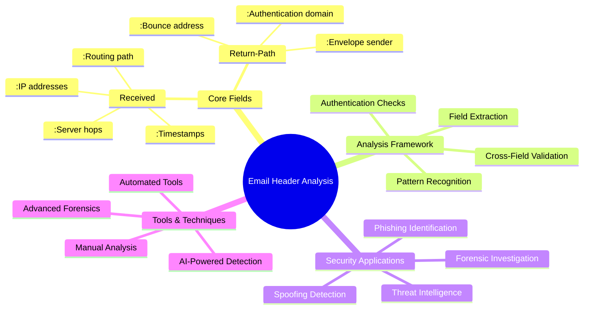
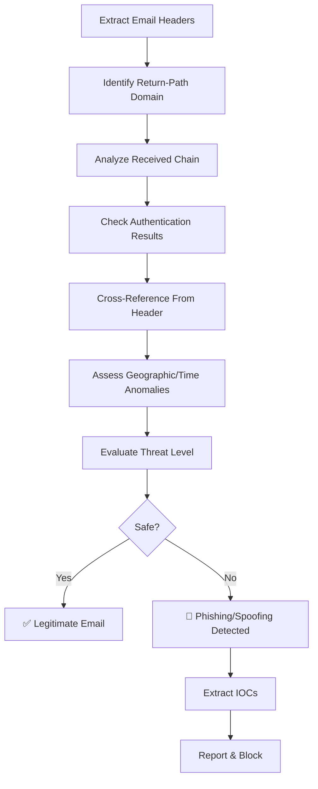
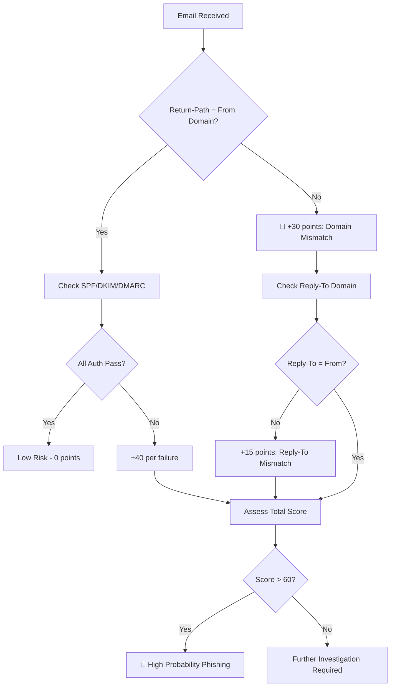

---
tags: [email-security]
---
# 📧 Full-Stack Lesson: Analyzing Received and Return-Path Fields in Email Headers


## TCM Exam Objectives
- Analyze Return-Path fields to identify spoofing through domain mismatches with From headers
- Trace email routing paths by parsing the Received header chain from bottom to top
- Detect Business Email Compromise (BEC) attacks through header inconsistencies
- Interpret Authentication-Results headers for SPF, DKIM, and DMARC verdicts
- Calculate threat assessment scores based on multiple red flag indicators
- Identify homograph attacks and punycode manipulation in email headers
- Recognize compromised account indicators through behavioral and routing anomalies
- Apply automated analysis using Python scripts for header parsing and threat scoring
- Correlate geographic and temporal data to detect routing path anomalies
- Integrate email header analysis with SIEM platforms for automated detection

# 📧 Full-Stack Lesson: Analyzing Received and Return-Path Fields in Email Headers

## 🧠 Overview: The Foundation of Email Authentication

Email headers contain critical metadata that reveals the true origin and path of a message. The **Received** and **Return-Path** fields are particularly crucial for security analysis, as they help identify spoofing, trace malicious infrastructure, and verify sender authenticity. This lesson provides a comprehensive framework for analyzing these fields to detect phishing, business email compromise (BEC), and other email-based threats.



## 🔍 1. Understanding Received and Return-Path Fields

### 1.1 The Return-Path Field: The Bounce Address

The **Return-Path** (also called *bounce address*, *envelope from*, or *MAIL FROM*) specifies where non-delivery notifications should be sent 【turn0search0】【turn0search2】. This field is crucial for email authentication because:

- **SPF checks** use the domain in the Return-Path to verify if the sending IP is authorized 【turn0search5】【turn0search6】
- **DMARC alignment** requires the Return-Path domain to match the From header domain (for SPF alignment) 【turn0search7】
- **Mismatched Return-Path** often indicates spoofing or unauthorized sending 【turn0search3】【turn0search13】

**Example Return-Path header:**
```
Return-Path: <bounce-handler@sender-domain.com>
```

📌 **Exam Tip:** The Return-Path field is used by SPF for sender verification. If the Return-Path domain differs from the From domain, this is a primary spoofing indicator. However, legitimate mailing lists and forwarding services may also cause mismatches — always check for ARC headers to confirm legitimate forwarding.

### 1.2 The Received Fields: The Email's Journey

**Received** headers log each mail server that processed the message, creating a chain from sender to recipient 【turn0search3】【turn0search4】. They are listed in reverse chronological order (newest first) and include:

- **Server names and IP addresses** of each hop
- **Timestamps** of when each server processed the message
- **Protocol information** (SMTP, ESMTP, etc.)
- **Authentication results** at each hop

**Example Received header chain:**
```
Received: from mail.sender.com (mail.sender.com [192.0.2.1])
    by mx.recipient.com (Postfix) with ESMTPS id 4GH2ht5ZQJz28v
    for <recipient@recipient.com>; Tue, 15 Jun 2021 09:45:33 -0700 (PDT)
Received: by mail.sender.com with SMTP id s20so12345678ejl.3
    for <recipient@recipient.com>; Tue, 15 Jun 2021 09:45:32 -0700 (PDT)
```

## 🛠️ 2. Technical Analysis Framework

### 2.1 Step-by-Step Analysis Process



### 2.2 Detailed Analysis Checklist

<details>
<summary>🔧 Comprehensive Analysis Steps</summary>

#### **Step 1: Extract and Parse Headers**
- Use email client's "Show Original" or "View Source" feature
- Copy all header information including Received, Return-Path, From, Reply-To, and Authentication-Results
- Use online tools like [Inventive HQ Email Header Analyzer](https://inventivehq.com/tools/security/email-header-analyzer) for parsing 【turn0search10】

#### **Step 2: Analyze Return-Path Consistency**
- Compare Return-Path domain with From header domain
- Check if Return-Path uses a different domain than From (common in spoofing)
- Verify SPF record exists for Return-Path domain
- Look for free email services in Return-Path for business communications

#### **Step 3: Trace Received Header Chain**
- Verify "from" server in one Received header matches "by" server in the previous header
- Check for unusual number of hops (10+ is suspicious)
- Identify geographic anomalies in server locations
- Look for unexpected mail servers or hosting providers

#### **Step 4: Authentication Results Verification**
- Check Authentication-Results field for SPF, DKIM, DMARC outcomes
- Look for alignment between authenticated domain and From header
- Identify authentication failures (spf=fail, dkim=fail, dmarc=fail)
- Check for missing authentication headers (suspicious for business emails)

#### **Step 5: Cross-Reference Header Fields**
- Compare From, Return-Path, Reply-To, and Sender headers
- Look for Reply-To pointing to different domain than From
- Check Message-ID format matches From domain
- Verify User-Agent matches expected email client for sender

#### **Step 6: Geographic and Temporal Analysis**
- Check if sending IP location matches expected sender location
- Look for emails sent at unusual hours (3 AM local time)
- Verify timestamp consistency across Received headers
- Check for impossible routing (faster than light travel between servers)

#### **Step 7: Threat Assessment Scoring**
- Assign points for each red flag indicator
- Total score determines threat level (0-30: Safe, 31-60: Suspicious, 61-90: High Probability Phishing, 91+: Almost Certainly Phishing) 【turn0search10】
</details>

### 2.3 Key Indicators of Compromise

📌 **Exam Tip:** The threat scoring system in this table is exam-relevant. Memorize the key thresholds: 0-30 (Safe), 31-60 (Suspicious), 61-90 (High Probability Phishing), 91+ (Almost Certainly Phishing). Authentication failures alone add +40 points each — three failures instantly reach critical.



| Indicator | Description | Risk Level | Scoring |
|-----------|-------------|------------|---------|
| **Authentication Failure** | SPF, DKIM, or DMARC fail | High | +40 points |
| **Domain Mismatch** | From ≠ Return-Path domains | High | +30 points |
| **Free Email Service** | Business email from Gmail/Yahoo | Medium | +25 points |
| **Suspicious Origin IP** | VPN/hosting provider, unexpected country | High | +20 points |
| **Reply-To Mismatch** | Reply-To ≠ From domain | High | +15 points |
| **Unusual Routing** | Multiple free email services in chain | Medium | +10 points |
| **Time Zone Anomaly** | Sent at 3 AM from business location | Medium | +10 points |
| **Missing DKIM** | No DKIM signature from business sender | Medium | +10 points |

## 🚨 3. Security Implications and Attack Detection

### 3.1 Detecting Spoofing and Phishing Attacks

**Attack Pattern 1: Executive Impersonation (BEC)**
```
From: "CEO John Smith" <ceo@company.com>
Return-Path: <attacker@malicious-domain.com>
Reply-To: <ceo.personal@protonmail.com>
Authentication-Results: spf=fail; dkim=fail; dmarc=fail
Received: from mail.evilserver.net [192.0.2.10] by mx.google.com
```

**Red Flags:**
- Return-Path domain doesn't match From domain
- Authentication completely fails
- Reply-To redirects to personal email
- Received from suspicious server IP

**Attack Pattern 2: Brand Impersonation**
```
From: "Apple Support" <support@applé.com> (é is special char)
Return-Path: <noreply@xn--appl-fsa.com> (Punycode for applé)
Authentication-Results: spf=none; dkim=none; dmarc=none
X-Originating-IP: 185.220.101.45 (Romania, VPN exit node)
```

**Red Flags:**
- Homograph attack (special characters in domain)
- No authentication headers present
- IP from VPN exit node in unexpected country
- Message-ID doesn't match claimed brand

### 3.2 Analyzing Compromised Accounts

Emails from compromised accounts often pass authentication checks but exhibit behavioral anomalies:

- **Unusual sending patterns** (volume, time, recipients)
- **Content anomalies** (language, urgency, requests)
- **Routing changes** (new servers, unexpected hops)
- **Reply-To modifications** (redirecting responses)

<details>
<summary>📊 Compromised Account Detection Matrix</summary>

| Indicator | Legitimate | Compromised | Analysis Method |
|-----------|------------|-------------|-----------------|
| **Sending Time** | Business hours | 3 AM local time | Timestamp analysis |
| **Message Volume** | Normal patterns | Sudden spike | Historical comparison |
| **Recipient Patterns** | Known contacts | New/unexpected recipients | Address book analysis |
| **Content Style** | Consistent with user | Different tone/language | Linguistic analysis |
| **Authentication** | Passes SPF/DKIM | Still passes (legitimate account) | Cannot detect via headers alone |
| **Reply-To Address** | Matches From | Different from From | Header comparison |
| **Attachment Types** | Expected file types | Unexpected executables | File type analysis |
| **Link Destinations** | Known domains | New suspicious domains | URL reputation check |
</details>

## 🧰 4. Tools and Automation Techniques

### 4.1 Manual Analysis Tools

| Tool | Purpose | Best For | Difficulty |
|------|---------|----------|------------|
| **MXToolbox** | Header analysis, authentication checks | Quick triage | Beginner |
| **Google Admin Toolbox** | Message header analysis | Gmail environments | Beginner |
| **Inventive HQ Analyzer** | Comprehensive header parsing | Detailed analysis | Intermediate |
| **CyberCheck360** | Forensic email investigation | Advanced analysis | Advanced |
| **Message Header Analyzer** | Microsoft 365 environments | Enterprise analysis | Intermediate |

### 4.2 Automated Detection Pipeline

```python
# Example Python script for automated header analysis
import re
from typing import Dict, List, Tuple

class EmailHeaderAnalyzer:
    def __init__(self, headers: str):
        self.headers = headers
        self.parsed_headers = self._parse_headers()
        
    def _parse_headers(self) -> Dict:
        """Parse raw email headers into structured format"""
        headers = {}
        current_header = None
        
        for line in self.headers.split('\n'):
            if line.startswith(' ') or line.startswith('\t'):
                # Continuation of previous header
                if current_header:
                    headers[current_header] += ' ' + line.strip()
            else:
                match = re.match(r'^([^:]+):\s*(.*)$', line)
                if match:
                    current_header = match.group(1).lower()
                    headers[current_header] = match.group(2).strip()
                    
        return headers
    
    def analyze_return_path(self) -> Dict:
        """Analyze Return-Path header for spoofing indicators"""
        return_path = self.parsed_headers.get('return-path', '')
        from_header = self.parsed_headers.get('from', '')
        
        return {
            'return_path': return_path,
            'from_header': from_header,
            'mismatch': return_path.lower() not in from_header.lower(),
            'domain': re.search(r'<([^>]+)>', return_path).group(1) if '<' in return_path else return_path,
            'free_email': any(domain in return_path for domain in ['gmail.com', 'yahoo.com', 'hotmail.com'])
        }
    
    def analyze_received_chain(self) -> List[Dict]:
        """Analyze Received headers for routing anomalies"""
        received_headers = []
        
        # Extract all Received headers
        for key, value in self.parsed_headers.items():
            if key.startswith('received'):
                received_headers.append({
                    'header': key,
                    'value': value,
                    'ip': re.search(r'\[(\d+\.\d+\.\d+\.\d+)\]', value).group(1) if '[' in value else None,
                    'timestamp': re.search(r';\s*([^;]+)$', value).group(1) if ';' in value else None
                })
        
        return received_headers
    
    def assess_threat_level(self) -> Tuple[str, int]:
        """Calculate threat score based on indicators"""
        score = 0
        indicators = []
        
        # Check authentication failures
        auth_results = self.parsed_headers.get('authentication-results', '')
        if 'spf=fail' in auth_results:
            score += 40
            indicators.append('SPF failure')
        if 'dkim=fail' in auth_results:
            score += 40
            indicators.append('DKIM failure')
        if 'dmarc=fail' in auth_results:
            score += 40
            indicators.append('DMARC failure')
        
        # Check Return-Path mismatch
        return_analysis = self.analyze_return_path()
        if return_analysis['mismatch']:
            score += 30
            indicators.append('Return-Path/From mismatch')
        
        if return_analysis['free_email']:
            score += 25
            indicators.append('Free email service for business')
        
        # Determine threat level
        if score >= 91:
            level = 'Almost certainly phishing'
        elif score >= 61:
            level = 'High probability phishing'
        elif score >= 31:
            level = 'Suspicious'
        else:
            level = 'Likely legitimate'
        
        return level, score
```

### 4.3 Integration with Security Information and Event Management (SIEM)

<details>
<summary>⚙️ SIEM Integration Configuration</summary>

**Splunk Integration Example:**
```splunk
# Email Header Analysis Dashboard
index=email_security sourcetype=email_headers
| eval threat_score = 0
| eval indicators = ""

# Authentication failures
| eval spf_fail = if(searchmatch("authentication-results*spf=fail"), 40, 0)
| eval dkim_fail = if(searchmatch("authentication-results*dkim=fail"), 40, 0)
| eval dmarc_fail = if(searchmatch("authentication-results*dmarc=fail"), 40, 0)
| eval threat_score = threat_score + spf_fail + dkim_fail + dmarc_fail

# Domain mismatches
| eval return_path_mismatch = if(searchmatch("return-path!=*from*"), 30, 0)
| eval threat_score = threat_score + return_path_mismatch

# Free email services
| eval free_email = if(searchmatch("return-path=*gmail.com OR return-path=*yahoo.com"), 25, 0)
| eval threat_score = threat_score + free_email

| eval threat_level = case(
    threat_score >= 91, "Critical",
    threat_score >= 61, "High",
    threat_score >= 31, "Medium",
    threat_score >= 0, "Low"
)

| stats count by threat_level, indicators
| sort -threat_level
```

**IBM QRadar Integration:**
```qradar
# Email Header Analysis Rule
Rule "Email Header Phishing Detection":
    when
        event.category = "Email"
        and any of {
            [authentication-results contains "spf=fail"],
            [authentication-results contains "dkim=fail"],
            [return-path] != [from],
            [return-path] contains "gmail.com"
        }
    then
        assign severity = "High"
        assign category = "Phishing"
        notify("Security Team", "Potential phishing email detected")
```
</details>

## 📈 5. Advanced Forensic Techniques

### 5.1 Geographic and Time-Based Analysis

**Geographic Correlation:**
- Map IP addresses to geographic locations
- Check if sending IP matches sender's claimed location
- Identify emails routing through unexpected countries
- Detect VPN/proxy usage based on IP reputation

**Temporal Analysis:**
- Verify timestamp consistency across Received headers
- Check for emails sent at unusual hours
- Detect timestamp manipulation
- Analyze sending patterns over time

<details>
<summary>🗺️ Advanced Geographic Analysis</summary>

```python
import requests
from typing import Dict, Tuple

class GeoIPAnalyzer:
    def __init__(self, ip_address: str):
        self.ip = ip_address
        self.geo_data = self._get_geo_data()
        
    def _get_geo_data(self) -> Dict:
        """Get geographic data for IP address"""
        try:
            response = requests.get(f"http://ip-api.com/json/{self.ip}")
            return response.json()
        except Exception as e:
            return {"error": str(e)}
    
    def analyze_sender_location(self, claimed_location: str) -> Dict:
        """Compare IP location with claimed sender location"""
        ip_country = self.geo_data.get('country', 'Unknown')
        ip_city = self.geo_data.get('city', 'Unknown')
        ip_lat = self.geo_data.get('lat', 0)
        ip_lon = self.geo_data.get('lon', 0)
        
        # Calculate distance if we have claimed coordinates
        distance_km = self._calculate_distance(
            ip_lat, ip_lon,
            claimed_location.get('lat', 0),
            claimed_location.get('lon', 0)
        )
        
        return {
            'ip_location': f"{ip_city}, {ip_country}",
            'claimed_location': claimed_location.get('name', 'Unknown'),
            'distance_km': distance_km,
            'suspicious': distance_km > 5000,  # Flag if >5000km difference
            'vpn_detected': self.geo_data.get('proxy', False),
            'hosting_provider': self.geo_data.get('isp', 'Unknown')
        }
    
    def _calculate_distance(self, lat1: float, lon1: float, 
                           lat2: float, lon2: float) -> float:
        """Calculate distance between two coordinates using Haversine formula"""
        from math import radians, sin, cos, sqrt, atan2
        
        R = 6371  # Earth's radius in kilometers
        
        dlat = radians(lat2 - lat1)
        dlon = radians(lon2 - lon1)
        
        a = (sin(dlat/2)**2 + 
             cos(radians(lat1)) * cos(radians(lat2)) * sin(dlon/2)**2)
        c = 2 * atan2(sqrt(a), sqrt(1-a))
        
        return R * c
```
</details>

### 5.2 Header Manipulation Detection

Attackers may attempt to forge or manipulate email headers to evade detection. Common techniques include:

1. **Header Injection**: Adding extra headers to confuse analysis
2. **Timestamp Manipulation**: Altering timestamps to create impossible routing
3. **Received Header Forgery**: Faking Received headers to obscure origin
4. **Authentication Bypass**: Removing or modifying authentication headers

<details>
<summary>🔬 Header Forgery Detection Techniques</summary>

```python
class HeaderForgeryDetector:
    def __init__(self, headers: str):
        self.headers = headers
        self.parsed = self._parse_headers()
        
    def detect_timestamp_manipulation(self) -> Dict:
        """Detect impossible or inconsistent timestamps"""
        received_headers = self._extract_received_headers()
        timestamps = []
        
        for received in received_headers:
            # Extract timestamp from Received header
            timestamp_match = re.search(r';\s*([^;]+)$', received['value'])
            if timestamp_match:
                timestamps.append({
                    'header': received['header'],
                    'timestamp': timestamp_match.group(1).strip(),
                    'parsed_time': self._parse_timestamp(timestamp_match.group(1))
                })
        
        # Check for out-of-order timestamps
        anomalies = []
        for i in range(1, len(timestamps)):
            if timestamps[i]['parsed_time'] < timestamps[i-1]['parsed_time']:
                anomalies.append({
                    'type': 'out_of_order',
                    'header': timestamps[i]['header'],
                    'issue': 'Timestamp earlier than previous hop'
                })
        
        # Check for future timestamps
        from datetime import datetime
        now = datetime.now()
        for ts in timestamps:
            if ts['parsed_time'] > now:
                anomalies.append({
                    'type': 'future_timestamp',
                    'header': ts['header'],
                    'issue': 'Timestamp in the future'
                })
        
        return {
            'timestamps': timestamps,
            'anomalies': anomalies,
            'manipulation_detected': len(anomalies) > 0
        }
    
    def detect_header_injection(self) -> Dict:
        """Detect potential header injection attacks"""
        suspicious_patterns = [
            r'\n[^\s]+\s*:',  # New header-like pattern
            r'Bcc:\s*[^\s]+',  # Blind carbon copy injection
            r'Content-Type:\s*multipart',  # Content type manipulation
            r'\r\n\r\n'  # Double CRLF indicating body start
        ]
        
        injections = []
        for pattern in suspicious_patterns:
            matches = re.finditer(pattern, self.headers)
            for match in matches:
                injections.append({
                    'pattern': pattern,
                    'match': match.group(),
                    'position': match.start()
                })
        
        return {
            'injections_detected': len(injections) > 0,
            'injections': injections
        }
    
    def analyze_authentication_consistency(self) -> Dict:
        """Check for authentication header inconsistencies"""
        auth_headers = ['authentication-results', 'received-spf', 'dkim-signature']
        results = {}
        
        for header in auth_headers:
            if header in self.parsed:
                results[header] = {
                    'present': True,
                    'value': self.parsed[header][:100] + '...' if len(self.parsed[header]) > 100 else self.parsed[header]
                }
            else:
                results[header] = {
                    'present': False,
                    'suspicious': header == 'authentication-results'  # Missing auth results is suspicious
                }
        
        # Check for conflicting authentication results
        if 'authentication-results' in self.parsed:
            auth_value = self.parsed['authentication-results'].lower()
            if 'spf=pass' in auth_value and 'received-spf' in self.parsed:
                if 'fail' in self.parsed['received-spf'].lower():
                    results['conflict'] = {
                        'type': 'spf_conflict',
                        'issue': 'Authentication-Results shows pass but Received-SPF shows fail'
                    }
        
        return results
```
</details>

## 🎯 6. Practical Case Studies

### 6.1 Case Study: Business Email Compromise (BEC) Attack

**Email Headers Analysis:**
```
From: "CEO John Smith" <ceo@company.com>
Return-Path: <attacker@malicious-domain.com>
Reply-To: <ceo.personal@protonmail.com>
Authentication-Results: mx.google.com;
    spf=fail (google.com: domain of attacker@malicious-domain.com 
    does not designate 192.0.2.10 as permitted sender)
    smtp.mailfrom=attacker@malicious-domain.com;
    dkim=fail header.i=@malicious-domain.com;
    dmarc=fail (p=REJECT sp=REJECT dis=NONE) header.from=company.com

Received: from mail.evilserver.net (mail.evilserver.net. [192.0.2.10])
    by mx.google.com with ESMTPS id k6si12345678qka.1.2023.10.02.09.00.01
    for <employee@company.com>;
    Mon, 02 Oct 2023 09:00:01 -0700 (PDT)
```

**Analysis Findings:**
1. **Return-Path Mismatch**: Return-Path uses `malicious-domain.com` while From shows `company.com`
2. **Authentication Failure**: SPF, DKIM, and DMARC all fail
3. **Reply-To Redirection**: Replies go to ProtonMail address, not company domain
4. **Suspicious Origin**: IP 192.0.2.10 from `evilserver.net` (not company infrastructure)
5. **Threat Score**: 95 points (Almost certainly phishing)

**Recommended Actions:**
- Block sender IP and domain
- Alert security team immediately
- Implement DMARC policy enforcement (p=reject)
- Conduct user awareness training

### 6.2 Case Study: Brand Impersonation with Homograph Attack

**Email Headers Analysis:**
```
From: "Apple Support" <support@applé.com>  (é is special character)
Return-Path: <noreply@xn--appl-fsa.com>  (Punycode for applé)
Authentication-Results: spf=none; dkim=none; dmarc=none
X-Originating-IP: 185.220.101.45 (Romania, VPN exit node)
Received: from mail.cheaphosting.com (budget hosting provider)
    by mx.recipient.com with ESMTP;
    Tue, 15 Jun 2021 14:23:17 +0000

Message-ID: <random123@cheaphosting.com>
User-Agent: PHPMailer 6.5.0 (bulk mail script)
```

**Analysis Findings:**
1. **Homograph Attack**: `applé.com` uses special character to mimic `apple.com`
2. **No Authentication**: SPF, DKIM, DMARC all missing
3. **Suspicious Infrastructure**: Budget hosting provider, VPN exit node
4. **Inconsistent Message-ID**: Doesn't match Apple's domain
5. **Bulk Mail Software**: PHPMailer indicates automated sending
6. **Threat Score**: 110 points (Almost certainly phishing)

**Recommended Actions:**
- Block IP range and hosting provider
- Implement homograph detection rules
- User education on homograph attacks
- Email filtering for Punycode domains

## 🚀 7. Future Trends and Emerging Threats

### 7.1 AI-Powered Header Manipulation

As AI advances, attackers are using machine learning to:
- Generate convincing fake headers that pass authentication
- Automate header manipulation at scale
- Evade traditional detection systems
- Create personalized attacks based on recipient analysis

### 7.2 Advanced Persistent Threats (APTs)

Nation-state actors increasingly use:
- Compromised legitimate infrastructure
- Slow-and-low sending patterns
- Header manipulation to evade detection
- Multi-stage attacks with header manipulation at each stage

<details>
<summary>🔮 Future Detection Technologies</summary>

**Behavioral AI Analysis:**
```python
class BehavioralAIAnalyzer:
    def __init__(self):
        self.sender_profiles = {}
        self.baseline_patterns = {}
        
    def analyze_sending_behavior(self, sender: str, email_headers: Dict) -> Dict:
        """Analyze sending behavior against established baseline"""
        if sender not in self.sender_profiles:
            self.sender_profiles[sender] = {
                'first_seen': email_headers['date'],
                'sending_patterns': [],
                'recipients': set(),
                'ip_history': []
            }
        
        profile = self.sender_profiles[sender]
        
        # Extract current email characteristics
        current = {
            'timestamp': email_headers['date'],
            'recipients': email_headers['to'],
            'ip': self._extract_ip(email_headers),
            'authentication': email_headers.get('authentication-results', 'none')
        }
        
        # Check for behavioral anomalies
        anomalies = []
        
        # Time-based anomalies
        hour = self._extract_hour(current['timestamp'])
        if hour < 6 or hour > 22:  # Outside business hours
            anomalies.append('unusual_time')
        
        # Recipient anomalies
        new_recipients = set(current['recipients']) - profile['recipients']
        if len(new_recipients) > 5:
            anomalies.append('mass_new_recipients')
        
        # IP changes
        if current['ip'] not in profile['ip_history']:
            anomalies.append('new_ip')
        
        # Update profile
        profile['sending_patterns'].append(current)
        profile['recipients'].update(current['recipients'])
        profile['ip_history'].append(current['ip'])
        
        return {
            'sender': sender,
            'anomalies': anomalies,
            'risk_score': len(anomalies) * 20,
            'profile_updated': True
        }
```

**Quantum-Resistant Authentication:**
- Post-quantum cryptography for email authentication
- Lattice-based DKIM signatures
- Quantum-safe SPF mechanisms
- Hybrid authentication approaches
</details>

## 📚 8. Best Practices and Recommendations

### 8.1 For Security Analysts

1. **Always verify Return-Path alignment** with From header
2. **Check authentication results** before trusting sender identity
3. **Analyze Received header chain** for routing anomalies
4. **Use multiple indicators** for threat assessment (never rely on single field)
5. **Maintain historical baselines** for sender behavior comparison
6. **Correlate with threat intelligence** for IP/domain reputation
7. **Document findings** with screenshots and header excerpts
8. **Implement automated scoring** for consistent threat assessment

### 8.2 For Organizations

1. **Implement DMARC** with enforcement policy (p=reject)
2. **Monitor DMARC reports** for authentication failures
3. **Train users** to check headers for suspicious indicators
4. **Deploy email security solutions** with header analysis capabilities
5. **Conduct regular phishing simulations** including header manipulation
6. **Maintain sender reputation** monitoring
7. **Implement geographic restrictions** for email acceptance
8. **Use advanced threat protection** with header anomaly detection

### 8.3 For Email Administrators

1. **Configure SPF records** for all sending domains
2. **Set up DKIM signing** for all outgoing mail
3. **Monitor Return-Path usage** and bounce handling
4. **Implement rate limiting** based on sender behavior
5. **Log and analyze header anomalies** for security incidents
6. **Regularly update authentication protocols** to latest standards
7. **Test header manipulation** attempts against your infrastructure
8. **Coordinate with ISPs** for legitimate email sending practices

## 💎 Conclusion

Analyzing Received and Return-Path fields is a critical skill for detecting email-based threats. By systematically examining these headers, security professionals can:

- **Identify spoofing attempts** through domain mismatches
- **Trace email origins** through Received header analysis
- **Detect authentication failures** that indicate forgery
- **Uncover routing anomalies** that reveal malicious infrastructure
- **Build comprehensive threat intelligence** for proactive defense

The key to effective header analysis is **correlation across multiple fields** and **contextual understanding** of normal vs. abnormal patterns. As email threats continue to evolve with AI and automation, the ability to analyze headers manually remains an essential skill for security analysts, complementing automated detection systems.

📌 **Exam Tip:** For BEC (Business Email Compromise) scenarios on the exam, the key detection indicators are: (1) Return-Path mismatch with From, (2) Reply-To pointing to a personal email service, (3) SPF/DKIM/DMARC failures, and (4) urgency language combined with unusual financial requests.

> ⚠️ **Final Reminder**: Email header analysis is most effective when combined with content analysis, URL reputation checking, and user behavior monitoring. No single technique is foolproof, but a layered approach significantly improves detection rates for sophisticated email attacks.