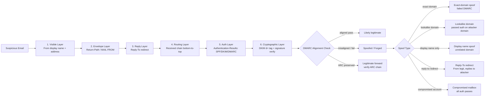
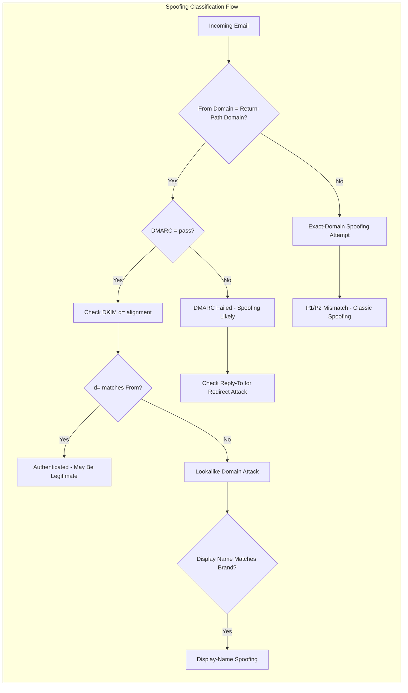
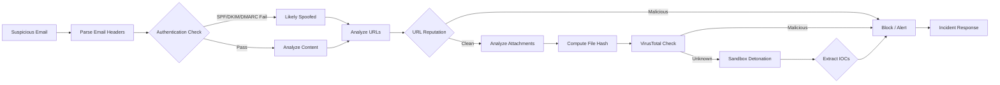

# Identifying Spoofed and Forged Headers
## TCM Exam Objectives
- Distinguish between P1 (envelope) and P2 (visible) sender identities to detect spoofing
- Analyze the From/Return-Path/Reply-To triangle for alignment inconsistencies
- Trace the Received header chain bottom-to-top to identify the true originating IP
- Interpret Authentication-Results headers for SPF pass/fail, DKIM pass/fail, and DMARC alignment
- Understand DMARC alignment modes (relaxed vs strict) and policies (none/quarantine/reject)
- Detect display-name spoofing and lookalike domain attacks that bypass authentication
- Apply the ARC (Authenticated Received Chain) framework for forwarded email analysis
- Identify Message-ID domain inconsistencies and X-header manipulation
- Execute a structured 10-step forensic workflow for header investigation
- Use tools like Google Admin Toolbox and MXToolbox for automated header analysis

Spoofed and forged email headers are manipulated header fields designed to make a malicious message appear to originate from a trusted sender — detectable through forensic analysis of the divergence between the visible `From` display, the envelope `Return-Path`, the `Received` routing chain, and the `Authentication-Results` produced by SPF, DKIM, and DMARC checks.【turn0search7】【turn0search15】 Every email carries a structured set of metadata fields that act as a digital passport documenting its journey from sender to recipient; when an attacker forges any of those fields, the inconsistency between what the recipient *sees* and what the infrastructure *recorded* becomes the forensic fingerprint of spoofing.【turn0search6】【turn1search15】

## The Header Forensic Analysis Pipeline

A systematic header investigation works from the most visible field (what the user sees) inward to the most tamper-resistant evidence (cryptographic signatures and routing logs). The goal is to detect *inconsistency* — a spoofed email almost always exhibits a mismatch somewhere in this chain.【turn0search1】【turn0search9】

📌 **Exam Tip:** The P1 vs P2 distinction is a critical exam concept. P1 (MAIL FROM/Return-Path) is the envelope sender used for SPF checks and bounce routing. P2 (From header) is what the user sees and can be freely forged. DMARC alignment requires P1 or DKIM signing domain to match P2 — this is the core of spoofing prevention.

The flowchart reveals the central truth of header forensics: a single field is never sufficient. A compromised executive mailbox passes every authentication check because the message genuinely originates from the legitimate account — only behavioral and content analysis catches that variant, which is why header forensics is necessary but not complete on its own.【turn0search0】

## Master Comparison: Authentication-Related Header Fields

| Header Field | What It Records | Who Sets It | Spoofing Indicator |
|---|---|---|---|
| **From (P2)** | Visible sender address shown to recipient | Sender (client) | Can be freely forged; display name trivially manipulated【turn1search15】 |
| **Return-Path (P1 MAIL FROM)** | Envelope sender; where bounces go | SMTP MAIL FROM command | Mismatch with From domain = strong spoof signal【turn0search0】【turn1search15】 |
| **Reply-To** | Where replies are sent if different from From | Sender | From shows trusted sender, Reply-To points to attacker = redirect attack【turn0search17】 |
| **Received** | Each SMTP hop with timestamp, IP, server | Each mail server in path | Gaps, reversed chronology, or originating IP inconsistent with claimed domain【turn1search8】 |
| **Authentication-Results** | SPF/DKIM/DMARC outcomes | Receiving mail server | `fail` or `softfail` on SPF/DKIM; DMARC misalignment【turn0search10】【turn0search13】 |
| **DKIM-Signature** | Cryptographic signature over headers+body | Sending mail server | `d=` domain not aligned with From; missing signature on domain that should sign【turn0search11】【turn1search7】 |
| **Message-ID** | Unique message identifier | Sending client/server | Domain portion doesn't match From domain; duplicate across messages【turn1search6】 |
| **ARC sets** | Authenticated Received Chain for forwards | Forwarding intermediaries | Broken chain; missing ARC-Seal when forwarder modified message【turn0search19】【turn0search21】 |

Sources: 【turn0search0】【turn0search6】【turn0search7】【turn0search10】【turn0search11】【turn0search17】【turn1search6】【turn1search7】【turn1search15】

---

## Module 1 — The From / Return-Path / Reply-To Triangle

The single most revealing relationship in header forensics is the alignment (or lack thereof) between three fields that recipients conflate but that SMTP treats as distinct.【turn0search0】【turn1search15】

**The P1 vs P2 distinction.** SMTP carries two sender identities: the **P1 MAIL FROM** (envelope sender, recorded as `Return-Path` by the receiver) is used for authentication and bounce routing, while the **P2 FROM header** is what gets displayed to the recipient. The P2 header can be freely manipulated to display any sender identity, which is why a message can appear to come from `CEO@mycompany.com` while the envelope sender is `attacker@malicious.com`.【turn1search15】 This is the foundational mechanic of display-name and domain spoofing.

**Return-Path analysis.** The return path is a quiet signal with outsized security impact — attackers frequently manipulate it to evade detection or spoof trusted domains, because SPF checks the envelope sender against the domain's authorized IP list, not the visible From address.【turn0search0】 A legitimate message from `user@example.com` should have `Return-Path: <user@example.com>`. A `Return-Path` pointing to a different domain than the visible `From` is a strong spoofing indicator unless a legitimate forwarding service is involved (which ARC should then document).

**Reply-To redirect attacks.** The most insidious manipulation pairs a trusted `From` address with a `Reply-To` pointing to an attacker-controlled mailbox. The victim sees a message that appears to come from their CEO, replies with sensitive information or authorization, and the reply silently routes to the attacker. Defenders need a fast triage checklist that explicitly compares the Reply-To domain against both the From domain and the Return-Path.【turn0search17】 If all three align to the same organizational domain, the message is structurally consistent; if Reply-To diverges, it is a redirect attack regardless of whether authentication passes.

---

## Module 2 — Received Header Chain Analysis

The `Received` headers form a chronological audit trail of every SMTP server that handled the message. Each mail server in the path prepends a `Received` header, so the header block grows downward — the **bottom-most Received header is the origin of the message**, and the top-most is the final delivery hop.【turn1search8】

**Reading order.** Read the chain bottom-to-top. Each Received header records the sending IP, receiving server, timestamp, and authentication context for that hop. Tracing this path reveals the true originating IP regardless of what the `From` header claims.【turn0search1】【turn0search9】

**Forensic indicators in the Received chain:**
- **Originating IP geography** — a message claiming to be from a US-based executive but originating from an IP in Eastern Europe or Nigeria is immediately suspect
- **Timestamp chronology** — Received timestamps must flow forward in time from bottom to top; reversed or impossible timestamps indicate tampering
- **Hop gaps** — missing intermediate hops suggest header stripping or injection
- **Unfamiliar relay servers** — legitimate corporate mail flows through known infrastructure; unknown relays in the chain warrant scrutiny
- **Internal vs external origin** — a message that should originate internally (from a colleague) but enters through an external gateway is spoofed or sent from outside the organization【turn0search7】

**Authentication context within Received.** Some servers embed SPF results directly in the Received header rather than (or in addition to) a separate Authentication-Results header. Forensic tools decode hidden timestamps in MIME boundary delimiters and Message-IDs so that crucial evidence isn't missed.【turn1search7】

---

## Module 3 — Authentication-Results: SPF, DKIM, DMARC Interpretation

The `Authentication-Results` header is the receiving server's verdict on the message's authenticity — the authoritative record of what SPF, DKIM, and DMARC concluded.【turn0search10】【turn0search13】 Reading it correctly is the core skill of header forensics.

### SPF (Sender Policy Framework)

SPF checks whether the sending IP is authorized for the envelope-sender domain (the Return-Path).【turn0search11】 Look for `spf=pass`, `spf=fail`, `spf=softfail`, `spf=neutral`, `spf=temperror`, or `spf=permerror`. A `pass` means the IP is listed in the domain's SPF record; a `fail` means the IP is explicitly unauthorized. Critically, SPF authenticates the envelope sender, not the visible From — so a spoofed email can pass SPF if the attacker uses their own registered domain in the Return-Path while forging the visible From to a trusted domain.【turn0search4】

### DKIM (DomainKeys Identified Mail)

DKIM cryptographically validates that selected headers and the body were unaltered and bound to the domain in the `d=` tag of the DKIM-Signature header.【turn0search11】 The `d=` tag is the signing domain — the domain that asserts responsibility for the message. A DKIM `pass` means the signature is valid and the content has not been modified since signing. The forensic question is whether the `d=` domain aligns with the visible From domain. An attacker can sign a message with their own domain (DKIM passes) while forging the From to display a trusted domain — DKIM passes but DMARC fails alignment.【turn0search13】【turn1search7】

DKIM verification involves fetching the public key from DNS, calculating the header and body hashes, and verifying the signature — multiple signatures are supported if present.【turn1search7】 A missing DKIM signature on a domain known to sign all outbound mail is itself a suspicious indicator.

### DMARC (Domain-based Message Authentication, Reporting, and Conformance)

DMARC ties SPF and DKIM together by requiring **alignment** between the envelope sender (or DKIM `d=` domain) and the visible `From` header domain, then instructs receivers on what to do when authentication fails.【turn0search11】【turn1search4】 DMARC is the control layer that makes SPF and DKIM operationally meaningful for spoofing prevention — without alignment, a passing SPF or DKIM on an unrelated domain does not protect the visible From domain.【turn1search0】

**Alignment modes:**
- **Relaxed alignment** (default) — subdomains match the organizational domain (`mail.example.com` aligns with `example.com`)
- **Strict alignment** — exact domain match required

**DMARC policies:** `p=none` (monitor only), `p=quarantine` (deliver to spam), `p=reject` (block delivery).【turn0search12】 As of February 2024, Google's bulk sender requirements mandate a DMARC policy of at least `p=none` for any domain sending 5,000+ messages per day to Gmail users.【turn0search11】

**The DMARC alignment verdict in Authentication-Results** is the single most authoritative field: `dmarc=pass` means either SPF or DKIM passed AND aligned with the From domain; `dmarc=fail` means neither aligned, regardless of individual SPF/DKIM results.

---

## Module 4 — Display Name Spoofing and Lookalike Domains

When exact-domain spoofing is blocked by DMARC enforcement, attackers pivot to techniques that pass authentication on attacker-controlled infrastructure while still deceiving the recipient visually.【turn0search15】【turn0search17】

**Display name spoofing.** The attacker sets the friendly "From" name to mimic a real person, team, or brand while sending from an email address they control. This works because many inboxes foreground the display name and hide the full address — recipients validate names first, then headers. The risk spikes when attackers pair the display name with Reply-To manipulation and lookalike domains.【turn0search17】 A message displaying as "John Smith, CEO" but sent from `ceo@attacker-domain.com` passes SPF, DKIM, and DMARC on the attacker's domain while still deceiving the recipient.

**Lookalike domain spoofing.** Attackers register domains that visually resemble the legitimate one by exploiting typographical similarities — replacing the letter "l" with the number "1", using a Cyrillic character that looks similar to a Latin one (homoglyph attack), or swapping TLDs (`company.com` vs `company.co`).【turn0search18】【turn0search15】 These pass authentication because the attacker legitimately owns the lookalike domain and configures SPF/DKIM/DMARC for it. The deception is purely visual, detectable only by careful inspection of the actual domain in the From header — not by authentication results alone.

**Header-level detection of display-name spoofing.** The From header format is `Display Name <local-part@domain>`. The display name is the human-readable label; the angle-bracketed address is what authentication evaluates. A spoofed message typically shows a trusted display name paired with a mismatched or lookalike domain in the address portion. Comparing the display name against the actual domain — and against the sender's historical communication pattern — reveals the deception.【turn0search17】

---

## Module 5 — ARC (Authenticated Received Chain) for Forwarded Email

Forwarding breaks email authentication. When a message is forwarded through a mailing list or another mail server, the forwarding server's IP replaces the original sender's IP (breaking SPF), and any modification to the message body or headers invalidates the DKIM signature.【turn1search1】【turn0search19】 ARC solves this by capturing the original authentication results at the point of forwarding and preserving them in a chain of headers that the final receiver can validate.

**What ARC preserves.** ARC records the original SPF, DKIM, and DMARC authentication results at each forwarding hop, along with a cryptographic seal from each intermediary.【turn0search19】【turn0search22】 The chain consists of three header types: `ARC-Authentication-Results` (the auth results as the forwarder saw them), `ARC-Message-Signature` (signature over the message at that hop), and `ARC-Seal` (cryptographic seal binding the chain together).【turn0search20】

**Forensic significance.** A broken ARC chain — missing seals, invalid signatures, or a gap in the sequence — indicates either a legitimate forwarder that doesn't implement ARC or a manipulation attempt. Microsoft 365 allows administrators to configure trusted ARC sealers; when a trusted intermediary modifies a message, Microsoft uses the original authentication information rather than failing the message.【turn0search21】 For forensic analysis, a valid ARC chain with `arc=pass` means the authentication failure at the final receiver is explained by legitimate forwarding and the original authentication should be trusted over the current state.【turn0search23】

---

## Module 6 — Message-ID and X-Headers Forensics

**Message-ID analysis.** The Message-ID is a unique identifier constructed by the sending client or server, typically combining a timestamp with a domain identifier.【turn1search6】 The domain portion of the Message-ID should match or relate to the From domain. A Message-ID with a completely unrelated domain — or a Message-ID that duplicates across supposedly distinct messages — is a tampering indicator. Forensic tools decode hidden timestamps embedded in Message-IDs to verify whether the claimed send time matches the actual construction time.【turn1search7】

**X-Headers (custom headers).** The `X-` prefix designates non-standard, custom headers added by mail servers, security gateways, and applications. These include spam-scoring headers (`X-Spam-Status`), gateway processing metadata (`X-MS-Exchange-Organization-*`), and authentication annotations. While X-headers are legitimate, attackers can inject forged X-headers to mimic security processing or to confuse analysis.【turn1search13】【turn1search14】 Header injection vulnerabilities in web applications can allow manipulation of traceability headers and metrics, injecting false alerts and corrupting log integrity.【turn1search14】 Forensic analysis should treat X-headers as supplementary context, not as authoritative authentication evidence — the cryptographic and protocol-level headers (DKIM, SPF, DMARC) carry the evidentiary weight.

---

## The Forensic Workflow: Step-by-Step

A structured header investigation follows a repeatable sequence that moves from the visible layer inward to cryptographic evidence.【turn0search1】【turn1search5】

**Step 1: Extract the full header source.** In Gmail/Workspace, click the three dots → Show original. In Outlook, open the message → File → Properties → Internet Headers. Copy the full raw header for analysis.【turn0search1】

**Step 2: Read the visible From and display name.** What does the recipient see? Note the display name, the local-part, and especially the domain. This is what the attacker wants the victim to trust.【turn0search17】

**Step 3: Check Return-Path alignment.** Does the Return-Path domain match the From domain? A mismatch is a primary spoofing indicator unless a documented forwarder is involved.【turn0search0】【turn1search15】

**Step 4: Inspect Reply-To.** Is Reply-To present? Does it point to a different domain than From? A Reply-To redirect is a classic BEC technique that bypasses recipients who only check the From field.【turn0search17】

**Step 5: Trace the Received chain bottom-to-top.** Identify the originating IP and trace the routing path. Check timestamp chronology, hop consistency, and whether the originating infrastructure matches the claimed sender domain.【turn1search8】

**Step 6: Read Authentication-Results.** Extract SPF, DKIM, and DMARC verdicts. Note specifically whether DMARC shows `pass` (aligned) or `fail` (misaligned). Individual SPF/DKIM passes without DMARC alignment do not authenticate the visible From domain.【turn0search10】【turn0search13】

**Step 7: Examine the DKIM-Signature d= tag.** Which domain signed the message? Does it align with the From domain? A valid signature from a non-aligned domain is a lookalike-domain attack.【turn0search11】【turn1search7】

**Step 8: Check ARC if forwarded.** If the message transited a forwarder, verify the ARC chain integrity. A valid ARC chain explains authentication failures caused by legitimate forwarding.【turn0search19】【turn0search21】

**Step 9: Validate Message-ID domain consistency.** Does the Message-ID's domain portion match the From domain? Inconsistencies suggest header fabrication.【turn1search6】【turn1search7】

**Step 10: Classify the spoof type and act.** Categorize as exact-domain spoof (DMARC failed), lookalike domain (auth passed on attacker domain), display-name-only spoof, Reply-To redirect, or compromised mailbox. Each classification drives a different response playbook.

### Recommended Forensic Tools

- **Google Admin Toolbox Messageheader** — paste raw headers for parsed routing and authentication analysis【turn1search9】
- **MXToolbox Email Header Analyzer** — parses headers into human-readable format with hop delays, anti-spam results, and authentication outcomes【turn1search10】【turn1search11】
- **Manual analysis** — paste the raw header into a text editor for line-by-line examination; the 13Cubed forensic video walkthrough demonstrates this technique with legitimate and spoofed examples【turn1search5】

---

## Common Pitfalls

**Treating a passing SPF or DKIM as proof of legitimacy.** A spoofed email can pass SPF if the attacker uses their own domain in the Return-Path, and can pass DKIM if signed with the attacker's domain. Only DMARC alignment confirms that the authenticated domain matches the visible From domain.【turn0search4】【turn0search11】

**Reading the Received chain top-to-bottom.** The most common forensic error — the bottom-most Received header is the origin, not the top. Reading in the wrong order produces an inverted routing narrative that obscures the true source.【turn1search8】

**Over-trusting the visible From address.** The P2 From header is set by the sender's client and can be freely forged. It is display metadata, not authentication evidence. The Return-Path, DKIM `d=` tag, and DMARC alignment are the authoritative identity signals.【turn1search15】

**Ignoring ARC on forwarded mail.** A forwarded message may fail SPF and DKIM at the final receiver even though it was legitimately authenticated at origin. Without checking ARC, analysts may classify legitimate forwarded mail as spoofed, or conversely, may miss spoofed mail that a broken ARC chain should have flagged.【turn0search19】【turn0search23】

**Assuming DMARC p=none provides protection.** A `p=none` policy provides visibility (monitoring and reporting) but no enforcement — spoofed email still reaches the inbox. Only `p=quarantine` or `p=reject` actively blocks spoofing. Many organizations operate at `p=none` indefinitely, which defeats the protective purpose of DMARC.【turn0search12】【turn1search0】

📌 **Exam Tip:** One of the most common PSAA exam mistakes is assuming a passing SPF/DKIM means the email is legitimate. Remember: SPF checks the envelope sender (Return-Path), not the visible From address. An attacker can pass SPF on their own domain while forging the From to a trusted domain. Only DMARC alignment connects authentication to the visible From.

**Missing display-name spoofing when authentication passes.** Because lookalike domains and display-name spoofing pass authentication on the attacker's own infrastructure, a clean Authentication-Results header does not rule out impersonation. The visible From domain must be compared against the expected sender domain, not just against the authentication verdict.【turn0search17】

**Neglecting Reply-To inspection.** Many analysts stop at the From and Return-Path comparison. A Reply-To redirect can be invisible in that comparison yet route replies to an attacker — it must be checked explicitly on every suspicious message.【turn0search17】

---

## Recap

Spoofed and forged headers are detectable through forensic analysis of the inconsistency between the visible `From` display, the envelope `Return-Path`, the `Reply-To` redirect, the `Received` routing chain, and the `Authentication-Results` produced by SPF, DKIM, and DMARC checks.【turn0search7】【turn0search6】 The foundational mechanic is the P1/P2 distinction: the envelope sender (Return-Path, authenticated by SPF) and the visible From header (displayed to the recipient, freely forgeable) can be set to different domains, which is the basis of most spoofing attacks.【turn1search15】【turn0search0】 DKIM's `d=` tag cryptographically binds the signature to a specific domain, and DMARC enforces alignment between that domain (or the SPF envelope domain) and the visible From — making DMARC `pass` the single most authoritative authentication verdict, while individual SPF/DKIM passes without alignment do not authenticate the visible sender.【turn0search11】【turn1search4】 When exact-domain spoofing is blocked by DMARC enforcement, attackers pivot to display-name spoofing and lookalike domains that pass authentication on attacker-controlled infrastructure — detectable only by comparing the actual From domain against the expected sender domain, not by relying on authentication results alone.【turn0search15】【turn0search17】【turn0search18】 Forwarded mail complicates analysis because forwarding breaks SPF (IP change) and can invalidate DKIM (content modification), which is why ARC preserves the original authentication results through a cryptographically sealed chain that the final receiver can validate.【turn0search19】【turn0search21】【turn0search23】 The forensic workflow moves from visible layer (From display) through envelope (Return-Path), reply (Reply-To), routing (Received chain bottom-to-top), authentication (Authentication-Results), and cryptographic (DKIM `d=`) layers, using tools like Google Admin Toolbox and MXToolbox to parse the raw header into structured evidence.【turn1search9】【turn1search10】【turn1search5】 The throughline: a single header field is never sufficient — spoofing detection requires correlating multiple fields and identifying the mismatch, because every forged email almost certainly exhibits inconsistency somewhere in the chain between what the recipient sees and what the infrastructure recorded.