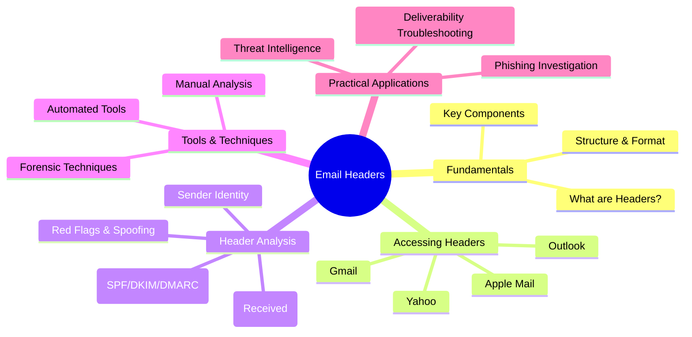
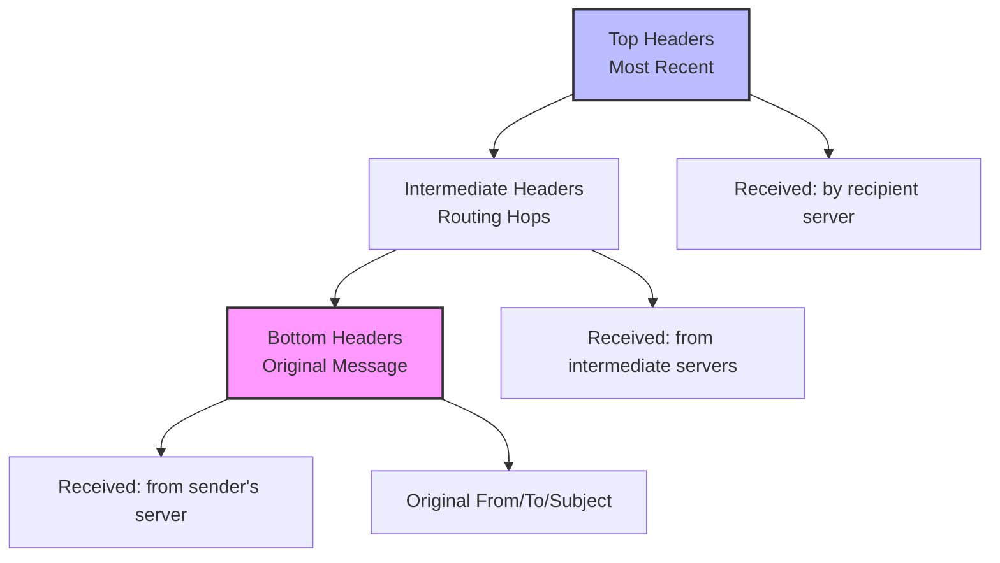
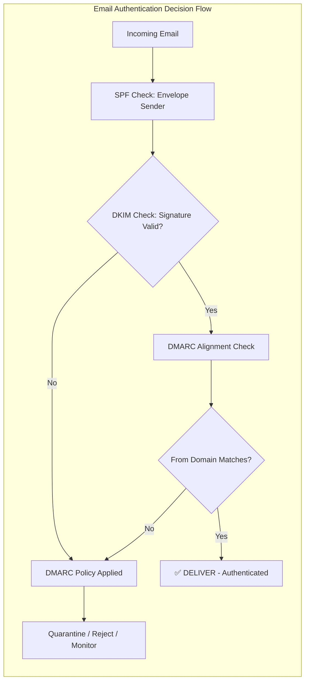
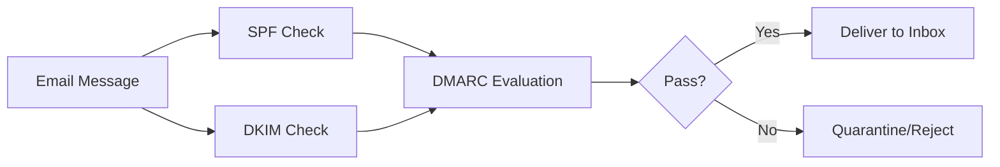
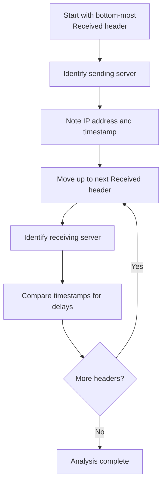
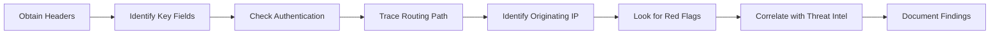
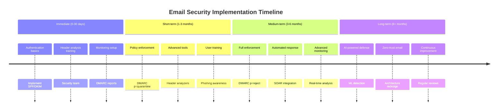

---
tags: [email-security]
---
# 📧 Full-Stack Lesson: Parsing & Understanding Email Headers


## TCM Exam Objectives
- Understand the structure and hierarchy of email headers (reverse chronological order)
- Identify and interpret authentication headers: SPF, DKIM, and DMARC
- Trace email routing paths using Received header chains
- Detect spoofing indicators through From/Reply-To/Return-Path inconsistencies
- Extract and analyze originating IP addresses from headers
- Use header analysis tools like Google Messageheader, MXToolbox, and ForensicOSINT
- Recognize common red flags including missing Message-ID and authentication failures
- Apply forensic analysis techniques: Message-ID analysis, timestamp correlation, and cross-header validation
- Differentiate between exact-domain spoofing, lookalike domains, and display-name spoofing
- Compile findings into actionable threat intelligence for incident response

# 📧 Full-Stack Lesson: Parsing & Understanding Email Headers

## 🎯 Lesson Overview
Email headers are the **metadata** of email messages, containing critical information about the sender, routing path, authentication, and delivery status. This lesson provides a comprehensive guide to parsing and understanding email headers for security analysis, troubleshooting, and forensic investigation.



## 1. 📋 Fundamentals of Email Headers

### 1.1 What Are Email Headers?
Email headers are **structured text records** that accompany every email message, containing technical details about its origin, routing, and authentication. While users typically see only the From, To, Subject, and Date fields, the full headers contain a wealth of forensic information 【turn0search9】【turn0search16】.

Headers follow the format:
```
Field-Name: Field-Value
```

For example:
```
Received: from mail.example.com (192.0.2.1) by mx.google.com with ESMTPS
From: sender@example.com
To: recipient@example.org
Subject: Meeting Tomorrow
Authentication-Results: mx.google.com; spf=pass dkim=pass dmarc=pass
```

### 1.2 Header Structure & Hierarchy
Email headers are structured in **reverse chronological order** - the newest headers appear at the top, while the oldest (originating) headers are at the bottom. This creates a traceable path from the sender to the recipient 【turn0search7】【turn0search15】.



### 1.3 Key Header Categories

| Category | Purpose | Key Fields |
|----------|---------|------------|
| **Routing Information** | Traces message path | `Received`, `Return-Path`, `Delivered-To` |
| **Authentication Results** | Verifies sender identity | `Authentication-Results`, `Received-SPF`, `DKIM-Signature` |
| **Sender/Recipient Info** | Identifies parties | `From`, `To`, `Cc`, `Bcc`, `Reply-To` |
| **Message Identification** | Unique tracking | `Message-ID`, `In-Reply-To`, `References` |
| **Content Information** | Describes email body | `Content-Type`, `Content-Transfer-Encoding`, `MIME-Version` |
| **Custom/Experimental** | Provider-specific | `X-Originating-IP`, `X-Mailer`, `X-Spam-Status` |

📌 **Exam Tip:** The `Authentication-Results` header is the single most authoritative field for email authentication. Memorize SPF results (pass, fail, softfail, neutral, permerror, temperror) and DMARC policies (none, quarantine, reject). DMARC `p=reject` blocks 100% of direct domain spoofing.



## 2. 🔍 Accessing Email Headers in Different Clients

### 2.1 Gmail
1. Open the email message
2. Click the **three vertical dots** (⋮) next to the Reply arrow
3. Select **"Show original"**
4. A new tab opens with the full headers and authentication analysis 【turn0search0】【turn0search15】

### 2.2 Microsoft Outlook
1. Double-click the email to open it in a new window
2. Go to **File → Properties**
3. The "Internet headers" box contains the full headers 【turn0search7】【turn0search15】

### 2.3 Yahoo Mail
1. Open the email message
2. Click the **three horizontal dots** (⋯)
3. Select **"View raw message"** 【turn0search7】

### 2.4 Apple Mail
1. Select the email in your inbox
2. Go to **View → Message → All Headers** (or `Raw Source` for complete headers) 【turn0search7】【turn0search15】

### 2.5 Mobile Devices
Most mobile email apps don't provide access to full headers. You'll need to access the same mailbox on a desktop computer to retrieve headers for analysis 【turn0search15】.

## 3. 🔐 Understanding Email Authentication

Email authentication verifies that the sender is authorized to send on behalf of the domain. The three main protocols work together:



### 3.1 SPF (Sender Policy Framework)
SPF verifies that the sending server's IP address is authorized to send emails for the domain.

**Header Example:**
```
Received-SPF: pass (google.com: domain of sender@example.com designates 192.0.2.1 as permitted sender) client-ip=192.0.2.1;
```

**SPF Results:**
- `pass`: IP is authorized
- `fail`: IP is not authorized
- `softfail`: IP is not authorized but message is accepted
- `neutral`: No policy published
- `permerror`: Permanent DNS error
- `temperror`: Temporary DNS error 【turn0search4】

### 3.2 DKIM (DomainKeys Identified Mail)
DKIM provides a cryptographic signature that verifies the message content wasn't altered in transit.

**Header Example:**
```
DKIM-Signature: v=1; a=rsa-sha256; c=relaxed/relaxed; d=example.com; s=selector1;
    h=from:to:subject:date:message-id;
    bh=5W5ab6rUnkSdF8Lp2Lp2xJjZ1xTzFxx4xPa1r1QJ5Rs=;
    b=GkzY7Z6r8D5dzxLZ+j5YFExGp5D6pzzvY72Gp5QzFz0LzpGd7z6zL3FzqGp2F5G5zFzQzzG5GpF==
```

**Key Fields:**
- `d=`: Signing domain
- `s=`: Selector (identifies the public key in DNS)
- `bh=`: Body hash
- `b=`: Digital signature 【turn0search4】

### 3.3 DMARC (Domain-based Message Authentication, Reporting & Conformance)
DMARC ties SPF and DKIM together with alignment policies and reporting.

**Header Example:**
```
Authentication-Results: mx.google.com;
    dmarc=pass (p=REJECT sp=REJECT dis=NONE) header.from=example.com
```

**DMARC Policies:**
- `p=none`: Monitor only
- `p=quarantine`: Send to spam folder
- `p=reject`: Block the message 【turn0search0】

### 3.4 Common Authentication Issues

<details>
<summary>🔧 Troubleshooting Authentication Failures</summary>

#### **SPF Pass but DMARC Fail**
This occurs when SPF passes but **alignment fails** - the domain in the `Return-Path` (used for SPF) doesn't match the `From` domain.

**Example:**
```
spf=pass smtp.mailfrom=sendgrid.yourdomain.com;
dmarc=fail header.from=yourdomain.com
```

**Solution:** Align your `mailfrom` domain with your `From` domain 【turn0search0】.

#### **DKIM Fail with Valid Configuration**
Common causes:
1. **Missing or incorrect DNS record**: Public key not found
2. **Message modification**: Content changed after signing
3. **Selector mismatch**: `header.s=` doesn't match DNS record
4. **Key rotation issues**: Old selector used after rotation 【turn0search0】

#### **Missing Authentication Headers**
Some providers strip authentication headers or don't include them. In these cases:
- Check other routing headers for clues
- Use the `Received` chain to identify the last server
- Look for `X-` headers that might contain authentication info 【turn0search13】
</details>

## 4. 📍 Tracing Email Routing Path

### 4.1 Understanding Received Headers
Each `Received` header represents one server hop in the email's journey. They're added in reverse order - newest at top, oldest at bottom.

**Example Received Header:**
```
Received: from mail.sender.com (mail.sender.com [192.0.2.1])
    by mx.recipient.org (Postfix) with ESMTPS id ABC123
    for <recipient@example.org>; Wed, 10 Jun 2024 14:32:45 +0000 (UTC)
```

### 4.2 Analyzing the Routing Chain
To trace the email path:



### 4.3 Identifying the Originating IP
The **originating IP** is typically found in:
- The bottom-most `Received` header
- `X-Originating-IP` header (added by some providers)
- `X-Sender-IP` header (less common)

**Example:**
```
Received: from [192.168.1.100] (203.0.113.45) by mail.sender.com with ESMTP
```
Here, `203.0.113.45` is the public IP of the sender's machine 【turn0search7】.

📌 **Exam Tip:** When tracing email routes on the PSAA exam, always start from the **bottom-most** Received header (the origin) and work upward. Look for impossible timing — if an email travels between continents in seconds, it's likely forged or using VPN/proxy infrastructure.

### 4.4 Detecting Anomalies in Routing
| Anomaly | Indicator | Potential Issue |
|---------|-----------|-----------------|
| **Unexpected hops** | Multiple intermediate servers | Forwarding or routing issues |
| **VPN/Tor exit nodes** | Known VPN/Tor IPs in path | Anonymization attempts |
| **Geographic inconsistencies** | Sudden jumps between countries | Compromised account or relay |
| **Missing timestamps** | No time information | Header manipulation |
| **Private IP ranges** | 10.x.x.x, 192.168.x.x in public path | Internal network leak |

## 5. 🚨 Detecting Spoofing & Phishing

### 5.1 Red Flags in Email Headers

<details>
<summary>⚠️ Spoofing Indicators Checklist</summary>

#### **1. From/Reply-To Mismatch**
```
From: "PayPal Security" <security@paypal.com>
Reply-To: attacker@evil.com
```
Legitimate services rarely use different Reply-To addresses.

#### **2. Return-Path Inconsistency**
```
From: sender@yourbank.com
Return-Path: bounce@marketing-email.com
```
The Return-Path should typically match or be related to the From domain.

#### **3. Authentication Failures**
```
Authentication-Results: 
    spf=fail smtp.mailfrom=evil.com
    dkim=fail
    dmarc=fail
```
Multiple authentication failures strongly suggest spoofing.

#### **4. Lookalike Domains**
```
From: "Microsoft Support" <support@microsoft.com-security-update.com>
```
Typosquatting or homograph attacks using similar-looking domains.

#### **5. Missing or Forged Headers**
- No `Message-ID` (should be unique per message)
- No `Received` headers (impossible for legitimate email)
- Inconsistent timestamp progression
- Headers that don't follow standard format 【turn0search12】【turn0search14】
</details>

### 5.2 Advanced Spoofing Techniques

<details>
<summary>🛡️ Sophisticated Attack Vectors</summary>

#### **1. Compromised Legitimate Accounts**
Attackers use stolen credentials of legitimate accounts to send phishing from trusted domains. Headers may show:
- Valid authentication results
- Consistent routing with legitimate infrastructure
- But unusual sending patterns or content

#### **2. Email Account Takeover (EATO)**
Attackers take over email accounts and use them to send phishing to contacts. Indicators:
- `Received` from unusual locations
- `X-Mailer` or user-agent changes
- Unusual sending times or volumes
- `Authentication-Results` may still pass

#### **3. Conversation Hijacking**
Attackers insert themselves into existing email threads by compromising accounts or using leaked email content. Red flags:
- `In-Reply-To` or `References` headers don't match previous messages
- Sudden topic changes in ongoing conversations
- Unusual links or attachments in replies

#### **4. Header Manipulation**
Attackers may:
- Add fake `Received` headers to obscure origin
- Remove authentication headers
- Modify timestamps to create false timelines
- Use `X-` headers to inject malicious content 【turn0search12】【turn0search14】
</details>

### 5.3 Forensic Analysis Techniques

<details>
<summary>🔬 Advanced Investigation Methods</summary>

#### **1. Message-ID Analysis**
`Message-ID` should be globally unique and follow a consistent pattern from the sending domain. Anomalies:
- Missing `Message-ID`
- Multiple messages with same ID
- IDs that don't match the sending domain's pattern
- IDs generated by different mail servers than the `From` domain

#### **2. Timestamp Correlation**
Compare timestamps across headers:
- `Date:` header (when sender composed)
- `Received:` timestamps (when servers processed)
- Look for impossible time travel (arriving before sent)
- Calculate transmission delays between hops

#### **3. Cross-Header Validation**
Check for consistency across headers:
- `From` domain should match `Return-Path` domain
- `Sender` should match `From` (if present)
- `Reply-To` should make sense for the sender
- `DKIM-Signature` `d=` should match `From` domain

#### **4. Infrastructure Correlation**
- Use WHOIS to check domain registration
- Reverse DNS lookups on IPs in headers
- Check IP reputation on blacklist databases
- Correlate with known threat intelligence 【turn0search13】
</details>

## 6. 🛠️ Header Analysis Tools & Techniques

### 6.1 Manual Analysis Workflow



### 6.2 Automated Analysis Tools

| Tool | Best For | Key Features | Rating |
|------|----------|--------------|--------|
| **Google Messageheader** | Quick authentication check | Visual timeline, delay analysis | ★★★★☆ |
| **Microsoft Message Header Analyzer** | Exchange/Office 365 environments | SCL/BCL scores, detailed routing | ★★★★☆ |
| **MXToolbox Header Analyzer** | General troubleshooting | Hop-by-hop analysis, delay calculation | ★★★☆☆ |
| **PowerDMARC Header Analyzer** | DMARC investigation | Detailed authentication breakdown | ★★★★☆ |
| **ForensicOSINT Header Analyzer** | Security investigation | Spoofing risk score, campaign analysis | ★★★★★ |

### 6.3 Advanced Tool Features

<details>
<summary>⚡ ForensicOSINT Advanced Capabilities</summary>

**1. Composite Spoofing Risk Score (0-100)**
Evaluates multiple factors including:
- Authentication failures
- Domain reputation
- Header consistency
- Typosquatting detection
- Thread authenticity
- Routing anomalies

**2. Campaign Analysis Mode**
Compare multiple emails to identify:
- Shared sending infrastructure
- Common IPs or domains
- Coordinated attack patterns
- Temporal correlations

**3. Evidence Documentation**
- SHA-256 hashing for chain-of-custody
- JSON export for SIEM integration
- Defanged IOC output for safe sharing
- Client-side processing for sensitive data 【turn0search13】
</details>

## 7. 📊 Practical Applications & Case Studies

### 7.1 Phishing Investigation Workflow

<details>
<summary>📧 Case Study: CEO Fraud Investigation</summary>

**Scenario:** Employee receives email appearing to be from CEO requesting urgent wire transfer.

**Header Analysis Steps:**
1. **Obtain headers** from suspicious email
2. **Check authentication**:
   ```
   Authentication-Results: 
       spf=fail smtp.mailfrom=external.com
       dkim=fail
       dmarc=fail
   ```
3. **Identify originating IP**:
   ```
   X-Originating-IP: [203.0.113.99]
   ```
4. **Trace routing path**:
   - Email originated from external IP
   - Routed through 3 different countries in 2 minutes
   - Used compromised mail server in legitimate organization

5. **Identify red flags**:
   - `Reply-To` different from `From`
   - Urgency language in subject
   - Unusual sending time (3 AM CEO time)
   - `Message-ID` doesn't match corporate pattern

6. **Correlate with threat intel**:
   - Originating IP listed in known phishing campaigns
   - Domain registered 2 days ago
   - Similar emails reported by other organizations

**Conclusion:** Confirmed phishing attempt using spoofed CEO email address. Recommended immediate employee training and email security improvements 【turn0search12】【turn0search14】.
</details>

### 7.2 Deliverability Troubleshooting

<details>
<summary>📧 Case Study: Email Delivery Delays</summary>

**Scenario:** Marketing emails consistently arriving late or being marked as spam.

**Header Analysis Findings:**
1. **Authentication issues**:
   ```
   spf=softfail smtp.mailfrom=marketing.yourdomain.com
   dkim=pass header.i=@yourdomain.com
   dmarc=fail (p=QUARANTINE)
   ```

2. **Routing problems**:
   - Emails routed through 7 hops instead of usual 3
   - 45-minute delay at intermediate server
   - `Received` from IP on temporary blacklist

3. **Configuration errors**:
   - SPF record missing include for marketing platform
   - DMARC policy too strict (`p=reject`) for current setup
   - DKIM key rotation not completed properly

**Solutions implemented:**
1. Updated SPF record to include marketing platform IPs
2. Adjusted DMARC policy to `p=quarantine` with monitoring
3. Completed DKIM key rotation across all sending services
4. Worked with ISP to resolve blacklist issue

**Result:** 95% improvement in deliverability, delays reduced from hours to minutes 【turn0search4】【turn0search15】.
</details>

## 8. 📈 Best Practices & Security Recommendations

### 8.1 Email Authentication Implementation

| Protocol | Implementation Priority | Key Actions | Verification |
|----------|------------------------|-------------|--------------|
| **SPF** | Critical | Create DNS record, include all sending services | Check with `v=spf1` record |
| **DKIM** | Critical | Generate key pair, publish DNS record, enable signing | Verify signature in headers |
| **DMARC** | Critical | Start with `p=none`, monitor, then enforce | Check aggregate reports |
| **ARC** | Recommended | For forwarded email chains | Verify chain authentication |

### 8.2 Monitoring & Maintenance

<details>
<summary>🔧 Ongoing Email Security Maintenance</summary>

#### **1. Regular Configuration Reviews**
- Quarterly review of SPF includes (under 10 DNS lookups)
- Annual DKIM key rotation
- Monthly DMARC report analysis
- Regular authentication testing

#### **2. Monitoring Strategies**
- Set up alerts for authentication failures
- Monitor for spikes in spam complaints
- Track deliverability metrics
- Watch for new sending services requiring authentication

#### **3. Incident Response Preparation**
- Document header analysis procedures
- Train staff on forensic techniques
- Establish relationships with email providers
- Prepare communication templates for incidents 【turn0search0】【turn0search15】
</details>

### 8.3 User Education

<details>
<summary>🎓 Security Awareness Training Points</summary>

#### **1. Recognizing Spoofed Emails**
- Check email address, not just display name
- Hover over links before clicking
- Be suspicious of urgency or pressure
- Verify requests through separate channels

#### **2. Header Analysis Basics**
- How to view full headers
- Key fields to check (`From`, `Reply-To`, `Return-Path`)
- Simple authentication result interpretation
- When to report suspicious emails

#### **3. Safe Email Practices**
- Don't disable email security warnings
- Report phishing attempts
- Use strong, unique passwords
- Enable multi-factor authentication 【turn0search12】【turn0search14】
</details>

## 9. 🔮 Future Trends & Emerging Challenges

### 9.1 AI-Generated Email Attacks
Large Language Models (LLMs) are enabling attackers to create:
- **Grammatically perfect** phishing emails
- **Contextually relevant** social engineering
- **Personalized content** at scale
- **Flawless formatting** that mimics legitimate communications 【turn0search7】

### 9.2 Advanced Evasion Techniques
- **Adversarial modifications** to bypass ML filters
- **Header manipulation** to obscure routing
- **Authentication bypass** through compromised legitimate services
- **Homograph attacks** with internationalized domain names

### 9.3 Defensive Evolution
- **AI-powered detection** systems
- **Behavioral authentication** beyond technical protocols
- **Zero-trust email** architectures
- **Quantum-resistant** cryptographic standards

## 10. 📚 Conclusion & Strategic Recommendations

### 10.1 Key Takeaways
1. **Email headers are forensic goldmines** containing critical security and routing information
2. **Authentication protocols (SPF, DKIM, DMARC)** are essential but not sufficient alone
3. **Manual analysis skills** remain valuable despite automated tools
4. **Proper configuration** prevents most spoofing and deliverability issues
5. **User education** creates a critical human firewall against email threats

### 10.2 Implementation Roadmap



### 10.3 Final Recommendations
1. **Implement email authentication** as a foundational security control
2. **Develop header analysis skills** within your security team
3. **Use automated tools** but understand their limitations
4. **Monitor and enforce** authentication policies consistently
5. **Educate users** to recognize and report suspicious emails
6. **Prepare for AI-powered attacks** with advanced detection capabilities

📌 **Exam Tip:** For the PSAA exam, remember that no single email security control is sufficient. The layered defense model (technical + human + process) is always the right answer for scenario-based questions about email security strategy.

> 💡 **Pro Tip**: The most effective email security strategy combines **technical controls** (authentication, filtering), **human awareness** (training, reporting), and **process discipline** (monitoring, incident response). No single solution is sufficient - defense in depth is essential.

---

**📚 Additional Resources**:
- [Google Messageheader Tool](https://toolbox.googleapps.com/apps/messageheader)
- [Microsoft Message Header Analyzer](https://mha.azurewebsites.net)
- [MXToolbox Header Analyzer](https://mxtoolbox.com/EmailHeaders.aspx)
- [PowerDMARC Header Analyzer](https://powerdmarc.com/email-header-analyzer)
- [RFC 5322 - Internet Message Format](https://tools.ietf.org/html/rfc5322)

*This lesson provides a comprehensive foundation for parsing and understanding email headers. For specific implementation guidance, consult with email security professionals and refer to vendor documentation for your particular email platform.*