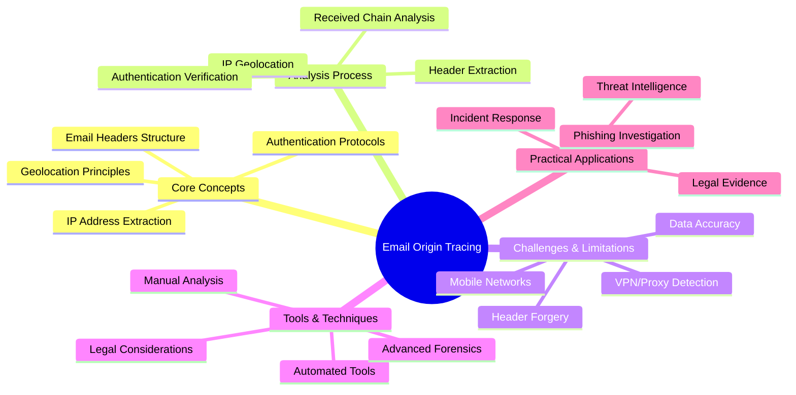
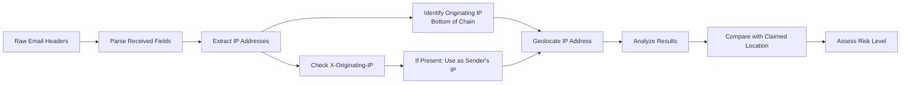
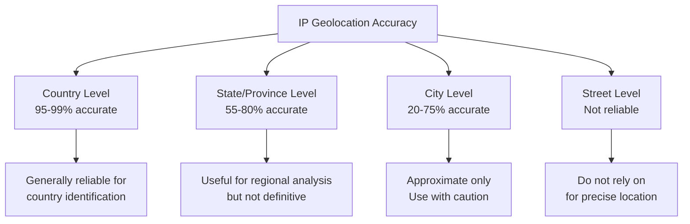
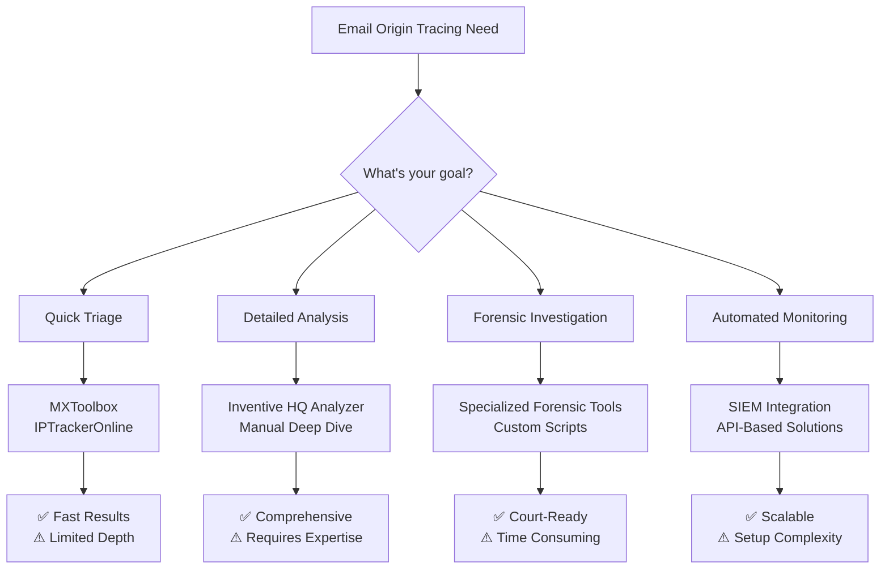

---
tags: [email-security]
---
# 🌍 Full-Stack Lesson: Tracing the Sender's IP Address and Origin in Email Headers


## TCM Exam Objectives
- Extract originating IP addresses from bottom-most Received headers and X-Originating-IP fields
- Perform IP geolocation analysis and understand accuracy limitations of different services
- Use IP reputation services (AbuseIPDB, VirusTotal) to assess sender threat level
- Detect VPN/proxy usage and geographic inconsistencies in email routing paths
- Apply SPF, DKIM, and DMARC authentication results to verify sender legitimacy
- Analyze Received header chains for timestamp anomalies and impossible routing jumps
- Build automated Python-based pipelines for header extraction and IP analysis
- Document forensic evidence with proper chain of custody for legal proceedings
- Identify private IP ranges and carrier-grade NAT indicators in email headers
- Correlate sender IP intelligence with threat intelligence feeds for campaign attribution

# 🌍 Full-Stack Lesson: Tracing the Sender's IP Address and Origin in Email Headers

## 🎯 Introduction: Why Trace Email Origins?

Tracing the geographic origin of an email is a fundamental skill for cybersecurity professionals, forensic investigators, and anyone concerned with email security. By analyzing email headers, we can uncover the true path a message took, identify potential spoofing or phishing attempts, and determine the sender's actual location—information that is crucial for incident response, threat intelligence, and legal investigations 【turn0search7】【turn0search23】.



## 📊 1. Understanding Email Headers and IP Addresses

### 1.1 Anatomy of Email Headers

Email headers contain metadata about the message's journey from sender to recipient. The key fields for tracing include:

| Header Field | Purpose | Tracing Value |
|--------------|---------|---------------|
| **Received** | Shows mail servers that processed the message | Primary source of IP addresses |
| **X-Originating-IP** | Sender's actual IP address (when available) | Direct sender location |
| **Return-Path** | Bounce address (envelope sender) | Authentication verification |
| **Authentication-Results** | SPF, DKIM, DMARC outcomes | Sender legitimacy |
| **From** | Displayed sender address | Can be forged |
| **Message-ID** | Unique identifier | Message tracking |

📌 **Exam Tip:** On the PSAA exam, the bottom-most Received header is always the true origin of the email. If a question asks you to identify the sender's IP, look at the last Received header in the chain — not the first one. The X-Originating-IP header (when present) provides the most direct sender location.

```mermaid
flowchart TD
    A[Raw Email Headers] --> B[Find bottom-most Received header]
    B --> C[Extract IP from brackets [IP]]
    C --> D{Also check X-Originating-IP}
    D --> E[Geolocate IP]
    E --> F{IP matches claimed sender location?}
    F -->|Yes| G[✅ Consistent - Low Risk]
    F -->|No| H[🚨 Geographic Anomaly]
    H --> I{Is IP from VPN/Proxy?}
    I -->|Yes| J[High Risk - Anonymization Attempt]
    I -->|No| K[Medium Risk - Investigate Further]
    G --> L[Check SPF/DKIM/DMARC]
    J --> M[Blocklist IP and Domain]
    K --> M
```

> 💡 **Key Insight**: Email headers are read **from bottom to top**. The bottom-most `Received:` line represents the originating mail server, and each subsequent line above it shows a relay point in the journey to your inbox 【turn0search0】.

### 1.2 The Received Header Chain

A typical Received header looks like this:
```
Received: from mail.company.com (mail.company.com [203.0.113.45])
    by mail.receiver.com with SMTP id 12345abcde
    for user@receiver.com; Wed, 1 Jan 2025 10:00:00 -0500
```

The IP address in brackets `[203.0.113.45]` is what you're looking for—this is the IP address of the sending mail server 【turn0search7】. For tracing purposes, focus on:

1. **Bottom-most Received header**: The originating mail server's IP
2. **Middle Received headers**: Intermediate mail servers the message passed through
3. **Top Received header**: Your receiving mail server

### 1.3 IP Address Extraction Process



## 🔍 2. Step-by-Step Tracing Process

### 2.1 Step 1: Extract Email Headers

**For Gmail:**
1. Open the email
2. Click the three-dot menu (⋮) next to Reply
3. Select "Show original"
4. Copy all header text 【turn0search1】【turn0search2】

**For Outlook:**
1. Open the email
2. File → Properties
3. Copy from "Internet headers" box 【turn0search2】

**For Apple Mail:**
1. Open the email
2. View → Message → Raw Source 【turn0search2】

### 2.2 Step 2: Analyze Received Header Chain

<details>
<summary>🔧 Detailed Header Analysis Example</summary>

Consider this simplified header chain:
```
Received: from mail.receiver.com (localhost [127.0.0.1])
    by mx.receiver.com with ESMTP; Wed, 1 Jan 2025 10:05:00 -0500
Received: from mail.sender.com (mail.sender.com [203.0.113.45])
    by mail.receiver.com with ESMTPS id 12345abcde
    for user@receiver.com; Wed, 1 Jan 2025 10:00:00 -0500
Received: from [192.168.1.100] (cpe-72-178-32-15.socal.res.rr.com [72.178.32.15])
    by mail.sender.com with ESMTPSA; Wed, 1 Jan 2025 09:55:00 -0500
```

**Analysis:**
1. **Bottom Received**: `[72.178.32.15]` - This is the sender's actual IP address (RoadRunner residential IP)
2. **Middle Received**: `[203.0.113.45]` - Sending mail server (mail.sender.com)
3. **Top Received**: Your receiving server

The sender's IP `72.178.32.15` can be geolocated to approximate location.
</details>

### 2.3 Step 3: Geolocate IP Addresses

Use IP geolocation services to determine the approximate location of extracted IP addresses:

| Service | Accuracy Level | Best For | Cost |
|---------|---------------|----------|------|
| **MaxMind GeoIP2** | Country: 99%<br/>City: 75-90% | Professional investigations | Freemium |
| **IP2Location** | Country: 99%<br/>City: 80-85% | Batch lookups | Commercial |
| **IP Location** | Country: 95%<br/>City: 70-80% | Quick checks | Free |
| **WhatIsMyIPAddress** | Variable | Simple lookups | Free 【turn0search2】 |

📌 **Exam Tip:** For the exam, know that IP geolocation has tiered accuracy: Country-level (95-99%), State/Region (55-80%), City (20-75%), and Street-level (not reliable). VPNs, proxies, and mobile networks significantly reduce accuracy. Always cross-reference multiple geolocation services for critical investigations.

> ⚠️ **Important Limitation**: IP geolocation is not 100% accurate. Country-level accuracy is generally 95-99%, but city-level accuracy drops to 50-75% 【turn0search14】【turn0search15】. VPNs, proxies, and mobile networks can significantly reduce accuracy.

### 2.4 Step 4: Verify Authentication Results

Check the `Authentication-Results` header for SPF, DKIM, and DMARC outcomes:

```
Authentication-Results: mx.google.com;
    spf=pass (google.com: domain of sender@example.com designates 203.0.113.45 as permitted sender) smtp.mailfrom=sender@example.com;
    dkim=pass header.i=@example.com;
    dmarc=pass (p=REJECT sp=REJECT dis=NONE) header.from=example.com
```

**Red Flags:**
- `spf=fail` or `spf=none`
- `dkim=fail` or `dkim=none`
- `dmarc=fail` or `dmarc=none`
- Mismatch between `From` and `Return-Path` domains 【turn0search0】【turn0search9】

## 🗺️ 3. Understanding IP Geolocation Accuracy

### 3.1 Tiered Accuracy Levels



### 3.2 Factors Affecting Accuracy

| Factor | Impact on Accuracy | Mitigation Strategy |
|--------|-------------------|---------------------|
| **VPNs/Proxies** | Hides true location, shows VPN server location | Check for known VPN/proxy IPs |
| **Mobile Networks** | Associates with cell tower location, not user | Look for consistent patterns |
| **Corporate Networks** | May show datacenter location, not user | Consider organizational context |
| **Dynamic IPs** | Location changes over time | Cross-reference with timestamps |
| **Satellite Internet** | Often inaccurate or broad | Note as limitation in analysis |

### 3.3 Geolocation Database Variations

Different services may show slightly different locations for the same IP due to:
- Data collection methods (registry mining, user polls, partnerships) 【turn0search17】
- Update frequency and data freshness
- Proprietary algorithms and correlation methods
- Coverage of specific regions or ISPs

> 💡 **Pro Tip**: For critical investigations, cross-reference multiple geolocation services and look for consensus rather than relying on a single source 【turn0search7】.

## 🚨 4. Detecting Spoofing and Anomalies

### 4.1 Common Spoofing Indicators

| Indicator | Legitimate Example | Spoofed Example | Risk Level |
|-----------|-------------------|-----------------|------------|
| **From vs Return-Path** | `From: ceo@company.com`<br/>`Return-Path: ceo@company.com` | `From: ceo@company.com`<br/>`Return-Path: mailer@cheap-domain.xyz` | High |
| **Authentication Results** | `spf=pass; dkim=pass; dmarc=pass` | `spf=fail; dkim=fail; dmarc=fail` | Critical |
| **Received Chain** | Logical geographic progression | Impossible jumps (e.g., NY→Tokyo→NY in seconds) | High |
| **X-Originating-IP** | Consistent with claimed location | Different country or known VPN | Medium-High |
| **Message-ID Format** | Matches sender's domain | Random or unrelated domain | Medium |

### 4.2 Header Forgery Detection Techniques

<details>
<summary>🔍 Advanced Header Analysis</summary>

**1. Timestamp Analysis**
- Check for impossible timestamps (future dates)
- Look for out-of-order sequencing
- Identify unusual delays between hops

**2. Received Chain Consistency**
- Verify "from" server in one Received header matches "by" server in the next
- Look for unexpected mail servers or hosting providers
- Check for routing through high-risk countries

**3. Message-ID Pattern Analysis**
- Format should match sender's typical pattern
- Domain should match From header
- Random or numeric-only IDs may indicate bulk mailing

**4. X-Headers Analysis**
- Look for spam scores or malware scan results
- Check for routing anomalies or custom headers
- Identify bulk mailing software signatures

**5. Cross-Field Validation**
- Compare From, Return-Path, Reply-To, and Sender headers
- Check Message-ID domain matches From domain
- Verify User-Agent matches expected email client
</details>

### 4.3 Geographic Inconsistency Detection

```python
# Example: Geographic consistency checker
def check_geographic_consistency(received_chain, claimed_location):
    """
    Analyze if email routing path makes geographic sense
    
    Args:
        received_chain: List of (ip, timestamp) tuples from headers
        claimed_location: Dict with country, region, city from From header
    
    Returns:
        Dictionary with consistency assessment
    """
    inconsistencies = []
    
    for i, (ip, timestamp) in enumerate(received_chain):
        geo_data = geolocate_ip(ip)
        
        # Check if IP location matches claimed sender location
        if i == 0:  # First hop (sender's IP)
            if geo_data['country'] != claimed_location['country']:
                inconsistencies.append({
                    'type': 'country_mismatch',
                    'ip': ip,
                    'claimed': claimed_location['country'],
                    'actual': geo_data['country']
                })
        
        # Check for impossible geographic jumps
        if i > 0:
            prev_ip, prev_time = received_chain[i-1]
            prev_geo = geolocate_ip(prev_ip)
            
            # Calculate distance and time
            distance = calculate_distance(prev_geo, geo_data)
            time_diff = (timestamp - prev_time).total_seconds() / 3600  # hours
            
            # Flag if distance > 5000km and time < 1 hour
            if distance > 5000 and time_diff < 1:
                inconsistencies.append({
                    'type': 'impossible_jump',
                    'from': prev_geo['city'],
                    'to': geo_data['city'],
                    'distance_km': distance,
                    'time_hours': time_diff
                })
    
    return {
        'consistent': len(inconsistencies) == 0,
        'inconsistencies': inconsistencies,
        'risk_level': 'High' if len(inconsistencies) > 1 else 'Medium' if inconsistencies else 'Low'
    }
```

## 🛠️ 5. Tools and Automation

### 5.1 Online Header Analysis Tools

| Tool | Key Features | Best For | Rating |
|------|--------------|----------|--------|
| **MXToolbox Email Header Analyzer** | Comprehensive parsing, authentication results, routing visualization 【turn0search3】 | Quick triage and professional analysis | ★★★★★ |
| **Inventive HQ Email Header Analyzer** | Interactive map visualization, authentication checking, geographic tracing 【turn0search7】 | Visual analysis and reporting | ★★★★☆ |
| **IPTrackerOnline** | Sender IP tracing, security analysis, interactive map 【turn0search0】 | Geographic visualization | ★★★★☆ |
| **MailSlurp Header Analyzer** | Structured summary, authentication focus, routing analysis 【turn0search10】 | Development and testing | ★★★★☆ |
| **DNSChecker Email Analyzer** | Basic header parsing, IP extraction 【turn0search1】 | Simple lookups | ★★★☆☆ |

### 5.2 Command-Line Tools

```bash
# Example: Extract IP addresses from email headers
grep -oE '[0-9]{1,3}\.[0-9]{1,3}\.[0-9]{1,3}\.[0-9]{1,3}' email_headers.txt | sort -u

# Example: Geolocate IP using ipinfo.io
curl ipinfo.io/203.0.113.45

# Example: Check IP reputation using AbuseIPDB
curl https://api.abuseipdb.com/api/v2/check \
    --data "ipAddress=203.0.113.45" \
    --header "Key: YOUR_API_KEY" \
    --header "Accept: application/json"
```

### 5.3 Automated Analysis Pipeline

<details>
<summary>⚙️ Python Email Tracing Script</summary>

```python
import re
import requests
from typing import Dict, List, Tuple
from datetime import datetime
import maxminddb

class EmailOriginTracer:
    def __init__(self, geoip_db_path: str):
        """Initialize with path to MaxMind GeoIP database"""
        self.reader = maxminddb.open_database(geoip_db_path)
        
    def parse_headers(self, raw_headers: str) -> Dict:
        """Parse raw email headers into structured format"""
        headers = {}
        current_header = None
        
        for line in raw_headers.split('\n'):
            if line.startswith(' ') or line.startswith('\t'):
                # Continuation of previous header
                if current_header:
                    headers[current_header] += ' ' + line.strip()
            else:
                match = re.match(r'^([^:]+):\s*(.*)$', line)
                if match:
                    current_header = match.group(1).lower()
                    headers[current_header] = match.group(2).strip()
        
        return headers
    
    def extract_received_chain(self, headers: Dict) -> List[Tuple[str, datetime]]:
        """Extract Received headers and parse into chain"""
        received_headers = []
        
        # Find all Received headers (they may be numbered)
        for key, value in headers.items():
            if key.startswith('received'):
                # Extract IP address
                ip_match = re.search(r'\[(\d+\.\d+\.\d+\.\d+)\]', value)
                if ip_match:
                    ip = ip_match.group(1)
                    
                    # Extract timestamp
                    timestamp_match = re.search(r';\s*([^;]+)$', value)
                    if timestamp_match:
                        try:
                            # Parse various timestamp formats
                            timestamp_str = timestamp_match.group(1).strip()
                            # Simplified parsing - adjust based on formats you encounter
                            timestamp = datetime.strptime(timestamp_str, '%a, %d %b %Y %H:%M:%S %z')
                        except:
                            timestamp = datetime.now()  # Fallback
                    
                    received_headers.append((ip, timestamp))
        
        # Sort by timestamp (oldest first)
        received_headers.sort(key=lambda x: x[1])
        
        return received_headers
    
    def geolocate_ip(self, ip: str) -> Dict:
        """Get geographic information for IP address"""
        try:
            data = self.reader.get(ip)
            if data:
                return {
                    'ip': ip,
                    'country': data.get('country', {}).get('names', {}).get('en', 'Unknown'),
                    'city': data.get('city', {}).get('names', {}).get('en', 'Unknown'),
                    'latitude': data.get('location', {}).get('latitude', 0),
                    'longitude': data.get('location', {}).get('longitude', 0),
                    'accuracy_radius': data.get('location', {}).get('accuracy_radius', 1000)
                }
        except:
            pass
        
        # Fallback to API if database lookup fails
        try:
            response = requests.get(f'http://ip-api.com/json/{ip}')
            data = response.json()
            return {
                'ip': ip,
                'country': data.get('country', 'Unknown'),
                'city': data.get('city', 'Unknown'),
                'latitude': data.get('lat', 0),
                'longitude': data.get('lon', 0),
                'accuracy_radius': 1000  # Unknown
            }
        except:
            return {
                'ip': ip,
                'country': 'Unknown',
                'city': 'Unknown',
                'latitude': 0,
                'longitude': 0,
                'accuracy_radius': 1000
            }
    
    def analyze_email(self, raw_headers: str) -> Dict:
        """Complete email origin analysis"""
        headers = self.parse_headers(raw_headers)
        received_chain = self.extract_received_chain(headers)
        
        # Extract sender information
        from_header = headers.get('from', '')
        return_path = headers.get('return-path', '')
        
        # Extract sender IP (bottom of received chain)
        sender_ip = None
        if received_chain:
            sender_ip = received_chain[0][0]
        
        # Check for X-Originating-IP (more direct)
        x_originating_ip = headers.get('x-originating-ip', '')
        if x_originating_ip:
            # Extract IP from format like "[192.168.1.1]"
            ip_match = re.search(r'\[(\d+\.\d+\.\d+\.\d+)\]', x_originating_ip)
            if ip_match:
                sender_ip = ip_match.group(1)
        
        # Geolocate sender IP
        sender_location = self.geolocate_ip(sender_ip) if sender_ip else None
        
        # Analyze authentication
        auth_results = headers.get('authentication-results', '')
        authentication = {
            'spf': 'fail' if 'spf=fail' in auth_results else 'pass' if 'spf=pass' in auth_results else 'none',
            'dkim': 'fail' if 'dkim=fail' in auth_results else 'pass' if 'dkim=pass' in auth_results else 'none',
            'dmarc': 'fail' if 'dmarc=fail' in auth_results else 'pass' if 'dmarc=pass' in auth_results else 'none'
        }
        
        # Check for domain mismatch
        from_domain = re.search(r'@([^>]+)', from_header)
        return_path_domain = re.search(r'@([^>]+)', return_path)
        domain_mismatch = False
        if from_domain and return_path_domain:
            domain_mismatch = from_domain.group(1).lower() != return_path_domain.group(1).lower()
        
        return {
            'sender_ip': sender_ip,
            'sender_location': sender_location,
            'received_chain': received_chain,
            'authentication': authentication,
            'domain_mismatch': domain_mismatch,
            'risk_indicators': self._identify_risk_indicators(authentication, domain_mismatch, sender_location)
        }
    
    def _identify_risk_indicators(self, authentication: Dict, domain_mismatch: bool, location: Dict) -> List[str]:
        """Identify potential risk indicators"""
        indicators = []
        
        if authentication['spf'] != 'pass':
            indicators.append('SPF authentication failed')
        if authentication['dkim'] != 'pass':
            indicators.append('DKIM signature missing or failed')
        if authentication['dmarc'] != 'pass':
            indicators.append('DMARC policy not met')
        if domain_mismatch:
            indicators.append('From and Return-Path domains do not match')
        if location and location.get('accuracy_radius', 1000) > 100:
            indicators.append('IP geolocation has low accuracy')
        
        return indicators

# Usage example
tracer = EmailOriginTracer('GeoLite2-City.mmdb')
analysis = tracer.analyze_email(raw_email_headers)
print(f"Sender IP: {analysis['sender_ip']}")
print(f"Location: {analysis['sender_location']['city']}, {analysis['sender_location']['country']}")
print(f"Risk Indicators: {analysis['risk_indicators']}")
```
</details>

## ⚖️ 6. Legal and Ethical Considerations

### 6.1 Privacy Implications

- **Data Protection Laws**: GDPR, CCPA, and other regulations govern the collection and processing of IP addresses as personal data
- **Consent Requirements**: Ensure you have legal authority to analyze email headers, especially for investigation purposes
- **Data Minimization**: Collect only necessary IP address information for the stated purpose
- **Retention Policies**: Establish clear timelines for retaining email header data

### 6.2 Chain of Custody for Forensic Evidence

<details>
<summary>⚖️ Forensic Documentation Requirements</summary>

When tracing emails for legal proceedings, maintain:

1. **Original Header Preservation**
   - Store raw headers in tamper-proof format
   - Use cryptographic hashes to verify integrity
   - Document extraction method and timestamp

2. **Analysis Documentation**
   - Record all tools used (versions, configurations)
   - Document analytical steps and reasoning
   - Include screenshots and visualizations

3. **Chain of Custody**
   - Document who handled the evidence and when
   - Maintain secure storage with access controls
   - Use write-once media for long-term storage

4. **Expert Testimony Preparation**
   - Prepare to explain technical concepts in layman's terms
   - Anticipate challenges to methodology or conclusions
   - Provide alternative explanations where appropriate

5. **Report Format**
   ```
   Executive Summary
   Technical Analysis
   - Header extraction and parsing
   - IP address identification
   - Geolocation methodology and limitations
   - Authentication results interpretation
   Findings and Conclusions
   Supporting Evidence
   - Raw headers
   - Geolocation data
   - Tool outputs
   Methodology Limitations
   ```
</details>

### 6.3 Jurisdictional Challenges

| Challenge | Impact | Mitigation |
|-----------|--------|------------|
| **Cross-border Investigations** | Different privacy laws, data retention requirements | Use international protocols (MLAT, Budapest Convention) |
| **Evidence Admissibility** | Varying standards for digital evidence | Follow forensic best practices, document thoroughly |
| **ISP Cooperation** | Reluctant to share user information without legal compulsion | Obtain appropriate legal orders (subpoenas, warrants) |
| **Attribution Challenges** | Difficult to prove who was using an IP at a specific time | Corroborate with additional evidence (timing, content, behavior) |

## 🎓 7. Practical Case Studies

### 7.1 Case Study: Phishing Email Investigation

**Scenario**: Employee received email claiming to be from CEO requesting urgent wire transfer.

**Header Analysis Findings**:
```
From: "CEO John Smith" <ceo@company.com>
Return-Path: <attacker@malicious-domain.ru>
Authentication-Results: spf=fail; dkim=fail; dmarc=fail
Received: from mail.evilserver.net [192.0.2.10] (Romania)
    by mx.company.com with ESMTP; Wed, 1 Jan 2025 14:23:17 +0000
X-Originating-IP: [192.0.2.10]
```

**Analysis**:
1. **Return-Path Mismatch**: `malicious-domain.ru` vs `company.com`
2. **Authentication Failure**: All checks failed
3. **Geographic Inconsistency**: Email from Romania, CEO supposedly in US
4. **Suspicious IP**: 192.0.2.10 belongs to known bulletproof hosting

**Conclusion**: High-confidence phishing attempt. Recommended immediate blocking and employee training.

### 7.2 Case Study: Compromised Account Investigation

**Scenario**: Emails from legitimate colleague but with unusual requests.

**Header Analysis Findings**:
```
From: colleague@company.com
Return-Path: colleague@company.com
Authentication-Results: spf=pass; dkim=pass; dmarc=pass
Received: from mail.company.com [203.0.113.45] (US)
    by mx.company.com with ESMTP; Wed, 1 Jan 2025 09:15:00 -0500
Received: from [192.168.1.100] (cpe-72-178-32-15.socal.res.rr.com [72.178.32.15])
    by mail.company.com with ESMTPSA; Wed, 1 Jan 2025 09:14:30 -0500
X-Originating-IP: [72.178.32.15]
```

**Analysis**:
1. **Authentication Passes**: All checks pass (legitimate account)
2. **Geographic Consistency**: IP geolocates to Southern California (matches colleague's location)
3. **Behavioral Anomalies**: Unusual request pattern, timing outside normal hours
4. **Content Analysis**: Urgency cues, requests for gift cards

**Conclusion**: Account compromise via successful phishing. Recommended password reset and MFA enrollment.

## 📈 8. Advanced Techniques and Future Trends

### 8.1 Machine Learning for Anomaly Detection

<details>
<summary>🤖 AI-Powered Header Analysis</summary>

```python
# Example: Machine learning model for header anomaly detection
import numpy as np
from sklearn.ensemble import IsolationForest
from sklearn.preprocessing import StandardScaler

class HeaderAnomalyDetector:
    def __init__(self):
        self.model = IsolationForest(contamination=0.1, random_state=42)
        self.scaler = StandardScaler()
        self.feature_names = [
            'authentication_score',
            'domain_mismatch',
            'geo_consistency',
            'routing_complexity',
            'timestamp_anomaly',
            'header_completeness'
        ]
    
    def extract_features(self, header_analysis: Dict) -> np.array:
        """Extract numerical features from header analysis"""
        features = []
        
        # Authentication score (0-3)
        auth_score = sum([
            header_analysis['authentication']['spf'] == 'pass',
            header_analysis['authentication']['dkim'] == 'pass',
            header_analysis['authentication']['dmarc'] == 'pass'
        ])
        features.append(auth_score)
        
        # Domain mismatch (0 or 1)
        features.append(1 if header_analysis['domain_mismatch'] else 0)
        
        # Geographic consistency (0-1, higher is better)
        if header_analysis['sender_location']:
            # Compare with claimed location from From header
            # This would require additional logic to parse From header
            geo_consistency = 0.8  # Placeholder
        else:
            geo_consistency = 0.5
        features.append(geo_consistency)
        
        # Routing complexity (number of hops)
        features.append(len(header_analysis['received_chain']))
        
        # Timestamp anomaly (0-1, higher is more anomalous)
        # This would require analysis of timestamp patterns
        timestamp_anomaly = 0.2  # Placeholder
        features.append(timestamp_anomaly)
        
        # Header completeness (0-1)
        expected_headers = ['from', 'to', 'subject', 'date', 'message-id']
        present_headers = sum(1 for h in expected_headers if h in header_analysis)
        features.append(present_headers / len(expected_headers))
        
        return np.array(features).reshape(1, -1)
    
    def train(self, legitimate_emails: List[Dict]):
        """Train the model on legitimate email samples"""
        features = []
        for email in legitimate_emails:
            features.append(self.extract_features(email))
        
        X = np.array(features)
        X_scaled = self.scaler.fit_transform(X)
        self.model.fit(X_scaled)
    
    def predict(self, email_analysis: Dict) -> Dict:
        """Predict if email is anomalous"""
        features = self.extract_features(email_analysis)
        features_scaled = self.scaler.transform(features)
        
        anomaly_score = self.model.decision_function(features_scaled)[0]
        is_anomaly = self.model.predict(features_scaled)[0] == -1
        
        return {
            'anomaly_score': anomaly_score,
            'is_anomaly': is_anomaly,
            'risk_level': 'High' if is_anomaly else 'Low',
            'contributing_factors': self._interpret_features(features)
        }
```
</details>

### 8.2 Emerging Challenges

| Challenge | Description | Potential Solutions |
|-----------|-------------|---------------------|
| **AI-Generated Headers** | Attackers use AI to create realistic but forged headers | Behavioral analysis beyond header content |
| **Quantum Computing** | Future threat to cryptographic authentication | Post-quantum cryptography for DKIM |
| **5G/Edge Computing** | Distributed infrastructure complicates tracing | Enhanced correlation across distributed systems |
| **Privacy Regulations** | Stricter data protection limits IP retention | Anonymized analysis techniques, differential privacy |

### 8.3 Future Directions

1. **Enhanced Geolocation Accuracy**
   - Integration of WiFi access point databases
   - Machine learning for pattern recognition
   - Real-time data validation across multiple sources

2. **Behavioral Biometrics**
   - Typing patterns and mouse dynamics
   - Email composition behavior analysis
   - Device fingerprinting beyond IP address

3. **Threat Intelligence Integration**
   - Real-time IP reputation scoring
   - Known attacker infrastructure mapping
   - Campaign correlation and attribution

4. **Automated Response**
   - Real-time blocking of suspicious IPs
   - Automated ticketing for investigation
   - Integration with SOAR platforms

## 📋 9. Practical Checklist and Quick Reference

### 9.1 Email Origin Tracing Checklist

<details>
<summary>✅ Comprehensive Investigation Checklist</summary>

#### **Initial Triage**
- [ ] Extract full email headers from client
- [ ] Verify header completeness (From, To, Subject, Date, Received, Message-ID)
- [ ] Check for obvious red flags (generic greetings, urgency cues, unexpected attachments)

#### **Header Analysis**
- [ ] Parse Received headers from bottom to top
- [ ] Identify originating IP address (bottom of chain)
- [ ] Check for X-Originating-IP header
- [ ] Verify Message-ID format matches From domain
- [ ] Compare From and Return-Path domains for mismatch

#### **Authentication Verification**
- [ ] Check Authentication-Results for SPF outcome
- [ ] Check Authentication-Results for DKIM outcome
- [ ] Check Authentication-Results for DMARC outcome
- [ ] Verify alignment between authenticated domain and From header

#### **Geographic Analysis**
- [ ] Geolocate sender IP using multiple services
- [ ] Cross-reference with claimed sender location
- [ ] Check for geographic inconsistencies in routing path
- [ ] Verify IP reputation (VPN/proxy detection, hosting provider)

#### **Pattern Analysis**
- [ ] Check for timestamp anomalies (impossible sequences, future dates)
- [ ] Analyze routing path for unusual hops or countries
- [ ] Compare with known legitimate email patterns from sender
- [ ] Check for bulk mailing signatures (X-Mailer, X-PHP-Originating-Script)

#### **Documentation**
- [ ] Document all findings with timestamps
- [ ] Preserve original headers for evidence
- [ ] Create visual timeline of email journey
- [ ] Prepare summary report with risk assessment
</details>

### 9.2 Quick Reference: Common IP Ranges and Their Meanings

| IP Range | Typical Meaning | Risk Level | Action |
|----------|----------------|------------|--------|
| **10.0.0.0/8** | Private network (internal) | Low | No action needed |
| **172.16.0.0/12** | Private network (internal) | Low | No action needed |
| **192.168.0.0/16** | Private network (internal) | Low | No action needed |
| **127.0.0.0/8** | Localhost (loopback) | Information | Note for context |
| **169.254.0.0/16** | Link-local (APIPA) | Medium | Check for misconfiguration |
| **100.64.0.0/10** | Carrier-grade NAT | Medium | May indicate mobile network |
| **Public IPs** | Internet-routable | Varies | Geolocate and assess reputation |

### 9.3 Tool Selection Guide



## 💎 Conclusion: Best Practices and Final Recommendations

Tracing the sender's IP address and geographic origin from email headers is a powerful technique for cybersecurity investigations, but it requires careful methodology and an understanding of limitations. Here are the key takeaways:

### 10.1 Core Principles

1. **Multiple Data Sources**: Never rely on a single geolocation service or authentication check
2. **Context Matters**: Evaluate findings in the context of sender behavior, email content, and organizational patterns
3. **Document Everything**: Maintain detailed records for forensic value and institutional learning
4. **Respect Privacy**: Handle IP address data in compliance with applicable regulations
5. **Continuous Learning**: Threat actors constantly evolve techniques; stay updated with new methods

### 10.2 Implementation Recommendations

| Organization Size | Recommended Approach | Tools |
|-------------------|---------------------|-------|
| **Small Business** | Basic header analysis for phishing reports | MXToolbox, IPTrackerOnline |
| **Medium Enterprise** | Automated analysis with SIEM integration | Inventive HQ, Custom Scripts |
| **Large Enterprise** | Dedicated email security team with forensic capabilities | Specialized Tools, In-house Expertise |
| **Service Provider** | Multi-layered analysis with threat intelligence | Commercial Platforms, Custom APIs |

### 10.3 Final Thought

> ⚠️ **Remember**: Email header analysis is both art and science. While technical tools provide data, human judgment is essential for interpreting that data in context. The most effective investigators combine technical expertise with critical thinking and an understanding of human behavior—the same skills that make effective cybersecurity professionals.

By following the methodologies and best practices outlined in this lesson, you can develop the skills to effectively trace email origins, identify potential threats, and contribute to your organization's security posture. Whether you're investigating a phishing attempt, responding to an incident, or conducting forensic analysis, the ability to trace email origins is an invaluable skill in today's digital landscape.