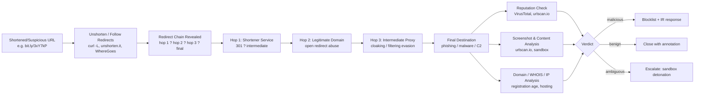
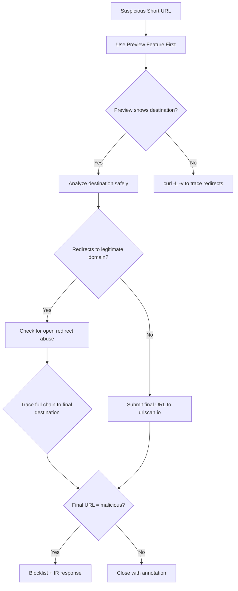
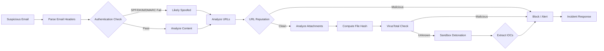

# Identifying Redirects and Shortened Links


## TCM Exam Objectives
- Unravel redirect chains by tracing HTTP 3xx status codes and Location headers
- Identify the six most-abused URL shorteners: t.ly, TinyURL, Rebrand.ly, Is.gd, Goo.su, Qrco.de
- Use shortener preview features (bit.ly+, TinyURL/preview) for safe destination discovery
- Detect open redirect abuse (CWE-601) on legitimate domains bypassing security validation
- Distinguish between HTTP redirects (301/302/307/308) and client-side redirects (meta refresh, JavaScript)
- Apply curl commands with -L and -v flags for command-line redirect chain tracing
- Use urlscan.io for behavioral URL detonation that catches client-side redirects
- Recognize adaptive cloaking techniques that serve different content to scanners vs users
- Identify QR code phishing (quishing) that bypasses text-based URL scanners
- Document full redirect chains including intermediate hops for threat intelligence

Shortened URLs and redirect chains are obfuscation layers that conceal a link's true destination — and attackers exploit them heavily, with 48% of malicious links using URL redirection in 2025 and six shortener services (t.ly, TinyURL, Rebrand.ly, Is.gd, Goo.su, and Qrco.de) accounting for the bulk of abuse.?turn0search0??turn0search13? Identifying the true destination behind a shortened or redirected link requires unraveling the redirect chain — following each HTTP 3xx response and its `Location` header hop-by-hop until the final landing page is reached — then analyzing that destination against threat intelligence, because the visible short link tells you nothing about where the user actually lands.?turn0search0??turn0search2?

## The Redirect Chain Analysis Pipeline

Every shortened or redirected URL is a chain of HTTP requests where each server responds with a 3xx status code and a `Location` header pointing to the next destination. The analyst's job is to trace this chain to its final destination without ever clicking the link in a browser, then evaluate that destination for malicious indicators.?turn0search2??turn2search8?



?? **Exam Tip:** Memorize the six most-abused shorteners (t.ly, TinyURL, Rebrand.ly, Is.gd, Goo.su, Qrco.de) — especially Goo.su, which has an 89% malware rate. For safe analysis, always use preview features first: append `+` to bit.ly URLs, `preview` to TinyURL, `@` to cutt.ly, and `-` to is.gd.



The dotted reality: a single short link can traverse 3–5 hops, often passing through legitimate domains (via open redirect vulnerabilities) before landing on the malicious payload — which is why traditional security tools that only inspect the initial URL struggle to analyze multi-hop redirect behavior in real time.?turn0search2??turn0search8?

## Master Comparison: Redirect Types and Indicators

| Redirect Type | Mechanism | How to Detect | Attacker Use |
|---|---|---|---|
| **HTTP 301 (Moved Permanently)** | Server-side, `Location` header | `curl -I`, `Location` header in response | Permanent redirect to phishing infrastructure?turn1search0??turn1search4? |
| **HTTP 302 (Found/Temporary)** | Server-side, `Location` header | `curl -I`, trace `-L` | Temporary redirect, most common in phishing chains?turn1search1??turn1search4? |
| **HTTP 307/308** | Server-side, preserves HTTP method | `curl -I`, status code inspection | Method-preserving redirects, less common in attacks?turn1search4? |
| **Meta Refresh** | HTML `<meta http-equiv="refresh">` | Inspect HTML source, `content="0;url=..."` | Client-side redirect bypasses server-side inspection?turn2search11??turn2search12? |
| **JavaScript Redirect** | `window.location`, `location.href` assignment | Inspect JS source, sandbox execution | Evades static URL analysis; requires browser execution?turn2search12??turn2search14? |
| **URL Shortener** | Database lookup, 301/302 to stored destination | Unshorten tool, preview feature | Primary obfuscation layer — 48% of malicious links?turn0search0??turn0search13? |
| **Open Redirect Abuse** | Legitimate site's redirect parameter exploited | Inspect URL parameters (`?url=`, `?redirect=`) | Wraps malicious destination in trusted domain reputation?turn0search8??turn1search16? |
| **Data URI Redirect** | `data:text/html` with embedded redirect | Inspect URL scheme, decode base64 | Evades domain-based filtering entirely |
| **QR Code + Redirect** | QR encodes short/redirect URL | Decode QR, then unshorten | Quishing — 12% of phishing attacks in 2025?turn0search12? |

Sources: ?turn0search0??turn0search8??turn0search13??turn1search0??turn1search4??turn1search16??turn2search11??turn2search12?

---

## Module 1 — Major URL Shortener Services and Their Abuse

URL shorteners take a long URL and map it to a short alias stored in a database — when the short link is visited, the service looks up the destination and issues an HTTP redirect. Because the short link is a key into somebody else's database, you cannot expand the link without querying that database.?turn1search14? This obfuscation is exactly what attackers exploit.

### The Six Most-Abused Shorteners (2024–2025)

Cofense Intelligence identified the most commonly abused legitimate URL shortening services between July 2024 and June 2025:?turn0search13?

| Service | Domain | Abuse Profile |
|---|---|---|
| **T.ly** | t[.]ly | Commonly used in credential phishing and malware delivery |
| **TinyURL** | TinyURL[.]com | Heavily abused — APWG Q4 2025 report specifically noted attackers redirecting through TINYURL.COM?turn2search4? |
| **Rebrand.ly** | Rebrand[.]ly | Used in both phishing and malware campaigns |
| **Is.gd** | Is[.]gd | Frequently appears in malicious redirect chains |
| **Goo.su** | Goo[.]su | 89% malware rate — the highest abuse ratio among the six?turn0search0? |
| **Qrco.de** | Qrco[.]de | Often paired with QR code phishing (quishing) |

These six services account for the majority of shortener abuse because they offer free, anonymous, rapid link creation with minimal verification — exactly the properties attackers need for high-volume campaigns.?turn0search0??turn0search13? The APWG Q4 2025 Phishing Activity Trends Report specifically called out that attackers notably redirected attacks through TINYURL.COM, with no single industry standing out as particularly vulnerable — the abuse is cross-sector.?turn2search4?

### Preview Features (Defender's First Look)

Most major shorteners include a preview feature that reveals the destination without following the redirect — this is the safest first step in analysis because it queries the shortener's database directly without executing the redirect chain:?turn0search16??turn3search11??turn3search13?

| Service | Preview Method | Example |
|---|---|---|
| **Bitly** | Append `+` to the short URL | `bit.ly/3kwQV20` ? `bit.ly/3kwQV20+` |
| **TinyURL** | Append `preview` | `tinyurl.com/y8xyz` ? `tinyurl.com/preview/y8xyz` |
| **Cutt.ly** | Append `@` | `cutt.ly/YEh65VC` ? `cutt.ly/YEh65VC@` |
| **Is.gd** | Append `-` | `is.gd/vzC7mi` ? `is.gd/vzC7mi-` |
| **Tiny.cc** | Append `=` | Similar pattern |

These preview features display the destination URL, creation date, and sometimes click statistics — all without triggering the actual redirect. Bitly also checks its shortened links for malware using data from independent sources, so the preview page may flag known-malicious destinations.?turn3search11?

---

## Module 2 — Redirect Chain Analysis Techniques

### HTTP Redirect Status Codes

When a server redirects, it responds with a 3xx status code and a `Location` header specifying the next URL. Understanding these codes is essential for chain analysis:?turn1search0??turn1search1??turn1search4?

- **301 Moved Permanently** — permanent redirect; browsers cache the destination and skip the original URL on future visits. Search engines pass SEO ranking to the new URL.?turn1search0?
- **302 Found** — temporary redirect; the most common in phishing chains because it doesn't cache. The browser continues to request the original URL on future visits.?turn1search1??turn1search4?
- **307 Temporary Redirect** — like 302 but preserves the HTTP method (POST stays POST)?turn1search4?
- **308 Permanent Redirect** — like 301 but preserves the HTTP method?turn1search4?
- **303 See Other** — forces a GET request after a POST, used to prevent duplicate form submissions?turn1search4?

The `Location` header is mandatory for 301, 302, 303, 307, and 308 responses — it carries the URL the client should request next.?turn1search2? Tracing the chain means following each `Location` header until a non-3xx response is received.

### Client-Side Redirects (The Evasion Layer)

Attackers increasingly use client-side redirects that don't appear in HTTP headers, evading server-side inspection tools:?turn2search11??turn2search12??turn2search14?

**Meta refresh** — `<meta http-equiv="refresh" content="0;url=https://malicious-site.com">` in the HTML `<head>`. The browser executes this redirect after rendering the page, so `curl -I` (which only sees headers) misses it entirely. Detection requires fetching the HTML body and searching for meta refresh tags.?turn2search11?

**JavaScript redirects** — `window.location.href = "https://malicious-site.com"` or `location.replace(...)`. These execute only when the browser renders and runs the page's JavaScript. Static URL analysis tools that don't execute JavaScript will never see this redirect. Detection requires a headless browser or sandbox that executes JavaScript and captures the final navigation.?turn2search12??turn2search14?

**Why client-side redirects matter for analysts:** A short link may redirect (via 301) to a legitimate-looking intermediate page that appears benign to header inspection, but that page contains a JavaScript redirect to the actual phishing site. Only tools that execute JavaScript (urlscan.io, browser-based sandboxes) reveal the full chain.?turn0search2??turn3search1?

---




## Module 3 — Open Redirect Abuse

An open redirect is a vulnerability where a web application takes a user-supplied URL parameter and redirects the user to that value without validation — classified as CWE-601 (URL Redirection to Untrusted Site) and placed under Broken Access Control (A01:2025) in the OWASP Top 10.?turn1search16??turn1search15? Attackers abuse open redirects on legitimate, trusted domains to wrap their malicious destination in the reputation of a respected brand.

### How Open Redirect Abuse Works

The typical attack chain:?turn0search10??turn0search11?

1. The attacker identifies a legitimate website with an open redirect vulnerability (e.g., `citi.com/redirect?url=`)
2. They craft a URL that uses the legitimate domain but redirects to their phishing site: `citi.com/redirect?url=https://evil-phishing-site.com`
3. The victim sees `citi.com` in the URL and trusts it — security tools that whitelist or trust the legitimate domain let it through
4. The legitimate site issues the redirect to the attacker's destination

Silent Push documented campaigns abusing legitimate domains like `citi[.]com` with multiple hops in the redirection process — attackers use legitimate websites to redirect to threat actor-controlled intermediate pages before landing on the final M365 login spoofing page.?turn0search8? Kroll observed a noticeable increase in threat actors abusing open redirects for phishing attacks in Q2 2023, with recent targeting focused on the financial and professional services sectors.?turn0search11?

### Why Open Redirects Are Dangerous

The primary value to attackers is **bypassing domain-based validation**. Security tools that trust `citi.com`, `google.com`, or `microsoft.com` will allow the redirect URL through because the *initial* domain is legitimate — even though the *destination* is malicious.?turn1search16??turn0search8? This is why analyzing only the first hop of a redirect chain is insufficient; the analyst must trace the entire chain to its final destination.

Multi-layered open redirect abuse compounds the problem. The Hornetsecurity analysis of Google Meet phishing documented attacks that chain multiple open redirects across legitimate services, creating a path so complex that automated tools struggle to follow it in real time.?turn0search1? The Menlo Security report decoded a phishing attack using Google Drawings and WhatsApp open redirection — legitimate Google and WhatsApp infrastructure wrapped around an Amazon-themed credential harvesting payload.?turn0search4?

---

## Module 4 — Common Attack Patterns

### Pattern 1: Shortener ? Direct to Phishing

The simplest pattern: a shortened URL redirects directly (301/302) to a phishing or malware landing page. Easy to unshorten and analyze, but high-volume because the shortener's domain often isn't yet blocklisted.?turn0search0?

### Pattern 2: Shortener ? Legitimate Domain (Open Redirect) ? Phishing

The attacker wraps their malicious destination in a legitimate domain's open redirect. The victim sees a trusted brand in the initial URL, and security tools that trust that brand may not follow the redirect chain to its end. This is the pattern Silent Push documented with `citi.com`.?turn0search8?

### Pattern 3: Multi-Hop Redirect Chains

Three or more hops: shortener ? legitimate site A ? legitimate site B ? intermediate proxy ? final phishing page. Each hop adds obfuscation and evades tools that limit redirect-following depth. SquareX documented that traditional security tools struggle to analyze multi-hop redirect behavior in real time, allowing threats to slip through.?turn0search2?

### Pattern 4: Adaptive Cloaking and Link Rotation

Attackers use link rotation services that serve different destinations based on who's clicking — a security scanner's IP gets a benign page, while a real user's IP gets the phishing site. CaptainDNS documented attackers leveraging link rotation, adaptive cloaking, and multi-layer redirect chains to bypass Secure Email Gateways (SEGs).?turn0search0? This is why a URL that appears clean in VirusTotal may redirect to a phishing page when a real user clicks it — the scanner saw a different destination than the victim will.?turn3search9?

### Pattern 5: QR Code + Shortened URL (Quishing)

The attacker encodes a shortened or redirected URL into a QR code, which the recipient scans with a mobile device. The QR code bypasses email URL scanners (which inspect text, not images), and the shortened URL behind it conceals the destination. VIPRE documented campaigns combining quishing with open redirect vulnerabilities in 2025, with 12% of all phishing attacks containing a QR code.?turn0search12?

### Pattern 6: Compromised Legitimate Site as Redirector

Attackers compromise a legitimate website and inject a redirect (often JavaScript or meta refresh) that sends visitors to the phishing payload. The legitimate site's domain reputation lets it pass security filters, and the compromise may be difficult to detect because the site's normal content remains intact for non-targeted visitors.?turn0search1??turn0search4?

---

## Tools and Hands-On Analysis Workflow

### Command-Line Tools

**curl with redirect following** — the foundational tool for redirect analysis:

```bash
# Show response headers only (first hop)
curl -I https://bit.ly/3kwQV20

# Follow all redirects and show final destination
curl -L -o /dev/null -w "%{url_effective}" https://bit.ly/3kwQV20

# Verbose output showing each redirect hop
curl -L -v https://bit.ly/3kwQV20 2>&1 | grep -i "location\|< HTTP"

# Trace all redirects with full detail
curl --trace - -L https://bit.ly/3kwQV20
```

The `-L` flag tells curl to follow redirects; `-I` fetches only headers (HEAD request); `-v` provides verbose output showing each 3xx response and its `Location` header.?turn1search5??turn1search6??turn0search7? The `--trace` option saves a full trace including all transferred data, useful when curl does encrypted transfers where tools like Wireshark can't see the content.?turn1search6?

### Web-Based Unshortening Tools

| Tool | URL | What It Provides |
|---|---|---|
| **Unshorten.it** | unshorten.it | Destination URL, safety ratings (Web of Trust), screenshot, blacklist checks?turn1search12? |
| **WhereGoes** | wheregoes.com | Full redirect chain trace, each hop with status code and timing?turn0search5? |
| **ExpandURL** | expandurl.net | URL expansion with preview?turn1search18? |
| **Unshorten.net** | unshorten.net | URL expansion and analysis?turn1search10? |
| **LinkTracker** | link-tracker.com | Redirect tracing across multiple shorteners?turn0search6? |
| **UnshortLink** | unshortlink.com | URL expansion, phishing detection, privacy guard?turn1search13? |

### Threat Intelligence and Analysis Platforms

**urlscan.io** — a free service that submits a URL to an automated browser, records all DOM changes, JavaScript execution, network requests, and redirects, then takes a screenshot of the final page. It tracks 900+ brand impersonations and flags potentially malicious pages. Because it executes JavaScript, it catches client-side redirects that `curl` misses entirely.?turn3search0??turn3search1? This is the single most valuable tool for analyzing suspicious URLs because it provides the full rendered destination, not just the HTTP-level redirect chain.

**VirusTotal URL analysis** — queries the URL against 70+ antivirus engines and blocklists, returning threat reputation, detection ratio, first-seen date, and associated infrastructure. The API v3 enables automated URL submission and report retrieval for SOAR integration.?turn3search5??turn3search6??turn3search7? However, VirusTotal's snapshot may not reflect adaptive cloaking — a URL that returns clean in VT may still redirect to a phishing page for real users.?turn3search9?

**ANY.RUN URL analysis** — provides in-browser data inspection that gives full static and dynamic URL context in one view — DOM changes, network requests, and IOCs captured during execution. This solves the friction of manual analysis where analysts scan, sandbox, trace redirects, and inspect traffic separately.?turn2search5?

### The SOC Analyst's Step-by-Step Workflow

When a suspicious shortened or redirected URL appears in a phishing email or alert:?turn2search6??turn2search8??turn2search7?

**Step 1: Extract and isolate the URL.** Copy the URL from the email without clicking it. If it's embedded in a QR code, decode the QR image first. Never open the URL in a production browser.

**Step 2: Use the shortener's preview feature.** If the URL is from a known shortener (bit.ly, TinyURL, etc.), append the preview character (`+`, `preview`, `@`, `-`) to see the destination without following the redirect.?turn3search11??turn3search13?

**Step 3: Unshorten with a dedicated tool.** Paste the URL into Unshorten.it, WhereGoes, or ExpandURL to reveal the full redirect chain. Note every intermediate hop, not just the final destination.?turn1search12??turn0search5?

**Step 4: Trace the redirect chain with curl.** Run `curl -L -v` to see each HTTP 3xx response and `Location` header. This reveals the server-side redirect path that web tools may simplify.?turn1search5?

**Step 5: Submit to urlscan.io.** This executes the URL in a real browser, capturing JavaScript redirects, meta refreshes, DOM changes, and a screenshot of the final page — catching client-side redirects that curl misses.?turn3search0??turn3search1?

**Step 6: Check the final destination's reputation.** Query the final landing URL (not the short link) against VirusTotal, Cisco Talos, and internal threat intelligence. Look at detection ratio, first-seen date, and associated infrastructure.?turn3search5??turn3search6?

**Step 7: Analyze the final domain.** Check WHOIS registration age (newly registered domains are suspect), hosting provider reputation, SSL certificate details, and whether the domain appears on any blocklists.

**Step 8: Document the full chain and classify.** Record every hop from short link to final destination, classify the attack pattern (direct, open redirect abuse, multi-hop, cloaked, quishing), and determine whether any legitimate domains are being abused as redirectors — those may warrant notification to the domain owner.

**Step 9: Block and respond.** If malicious, blocklist the final destination URL, domain, and IP across EDR, proxy, and email gateway. If the short link is on a major service (bit.ly, TinyURL), report it to the service's abuse team for takedown.?turn3search17?

---

## Common Pitfalls

**Inspecting only the first hop.** A short link that redirects to `citi.com` looks legitimate if you only check the first redirect — but `citi.com` may be redirecting to a phishing site via an open redirect vulnerability. The entire chain must be traced to the final destination.?turn0search8??turn0search2?

**Trusting VirusTotal clean results.** A URL that returns clean in VirusTotal may still be malicious — adaptive cloaking serves benign pages to scanner IPs and phishing pages to real users. A clean VT result is not sufficient proof of safety; behavioral analysis (urlscan.io, sandbox) is required.?turn3search9??turn0search0?

**Missing client-side redirects.** `curl -I` and `curl -L` only follow HTTP-level redirects (3xx with `Location` headers). Meta refresh and JavaScript redirects don't appear in HTTP responses — they execute only when a browser renders the page. Without a tool that executes JavaScript, these redirects are invisible.?turn2search11??turn2search12??turn2search14?

**Neglecting preview features.** Many analysts jump straight to unshortening tools when the shortener's own preview feature (`bit.ly/xyz+`) would reveal the destination safely and instantly without triggering any redirect. Preview features should be the first step, not an afterthought.?turn3search11??turn3search13?

**Ignoring legitimate domain abuse.** When a redirect chain passes through a legitimate domain like `google.com`, `citi.com`, or `microsoft.com`, analysts may assume the chain is safe because a trusted brand is involved. Open redirect abuse specifically exploits this assumption — the legitimate domain is the *wrapper*, not the *destination*.?turn0search8??turn0search11?

**Overlooking QR codes.** QR codes containing shortened URLs bypass email URL scanners entirely because the scanner inspects text, not images. A phishing email with a QR code attachment may have no clickable URLs for the scanner to analyze — the malicious URL is hidden inside the image.?turn0search12?

**Treating shortener reputation as destination reputation.** A short link on `bit.ly` is not "from Bitly" — Bitly is just the redirect service. The reputation of the shortener's domain says nothing about the reputation of the destination. Always analyze the final URL, not the short link's domain.?turn0search0??turn0search13?

**Failing to document the full chain.** When responding to a phishing incident, recording only the final destination loses critical context — the intermediate hops (especially legitimate domains being abused) are IOCs that may appear in other campaigns and warrant their own investigation. Document every hop.?turn2search7?

---

## Recap

Shortened URLs and redirect chains are obfuscation layers that conceal a link's true destination, with 48% of malicious links using URL redirection in 2025 and six shortener services (t.ly, TinyURL, Rebrand.ly, Is.gd, Goo.su, Qrco.de) accounting for the bulk of abuse — Goo.su alone showing an 89% malware rate.?turn0search0??turn0search13? HTTP redirects use 3xx status codes (301, 302, 307, 308) with mandatory `Location` headers that chain hop-by-hop to the final destination, while client-side redirects (meta refresh, JavaScript) execute only in a browser and evade `curl`-based inspection entirely.?turn1search0??turn1search4??turn2search11??turn2search12? Open redirect vulnerabilities (CWE-601, OWASP A01:2025) on legitimate domains like `citi.com` and `google.com` let attackers wrap malicious destinations in trusted brand reputation, bypassing domain-based security validation — which is why tracing the *entire* redirect chain to its final landing page is essential, not just inspecting the first hop.?turn0search8??turn1search16??turn0search11? The analysis workflow layers preview features (bit.ly `+`, TinyURL `preview`) as the safest first step, then unshortening tools (Unshorten.it, WhereGoes) and `curl -L -v` for HTTP-level chain tracing, then urlscan.io for JavaScript/meta refresh execution and screenshot capture, then VirusTotal and threat intelligence for final destination reputation — because no single tool catches every variant, especially adaptive cloaking that serves benign pages to scanner IPs and phishing pages to real users.?turn3search11??turn1search12??turn1search5??turn3search0??turn3search5??turn3search9? The throughline: a shortened or redirected URL tells you nothing about where the user actually lands — the destination is determined by a chain of HTTP responses and client-side executions that must be traced hop-by-hop to the final payload, and that final destination (not the short link) is what gets evaluated for malicious intent, blocked, and documented as the IOC of record.