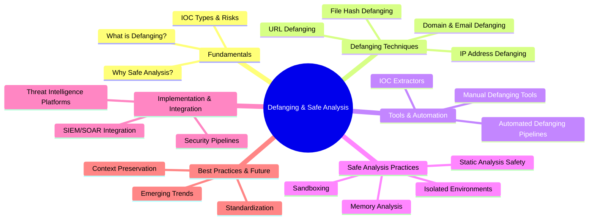
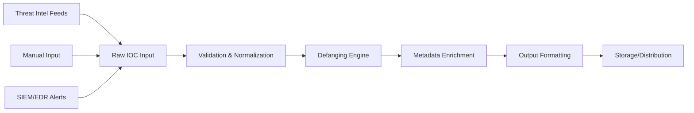
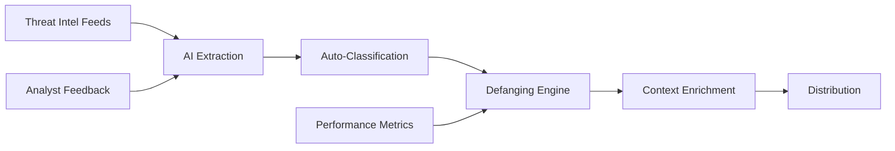
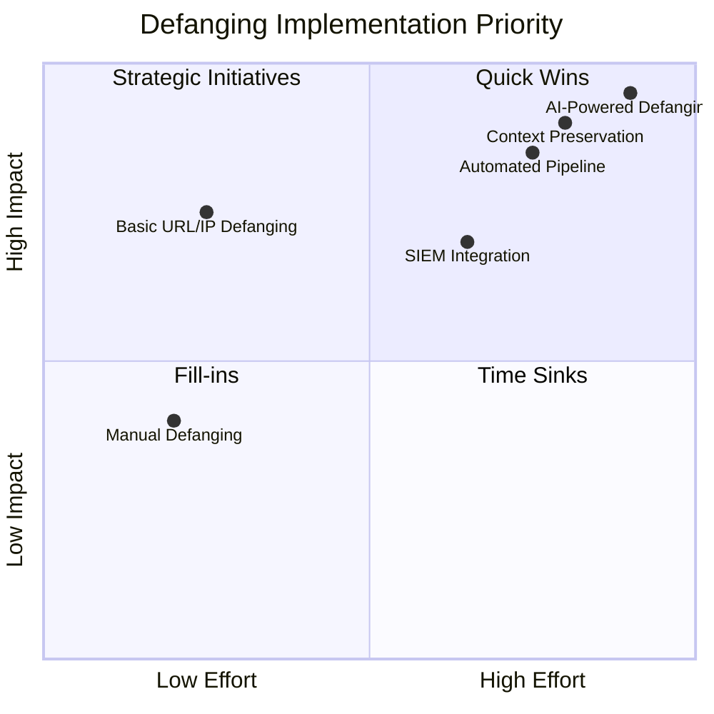

---
tags: [email-security]
---
# 🛡️ Full-Stack Lesson: Techniques for Defanging and Safe Analysis of Malicious Indicators


## TCM Exam Objectives
- Apply standard defanging techniques for URLs (hxxp://), IPs ([.]), domains ([.]), and emails ([@])
- Build automated IOC extraction and defanging pipelines using Python
- Understand the IETF draft standard for safe and reversible IOC sharing
- Set up isolated analysis environments using sandboxes and virtual machines
- Perform safe static analysis of malware samples without accidental execution
- Extract and deobfuscate IOCs from threat reports using regex and automated tools
- Implement defanging workflows in SIEM/SOAR platforms (Splunk, Cortex XSOAR, IBM Resilient)
- Integrate defanged IOC sharing with threat intelligence platforms (MISP, OpenCTI)
- Preserve IOC context including first-seen, confidence levels, and campaign attribution
- Apply refanging techniques to restore defanged IOCs for security tool consumption

# 🛡️ Full-Stack Lesson: Techniques for Defanging and Safe Analysis of Malicious Indicators

## 🎯 Lesson Overview
This lesson provides a comprehensive guide to **defanging** and **safe analysis** techniques for Indicators of Compromise (IOCs). You'll learn how to handle malicious URLs, IP addresses, domains, and files safely while preserving their analytical value. This is crucial for threat intelligence sharing, incident response, and malware analysis.



## 1. 📚 Fundamentals: Understanding IOCs and Defanging

### 1.1 What are Indicators of Compromise (IOCs)?
IOCs are digital evidence that indicates a system or network may have been breached or compromised 【turn0search21】. They include:
- **Network Indicators**: Malicious URLs, IP addresses, domain names
- **Host Indicators**: File hashes, suspicious file names, registry keys
- **Email Indicators**: Phishing email addresses, malicious attachments
- **Behavioral Indicators**: Unusual process execution, anomalous network traffic

### 1.2 What is Defanging?
📌 **Exam Tip:** Defanging is a core exam skill. Standard transformations: `http://` → `hxxp://`, `https://` → `hxxps://`, `.` → `[.]`, `@` → `[@]`. Always defang IOCs when sharing threat intelligence to prevent accidental clicks. The IETF draft standard recommends consistent, reversible transformations.

```mermaid
flowchart LR
    subgraph "IOC Defanging by Type"
        A1[URL] --> B1[hxxps://malicious[.]com/path]
        A2[IP] --> B2[192.168.1[.]100]
        A3[Domain] --> B3[malicious-domain[.]com]
        A4[Email] --> B4[attacker[@]malicious[.]com]
    end
    B1 --> C[Safe for Sharing]
    B2 --> C
    B3 --> C
    B4 --> C
```

**Defanging** is the process of modifying potentially malicious indicators to prevent accidental clicks or execution while preserving readability for analysis and sharing 【turn0search0】【turn0search5】. For example:
- `http://malicious.com` → `hxxp://malicious[.]com`
- `192.168.1.1` → `192.168.1[.]1`
- `attacker@email.com` → `attacker[@]email.com`

### 1.3 Why Safe Analysis is Critical
Safe analysis practices prevent:
- **Accidental activation**: Clicking malicious links during analysis
- **System compromise**: Running malware samples on production systems
- **Data exfiltration**: Malicious code communicating with C2 servers
- **Investigation contamination**: Altering evidence during analysis

## 2. 🔧 Defanging Techniques by IOC Type

### 2.1 URL Defanging Techniques

<details>
<summary>🔧 Detailed URL Defanging Methods</summary>

#### **Standard Defanging Methods:**
1. **Scheme Replacement**: Replace `http` and `https` with `hxxp` and `hxxps` 【turn0search5】
2. **Dot Bracketing**: Replace `.` with `[.]` in domains and IPs
3. **Colon Bracketing**: Replace `:` with `[:]` in URLs (optional)
4. **At Sign Bracketing**: Replace `@` with `[@]` in email addresses

**Example Transformations:**
```
Original: https://malicious-site.com/login
Defanged: hxxps://malicious-site[.]com/login

Original: http://192.168.1.100/admin
Defanged: hxxp://192.168.1[.]100/admin

Original: user@malicious-domain.com
Defanged: user[@]malicious-domain[.]com
```

#### **Advanced Defanging Considerations:**
- **Preserve Path Structure**: Only defang the domain/IP portion
- **Handle Special Characters**: Properly escape special characters in URLs
- **Encoding Preservation**: Maintain original encoding where necessary
- **Subdomain Handling**: Decide whether to defang all subdomain levels
</details>

### 2.2 IP Address Defanging

<details>
<summary>🌐 IP Defanging Techniques</summary>

#### **IPv4 Addresses:**
```
Original: 192.168.1.100
Defanged: 192.168.1[.]100
Alternative: 192.168.1(.)100
```

#### **IPv6 Addresses:**
```
Original: 2001:0db8:85a3:0000:0000:8a2e:0370:7334
Defanged: 2001:0db8:85a3:0000:0000:8a2e:0370:7334
Alternative: 2001:0db8:85a3:0000:0000:8a2e:0370:7334
```

#### **Special Considerations:**
- **Internal vs External**: Clearly distinguish internal IP ranges
- **CIDR Notation**: Preserve CIDR blocks when defanging (e.g., `192.168.1.0/24`)
- **IP Range Defanging**: Handle ranges like `192.168.1.1-192.168.1.100`
</details>

### 2.3 Domain and Email Defanging

<details>
<summary>📧 Domain and Email Address Defanging</summary>

#### **Domain Defanging:**
```
Original: malicious-domain.com
Defanged: malicious-domain[.]com
Alternative: malicious-domain(.)com
```

#### **Email Address Defanging:**
```
Original: attacker@malicious-domain.com
Defanged: attacker[@]malicious-domain[.]com
Alternative: attacker [at] malicious-domain [dot] com
```

#### **Special Domain Types:**
- **Internationalized Domain Names (IDNs)**: Handle punycode properly
- **Subdomain Defanging**: Decide on depth of defanging for subdomains
- **TLD Preservation**: Maintain top-level domain for analysis
</details>

### 2.4 File Hash Defanging

<details>
<summary>🔐 File Hash Handling</summary>

#### **Hash Types:**
- **MD5**: 32 characters
- **SHA1**: 40 characters
- **SHA256**: 64 characters

#### **Defanging Approach:**
File hashes don't require traditional defanging as they aren't clickable or executable. However, for consistency:
```
Original: 44d88612fea8a8f36de82e1278abb02f
Defanged: 44d88612fea8a8f36de82e1278abb02f
Alternative: 44d88612... (truncated for display)
```

#### **Best Practices:**
- **Preserve Full Hash**: Maintain complete hash for searching
- **Case Sensitivity**: Keep original case (MD5 is case-insensitive)
- **Format Consistency**: Use consistent formatting across datasets
</details>

## 3. 🛠️ Tools and Automation for Defanging

### 3.1 Manual Defanging Tools

| Tool | Type | Features | Best For |
|------|------|----------|----------|
| **URL Defanger** 【turn0search7】 | Web-based | Batch processing, multiple formats | Quick one-off defanging |
| **APIVoid Defanger** 【turn0search8】 | Web-based | Refang capability, API access | Integration with workflows |
| **InQuest IOC Extractor** 【turn0search11】 | Python Library | Regex-based extraction, deobfuscation | Automated pipelines |
| **Defang.me** 【turn0search21】 | Web-based | Simple interface, multiple IOC types | Basic defanging needs |

### 3.2 Automated Defanging Pipelines

<details>
<summary>⚙️ Building an Automated Defanging Pipeline</summary>

#### **Pipeline Architecture:**


#### **Sample Python Implementation:**
```python
import re
from typing import Dict, List

class IOCDefanger:
    """Comprehensive IOC defanging utility"""
    
    def __init__(self):
        self.defang_patterns = {
            'url': r'https?://',
            'ip': r'\b\d{1,3}\.\d{1,3}\.\d{1,3}\.\d{1,3}\b',
            'domain': r'\b[a-zA-Z0-9-]+\.[a-zA-Z]{2,}\b',
            'email': r'\b[A-Za-z0-9._%+-]+@[A-Za-z0-9.-]+\.[A-Z|a-z]{2,}\b'
        }
    
    def defang_url(self, url: str, aggressive: bool = False) -> str:
        """Defang URLs while preserving structure"""
        # Replace scheme
        defanged = url.replace('http://', 'hxxp://').replace('https://', 'hxxps://')
        
        # Replace dots in domain
        domain_match = re.search(r'(?:hxxps?://)([^/]+)', defanged)
        if domain_match:
            domain = domain_match.group(1)
            defanged_domain = domain.replace('.', '[.]')
            defanged = defanged.replace(domain, defanged_domain)
        
        if aggressive:
            # Replace all dots (use with caution)
            defanged = defanged.replace('.', '[.]')
        
        return defanged
    
    def defang_ip(self, ip: str) -> str:
        """Defang IP addresses"""
        return ip.replace('.', '[.]')
    
    def defang_domain(self, domain: str) -> str:
        """Defang domain names"""
        return domain.replace('.', '[.]')
    
    def defang_email(self, email: str) -> str:
        """Defang email addresses"""
        return email.replace('@', '[@]').replace('.', '[.]')
    
    def defang_ioc(self, ioc: str, ioc_type: str = None) -> str:
        """Auto-detect and defang IOC"""
        if not ioc_type:
            ioc_type = self.detect_ioc_type(ioc)
        
        if ioc_type == 'url':
            return self.defang_url(ioc)
        elif ioc_type == 'ip':
            return self.defang_ip(ioc)
        elif ioc_type == 'domain':
            return self.defang_domain(ioc)
        elif ioc_type == 'email':
            return self.defang_email(ioc)
        else:
            return ioc  # No defanging for unknown types
    
    def detect_ioc_type(self, ioc: str) -> str:
        """Auto-detect IOC type"""
        if re.match(r'https?://', ioc):
            return 'url'
        elif re.match(r'\d{1,3}\.\d{1,3}\.\d{1,3}\.\d{1,3}', ioc):
            return 'ip'
        elif '@' in ioc and '.' in ioc:
            return 'email'
        elif re.match(r'[a-zA-Z0-9-]+\.[a-zA-Z]{2,}', ioc):
            return 'domain'
        return 'unknown'

# Usage Example
defanger = IOCDefanger()
malicious_url = "https://malicious-site.com/login"
defanged_url = defanger.defang_ioc(malicious_url)
print(f"Original: {malicious_url}")
print(f"Defanged: {defanged_url}")
```
</details>

### 3.3 IOC Extraction Tools

<details>
<summary>🔍 IOC Extraction and Deobfuscation</summary>

#### **InQuest IOC Extractor** 【turn0search11】:
```python
from iocextract import extract_iocs

# Extract IOCs from text
text = "Malicious URL: hxxp://example[.]com/path"
iocs = extract_iocs(text)

for ioc in iocs:
    print(f"Type: {ioc['type']}, Value: {ioc['value']}")
```

#### **Capabilities:**
- **Regex-based extraction**: Identifies defanged IOCs in text
- **Deobfuscation**: Reverses common defanging techniques
- **Multiple IOC types**: URLs, IPs, domains, emails, hashes
- **Batch processing**: Handles large datasets efficiently

#### **Integration Example:**
```python
# Pipeline integration
def process_threat_report(report_text):
    # Extract IOCs
    iocs = extract_iocs(report_text)
    
    # Defang for sharing
    defanged_iocs = []
    for ioc in iocs:
        defanger = IOCDefanger()
        defanged = defanger.defang_ioc(ioc['value'], ioc['type'])
        defanged_iocs.append({
            'original': ioc['value'],
            'defanged': defanged,
            'type': ioc['type']
        })
    
    return defanged_iocs
```
</details>

## 4. 🧪 Safe Analysis Practices

### 4.1 Isolated Analysis Environments

<details>
<summary>🖥️ Setting Up Safe Analysis Environments</summary>

#### **Sandboxing Approaches:**
1. **Dedicated Sandbox VMs**:
   - Isolated network (no internet or restricted internet)
   - Snapshot capabilities for easy reset
   - Separate from production network

2. **Cloud-Based Sandboxes**:
   - Services like Cuckoo Sandbox, Joe Sandbox
   - Isolated cloud environments
   - Automated analysis reports

3. **Local Analysis Machines**:
   - Physical or virtual machines
   - Network monitoring (Wireshark, tcpdump)
   - System monitoring (Process Monitor, etc.)

#### **Environment Configuration:**
```bash
# Example: Setting up a Cuckoo Sandbox
# 1. Install Cuckoo
git clone https://github.com/cuckoosandbox/cuckoo.git
cd cuckoo
pip install -r requirements.txt

# 2. Configure virtualization
# (VirtualBox, VMware, KVM)

# 3. Set up network routing
# (Isolated network with internet routing)

# 4. Configure analysis packages
# (Windows, Linux, Android analysis)
```

#### **Key Considerations:**
- **Network Isolation**: Prevent C2 communication
- **Time Synchronization**: Accurate timestamps for analysis
- **Resource Monitoring**: CPU, memory, disk usage tracking
- **Result Storage**: Secure storage of analysis artifacts
</details>

### 4.2 Memory Analysis Techniques

<details>
<summary>🧠 Safe Memory Analysis</summary>

#### **Memory Acquisition:**
- **Live System**: Use tools like WinPmem, LiME
- **Virtual Machines**: Snapshot memory state
- **Cloud Instances**: Provider-specific memory dumps

#### **Analysis Tools:**
- **Volatility**: Memory forensics framework
- **Rekall**: Memory analysis framework
- **MemProcFS**: Memory process file system

#### **Safe Analysis Workflow:**
1. **Acquire Memory**: Dump memory from suspect system
2. **Transfer Safely**: Move to analysis environment
3. **Analyze Offline**: No network connection
4. **Extract Artifacts**: Processes, network connections, files
5. **Defang IOCs**: Defang any extracted indicators
6. **Document Findings**: Record all analysis steps
</details>

### 4.3 Static Analysis Safety

<details>
<summary>🔍 Safe Static Analysis Practices</summary>

#### **File Handling:**
1. **Hash Verification**: Verify file integrity before analysis
2. **Isolated Storage**: Store samples in isolated location
3. **Access Control**: Limit access to malware samples
4. **Retention Policy**: Define how long to keep samples

#### **Analysis Tools:**
- **PEview**: Portable Executable analysis
- **Dependency Walker**: DLL dependency analysis
- **Strings**: Extract readable strings
- **Hex Editors**: Binary analysis

#### **Safe Analysis Steps:**
```bash
# Example: Safe static analysis workflow
1. Calculate hashes: 
   sha256sum malware_sample.exe > sample_hash.txt

2. Verify hash against known databases:
   # Check VirusTotal, MalwareBazaar, etc.

3. Extract strings safely:
   strings malware_sample.exe | grep -i "http"

4. Analyze with PEview:
   # Examine PE headers, imports, exports

5. Defang any extracted IOCs:
   # URLs, domains, IPs found in strings
```
</details>

## 5. 🔄 Implementation in Security Pipelines

### 5.1 Integrating with SIEM/SOAR

<details>
<summary>⚙️ SIEM/SOAR Integration</summary>

#### **Splunk Integration:**
```spl
# Splunk search to defang IOCs in alerts
index=security_incidents
| eval defanged_url=replace(url, "https?://", "hxxp://")
| eval defanged_url=replace(defanged_url, "\.", "[.]")
| table _time, url, defanged_url, severity
```

#### **IBM Resilient Integration:**
```python
# Example: Defanging in IBM Resilient workflow
def defang_ioc(ioc_value, ioc_type):
    """Defang IOC in IBM Resilient"""
    if ioc_type == 'url':
        return ioc_value.replace('http', 'hxxp').replace('.', '[.]')
    elif ioc_type == 'ip':
        return ioc_value.replace('.', '[.]')
    elif ioc_type == 'domain':
        return ioc_value.replace('.', '[.]')
    elif ioc_type == 'email':
        return ioc_value.replace('@', '[@]').replace('.', '[.]')
    return ioc_value

# In workflow:
# 1. Extract IOCs from incident
# 2. Defang each IOC
# 3. Update incident with defanged versions
# 4. Share defanged IOCs with external parties
```

#### **Cortex XSOAR Integration:**
```python
# Cortex XSOAR automation script
def defang_iocs(args):
    # Get IOCs from incident
    iocs = demisto.incidents()[0].get('CustomFields', {}).get('iocs', [])
    
    # Defang each IOC
    defanged_iocs = []
    for ioc in iocs:
        defanged = defang_ioc(ioc['value'], ioc['type'])
        defanged_iocs.append({
            'original': ioc['value'],
            'defanged': defanged,
            'type': ioc['type']
        })
    
    # Update incident
    demisto.results({
        'Type': entryTypes['note'],
        'Contents': defanged_iocs,
        'ContentsFormat': formats['json']
    })
```
</details>

### 5.2 Threat Intelligence Platform Integration

<details>
<summary>🧠 Threat Intelligence Platform Integration</summary>

#### **MISP Integration:**
```python
# MISP module for defanging
from pymisp import MISPEvent

def defang_misp_event(event):
    """Defang IOCs in MISP event"""
    for attribute in event.attributes:
        if attribute.type == 'url':
            attribute.value = defang_url(attribute.value)
        elif attribute.type == 'ip-dst':
            attribute.value = defang_ip(attribute.value)
        elif attribute.type == 'domain':
            attribute.value = defang_domain(attribute.value)
        elif attribute.type == 'email-src':
            attribute.value = defang_email(attribute.value)
    
    return event

# Usage:
# misp_event = defang_misp_event(misp_event)
# misp.add_event(misp_event)
```

#### **OpenCTI Integration:**
```python
# OpenCTI integration for defanging
from opencti import OpenCTIClient

def defang_opencti_observable(observable):
    """Defang observables in OpenCTI"""
    if observable['type'] == 'URL':
        observable['value'] = defang_url(observable['value'])
    elif observable['type'] == 'IPv4-Addr':
        observable['value'] = defang_ip(observable['value'])
    elif observable['type'] == 'Domain-Name':
        observable['value'] = defang_domain(observable['value'])
    
    return observable
```
</details>

## 6. 📊 Best Practices and Standards

### 6.1 Defanging Standards

<details>
<summary>📋 Standardization Guidelines</summary>

#### **IETF Draft Standard** 【turn0search5】:
The IETF draft "A Standard for Safe and Reversible Sharing of Malicious URLs and Indicators" recommends:
1. **Consistent Transformations**: Replace `http` with `hxxp`, `https` with `hxxps`
2. **Dot Bracketing**: Use `[.]` for dots in domains and IPs
3. **Reversible Process**: Ensure refanging is possible
4. **Clear Documentation**: Document defanging methods used

#### **Industry Best Practices:**
1. **Preserve Context**: Keep enough information for analysis
2. **Use Standard Formats**: Stick to widely recognized defanging methods
3. **Automate Consistently**: Use scripts/tools for consistent defanging
4. **Document Process**: Record what defanging was applied
5. **Test Refanging**: Ensure IOCs can be restored when needed

#### **Defanging Checklist:**
- [ ] URLs: `http` → `hxxp`, `https` → `hxxps`, dots → `[.]`
- [ ] IPs: dots → `[.]`
- [ ] Domains: dots → `[.]`
- [ ] Emails: `@` → `[@]`, dots → `[.]`
- [ ] File hashes: Preserve as-is (not clickable)
- [ ] Context: Preserve metadata and relationships
- [ ] Documentation: Record defanging methods used
</details>

### 6.2 Context Preservation

<details>
<summary>🧩 Preserving IOC Context</summary>

#### **Context Elements to Preserve:**
1. **First Seen/Last Seen**: When IOC was first/last observed
2. **Confidence Level**: How confident you are in the IOC
3. **Source**: Where the IOC came from
4. **Campaign/Actor**: Associated threat actor or campaign
5. **Malware Family**: Associated malware (if known)
6. **TTPs**: Associated tactics, techniques, procedures

#### **Context Preservation Format:**
```json
{
  "ioc": {
    "value": "hxxps://malicious[.]com/path",
    "original_value": "https://malicious.com/path",
    "type": "url",
    "defanged": true,
    "defanging_method": "IETF Standard"
  },
  "context": {
    "first_seen": "2026-06-29T10:00:00Z",
    "last_seen": "2026-06-29T10:05:00Z",
    "confidence": "high",
    "source": "incident-12345",
    "campaign": "Operation Nightshade",
    "malware_family": "Emotet",
    "ttps": ["T1566.001", "T1059.001"]
  }
}
```
</details>

## 7. 🚀 Future Trends and Emerging Techniques

### 7.1 Automation and AI-Driven Defanging

<details>
<summary>🤖 Future of Automated Defanging</summary>

#### **AI-Powered Defanging:**
- **Machine Learning**: Auto-detect IOC types and optimal defanging
- **Natural Language Processing**: Extract IOCs from threat reports
- **Pattern Recognition**: Identify emerging defanging needs
- **Automated Refanging**: Smart restoration of defanged IOCs

#### **Pipeline Automation:**


#### **Emerging Capabilities:**
- **Behavioral Defanging**: Based on IOC behavior patterns
- **Context-Aware Defanging**: Different defanging for different contexts
- **Predictive Defanging**: Anticipate defanging needs based on trends
- **Cross-Platform Standardization**: Universal defanging formats
</details>

### 7.2 Enhanced Safe Analysis Techniques

<details>
<summary>🛡️ Next-Generation Safe Analysis</summary>

#### **Container-Based Analysis:**
- **Docker Containers**: Isolated analysis environments
- **Kubernetes Pods**: Scalable analysis infrastructure
- **Container Forensics**: Analysis of containerized malware

#### **Cloud-Native Analysis:**
- **Serverless Sandboxes**: Pay-per-use analysis
- **Cloud Memory Analysis**: Memory forensics in cloud
- **Distributed Analysis**: Parallel processing of samples

#### **Advanced Memory Forensics:**
- **Real-time Analysis**: Live memory analysis
- **Hypervisor-Level Analysis**: Analysis at hypervisor layer
- **Cross-VM Analysis**: Analysis across multiple VMs
</details>

## 8. 📈 Implementation Roadmap

### 8.1 Phase 1: Foundation (Weeks 1-4)

<details>
<summary>🎯 Getting Started</summary>

#### **Week 1: Assess Current State**
- [ ] Audit current IOC handling practices
- [ ] Identify defanging needs and gaps
- [ ] Document existing tools and workflows
- [ ] Define defanging standards for organization

#### **Week 2: Tool Selection**
- [ ] Evaluate defanging tools (Table 3.1)
- [ ] Select IOC extraction tools
- [ ] Set up initial defanging scripts
- [ ] Test tools with sample IOCs

#### **Week 3: Process Development**
- [ ] Develop defanging workflows
- [ ] Create context preservation templates
- [ ] Define refanging procedures
- [ ] Document best practices

#### **Week 4: Initial Implementation**
- [ ] Deploy defanging tools
- [ ] Train analysts on new processes
- [ ] Integrate with existing tools
- [ ] Establish monitoring and feedback loop
</details>

### 8.2 Phase 2: Integration (Weeks 5-8)

<details>
<summary>🔧 Integration Phase</summary>

#### **Weeks 5-6: SIEM/SOAR Integration**
- [ ] Integrate defanging with SIEM alerts
- [ ] Develop SOAR playbooks for defanging
- [ ] Automate defanging in incident response
- [ ] Test integration with real incidents

#### **Weeks 7-8: Threat Intelligence Integration**
- [ ] Integrate with threat intelligence platforms
- [ ] Set up automated IOC sharing pipelines
- [ ] Implement context enrichment
- [ ] Establish feedback mechanisms
</details>

### 8.3 Phase 3: Optimization (Weeks 9-12)

<details>
<summary>🚀 Optimization Phase</summary>

#### **Weeks 9-10: Automation Enhancement**
- [ ] Implement AI-powered defanging
- [ ] Develop advanced extraction techniques
- [ ] Optimize performance and scalability
- [ ] Enhance context preservation

#### **Weeks 11-12: Continuous Improvement**
- [ ] Establish metrics and KPIs
- [ ] Implement continuous monitoring
- [ ] Develop advanced analytics
- [ ] Plan for future enhancements
</details>

## 9. 🎓 Conclusion and Strategic Recommendations

### 9.1 Key Takeaways

1. **Defanging is Essential**: Prevents accidental activation while preserving analytical value
2. **Standardization is Critical**: Consistent defanging enables reliable threat intelligence sharing
3. **Context Preservation**: Maintain metadata and relationships for effective analysis
4. **Automation is Key**: Manual defanging doesn't scale; build automated pipelines
5. **Safe Analysis Requires Isolation**: Never analyze malware on production systems
6. **Integration is Vital**: Embed defanging in existing security workflows and tools
7. **Continuous Improvement**: Threat landscape evolves; defanging techniques must evolve too

### 9.2 Strategic Recommendations

1. **Adopt Standard Defanging**: Implement IETF draft standard for consistency 【turn0search5】
2. **Build Automated Pipelines**: Don't rely on manual defanging
3. **Preserve Context**: Always maintain metadata and relationships
4. **Integrate Everywhere**: Defanging should be part of all IOC handling
5. **Train Analysts**: Ensure all team members understand defanging and safe analysis
6. **Monitor and Adapt**: Track effectiveness and adapt to new threats
7. **Share Knowledge**: Contribute to community standards and best practices

### 9.3 Implementation Priority



### 9.4 Future Outlook

The future of defanging and safe analysis will be characterized by:
- **Increased Automation**: AI-driven defanging and analysis
- **Better Standardization**: Industry-wide adoption of standards
- **Enhanced Context**: Richer metadata and relationships
- **Improved Integration**: Seamless integration across security stack
- **Behavioral Focus**: Moving beyond static indicators to behavioral patterns

> 💡 **Final Insight**: Effective defanging and safe analysis are not just technical processes—they are cultural practices that should be embedded in every aspect of threat intelligence and incident response. By implementing the techniques and best practices outlined in this lesson, organizations can significantly improve their security posture while enabling safe collaboration and information sharing across the cybersecurity community.

---

**📚 Additional Resources**:
- [IETF Draft: Safe IOC Sharing Standard](https://www.ietf.org/archive/id/draft-grimminck-safe-ioc-sharing-00.html) 【turn0search5】
- [InQuest IOC Extractor](https://github.com/InQuest/iocextract) 【turn0search11】
- [Palo Alto Networks IOC Guide](https://www.paloaltonetworks.com/cyberpedia/indicators-of-compromise-iocs) 【turn0search1】
- [Splunk IOC Detection](https://www.splunk.com/en_us/blog/learn/ioc-indicators-of-compromise.html) 【turn0search3】

*This lesson provides a comprehensive foundation for defanging and safe analysis of malicious indicators. For specific implementation guidance, consult with cybersecurity professionals and refer to vendor documentation for your particular security stack.*