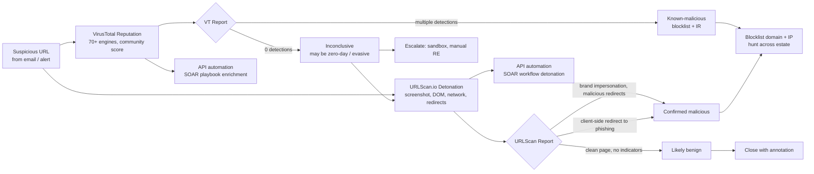
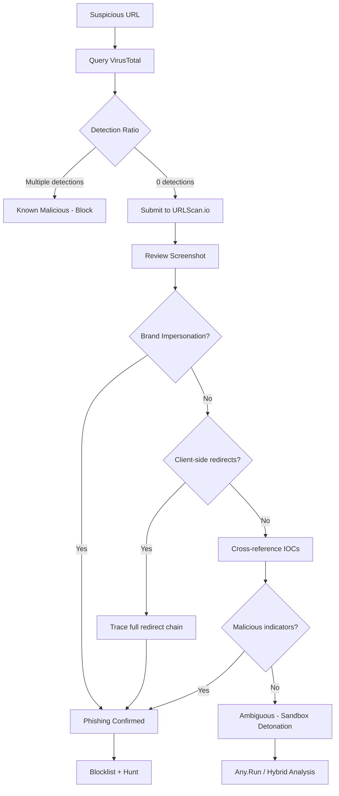
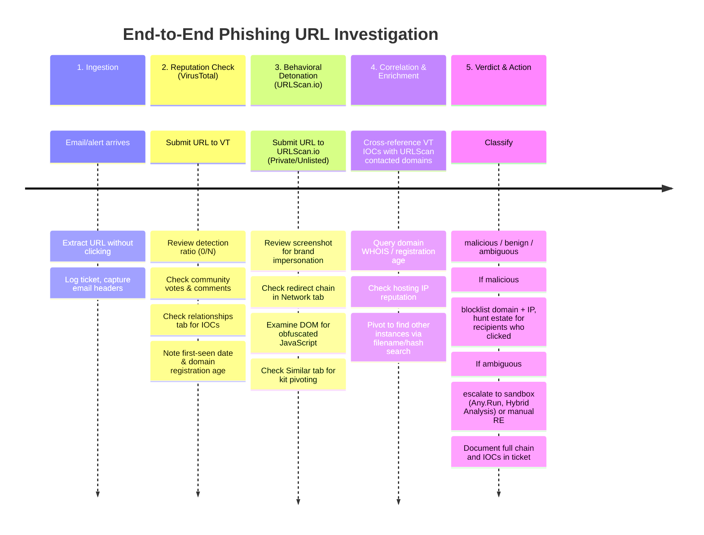

# Using URL Reputation Tools (VirusTotal, URLScan.io)

## TCM Exam Objectives
- Use VirusTotal for aggregated URL reputation across 70+ antivirus engines
- Deploy URLScan.io for behavioral URL detonation with screenshot and DOM analysis
- Understand the complementary relationship between reputation checks and behavioral analysis
- Interpret VirusTotal URL reports: detection ratio, community votes, relationships, domain/IP tabs
- Analyze URLScan.io reports: task, page, lists, data sections with brand impersonation detection
- Detect client-side redirects and JavaScript-based evasion using URLScan.io
- Apply SOAR automation for URL analysis using VirusTotal and URLScan.io APIs
- Understand OPSEC risks: public submissions visible to adversaries
- Identify the limitations of each tool: false negatives from cloaking and newly registered domains
- Execute the end-to-end phishing URL investigation workflow from ingestion to verdict

URL reputation tools are SOC services that evaluate suspicious URLs against aggregated threat intelligence — **VirusTotal** aggregates 70+ antivirus engines and URL scanners into a crowdsourced reputation verdict, while **URLScan.io** executes the URL in a controlled browser to capture the rendered page, DOM content, network requests, and screenshots that reveal what the page actually *does* when visited.【turn0search15】【turn0search5】 The two tools are complementary, not interchangeable: VirusTotal tells you what the security community *thinks* of the URL, URLScan.io shows you what the URL *does* — and mature phishing investigation uses both in sequence because each catches what the other misses.【turn1search17】【turn3fetch0】

## The URL Investigation Pipeline

A suspicious URL moves through layered analysis — reputation check first (fast, scalable, catches known-bad), then behavioral detonation (slower, catches zero-days and client-side redirects), then enrichment and verdict.【turn1search17】【turn2search7】

📌 **Exam Tip:** A critical exam concept: VirusTotal returns **reputation** (what the community thinks), URLScan.io returns **behavior** (what the page does). They are complementary, not interchangeable. Always use URLScan.io even when VirusTotal shows 0 detections — newly registered phishing domains haven't been scanned yet. Never treat 0/92 as proof of safety.

The dotted feedback: VirusTotal returning 0 detections does *not* mean the URL is safe — attackers manipulate results, and newly-registered phishing domains often haven't been scanned by any engine yet. This is why the ambiguous branch always escalates to URLScan.io detonation.【turn3fetch0】【turn1search10】

## Master Comparison: VirusTotal vs URLScan.io

| Dimension | VirusTotal | URLScan.io |
|---|---|---|
| **Primary function** | Aggregated reputation across 70+ AV/URL scanners【turn0search15】 | Behavioral URL detonation in controlled browser【turn0search5】 |
| **What it answers** | "Does the security community flag this URL?" | "What does this URL do when visited?" |
| **Data source** | Crowdsourced detections from AV engines, web scanners, user contributions【turn0search15】【turn1search9】 | Live browser execution capturing DOM, screenshots, network requests【turn0search5】 |
| **Detects client-side redirects** | No — relies on scanner verdicts, not execution | Yes — executes JavaScript, captures meta refresh and JS redirects |
| **Screenshot capability** | Limited (premium) | Yes — full page screenshot for every scan【turn0search5】 |
| **Brand impersonation detection** | Via community tags and detections | Tracks 900+ brands, auto-flags phishing pages【turn0search5】 |
| **Search/hunting** | Advanced search filters over historical URL/domain/file dataset【turn1search9】 | Powerful search across all public scans, pivot by filename/hash/brand【turn3fetch1】 |
| **API** | REST API v3, JSON, SOAR integrations (XSOAR, Splunk, Chronicle)【turn1search1】【turn1search0】 | REST API, submit scan + retrieve result/DOM【turn1search5】【turn1search6】 |
| **OPSEC risk** | Public submissions visible; adversaries monitor for their URLs being scanned | Public scans visible on frontpage/search unless set to Unlisted/Private【turn1search13】【turn1search15】 |
| **False negative risk** | High — newly registered domains, evasive malware, clean scans via manipulation【turn3fetch0】 | Lower for active threats — executes the page, catches redirects |
| **Cost** | Free for non-commercial; premium for commercial/automation | Free tier; commercial for heavy use |
| **Best for** | Known-bad reputation, IOC enrichment, bulk lookups | Zero-day URLs, client-side redirects, phishing kit pivoting, visual confirmation |

Sources: 【turn0search5】【turn0search15】【turn1search1】【turn1search5】【turn1search9】【turn1search13】【turn3fetch0】【turn3fetch1】

---

## Module 1 — VirusTotal: Reputation Aggregation

VirusTotal is a Google-owned service that aggregates results from 70+ antivirus engines, website scanners, and file/URL analysis tools to provide a crowdsourced threat verdict on files, URLs, domains, and IP addresses.【turn0search1】【turn0search15】 It acts purely as an aggregator — it doesn't promote any single engine but offers objective, unbiased results covering heuristic engines, known-bad signatures, metadata extraction, and behavioral analysis.【turn0search15】 The platform stores submitted artifacts along with extensive related information (file properties, URL components, domains, paths, query parameters) in what it calls the VirusTotal dataset.【turn1search9】

### How to Use VirusTotal for URL Analysis

1. Go to virustotal.com and select the **URL** tab【turn0search1】
2. Paste the suspicious URL and click Search
3. If the URL has been scanned before, you get an immediate report; if not, you can submit it for fresh scanning
4. Review the report across its key sections【turn0search0】

### Interpreting the VirusTotal URL Report

The report structure includes several key elements:【turn0search0】【turn0search17】

**Detection summary** — The total number of VirusTotal partners who consider the URL harmful, out of the total partners who reviewed it (e.g., "0/92" means 0 detections out of 92 engines scanned). This is the headline number analysts check first, but it is *not* sufficient on its own — a 0/92 result can still be malicious.【turn3fetch0】

**Community votes** — Users can vote a URL as malicious (❌) or harmless (✅). A negative community score indicates users believe the URL is malicious, contributing crowdsourced signal beyond the AV engines.【turn0search17】【turn2search0】 Community votes matter because they capture human judgment that signature-based engines miss.

**Community comments** — Analyst-contributed notes providing context on what the URL does, what campaign it's part of, and IOCs observed. These are especially valuable for emerging threats.

**Relationships and additional context tabs** — VirusTotal's richer v3 data exposes IoC relationships, sandbox dynamic analysis information, static file information, and crowdsourced detection details.【turn1search1】 The Relationships tab shows communicating files, embedded URLs, redirected domains, and related artifacts — enabling pivot-based investigation.

**Domain/IP reputation tabs** — The URL report links to the underlying domain and IP reports, which provide registration age, WHOIS data, hosting provider reputation, subdomains, and historical resolution data.

### VirusTotal API v3 for Automation

The API v3 follows REST principles with predictable, resource-oriented URLs and JSON responses, exposing far richer data than v2: IoC relationships, sandbox dynamic analysis, static file information, YARA Livehunt & Retrohunt management, and crowdsourced detection details.【turn1search1】 Key endpoints:

- Submit a URL for scanning
- Get a URL report by ID (the SHA256 of the URL)
- Get domain and IP reports
- Advanced search with filters over the historical dataset【turn1search9】

The API integrates with major SOAR platforms — Cortex XSOAR has a dedicated VirusTotal v3 integration pack that analyzes hashes, URLs, domains, and IPs with configurable malicious-detection thresholds and reliability ratings.【turn1search0】【turn1search3】 Google SecOps (Chronicle) also offers native VirusTotal integration for automated enrichment.【turn1search2】 The free API has rate limits (4 requests/minute, 500/day), while premium tiers support high-volume automation.【turn1search3】

### VirusTotal for Threat Hunting

VirusTotal Intelligence provides advanced faceted search over the historical URL collection — you can query by URL string, path, query parameters, favicon, meta tags, ad trackers, tags, and reputation scores.【turn1search9】【turn3search7】 Example queries: find URLs detected by 5+ scanners submitted after a specific date, or find all URLs hosted on a specific IP. This makes VirusTotal a threat-hunting platform, not just a lookup tool — analysts can proactively search for infrastructure matching campaign patterns.

---

## Module 2 — URLScan.io: Behavioral Detonation

URLScan.io is a free website scanner that submits a URL to an automated browser process which browses to the URL like a regular user and records all activity the page navigation creates.【turn0search5】【turn3search0】 This includes the domains and IPs contacted, resources (JavaScript, CSS) requested, and additional information about the page itself. URLScan.io takes a screenshot of the page, records the DOM content, JavaScript global variables, cookies created by the page, and a myriad of other observations.【turn0search5】 If the site targets one of the 900+ brands tracked by urlscan.io, it is highlighted as potentially malicious in the scan results.【turn0search5】

### What Makes URLScan.io Different

The critical distinction: URLScan.io *executes* the URL, which means it catches threats that reputation-based tools structurally miss — client-side JavaScript redirects, meta refresh redirects, dynamically-loaded phishing content, and brand impersonation that only renders after the page loads.【turn3fetch0】 The Maveris Labs analysis documented exactly this case: a phishing URL returned 0 detections on VirusTotal, but downloading the HTML with `wget` revealed obfuscated JavaScript that, after a 1035ms delay, redirected the browser to a different malicious domain — a redirect that VirusTotal never followed but URLScan.io would have captured in its DOM and network request logs.【turn3fetch0】

### Interpreting the URLScan.io Result

The Result API returns a JSON object with the following top-level keys, which mirror what's visible in the web report:【turn1search5】

**`task`** — Information about the submission: time, method, options, links to screenshot and DOM. This is the metadata of the scan itself.

**`page`** — High-level information about the rendered page: geolocation, IP, PTR record, server details, and the final URL after any redirects.

**`lists`** — Aggregated lists of domains, IPs, URLs, ASNs, servers, and hashes contacted during the page load. This is where you see the full redirect chain and all third-party resources the page pulled in.

**`data`** — All the detailed data points: every HTTP request with headers, response codes, and content; JavaScript global variables; cookies created; DOM content; and the screenshot.

The web report presents this data in tabs: **Summary** (verdict, brand detection, page metadata), **DOM** (rendered HTML), **Network** (all HTTP requests), **Screenshot** (visual capture), **Behavior** (JavaScript execution), and **Similar** (structurally similar sites).【turn3fetch1】

### Key Forensic Features for Phishing

**Brand impersonation detection** — URLScan.io tracks 900+ brands and automatically flags pages that impersonate them, making it immediately clear when a page is spoofing Microsoft, Google, Amazon, or any other major brand.【turn0search5】 The Natural Phishing URL Detection system identifies daily detected attacks and associates them with 480+ brands, with full metadata including targeted brand, industry vertical, country of origin, and hosting IP/ASN.【turn2search2】

**Redirect chain capture** — Because URLScan.io follows JavaScript and meta refresh redirects (not just HTTP 3xx), it captures the full path from initial URL to final landing page — which is critical for analyzing attacks that chain through legitimate domains via open redirects before landing on the phishing payload.

**Screenshot as ground truth** — The screenshot provides visual confirmation of what the user would actually see, which no reputation score can match. A page may have 0 detections on VirusTotal but the screenshot immediately reveals a fake Microsoft 365 login page.【turn3fetch1】

### URLScan.io for Threat Hunting

URLScan.io's search functionality is one of its most powerful features for threat hunting. Because of its generous free tier, many people use it, creating a wealth of historical scan data to search through.【turn3fetch1】 Key hunting techniques:

**Find domains containing a brand name** — `page.domain:(/.*brandName.*/ AND NOT brand.com AND NOT brand.org)` returns phishing sites impersonating a specific brand.【turn3fetch1】

**Find sites hotlinking legitimate assets** — `domain:brand.com AND NOT page.domain:brand.com` returns sites that load assets from the real brand's domain (common in phishing kits that pull the real logo) but aren't hosted on the brand's domain.【turn3fetch1】

**Pivot by filename** — Search for sites loading identical files as a known phishing kit: `filename:"saba9m.JPG"` — because phishing kits are deployed repeatedly, the same filenames appear across many instances.【turn3fetch1】

**Pivot on response hash** — When filenames are generic, pivot on the hash of HTTP responses to find sites serving identical content.【turn3fetch1】

**Structural similarity** — URLScan.io's built-in "Similar" tab identifies structurally similar websites, which often reveals other instances of the same phishing kit with a single click.【turn3fetch1】

### URLScan.io API

The API supports submitting URLs for scanning (`POST /scan`), retrieving scan results (`GET /result/{id}`), fetching the DOM (`GET /dom/{id}`), and searching historical scans.【turn1search6】 It integrates with SOAR platforms — Torq, Tines, and n8n all have URLScan.io workflow templates that automate URL detonation and result aggregation for phishing analysis.【turn0search6】【turn2search8】【turn2search7】

---

## Module 3 — Combined Workflow: End-to-End Phishing URL Investigation

The mature SOC workflow uses both tools in sequence, with each tool's output informing whether to escalate to the next layer.【turn1search17】【turn2search7】

### Step-by-Step Walkthrough

**Step 1: Extract and isolate the URL.** Copy the URL from the email without clicking it. If embedded behind a shortened link, unshorten it first using preview features or `curl -L`.【turn2search8】

**Step 2: Query VirusTotal.** Paste the URL into VirusTotal's URL tab. Review: (a) detection ratio, (b) community votes, (c) first-seen date, (d) relationships/communicating files, (e) the underlying domain and IP reports.【turn0search0】【turn1search9】 If multiple engines flag it, you have a confirmed-malicious verdict and can skip to blocking.

**Step 3: Submit to URLScan.io.** Even if VirusTotal returns 0 detections, submit to URLScan.io — this is where the 0-detection-but-still-malicious case gets caught. Set visibility to **Private** or **Unlisted** for OPSEC (see Module 5).【turn1search13】【turn1search15】

**Step 4: Analyze the URLScan.io result.** Review: (a) screenshot for brand impersonation, (b) Network tab for redirect chains, (c) DOM for obfuscated JavaScript or hidden iframes, (d) lists of contacted domains/IPs, (e) Similar tab for phishing kit pivoting.【turn3fetch1】【turn1search5】

**Step 5: Cross-reference IOCs.** Take the domains, IPs, and hashes from URLScan.io's `lists` and query them back against VirusTotal for additional reputation context. This bidirectional enrichment catches infrastructure that one tool sees but the other doesn't.

**Step 6: Hunt for campaign scope.** Use URLScan.io's search to find other instances of the same phishing kit — pivot by filename, response hash, or brand. Use VirusTotal Intelligence to find other URLs hosted on the same IP or registered by the same actor.【turn1search9】【turn3fetch1】

**Step 7: Verdict and action.** Classify as malicious (blocklist, hunt, IR), benign (close with annotation), or ambiguous (escalate to sandbox detonation with Any.Run or Hybrid Analysis for dynamic behavioral analysis). Document the full chain, IOCs, and tool outputs in the ticket for future reference and detection engineering.【turn1search17】

---

## Module 4 — SOAR Automation

Both tools are designed for API-driven automation, and production SOC environments integrate them into SOAR playbooks rather than relying on manual web submissions.【turn1search0】【turn2search7】

**VirusTotal in SOAR** — Cortex XSOAR's VirusTotal v3 integration pack analyzes hashes, URLs, domains, and IPs with configurable malicious-detection thresholds (minimum positive results before flagging as malicious) and source reliability ratings.【turn1search0】【turn1search3】 Google SecOps (Chronicle) offers native integration for automated enrichment within Google's SIEM/SOAR ecosystem.【turn1search2】 A typical alert-enrichment playbook: extract URL → query VT API → attach detection ratio and community verdict to the ticket → auto-route based on outcome (known-malicious → high priority, unknown → analyst queue).【turn1search3】

**URLScan.io in SOAR** — Torq's URLScan URL Enrichment workflow template receives a URL, analyzes it with URLScan, and provides a summary with malicious/phishing verdict, score, and screenshot details.【turn2search8】 Tines and n8n have similar templates that automate the detonation step.【turn0search6】【turn2search7】 Box's security team runs both Tines and URLScan.io in production for URL analysis and phishing automation, demonstrating the production-readiness of this integration pattern.【turn0search6】

**The dual-scanner automation pattern** — The Growwstacks phishing analysis workflow runs both URLScan.io and VirusTotal in parallel on extracted URLs, aggregating results with threat scoring for a unified verdict — combining reputation (VT) and behavior (URLScan) at machine speed.【turn2search7】

---

## Module 5 — OPSEC and Limitations

### OPSEC: Public Visibility Risk

Both tools have a critical OPSEC consideration: **public submissions are visible to the community, including adversaries.** A Reddit analysis of URL scanners noted that when your SOC analyst or automated SOAR playbook scans a URL on URLScan.io, the scan shows up publicly within minutes — and attackers actively monitor these platforms to detect when their phishing infrastructure has been discovered.【turn0search10】

**URLScan.io visibility levels:**【turn1search13】【turn1search15】
- **Public** — visible on the frontpage and in public search results (default for free tier)
- **Unlisted** — not visible publicly, but visible to vetted security researchers and security companies in urlscan Pro. Use this when submitting malicious websites that might contain PII or non-public information.
- **Private** — only visible to you, deleted after a retention period. Use this for sensitive investigations.

**The URLScan.io data leak problem** — Positive Security documented that sensitive URLs (shared documents, password reset pages, team invites, payment invoices) are publicly listed and searchable on URLScan.io, often leaked by misconfigured SOAR tools that accidentally made their scans public.【turn1search16】 Tinder's security team found indexed sensitive links that could grant access to corporate systems — file-sharing services, ticketing systems, and SSO portals.【turn1search14】 For any URL containing tokens, session IDs, or internal references, always use Private visibility.

**VirusTotal OPSEC** — Submitting files (not just hashes) to VirusTotal exposes their content to all participating engines and the public dataset. For URL submissions, the URL itself becomes searchable. Adversaries monitor VirusTotal to detect when their malware or phishing URLs have been submitted — if a sample appears before expected, they may rotate infrastructure or accelerate the attack.

### Limitations: What These Tools Miss

**VirusTotal false negatives** — The Maveris Labs analysis is the canonical reference: a phishing URL returned 0 detections across 70+ engines, but manual investigation revealed obfuscated JavaScript that redirected to a malicious domain after a 1035ms delay.【turn3fetch0】 Attackers manipulate VirusTotal results through: (a) newly registered domains that no engine has scanned yet, (b) evasion techniques that serve benign content to scanner IPs (cloaking), (c) client-side redirects that signature engines don't follow, and (d) time-delayed payloads that activate after the scan window.【turn1search10】 VirusTotal is a tool that aids analysis — it should not be a "one-stop-shop" for determining if content is malicious.【turn3fetch0】

**VirusTotal false positives** — Because VirusTotal aggregates 70+ engines, the chance of false positives is significant — a single overly-aggressive heuristic engine can flag a legitimate URL, and engines sometimes disagree.【turn2search3】【turn2search4】 A 1/92 detection is often a false positive, while a 40/92 detection is clearly malicious. Analysts must weigh the *number* and *identity* of flagging engines, not just the presence of any detection.

**URLScan.io limitations** — The scan captures a single point-in-time snapshot; if the phishing page uses cloaking (serving different content based on visitor IP, user-agent, or timing), URLScan.io's scan may see a benign page while real victims see the phishing form. JavaScript-heavy sites may not fully render within the scan timeout. And the scan itself notifies the target server that it's being analyzed (the URLScan.io user-agent and IP are identifiable), which can trigger cloaking behavior.【turn1search12】

### Best Practices

- **Use both tools** — reputation (VT) and behavior (URLScan) are complementary; neither is sufficient alone【turn2search7】
- **Set URLScan.io to Private or Unlisted** for any sensitive investigation【turn1search13】【turn1search15】
- **Never treat 0 detections as proof of safety** — always detonate in URLScan.io for behavioral confirmation【turn3fetch0】
- **Weight engine identity, not just count** — a detection from Microsoft, Kaspersky, or ESET carries more weight than one from an obscure engine【turn2search3】
- **Check first-seen date and domain registration age** — newly registered domains with detections are higher-confidence malicious than old domains with detections
- **Pivot beyond the single URL** — use URLScan.io's search and VirusTotal Intelligence to find campaign scope【turn1search9】【turn3fetch1】
- **Document the full chain** — every IOC, redirect hop, and tool output belongs in the ticket for detection engineering and future correlation【turn1search17】
- **Automate via SOAR** — manual web submission doesn't scale; integrate both APIs into enrichment playbooks【turn1search0】【turn2search8】
- **Escalate ambiguous cases** — if both tools are inconclusive but context is suspicious, escalate to sandbox detonation (Any.Run, Hybrid Analysis) or manual reverse engineering【turn1search17】

---

## Recap

VirusTotal and URLScan.io are complementary URL reputation tools that together form the backbone of phishing URL investigation: VirusTotal aggregates 70+ antivirus engines and web scanners into a crowdsourced reputation verdict with community votes, comments, and rich relationship data accessible via REST API v3 and integrations with Cortex XSOAR, Google SecOps, and Splunk SOAR.【turn0search15】【turn1search1】【turn1search0】 URLScan.io executes the URL in a controlled browser, capturing the rendered screenshot, DOM content, full network request log, redirect chain (including client-side JavaScript and meta refresh redirects), and brand impersonation detection across 900+ tracked brands — catching threats that reputation-based scanning structurally misses, especially newly-registered domains and evasive phishing pages that return 0 detections on VirusTotal.【turn0search5】【turn3fetch0】 The combined workflow runs reputation check (VT) and behavioral detonation (URLScan.io) in sequence, cross-referencing IOCs between the two, pivoting via URLScan.io's powerful search (by filename, response hash, brand, or structural similarity) to find campaign scope, and escalating ambiguous cases to sandbox detonation.【turn1search17】【turn3fetch1】【turn2search7】 Critical OPSEC considerations apply to both: public submissions are visible to adversaries who monitor these platforms, so sensitive investigations must use URLScan.io's Private/Unlisted visibility and avoid uploading sensitive files to VirusTotal — and misconfigured SOAR tools have historically leaked sensitive URLs (password reset pages, SSO portals, shared documents) into URLScan.io's public search index.【turn0search10】【turn1search13】【turn1search16】 The throughline: no single tool provides a complete verdict — VirusTotal tells you what the community thinks, URLScan.io shows you what the page does, and the mature SOC layers both with SOAR automation, OPSEC discipline, and escalation to deeper analysis when reputation and behavior disagree.