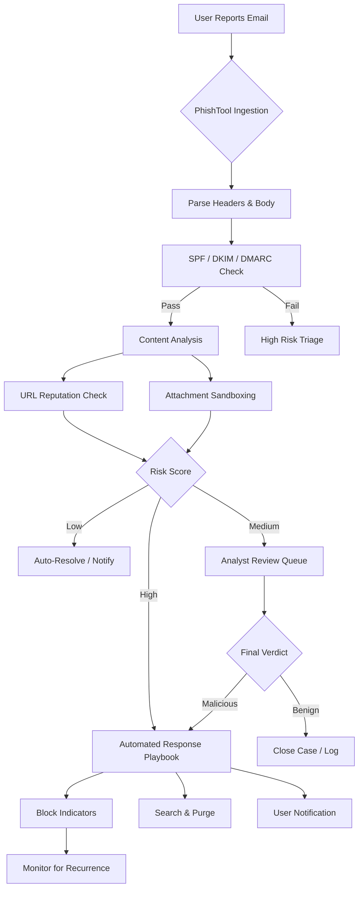
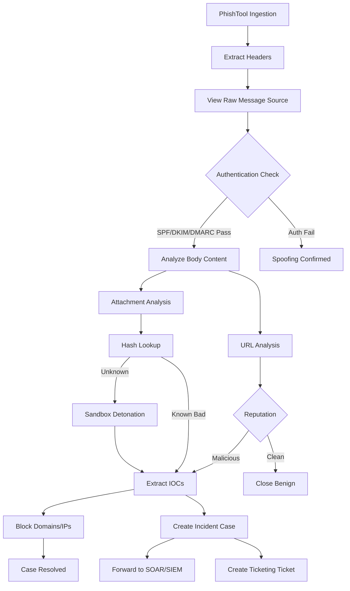

# Leveraging PhishTool for Automated Triage

## TCM Exam Objectives

Before taking the PSAA exam, you must be able to:

- Identify indicators of a phishing email in email headers, body, and attachments
- Configure email analysis tools (Thunderbird, PhishTool) for forensic examination
- Implement and tune DMARC, SPF, and DKIM authentication to block spoofed email
- Execute phishing simulation campaigns to measure organizational risk
- Apply reactive defense measures: block domains, URLs, and sender addresses
- Perform email search and purge procedures for incident response
- Deliver user notification and remediation following a confirmed phishing incident
- Analyze email authentication results to determine spoofing vs. legitimate mail

## ?? Lesson Overview
This comprehensive lesson will guide you through implementing PhishTool for automated phishing email triage, from foundational concepts to advanced integration. You'll learn how to transform manual, time-consuming phishing response workflows into an efficient, automated system that enhances security operations.

  

## ?? Learning Objectives
By the end of this lesson, you will be able to:
- Understand PhishTool's architecture and role in automated triage
- Configure PhishTool for multi-tenant environments
- Implement automated ingestion and analysis workflows
- Integrate PhishTool with existing security infrastructure
- Design and deploy automated response playbooks
- Measure and optimize triage effectiveness

## ?? Lesson Roadmap


## 1. ??? Foundations: Understanding PhishTool

### 1.1 What is PhishTool?
PhishTool is a **forensic phishing email analysis platform** designed to help security teams triage, dissect, and resolve reported phishing emails efficiently and at scale ?turn0search6?. Unlike basic email security gateways that focus on detection, PhishTool operates as the **investigation layer** that activates when detection fails or users report suspicious emails ?turn0search19?.

> ?? **Key Distinction**: PhishTool doesn't replace your email security gateway (SEG) or spam filter. It picks up where they leave off�after a user reports something suspicious�providing a purpose-built workspace for security teams to investigate and respond ?turn0search6?.

### 1.2 Core Capabilities for Automated Triage
PhishTool offers several features specifically designed for automation:

| Feature | Automation Capability | Benefit |
|---------|----------------------|---------|
| **Multi-tenant Design** | Automatic ingestion from multiple clients in parallel ?turn0search0? | Enables MSSPs to manage multiple clients efficiently |
| **API Access** | Automate case creation, enrichment, and status sync ?turn0search0? | Enables integration with existing security ecosystems |
| **Automated Resolution Rules** | Auto-resolve low-risk cases with custom logic ?turn0search0? | Reduces analyst fatigue and speeds up inbox cleanup |
| **White-Label Reporter Feedback** | Automated user notifications with custom branding ?turn0search0? | Improves user experience and demonstrates service value |
| **Outbound Alerts & Ticketing** | Push cases to SOAR/SIEM/ticketing systems ?turn0search0? | Enables unified response across systems |

### 1.3 PhishTool in the Security Stack
PhishTool fits into your security architecture as follows:


## 2. ?? Architecture: System Design for Automation

### 2.1 Multi-Tenant Architecture
PhishTool Enterprise is **multi-tenant by design**, automatically ingesting reported emails from every client in parallel while maintaining strict data separation ?turn0search0?. This architecture is crucial for MSSPs and large enterprises managing multiple departments or subsidiaries.

<details>
<summary>?? Technical Implementation Details</summary>

The multi-tenant implementation includes:
- **Client Isolation**: Each client's data, investigations, and history remain siloed
- **Context Switching**: Analysts can switch between client contexts without risk
- **Ingestion Mapping**: Each ingestion path is tracked and mapped to the correct client
- **Permission Management**: Role-based access control (RBAC) ensures analysts only see authorized client data
- **Audit Trails**: Complete activity logging per client for compliance and billing

</details>

### 2.2 Ingestion Sources & Automation
PhishTool supports multiple ingestion methods that can be automated:

| Ingestion Source | Automation Method | Best For |
|------------------|-------------------|----------|
| **Mailbox Integrations** | Connect to existing phish report mailboxes (Google Workspace, Microsoft 365) ?turn0search7? | Organizations with existing reporting infrastructure |
| **Phish Report Buttons (PRBs)** | Deploy Outlook add-in for end-user reporting ?turn0search7? | Direct user engagement and simplified reporting |
| **API Submissions** | Custom integrations via API key ?turn0search7? | Automated systems and custom workflows |
| **Mailflow Rules** | Automated routing from email servers | High-volume environments |

### 2.3 Security & Compliance Architecture
PhishTool's infrastructure is designed with security at its core:

- **Hosting**: Exclusively in AWS Dublin (eu-west-1) with multi-AZ deployment ?turn0search8?
- **Encryption**: AES-256 at rest, TLS 1.2/1.3 in transit ?turn0search8?
- **Access Controls**: Hardware token MFA (YubiKey) for administrative access ?turn0search8?
- **Data Protection**: Hourly, daily, and weekly backups with tested restoration ?turn0search8?
- **Compliance Roadmap**: Targeting Cyber Essentials Plus, SOC 2 Type II, and ISO 27001 ?turn0search8?

## 3. ?? Implementation: Setup & Configuration

### 3.1 Initial Setup Process


#### Step 1: Tenant Provisioning
1. **Choose Edition**: Select Enterprise for multi-tenant capabilities or Professional for single-user ?turn0search6?
2. **Configure SSO**: Set up SAML 2.0 for enterprise authentication ?turn0search0?
3. **Define Roles**: Create analyst, administrator, and reporter roles as needed

#### Step 2: Ingestion Source Configuration
<details>
<summary>?? Mailbox Integration Setup</summary>

1. **Navigate to In-tray Sources** in PhishTool admin console
2. **Select Mailbox Integration** and provide:
   - Mailbox address (e.g., `phish@company.com`)
   - Authentication credentials (read-only access required)
3. **Test Connection** to verify proper access
4. **Set Source Name** for identification (e.g., "Corporate Mailbox")
5. **Enable** the source to begin ingestion

</details>

<details>
<summary>?? Phish Report Button Deployment</summary>

1. **Download PRB Package** from PhishTool console
2. **Deploy via Group Policy** or Microsoft Endpoint Manager
3. **Configure Settings**:
   - Report destination (PhishTool tenant ID)
   - Custom branding (logos, colors)
   - Success/error messages
4. **Test Deployment** with pilot group
5. **Monitor Adoption** through PhishTool analytics

</details>

### 3.2 Automation Rule Configuration

#### Automated Resolution Rules
Create rules to automatically handle low-risk cases:

```python
IF email_type == "newsletter" 
   AND sender_domain == "trusted-partner.com"
   AND no_malicious_attachments
   AND no_suspicious_links
THEN auto_resolve(category="Low Risk Newsletter", 
                  notify_reporter=True, 
                  close_case=True)
```

<details>
<summary>?? Advanced Rule Configuration</summary>

1. **Access Rules Engine** in PhishTool settings
2. **Create New Rule** with conditions:
   - Sender patterns (email addresses, domains)
   - Email content patterns (subjects, body text)
   - Attachment types and hashes
   - URL reputations and categories
   - Header anomalies
3. **Define Actions**:
   - Auto-resolve with category
   - Send custom reporter feedback
   - Trigger webhooks
   - Create alerts in external systems
4. **Set Rule Priority** and order
5. **Enable Rule** and monitor effectiveness

</details>

## 4. ?? Automation: Building Triage Workflows

### 4.1 Automated Analysis Pipeline
PhishTool's automated analysis pipeline works as follows:


### 4.2 Integration with SOAR/SIEM Platforms
PhishTool integrates with your existing security stack through:

- **API Access**: Automate case creation, enrichment, and status sync ?turn0search0?
- **Webhooks**: Push real-time alerts to SOAR platforms
- **Pre-built Connectors**: Available for Jira, ServiceNow, Splunk SOAR ?turn0search0?
- **Custom Integrations**: Via Mindflow for AI agent automation ?turn0search13?

<details>
<summary>?? Sample SOAR Integration Code</summary>

```python
import requests
import json

PHISHTOOL_API_KEY = "your_api_key"
PHISHTOOL_TENANT = "your_tenant"
SOAR_WEBHOOK_URL = "https://your-soar.com/api/webhook"

def get_phishtool_cases():
    """Fetch new cases from PhishTool"""
    headers = {
        "Authorization": f"Bearer {PHISHTOOL_API_KEY}",
        "Content-Type": "application/json"
    }
    response = requests.get(
        f"https://api.phishtool.com/v1/{PHISHTOOL_TENANT}/cases",
        headers=headers
    )
    return response.json()

def transform_for_soar(case):
    """Transform PhishTool case to SOAR format"""
    return {
        "case_id": case["id"],
        "subject": case["email_subject"],
        "sender": case["email_from"],
        "recipients": case["email_to"],
        "risk_score": case["risk_score"],
        "indicators": case["iocs"],
        "timestamp": case["created_at"]
    }

def send_to_soar(transformed_case):
    """Send case to SOAR platform"""
    headers = {"Content-Type": "application/json"}
    response = requests.post(
        SOAR_WEBHOOK_URL,
        json=transformed_case,
        headers=headers
    )
    return response.status_code == 200

cases = get_phishtool_cases()
for case in cases:
    if case["status"] == "new" and case["risk_score"] > 70:
        transformed = transform_for_soar(case)
        success = send_to_soar(transformed)
        if success:
            # Update case status in PhishTool
            update_case_status(case["id"], "forwarded_to_soar")
```

</details>

### 4.3 AI-Powered Automation with Mindflow
For advanced automation, PhishTool integrates with Mindflow to create AI agents that can:

- **Autonomously analyze** phishing emails using advanced AI reasoning ?turn0search13?
- **Extract and categorize** suspicious URLs from emails ?turn0search13?
- **Compile detailed reports** on detected phishing attempts ?turn0search13?
- **Trigger response actions** based on analysis

<details>
<summary>?? Mindflow AI Agent Configuration</summary>

```

1. **Access Mindflow Platform** and create new agent
2. **Select PhishTool Integration** from the catalog
3. **Configure Agent Parameters**:
   - Analysis depth (headers, links, attachments, metadata)
   - Risk threshold for auto-actions
   - Notification preferences
   - Integration with other security tools
4. **Define Trigger Conditions**:
   - New case with high risk score
   - Specific IOC patterns detected
   - Repeated similar emails (campaign detection)
5. **Set Response Actions**:
   - Create ticket in ITSM system
   - Send alert to Slack/Teams
   - Trigger isolation playbook
   - Update case in PhishTool
6. **Deploy Agent** and monitor performance

</details>

?? **Exam Tip:** Correlate across multiple data sources. A suspicious IP address in network traffic is stronger evidence when confirmed by Windows Event Log ID 4625 (failed logon) or EDR process telemetry.


## 5. ?? Integration: Connecting Your Stack

### 5.1 Integration Architecture Overview


### 5.2 Common Integration Patterns

#### Pattern 1: PhishTool + SOAR + SIEM
- **PhishTool** performs initial analysis and triage
- **SOAR** orchestrates response based on PhishTool verdicts
- **SIEM** correlates phishing events with other security alerts
- **Ticketing System** tracks investigation and resolution

#### Pattern 2: PhishTool + Threat Intelligence
- **PhishTool** extracts IOCs from emails
- **Threat Intelligence Platforms** (MISP, OpenPhish) enrich IOCs ?turn0search1??turn0search16?
- **PhishTool** updates case with threat intelligence context
- **Automated rules** trigger based on threat intelligence

#### Pattern 3: Multi-Tenant MSSP Deployment
- **Centralized PhishTool** manages multiple clients
- **Client-specific rules** and automation workflows
- **White-labeled notifications** to each client's users
- **Unified reporting** across all clients with client-specific views

## 6. ?? Optimization: Metrics & Continuous Improvement

### 6.1 Key Performance Indicators (KPIs)

| Metric | Target | Measurement Method |
|--------|--------|-------------------|
| **Mean Time to Triage (MTTT)** | < 5 minutes | Time from ingestion to initial analysis |
| **Automation Rate** | > 70% | Percentage of cases auto-resolved |
| **False Positive Rate** | < 5% | Incorrectly auto-resolved cases |
| **Analyst Satisfaction** | > 4.5/5 | Regular analyst surveys |
| **Detection Rate** | > 95% | Malicious emails correctly identified |

### 6.2 Continuous Improvement Process


<details>
<summary>?? Sample Analytics Dashboard</summary>

**PhishTool Automation Effectiveness Dashboard**

| Metric | Current | Target | Trend |
|--------|---------|--------|-------|
| Total Cases (30 days) | 1,247 | - | +12% |
| Auto-Resolved Cases | 873 (70%) | >70% | ? |
| Analyst-Assigned Cases | 374 (30%) | <30% | ? |
| Mean Time to Triage | 4.2 min | <5 min | ? |
| False Positives | 43 (3.4%) | <5% | ? |
| High-Risk Cases Detected | 89 | - | +8% |
| SOAR Integrations | 156 | - | +22% |

**Top Automation Rules Triggered:**
1. Newsletter auto-resolution (412 cases)
2. Internal email false positive (287 cases)
3. Known spam sender (174 cases)
4. Low-risk attachment (89 cases)
5. Trusted domain link (71 cases)

</details>

## 7. ??? Security Considerations & Best Practices

### 7.1 Secure Configuration Checklist
- ? **Enable MFA** for all administrative accounts ?turn0search8?
- ? **Use API keys** with least privilege permissions
- ? **Regularly rotate** API keys and credentials
- ? **Implement IP whitelisting** for API access
- ? **Encrypt all communications** with TLS 1.2+ ?turn0search8?
- ? **Audit access logs** regularly for anomalies
- ? **Backup configuration** and automation rules
- ? **Test disaster recovery** procedures quarterly

### 7.2 Privacy & Compliance
- **Data Minimization**: Only collect necessary email data for analysis
- **Retention Policies**: Define appropriate data retention periods
- **User Privacy**: Anonymize reporter information when possible
- **Regulatory Compliance**: Ensure compliance with GDPR, CCPA, and other regulations
- **Cross-Border Considerations**: Be aware of data residency requirements

## 8. ?? Hands-On Exercises

### Exercise 1: Basic Automation Rule Creation
**Objective**: Create an auto-resolution rule for newsletters

1. Log into PhishTool console
2. Navigate to Automation Rules
3. Create new rule with conditions:
   - Subject contains "newsletter" or "update"
   - Sender domain is in trusted list
   - No attachments or only PDF attachments
   - Links point to reputable domains
4. Set action: Auto-resolve as "Low-Risk Newsletter"
5. Test with sample email

### Exercise 2: SOAR Integration Development
**Objective**: Develop basic integration with a SOAR platform

1. Obtain API credentials from PhishTool
2. Choose a SOAR platform (e.g., Splunk SOAR, IBM Resilient)
3. Develop integration script to:
   - Fetch high-risk cases from PhishTool
   - Transform data to SOAR format
   - Create incident in SOAR
   - Update case status in PhishTool
4. Test with sample cases
5. Deploy to production

### Exercise 3: Multi-Tenant Configuration
**Objective**: Configure PhishTool for multiple clients

1. Set up two test tenants in PhishTool
2. Configure different ingestion sources for each
3. Create client-specific automation rules
4. Set up white-labeled notifications
5. Test with sample emails from different clients

## 9. ?? Assessment & Knowledge Check

### Knowledge Check Questions

1. **What is the primary difference between PhishTool and traditional email security gateways?**
   - A) PhishTool detects more threats
   - B) PhishTool focuses on investigation after detection fails
   - C) PhishTool replaces the need for user training
   - D) PhishTool is less expensive

   **Answer**: B) PhishTool focuses on investigation after detection fails ?turn0search6??turn0search19?

2. **Which PhishTool feature is essential for MSSPs managing multiple clients?**
   - A) Community edition
   - B) Multi-tenant design
   - C) Outlook add-in
   - D) Free API access

   **Answer**: B) Multi-tenant design ?turn0search0?

3. **What is the recommended first step in implementing PhishTool automation?**
   - A) Configure complex SOAR integrations
   - B) Start with basic auto-resolution rules
   - C) Deploy to all users immediately
   - D) Disable all manual triage

   **Answer**: B) Start with basic auto-resolution rules

4. **How does PhishTool ensure data separation in multi-tenant environments?**
   - A) Using different physical servers
   - B) Logical separation with strict access controls
   - C) Manual data partitioning
   - D) Encryption only

   **Answer**: B) Logical separation with strict access controls ?turn0search0?

5. **What is a key benefit of automated reporter feedback?**
   - A) Reduces analyst workload
   - B) Improves user security awareness
   - C) Demonstrates service value to clients
   - D) All of the above

   **Answer**: D) All of the above ?turn0search0?

## 10. ?? Advanced Topics & Future Directions

### 10.1 AI-Enhanced Phishing Analysis
PhishTool is incorporating AI capabilities for:
- **Pattern recognition** in phishing campaigns
- **Predictive analysis** of emerging threats
- **Natural language processing** for email content analysis
- **Automated threat intelligence** generation

### 10.2 Extended Detection and Response (XDR) Integration
Future integration with XDR platforms will enable:
- **Correlation** of phishing events with endpoint, network, and cloud telemetry
- **Unified incident response** across all security layers
- **Automated containment** based on phishing verdicts

### 10.3 Threat Intelligence Sharing
PhishTool is enhancing capabilities for:
- **Automated IOC sharing** with threat intelligence communities
- **Collaborative analysis** of phishing campaigns
- **Real-time indicator sharing** with trusted partners

## ?? Additional Resources

- **PhishTool Documentation**: [https://docs.phishtool.com](https://docs.phishtool.com) ?turn0search5??turn0search7?
- **PhishTool Community**: Join the user community for best practices and discussions
- **PhishTool Blog**: Regular updates on new features and threat intelligence
- **Training Resources**: PhishTool offers training for analysts and administrators

## ?? Conclusion

Leveraging PhishTool for automated triage transforms phishing response from a manual, time-consuming process to an efficient, scalable operation. By implementing the strategies and techniques in this lesson, you can:

- **Reduce analyst workload** by 70% or more through automation
- **Improve response times** from hours to minutes
- **Enhance accuracy** with consistent, rule-based triage
- **Demonstrate value** through detailed reporting and metrics
- **Scale efficiently** to handle growing email volumes

The key to success is starting with basic automation and gradually expanding to more complex integrations. Regularly review and tune your automation rules based on performance metrics, and always maintain human oversight for high-risk cases.

> ?? **Final Note**: While automation significantly improves efficiency, it doesn't replace the need for skilled analysts. The most effective approach combines automated triage for routine cases with human expertise for complex, high-risk investigations.

---
