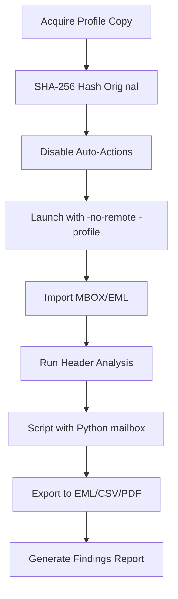

# Thunderbird and Email Client Configuration for Analysis

## TCM Exam Objectives

Before taking the PSAA exam, you must be able to:

- Identify indicators of a phishing email in email headers, body, and attachments
- Configure email analysis tools (Thunderbird, PhishTool) for forensic examination
- Implement and tune DMARC, SPF, and DKIM authentication to block spoofed email
- Execute phishing simulation campaigns to measure organizational risk
- Apply reactive defense measures: block domains, URLs, and sender addresses
- Perform email search and purge procedures for incident response
- Deliver user notification and remediation following a confirmed phishing incident
- Analyze email authentication results to determine spoofing vs. legitimate mail

Thunderbird is the analyst's email client of choice because it stores messages locally in **open, well-documented formats** (mbox, MSF, SQLite), supports every major mail protocol, and exposes a profile structure that can be parsed, indexed, and scripted without proprietary lock-in. Where Outlook hides evidence inside binary PST/OST blobs, Thunderbird lays everything out as plain text, SQL, and JSON � making it ideal for forensic, eDiscovery, and bulk-analysis workflows.?turn0search1??turn0search5?

The full analysis "stack" spans four layers � protocol, storage, format, and tooling � each of which you must understand to configure the client for non-destructive, reproducible analysis.


---

## 1. The Protocol Layer � What You're Really Configuring

Before touching Thunderbird, understand what each protocol does at the wire level, because the protocol choice determines what artifacts you'll have locally for analysis.?turn0search4?

| Protocol | Default Port | Secure Variant | Direction | Forensic/Analytical Implication |
|---|---|---|---|---|
| **POP3** | 110 | 995 (POP3S) / 110+STARTTLS | Inbound | Downloads then optionally deletes from server; full message body stored locally in `Mail/` � best for offline evidence |
| **IMAP** | 143 | 993 (IMAPS) / 143+STARTTLS | Inbound | Server-authoritative; local `ImapMail/` is a *cache*; deleted server-side messages disappear on next sync |
| **SMTP** | 25 / 587 | 465 (SMTPS) / 587+STARTTLS | Outbound | Only sent-mail copy retained if "Place a copy in Sent folder" is on; check `Sent` mbox for delivery traces |
| **EWS / OWA** | 443 | TLS | Inbound (Exchange) | Requires add-on (Owl for Exchange) or TB 115+ native EWS; cached via IMAP-style ImapMail |
| **LDAP** | 389 | 636 (LDAPS) | Directory | Address auto-complete lookups; queries logged on LDAP server |

**SSL/TLS vs STARTTLS** is a common confusion point: ports 993/995/465 use **implicit TLS** (the connection is encrypted from byte one), while 143/110/587 use **STARTTLS** (plain text until the client issues `STARTTLS` to upgrade). For analysis, implicit TLS is preferable because no credentials traverse the wire in the clear during the handshake.?turn1search10??turn1search12??turn1search13?

### Manual Account Configuration Walkthrough

Auto-configuration (ISPDB) is great for end users but masks the settings an analyst needs to verify. Always use **Manual Setup** (Account Settings ? Add Mail Account ? Manual configuration):

1. **Incoming server**: choose IMAP or POP3 depending on whether you want server-authoritative caching or full local copies.
2. **Hostname / Port**: e.g., `imap.example.com:993`, `pop.example.com:995`, `smtp.example.com:465`.
3. **Connection security**: `SSL/TLS` for implicit-TLS ports, `STARTTLS` for upgrade ports. `None` should only be used in a controlled lab with a packet capture running.
4. **Authentication method**: `Normal password` (cleartext over TLS), `Encrypted password` (CRAM-MD5/NTLM), or `OAuth2` (Gmail/M365). For Gmail/M365 you must use OAuth2 � app passwords are being deprecated.
5. **Username**: full email address for most providers.

### Analysis-Oriented Preference Overrides

Default Thunderbird behavior destroys evidence. Set these before connecting to a subject account:

| Setting | Path | Recommended Value | Why |
|---|---|---|---|
| Mark messages as read on display | Preferences ? Privacy ? Reading | **Off** | Read state flips the `Read` bit in `X-Mozilla-Status`, altering the artifact |
| Allow immediate server deletion on POP | Account Settings ? Server Settings ? "Leave messages on server" | **On** (POP3) | Prevents evidence loss from source mailbox |
| Offline folders / Sync | Account Settings ? Synchronization & Storage | **Enable** "Keep messages for this account on this computer" | Forces full body download for IMAP |
| Compact folders automatically | Preferences ? Advanced ? Network & Disk Space | **Off** | Compaction purges "deleted" messages from mbox � destroys recoverable evidence |
| Global indexer (Gloda) | Preferences ? Advanced ? General ? "Enable Global Search" | Off during acquisition, On during analysis | Gloda is a secondary source of truth; disable during imaging to avoid writes |
| Junk mail filtering | Account Settings ? Junk Settings | **Off** | Auto-deletes suspect messages before you see them |
| Search & indexing on disk | `mail.indexer.enabled=false` in Config Editor | `false` during acquisition | Stops `global-messages-db.sqlite` writes |

---

## 2. The Profile & Storage Layer � Where the Evidence Lives

Thunderbird separates the **program binary** from **user data** in a *profile folder*. This is the single most important concept for analysts: the profile *is* the evidence container.?turn0search5?

### Default Profile Locations

| OS | Path |
|---|---|
| Windows | `C:\Users\<user>\AppData\Roaming\Thunderbird\Profiles\<random>.default-release\` (shortcut: `%APPDATA%\Thunderbird\Profiles\`) |
| macOS | `~/Library/Thunderbird/Profiles/<random>.default-release/` |
| Linux | `~/.thunderbird/<random>.default-release/` |

To locate the active profile without launching the client, read `profiles.ini` in the parent `Thunderbird/` directory � it lists every profile and which is `Default=1`.?turn3fetch1?

### Profile Anatomy � File-by-File


| File / Folder | Purpose | Analytical Value |
|---|---|---|
| `Mail/` | POP3 downloads and "Local Folders" | Primary evidence � full message bodies in mbox |
| `ImapMail/<server>/` | IMAP folder cache | Secondary evidence � only what client fetched; may be incomplete |
| `Inbox`, `Sent`, etc. (no extension) | mbox files (mboxrd format) | Concatenated RFC822 messages, the gold-standard artifact?turn6search2? |
| `Inbox.msf` etc. | Mail Summary File � Berkeley DB index of folder | Cached metadata (flags, offsets); not authoritative � rebuilds from mbox?turn1search2? |
| `global-messages-db.sqlite` | "Gloda" global index � full-text + metadata | Powerful for recovery: contains message bodies even after mbox compaction in some cases?turn6search8??turn6search7? |
| `prefs.js` | JavaScript preference file; account/identity/server config | Reveals every configured account, server hostnames, ports, auth methods � the "confession" file?turn0search1? |
| `key4.db` + `logins.json` | Encrypted credential store (NSS) | Account passwords � decryptable with master-password cracker or NSS libraries |
| `abook.mab`, `history.mab` | Address books (MAPI-style binary) | Contacts and auto-complete history � social-graph analysis |
| `panacea.dat` | Folder-location cache | Rebuildable; safe to delete if corrupt?turn2search1? |
| `cache2/` | HTTP-style attachment/body cache | Orphaned attachment fragments |

### MBOX Format Internals

MBOX is deceptively simple: a single text file where each message begins with a line in the form `From sender@host Fri Jan  1 12:00:00 2025` (the "From_" line), followed by RFC822 headers, a blank line, the body, and a blank line before the next From_ line. The **mboxrd** variant (used by Thunderbird) escapes any body line starting with `From ` as `>From ` to avoid ambiguity.?turn2search3??turn2search6?

Thunderbird adds two proprietary headers inside each message that are forensic gold:

| Header | Purpose |
|---|---|
| `X-Mozilla-Status` | 16-bit hex flag word � Read, Replied, Marked, Forwarded, **Deleted (0x0008)**, etc.?turn6search2? |
| `X-Mozilla-Status2` | Extended flag word � attachment flag, MDN sent, etc. |
| `X-Mozilla-Keys` | User tag/label keywords |

**Deleted-email recovery**: when a user "deletes" a message, Thunderbird does *not* remove it from the mbox � it only sets bit `0x0008` in `X-Mozilla-Status`. The message persists until **compaction**. To undelete, flip `0x0008` back off (e.g., change `0009` ? `0001`). This works on a working copy of the mbox with a hex editor or `sed`.?turn6search0??turn6search2?

---

## 3. The Format Layer � Import/Export Conversions

Analysis rarely starts in Thunderbird � you'll receive evidence as PST, EML, MBOX, or OST. Thunderbird's open formats make conversion straightforward.


### PST ? MBOX with `readpst` (libpst)

`readpst` from the `libpst` package converts Outlook PST/OST to mbox without needing Outlook installed.?turn1search5??turn1search8?

```bash
sudo apt install libpst-dev pst-utils     # Debian/Ubuntu
brew install libpst                        # macOS

mkdir -p output && readpst -r -M -o output source.pst
readpst -r -M -u -t e -o output source.pst
```

The resulting tree mirrors the PST folder hierarchy, each containing an `mbox` file directly importable into Thunderbird's Local Folders via ImportExportTools NG.?turn6search14??turn1search4?

### ImportExportTools NG

The de facto add-on for analysis-grade import/export. Install via Add-ons Manager ? search "ImportExportTools NG" ? Add, then restart.?turn0search10??turn0search14?

Key operations (right-click a folder ? ImportExportTools NG):

| Function | Use Case |
|---|---|
| **Export folder** ? MBOX | Backup; preserve original format |
| **Export all messages** ? EML | One file per message � best for programmatic processing |
| **Export all messages** ? HTML + index | Court-ready browsable archive |
| **Export all messages** ? PDF | Edit-resistant evidence package?turn3fetch0? |
| **Export all messages** ? CSV (with custom fields) | Pivot tables, timelines, sender analysis |
| **Import MBOX file** | Load PST-converted mbox, Google Takeout, FOIA productions |
| **Import all EML** | Reconstruct folder from loose EMLs |
| **Export profile / backup** | Full profile snapshot |

**Pitfall**: older versions of ImportExportTools NG leaked `X-Mozilla-Status` headers into exported EMLs, marking them inauthentic as original records. Verify the add-on version (=14.1.14) and use the option to strip Mozilla-internal headers before producing evidence.?turn6search4?
---



## 4. Header Analysis � The Core Analytical Workflow

Email authentication and routing live in the headers. Thunderbird exposes raw headers via **View ? Message Source** (Ctrl+U) or the "More ? View Source" menu on a selected message.?turn3fetch0?

### The Header Checklist

| Field | What to Verify | Spoofing Indicator |
|---|---|---|
| `Received:` (chain, read bottom-up) | Each hop's IP, timestamp, server identity | Hop with no reverse-DNS match, private IP in public chain, time reversal |
| `Return-Path:` | Bounce address (where NDRs go) | Mismatch with `From:` � common in phishing |
| `From:` / `Reply-To:` | Display name vs. actual address | Display name "CEO" with external domain; `Reply-To` to throwaway domain |
| `Message-ID:` | Originating server's unique ID | Domain in Message-ID doesn't match From domain |
| `DKIM-Signature:` | Cryptographic signature by sending domain | `d=` domain ? From domain; missing `b=` signature |
| `Authentication-Results:` | Receiver's verdict on SPF/DKIM/DMARC | `spf=fail`, `dkim=fail`, `dmarc=fail` |
| `Received-SPF:` | SPF outcome | `softfail` or `fail` |
| `X-Mozilla-Status:` | Local flags (read/deleted) | `0008` bit set = message was deleted locally?turn6search2? |

### SPF / DKIM / DMARC Verification

The three pillars of sender authentication � all three should report `pass` for a legitimate message from a properly configured domain.?turn5fetch0??turn1search15?

- **SPF** (Sender Policy Framework): DNS TXT record listing authorized sending IPs. Check `Received-SPF:` or the `spf=` value in `Authentication-Results:`.
- **DKIM** (DomainKeys Identified Mail): cryptographic signature. Verify the `d=` domain aligns with the `From:` domain. Use `dkimpy` or `opendkim-testmsg` to re-verify offline.
- **DMARC**: policy layer tying SPF/DKIM to enforcement. `dmarc=pass` requires *alignment* � the authenticated domain must match the visible From domain.

### Online Header Analyzers

Paste the full header block (Ctrl+U ? select all ? copy) into:

| Tool | Strength |
|---|---|
| **MxToolbox Email Header Analyzer** | Visualizes Received chain hop-by-hop, flags delays, parses SPF/DKIM/DMARC?turn1search14??turn1search16? |
| **Google Admin Toolbox Messageheader** | Clean timeline view; Google's SPF/DKIM interpretation |
| **Microsoft SAR (Submissions Analysis Report)** | For O365-originated messages |
| **mail-tester.com** | Sending-side authentication diagnostics |

### Body & Attachment Forensics

Beyond headers, examine the message body and any attachments for malicious indicators:

- **Hidden content**: search raw source for `display:none`, `visibility:hidden`, white-on-white `<span>` � common in credential-harvest landing pages redirected from email links.
- **External resource loads**: `src=` pointing to image-tracking pixels (open-beacon tracking).
- **Attachment metadata**: extract and inspect OLE metadata (author, last-saved-by) for Office docs; check PE/ELF headers for executables; hash attachments against VirusTotal.?turn5fetch0?

---

?? **Exam Tip:** Always save a copy of the original evidence before performing any analysis. Reference specific packet numbers, event IDs, and timestamps to demonstrate thorough investigation.


## 5. Programmatic Analysis � Scripting the MBOX

For anything beyond a few hundred messages, leave the GUI behind and script with Python's `mailbox` and `email` libraries.?turn2search6??turn2search7?

```python
import mailbox, email
from email import policy
from email.utils import parsedate_to_datetime, getaddresses
import csv, hashlib, json

mbox = mailbox.mbox('/path/to/Inbox')

rows = []
for key, msg in mbox.iteritems():
    # msg is an email.message.Message; use policy.default for modern parsing
    eml = email.message_from_bytes(msg.as_bytes(), policy=policy.default)
    body = ""
    if eml.is_multipart():
        for part in eml.walk():
            if part.get_content_type() == "text/plain":
                body += part.get_content()
    else:
        body = eml.get_content()

    # Header extraction
    received = eml.get_all('Received', [])
    auth = eml.get('Authentication-Results', '')
    from_addr = getaddresses(eml.get_all('From', []))
    to_addrs = getaddresses(eml.get_all('To', []))
    date = parsedate_to_datetime(eml['Date']) if eml['Date'] else None

    # Attachments
    attachments = []
    for part in eml.walk():
        fn = part.get_filename()
        if fn:
            payload = part.get_payload(decode=True)
            attachments.append({
                'name': fn,
                'sha256': hashlib.sha256(payload).hexdigest(),
                'size': len(payload),
                'ctype': part.get_content_type()
            })

    rows.append({
        'message_id': eml['Message-ID'],
        'date': date.isoformat() if date else '',
        'from': from_addr,
        'to': to_addrs,
        'subject': eml['Subject'],
        'auth_results': auth,
        'received_hops': len(received),
        'attachment_count': len(attachments),
        'attachments': attachments,
        'body_len': len(body),
    })

with open('inbox_analysis.csv', 'w', newline='') as f:
    w = csv.DictWriter(f, fieldnames=rows[0].keys())
    w.writeheader(); w.writerows(rows)
```

This pattern scales to millions of messages and feeds directly into pandas, Splunk, or ELK for timeline correlation, sender graphing, and anomaly detection.?turn2search3??turn2search5?

### Querying Gloda Directly

`global-messages-db.sqlite` is a SQLite database you can query with `sqlite3` or any language binding. Useful tables: `messagesTextAttributes`, `messages`, `messageAttributes`, `contacts`, `identities`.?turn6search8?

```bash
sqlite3 global-messages-db.sqlite <<'SQL'
.headers on
.mode csv
SELECT m.id, c.value AS subject, i.value AS sender, m.date
FROM messages m
JOIN messagesText mt ON mt.id = m.id
LEFT JOIN messagesAttributes ma ON ma.messageID = m.id
LEFT JOIN messageAttributes a ON a.id = ma.attributeID
LEFT JOIN contacts c ON c.id = a.value
LIMIT 50;
SQL
```

Always operate on a **copy** � opening the live SQLite file with Thunderbird running can corrupt the index.

---

## 6. Encryption & Signed Mail

| Layer | Mechanism | Thunderbird Support | Analysis Implication |
|---|---|---|---|
| **Transport** | TLS/STARTTLS | Built-in | Protects in transit only; server stores plaintext |
| **End-to-end (PGP)** | OpenPGP / GnuPG | Native since TB 78 (replaced Enigmail)?turn2search13? | Body+attachments encrypted; headers visible; need private key to decrypt |
| **S/MIME** | X.509 certs | Built-in | Same; relies on PKI |
| **Webmail PGP** | Mailvelope (browser) | N/A � separate from TB | Encrypted body in webmail only; if forwarded to TB, arrives as PGP block in body?turn2search14? |

For analysis of encrypted mail: the headers (sender, recipient, subject � sometimes) remain in cleartext and are fully analyzable. Body recovery requires the recipient's private key; without it, document that the message is encrypted and analyze only metadata. PGP/MIME vs PGP/Inline matters � PGP/MIME encrypts attachments as a structured MIME part, PGP/Inline encrypts only the body text.?turn2search16??turn2search17?

---

## 7. Command-Line & Automation

Thunderbird is scriptable enough for batch operations, though it's not designed for headless MTA-style automation.?turn6search11?

| Flag | Purpose |
|---|---|
| `-ProfileManager` | Launch the profile picker |
| `-P "Profile Name"` | Launch a specific profile |
| `-profile /path/to/profile` | Launch with an explicit profile path (useful for lab profiles) |
| `-no-remote` | Allow a second TB instance alongside a running one � essential for running a "clean" analysis profile while your daily TB is open |
| `-purgecaches` | Force re-read of chrome/extension caches |
| `-mail` | Open mail component |
| `-mail "mailto:..."` | Open a specific message (by Message-ID or folder URI)?turn6search12? |
| `-addressbook` | Open address book |
| `-compose "to=...,subject=..."` | Open a pre-filled compose window (interactive only)?turn6search10? |

Typical analyst invocation � run an isolated analysis profile alongside your working one:

```bash
thunderbird -no-remote -profile /cases/case-1234/tb-profile &
```

For fully headless batch processing (no GUI), Thunderbird is the wrong tool � use `getmail`/`fetchmail` for acquisition, `readpst` for PST conversion, and Python `mailbox`/`imapclient` for analysis. Thunderbird's strength is **interactive triage and visual verification** of script-generated findings.

---

## 8. Add-Ons & Companion Tools

| Tool | Category | Role |
|---|---|---|
| **ImportExportTools NG** | Import/Export | MBOX/EML/HTML/PDF/CSV; bulk folder ops?turn0search14? |
| **Owl for Exchange** | Protocol | EWS access to on-prem Exchange / O365 without IMAP |
| **EagleEye** | Forensic extension | Automated header analysis, IP geolocation, IOC extraction from within TB?turn0search17? |
| **Mailvelope** | Encryption | Browser-side PGP (companion, not TB add-on)?turn2search14? |
| **BitRecover Thunderbird Forensics** | Commercial forensic | Profile parsing without TB installed, hash preservation, search?turn0search1? |
| **MailXaminer / ForensikSoft** | Commercial forensic | Cross-client evidence analysis, reporting?turn0search15??turn0search16? |
| **readpst / libpst** | Conversion | PST/OST ? mbox?turn1search8? |
| **MxToolbox / Google Admin Toolbox** | Header analysis | Online Received-chain visualization?turn1search14? |
| **dkimpy / opendkim** | Authentication | Offline DKIM re-verification |

---

## 9. Acquisition & Chain-of-Custody Best Practices

A defensible analysis starts before Thunderbird ever opens the data:

1. **Hash the source** (PST, mbox, profile folder) � record SHA-256 before any processing.
2. **Work only on a verified copy** � never analyze the original. `cp -a` then `sha256sum` to confirm match.
3. **Disable all auto-actions** in the analysis profile (auto-mark-read, junk filtering, auto-compaction, Gloda indexing) *before* adding the account or importing the data.
4. **Use a dedicated profile** (`-profile /cases/.../tb`) so your daily mail doesn't contaminate the evidence store.
5. **Leave messages on server** (POP3) and **disable server-side operations** (IMAP) � you want a frozen snapshot, not a live sync that could delete remote evidence.
6. **Don't compact** the mbox � ever � until you've extracted all `X-Mozilla-Status: 0008` (deleted) messages you want to recover.?turn6search0?
7. **Re-hash after acquisition** � the working copy's hash should still match if you only read; if you must modify (e.g., undelete), document the change and produce a separate "working" hash.
8. **Export findings to a tamper-evident format** � PDF/A for body evidence, CSV with row-level hashes for bulk analysis, MBOX for portability.

### Common Pitfalls

- **IMAP cache ? evidence**: an IMAP folder in `ImapMail/` only contains what the client previously fetched. Headers-only download mode leaves bodies server-side. Force full sync before imaging.?turn1search0?
- **MSF is not authoritative**: `.msf` indexes can desync from the mbox, show phantom messages, or hide real ones. The mbox file is the source of truth; rebuild MSF by deleting it (Thunderbird regenerates on next open).?turn1search2?
- **Compaction destroys deleted-mail evidence**: once compacted, `X-Mozilla-Status: 0008` messages are physically removed from the mbox. The only recovery path is `global-messages-db.sqlite` (if indexing was on) or backup copies.?turn6search6?
- **prefs.js can lie**: if a subject manually edited accounts, `prefs.js` shows their *configured* identity, not necessarily what they actually used. Cross-check against message headers.
- **Version drift**: Thunderbird's storage format (mbox vs. maildir) and profile schema changed across major versions (notably 78 ? 91 ? 115). An analysis profile built in TB 115 may not open cleanly in TB 60. Pin the analysis client version and document it.
- **Gloda can resurrect "deleted" mail**: because Gloda caches message bodies for search, `global-messages-db.sqlite` is a parallel evidence store that may contain messages long since compacted out of the mbox. Always check both.?turn6search7??turn6search8?

---

## 10. Putting It All Together � The End-to-End Analysis Pipeline

```mermaid
flowchart LR
    PST[Outlook PST] --> READPST[readpst / libpst]
    READPST --> MBOX[MBOX File]
    MBOX --> IMPORT[Import to Thunderbird Profile]
    IMPORT --> VIEW[View Message Source Ctrl+U]
    VIEW --> HEADER[Check Received Chain]
    HEADER --> AUTH[Verify SPF/DKIM/DMARC]
    AUTH --> BODY[Inspect Body + Attachments]
    BODY --> PYTHON[Script Python mailbox]
    PYTHON --> CSV[Export to CSV / EML]
    CSV --> REPORT[Incident Report with Evidence]
```



**Recommended learning path**: master the protocol/port table first ? locate and parse a sample profile by hand ? run `readpst` on a real PST ? write a 50-line Python `mailbox` script ? install ImportExportTools NG and reproduce an EML/CSV export ? practice undeleting a message by flipping `X-Mozilla-Status` ? analyze a phishing sample's Received chain in MxToolbox. Each step builds on the layer beneath, and together they constitute the full Thunderbird analysis stack.