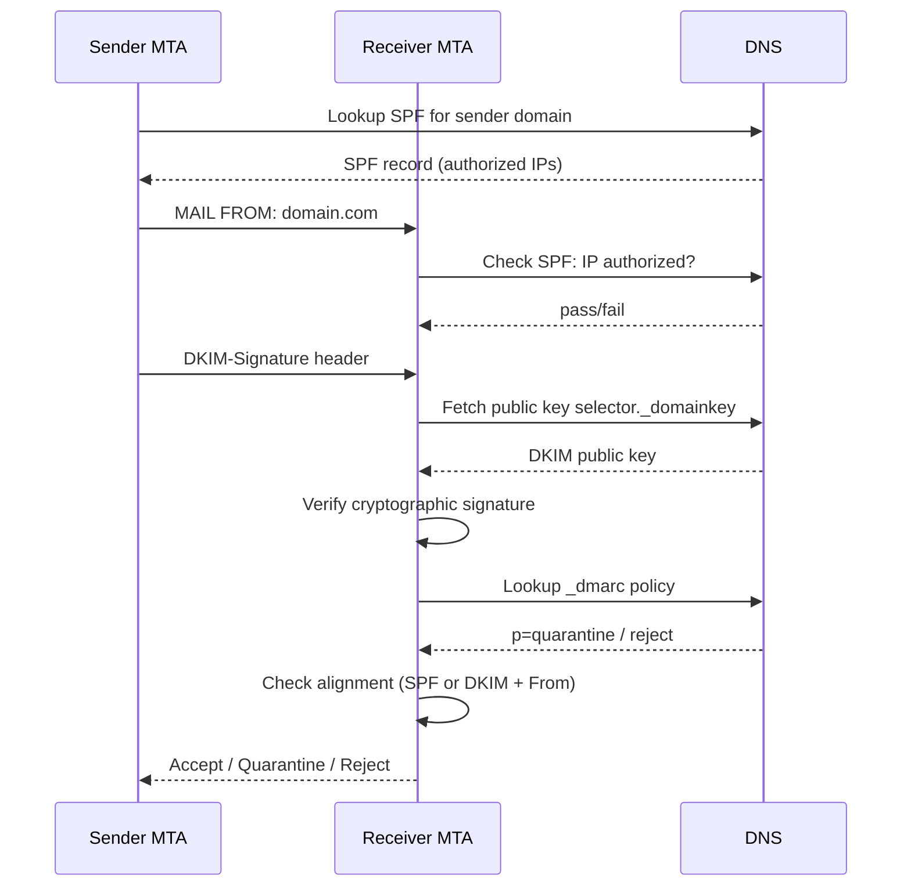
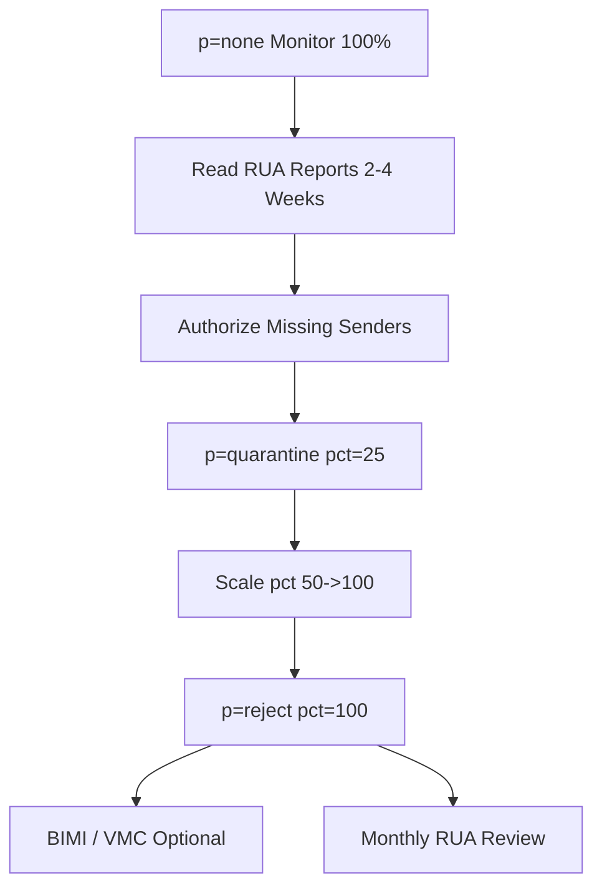

# Implementing and Tuning DMARC, SPF, and DKIM

## TCM Exam Objectives

Before taking the PSAA exam, you must be able to:

- Identify indicators of a phishing email in email headers, body, and attachments
- Configure email analysis tools (Thunderbird, PhishTool) for forensic examination
- Implement and tune DMARC, SPF, and DKIM authentication to block spoofed email
- Execute phishing simulation campaigns to measure organizational risk
- Apply reactive defense measures: block domains, URLs, and sender addresses
- Perform email search and purge procedures for incident response
- Deliver user notification and remediation following a confirmed phishing incident
- Analyze email authentication results to determine spoofing vs. legitimate mail

Email authentication is a layered defense, not a single switch. SPF authorizes sending IPs, DKIM cryptographically signs message content, and DMARC ties both to the visible `From:` domain and tells receivers what to do when alignment fails. The deployment ladder is always the same: publish SPF + DKIM ? set DMARC to `p=none` and monitor ? tighten `pct` ? move to `quarantine` ? finally `reject`. As of February 2024, Google and Yahoo both require bulk senders (>5,000 emails/day to their users) to publish a DMARC record, making this no longer optional.?turn2search3??turn2search7?

The three protocols sit in a clear hierarchy � DMARC is the policy layer that depends on the SPF and DKIM authentication layers beneath it.


---

## 1. SPF � Sender Policy Framework

SPF answers a single question: *Is the connecting IP allowed to send mail for this MAIL FROM (envelope) domain?* The receiver looks up a TXT record at the apex of the sending domain and walks the mechanisms in order until one matches, then applies that mechanism's qualifier.?turn0search1?

### 1.1 Mechanisms and qualifiers

Every mechanism can be prefixed with one of four qualifiers:?turn0search1?

| Qualifier | Meaning | Result on match |
|-----------|---------|-----------------|
| `+` (default) | Pass | Authorized |
| `~` | SoftFail | Probably not authorized (mark but accept) |
| `-` | Fail | Not authorized |
| `?` | Neutral | No assertion |

Core mechanisms: `ip4`, `ip6`, `a`, `mx`, `include`, `exists`, `ptr` (deprecated), and the catch-all `all`. Modifiers `redirect` (delegate to another domain's record) and `exp` (explanation string) appear at most once.?turn0search1?

### 1.2 Canonical record shape

```dns
example.com.   IN   TXT   "v=spf1 ip4:192.0.2.0/24 ip6:2001:db8::/32 include:_spf.google.com a mx ~all"
```

**The `all` mechanism must always be the last entry** � anything after it is unreachable. Use `~all` during stabilization, then promote to `-all` once DMARC reports show zero legitimate senders failing.?turn0search3?

### 1.3 The 10-lookup limit (the #1 SPF trap)

Each `include`, `a`, `mx`, `exists`, or `redirect` mechanism counts as a DNS lookup, and the RFC caps the total at **10** for the entire evaluation chain. Exceed it and the receiver returns `PermError`, which DMARC treats as SPF failure � silently breaking deliverability for some destinations while others accept the mail, producing inconsistent symptoms.?turn0search19??turn0search22?

A mid-market org with seven or more SaaS senders (Google Workspace, Microsoft 365, Mailchimp, SendGrid, Zendesk, HubSpot, Stripe, etc.) is already near the threshold. Mitigation options:

- **SPF flattening** � replace `include:` with resolved `ip4:`/`ip6:` blocks. Reduces lookups but creates a maintenance liability because cloud providers rotate their sending IPs, so flattened records silently go stale.?turn0search20??turn0search19?
- **Dynamic/Hosted SPF** � a single auto-updating include that stays under the limit regardless of how many services you run.?turn0search19?
- **Manual pruning** � audit the record, remove dead `include:`s, and prefer IP-based mechanisms for internal infrastructure.?turn0search21?

**Only one SPF record per domain.** Publishing two TXT records starting with `v=spf1` causes a `PermError` at most receivers.?turn0search12?
---



## 2. DKIM � DomainKeys Identified Mail

DKIM adds a cryptographic signature to the message header. The signer holds a private key; receivers fetch the matching public key from DNS at `selector._domainkey.yourdomain.com`. Unlike SPF, the DKIM signature **travels with the message** and survives forwarding, which is why DMARC can still pass on forwarded mail when SPF breaks.?turn2search10??turn1search23?

### 2.1 Record anatomy

```dns
default._domainkey.example.com.   IN   TXT   "v=DKIM1; k=rsa; p=MIGfMA0GCSqGSIb3DQEBAQUAA4GNADCBiQKBgQ..."
```

- **Record name**: `selector._domainkey.domain` � the `._domainkey.` label is mandatory and the selector is a label you choose (`default`, `google`, `s1`, `mail2026`, etc.).?turn0search6?
- **`p=`** holds the base64 public key. **Split at 255 characters** using multiple quoted strings separated by a single space if your DNS provider enforces the 255-byte string limit (common with the 512-byte UDP limit). Never put spaces *inside* a chunk.?turn2search9??turn2search8?

### 2.2 Key strength and rotation

Use **2048-bit RSA** keys. Keys under 1024 bits are increasingly rejected by major receivers, and 1024 is now considered the bare minimum.?turn0search7? Rotate at least every six months using a **dual-selector** strategy: publish a second selector, sign with both for an overlap period, then retire the old one once reports show the new selector passing everywhere.?turn0search7?

### 2.3 Generating keys and publishing the record

```bash
opendkim-genkey -b 2048 -d example.com -s mail2026 -D /etc/opendkim/keys/

```

Always publish the new record and let DNS propagate **before** activating signing with that selector, otherwise receivers see signatures they cannot verify.

### 2.4 OpenDKIM + Postfix configuration

The main config file `/etc/opendkim.conf` uses a KeyTable (maps key names ? domain:selector:keyfile) and a SigningTable (maps sender addresses ? key names):?turn2search0??turn2search2?

```ini
Mode            sv
Socket          inet:8891@localhost
Canonicalization relaxed/relaxed
KeyTable        refile:/etc/opendkim/KeyTable
SigningTable    refile:/etc/opendkim/SigningTable
ExternalIgnoreList refile:/etc/opendkim/TrustedHosts
InternalHosts      refile:/etc/opendkim/TrustedHosts
AutoRestart     yes
```

```ini
mail2026   example.com:mail2026:/etc/opendkim/keys/mail2026.private
```

```ini
*@example.com    mail2026
```

Then wire OpenDKIM as a milter in Postfix:

```postfix
milter_default_action = accept
milter_protocol = 6
smtpd_milters = inet:localhost:8891
non_smtpd_milters = inet:localhost:8891
```

`Canonicalization relaxed/relaxed` is the safe default � it tolerates minor header modifications by intermediaries (mailing list software, forwarders) that would otherwise break the signature under `simple` canonicalization.?turn1search19? The Microsoft 365 and Google Workspace consoles expose equivalent toggles without requiring manual OpenDKIM.?turn0search5??turn1search18?

---

## 3. DMARC � Policy, Alignment, and Reporting

DMARC is published as a TXT record at `_dmarc.yourdomain.com`. It does not authenticate anything itself � it instructs receivers on how to interpret SPF/DKIM results *and* requires **alignment** between the authenticated domain and the visible `From:` header.?turn1search0?

### 3.1 Anatomy and tag reference

```dns
_dmarc.example.com.   IN   TXT   "v=DMARC1; p=quarantine; sp=none; pct=50; rua=mailto:dmarc-agg@example.com; ruf=mailto:dmarc-forensic@example.com; fo=1; adkim=r; aspf=r; ri=86400"
```

| Tag | Purpose | Typical values |
|-----|---------|----------------|
| `v` | Version (always first) | `DMARC1` |
| `p` | Policy for the organizational domain | `none` / `quarantine` / `reject` |
| `sp` | Policy for **subdomains** (defaults to `p`) | `none` / `quarantine` / `reject` |
| `pct` | % of failing mail the policy applies to | `0` ? `100` (ramp lever) |
| `rua` | Aggregate report destination(s) | `mailto:...` |
| `ruf` | Forensic/failure report destination(s) | `mailto:...` |
| `fo` | Forensic report trigger | `0`=DMARC fail, `1`=any auth fail, `d`=DKIM fail, `s`=SPF fail |
| `adkim` | DKIM alignment mode | `r` (relaxed) / `s` (strict) |
| `aspf` | SPF alignment mode | `r` (relaxed) / `s` (strict) |
| `ri` | Report interval (seconds) | `86400` (daily) |

**Only one DMARC record per domain.** Multiple records at `_dmarc` cause policy discovery to abort and DMARC is not applied at all � functionally equivalent to no DMARC.?turn0search12? Note also that if a subdomain publishes its own DMARC record, its `p=` overrides the parent's `sp=` for that subdomain.?turn1search9?

### 3.2 Alignment � the core of DMARC

A message passes DMARC only if **at least one** of SPF or DKIM passes **and** that passing identifier aligns with the `From:` header domain.?turn1search0??turn1search4?

- **SPF alignment**: the MAIL FROM (envelope) domain must match the `From:` header domain. Relaxed (`aspf=r`) allows organizational-domain matches (e.g., `mail.example.com` aligns with `example.com`); strict (`aspf=s`) requires exact match.?turn1search5?
- **DKIM alignment**: the `d=` domain in the DKIM signature must match the `From:` header domain (relaxed) or match exactly (strict).?turn1search2?

This is why a third party that sends "on behalf of" you but signs with their own `d=` will fail DMARC alignment even if SPF passes � they must sign with `d=yourdomain.com` ( delegated signing) or use a subdomain you control.

### 3.3 RUA vs RUF reports

- **RUA (aggregate)** � daily XML summaries per receiver, grouped by source IP, with authentication results and DMARC disposition. No message content. **This is the primary monitoring signal** and every domain should configure at least one RUA address.?turn1search12??turn1search13?
- **RUF (forensic)** � per-message failure samples with original headers (and sometimes redacted body). Useful for forensic investigation, but many receivers no longer send them (privacy concerns, ARC redaction), and they may leak PII. Most senders should focus on RUA and treat RUF as optional.?turn1search12??turn1search13?

Reading a RUA report: each `<record>` block contains a `<row>` (source IP, message count, DMARC `disposition` � `none`/`quarantine`/`reject`), a `<policy_published>` echo, and `<auth_results>` showing the raw SPF and DKIM verdicts *before* alignment. A message can show `spf=pass` in `auth_results` but still fail DMARC if alignment failed � always cross-check the `disposition` field.?turn1search10??turn1search11?
---

?? **Exam Tip:** On the PSAA exam, always document your analysis methodology step-by-step in the incident report. Include timestamps, source/destination IPs, and the specific evidence that supports your conclusion.


## 4. Combined Deployment Workflow

The phased rollout below minimizes the risk of legitimate mail being blocked.


**Step-by-step actions:**

1. **Inventory** every legitimate sender � internal MTAs, SaaS apps, marketing platforms, billing systems, CRM, ticketing, transactional APIs. Anything sending as your domain must be accounted for.
2. **Publish SPF** with `~all` and all `include:` entries. Verify the 10-lookup budget with a checker.
3. **Enable DKIM** on every outgoing source. For SaaS providers, use their DKIM key generation UI and publish the selector CNAME/TXT they provide.
4. **Publish DMARC with `p=none; rua=mailto:...; pct=100`** � this monitors 100% of traffic with no enforcement. No `ruf` initially.?turn0search13?
5. **Read RUA reports for 2�4 weeks.** Classify every source IP as known/unknown/legitimate. Add missing `include:` entries to SPF, generate DKIM keys for forgotten senders. Iterate until 100% of legitimate traffic passes DMARC.
6. **Move to `p=quarantine; pct=25`** � 25% of failing mail goes to spam, the rest is monitored. Watch for false positives.?turn0search11?
7. **Scale `pct`** to 50 ? 100 over several weeks. If legitimate mail starts landing in spam, identify the sender and fix before proceeding.
8. **Promote to `p=reject; pct=100`** once quarantine is clean at 100%. This blocks spoofed mail at SMTP.?turn0search17?
9. **Optional � BIMI/VMC**: requires DMARC at `quarantine` or `reject` enforcement, then publishes a logo and Verified Mark Certificate so participating mailbox providers render your brand logo next to authenticated mail.?turn2search14??turn2search17?

---

## 5. Common Pitfalls and Troubleshooting

### 5.1 SPF/DKIM problems

| Symptom | Likely cause | Fix |
|---------|--------------|-----|
| Intermittent delivery failures across destinations | SPF `PermError` from >10 lookups | Flatten or use hosted SPF; prune dead `include:`s ?turn0search19??turn0search22? |
| Mail from a service fails SPF despite "include" added | Service is missing, or include chain is nested too deep | Audit nested includes; many third parties nest their own includes ?turn0search21? |
| DKIM `fail` (body hash mismatch) | Mailing list or forwarder modified body; `simple` canonicalization too strict | Use `relaxed/relaxed`; consider ARC for forwarders ?turn1search19??turn1search23? |
| DKIM `key not found` / `permfail` | Selector TXT record not propagated, wrong record name, or key split incorrectly | Verify with `dig TXT selector._domainkey.domain`; check 255-char split quoting ?turn2search9??turn2search10? |
| DKIM signature missing entirely | Milter not in `non_smtpd_milters` path (locally submitted mail) or SigningTable entry missing the sender | Add both milter paths; verify wildcard pattern ?turn2search0? |
| Mail rejected for "weak key" | Sub-1024-bit or 1024-bit key | Rotate to 2048-bit via dual-selector overlap ?turn0search7? |
| Forwarded mail fails SPF but the user expected it to pass | Forwarder's IP isn't in your SPF | DKIM (which survives forwarding) must carry alignment; do not try to add forwarder IPs to SPF ?turn1search20??turn1search23? |

### 5.2 DMARC problems

| Symptom | Likely cause | Fix |
|---------|--------------|-----|
| DMARC not applied at all | Multiple `_dmarc` TXT records, or record does not start with `v=DMARC1;` | Keep exactly one record; `v=` must be the first tag ?turn0search12? |
| `auth_results` shows `spf=pass` but DMARC `disposition=quarantine` | SPF passed but **alignment** failed (MAIL FROM domain ? From: domain) | Fix the sender's envelope domain, or rely on aligned DKIM ?turn1search1??turn1search24? |
| Third-party sender fails DMARC | Signed with their own `d=` and envelope from their domain | Have them sign with `d=yourdomain.com` (delegated DKIM) or route through your domain ?turn1search2? |
| Legitimate mail quarantined after tightening | Unknown legitimate sender not yet authorized | Roll back `pct`, authorize the sender in SPF/DKIM, then re-tighten ?turn0search11? |
| Subdomains still spoofable after DMARC publish | Only `p=` set; subdomains inherit but you wanted stricter control | Set `sp=` explicitly; remember subdomain DMARC records override `sp=` ?turn1search9? |
| `p=reject; pct=0` vs `p=none` confusion | `pct=0` means policy applies to 0% � equivalent to `none` for enforcement, but still reports as `reject` policy | Use `p=none` for monitoring; `pct` is a ramp lever, not an on/off ?turn0search14? |

### 5.3 Third-party senders (Google Workspace, Microsoft 365, SendGrid, Mailchimp)

- **Google Workspace**: add `include:_spf.google.com` to SPF; enable DKIM in the Admin console under Gmail ? Authenticate email; Google rotates keys for you.?turn0search4?
- **Microsoft 365**: add `include:spf.protection.outlook.com`; enable DKIM in Defender ? Email authentication settings; publish the two CNAMEs Microsoft provides for selector rotation.?turn0search5??turn0search16?
- **SendGrid/Mailchimp/HubSpot**: add their `include:` and publish the DKIM CNAME they generate. These platforms sign with your domain when configured correctly, satisfying alignment.
- **Watch the 10-lookup budget**: each provider's `include:` typically nests 1�3 additional lookups internally, so five providers can already exhaust the limit.?turn0search19?

---

## 6. Testing and Monitoring Tooling

- **DNS verification**: `dig TXT example.com`, `dig TXT selector._domainkey.example.com`, `dig TXT _dmarc.example.com` � confirm propagation after every change.
- **Free analyzers**: MXToolbox SPF/DKIM/DMARC lookup, Dmarcian SPF Survey, EasyDMARC/PowerDMARC record checkers, Google's CheckMX (`checkmx.google.com`).?turn0search7??turn0search0?
- **Live authentication test**: mail `check-auth@verifier.port25.com` to receive a full SPF/DKIM/DMARC verdict breakdown.
- **RUA ingestion**: parse XML manually, or use a hosted analyzer (Dmarcian, EasyDMARC, PowerDMARC, Valimail, Red Sift OnDMARC) that auto-classifies source IPs by vendor.
- **BIMI readiness**: BIMI requires DMARC at `quarantine` or `reject` plus a VMC/CMC from a participating CA (DigiCert, Entrust, Sectigo).?turn2search17??turn2search13?

---

## 7. Operational Cadence

Once at `p=reject`, treat email authentication as ongoing infrastructure:

- **Weekly** during rollout: review RUA reports, classify new source IPs.
- **Monthly** at steady state: confirm no new senders appear, verify SPF still under 10 lookups, check that rotated third-party DKIM selectors are published.
- **Every 6 months**: rotate your own DKIM keys using the dual-selector overlap pattern; review whether `aspf`/`adkim` can be promoted to `s` (strict) where business mail never uses subdomains.?turn0search7?
- **Before any new SaaS sender goes live**: add its SPF include and DKIM selector *before* it starts sending, and verify with a test message while DMARC is still at `none` for that sender's traffic (or pre-authorize during a `pct` rollback window).
