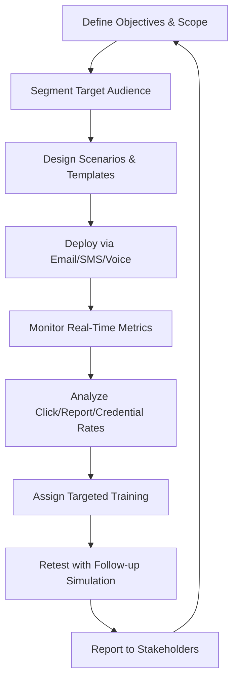
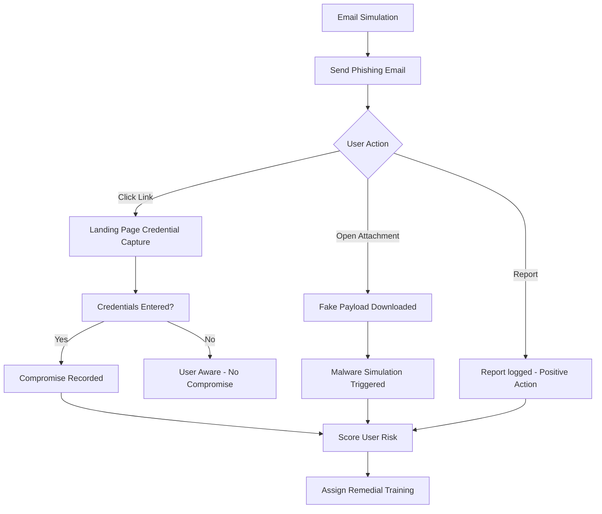

# Phishing Simulation Campaigns

## TCM Exam Objectives

Before taking the PSAA exam, you must be able to:

- Identify indicators of a phishing email in email headers, body, and attachments
- Configure email analysis tools (Thunderbird, PhishTool) for forensic examination
- Implement and tune DMARC, SPF, and DKIM authentication to block spoofed email
- Execute phishing simulation campaigns to measure organizational risk
- Apply reactive defense measures: block domains, URLs, and sender addresses
- Perform email search and purge procedures for incident response
- Deliver user notification and remediation following a confirmed phishing incident
- Analyze email authentication results to determine spoofing vs. legitimate mail

  

## ?? Lesson Overview
This comprehensive lesson guides you through planning, executing, and optimizing phishing simulation campaigns that build real human resilience against modern social engineering threats. You'll learn to move beyond basic click-rate metrics to create sophisticated, multi-channel exercises that mirror today's attack landscape.

## 1. ??? Foundation: Understanding Phishing Simulations

### 1.1 What is a Phishing Simulation?
A **phishing simulation** is a controlled cybersecurity exercise that mimics real-world phishing attacks to train employees on recognition and response ?turn0search11?. Unlike actual attacks, these are safe exercises crafted by security teams to expose users to deceptive emails, texts, calls, or other social engineering tactics without business risk ?turn0search0?.

> ?? **Core Purpose**: Identify behavioral risk signals (who clicks, downloads, or shares data) and create teachable moments that transform mistakes into learning opportunities ?turn0search0?.

### 1.2 Evolution of Phishing Threats
Modern phishing has evolved far beyond suspicious email links. Today's attackers exploit:
- **SMS phishing (smishing)** targeting financial information ?turn0search0?
- **Voice phishing (vishing)** spoofing trusted phone numbers ?turn0search0?
- **QR code phishing (quishing)** ?turn0search0?
- **AI-driven deepfakes** impersonating executives ?turn0search0?
- **Multi-channel attacks** combining email, phone, and text ?turn0search7?

According to IBM's 2025 Cost of a Data Breach Report, phishing remains the **most common initial attack vector**, used in 16% of breaches in 2024 ?turn0search0?.

### 1.3 Common Misconceptions
Three myths stall effective phishing simulation programs:

| Misconception | Reality | Impact |
|----------------|---------|--------|
| "It's just about clicking links" | Modern attackers use smishing, vishing, QR codes, and AI deepfakes ?turn0search0? | Employees unprepared for advanced tactics |
| "Annual training is enough" | Phishing tactics evolve weekly; new hires are 44% more likely to click malicious links ?turn0search0? | Critical security gaps remain unaddressed |
| "Our email filter solves it" | Sophisticated social engineering bypasses technical defenses ?turn0search0? | False sense of security |

## 2. ?? Planning Your Campaign Strategy

### 2.1 Defining Objectives & Scope
Before launching simulations, establish clear goals:

?? Sample Campaign Planning Document

**Campaign Name**: Q4 2025 Executive Protection Simulation
**Duration**: 6 weeks (October 15 - November 26, 2025)
**Target Audience**: Finance department, C-suite executives, new hires (< 6 months tenure)
**Primary Objective**: Assess vulnerability to AI-powered voice phishing and deepfake attacks
**Success Metrics**: 
- Reduce credential entry rate by 40% from baseline
- Increase reporting rate to >35%
- 100% completion of remedial training by at-risk users
**Compliance Requirement**: NIS2 Directive documentation

### 2.2 Understanding Your Audience
Segment users based on risk factors:
- **New employees** (first 3 months: 71% more likely to fall for social engineering) ?turn0search0?
- **High-access roles** (finance, IT, executives)
- **Previous failure history**
- **Department-specific risks** (HR, legal, research)

### 2.3 Selecting Simulation Channels
Modern campaigns should test multiple attack vectors:

| Channel | Threat Type | Best For | Complexity |
|---------|-------------|----------|------------|
| **Email** | Traditional phishing | Broad awareness, template testing | Low |
| **SMS (Smishing)** | Text message phishing | Mobile workforce, delivery scams | Medium |
| **Voice (Vishing)** | Phone call phishing | Executive impersonation, IT support scams | High |
| **QR Codes (Quishing)** | Malicious QR codes | Physical world phishing, menu/direction scams | Medium |
| **Deepfake** | AI-generated audio/video | CEO fraud, executive impersonation | Very High |

## 3. ??? Selecting Tools & Platforms

### 3.1 Tool Comparison Matrix
Based on 2026 market analysis ?turn0search5??turn0search6?:

| Tool | Best For | Key Strengths | Limitations | Rating |
|------|----------|---------------|-------------|--------|
| **KnowBe4** | Enterprise compliance | Large template library, automation | Complex for small teams | ????? |
| **Hoxhunt** | Human risk management | AI adaptivity, gamification | Higher cost | ????? |
| **IRONSCALES** | AI-driven campaigns | Automated lure rotation | Limited customization | ????? |
| **Phished AI** | Behavioral scoring | Predictive risk modeling | Newer platform | ????? |
| **Proofpoint** | Mimecast integration | Strong email security stack | Limited multi-channel | ????? |
| **Gophish** | Technical teams | Open-source, full control | Self-hosting required | ????? |

### 3.2 Platform Selection Criteria
Consider these factors when choosing a platform:

1. **Simulation Quality**: High-fidelity templates that mirror current attacks ?turn0search6?
2. **Multi-Channel Support**: Email, SMS, voice, QR, deepfake capabilities ?turn0search7?
3. **Reporting Depth**: Behavioral analytics beyond click rates ?turn0search14?
4. **Integration**: Connects with SIEM, SOAR, identity systems ?turn0search6?
5. **Ease of Use**: Intuitive admin interface, low operational burden ?turn0search6?
6. **Scalability**: Supports growth from hundreds to thousands of users
7. **Compliance**: Meets regulatory documentation requirements (NIS2, GDPR)

?? Technical Implementation Considerations

**Infrastructure Requirements**:
- Sending infrastructure: Properly configured SMTP servers with SPF, DKIM, DMARC
- Landing pages: Secure credential capture with encrypted storage
- Tracking mechanisms: Unique URLs, pixel tracking, form submissions
- API access: For integration with HR systems, security tools
- Data residency: Compliance with regional data protection laws

**Security Considerations**:
- Encryption in transit and at rest
- Role-based access control (RBAC)
- Audit logging for all actions
- Regular penetration testing of the platform itself
- Secure handling of captured credentials (if applicable)

## 4. ?? Designing Realistic Campaign Content

### 4.1 Scenario Crafting Principles
Effective simulations recreate the layered tactics attackers use ?turn0search0?:

1. **Plausibility**: Scenarios must seem possible in your organizational context
2. **Urgency**: Create time-sensitive situations requiring immediate action
3. **Authority**: Impersonate executives, IT support, or trusted vendors
4. **Emotional Manipulation**: Fear, curiosity, greed, or helpfulness triggers
5. **Technical Sophistication**: Match current attacker techniques

### 4.2 Payload Diversity
Move beyond simple "bad links" to test various threat patterns ?turn0search0?:

| Payload Type | Example Scenario | Tests For |
|--------------|------------------|-----------|
| **Malicious Attachments** | Invoice.zip, Resume.doc | Attachment handling behavior |
| **Credential Harvesters** | Fake O365 login page | Password sharing, MFA bypass |
| **QR Codes** | Malicious restaurant menu | Physical world phishing |
| **Smishing** | Package delivery notification | Mobile threat recognition |
| **Vishing** | IT support call | Phone verification behavior |
| **Deepfake** | AI-generated CEO video | Executive impersonation recognition |

### 4.3 Template Development Process
Follow this workflow for creating effective templates:

?? Example Email Template Structure

**Subject**: Urgent: Password Expiry Notice - Action Required Immediately
**From**: IT Support Desk <it-support@company.com>
**Body**: 
Dear [Employee Name],

Our records indicate your password will expire in 24 hours. To prevent account lockout, please update your credentials immediately by clicking the link below:

[Update Password Now]

Failure to act will result in temporary account suspension.

IT Support Team
[Company Name]

**Red Flags to Include**:
- Generic greeting vs. personalized
- Urgency language ("immediately", "24 hours")
- Slightly mismatched sender domain
- Unusual link text vs. actual URL
- Lack of company branding elements
- No contact information for verification

?? **Exam Tip:** Always save a copy of the original evidence before performing any analysis. Reference specific packet numbers, event IDs, and timestamps to demonstrate thorough investigation.

## 5. ?? Executing the Campaign

### 5.1 Deployment Strategies
Choose the right approach based on your objectives:

| Strategy | Description | Best For | Risk Level |
|---------|-------------|----------|------------|
| **Blind Campaign** | No prior warning to users | Baseline measurement | Medium |
| **Announced Campaign** | Users know simulation is coming | Initial training, compliance | Low |
| **Progressive Campaign** | Start easy, increase difficulty | Skill building | Medium |
| **Targeted Campaign** | Focus on high-risk groups | Remediation, executive testing | High |

### 5.2 Execution Timeline
A typical 6-week campaign follows this structure:

### 5.3 Real-Time Monitoring
Track these metrics during campaign execution:

- **Delivery success rate**: Emails/SMS reaching inboxes
- **Open rate**: Users viewing the message
- **Click-through rate**: Users interacting with links/attachments
- **Credential entry rate**: Users submitting credentials on landing pages
- **Reporting rate**: Users using proper reporting channels ?turn0search15?
- **Time to report**: Speed of threat recognition and reporting ?turn0search18?

## 6. ?? Analyzing Results & Measuring Impact

### 6.1 Beyond Click Rates: Advanced Metrics
Modern programs track comprehensive metrics ?turn0search14??turn0search15?:

| Metric Category | Specific KPIs | Business Value |
|-----------------|---------------|----------------|
| **Vulnerability Metrics** | Click rate, credential entry rate, attachment open rate | Quantify human risk |
| **Reporting Metrics** | Report rate, false positive rate, time to report ?turn0search18? | Measure detection capability |
| **Behavioral Metrics** | Repeat offenders, improvement rate, department comparisons | Track progress over time |
| **Training Effectiveness** | Completion rate, assessment scores, retention | Validate training ROI |
| **Operational Metrics** | Campaign cost, admin time, platform uptime | Assess program efficiency |

### 6.2 Risk Scoring Models
Implement behavioral risk scoring to prioritize interventions:

?? Sample Risk Scoring Matrix

| Score Range | Risk Level | Characteristics | Recommended Actions |
|-------------|------------|-----------------|---------------------|
| 0-30 | Low | No clicks, consistent reporting | Recognition, ambassador role |
| 31-60 | Medium | Occasional clicks, reports some | Targeted microlearning |
| 61-80 | Elevated | Multiple clicks, inconsistent reporting | Mandatory training, increased simulations |
| 81-100 | High | Repeated clicks, credential entry | 1:1 coaching, access review |
| 100+ | Critical | Malicious intent or extreme vulnerability | HR involvement, access restriction |

**Factors in Score Calculation**:
- Frequency of clicks (weighted by payload severity)
- Credential entry attempts (highest weight)
- Reporting consistency and timeliness
- Completion of assigned training
- Time since last incident
- Department risk adjustment

### 6.3 Reporting & Visualization
Create tailored reports for different stakeholders:

- **Executive Dashboard**: High-level metrics, risk trends, ROI
- **Department Reports**: Comparative analysis, targeted recommendations
- **Individual Reports**: Personalized feedback, learning paths
- **Compliance Reports**: Audit-ready documentation for regulations

## 7. ?? Continuous Improvement & Optimization

### 7.1 The Feedback Loop
Effective programs follow a continuous improvement cycle:

### 7.2 A/B Testing Methodology
Optimize your campaigns through systematic testing:

| Test Element | Hypothesis Example | Success Metric |
|--------------|-------------------|-----------------|
| **Subject Lines** | "Urgent" vs. "Action Required" | Open rate |
| **Sender Names** | CEO vs. IT Support | Click rate |
| **Payload Types** | Link vs. Attachment | Credential entry rate |
| **Timing** | Morning vs. Afternoon | Response rate |
| **Personalization** | First name vs. Department | Engagement rate |

### 7.3 Training Integration
Connect simulation results to targeted training:

- **Just-in-time training**: Immediate microlearning after simulation failure
- **Adaptive learning paths**: Adjust based on user performance
- **Spaced repetition**: Reinforce key concepts over time
- **Multi-modal content**: Videos, quizzes, simulations, gamification

?? Sample Training Path for Repeat Clickers

**User Profile**: John Doe (Marketing Department)
**Risk Score**: 72/100 (Elevated Risk)
**Incident History**: 3 clicks in 6 months, including credential entry

**Assigned Learning Path**:
1. **Immediate**: "Anatomy of a Phishing Email" (5 min video)
2. **Week 1**: "Spotting Red Flags" interactive module
3. **Week 2**: "Safe Email Practices" simulation reinforcement
4. **Week 3**: "Reporting Procedures" walkthrough
5. **Month 2**: Follow-up simulation with similar payload
6. **Quarter 2**: Department-wide phishing awareness workshop

**Success Criteria**:
- Completes all assigned modules within 2 weeks
- Passes assessment with 80% or higher
- No additional clicks in next 90 days
- Reports next simulated phish within 15 minutes

## 8. ?? Legal & Ethical Considerations

### 8.1 Compliance Requirements
Ensure your program meets regulatory standards:

- **NIS2 Directive**: Documentation of risk management measures ?turn0search15?
- **GDPR**: Lawful basis for processing personal data in simulations
- **Industry Regulations**: HIPAA, PCI-DSS, SOX requirements
- **Labor Laws**: Employee consent and notification requirements

### 8.2 Ethical Implementation
Balance security needs with employee trust:

- **Transparency**: Clear communication about program purpose
- **Proportionality**: Scenarios match realistic threats
- **Respect**: Avoid humiliation or punitive approaches
- **Support**: Provide resources for struggling employees
- **Opt-out**: Consider medical or psychological exceptions

## 9. ?? Advanced Campaign Strategies

### 9.1 Multi-Channel Campaigns
Orchestrate sophisticated attacks across channels:

**Example Scenario**: 
1. Email with QR code supposedly from IT department
2. QR leads to fake portal requesting phone number
3. Automated smishing with "verification code"
4. Vishing call claiming to be IT support
5. Credential harvest under guise of "fixing" problem

### 9.2 Seasonal & Event-Based Campaigns
Time simulations with real-world events:

- **Tax Season**: W-2 phishing, IRS impersonation
- **Holidays**: Shipping notifications, gift card scams
- **Company Events**: Merger announcements, leadership changes
- **Global Crises**: Pandemic relief, natural disaster scams

### 9.3 Executive Protection Programs
Specialized campaigns for high-risk individuals:

- **Deepfake simulations**: AI-generated CEO video calls
- **Vishing scenarios**: Executive impersonation attempts
- **Whaling attacks**: Targeted spear phishing of C-suite
- **Travel scenarios**: Airport Wi-Fi, hotel scams

## 10. ?? Knowledge Check & Assessment

### 10.1 Sample Exam Questions

? Practice Questions (Click to Expand)

1. **What is the primary purpose of phishing simulations?**
   - A) Punish employees who click links
   - B) Identify behavioral risk signals and create teachable moments ?turn0search0?
   - C) Replace technical email security controls
   - D) Generate compliance reports only

2. **Which attack vector has seen a 442% increase in 2025?**
   - A) Email phishing
   - B) Smishing
   - C) Vishing ?turn0search7?
   - D) QR code phishing

3. **What is a key limitation of free phishing simulation tools?**
   - A) They cannot simulate email-based attacks
   - B) They often lack advanced multi-channel capabilities ?turn0search7?
   - C) They are illegal in most jurisdictions
   - D) They always require extensive technical setup

4. **Which metric is most important for measuring program effectiveness?**
   - A) Click rate
   - B) Report rate ?turn0search15?
   - C) Number of campaigns run
   - D) Cost per simulation

5. **What should be included in a post-simulation report for executives?**
   - A) Individual employee names and mistakes
   - B) High-level metrics, risk trends, and ROI ?turn0search14?
   - C) Complete technical details of each campaign
   - D) Only positive results to maintain morale

### 10.2 Practical Exercise
Design a phishing simulation campaign for a financial institution with 500 employees, including:
- Campaign objectives and success metrics
- Target audience segmentation
- Multi-channel scenario design
- Timeline and deployment strategy
- Key metrics to track
- Training integration plan

## ?? Conclusion & Next Steps

### Key Takeaways
1. **Modern phishing simulations** must test multiple channels (email, SMS, voice, QR, deepfakes) beyond traditional email ?turn0search0??turn0search7?
2. **Behavioral metrics** like report rate and time-to-report are more valuable than click rates alone ?turn0search15??turn0search18?
3. **Continuous improvement** through A/B testing and feedback loops is essential for program effectiveness
4. **Integration with training** creates a closed-loop system that addresses specific vulnerabilities
5. **Legal and ethical considerations** must balance security needs with employee trust

### Implementation Roadmap
1. **Week 1-2**: Platform selection and initial setup
2. **Week 3-4**: First simple campaign (email only)
3. **Week 5-8**: Analyze results, refine scenarios
4. **Week 9-12**: Introduce multi-channel elements
5. **Week 13-16**: Implement targeted training paths
6. **Ongoing**: Regular campaigns with continuous optimization

> ?? **Final Note**: Phishing simulations are not about catching employees doing wrong, but about building collective resilience. The goal is to create a culture where security is everyone's responsibility, and where mistakes become learning opportunities rather than failures.

---
