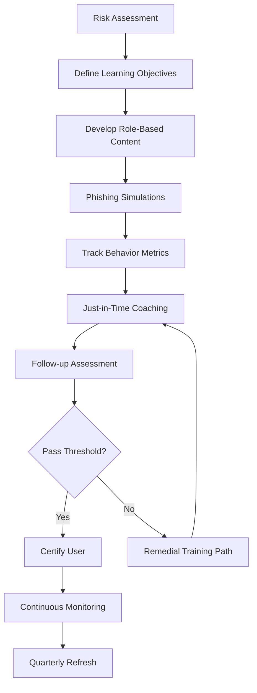
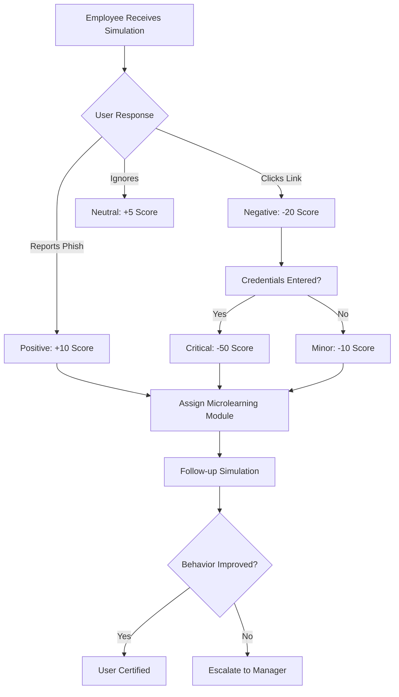

# User Security Awareness Training

## TCM Exam Objectives

Before taking the PSAA exam, you must be able to:

- Identify indicators of a phishing email in email headers, body, and attachments
- Configure email analysis tools (Thunderbird, PhishTool) for forensic examination
- Implement and tune DMARC, SPF, and DKIM authentication to block spoofed email
- Execute phishing simulation campaigns to measure organizational risk
- Apply reactive defense measures: block domains, URLs, and sender addresses
- Perform email search and purge procedures for incident response
- Deliver user notification and remediation following a confirmed phishing incident
- Analyze email authentication results to determine spoofing vs. legitimate mail

  

## ?? Lesson Overview
This comprehensive lesson guides you through designing, implementing, and optimizing a modern User Security Awareness Training program that transforms employees from your greatest vulnerability into your strongest defense. You'll learn to move beyond compliance-focused training to create behavior-change programs that measurably reduce human risk.

## 1. ??? Foundation: Understanding Security Awareness Training

### 1.1 What is Security Awareness Training?
Security awareness training (SAT) is a structured program that teaches employees and stakeholders how to recognize and respond to cybersecurity risks ?turn0search8?. It changes crucial habits, such as verifying unusual invoice requests or avoiding unexpected email links, to lower the likelihood of breaches. Think of it as building a **human firewall**�a trained team that intercepts threats that technology may miss ?turn0search8?.

> ?? **Core Insight**: Without this human layer, organizations remain exposed to attacks like business email compromise (BEC), which cost U.S. businesses $2.9 billion in 2023 ?turn0search8?.

### 1.2 Evolution of Security Awareness Training
Security awareness training has evolved significantly over the years:

### 1.3 Why Modern Training Matters
Traditional programs often lean on yearly workshops or generic phishing tests. They may raise awareness, but they rarely keep pace with new AI-driven threats that emerge every week ?turn0search8?. Today's security awareness training must be:

- **Continuous** rather than annual events
- **Adaptive** to individual roles and risk profiles
- **Grounded in measurable behavior change** ?turn0search8?

### 1.4 Key Training Areas
Effective security awareness training typically covers these critical areas ?turn0search8?:

| Training Area | Description | Modern Threat Examples |
|--------------|-------------|------------------------|
| **Phishing & Social Engineering** | Recognizing and avoiding malicious emails, phone scams, smishing texts, QR code phishing (quishing) | AI-generated spear phishing, vendor impersonation |
| **Generative AI-Powered Deepfakes** | Identifying fake video, voice, or text communications that mimic executives or colleagues | CEO voice clones, synthetic media manipulation |
| **Password Security** | Creating strong, unique passwords and using password managers effectively | Credential stuffing, password spraying |
| **Malware Awareness** | Understanding how viruses, ransomware, and other malicious software operate | Ransomware-as-a-Service, fileless malware |
| **Data Security & Privacy** | Protecting sensitive information, complying with regulations (GDPR, HIPAA, CCPA) | Data exfiltration, privacy violations |
| **Physical Security** | Securing devices, preventing unauthorized access, reporting lost or stolen equipment | Tailgating, shoulder surfing |
| **Safe Internet Usage** | Using secure networks, avoiding risky sites, understanding public Wi-Fi risks | Malicious downloads, drive-by downloads |
| **Mobile Device Security** | Safeguarding smartphones and tablets from threats | App-based threats, SMS phishing |
| **Incident Reporting** | Knowing how and when to report suspicious activity to the right channels | Underreporting, delayed response |

## 2. ?? Planning Your Training Program

### 2.1 Defining Objectives & Scope
Before launching training, establish clear goals based on your organization's risk profile:

?? Sample Program Planning Document

**Program Name**: Global Human Risk Management Initiative 2026
**Duration**: 12 months (January - December 2026)
**Target Audience**: All employees (2,500 users) across 15 departments
**Primary Objective**: Reduce successful phishing attacks by 75% and increase reporting rate to >40%
**Success Metrics**:
- Phishing click-through rate reduction from 18% to <5%
- Reporting rate increase from 12% to >40%
- Mean time to report (MTTR) reduction from 45 minutes to <15 minutes
- 100% completion of role-specific training modules
- 25% improvement in security culture survey scores
**Compliance Requirement**: Meet NIS2 Directive, GDPR, and industry-specific regulations
**Budget**: $150,000 (platform, content, resources)

### 2.2 Understanding Your Audience
Segment users based on risk factors and learning needs:

- **Role-based risk**: Finance (invoice fraud), IT (admin credentials), Executives (whaling attacks), HR (personal data access)
- **Technical proficiency**: Different technical backgrounds require different training approaches
- **Geographic location**: Regional regulations, languages, and cultural differences
- **Previous performance**: Users with repeated failures need specialized attention

### 2.3 Selecting Training Platforms
Based on 2026 market analysis, here's a comparison of leading platforms ?turn0search0??turn0search2??turn0search5?:

| Platform | Best For | Key Strengths | Limitations | Rating |
|----------|----------|---------------|-------------|--------|
| **Hoxhunt** | Behavior-change programs | Adaptive learning, gamification, 42-language support | Higher cost, steeper learning curve | ????? |
| **KnowBe4** | Compliance-focused programs | Large content library, strong compliance coverage | Module-centric, less adaptive | ????? |
| **Proofpoint** | Phishing simulation | Ecosystem integration, credible phishing | Static/assignment-led training | ????? |
| **Adaptive Security** | AI-powered threats | Realistic simulations, modern threat coverage | Newer platform | ????? |
| **Fortinet** | Education sector | Curriculum for students, teacher resources | Less enterprise-focused | ????? |
| **Huntress** | Managed programs | Turnkey solution, actionable reporting | Less customization | ????? |

?? Platform Selection Criteria

When evaluating platforms, consider these factors:

1. **Adaptivity**: Does the platform adjust difficulty based on user performance?
2. **Multi-channel coverage**: Email, SMS, voice, QR, deepfake simulations
3. **Content relevance**: Is content updated regularly with current threats?
4. **Integration capabilities**: Connects with your identity, email, and security systems
5. **Reporting depth**: Beyond completion rates to behavior change metrics
6. **Localization**: Support for multiple languages and regional regulations
7. **User experience**: Engaging interface that encourages participation
8. **Administrative overhead**: How much manual management is required?
9. **Cost model**: Per-user pricing vs. flat rate vs. feature-based
10. **Support quality**: Vendor responsiveness and knowledge resources

## 3. ?? Designing Effective Training Content

### 3.1 Content Development Principles
Effective training content follows these key principles:

1. **Relevance**: Scenarios must reflect real threats users face in their roles
2. **Realism**: Simulations should mirror current attack techniques and technologies
3. **Interactivity**: Passive learning is less effective than active engagement
4. **Brevity**: Microlearning (5-10 minute modules) fits busy schedules
5. **Feedback**: Immediate, constructive feedback reinforces learning
6. **Variety**: Multiple formats (videos, quizzes, simulations) prevent fatigue

### 3.2 Modern Training Approaches
Today's effective programs incorporate these advanced approaches ?turn0search2??turn0search8?:

#### Personalized Training Paths
Different roles face different risks. Modern programs tailor content and delivery to match each person's exposure and learning needs ?turn0search8?. For example:
- **Developers**: Secure coding practices, GitHub security
- **Finance**: Invoice fraud detection, wire transfer verification
- **Executives**: Whaling attack defense, travel security
- **HR**: Personal data protection, social media risks

#### AI-Powered Simulations
Cybercriminals use AI to craft phishing emails that mimic writing style, voice messages that sound like executives, and authentic-looking deepfake videos ?turn0search8?. Training that mirrors these tactics helps employees recognize subtle red flags.

#### Multi-Channel Training
Security threats are no longer confined to email. Modern programs test users across the same tools they rely on daily�email, chat platforms, video calls, file-sharing services, and SMS ?turn0search8?.

### 3.3 Content Development Process
Follow this workflow for creating effective training content:

?? Example Training Module Structure

**Module Title**: Detecting AI-Generated Phishing Emails
**Duration**: 8 minutes
**Target Audience**: All employees
**Learning Objectives**:
- Identify 5 red flags of AI-generated phishing emails
- Differentiate between legitimate and AI-generated content
- Know proper reporting procedures

**Content Structure**:
1. **Introduction (1 min)**: Real-world example of AI phishing attack
2. **Red Flags (3 min)**: Interactive examples showing:
   - Unusual phrasing or grammar inconsistencies
   - Mismatched sender name and email
   - Urgency language patterns
   - Slightly off-brand formatting
   - Unusual request patterns
3. **Practice Exercise (2 min)**: Interactive scenario with 3 sample emails
4. **Reporting Procedure (1 min)**: How and when to report
5. **Assessment (1 min)**: 3-question quiz with feedback

**Success Criteria**:
- 90% pass rate on assessment
- 75% reduction in AI phishing clicks post-training
- 50% increase in AI phishing reports

## 4. ?? Delivering Training Programs

### 4.1 Deployment Strategies
Choose the right approach based on your objectives and organizational culture:

| Strategy | Description | Best For | Risk Level |
|---------|-------------|----------|------------|
| **Phased Rollout** | Gradual implementation by department | Large organizations, risk mitigation | Low |
| **Big Bang** | Simultaneous deployment to all users | Smaller organizations, compliance deadlines | Medium |
| **Pilot Program** | Test with small group first | New platforms, untested content | Low |
| **Continuous Deployment** | Ongoing microlearning approach | Modern behavior-change programs | Medium |

### 4.2 Implementation Timeline
A typical 12-month program follows this structure:

### 4.3 Engaging Users Effectively
Modern platforms use these techniques to maintain engagement ?turn0search2?:

- **Gamification**: Points, badges, leaderboards for healthy competition
- **Microlearning**: Short, focused modules that fit into busy schedules
- **Personalization**: Content adapted to user role and performance
- **Social elements**: Team challenges, shared goals, recognition
- **Real-world relevance**: Content based on current threats and incidents
- **Immediate feedback**: Constructive guidance after each interaction

?? Sample Engagement Campaign

**Campaign Name**: "Security Champions" Initiative
**Duration**: 6 months (July - December 2026)
**Objective**: Increase reporting rates and create security advocates

**Components**:
1. **Monthly Challenges**:
   - July: "Phishing Hunter" - Report most suspicious emails
   - August: "Security Sleuth" - Identify most policy violations
   - September: "Safe Browser" - Complete safe browsing modules

2. **Recognition Program**:
   - Weekly "Security Star" announcements
   - Quarterly awards for top performers
   - Annual "Security Champion" awards ceremony

3. **Team Competitions**:
   - Department vs. department reporting rates
   - Regional competition (EMEA vs. Americas vs. APAC)
   - Cross-functional team challenges

4. **Gamification Elements**:
   - Points for reporting, training completion, perfect simulation scores
   - Badges for achievements (First Reporter, 10-Report Streak, etc.)
   - Leaderboard updated weekly

**Success Metrics**:
- 40% increase in reporting rates
- 25% reduction in repeat clickers
- 60% of employees participating in at least one challenge
        - 15% of employees becoming "Security Champions"

?? **Exam Tip:** On the PSAA exam, always document your analysis methodology step-by-step in the incident report. Include timestamps, source/destination IPs, and the specific evidence that supports your conclusion.

## 5. ?? Measuring Program Effectiveness

### 5.1 Beyond Completion Rates: Advanced Metrics
Traditional programs focus on completion rates, but modern programs measure behavior change ?turn0search10??turn0search13??turn0search14?:

| Metric Category | Specific KPIs | Business Value |
|-----------------|---------------|----------------|
| **Vulnerability Metrics** | Phishing click-through rate, credential entry rate, malware infection rate | Quantify human risk |
| **Reporting Metrics** | Report rate, false positive rate, mean time to report (MTTR) | Measure detection capability |
| **Behavioral Metrics** | Repeat offender rate, improvement rate, department comparisons | Track progress over time |
| **Training Effectiveness** | Completion rate, assessment scores, retention | Validate knowledge transfer |
| **Operational Metrics** | Cost per user, admin hours, platform uptime | Assess program efficiency |

### 5.2 Calculating ROI
Security awareness training ROI measures the financial value generated by a training program relative to its total cost ?turn0search11?. The calculation should include:

**Tangible ROI**:
- Measurable costs of prevented breaches
- Reduced cyber insurance premiums
- Avoided regulatory fines (GDPR, HIPAA)
- Recovered analyst hours through accurate reporting

**Intangible ROI**:
- Workforce understanding of social engineering threats
- Security culture where verification is standard practice
- Reputational protection from avoiding breach disclosures

?? Sample ROI Calculation

**Organization Profile**:
- 1,000 employees
- Current phishing click rate: 15%
- Average breach cost: $4.44 million (IBM 2025)
- Annual training cost: $50,000

**Before Training**:
- Expected annual phishing incidents: 150 (15% of 1,000)
- Breach probability per incident: 2%
- Expected annual loss: $13.3 million (150 � 0.02 � $4.44M)

**After Training (Conservative Estimate)**:
- Phishing click rate reduced to 5%
- Expected annual phishing incidents: 50
- Breach probability per incident: 0.5% (reduced by training)
- Expected annual loss: $1.1 million (50 � 0.005 � $4.44M)

**ROI Calculation**:
- Annual savings: $12.2 million ($13.3M - $1.1M)
- Training cost: $50,000
- **Net ROI**: 24,300% ($12.2M / $50,000)

**Sensitivity Analysis**:
- Conservative scenario (10% reduction): 8,100% ROI
- Moderate scenario (50% reduction): 16,200% ROI
- Aggressive scenario (90% reduction): 32,400% ROI

### 5.3 Reporting to Leadership
Create tailored reports for different stakeholders:

- **Executive Dashboard**: High-level metrics, risk trends, ROI
- **Department Reports**: Comparative analysis, targeted recommendations
- **Individual Reports**: Personalized feedback, learning paths
- **Compliance Reports**: Audit-ready documentation for regulations

?? Sample Executive Report Template

**Q4 2026 Security Awareness Program Report**

**Executive Summary**:
- Program Reach: 100% of employees completed required training
- Risk Reduction: 68% reduction in phishing susceptibility
- Behavior Change: 45% increase in reporting rates
- ROI: 18,500% return on investment

**Key Metrics**:
| Metric | Q1 2026 | Q4 2026 | Trend |
|--------|---------|---------|-------|
| Phishing Click Rate | 15% | 4.8% | ? 68% |
| Reporting Rate | 12% | 43% | ? 258% |
| Mean Time to Report | 45 min | 12 min | ? 73% |
| Repeat Clickers | 8.2% | 2.1% | ? 74% |

**Top Performing Departments**:
1. IT: 98% completion, 0.5% click rate
2. Finance: 97% completion, 1.2% click rate
3. Legal: 96% completion, 1.8% click rate

**Areas for Improvement**:
1. Marketing: 89% completion, 8.5% click rate
2. Sales: 92% completion, 7.2% click rate
3. Operations: 91% completion, 6.8% click rate

**Recommendations**:
- Increase marketing department training frequency
- Implement role-specific simulations for sales team
- Recognize top-performing departments in company communications

## 6. ?? Continuous Improvement & Optimization

### 6.1 The Feedback Loop
Effective programs follow a continuous improvement cycle:

### 6.2 A/B Testing Methodology
Optimize your program through systematic testing:

| Test Element | Hypothesis Example | Success Metric |
|--------------|-------------------|-----------------|
| **Training Format** | Interactive video vs. text-based | Completion rate |
| **Simulation Timing** | Morning vs. afternoon | Click-through rate |
| **Content Tone** | Humorous vs. serious | Engagement rate |
| **Frequency** | Monthly vs. quarterly | Retention rate |
| **Personalization** | Role-specific vs. generic | Behavior change |

### 6.3 Adapting to Emerging Threats
Training programs must evolve with the threat landscape:

- **AI-powered threats**: Deepfakes, AI-generated phishing
- **New attack vectors**: QR codes, collaboration tools, mobile apps
- **Regulatory changes**: New compliance requirements
- **Organizational changes**: Mergers, acquisitions, remote work

?? Sample Adaptation Process

**Trigger**: Emergence of QR code phishing (quishing) in 2025

**Response Timeline**:
1. **Week 1**: Threat intelligence identifies rising quishing attacks
2. **Week 2**: Develop new training module on QR code safety
3. **Week 3**: Create quishing simulation templates
4. **Week 4**: Deploy module to high-risk groups first
5. **Week 5**: Launch organization-wide quishing simulation
6. **Week 6**: Analyze results and refine approach
7. **Ongoing**: Include quishing in regular simulation rotation

**Success Metrics**:
- 80% reduction in quishing clicks
- 60% of users correctly identify malicious QR codes
- 40% increase in quishing reports

## 7. ?? Compliance & Legal Considerations

### 7.1 Regulatory Requirements
Ensure your program meets these key standards:

- **NIS2 Directive**: Risk management measures and documentation ?turn0search15?
- **GDPR**: Data protection training and privacy awareness
- **HIPAA**: Healthcare-specific security training
- **PCI-DSS**: Payment card data security requirements
- **SOX**: Financial controls and security awareness

### 7.2 Documentation Best Practices
Maintain comprehensive records for compliance:

- **Training records**: Who completed what, when, and assessment results
- **Simulation logs**: Campaign details, user interactions, outcomes
- **Policy acknowledgments**: Employee sign-offs on security policies
- **Incident reports**: Training-related incidents and responses
- **Improvement plans**: Actions taken to address weaknesses

## 8. ?? Advanced Program Strategies

### 8.1 Human Risk Management
Move beyond awareness to risk management:

### 8.2 Integration with Security Stack
Connect training with your existing security tools:

- **SIEM/SOAR**: Trigger training based on security incidents
- **Identity management**: Sync user data and role information
- **Email security**: Correlate training with email threats
- **Endpoint protection**: Link training to device security

### 8.3 Security Culture Transformation
Build a culture where security is everyone's responsibility:

- **Leadership engagement**: Executive sponsorship and participation
- **Peer influence**: Security champions in each department
- **Recognition programs**: Reward secure behaviors
- **Open communication**: Encourage reporting without blame
- **Continuous learning**: Regular updates and reinforcement

## 9. ?? Knowledge Check & Assessment

### 9.1 Sample Exam Questions

? Practice Questions (Click to Expand)

1. **What is the primary limitation of traditional security awareness training?**
   - A) It's too expensive
   - B) It focuses on completion rather than behavior change ?turn0search11?
   - C) It doesn't meet compliance requirements
   - D) It's not engaging enough

2. **Which metric is most important for measuring training effectiveness?**
   - A) Completion rate
   - B) Behavior change metrics like reporting rate and MTTR ?turn0search13?
   - C) Number of training modules
   - D) User satisfaction scores

3. **What is a key advantage of AI-powered training simulations?**
   - A) They're cheaper than traditional methods
   - B) They can mimic emerging threats like deepfakes ?turn0search8?
   - C) They require less administrative effort
   - D) They guarantee compliance

4. **How should training be personalized for different roles?**
   - A) All roles receive identical training
   - B) Training is tailored to role-specific risks ?turn0search8?
   - C) Only IT staff receive technical training
   - D) Personalization isn't necessary for awareness training

5. **What is the most compelling ROI calculation for leadership?**
   - A) Training completion rates
   - B) Cost avoidance from prevented breaches ?turn0search11?
   - C) Number of phishing simulations
   - D) User engagement metrics

### 9.2 Practical Exercise
Design a security awareness training program for a healthcare organization with 500 employees, including:
- Program objectives and success metrics
- Role-specific training plans
- Simulation strategy
- Measurement approach
- Compliance considerations
- 12-month implementation timeline

## ?? Conclusion & Next Steps

### Key Takeaways
1. **Modern security awareness training** must be continuous, adaptive, and behavior-focused ?turn0search8?
2. **Personalized learning paths** based on role and risk are more effective than one-size-fits-all approaches ?turn0search8?
3. **Behavior change metrics** (reporting rates, MTTR) are more valuable than completion rates ?turn0search13?
4. **ROI calculations** should focus on cost avoidance and risk reduction ?turn0search11?
5. **Integration with your security stack** creates a more cohesive defense

### Implementation Roadmap
1. **Month 1-2**: Platform selection and initial setup
2. **Month 3-4**: Baseline assessments and initial training
3. **Month 5-8**: Role-specific training and simulations
4. **Month 9-12**: Optimization and advanced programs
5. **Ongoing**: Continuous improvement and adaptation

> ?? **Final Note**: Security awareness training is not a checkbox exercise but a critical component of your security strategy. The goal is to create a culture where security is everyone's responsibility, and where employees feel empowered to recognize and report threats.

---

**Lesson Complete**: You now have the knowledge to design, implement, and optimize a modern security awareness training program that transforms your workforce from a vulnerability into a strategic asset. Apply these principles systematically, measure continuously, and adapt constantly to stay ahead of evolving threats.

