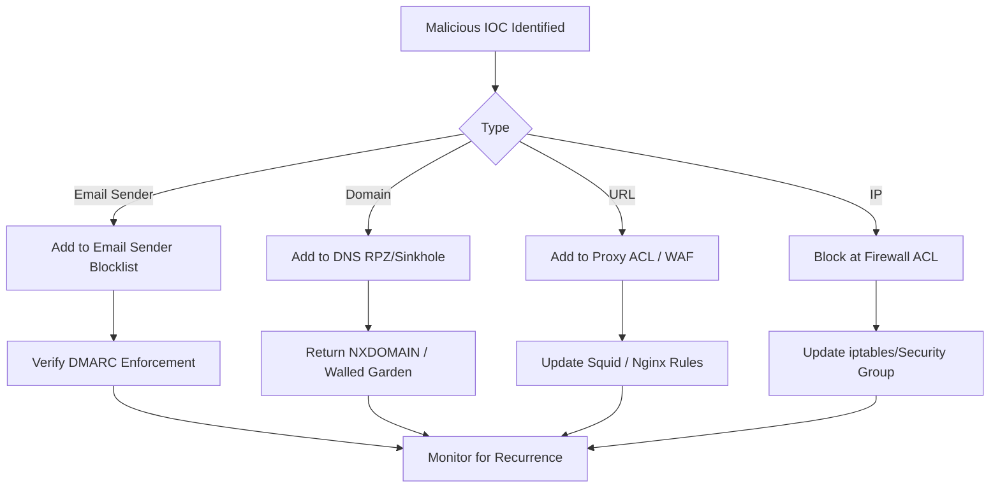
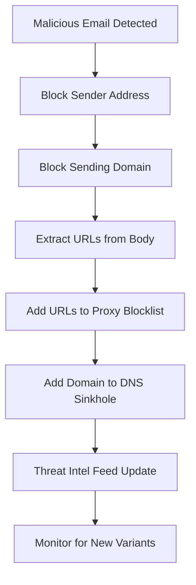

# Blocking Domains, URLs, and Sender Addresses

## TCM Exam Objectives

Before taking the PSAA exam, you must be able to:

- Identify indicators of a phishing email in email headers, body, and attachments
- Configure email analysis tools (Thunderbird, PhishTool) for forensic examination
- Implement and tune DMARC, SPF, and DKIM authentication to block spoofed email
- Execute phishing simulation campaigns to measure organizational risk
- Apply reactive defense measures: block domains, URLs, and sender addresses
- Perform email search and purge procedures for incident response
- Deliver user notification and remediation following a confirmed phishing incident
- Analyze email authentication results to determine spoofing vs. legitimate mail

Here's the �??full-stack�?� picture of how blocking works, from the email pipe to the browser, with where each control lives, how it works, and a config snippet at each layer.

---

## 0) Big picture: where blocking happens

Blocking is just a policy + a check point at a particular layer in the stack:

Key idea: Lower layers are broader and cheaper (affect many apps); upper layers are more precise (can match URLs, headers, payloads). Defense in depth = combine them.

---

## 1) Email: blocking sender domains and addresses

### 1.1) What you're actually blocking in email

Email has multiple �??sender�?� fields:
- Envelope sender (MAIL FROM / Return-Path) �?" used in SMTP and in SPF checks.
- Header From (the one users see) �?" used by client-side �??Blocked Senders�?� and some anti-spam lists.�?�turn10fetch0�?'

Blocking can target either, and different tools touch different fields.

### 1.2) The modern baseline: SPF/DKIM/DMARC (inbound side)

You don't have to maintain manual blocklists if receivers can detect spoofed senders via authentication:
- SPF: Publish which IPs/services are allowed to send from your domain. Receivers check the envelope sender's domain.�?�turn0search4�?'
- DKIM: Sign messages cryptographically; receivers verify the signature.�?�turn1fetch0�?'
- DMARC: Tie SPF/DKIM to the user-visible From domain and tell receivers what to do on failure: none (monitor), quarantine, or reject.�?�turn2search18�?'

Major providers now require these (at least SPF or DKIM; bulk senders need all three) and DMARC alignment for high-volume senders.�?�turn1fetch0�?'

If you enforce DMARC �??p=reject�?� for your own domains, receivers will effectively block unauthenticated mail pretending to be you.�?�turn2search18�?'

### 1.3) Inbound sender/domain blocks on your mail system

#### Cloud: Google Workspace (Gmail)

Admins can block specific addresses or entire domains; these rejections happen at SMTP time on top of normal spam filtering. Best used for persistent offenders, not for general spam handling.�?�turn2search10�?'

- Location: Google Admin console �?' Apps �?' Google Workspace �?' Gmail �?' Advanced settings.
- Scope: Organization or OUs; works for inbound and optionally for outbound too.�?�turn2search10�?'

#### Cloud: Microsoft 365 (Exchange Online)

Microsoft explicitly ranks block methods from most to least recommended: Tenant Allow/Block List first, then per-mailbox Blocked Senders, anti-spam policies, mail flow rules, and IP Block List.�?�turn10fetch0�?'

- Tenant Allow/Block List: Adds entries for domains/addresses (and spoofed senders); marked as high confidence spam (SCL 9), so action depends on your anti-spam policy (often quarantine).�?�turn10fetch0�?'
- Anti-spam policies: Blocked sender/domain lists; again, marked high confidence spam. Limit ~1,000 entries.�?�turn10fetch0�?'
- Mail flow (transport) rules: Very flexible (match headers, domains, words), but placed lower in the recommendation due to complexity and performance considerations.�?�turn10fetch0�?'
- IP Block List: Block connections from specific IPs at the connection filter layer.�?�turn10fetch0�?'

#### Self-hosted MTA example: Postfix

Classic method uses an access map checked in smtpd_recipient_restrictions (or smtpd_sender_restrictions) to REJECT specific senders/domains:

- Create a map file (e.g., /etc/postfix/sender_access):
  - To block a user: `user@abadboy.com REJECT`
  - To block a domain: `.badguy.net REJECT` (leading dot matches subdomains too).
- Build the map: `postmap hash:/etc/postfix/sender_access`
- Add to main.cf:
  - `smtpd_recipient_restrictions = check_sender_access hash:/etc/postfix/sender_access, permit_mynetworks, permit_sasl_authenticated, reject_unauth_destination`
- Reload Postfix.�?�turn2search3�?'

You can also reject based on missing PTR records, bad HELO, etc., in smtpd_sender_restrictions.�?�turn2search4�?'

### 1.4) Client-side rules (mailbox-level)

Most mail clients have a �??Blocked Senders�?� list that only affects that mailbox and typically checks the Header From. Examples:
- Gmail: Settings �?' Filters and Blocked Addresses �?' create a filter from:domain.com �?' Delete it.�?�turn2search14�?'
- Outlook desktop/web: Right-click �?' Block �?' or use Junk Email options; similar to M365's per-mailbox Blocked Senders.�?�turn10fetch0�?'

Caveat: Spammers often change the From address, so client-side blocks don't scale and aren't effective against real spam campaigns.�?�turn2search13�?'
---

## 2) DNS layer: blocking domains before any connection

This is the earliest network-wide control. If you control the DNS resolver clients use, you can make �??bad�?� domains unresolvable.

### 2.1) How DNS blocking works

- A resolver (or recursive DNS server) intercepts queries for blocked domains.
- Instead of returning the real IP, it returns:
  - NXDOMAIN (�??doesn't exist�?�), or
  - A �??walled garden�?� IP that serves a block page.�?�turn7fetch0�?'
- Because the client never gets a valid IP, no TCP connection is established �?" blocking happens before any HTTP/HTTPS/TLS traffic.�?�turn7fetch0�?'

This is more stable than IP blocks because domains change IPs far less often than malware rotates IPs; blocking at DNS stops connections even if the IP changes.�?�turn7fetch0�?'

### 2.2) Approaches and tools

- DNS �??firewall�?� / Response Policy Zones (RPZ): BIND 9.9+ and others can pull in threat feeds and rewrite responses for malware/phishing/botnet domains. RPZ is an open standard invented at ISC.�?�turn1fetch1�?'
- DNS sinkholes: Implement the same idea (rewrite to walled garden or NXDOMAIN). Common tools: BIND with RPZ, Unbound, or dedicated appliances. Many guides suggest Pi�?'hole for LAN deployments because it's easy to manage and visualizes queries.�?�turn7fetch0�?'�?�turn1fetch1�?'
- Cloud DNS with blocking: Cloudflare DNS Firewall, Quad9 (threat blocking), Route 53 DNS Firewall, etc.�?�turn1fetch1�?'

---

?? **Exam Tip:** Master the difference between capture filters and display filters. Capture filters (BPF) discard at kernel level; display filters only hide packets. Use capture filters for large PCAPs to reduce file size before analysis.

## 3) Web infrastructure: blocking domains and URLs in the HTTP path

Once DNS resolves, traffic still flows through proxies, web servers, and WAFs before it reaches your app.

### 3.1) Forward proxies (Squid)

Squid lets you build ACLs that match:
- Destination domain (`dstdomain`)
- URL or path patterns (`url_regex`, `urlpath_regex`)
- Source IP, time, method, etc.�?�turn1fetch3�?'

Pattern to block a list of domains:
- ACL element: `acl blocked_domains dstdomain "/etc/squid/blocked-domains.acl"`
- Deny rule: `http_access deny blocked_domains`
- In the file, one domain per line; prefix with a dot to include subdomains, e.g., `.example.com`.�?�turn0search14�?'

This inspects the HTTP request line and Host header, so it works for HTTP; for HTTPS you either:
- Block by domain (SNI/CONNECT) at the proxy, or
- Decrypt (TLS inspection) to inspect the full URL (more complex and invasive).�?�turn6search0�?'

### 3.2) Reverse proxy / web server (Nginx)

At the server edge, you can:
- Only serve traffic for your domains (implicit block of others) via `server_name`.
- Block specific domains by returning 444 or 403 before proxying to the app.

Minimal pattern:
- Explicit block server block (catches non-matching Hosts):
  - `server { listen 80 default_server; return 444; }`
- Your real site server block:
  - `server { listen 80; server_name example.com *.example.com; ... }`
- Result: Requests that don't match your domains are dropped immediately (444 closes the connection).�?�turn4fetch0�?'

### 3.3) Cloud WAF / CDN (AWS WAF, Azure Front Door)

Cloud WAFs inspect requests before they reach your origin and can match on:
- Host header / domain.
- URI path and query string (exact string, contains, or regex).
- Other headers, method, country, IP reputation, rate, etc.

Examples:
- AWS WAF supports Regex match and Regex pattern set match on URI query string, headers, etc. (PCRE/RE2 depending on feature).�?�turn5search0�?'�?�turn5search1�?'
- Azure Front Door WAF custom rules can match RequestUri and block with 403.�?�turn5search6�?'

These are powerful for URL-level blocking and are maintained centrally.

---

## 4) Application layer: app logic and browser-enforced policies

### 4.1) Application code (where full URLs are available)

Your app sees the full URL (path, query, fragments) and can make nuanced decisions:
- Maintain a blocklist table (DB/config) of patterns; match on path, query parameters, or route names.
- Return 403/404, redirect, or serve a friendly �??restricted�?� page.
- Because you have context (user identity, roles, resource ownership), you can enforce fine-grained policies (e.g., block `/admin` paths for non-admins).

### 4.2) Browser-enforced: Content Security Policy (CSP)

If your app serves web pages, you can use CSP to tell the browser which origins (domains/URLs) the page is allowed to load resources from �?" scripts, images, frames, etc. The browser enforces this client-side:
- Delivered via `Content-Security-Policy` response header (or `<meta>` tag).�?�turn11fetch0�?'�?�turn11fetch1�?'
- Example: `Content-Security-Policy: default-src 'self'; script-src 'self' https://cdn.example.com; frame-ancestors 'none';`
- Effect: The browser blocks inline scripts and any scripts not from `https://cdn.example.com`, and prevents framing (clickjacking).�?�turn11fetch0�?'�?�turn11fetch1�?'

CSP is primarily a defense-in-depth control against XSS and data injection, not a general URL filter, but it is an effective way to �??block�?� certain domains/URLs from being loaded by your pages.

---

## 5) Network edge: host- and path-based checks (and why IP-based blocking is fragile)

You can block traffic to specific IPs (with iptables/nftables, security groups, etc.), but domains often map to many IPs that change. Tools exist to script IP-based blocks for a domain, but they're fragile and require constant updates.�?�turn6search2�?'

There are also advanced techniques like string matching on the Host header or TLS SNI with iptables, but these break easily with encrypted traffic and are not generally recommended compared to DNS/proxy/WAF approaches.�?�turn6search3�?'�?�turn6search0�?'

---

## 6) Trade-offs and best practices by layer

- Email
  - Prefer authentication (SPF/DKIM/DMARC) over manual sender blocks; use blocklists for known bad actors. On M365, prefer Tenant Allow/Block List first.�?�turn1fetch0�?'�?�turn10fetch0�?'
  - Be careful with domain-wide blocks; they can block legit mail from large providers if you're too broad.
- DNS
  - DNS blocking is cheap, network-wide, and effective for known-bad domains; complement it with threat feeds (RPZ or cloud DNS firewalls).�?�turn1fetch1�?'�?�turn7fetch0�?'
- Proxy/WAF
  - Use forward proxies (Squid) for corporate/ LAN policy; use reverse proxies and cloud WAFs for public services.
  - For HTTPS URL inspection, consider necessity and privacy implications.
- App/Browser
  - Enforce URL-level policy in app code for precision and context; use CSP as a defense-in-depth measure to limit what the browser loads.�?�turn11fetch0�?'�?�turn11fetch1�?'

If you tell me your exact stack (e.g., �??I run Postfix + Nginx + a Node.js backend, and we use Google Workspace for email�?�), I can map out a concrete, end-to-end configuration tailored to that setup.

