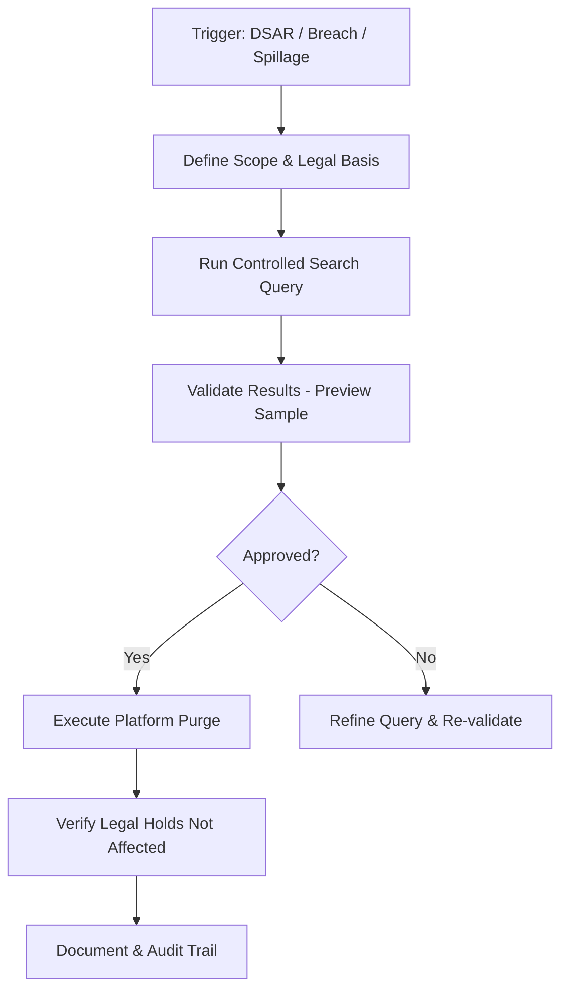
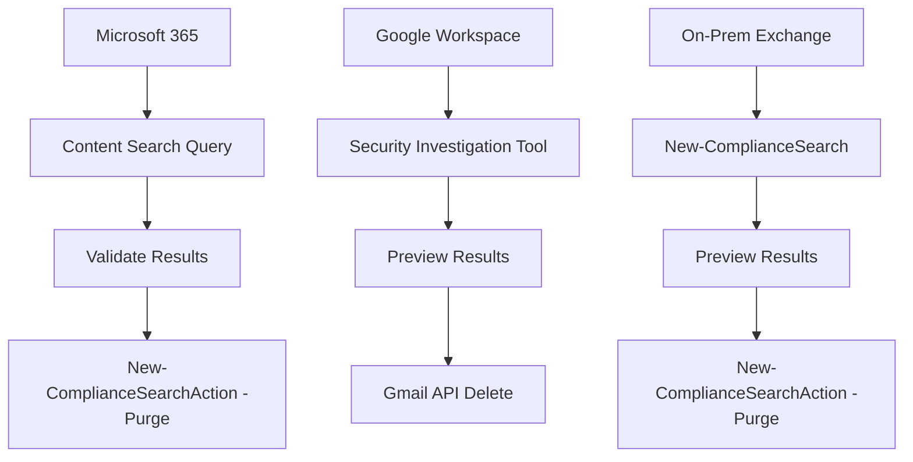

# Email Search and Purge Procedures

## TCM Exam Objectives

Before taking the PSAA exam, you must be able to:

- Identify indicators of a phishing email in email headers, body, and attachments
- Configure email analysis tools (Thunderbird, PhishTool) for forensic examination
- Implement and tune DMARC, SPF, and DKIM authentication to block spoofed email
- Execute phishing simulation campaigns to measure organizational risk
- Apply reactive defense measures: block domains, URLs, and sender addresses
- Perform email search and purge procedures for incident response
- Deliver user notification and remediation following a confirmed phishing incident
- Analyze email authentication results to determine spoofing vs. legitimate mail

Here's a �??full�?'stack�?� view of Email Search & Purge: from the legal/why, through architecture and tooling, down to the concrete steps and automation patterns.

---

## 1. What �??Email Search & Purge�?� Actually Means

In modern environments, �??search and purge�?� is not just �??delete email X�?�. It means:

1. **Define scope & legal basis** �?" Why are you deleting? (GDPR erasure, breach cleanup, legal hold, data spillage, retention policy enforcement.)
2. **Search & identify** �?" Run a controlled, logged query across mailboxes/archives to find exactly what must be removed.
3. **Validate** �?" Check and double�?'check that you're deleting the right items (and only those).
4. **Purge** �?" Use platform�?'specific tools to remove or �??hard delete�?� the data, and handle backups/holds appropriately.
5. **Document & audit** �?" Prove what you did, when, why, and who approved it.

---

## 2. High�?'Level Lifecycle

This is the generic lifecycle you should aim for, regardless of platform.

You'll see this same pattern in Microsoft 365, on�?'prem Exchange, Google Workspace, and third�?'party archivers.

---

## 3. Legal & Compliance Foundations (The �??Why�?�)

### 3.1 GDPR / Privacy Law Basics

For any email containing personal data (names, contact info, opinions about people, etc.), GDPR and similar laws require:

- **Storage limitation** �?" Keep personal data no longer than necessary for the purpose you collected it.�?�turn4fetch0�?'
- **Purpose limitation** �?" Once you no longer need the email for its original or a compatible purpose, it should be deleted or anonymized.�?�turn4fetch0�?'
- **Right to erasure (�??right to be forgotten�?�)** �?" If an individual asks you to delete their personal data, you must search your systems and remove it, without undue delay (typically around a month), unless an exemption applies.�?�turn4fetch0�?'

Important nuance: �??delete�?� in email is not a single thing. A GDPR�?'oriented guide breaks it down as:

| Deletion type                    | What it means                                       | GDPR�?'compliant?                      |
|----------------------------------|-----------------------------------------------------|--------------------------------------|
| User delete                      | Moves to Trash / Deleted Items                      | No �?" still exists                    |
| Hard delete                      | Purged from mailbox UI and recoverable folders      | Closer, but check backups            |
| Retention delete                 | System policy removes after set time                | Yes, if backups handled              |
| Backup reality                   | Still in backups until overwritten                  | OK if �??beyond use�?� and documented    |

Regulators accept that data may linger in backups, but you must put it **�??beyond use�?�** and be honest about that in your documentation.�?�turn4fetch0�?'

### 3.2 Sector�?'Specific Retention Rules

Industry rules often **override** �??delete as soon as possible�?�:

- Financial services (e.g., SEC/FINRA) may require 3�?"6 years of retention for certain communications.�?�turn4fetch1�?'
- Healthcare (HIPAA) may require up to 6 years for PHI.�?�turn4fetch1�?'
- Employment law may require keeping payroll/HR emails for several years after termination.�?�turn4fetch1�?'

Best practice: **always follow the strictest applicable rule** (longer retention if two rules conflict), unless you can segregate data by jurisdiction.�?�turn4fetch1�?'

### 3.3 Legal Holds

A **legal hold** pauses normal deletion for relevant custodians/data:

- When litigation or investigation is reasonably anticipated, you must **preserve** relevant data.
- IT suspends automatic retention/deletion and ensures affected mailboxes are not purged.�?�turn0search3�?'�?�turn0search4�?'
- Once the hold is lifted, data returns to normal retention rules or is deleted if no longer needed.�?�turn0search3�?'

**Search & purge must respect holds** �?" you cannot delete items under legal hold.
---

## 4. Architecture: Where Email Lives & How to Touch It

Typical stack:

- **Primary mail system**
  - Microsoft 365 / Exchange Online
  - On�?'prem Exchange Server 2016/2019
  - Google Workspace Gmail
- **Archiving / eDiscovery layer**
  - Microsoft Purview eDiscovery / Compliance Search
  - Google Vault
  - Third�?'party archiving (Barracuda, Mimecast, Veritas, etc.)
- **Identity & access**
  - Admin roles (eDiscovery Manager, Organization Management, Vault Admin, etc.)
  - PAM / MFA for purge�?'capable accounts
- **Logging & monitoring**
  - Audit logs in Purview / Vault / Admin console
  - SIEM integration for high�?'risk actions
- **Backup / DR**
  - Email backups (Exchange, Google Vault exports, snapshots)
  - Object stores (S3, Blob) with their own retention policies

Search & purge tools typically work at the **mail system or archiving layer**, not directly on raw database files, to ensure consistency and auditability.
---

?? **Exam Tip:** Always save a copy of the original evidence before performing any analysis. Reference specific packet numbers, event IDs, and timestamps to demonstrate thorough investigation.

## 5. Platform�?'Specific Search & Purge Mechanics

### 5.1 Microsoft 365 (Exchange Online / Purview)

Core tools:

- **Content Search** �?" find items across mailboxes, Teams, etc.�?�turn3fetch0�?'
- **Compliance Search PowerShell** �?" `New-ComplianceSearch`, `Start-ComplianceSearch`, `New-ComplianceSearchAction`.�?�turn3fetch0�?'�?�turn1fetch1�?'
- **Data Security Investigations** �?" newer portal with a dedicated purge queue dashboard.�?�turn3fetch0�?'

Key points:

- **Separation of duties**:
  - To **search**: eDiscovery Manager or Compliance Search role.
  - To **purge**: Organization Management or Search And Purge role in the **Purview** portal (not the same as Exchange Org Management).�?�turn3fetch0�?'
- **Limits**:
  - Non�?'premium eDiscovery: up to **10 items per mailbox** in a purge; PowerShell only.�?�turn3fetch0�?'
  - eDiscovery premium: up to **100 items per location**, can use PowerShell or Microsoft Graph (don't mix).�?�turn3fetch0�?'
- **What happens on purge**:
  - Items are moved to a hidden **Purges** folder (hard delete from user perspective).
  - If single item recovery is on (default), they stay in Purges for the deleted item retention period, then are permanently removed when the Managed Folder Assistant processes the mailbox.�?�turn1fetch1�?'�?�turn0search6�?'
- **Use cases**:
  - Data spillage (sensitive data sent to wrong people).
  - Phishing or malware outbreaks.
  - Compliance violations requiring immediate removal.
- **Not intended for**:
  - Routine mailbox cleanup or quota management �?" use retention policies and archive policies instead.�?�turn3fetch0�?'

Typical Microsoft 365 search & purge flow:

1. Assign required roles (eDiscovery Manager + Search And Purge).�?�turn1fetch1�?'
2. Create & start a Content Search matching the target emails.�?�turn1fetch1�?'
3. Validate results (preview, export report�?'only).�?�turn3fetch0�?'
4. Run purge via PowerShell:
   - `New-ComplianceSearchAction -SearchName "Your Search" -Purge -PurgeType HardDelete`�?�turn1fetch1�?'
5. Monitor status; wait for Purges folder retention to expire and Managed Folder Assistant to permanently remove.

### 5.2 On�?'Prem Exchange Server (2016/2019/SE)

Very similar model to M365:

- Cmdlets: `New-ComplianceSearch`, `Start-ComplianceSearch`, `New-ComplianceSearchAction` for search & delete.�?�turn6fetch0�?'
- Older `Search-Mailbox -DeleteContent` still exists but:
  - Limited to 10,000 mailboxes per search.
  - `New-ComplianceSearch` has no such limit, so it's preferred for large orgs.�?�turn6fetch0�?'
- Same pattern:
  - Create compliance search.
  - Start search.
  - Estimate & verify.
  - Run `New-ComplianceSearchAction` with purge parameters.�?�turn6fetch0�?'
- Also has a **10 items per mailbox** limit per purge, as it's meant for incident response, not general cleanup.�?�turn6fetch0�?'

### 5.3 Google Workspace (Gmail + Google Vault)

Conceptually different:

- **Google Vault** is primarily an **information governance & eDiscovery** tool:
  - Set **retention rules** to keep or delete Gmail data after a certain period.�?�turn1fetch2�?'�?�turn7search0�?'
  - Retention rules control data in Vault; they don't directly delete from user inboxes by themselves.�?�turn7search2�?'
  - Default Gmail: user delete �?' Trash 30 days �?' admin can restore up to another 25 days �?' then permanently gone.�?�turn1fetch2�?'
- **To delete specific emails from user mailboxes**:
  - Use the **Security Investigation Tool** (G Suite/Workspace Enterprise) to find and remove messages across accounts.�?�turn11fetch0�?'
  - Or use the **Gmail API** in a script to delete by query/message ID.�?�turn11fetch0�?'
- Vault + Investigation Tool pattern:
  - Vault: retention, holds, and long�?'term governance.
  - Investigation Tool: targeted �??search & purge�?� for incidents (malware, data spillage, etc.).�?�turn11fetch0�?'

### 5.4 Third�?'Party Archiving / Backup Vendors

Most enterprise archiving products (Barracuda, Mimecast, Veritas, etc.) expose:

- **Search UI** with Boolean/full�?'text queries.
- **Bulk actions** �?" delete, move to hold, export.
- **Audit logs** for every purge operation.

Patterns are the same: design query �?' validate �?' approve �?' purge �?' document.

---

## 6. Designing a Robust Search & Purge Procedure (Full�?'Stack Template)

Use this as a baseline you can adapt to your environment.

### 6.1 Step 1 �?" Trigger & Triage

- Identify trigger:
  - Data subject erasure request (GDPR/CCPA).
  - Confirmed data breach / spillage.
  - Phishing/malware outbreak.
  - Court order or regulatory request.
  - Internal policy violation.
- Initial triage:
  - What kind of data is involved? (Personal data, credentials, trade secrets, regulated data.)
  - What is the likely scope? (Number of users, mailboxes, date range.)
  - Any legal holds or ongoing investigations that might be affected?

### 6.2 Step 2 �?" Legal & Privacy Check

- Consult privacy/legal:
  - Is there a **legal basis** to delete (or an obligation to retain)?
  - Are there **legal holds** that block deletion?
  - Do you need to notify regulators or data subjects (e.g., breach notification)?
- Document:
  - Decision, reason, and who approved.

### 6.3 Step 3 �?" Scope & Query Design

Define the **search** precisely:

- Platforms & locations:
  - Which mail systems (M365, on�?'prem, Google Workspace, archives).
  - Which mailboxes (all, specific OUs, specific users).
- Query criteria:
  - Sender/recipient domains or addresses.
  - Date ranges.
  - Subject/body keywords, message IDs, headers.
  - Sensitivity labels or sensitive info types (where supported).�?�turn3fetch0�?'
- Consider:
  - Start narrow; broaden only if needed.
  - Use test/estimate runs first.

### 6.4 Step 4 �?" Run Search & Estimate

- Run the search in **estimate/preview mode** first:
  - M365: Content Search with preview and estimate statistics.�?�turn3fetch0�?'�?�turn6fetch0�?'
  - On�?'prem: Compliance Search with `Get-ComplianceSearch` to inspect counts.�?�turn6fetch0�?'
  - Google: Investigation Tool or Vault search with counts.
- Export a **report�?'only** or sample set to verify correctness before any purge.�?�turn3fetch0�?'

### 6.5 Step 5 �?" Review & Validate

- Have a second person (or team) review:
  - Sample of items to ensure they match the intent.
  - No clearly irrelevant items (e.g., unrelated legal hold data).
- Sign�?'off:
  - Technical reviewer confirms query correctness.
  - Legal/privacy confirms compliance.
  - Approver signs off on purge.

### 6.6 Step 6 �?" Approve Purge

- Formal approval record:
  - Ticket or request ID.
  - Approver name, role, date.
  - Justification & scope summary.
- Ensure:
  - No active legal holds block deletion.
  - Backups and DR are considered (see Step 8).

### 6.7 Step 7 �?" Execute Purge

Platform�?'specific examples:

- **Microsoft 365 / Exchange Online**:
  - Use Content Search + `New-ComplianceSearchAction -Purge -PurgeType HardDelete`.�?�turn1fetch1�?'
  - Respect item�?'per�?'mailbox limits; split into batches if needed.�?�turn3fetch0�?'
- **On�?'prem Exchange**:
  - `New-ComplianceSearch` + `New-ComplianceSearchAction` or `Search-Mailbox -DeleteContent` (with caution).�?�turn6fetch0�?'�?�turn5search4�?'
- **Google Workspace**:
  - Use Security Investigation Tool or Gmail API scripts to delete messages from user mailboxes.�?�turn11fetch0�?'
  - Ensure Vault retention rules are aligned (Vault may still retain copies according to its rules).�?�turn7search0�?'
- Third�?'party archiving:
  - Follow vendor's purge workflow, ensure logs are captured.

### 6.8 Step 8 �?" Handle Holds & Backups

- **Holds**:
  - Confirm purge did not violate any legal holds; if it did, escalate to legal immediately (you may need to recover from backup).
- **Backups**:
  - Regulators generally accept that data may persist in backups until they are rotated, provided it's effectively �??beyond use�?�.�?�turn4fetch0�?'
  - For highly sensitive incidents, you may:
    - Mark backup copies as �??restricted�?� and ensure they're not routinely restored.
    - Run a separate purge job on backup systems if technically feasible.
    - Document the backup retention and deletion schedule.

### 6.9 Step 9 �?" Document & Audit

- Record at least:
  - Trigger & reference (ticket, DSAR ID, incident ID).
  - Legal/privacy approval.
  - Query definition & scope.
  - Number of items/mailboxes affected.
  - Timestamps of search and purge.
  - Outcome (success/partial/failure).
  - Any exceptions (e.g., �??items under legal hold skipped�?�).
- Store logs:
  - Platform audit logs (Purview, Vault, Investigation Tool, archiver).�?�turn0search12�?'�?�turn3fetch0�?'
  - Ticketing system / GRC tool.

---

## 7. Automation & �??Full�?'Stack�?� Patterns

### 7.1 Search & Purge as Code

Where APIs exist, you can automate:

- **Microsoft 365 / Exchange**:
  - Use Security & Compliance PowerShell or Microsoft Graph to script:
    - Create compliance search.
    - Start search.
    - Poll status.
    - Run purge action when ready.�?�turn1fetch1�?'�?�turn3fetch0�?'
  - Wrap in a runbook with approval gates.
- **Google Workspace**:
  - Use Gmail API or GAM/Google Apps Script to:
    - Search messages by query or ID.
    - Delete or archive them programmatically.�?�turn11fetch0�?'
- **General**:
  - Store query definitions in version control.
  - Require peer review for query changes.
  - Log every automated run to an audit store.

### 7.2 Integrating with ITSM / GRC

- Create a standard **�??Email Search & Purge�?�** request type in your ITSM tool:
  - Fields: requestor, justification, data category, date range, platforms, approval chain.
- Link to:
  - Privacy Impact Assessment (PIA) or Data Protection Impact Assessment (DPIA) for recurring purges.
  - GRC risk records for high�?'risk scenarios (e.g., large�?'scale erasure).

### 7.3 Self�?'Service for Data Subjects

For **right�?'to�?'erasure** at scale, consider:

- A privacy portal where users can request deletion of their personal data.
- Backend workflows that:
  - Discover email & other data related to that user.
  - Exclude items under legal hold.
  - Run platform�?'specific purge jobs.
  - Confirm completion and update the DSAR record.

---

## 8. Common Pitfalls & How to Avoid Them

1. **Purging under legal hold**  
   - Always check holds first; implement a control so purge tools fail if holds are present.

2. **Overly broad queries**  
   - Start small, use estimates, and validate samples; avoid `*` or very generic keywords.

3. **Ignoring backups & DR**  
   - Document backup retention and how long data may persist; align with legal expectations of �??beyond use�?�.�?�turn4fetch0�?'

4. **Mixing PowerShell and Graph for the same case**  
   - Microsoft explicitly warns not to mix both for purge actions in the same case.�?�turn3fetch0�?'

5. **Using purge for routine cleanup**  
   - Microsoft recommends purge only for data spillage / incidents, not routine mailbox management; use retention policies instead.�?�turn3fetch0�?'

6. **No audit trail**  
   - Ensure every purge action is logged and linked to an approved ticket; regulators will ask for this.

---

## 9. A Minimal, Practical Checklist

If you need something you can turn into an SOP tomorrow:

1. Define trigger categories (DSAR, breach, legal, compliance).
2. Map each platform to its search & purge tools:
   - M365: Content Search + Purview eDiscovery purge.
   - On�?'prem Exchange: Compliance Search / Search�?'Mailbox.
   - Google Workspace: Security Investigation Tool / Gmail API + Vault retention.
3. Document role requirements and separation of duties.
4. Create a standard request form and approval flow.
5. Define query patterns for common scenarios (phishing, misdirected PII, DSAR).
6. Always run estimate/preview first and get sign�?'off.
7. Record every action in an audit log and ticket.
