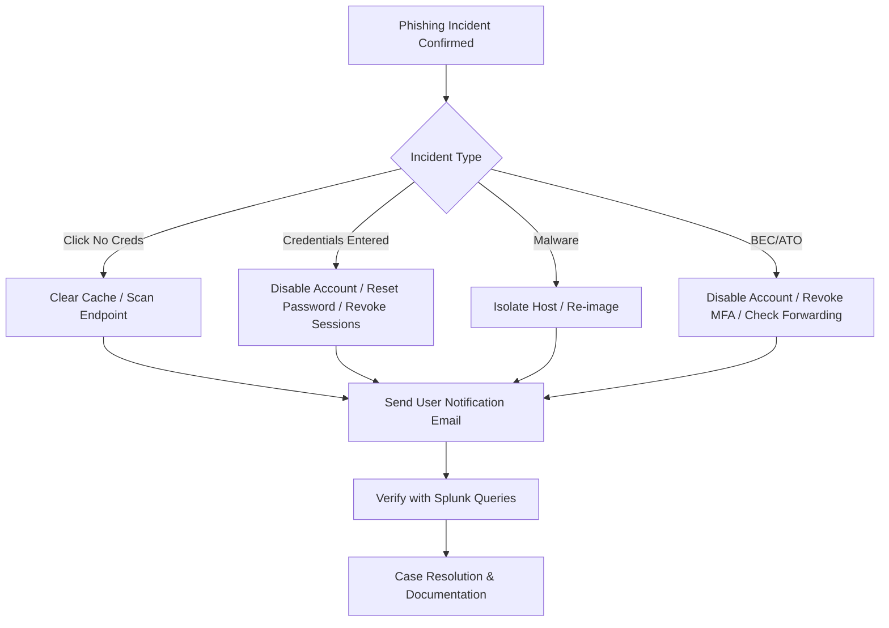
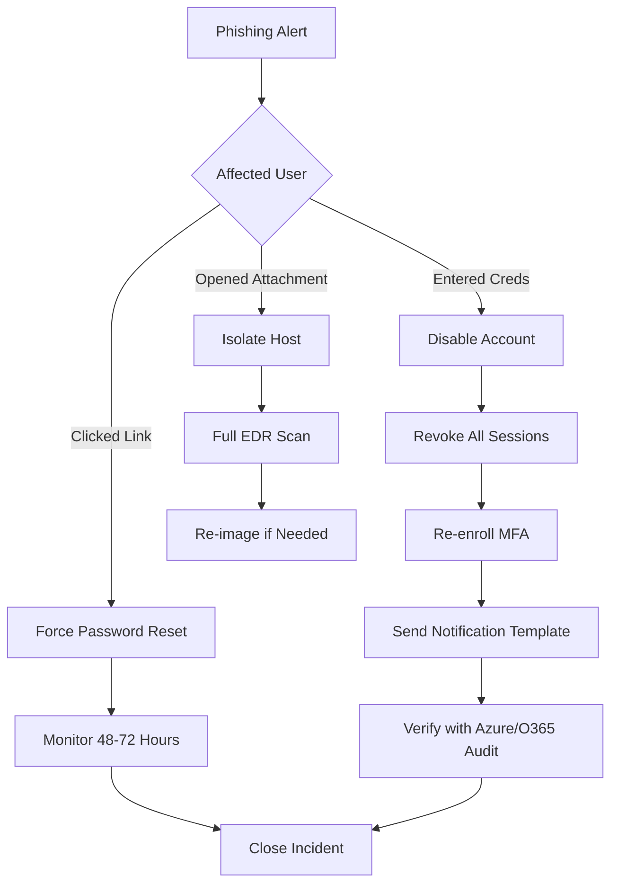

# User Notification and Remediation

## TCM Exam Objectives

Before taking the PSAA exam, you must be able to:

- Identify indicators of a phishing email in email headers, body, and attachments
- Configure email analysis tools (Thunderbird, PhishTool) for forensic examination
- Implement and tune DMARC, SPF, and DKIM authentication to block spoofed email
- Execute phishing simulation campaigns to measure organizational risk
- Apply reactive defense measures: block domains, URLs, and sender addresses
- Perform email search and purge procedures for incident response
- Deliver user notification and remediation following a confirmed phishing incident
- Analyze email authentication results to determine spoofing vs. legitimate mail

User notification and remediation fall under the Containment, Eradication, and Recovery phases of the NIST Incident Response Framework. After confirming a user interacted with a malicious email, the SOC analyst must notify the affected individual, execute technical remediation steps (password reset, session revocation, host isolation), and verify completion using SIEM queries. The PSAA exam tests the ability to choose the correct remediation actions and draft professional user notifications.?turn0search0?

- Fundamentals of user notification
- The notification process and templates
- Remediation actions by incident type
- Automation with SOAR playbooks
- Verification using Splunk queries


## When Notification is Required

Notify users when there is evidence that:
- They interacted with a malicious email (clicked a link, opened an attachment)
- They entered credentials into a phishing page
- Their account shows signs of takeover (anomalous logins, forwarding rules)
- Malware was executed on their endpoint
- Sensitive data was exfiltrated from their device or account
---



## The User Notification Process

### Key Components of a Good Notification

1. Clear subject line (e.g., "URGENT: Security Incident - Immediate Action Required")
2. Friendly greeting addressing the user by name
3. Incident summary in simple terms
4. Actions required by the user (reset password, contact SOC)
5. What the SOC is doing (account locked, investigation ongoing)
6. Timeline for follow-up
7. Contact information
8. Reassurance that this is not a blame exercise

### Notification Templates

**Template - Phishing Click (No Credentials Entered)**:
```
Subject: Security Alert - Action Required Regarding a Suspicious Email

Hi [User Name],

Our security team detected that you recently clicked on a link in a suspicious email. While we have blocked the malicious website, we want to ensure your device and accounts remain safe.

Please:
1. Do not enter any passwords on your device until confirmed safe.
2. Run a quick scan using [Endpoint Protection tool].
3. Contact the IT Help Desk if you notice any unusual activity.

Your accounts have not been compromised based on initial analysis.

- Security Operations Center
```

**Template - Credential Compromise**:
```
Subject: URGENT - Security Incident: Your Password May Be Compromised

Hi [User Name],

We detected that you entered your company credentials on a fraudulent website. We have:
- Disabled your account
- Terminated active sessions
Please reset your password NOW at [Password Reset Portal Link].
Re-enroll in MFA at [MFA Portal Link].

- Security Operations Center
```

Do's: be timely, empathetic, provide specific steps. Don'ts: blame or shame the user, share technical IOCs.

---

?? **Exam Tip:** Always save a copy of the original evidence before performing any analysis. Reference specific packet numbers, event IDs, and timestamps to demonstrate thorough investigation.


## Remediation Actions by Incident Type

### Phishing Click (No Credentials Entered)

- **Containment**: Check proxy/firewall logs to confirm block. If link led to malware download, proceed to Malware Execution path.
- **Eradication**: Clear browser cache, run endpoint quick scan.
- **Recovery**: No password reset required. Educate user with brief reminder.

### Credential Harvesting (User Submitted Credentials)

- **Containment**: Disable account immediately, revoke all sessions, reset password, require MFA re-registration.
- **Eradication**: Check for inbox rules (forwarding, deletion), OAuth app consents, email forwarding configuration.
- **Recovery**: After password reset and MFA re-enrollment, re-enable account. Monitor for 48-72 hours.

### Malware Execution (User Opened Attachment)

- **Containment**: Isolate host from network, disable user account.
- **Eradication**: Initiate full EDR scan. If malware confirmed, re-image the device.
- **Recovery**: Rebuild from known-good image, restore data from clean backup.

### BEC / Account Takeover

- **Containment**: Disable account, revoke sessions and MFA tokens, reset password, freeze financial transactions if wire fraud involved.
- **Eradication**: Remove forwarding rules, hidden rules, OAuth applications. Search for email traces sent during compromise.
- **Recovery**: Work with business units to recall fraudulent emails.

---

## Verification Using Splunk Queries

```splunk
index=azure sourcetype=azure:audit OperationName="Reset user password" TargetUser="user@company.com"
| table _time, InitiatedBy, Result

index=azure sourcetype=azure:audit OperationName="Update user" TargetUser="user@company.com"
| search ModifiedProperties{}.Name="RefreshTokensValidFromDateTime"
| table _time, InitiatedBy, Result

index=o365 sourcetype=o365:management Operation="New-InboxRule" UserId="user@company.com"
| table _time, Parameters

index=azure OperationName="User registered security info" TargetUser="jdoe@company.com"
| table _time, Result
```


---

## Quick Reference

| Incident Type | Key Remediation Actions | Verification |
| :--- | :--- | :--- |
| **Phishing Click (No Creds)** | Scan endpoint, clear cache, educate user | Proxy logs showing block, EDR scan results |
| **Credential Compromise** | Disable account, revoke sessions, reset password, re-enroll MFA, remove inbox rules | Azure AD Reset user password, Update user (RefreshTokensValidFromDateTime) |
| **Malware Execution** | Isolate host, re-image, reset credentials | EDR isolation event, scan completion |
| **BEC / Account Takeover** | Disable, reset, revoke, remove forwarding, alert finance | O365 Set-Mailbox (forwarding), New-InboxRule |
| **Data Exfiltration** | Block destination, isolate, assess data loss, legal notification | DLP alerts, proxy logs for large upload |

---

## Recap

