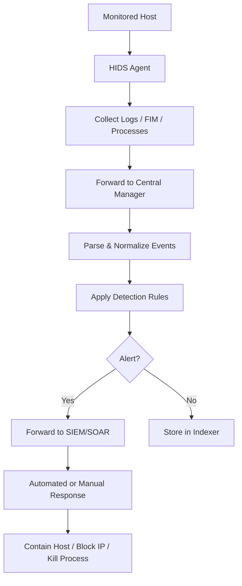
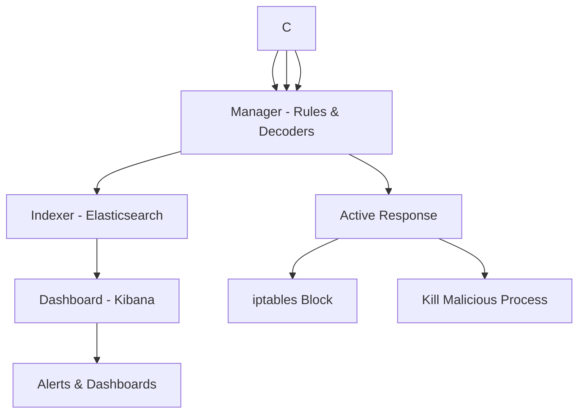

# Host Intrusion Detection Systems (HIDS)

## TCM Exam Objectives

Before taking the PSAA exam, you must be able to:

- Differentiate between HIDS and NIDS and their appropriate deployment scenarios
- Compare signature-based vs. anomaly-based detection methodologies
- Describe Snort and Suricata architectures, modes, and runmodes
- Explain inline vs. out-of-band monitoring and when to use each
- Compare flow data analysis (NetFlow/IPFIX) with full packet capture (PCAP)
- Interpret IDS/IPS alert fields for triage and incident response
- Deploy and configure network monitoring using TAPs and SPAN ports
- Correlate NIDS alerts with other telemetry sources for incident validation

Here's a �??full�?'stack�?� lesson on Host Intrusion Detection Systems (HIDS): from concepts and architecture, to data sources, detection logic, deployment, operations, and how they fit into a modern security program.

---

## 1. What is a HIDS? (And what it isn't)

**Core idea:**  
A Host Intrusion Detection System (HIDS) is software that monitors activity **inside a host** (server, laptop, container, VM) to detect malicious or suspicious behavior: unauthorized changes, weird process activity, logins, policy violations, etc.�?�turn0search9�?'

It contrasts with:

- **NIDS (Network IDS)**: monitors network traffic (packets/flows) for attacks like port scans, exploits, C2 communication.�?�turn0search6�?'�?�turn0search8�?'
- **HIPS (Host IPS)**: not only detects but also **prevents** (blocks) malicious host activity (e.g., terminating processes, blocking IPs). Many HIDS tools can act as HIPS when �??active response�?� is enabled.�?�turn0search11�?'�?�turn0search14�?'

You typically run **HIDS + NIDS together** for layered visibility: network�?'level + host�?'level.�?�turn0search8�?'�?�turn0search9�?'

---

## 2. HIDS high�?'level architecture

Most modern HIDS follow a **manager�?"agent** model (OSSEC, Wazuh, osquery + Fleet, etc.).�?�turn0search10�?'�?�turn0search15�?'�?�turn1search3�?'

**Key components**

1. **HIDS Agent (on each host)**
   - Collects: logs, file hashes, process & user info, configuration, etc.
   - May also: run queries (osquery), do FIM, audit system calls.
   - Forwards events to central manager.

2. **Manager / Server**
   - Receives events from all agents.
   - Parses, normalizes, and evaluates rules/decoders.
   - Maintains state (e.g., FIM baselines) and configuration.�?�turn0search10�?'�?�turn0search15�?'

3. **Indexer / Storage**
   - Stores raw and enriched events (e.g., Elasticsearch in Wazuh).�?�turn0search15�?'

4. **Dashboard / SIEM**
   - UI for alerts, dashboards, compliance reports, agent health.�?�turn0search16�?'�?�turn0search19�?'
   - Often integrated with SIEM/SOAR for correlation and automation.�?�turn1search5�?'�?�turn1search7�?'

---

## 3. What does a HIDS actually monitor?

Typical data sources and checks (varies by tool):

| Category                        | Examples                                                                 | Why it matters                                      |
|---------------------------------|--------------------------------------------------------------------------|-----------------------------------------------------|
| **File integrity**              | Changed files, new files, deleted files in /bin, /etc, web roots        | Detects backdoors, rootkits, malware drops          |
| **Log monitoring**              | Auth logs, sudo, Windows Security Event Log, app logs                    | Brute�?'force, privilege escalation, abuse            |
| **Process & command monitoring**| Running processes, command lines, parent�?"child relationships             | Reverse shells, living�?'off�?'the�?'land binaries        |
| **User & identity**             | Logins, SSH sessions, user changes, group modifications                 | Unauthorized access, credential compromise          |
| **Configuration checks**        | CIS benchmarks, world�?'writable files, insecure settings                 | Misconfigurations that lower the bar for attacks    |
| **Network sockets**             | Listening ports, outbound connections                                    | Unexpected services or C2 channels                  |
| **OS query tables (osquery)**   | `processes`, `socket_events`, `file_events`, `system_info`, etc.�?�turn1search1�?'�?�turn1search3�?' | Real�?'time SQL�?'like visibility into the OS          |
| **Cloud / container context**   | Cloud instance metadata, container image & runtime info�?�turn0search15�?' | Detects cloud�?'specific and container�?'specific attacks |

---

## 4. How detection works: signatures, anomalies, and rules

Most HIDS today are **rule�?'based** with some anomaly/UEBA add�?'ons.

1. **Signatures / rules**
   - �??If event matches pattern X �?' raise alert at level Y.�?�
   - Example OSSEC/Wazuh rule: �??authentication failure from IP more than 5 times in 120 seconds �?' level 8 alert.�?��?�turn0search10�?'�?�turn0search3�?'
   - Rules are grouped: auth, syslog, web, malware, etc.�?�turn0search10�?'

2. **Decoders**
   - Parse raw logs into fields (user, srcip, program, etc.) before rules run.�?�turn0search10�?'

3. **State & baselines**
   - FIM: hash & permission baseline; alert on any change.�?�turn0search10�?'�?�turn0search9�?'
   - Baseline of users/schedules to detect anomalies (e.g., admin logging in at 3am).

4. **Anomaly / behavior (often via SIEM/UEBA)**
   - �??This host beacons to an unusual external IP every 60s.�?�
   - �??User X logged in from 5 countries in 10 minutes.�?��?�turn1search7�?'

5. **Active response (optional HIPS behavior)**
   - Trigger scripts on alerts: block IP, kill process, lock account.�?�turn0search11�?'�?�turn0search14�?'
   - Powerful but risky (can break production); use cautiously.
---

## 5. Concrete HIDS stacks you should know

### 5.1 OSSEC / Wazuh (classic HIDS �?' SIEM)

**OSSEC** is a mature, open�?'source HIDS; **Wazuh** is a fork that extended OSSEC into a broader SIEM/vulnerability/compliance platform.�?�turn0search3�?'�?�turn0search15�?'

**OSSEC architecture (core)**�?�turn0search10�?':

- **Manager**: stores rules, decoders, FIM databases; receives events from agents and syslog.
- **Agents**: run on each host, collect logs, do FIM, rootkit checks, send data to manager on port 1514/UDP.
- **Active response**: executes commands on agent/server in response to alerts (e.g., block IP).�?�turn0search11�?'�?�turn0search14�?'

**Wazuh architecture**�?�turn0search15�?':

- **Wazuh agent**: multi�?'platform, collects logs & FIM & config data.
- **Wazuh server**: manager + analysis engine.
- **Wazuh indexer**: Elasticsearch�?'based storage.
- **Wazuh dashboard**: Kibana�?'based UI for alerts, compliance, FIM, vulnerabilities.�?�turn0search16�?'�?�turn0search19�?'

Wazuh effectively behaves as **HIDS + SIEM + vulnerability scanner + compliance monitor**.�?�turn0search3�?'�?�turn0search15�?'

---

### 5.2 osquery + Fleet (SQL�?'based HIDS)

**osquery** exposes OS data as SQL tables (processes, sockets, file_events, etc.) and can run scheduled/live queries.�?�turn1search1�?'�?�turn1search3�?'

- **osquery daemon** on each host runs queries and emits logs.
- **Fleet manager** (or Kolide Launcher, etc.) distributes queries, collects results, manages configuration.�?�turn1search0�?'�?�turn1search4�?'

Conceptually:

- HIDS agent = osquery + launcher.
- Manager = Fleet.
- Storage/UI = your SIEM / Elastic / custom.

Great for **programmatic, SQL�?'driven detection** and threat hunting.

---

### 5.3 Commercial HIDS / EDR

Many modern products blur the line between HIDS, EDR, and XDR:

- Traditional HIDS (OSSEC/Wazuh) plus:
  - Endpoint detection & response (process behavior, memory, exploits).
  - Cloud workload protection.
  - SOAR integrations.

Examples: CrowdStrike, SentinelOne, Carbon Black, etc. They still do **host�?'level intrusion detection**, but with richer telemetry and more automation.

---

?? **Exam Tip:** Master the difference between capture filters and display filters. Capture filters (BPF) discard at kernel level; display filters only hide packets. Use capture filters for large PCAPs to reduce file size before analysis.

## 6. Deploying HIDS: a practical playbook

### 6.1 Decide where to put agents

Start with:

- **High�?'value targets**: domain controllers, critical app servers, DBs, jump hosts.
- **Internet�?'facing systems**: web servers, mail relays, VPN gateways.
- **Sensitive workstations**: admin laptops, developer boxes with prod access.

Then expand to broader fleet as you mature.

### 6.2 Choose your stack

- **Small / lab / budget�?'constrained**: OSSEC or Wazuh on a single VM + agents.
- **Medium / enterprise**: Wazuh cluster or osquery + Fleet + SIEM.
- **Already invested in SIEM**: send HIDS telemetry (syslog/CEF) into it for correlation.�?�turn0search12�?'�?�turn1search5�?'

### 6.3 Basic deployment pattern (Wazuh�?'like)

1. **Deploy central components**
   - Manager / server, indexer, dashboard (often containerized).�?�turn0search15�?'�?�turn0search16�?'
   - Set TLS, auth, and network policies.

2. **Deploy agents**
   - Install agent packages on hosts; point them to manager.
   - Enroll agents (auto�?'registration or manual) and verify connectivity.�?�turn0search10�?'�?�turn0search15�?'

3. **Configure data sources**
   - Enable log paths (auth, web, app logs).
   - Enable FIM for critical directories.
   - Enable configuration checks (CIS, PCI, etc.).�?�turn0search9�?'�?�turn1search6�?'

4. **Tune rules and decoders**
   - Start with defaults; adjust levels and thresholds to your environment.�?�turn1search6�?'�?�turn1search8�?'
   - Suppress known benign patterns (e.g., backup scripts that modify many files).

5. **Integrate with SIEM/SOAR**
   - Forward alerts via syslog/CEF/JSON.�?�turn0search12�?'�?�turn1search5�?'
   - Use SIEM for correlation and long�?'term analytics; HIDS for host�?'specific logic.�?�turn1search7�?'

---

## 7. Operating HIDS: day�?'to�?'day

### 7.1 Monitoring & triage

- Use the HIDS dashboard / SIEM to:
  - Watch alert levels and trends.
  - Triage: investigate high�?'severity alerts, correlate with NIDS/EDR.
- Typical triage questions:
  - Which host? What user? What process/command?
  - Does this match a known attack pattern or internal change ticket?
  - Any related NIDS or proxy logs?

### 7.2 Tuning & reducing noise

- **Tune rules**:
  - Increase thresholds for noisy but benign patterns.
  - Exclude specific hosts/users/processes where appropriate.
- **Whitelist legitimate changes**:
  - Change windows, admin scripts, config management runs.
- **Document tuning** so the SOC understands why certain alerts are suppressed.�?�turn1search6�?'�?�turn1search8�?'

### 7.3 Maintaining agents & manager

- Keep agents up to date; rotate enrollment keys if compromised.
- Monitor agent health (connected, last event time).�?�turn0search19�?'
- Scale manager/indexer horizontally for large fleets.�?�turn0search18�?'

### 7.4 Incident response integration

- Use HIDS as:
  - **Detection source**: alert on suspicious host behavior.
  - **Investigation tool**: live queries (osquery) to validate hypotheses.�?�turn1search4�?'
  - **Containment enabler**: via active response or SOAR actions (isolate host, block IP).�?�turn0search11�?'�?�turn1search7�?'

---

## 8. Hardening and extending HIDS

### 8.1 Secure the HIDS itself

- **Protect manager and agents**:
  - Encrypt agent�?"manager communication (TLS/Wazuh, VPNs, etc.).�?�turn0search15�?'
  - Restrict manager access (admin interface, API).
  - Sign/verify agent packages and configs.
- **Log the HIDS**:
  - Send HIDS operational logs to a separate, protected SIEM index.
- **Segregate duties**:
  - HIDS admins vs. SOC analysts vs. system owners.

### 8.2 Richer context & integrations

- **Asset & inventory integration**:
  - Enrich alerts with CMDB data (owner, environment, criticality).
- **Identity integration**:
  - Map HIDS users to directory accounts; join with IAM/UEBA.�?�turn1search7�?'
- **Cloud & containers**:
  - Use cloud�?'aware queries and FIM for Docker/Kubernetes/VMware.�?�turn0search15�?'
- **Threat intel**:
  - Match hashes, domains, IPs against IOCs from threat intel platforms.

---

## 9. Common pitfalls and how to avoid them

| Pitfall                                  | Impact                                         | Mitigation                                                   |
|------------------------------------------|------------------------------------------------|--------------------------------------------------------------|
| Deploying HIDS on everything at once     | Alert storm, burnout, �??cry wolf�?�              | Start small, tune, then expand gradually�?�turn1search8�?'     |
| Ignoring FIM baselines / false positives | Overwhelmed by changes from patches, CM tools | Whitelist change windows and config management runs         |
| No correlation with NIDS/SIEM            | Missed multi�?'stage attacks                    | Feed HIDS alerts into SIEM and correlate with network, etc.�?�turn1search7�?' |
| Overusing active response               | Business disruption (blocked legit users)      | Start in monitor�?'only; use aggressive responses only where safe�?�turn0search14�?' |
| Neglecting HIDS logs & health            | Blind spots if agents or manager fail         | Monitor agent connectivity; alert on manager issues          |

---

## 10. How HIDS fits into the bigger security stack

At a strategic level:

- **Network layer**: NIDS/NSM (Zeek, Suricata) for traffic�?'based attacks.�?�turn0search8�?'
- **Host layer**: HIDS/EDR for what's happening *inside* the box.�?�turn0search9�?'
- **Identity layer**: UEBA / IAM analytics for credential abuse.�?�turn1search7�?'
- **SIEM / data lake**: central correlation, long�?'term retention, advanced analytics.�?�turn1search5�?'�?�turn1search7�?'
- **SOAR**: automated response based on HIDS/NIDS/EDR alerts.�?�turn1search7�?'

HIDS is especially important for:

- **Detecting malware that lives off the land** (powershell, wmi, living�?'off�?'the�?'land binaries).
- **Catching insider abuse** (unauthorized file access, privilege escalation).
- **Validating network�?'level alerts** (e.g., NIDS says exploit; HIDS shows if it succeeded).

---

## 11. Learning path (if you want to go deeper)

1. **Concepts & comparison**
   - Read a solid HIDS vs NIDS overview.�?�turn0search9�?'�?�turn0search6�?'

2. **Hands�?'on with OSSEC/Wazuh**
   - Deploy OSSEC or Wazuh in a lab (manager + 2 agents).
   - Configure FIM, auth log monitoring, and a simple active response.�?�turn0search10�?'�?�turn0search11�?'

3. **Hands�?'on with osquery + Fleet**
   - Run osquery locally; try `SELECT * FROM processes;`.
   - Deploy Fleet and schedule queries for `process_events`, `socket_events`, `file_events`.�?�turn1search1�?'�?�turn1search4�?'

4. **SIEM integration**
   - Forward HIDS alerts to a SIEM; build a simple detection pipeline.�?�turn1search5�?'�?�turn1search7�?'

5. **Tuning & operations**
   - Simulate attacks (e.g., brute�?'force SSH, add a webshell) and tune rules until alerts are meaningful and not overwhelming.�?�turn1search6�?'�?�turn1search8�?'

---

