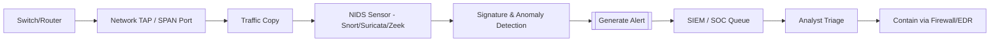
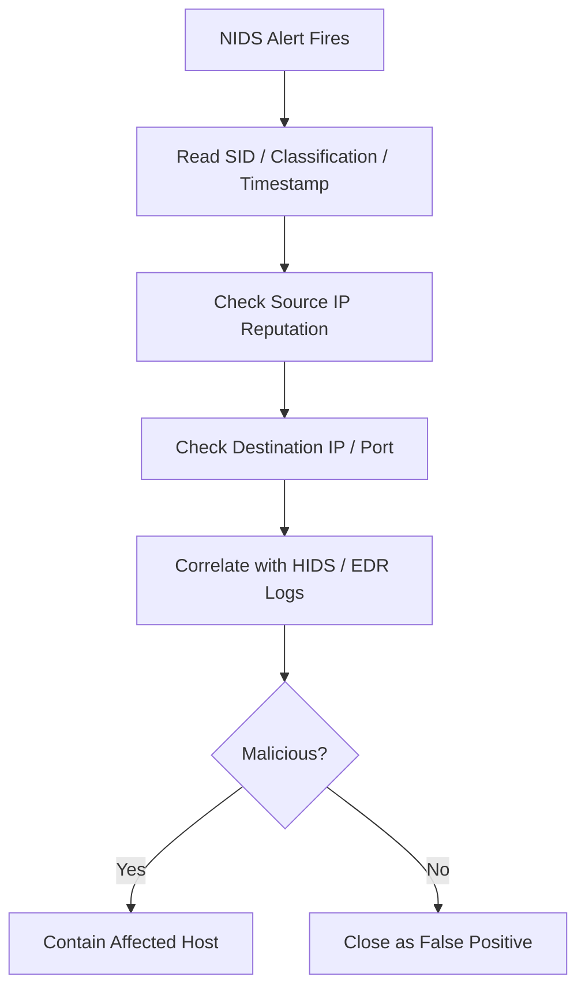

# Network Intrusion Detection Systems (NIDS)

## TCM Exam Objectives

Before taking the PSAA exam, you must be able to:

- Differentiate between HIDS and NIDS and their appropriate deployment scenarios
- Compare signature-based vs. anomaly-based detection methodologies
- Describe Snort and Suricata architectures, modes, and runmodes
- Explain inline vs. out-of-band monitoring and when to use each
- Compare flow data analysis (NetFlow/IPFIX) with full packet capture (PCAP)
- Interpret IDS/IPS alert fields for triage and incident response
- Deploy and configure network monitoring using TAPs and SPAN ports
- Correlate NIDS alerts with other telemetry sources for incident validation

A Network Intrusion Detection System (NIDS) is a security technology that monitors network traffic for suspicious activity and generates alerts when such activity is detected. A NIDS is a detection tool, not a prevention tool. It is deployed out-of-band, receives a copy of network traffic, and cannot block traffic. When a NIDS fires an alert, it is often the first indicator of an incident that a SOC analyst will triage.?turn0search0??turn0search1?

- Core concept and definition
- Detection methodologies (signature vs. anomaly)
- NIDS deployment using TAPs and SPAN ports
- Alert analysis and interpretation
- Essential NIDS tools (Snort, Suricata, Zeek)
- NIDS vs. NIPS distinction


## Detection Methodologies

### Signature-Based Detection

Matches network traffic against a database of predefined patterns (signatures or rules). A signature might look for a specific byte sequence, a particular string in an HTTP request, or a known malicious IP address.

**Strengths**: High accuracy for known threats, low false positive rate, easy to understand and document.

**Weaknesses**: Cannot detect zero-day attacks, susceptible to evasion via small modifications to exploit code.

### Anomaly-Based Detection

Builds a baseline of normal network traffic and alerts on deviations from that baseline. Uses statistical models, machine learning, or rule-based profiles.

**Strengths**: Can detect novel attacks and zero-day exploits, difficult for attackers to evade.

**Weaknesses**: High false positive rate, requires a learning period, difficult to tune.

| Detection Method | Key Mechanism | Primary Advantage | Primary Disadvantage |
| :--- | :--- | :--- | :--- |
| **Signature-Based** | Matches traffic against known patterns | Low false positives, accurate for known threats | Cannot detect zero-day or obfuscated attacks |
| **Anomaly-Based** | Alerts on deviations from baseline | Can detect novel and zero-day attacks | High false positives, difficult to tune |
---



## NIDS Deployment

A NIDS is the quintessential out-of-band tool. It receives a copy of network traffic, never the live flow.

**Primary Connection Methods**:
- **Network TAP**: A hardware device that physically splits a network connection, sending one copy to production and an identical copy to the NIDS. TAPs are reliable and never drop packets.
- **SPAN/Mirror Port**: A switch configuration that copies traffic from source ports to a destination port where the NIDS is connected. Easier to set up but can drop packets under load.

Because a NIDS is out-of-band, it cannot block traffic. If an alert fires, the connection it detected may have already completed. The analyst must determine if the attack was successful and initiate response using other tools (firewall, EDR).

---

?? **Exam Tip:** When writing incident reports, use the STAR method: Situation (what was alerted), Task (what you needed to find), Action (tools and filters used), Result (IOCs confirmed and remediation steps).


## Analyzing NIDS Alerts

### Anatomy of a Typical Alert

```
[**] [1:2018954:6] ET TROJAN Likely Malicious SSL Cert (Fake Gmail) [**]
[Classification: A Network Trojan was Detected]
[Priority: 1]
05/17-14:32:10.123456 192.168.1.100:49155 -> 203.0.113.5:443
```

### Key Alert Fields for Triage

| Field | What It Tells You | Triage Action |
| :--- | :--- | :--- |
| **Alert Message/SID** | The rule that triggered | Google the SID; understand what it detects |
| **Classification & Priority** | Severity (Priority 1 is highest) | Prioritize your work |
| **Timestamp** | When the event occurred | Ground truth for your timeline |
| **IP Addresses & Ports** | Source and destination | Foundation of your investigation |
| **Protocol** | TCP, UDP, ICMP | Provides context |
| **Flags** | TCP state | SYN = initial connection; ACK+PSH = active session |

---

## Essential NIDS Tools

| Tool | Type | Key Characteristics |
|------|------|---------------------|
| **Snort** | Open-source NIDS/NIPS | Industry standard, signature-based, simple rule language. Can be deployed out-of-band (IDS) or inline (IPS). |
| **Suricata** | Open-source IDS/IPS/NSM | Multi-threaded architecture, handles higher traffic volumes. Compatible with Snort rulesets. Rich JSON logging (eve.json). |
| **Zeek (Bro)** | Open-source NSM | Not signature-based. Creates comprehensive transaction logs (connections, HTTP, DNS, SSL) for behavioral analysis. |

<details>
<summary>?? NIDS vs. NIPS Comparison</summary>

| Feature | NIDS | NIPS |
|---------|------|------|
| Core Function | Detects and alerts | Detects, blocks, and prevents |
| Deployment | Out-of-Band (copy of traffic) | Inline (directly in traffic path) |
| Ability to Block | No | Yes (drop, reset, quarantine) |
| Network Impact | Zero impact | Adds latency, potential single point of failure |
| Primary Use Case | Visibility, monitoring, forensics | Active threat prevention, real-time blocking |
| Common Tools | Snort (IDS mode), Suricata (IDS mode), Zeek | Snort (IPS mode), Suricata (IPS mode), NGFWs |

When you see a NIDS alert, the NIDS was not in a position to stop the traffic. Determine if the attack was successful and find the device that CAN contain it.
</details>

---

## Applicability to the PSAA

On the PSAA exam, NIDS knowledge is tested through:
1. **Alert Triage**: Given a list of NIDS alerts, prioritize them by classification, destination IP reputation, and source host criticality.
2. **Incident Investigation**: A NIDS alert is the starting point; pivot to Wireshark, SIEM, or host logs to determine scope.
3. **Report Writing**: Document the NIDS alert as primary evidence, correctly interpreting timestamp, SID, source/destination.
4. **Tool Selection**: Recommend NIDS for passive detection or NIPS for active blocking based on scenario requirements.

---

## Recap

A NIDS is an out-of-band detection tool that monitors network traffic using signature-based (matching known patterns) or anomaly-based (deviation from baseline) detection. Signature-based detection is accurate for known threats but cannot detect zero-days; anomaly-based detection can find novel attacks but generates more false positives. NIDS is deployed via TAPs or SPAN ports and cannot block traffic. Key tools include Snort (signature standard), Suricata (multi-threaded high-performance), and Zeek (behavioral metadata). Analysts must dissect alert fields (SID, classification, timestamp, IPs, flags) to drive investigation. NIDS is the first evidence point in the incident response process.?turn0search2??turn0search3?

