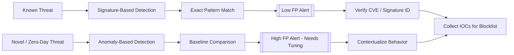
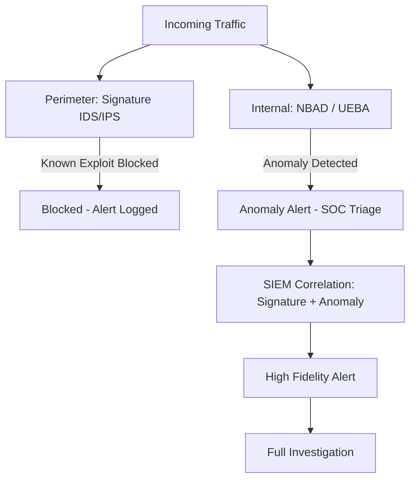

# Signature-Based vs. Anomaly-Based Detection

## TCM Exam Objectives

Before taking the PSAA exam, you must be able to:

- Differentiate between HIDS and NIDS and their appropriate deployment scenarios
- Compare signature-based vs. anomaly-based detection methodologies
- Describe Snort and Suricata architectures, modes, and runmodes
- Explain inline vs. out-of-band monitoring and when to use each
- Compare flow data analysis (NetFlow/IPFIX) with full packet capture (PCAP)
- Interpret IDS/IPS alert fields for triage and incident response
- Deploy and configure network monitoring using TAPs and SPAN ports
- Correlate NIDS alerts with other telemetry sources for incident validation

Every SOC defends against a constantly shifting threat landscape. Some attacks are well-understood and leave a precise fingerprint (known exploit payload, specific malware hash), while others are novel, low-and-slow, or zero-day. To cover both, the industry relies on two complementary detection philosophies: signature-based detection (matching known-bad patterns exactly) and anomaly-based detection (identifying deviations from normal behavior). Neither is sufficient alone.?turn0search0??turn0search1?

- Signature-based detection deep dive
- Anomaly-based detection deep dive
- Side-by-side comparison
- Hybrid approaches in the real-world SOC
- Analyst workflows for each detection type

## Signature-Based Detection

Signature-based detection uses pre-defined patterns (signatures or rules) to identify specific malicious activity. Patterns can look for exact byte sequences in network packets, file hashes associated with known malware, registry key values used by specific malware families, or specific log event combinations.

**Analogy**: Like a Most Wanted poster � you only catch criminals whose face you already have on the wall.

### How It Works

1. Threat intelligence feed or research team produces a signature (e.g., `alert tcp any any -> any 445 (msg:"ET EXPLOIT EternalBlue"; content:"|ff 53 4d 42|"; ...)`).
2. The signature is loaded into a sensor (IDS/IPS, antivirus, SIEM).
3. The sensor inspects every network packet, file, or log stream for a match.
4. On match, an alert is fired and handed to the SOC for triage.

**Common signature languages**: Snort/Suricata rules (network IDS), YARA rules (file/memory pattern matching), Sigma rules (SIEM-agnostic log events), STIX/OpenIOC (indicators of compromise).

### Strengths

- High precision with low false positives
- Deterministic and automatable
- Fast to triage � analyst can look up signature ID or CVE
- Maps directly to known threats for reporting

### Weaknesses

- Cannot detect unknown (zero-day) threats
- Easily evaded through encoding, obfuscation, or encryption
- Requires constant signature library updates
- May not scale across different environments
---

## Anomaly-Based Detection

Anomaly detection builds a model of normal behavior and alerts on deviations that exceed a threshold. The baseline can be statistical (mean + 3 standard deviations), machine-learning-driven, or rule-based. It does not look for a known-bad pattern; instead, it asks: Is this behavior unusual for this user, asset, or network?

**Analogy**: A neighborhood watch noticing someone walking down the street at 3 AM with a ladder � not a known criminal, but the behavior is suspicious.

### How It Works

1. **Baseline creation**: The system observes traffic, logs, or user activity over a learning period.
2. **Continuous monitoring**: Live data is compared to the baseline using algorithms.
3. **Deviation scoring**: Each data point receives an anomaly score. If it exceeds a threshold, an alert is generated.
4. **Tuning**: Analysts feed back false positives to adjust thresholds.

**Example alerts**: "User John.Doe downloaded 2.3 GB from an external server; his daily average is 45 MB." "Host made 4,372 failed login attempts to 57 different internal hosts in 5 minutes."

### Strengths

- Detects unknown threats, zero-days, and insider threats
- Difficult to evade � attackers do not know your baseline
- Covers broad spectrum: data exfiltration, lateral movement, credential abuse, C2 beaconing

### Weaknesses

- High false positive rate (by default)
- Requires extensive tuning and training period
- Explainability challenges with ML-based models
- Concept drift � normal evolves over time, requiring retraining

---

?? **Exam Tip:** Master the difference between capture filters and display filters. Capture filters (BPF) discard at kernel level; display filters only hide packets. Use capture filters for large PCAPs to reduce file size before analysis.

## Side-by-Side Comparison

| Aspect | Signature-Based | Anomaly-Based |
|--------|-----------------|---------------|
| **What it detects** | Known threats (specific IOCs, CVE exploits) | Unknown, zero-day, and insider threats |
| **How it detects** | Exact pattern matching against signatures | Deviation from statistical/ML baseline |
| **False positives** | Low | High, especially before tuning |
| **False negatives** | High for novel threats | Lower for novel threats |
| **Maintenance** | Frequent signature updates | Baseline retraining, FP feedback loop |
| **Speed of detection** | Immediate, upon match | Dependent on baseline window |
| **Explainability** | High � directly linked to known threat | Lower � deeper investigation needed |
| **Evasion difficulty** | Easy � change a byte, obfuscate | Hard � must know normal and mimic it |
| **Common tools** | Snort, Suricata, ClamAV, YARA, Sigma | Splunk UBA, Sentinel UEBA, Darktrace, Vectra, Zeek |

---

## Hybrid Approaches in the Real-World SOC

Almost no SOC relies exclusively on one paradigm. A layered detection stack includes:
1. **Signature-based perimeter IDS/IPS** � stops known exploits at the boundary.
2. **Heuristic/behavioral signatures** � advanced rules detecting protocol anomalies.
3. **Network behavior anomaly detection (NBAD)** � baseline internal traffic for lateral movement and beaconing.
4. **User and Entity Behavior Analytics (UEBA)** � anomaly on user activity for credential theft and insider threats.
5. **SIEM correlation rules** � combine signature hits with anomaly scores for high-fidelity alerts.

---

## Analyst Workflows

### Triaging a Signature-Based Alert

1. Identify the signature name/ID and look up its meaning (CVE, malware family).
2. Verify the target system is vulnerable (OS, patch level).
3. Check if the alert is a false positive due to benign traffic matching the pattern.
4. If true positive, contain the host and escalate.

### Triaging an Anomaly-Based Alert

1. Determine the entity (user, IP, host) and the anomalous behavior (volume, time, destination).
2. Check for a legitimate explanation: known backup job, maintenance window, new application.
3. Look at related log sources and flow data to contextualize the anomaly.
4. If no benign explanation exists and behavior aligns with attack phases (C2, exfiltration), escalate.

Signature-based detection matches known-bad patterns with high precision but cannot detect novel attacks. Anomaly-based detection identifies deviations from normal behavior, catching unknown threats at the cost of higher false positives. A mature SOC uses both: signatures for quick detection of common threats, anomaly for advanced persistent threats and insider activity. Triaging signature alerts focuses on vulnerability context; triaging anomaly alerts focuses on justifying behavior as malicious vs. benign. The PSAA evaluates the ability to distinguish these methods and apply the correct investigative workflow.?turn0search2??turn0search3?