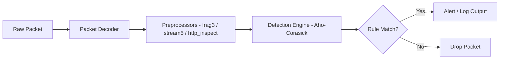
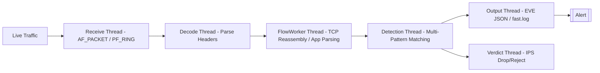
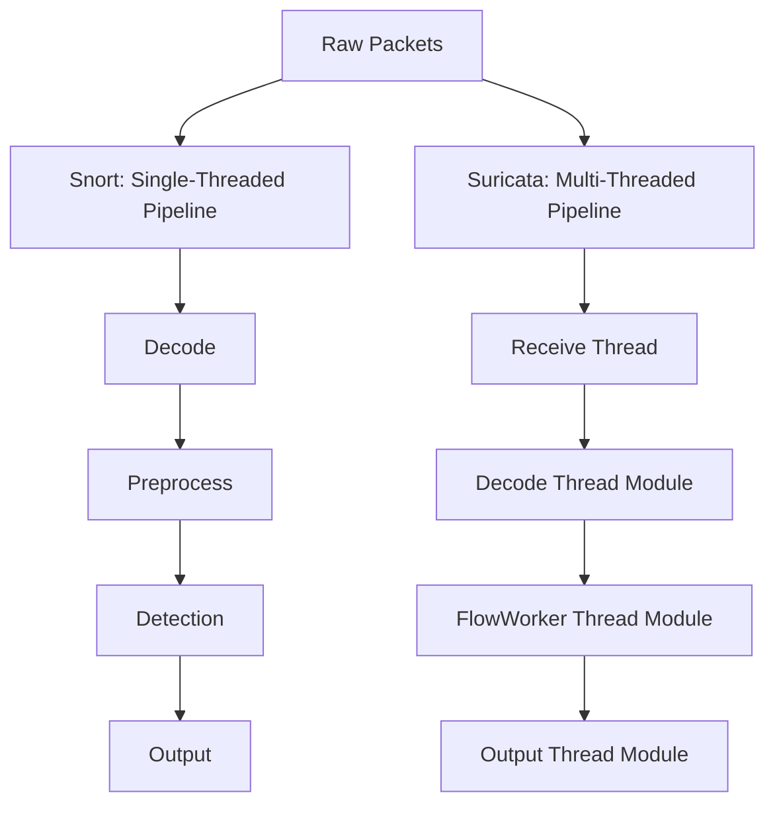

# Snort and Suricata Architectures

## TCM Exam Objectives

Before taking the PSAA exam, you must be able to:

- Differentiate between HIDS and NIDS and their appropriate deployment scenarios
- Compare signature-based vs. anomaly-based detection methodologies
- Describe Snort and Suricata architectures, modes, and runmodes
- Explain inline vs. out-of-band monitoring and when to use each
- Compare flow data analysis (NetFlow/IPFIX) with full packet capture (PCAP)
- Interpret IDS/IPS alert fields for triage and incident response
- Deploy and configure network monitoring using TAPs and SPAN ports
- Correlate NIDS alerts with other telemetry sources for incident validation

Snort and Suricata are the two leading open-source NIDS engines. Understanding their internal architectures is key to configuring them, analyzing their alerts, and understanding how design impacts performance and detection capabilities. Snort 2.x is single-threaded, Snort 3 introduces multi-threading, and Suricata was built from the ground up as a multi-threaded NIDS with advanced protocol parsing and JSON logging.?turn0search0??turn0search1?

- Snort 2.x architecture and components
- Snort 3 multi-threaded overhaul
- Suricata multi-threaded design and runmodes
- Head-to-head architectural comparison
- Practical implications for SOC analysts


## Snort Architecture

### Snort 2.x Single-Threaded Design

Snort 2.x is single-threaded: one main thread handles packet capture, decoding, preprocessing, detection, and output sequentially. This cannot efficiently utilize multi-core CPUs, limiting throughput on high-speed networks.

### Core Components (Snort 2.x)

| Component | Function |
| :--- | :--- |
| **Packet Decoder** | Collects raw packets via libpcap, decodes link/network/transport headers |
| **Preprocessors** | Plug-ins that normalize and analyze packets before detection (frag3 reassembly, stream5 TCP reassembly, sfportscan, http_inspect) |
| **Detection Engine** | Applies rules to every packet using multi-pattern matching (Aho-Corasick) |
| **Logging and Alerting System** | Generates alerts and logs events |
| **Output Modules** | Sends alerts to databases, syslog, SIEMs |

### Snort Data Flow

```
[Network] -> (libpcap) -> [Packet Decoder] -> [Preprocessors] -> [Detection Engine] -> [Output]
```

### Snort Operation Modes

| Mode | Command | PSAA Relevance |
| :--- | :--- | :--- |
| **Sniffer** | `snort -v` | Debugging, quick analysis |
| **Packet Logger** | `snort -l /logdir` | Capturing evidence |
| **NIDS** | `snort -c /etc/snort/snort.conf` | Primary mode for exam scenarios |
| **Inline (IPS)** | `snort -Q` | Prevention when placed in traffic path |

### Snort 3 Multi-Threaded Overhaul

Snort 3 is a complete rewrite introducing multi-threading, a modular plugin architecture, Lua-based configuration, and Hyperscan regex engine support. Performance studies show it outperforms Snort 2.x and is on par with Suricata in many scenarios.
---



## Suricata Architecture




Suricata was released in 2009 specifically to overcome Snort's single-threaded limitation. It uses a multi-threaded architecture where different processing stages run in separate threads.

### Threads, Thread-Modules, and Queues

- **Threads**: OS-level threads that run concurrently.
- **Thread-Modules**: Each performs a single function (DecodeAFP, FlowWorker, OutputAFP).
- **Queues**: Packets are passed between threads via queues.

### Runmodes

| Runmode | Description | Use Case |
| :--- | :--- | :--- |
| **single** | Single thread does all work | Development, testing, low traffic |
| **workers** | Multiple threads; each runs a full packet pipeline | Best performance for live traffic; requires flow-aware load balancing (cluster_flow) |
| **autofp** | Separate capture threads decode, flow worker threads complete pipeline | PCAP file playback, certain IPS setups |

The **workers** runmode is generally recommended for production as it minimizes inter-thread communication overhead.

### Key Thread-Modules (Workers Runmode)

| Module | Function |
| :--- | :--- |
| **Receive** | Captures packets from NIC using AF_PACKET, PF_RING, Netmap |
| **Decode** | Parses link/network/transport headers |
| **FlowWorker** | Flow tracking, TCP reassembly, application-layer parsing, detection |
| **Output** | Writes alerts, logs (eve.json, fast.log), file extracts |
| **Verdict** | (IPS only) Applies drop/reject actions |

### Packet Capture and Load Balancing

Both directions of a flow must be processed by the same thread. AF_PACKET uses `cluster_flow` mode to hash packets by 5-tuple. PF_RING also supports `cluster_flow`. RSS on modern NICs can interfere, requiring reduction to 1 queue or a symmetric RSS key.

### Rules Compatibility

Suricata is fully compatible with Snort rules. Most Snort VRT and Emerging Threats rules work without modification, though some keywords have subtle differences in behavior.
---

?? **Exam Tip:** On the PSAA exam, always document your analysis methodology step-by-step in the incident report. Include timestamps, source/destination IPs, and the specific evidence that supports your conclusion.


## Head-to-Head Architectural Comparison

| Feature | Snort 2.x | Snort 3.x | Suricata (6.x/7.x) |
| :--- | :--- | :--- | :--- |
| **Threading Model** | Single-threaded | Multi-threaded (plugin-based) | Multi-threaded (worker-pipeline) |
| **Configuration** | snort.conf (text) | Lua-based, JSON schema | YAML (suricata.yaml) |
| **Packet Capture** | libpcap (single thread) | Multiple capture plugins | AF_PACKET, PF_RING, Netmap, DPDK |
| **Preprocessors** | Static C plugins | Modular inspectors | Thread-modules (TM) |
| **Detection Engine** | Aho-Corasick + rule tree | Hyperscan + new rule engine | Multi-pattern matcher + flow-based |
| **Output Formats** | Unified2 + basic text | JSON (EVE) + Unified2 replacement | EVE JSON (very rich), fast.log, pcap log |
| **Application Parsing** | Preprocessors (http_inspect) | Inspectors | Integrated into FlowWorker (HTTP, DNS, TLS, SMB) |
| **IPS Support** | Via -Q flag + DAQ | Native inline API | Native inline with AF_PACKET, NFQ |
| **Performance** | Low (single core) | Medium-High | Highest (optimized multi-core) |
| **Rule Language** | Snort 2.x keyword set | Extended keyword set, Lua | Snort-compatible + Suricata-specific |

---

## PSAA Exam Relevance

In the PSAA exam, architectural knowledge is tested through practical scenarios:
- **Alert Triage**: Receive Suricata `eve.json` or Snort alert and understand field origins.
- **Tool Selection**: Recommend Suricata in workers mode for 10Gbps environments based on multi-threaded architecture.
- **Performance Tuning**: Identify packet drops from stats.log and suggest switching from single to workers runmode.
- **Rule Language Differences**: Identify why a Snort rule fails in Suricata (e.g., keyword behavior differences).

---

## Recap

