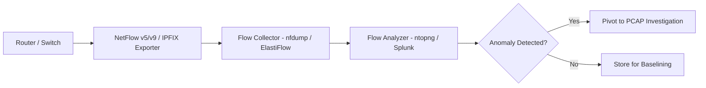
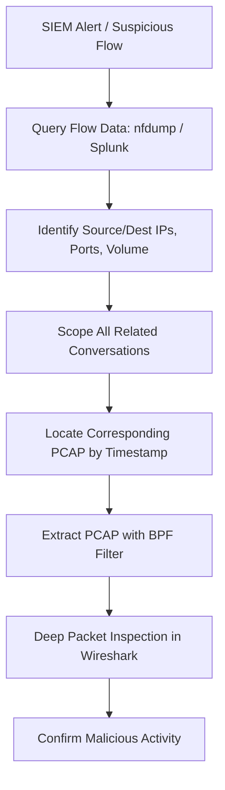

# Flow Data Analysis (NetFlow, IPFIX) vs. Packet Capture

## TCM Exam Objectives

Before taking the PSAA exam, you must be able to:

- Differentiate between HIDS and NIDS and their appropriate deployment scenarios
- Compare signature-based vs. anomaly-based detection methodologies
- Describe Snort and Suricata architectures, modes, and runmodes
- Explain inline vs. out-of-band monitoring and when to use each
- Compare flow data analysis (NetFlow/IPFIX) with full packet capture (PCAP)
- Interpret IDS/IPS alert fields for triage and incident response
- Deploy and configure network monitoring using TAPs and SPAN ports
- Correlate NIDS alerts with other telemetry sources for incident validation

Flow data (NetFlow, IPFIX, sFlow) provides summarized metadata about network conversations - who talked to whom, when, for how long, and how much data was exchanged - at a fraction of the storage and processing cost of full packets. Full PCAP records every header and payload, enabling deep-packet inspection, session reconstruction, and malware extraction. Neither approach is universally superior; each answers different questions during an investigation.?turn0search0??turn0search1?

- Flow data fundamentals (NetFlow, IPFIX, sFlow)
- Full packet capture (PCAP) deep dive
- Side-by-side comparison
- SOC use cases for each
- Hybrid flow-first workflow


## Flow Data Deep Dive

A flow is a unidirectional sequence of packets sharing the same five-tuple: source IP, destination IP, source port, destination port, and protocol. Flow-export protocols aggregate these into compact records.

**Analogy**: Flow data is like a phone bill - you see who called whom, when, and for how many minutes, but not the conversation. PCAP is the full wiretap recording.

### NetFlow vs. IPFIX vs. sFlow

| Protocol | Creator | Standard | Key Features | Typical Use |
|----------|---------|----------|--------------|-------------|
| **NetFlow v5** | Cisco | Proprietary | Fixed record format, 7-tuple keys, no IPv6/MPLS | Legacy traffic accounting |
| **NetFlow v9** | Cisco | IETF basis for IPFIX | Template-based, flexible, IPv6/MPLS support | Modern flow export |
| **IPFIX** | IETF (RFC 7011) | Open standard | Template-based, extensible, variable-length fields | Multi-vendor enterprise monitoring |
| **sFlow** | InMon, HP | RFC 3176 | Packet sampling, stateless, embeds raw headers | High-speed switching, DDoS detection |

### Flow Record Contents

A typical NetFlow/IPFIX record includes: source/destination IPs, source/destination ports, protocol number, input/output interface indexes, start/end timestamps, packet/byte counts, Type of Service byte, TCP flags (cumulative), and optional routing information.

### Flow Export Architecture

```
[Router/Switch] -> [NetFlow/IPFIX Exporter] -> [Collector] -> [Analyzer/SIEM]
```

1. **Exporter**: Enabled on routers, switches, firewalls. Aggregates packets into flows.
2. **Collector**: Receives and stores flow records (e.g., nfdump, Kafka).
3. **Analyzer**: Queries and visualizes flow data (e.g., ElastiFlow, ntopng, Splunk TA-netflow).

### Advantages of Flow Data
- Lightweight (~100-200 bytes per flow record)
- Scalable - months of retention vs. hours of PCAP
- Widely available - most routers/switches support it
- Ideal for baselining and anomaly detection

### Limitations of Flow Data
- No payload visibility
- Sampled or delayed export
- Limited TCP flag detail
- Cannot see inside encrypted tunnels
---



## Full Packet Capture (PCAP) Deep Dive

PCAP records every byte of every packet that crosses a network interface: Layer-2 headers through application payload. It is the gold standard for forensic investigation.

### How PCAP is Generated

- **SPAN/Mirror ports**: Switches copy traffic to a monitor port
- **Network TAPs**: Hardware devices that passively split signals
- **Packet brokers**: Aggregate and filter traffic to capture appliances
- **Software probes**: tcpdump, Wireshark, Snort, Suricata

### What PCAP Enables That Flows Cannot

- Deep Packet Inspection (DPI) - inspect application headers and payloads
- File carving - extract transferred files (malware samples, documents)
- Session reconstruction - replay entire TCP streams
- Protocol anomaly detection - spot malformed packets or violations
- Compliance evidence - legally required for breach reporting

### PCAP Drawbacks

- Massive storage: 1 Gbps link generates ~100+ GB per day
- Enterprise PCAP infrastructure can cost $400k-$600k over five years
- Performance overhead on production hosts
- Encrypted payloads require keys for decryption

---

?? **Exam Tip:** When triaging alerts, prioritize by severity and potential business impact. A single true positive C2 alert is more critical than 1,000 false positive scan alerts.


## Side-by-Side Comparison

| Aspect | Flow Data (NetFlow/IPFIX) | Full Packet Capture (PCAP) |
|--------|---------------------------|----------------------------|
| **Data captured** | Metadata (IPs, ports, protocol, timestamps, byte/packet counts) | Complete packets (headers + payload) |
| **Storage per day (1 Gbps)** | ~1-5 GB | ~100-200 GB (uncompressed) |
| **Typical retention** | Months to years | Hours to days |
| **Scalability** | High; aggregates across WAN | Low; requires dedicated capture points |
| **Payload visibility** | None | Full |
| **Use in alerting** | Traffic anomalies, DDoS, beaconing | Signature-based IDS, DPI, file extraction |
| **Forensic depth** | Low; confirms communication | High; reconstructs sessions, extracts files |
| **Typical SOC workflow** | First-look triage, baselining | Deep-dive investigation of confirmed incidents |
| **Example tools** | ElastiFlow, ntopng, Splunk TA-netflow | Wireshark, tcpdump, Arkime, NetworkMiner |

---

## SOC Analyst Use Cases

### DDoS Detection with Flow Data

Flow data is ideal for detecting volumetric DDoS attacks. By monitoring for sudden increases in packets per second or bits per second toward a specific destination IP, analysts can quickly identify SYN floods, UDP reflection/amplification, and carpet-bombing attacks without inspecting payloads.

### Lateral Movement Detection

Flow data reveals internal reconnaissance often missed by logs: a single host communicating with many others on ports 445 (SMB) or 3389 (RDP) suggests lateral spread. Periodic low-volume traffic to a suspicious external IP (beaconing) suggests C2 communication.

### Incident Response: Flow-First, Then PCAP


1. **Triage**: Query flow data to identify hosts, timing, data volume.
2. **Scope**: Find all internal hosts communicating with the suspicious IP.
3. **Pivot to PCAP**: Retrieve corresponding PCAP for deep forensic analysis.

---

## Tools of the Trade

**Flow Data Tools**: ElastiFlow (open-source collector), ntopng (web-based analysis), Splunk TA-netflow (SIEM integration), Kentik (cloud-scale), FastNetMon (DDoS detection).

**PCAP Tools**: Wireshark (GUI gold standard), tcpdump (command-line capture), Arkime/Moloch (full-packet indexing), Suricata/Snort (IDS with PCAP output), NetworkMiner (passive forensic analysis).



Flow data (NetFlow/IPFIX) provides compact metadata ideal for baselining, anomaly detection, and long-term retention at low storage cost. Full PCAP provides the payload evidence needed for forensic confirmation and legal compliance at high storage cost. The hybrid workflow uses flow data for broad triage and scoping, then pivots to PCAP for deep investigation of confirmed incidents. NetFlow v9 and IPFIX are the modern template-based protocols. Encryption limits both approaches: flow data shows that encrypted conversations exist, PCAP captures encrypted payloads but needs keys to decrypt.?turn0search2??turn0search3?