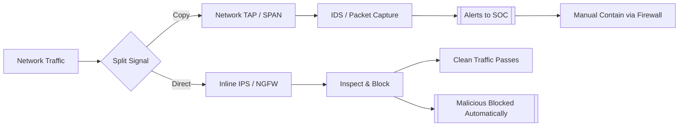
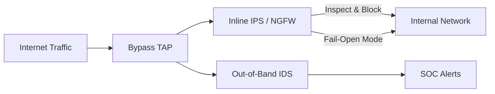

# Inline vs. Out-of-Band Monitoring

## TCM Exam Objectives

Before taking the PSAA exam, you must be able to:

- Differentiate between HIDS and NIDS and their appropriate deployment scenarios
- Compare signature-based vs. anomaly-based detection methodologies
- Describe Snort and Suricata architectures, modes, and runmodes
- Explain inline vs. out-of-band monitoring and when to use each
- Compare flow data analysis (NetFlow/IPFIX) with full packet capture (PCAP)
- Interpret IDS/IPS alert fields for triage and incident response
- Deploy and configure network monitoring using TAPs and SPAN ports
- Correlate NIDS alerts with other telemetry sources for incident validation

The distinction between inline and out-of-band monitoring comes down to whether the security tool sits directly in the critical path of network traffic. Out-of-band tools receive a copy of traffic for detection and analysis but cannot block attacks. Inline tools sit directly in the traffic path, enabling real-time blocking and prevention but introducing latency and potential single points of failure. Understanding this distinction is fundamental to alert triage, network design, and incident response.?turn0search0??turn0search1?

- Core concepts and definitions
- Out-of-band monitoring in depth
- Inline monitoring in depth
- Head-to-head comparison
- Hybrid architectures

## Out-of-Band Monitoring

A tool is out-of-band when it does not sit in the live traffic path. It receives a copy of the network packets, allowing it to observe and analyze but not block or modify the original packet flow.

### How It Works

A network TAP (Test Access Point) or SPAN (Switched Port Analyzer) port makes a copy of the desired traffic and sends that copy to the monitoring tool.

**Key characteristic**: Passive, out of the data path. If the monitoring tool fails, the live network is completely unaffected.

### Physical Deployment Options

- **Network TAP**: Purpose-built hardware that duplicates the electrical or optical signal without introducing delay or point of failure.
- **SPAN/Mirror Port**: Switch feature that copies traffic from source ports/VLANs to a destination port. Can drop packets under heavy load.

### Operational Characteristics

- **Failure Mode**: Fail-open. Tool crash has no effect on live network.
- **Latency**: Zero latency added to traffic path.
- **Limitations**: Cannot stop an attack in progress. Purely reactive.

---

## Inline Monitoring

A tool is inline when it is placed directly in the path of network traffic. All packets flow through the device, allowing it to inspect, block, modify, or rate-limit traffic in real time.

### How It Works

The security appliance is physically connected between two network segments. Packets enter one interface, are inspected, and (if allowed) are forwarded out the other interface.

**Key characteristic**: Active, in-path. The tool's performance and reliability directly impact network latency and availability.

### Physical Deployment Options

- **Direct Inline Connection**: The appliance's two interfaces act as a logical bridge. All traffic must pass through.
- **Bypass TAP (Active Bypass)**: A specialized TAP that connects the inline tool. If the tool fails, the bypass TAP automatically closes the circuit to keep the network link up.

### Operational Characteristics

- **Failure Mode**: Fail-closed (tool blocks all traffic) or fail-open (using bypass TAP). A single inline tool is a potential single point of failure.
- **Latency**: Introduces small processing latency.
- **Power**: Can actively block, reset, quarantine, or re-route malicious traffic.

---

## Head-to-Head Comparison

| Feature | Out-of-Band Monitoring | Inline Monitoring |
| :--- | :--- | :--- |
| **Position in Network** | Outside main data path (receives copy) | Directly in data path (traffic flows through) |
| **Primary Function** | Detection, analysis, forensics | Prevention, blocking, enforcement |
| **Typical Tools** | IDS, NetFlow collectors, packet brokers | IPS, NGFW, inline sandbox, WAF |
| **Ability to Block** | No - can only alert and report | Yes - can drop, block, or modify packets |
| **Network Impact** | None (no latency, no failure risk) | Adds latency; bottleneck/SPOF risk |
| **Failure Mode** | Fail-open: network unaffected | Fail-closed unless bypass TAP used |
| **Cost** | Lower hardware cost, simpler to deploy | Higher cost; high-performance hardware needed |
| **Main Use Case** | Monitoring, incident response, compliance | Active threat prevention, policy enforcement |
---

?? **Exam Tip:** When writing incident reports, use the STAR method: Situation (what was alerted), Task (what you needed to find), Action (tools and filters used), Result (IOCs confirmed and remediation steps).

## Hybrid Architectures

Modern SOC environments rarely rely on one method alone. Defense-in-depth uses both:

- **Out-of-Band IDS** to passively monitor for anomalies and alert the SOC.
- **Inline IPS** behind a Bypass TAP to automatically block known malicious traffic.
- **Packet Brokers** that aggregate traffic from multiple TAPs and SPAN ports, filter it, and forward to both inline and out-of-band tools.

This ensures the SOC maintains deep visibility (OOB) while still being able to actively shut down an attack in progress (Inline).

---

## Essential Tools by Deployment Type

| Tool | Typical Deployment | Role |
| :--- | :--- | :--- |
| **Zeek (Bro)** | Out-of-Band | Network security monitor; rich metadata and logs |
| **Snort/Suricata** | Can be both | Often OOB as IDS; can be inline as IPS |
| **Wireshark / tcpdump** | Out-of-Band | Packet capture and analysis |
| **Palo Alto / Fortinet NGFW** | Inline | Next-Gen Firewall with inline blocking |
| **Network TAP** | Supporting both | Enables copying (OOB) or active bypass (Inline) |

---

## PSAA Exam Relevance

The PSAA tests this concept through practical scenarios:

1. **Network Diagram Analysis**: Identify which sensors are inline vs. out-of-band and explain what each can do.
2. **Alert Triage**: Recognize that an IDS deployed out-of-band could not block the traffic. Determine if the connection was successful and how to contain it.
3. **Tool Selection**: Recommend inline IPS for active prevention or out-of-band IDS for visibility without risking downtime.
4. **Incident Reporting**: Document why a sensor being out-of-band limited its ability to stop the attack.

---

## Recap

Out-of-band monitoring receives a copy of traffic for detection and analysis. It adds no latency, fails open (network unaffected), and cannot block attacks. Tools include IDS and network forensics platforms. Inline monitoring sits in the traffic path for prevention and blocking. It adds latency, can fail closed (network down) without a bypass TAP, and requires high-performance hardware. Hybrid architectures combine both: OOB for detection and visibility, Inline for active blocking. The PSAA evaluates the ability to apply this knowledge to alert triage, network design, and incident response.?turn0search2??turn0search3?

