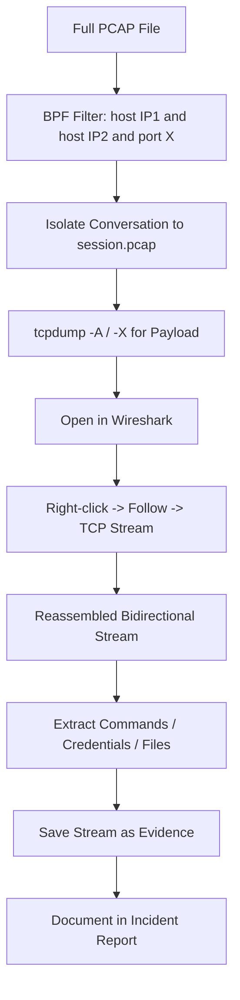
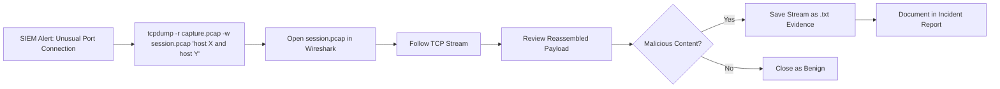

# Following TCP Streams

## TCM Exam Objectives

Before taking the PSAA exam, you must be able to:

- Apply Berkeley Packet Filter (BPF) syntax to isolate network traffic by host, port, and protocol
- Capture packets to PCAP files using tcpdump with appropriate flags and filters
- Filter traffic by TCP flag combinations (SYN, SYN-ACK, RST, FIN) for attack detection
- Read and interpret tcpdump output including flags, sequence numbers, and options
- Identify anomalous traffic patterns including port scans, DNS tunneling, and beaconing
- Follow TCP streams to reconstruct application-layer conversations
- Analyze specific flag combinations to detect reconnaissance and scanning activity
- Document network forensic findings in a professional incident report

Following TCP streams is the single most powerful technique for reconstructing application-layer conversations from raw packet captures. A TCP stream is the complete bidirectional conversation between two endpoints � from the initial three-way handshake through data exchange to the final teardown. In a SOC investigation, this answers questions like: what commands did the attacker run over a reverse shell, what data was exfiltrated, what credentials were transmitted, and what files were transferred.?turn0search0??turn0search1?

- What following a TCP stream means
- Following streams in Wireshark
- Following streams with tcpdump (command-line equivalent)
- Stream-first mental model for PSAA exam
- Practical exercise from alert to report


## What Following a TCP Stream Means

When you follow a TCP stream, the tool:
1. **Isolates** every packet belonging to that single conversation (matching source/destination IP:port pairs in both directions).
2. **Reassembles** the data payloads in correct sequence, handling retransmissions and out-of-order delivery.
3. **Displays** the reassembled payload in a human-readable format � ASCII, hex dump, or raw.

---

## Following TCP Streams in Wireshark

### Three Ways to Launch

| Method | Steps |
|--------|-------|
| **Right-click context menu** | Right-click any TCP packet > Follow > TCP Stream |
| **Menu bar** | Analyze > Follow > TCP Stream |
| **Keyboard shortcut** | Select TCP packet, press Ctrl+Alt+Shift+T |

### Anatomy of the Follow TCP Stream Dialog

- **Color coding**: Client traffic (initiator) is red; server traffic is blue.
- **Stream selector**: Counter in lower-right lets you jump between conversations.
- **Direction filter**: Entire conversation, Client->Server only, or Server->Client only.
- **Data format**: ASCII (best for text-based protocols), Raw, Hex Dump.

### Saving Stream Content as Evidence

Click **Save As...** to export the displayed stream content. This is critical for the PSAA incident report. If you find plain-text credentials or suspicious commands, save the stream as evidence.

**PSAA tip**: If you only want to isolate a conversation without seeing the reassembled content, open Follow TCP Stream and immediately close it. This leaves the conversation-isolation display filter in place.

### Following Other Protocol Streams

| Protocol | Use Case in PSAA |
|----------|------------------|
| **TLS/SSL** | Requires decryption key; view HTTPS traffic |
| **HTTP** | Reassembles request/response pairs directly |
| **HTTP/2** | Modern web traffic with multiplexed streams |
| **DNS** | Follow DNS query/response chains |
---



## Following TCP Streams with tcpdump

tcpdump cannot natively reassemble and display full application-layer streams like Wireshark, but it is essential for filtering and extracting conversation-specific traffic.

### Isolating a Single Conversation

```bash
tcpdump -r capture.pcap -w session.pcap \
  'host 192.168.1.100 and host 10.0.0.5 and port 4444'
```

### Extracting Payload Content

```bash
tcpdump -r session.pcap -A   # ASCII output
tcpdump -r session.pcap -X   # Hex + ASCII dump
tcpdump -r session.pcap -XX  # Hex + ASCII including link-layer headers
```

### Counting and Identifying Conversations

```bash
tcpdump -r capture.pcap -n 'tcp' | \
  awk '{print $3 " <-> " $5}' | \
  sed 's/:[0-9]*//g' | sort | uniq -c | sort -nr | head -10
```

### When to Use tcpdump vs. Wireshark

| Scenario | Best Tool |
|----------|-----------|
| Large PCAP files (100+ MB); extract one conversation quickly | tcpdump filter, then Wireshark |
| Looking for plain-text strings across a few packets | tcpdump -A or -X |
| Reconstructing full session for incident report | Wireshark Follow TCP Stream |
| Scripted analysis or automation | tcpdump |

---

?? **Exam Tip:** Correlate across multiple data sources. A suspicious IP address in network traffic is stronger evidence when confirmed by Windows Event Log ID 4625 (failed logon) or EDR process telemetry.


## Stream-First Mental Model for PSAA


1. **Identify** the suspicious conversation using Statistics or tcpdump aggregation.
2. **Isolate** it with a display filter or tcpdump filter.
3. **Follow** it in Wireshark.
4. **Extract** artifacts � save stream content containing IOCs.
5. **Document** in your report, describing what you saw and attaching the saved stream.

---

## Practical Exercise

**Scenario**: SIEM flagged host `192.168.1.105` connecting to `203.0.113.45` on port 4444. PCAP file provided.

```bash
tcpdump -r alert-1423.pcap -w suspect-stream.pcap \
  'host 192.168.1.105 and host 203.0.113.45 and port 4444'
```

**Step 2**: Open `suspect-stream.pcap` in Wireshark, right-click > Follow > TCP Stream.

**Step 3**: Interpret the content. Look for human-readable commands (whoami, dir), command prompts (C:\>, root@victim), Base64 blocks (Metasploit stagers).

**Step 4**: Save evidence and write finding:

> Finding: Connection from 192.168.1.105 to 203.0.113.45:4444 contains a fully interactive reverse shell. The attacker executed reconnaissance commands including whoami, ipconfig, and net user. Stream content saved as stream-4444.txt. Severity: Critical.

---

## Common Pitfalls and Exam Tips

- Do not confuse Follow TCP Stream with Follow HTTP Stream. TCP stream shows everything (handshake, ACKs, raw payload). HTTP stream only shows request/response bodies.
- If content looks garbled, it may be encrypted. The PSAA may provide TLS keys for decryption.
- Save evidence early. Export suspicious streams as soon as you find them.
- Use Close (not Back) after following a stream to keep the conversation filter active.

---

## Recap
