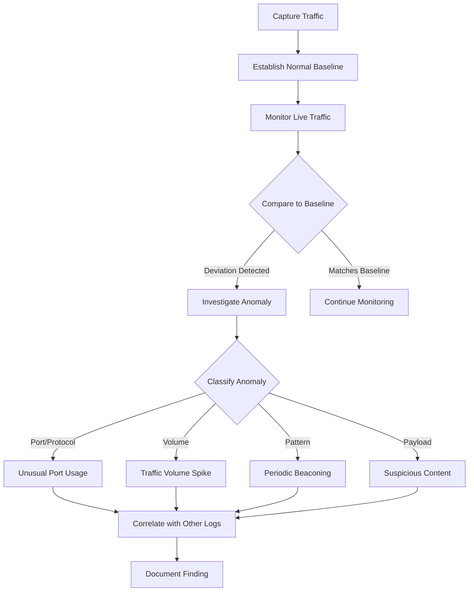
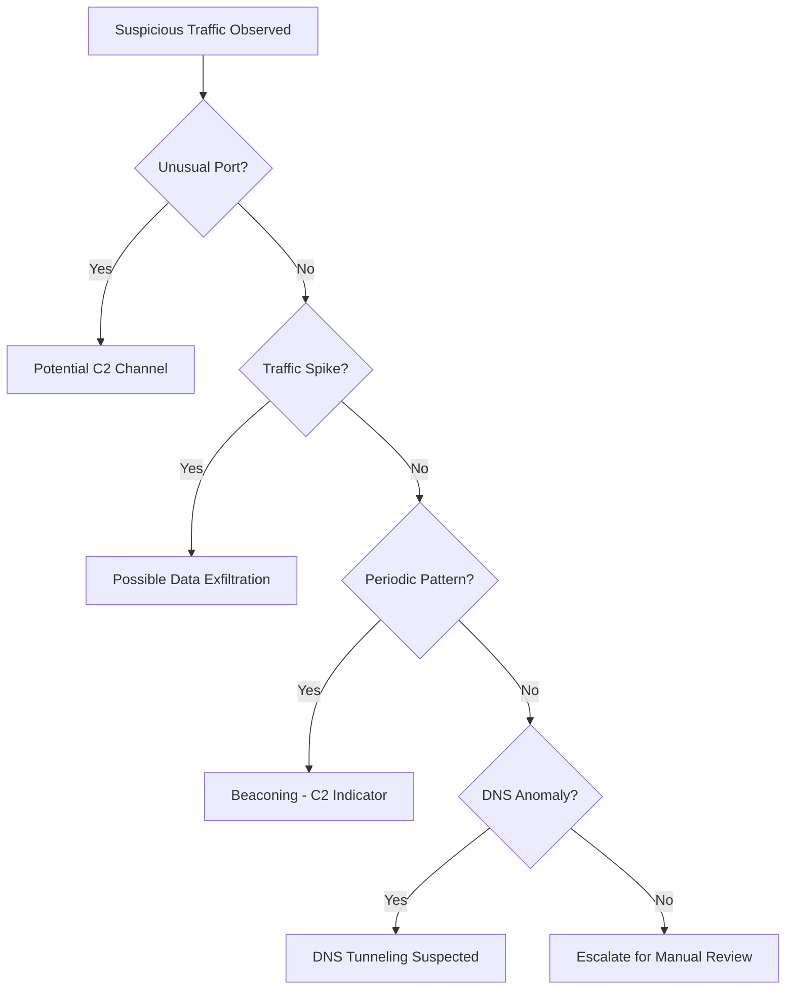

# Identifying Anomalous Traffic Patterns

## TCM Exam Objectives

Before taking the PSAA exam, you must be able to:

- Apply Berkeley Packet Filter (BPF) syntax to isolate network traffic by host, port, and protocol
- Capture packets to PCAP files using tcpdump with appropriate flags and filters
- Filter traffic by TCP flag combinations (SYN, SYN-ACK, RST, FIN) for attack detection
- Read and interpret tcpdump output including flags, sequence numbers, and options
- Identify anomalous traffic patterns including port scans, DNS tunneling, and beaconing
- Follow TCP streams to reconstruct application-layer conversations
- Analyze specific flag combinations to detect reconnaissance and scanning activity
- Document network forensic findings in a professional incident report

Identifying anomalous traffic is the fundamental method for detecting threats that have bypassed perimeter defenses. The core principle is "know normal, find weird" � an analyst must understand what normal traffic looks like for their environment to reliably spot anomalies. Malicious activity will always look different from the norm, whether through unusual port usage, traffic volume spikes, communication pattern changes, or payload content anomalies.?turn0search0??turn0search1?

- The core principle of anomaly detection
- The protocol trinity (HTTP, DNS, SMB)
- The methodology and toolkit
- Threat catalog of common anomalies
- Analysis techniques with tcpdump and Wireshark


## The Protocol Trinity

Most network analysis begins with a deep understanding of three core protocols:

**HTTP/HTTPS**: Web traffic is the most commonly abused. Anomalies often hide in plain sight within encrypted HTTPS tunnels.

**DNS**: A critical discovery and C2 channel for attackers. Normal DNS queries are short; long subdomains or high query rates indicate tunneling or DGA activity.

**SMB**: Primarily a Windows file-sharing protocol but also a primary vector for lateral movement. Understanding its normal operation is key to detecting internal propagation.
---



## The Methodology and Toolkit

### The Workflow: Capture, Analyze, Detect


### TCM Toolset for Anomaly Detection

| Category | Purpose | Core Tools |
| :--- | :--- | :--- |
| **Network Traffic Capture** | Acquiring raw data | tcpdump, Wireshark, netsh trace |
| **Network Traffic Analysis** | Sifting through captures | Wireshark, Zeek, NetworkMiner |
| **Network Detection** | Automated alerting | Snort, Suricata |
---

?? **Exam Tip:** Always save a copy of the original evidence before performing any analysis. Reference specific packet numbers, event IDs, and timestamps to demonstrate thorough investigation.


## Threat Catalog of Common Anomalies

### Protocol and Port Anomalies

- **Unusual port usage**: HTTP traffic over port 4444, DNS traffic to a non-DNS server on port 8080. Common indicator of malware C2.
- **Protocol mismatch**: SSH banner presented when expecting a web server. Suggests hidden service or backdoor.
- **Clear-text on encrypted channels**: Login form over HTTP instead of HTTPS. Credential harvesting red flag.

### Traffic Volume and Session Anomalies

- **Excessive traffic from single host**: Workstation suddenly initiating 10GB outbound connection. Classic data exfiltration or DDoS participation.
- **Unusually high DNS query rate**: Thousands of NXDOMAIN responses indicate DGA malware.
- **Large number of failed connections**: Rapid SMB (port 445) or RDP (port 3389) connection attempts indicate reconnaissance.

### Communication Pattern Anomalies

- **Periodic beaconing**: Outbound HTTPS connections exactly every 30 or 120 seconds to a low-reputation IP. Strong C2 indicator.
- **Off-hours activity**: Sales user authenticating to finance file server at 2:00 AM.
- **Direct external-to-internal communication**: External IP initiating connection directly to internal workstation, bypassing normal flow.

### Payload and Content Anomalies

- **Suspicious User-Agent strings**: Old browser versions, blank strings, or library defaults (python-requests/2.28.1).
- **DNS tunneling**: Queries with very long encoded subdomains: `dGhpcyBpcyBhIHR1bm5lbGluZyB0ZXN0.evil.com`
- **High entropy**: Encrypted or compressed data masquerading as text files.

---

## Analysis Techniques

### Detecting a SYN Port Scan

```bash
tcpdump -nnr capture.pcap 'tcp[tcpflags] & (tcp-syn) != 0 and tcp[tcpflags] & (tcp-ack) == 0'
```

Output shows rapid succession from same source IP, incrementing source ports, no SYN-ACK replies.

**Wireshark filter**: `ip.src == 192.168.1.100 && tcp.flags.syn == 1 && tcp.flags.ack == 0`

Then go to Statistics > Conversations to see destination IPs and ports.

### Detecting DNS Tunneling

```bash
tcpdump -nnr capture.pcap 'udp port 53'
```

Look for queries with very long subdomains and large query lengths (especially TXT records).

### Detecting HTTP C2 Beaconing

In Wireshark, right-click a suspicious POST request > Follow > HTTP Stream. Look for:
- Unusual Content-Type (application/octet-stream where form data expected)
- Non-human-readable or Base64-encoded request body
- Minimal server response (just "OK" with no HTML)

### Analyzing Suspicious TCP Connections

```bash
tcpdump -r capture.pcap -n 'tcp[tcpflags] & (tcp-syn) != 0 and tcp[tcpflags] & (tcp-ack) == 0' \
  | awk '{print $3}' | cut -d. -f1-4 | sort | uniq -c | sort -nr
```

---

## PSAA Cheat Sheet for Traffic Analysis

- **Methodology over memorization**: Master the analysis process (filter, follow, inspect, conclude).
- **Correlation is king**: Anomaly in PCAP correlates with Windows Event Log or SIEM alert.
- **Proficiency with core tools**: Complex Wireshark display filters, Statistics > Conversations, Follow TCP Stream, tcpdump host/port/protocol filters.
- **Thorough note-taking**: For every finding, document timestamp, source IP, destination IP, and why it is anomalous.

---

## Recap

